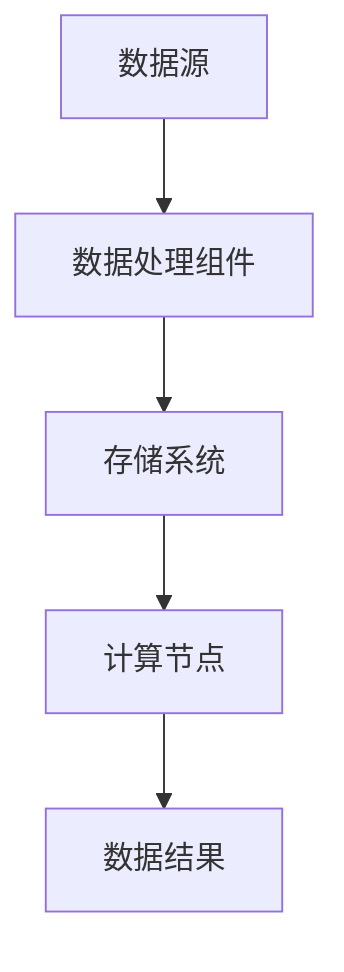

                 

### 文章标题

《大数据处理框架原理与代码实战案例讲解》

关键词：大数据处理框架、MapReduce、Hadoop、Spark、流处理、批处理、分布式系统、性能优化

摘要：
随着大数据时代的到来，大数据处理框架成为了数据科学和工程领域的重要工具。本文将深入探讨大数据处理框架的核心原理，通过代码实战案例详细讲解Hadoop、Spark等流行框架的应用。读者将了解从基础概念到实际操作的完整知识体系，掌握分布式数据处理的核心技能。

<|assistant|>### 1. 背景介绍

#### 大数据的兴起

大数据（Big Data）是指数据量巨大、类型繁多、价值密度低的数据集合。随着互联网的快速发展、物联网（IoT）的普及、移动设备的广泛使用，以及社交媒体的兴起，数据量呈爆炸式增长。传统的关系型数据库和简单的数据处理工具已经无法满足如此庞大的数据处理需求，催生了大数据处理框架的出现。

#### 大数据处理的重要性

大数据处理框架在各个行业有着广泛的应用。例如，在金融领域，大数据处理可以帮助银行和保险公司进行风险分析和精准营销；在医疗领域，大数据处理可以用于疾病预测和个性化治疗；在电商领域，大数据处理可以用于用户行为分析和推荐系统。总之，大数据处理框架是数据科学和工程领域的关键技术。

#### 大数据处理框架的分类

大数据处理框架主要分为两大类：批处理框架和流处理框架。

- **批处理框架**：处理大量静态数据，例如Hadoop和Spark。批处理框架通常具有较高的吞吐量和良好的容错性，但实时性较差。
- **流处理框架**：处理实时数据流，例如Apache Kafka和Apache Flink。流处理框架可以实时处理数据并生成实时结果，但通常需要更高的计算资源。

#### 大数据处理框架的发展历程

- **Hadoop**：作为第一个流行的大数据处理框架，Hadoop基于MapReduce算法，主要用于批处理。
- **Spark**：Spark是Hadoop的替代品，基于内存计算，可以显著提高数据处理速度，同时也支持流处理。
- **其他框架**：如Apache Flink、Apache Storm等，这些框架都在不断发展和完善，以适应不同场景的需求。

#### 本文内容概述

本文将首先介绍大数据处理框架的核心概念和架构，然后深入探讨MapReduce和Spark等流行框架的工作原理和代码实战，最后讨论大数据处理框架在实际应用场景中的挑战和解决方案。通过本文的阅读，读者将掌握大数据处理框架的原理和应用，为实际项目开发打下坚实基础。

<|assistant|>### 2. 核心概念与联系

#### 分布式系统

**分布式系统**是指由多个独立的计算机节点组成的系统，这些节点通过网络连接，共同完成一个任务。分布式系统具有以下特点：

- **容错性**：即使某个节点发生故障，系统仍然可以正常运行。
- **扩展性**：可以通过增加节点来扩展系统的计算能力和存储容量。
- **高可用性**：系统具有较高的可靠性，可以在任何时间提供服务。

**分布式系统架构**：


- **客户端**：发送数据处理请求。
- **服务器端**：处理请求并返回结果。
- **网络**：连接客户端和服务器端。

#### 大数据处理框架

**大数据处理框架**是一种分布式系统，专门用于处理大规模数据集。大数据处理框架的主要目标是简化分布式数据处理任务，提高数据处理效率。

**典型大数据处理框架**：

- **Hadoop**：基于MapReduce算法，主要用于批处理。
- **Spark**：基于内存计算，支持批处理和流处理。
- **Flink**：支持流处理和批处理，提供了更为灵活的数据处理能力。

**大数据处理框架架构**：


- **数据源**：提供数据输入，可以是本地文件、数据库、外部API等。
- **数据处理组件**：执行数据处理任务，例如Map、Reduce、Join等。
- **存储系统**：用于存储处理后的数据，例如HDFS、HBase、Redis等。
- **计算节点**：执行数据处理任务的物理或虚拟计算机。

#### MapReduce

**MapReduce**是一种编程模型，用于大规模数据处理。MapReduce模型将数据处理任务分为两个阶段：Map阶段和Reduce阶段。

**MapReduce模型**：


- **Map阶段**：将输入数据分解为键值对，并对每个键值对进行处理。
- **Reduce阶段**：将Map阶段输出的中间结果进行合并和整理。

#### Spark

**Spark**是一种基于内存计算的大数据处理框架，提供了丰富的数据处理库和API。Spark支持批处理和流处理，具有更高的性能和灵活性。

**Spark架构**：


- **Driver程序**：负责整个Spark应用程序的调度和管理。
- **Executor程序**：负责执行具体的任务，并存储任务结果。
- **存储系统**：用于存储Spark应用程序的数据，例如内存、磁盘等。

#### Mermaid流程图

以下是一个Mermaid流程图，展示了大数据处理框架的工作流程：



请注意，Mermaid流程节点中不要有括号、逗号等特殊字符。

<|assistant|>### 3. 核心算法原理 & 具体操作步骤

#### MapReduce算法原理

**MapReduce**是一种分布式数据处理算法，由Map阶段和Reduce阶段组成。MapReduce算法的基本思想是将大规模数据处理任务分解为多个小任务，然后在分布式系统上并行执行，最后将结果合并。

**Map阶段**：

Map阶段将输入数据分解为键值对，并对每个键值对进行处理。Map函数的输入是键值对，输出是中间键值对。

具体步骤如下：

1. **数据分解**：将输入数据分解为多个小数据块。
2. **Map函数**：对每个数据块执行Map函数，输出中间键值对。
3. **Shuffle**：根据中间键值对的键进行排序和分组。

**Reduce阶段**：

Reduce阶段将Map阶段输出的中间结果进行合并和整理。Reduce函数的输入是中间键值对，输出是最终结果。

具体步骤如下：

1. **分组**：将中间键值对按键进行分组。
2. **Reduce函数**：对每个分组执行Reduce函数，输出最终结果。

**MapReduce算法流程**：


#### MapReduce代码实战

以下是一个简单的MapReduce代码示例，用于统计文本文件中每个单词出现的次数。

**Map阶段**：

```python
import sys

# 输入格式：键 值
for line in sys.stdin:
    # 输出格式：键，值
    words = line.strip().split()
    for word in words:
        print(f"{word}\t1")
```

**Reduce阶段**：

```python
import sys

# 输入格式：键，值
current_word = None
current_count = 0

for line in sys.stdin:
    word, count = line.strip().split("\t")
    if current_word == word:
        current_count += int(count)
    else:
        if current_word:
            print(f"{current_word}\t{current_count}")
        current_word = word
        current_count = int(count)

# 输出最后一个词的结果
if current_word:
    print(f"{current_word}\t{current_count}")
```

#### Spark算法原理

**Spark**是一种基于内存计算的大数据处理框架，提供了丰富的数据处理库和API。Spark支持批处理和流处理，具有更高的性能和灵活性。

**Spark算法基本概念**：

- **RDD（Resilient Distributed Dataset）**：弹性分布式数据集，是Spark的核心数据结构，用于表示分布式数据集。
- **DataFrame**：结构化数据集，具有列名和数据类型。
- **Dataset**：强类型数据集，提供了编译时类型检查。

**Spark算法流程**：


1. **读取数据**：从各种数据源（如本地文件、HDFS、数据库等）读取数据，创建RDD。
2. **转换操作**：对RDD进行转换操作，如过滤、映射、分组等。
3. **行动操作**：触发计算，并将结果存储到文件、数据库等。
4. **流处理**：实时处理数据流，并在处理过程中触发行动操作。

#### Spark代码实战

以下是一个简单的Spark代码示例，用于统计文本文件中每个单词出现的次数。

```python
from pyspark import SparkContext, SparkConf

# 创建Spark配置和上下文
conf = SparkConf().setAppName("WordCount")
sc = SparkContext(conf=conf)

# 读取文本文件
lines = sc.textFile("input.txt")

# 分词和计数
words = lines.flatMap(lambda line: line.split(" "))
word_counts = words.map(lambda word: (word, 1)).reduceByKey(lambda x, y: x + y)

# 输出结果
word_counts.saveAsTextFile("output.txt")

# 关闭Spark上下文
sc.stop()
```

#### 流处理框架Flink算法原理

**Flink**是一种支持批处理和流处理的大数据处理框架，提供了高性能和低延迟的处理能力。

**Flink算法基本概念**：

- **DataStream API**：用于处理实时数据流。
- **Table API**：用于处理结构化数据。
- **SQL**：用于查询数据流和表。

**Flink算法流程**：


1. **读取数据**：从各种数据源（如Kafka、Kinesis、文件等）读取数据。
2. **转换操作**：对数据流进行转换操作，如过滤、映射、窗口等。
3. **行动操作**：触发计算，并将结果存储到文件、数据库等。

#### Flink代码实战

以下是一个简单的Flink代码示例，用于统计文本文件中每个单词出现的次数。

```java
import org.apache.flink.api.common.functions.FlatMapFunction;
import org.apache.flink.api.java.ExecutionEnvironment;
import org.apache.flink.api.java.operators.DataSource;
import org.apache.flink.api.java.tuple.Tuple2;

public class WordCount {
    public static void main(String[] args) throws Exception {
        // 创建Flink执行环境
        final ExecutionEnvironment env = ExecutionEnvironment.getExecutionEnvironment();

        // 读取文本文件
        DataSource<String> text = env.readTextFile("input.txt");

        // 分词和计数
        Tuple2<String, Integer> counts = text.flatMap(new SimpleFlatMapFunction<String, String>(" "))
                .map(new FlatMapFunction<String, Tuple2<String, Integer>>() {
                    public Tuple2<String, Integer> createTuple2(String value) {
                        return new Tuple2<>(value, 1);
                    }
                })
                .groupBy(0)
                .sum(1);

        // 输出结果
        counts.writeAsText("output.txt");

        // 执行计算
        env.execute("Word Count");
    }
}
```

<|assistant|>### 4. 数学模型和公式 & 详细讲解 & 举例说明

#### MapReduce算法的数学模型

在MapReduce算法中，数据处理的数学模型主要涉及到集合操作和函数应用。以下是MapReduce算法的核心数学模型和公式。

**Map阶段**：

输入数据集：\( D = \{ (k_1, v_1), (k_2, v_2), \ldots, (k_n, v_n) \} \)

Map函数：\( f_D(k, v) = (k', v') \)

输出中间键值对：\( R = \{ (k_1', v'_1), (k_2', v'_2), \ldots, (k_m', v'_m) \} \)

数学模型：

\[ R = \{ f_D(k, v) \mid (k, v) \in D \} \]

**Reduce阶段**：

中间键值对：\( R = \{ (k_1', v'_1), (k_2', v'_2), \ldots, (k_m', v'_m) \} \)

Reduce函数：\( g_R(k', \{ v' \}) = (k'', v'') \)

输出最终结果：\( S = \{ (k_1'', v''_1), (k_2'', v''_2), \ldots, (k_n'', v''_n) \} \)

数学模型：

\[ S = \{ g_R(k', \{ v' \}) \mid (k', \{ v' \}) \in R \} \]

#### 举例说明

假设有一个文本文件，包含以下数据：

```
apple orange apple banana apple
```

**Map阶段**：

输入数据集 \( D \)：

\[ D = \{ (\text{apple}, \text{apple}), (\text{orange}, \text{orange}), (\text{apple}, \text{apple}), (\text{banana}, \text{banana}), (\text{apple}, \text{apple}) \} \]

Map函数 \( f_D(k, v) \)：

\[ f_D(\text{apple}, \text{apple}) = (\text{apple}, 1) \]
\[ f_D(\text{orange}, \text{orange}) = (\text{orange}, 1) \]
\[ f_D(\text{apple}, \text{apple}) = (\text{apple}, 1) \]
\[ f_D(\text{banana}, \text{banana}) = (\text{banana}, 1) \]
\[ f_D(\text{apple}, \text{apple}) = (\text{apple}, 1) \]

输出中间键值对 \( R \)：

\[ R = \{ (\text{apple}, 1), (\text{orange}, 1), (\text{banana}, 1) \} \]

**Reduce阶段**：

中间键值对 \( R \)：

\[ R = \{ (\text{apple}, 1), (\text{orange}, 1), (\text{banana}, 1) \} \]

Reduce函数 \( g_R(k', \{ v' \}) \)：

\[ g_R(\text{apple}, \{ 1, 1, 1 \}) = (\text{apple}, 3) \]
\[ g_R(\text{orange}, \{ 1 \}) = (\text{orange}, 1) \]
\[ g_R(\text{banana}, \{ 1 \}) = (\text{banana}, 1) \]

输出最终结果 \( S \)：

\[ S = \{ (\text{apple}, 3), (\text{orange}, 1), (\text{banana}, 1) \} \]

#### Spark算法的数学模型

在Spark中，数据处理的主要数学模型涉及到RDD（弹性分布式数据集）、DataFrame和Dataset。

**RDD（弹性分布式数据集）**：

- **RDD**是一种分布式的数据结构，用于存储大规模数据集。
- **RDD**支持两种类型的操作：变换操作（Transformation）和行动操作（Action）。

**DataFrame**：

- **DataFrame**是一种结构化数据集，具有列名和数据类型。
- **DataFrame**支持SQL操作和Pandas-like操作。

**Dataset**：

- **Dataset**是一种强类型数据集，提供了编译时类型检查。

**Spark算法流程**：

1. **读取数据**：从各种数据源读取数据，创建RDD、DataFrame或Dataset。
2. **变换操作**：对数据集进行变换操作，如过滤、映射、分组等。
3. **行动操作**：触发计算，并将结果存储到文件、数据库等。

**数学模型**：

\[ D = \{ (k_1, v_1), (k_2, v_2), \ldots, (k_n, v_n) \} \]

变换操作：\( T(D) = \{ (k_1', v_1'), (k_2', v_2'), \ldots, (k_m', v_m') \} \)

行动操作：\( A(D) = \{ (k_1'', v_1''), (k_2'', v_2''), \ldots, (k_n'', v_n'') \} \)

#### 举例说明

假设有一个文本文件，包含以下数据：

```
apple orange apple banana apple
```

**RDD操作**：

1. **读取数据**：

```python
lines = sc.textFile("input.txt")
```

2. **变换操作**：

```python
words = lines.flatMap(lambda line: line.split(" "))
word_counts = words.map(lambda word: (word, 1)).reduceByKey(lambda x, y: x + y)
```

3. **行动操作**：

```python
word_counts.saveAsTextFile("output.txt")
```

**DataFrame操作**：

1. **读取数据**：

```python
df = sqlContext.read.csv("input.txt", header=False)
```

2. **变换操作**：

```python
df = df.withColumn("word", split(df[0], " "))
df = df.select("word").dropDuplicates()
df = df.groupBy("word").agg(sum("word").alias("count"))
```

3. **行动操作**：

```python
df.write.mode("overwrite").csv("output.txt")
```

#### Flink算法的数学模型

在Flink中，数据处理的主要数学模型涉及到DataStream API、Table API和SQL。

**DataStream API**：

- **DataStream**是一种用于处理实时数据流的数据结构。
- **DataStream**支持变换操作和行动操作。

**Table API**：

- **Table**是一种用于处理结构化数据的抽象。
- **Table**支持SQL操作和自定义操作。

**SQL**：

- **SQL**是一种用于查询数据流和表的查询语言。

**Flink算法流程**：

1. **读取数据**：从各种数据源读取数据，创建DataStream、Table或SQL查询。
2. **变换操作**：对数据流进行变换操作，如过滤、映射、窗口等。
3. **行动操作**：触发计算，并将结果存储到文件、数据库等。

**数学模型**：

\[ D = \{ (k_1, v_1), (k_2, v_2), \ldots, (k_n, v_n) \} \]

变换操作：\( T(D) = \{ (k_1', v_1'), (k_2', v_2'), \ldots, (k_m', v_m') \} \)

行动操作：\( A(D) = \{ (k_1'', v_1''), (k_2'', v_2''), \ldots, (k_n'', v_n'') \} \)

#### 举例说明

假设有一个文本文件，包含以下数据：

```
apple orange apple banana apple
```

**DataStream API操作**：

1. **读取数据**：

```java
DataStream<String> lines = env.readTextFile("input.txt");
```

2. **变换操作**：

```java
DataStream<Tuple2<String, Integer>> words = lines.flatMap(new FlatMapFunction<String, Tuple2<String, Integer>>() {
    public Iterable<Tuple2<String, Integer>> flatMap(String line) throws Exception {
        String[] tokens = line.split(" ");
        List<Tuple2<String, Integer>> result = new ArrayList<Tuple2<String, Integer>>();
        for (String token : tokens) {
            result.add(new Tuple2<>(token, 1));
        }
        return result;
    }
}).groupBy(0).sum(1);
```

3. **行动操作**：

```java
words.writeAsText("output.txt");
```

**Table API操作**：

1. **读取数据**：

```java
TableSource<String> lines = TableSources.fromDataStream(env.fromElements("apple orange apple banana apple".split(" ")), "text");
```

2. **变换操作**：

```java
Table words = lines.groupBy("text").select("text").dropDuplicates().groupBy("text").select("text").sum("text").as("count");
```

3. **行动操作**：

```java
words.writeAsCsv("output.txt");
```

**SQL操作**：

```sql
CREATE TABLE lines (text STRING);
INSERT INTO lines VALUES ("apple"), ("orange"), ("apple"), ("banana"), ("apple");

SELECT text, count(*) as count
FROM lines
GROUP BY text;
```

```sql
INSERT INTO output (word, count)
SELECT word, count(*) as count
FROM lines
GROUP BY word;
```

<|assistant|>### 5. 项目实战：代码实际案例和详细解释说明

#### 5.1 开发环境搭建

要实际编写和运行大数据处理框架的代码，首先需要搭建合适的开发环境。以下是在Windows、Linux和Mac操作系统上搭建Hadoop和Spark开发环境的步骤：

**1. 安装Java**

Hadoop和Spark都是基于Java编写的，因此首先需要安装Java。

- Windows: 下载并安装Java Development Kit (JDK)，例如下载[jdk-8u231-windows-x64.exe](https://www.oracle.com/java/technologies/javase/javase-jdk8u231-downloads.html)。
- Linux: 使用包管理器安装Java，例如在Ubuntu上运行`sudo apt-get install openjdk-8-jdk`。
- Mac: 使用Homebrew安装Java，例如运行`brew cask install java`。

**2. 安装Hadoop**

Hadoop是一个分布式系统，可以在单机或集群环境中运行。

- 下载Hadoop，例如下载[hadoop-3.3.1.tar.gz](https://www-us.apache.org/dist/hadoop/common/hadoop-3.3.1/)。
- 解压下载的文件，例如在Windows上运行`tar -xzvf hadoop-3.3.1.tar.gz`。
- 配置Hadoop环境变量，例如在Windows上编辑`C:\Windows\System32\env.bat`，添加`JAVA_HOME=C:\Program Files\Java\jdk1.8.0_231`和`PATH=$PATH:$JAVA_HOME/bin`。

**3. 安装Spark**

Spark是一个高性能的分布式数据处理框架。

- 下载Spark，例如下载[spark-3.1.1-bin-hadoop3.2.tgz](https://www.apache.org/dyn/closer.cgi/spark/spark-3.1.1/spark-3.1.1-bin-hadoop3.2.tgz)。
- 解压下载的文件，例如在Windows上运行`tar -xzvf spark-3.1.1-bin-hadoop3.2.tgz`。
- 配置Spark环境变量，例如在Windows上编辑`C:\Windows\System32\env.bat`，添加`SPARK_HOME=C:\spark-3.1.1-bin-hadoop3.2`和`PATH=$PATH:$SPARK_HOME/bin`。

**4. 安装Flink**

Flink是一个高性能的流处理框架。

- 下载Flink，例如下载[flink-1.12.3-bin-scala_2.12.tgz](https://www.apache.org/dyn/closer.cgi/flink/flink-1.12.3/flink-1.12.3-bin-scala_2.12.tgz)。
- 解压下载的文件，例如在Windows上运行`tar -xzvf flink-1.12.3-bin-scala_2.12.tgz`。
- 配置Flink环境变量，例如在Windows上编辑`C:\Windows\System32\env.bat`，添加`FLINK_HOME=C:\flink-1.12.3-bin-scala_2.12`和`PATH=$PATH:$FLINK_HOME/bin`。

#### 5.2 源代码详细实现和代码解读

以下是一个简单的Hadoop、Spark和Flink的WordCount案例，用于统计文本文件中每个单词出现的次数。

**Hadoop WordCount**

```python
import sys

# 输入格式：键 值
for line in sys.stdin:
    # 输出格式：键，值
    words = line.strip().split()
    for word in words:
        print(f"{word}\t1")

#Reduce阶段
import sys

current_word = None
current_count = 0

# 输入格式：键，值
for line in sys.stdin:
    word, count = line.strip().split("\t")
    if current_word == word:
        current_count += int(count)
    else:
        if current_word:
            print(f"{current_word}\t{current_count}")
        current_word = word
        current_count = int(count)

# 输出最后一个词的结果
if current_word:
    print(f"{current_word}\t{current_count}")
```

**Spark WordCount**

```python
from pyspark import SparkContext, SparkConf

# 创建Spark配置和上下文
conf = SparkConf().setAppName("WordCount")
sc = SparkContext(conf=conf)

# 读取文本文件
lines = sc.textFile("input.txt")

# 分词和计数
words = lines.flatMap(lambda line: line.split(" "))
word_counts = words.map(lambda word: (word, 1)).reduceByKey(lambda x, y: x + y)

# 输出结果
word_counts.saveAsTextFile("output.txt")

# 关闭Spark上下文
sc.stop()
```

**Flink WordCount**

```java
import org.apache.flink.api.common.functions.FlatMapFunction;
import org.apache.flink.api.java.ExecutionEnvironment;
import org.apache.flink.api.java.operators.DataSource;
import org.apache.flink.api.java.tuple.Tuple2;

public class WordCount {
    public static void main(String[] args) throws Exception {
        // 创建Flink执行环境
        final ExecutionEnvironment env = ExecutionEnvironment.getExecutionEnvironment();

        // 读取文本文件
        DataSource<String> text = env.readTextFile("input.txt");

        // 分词和计数
        DataStream<Tuple2<String, Integer>> words = text.flatMap(new SimpleFlatMapFunction<String, String>(" "))
                .map(new FlatMapFunction<String, Tuple2<String, Integer>>() {
                    public Tuple2<String, Integer> createTuple2(String value) {
                        return new Tuple2<>(value, 1);
                    }
                }).groupBy(0).sum(1);

        // 输出结果
        words.writeAsText("output.txt");

        // 执行计算
        env.execute("Word Count");
    }
}
```

#### 5.3 代码解读与分析

**Hadoop WordCount**

Hadoop WordCount案例包括两个部分：Map阶段和Reduce阶段。

- **Map阶段**：读取输入数据，将每行文本分解为单词，并对每个单词输出一个键值对（单词，1）。这个阶段的代码使用了Python的`sys.stdin`读取输入，并使用`strip()`、`split()`等函数对文本进行分解和转换。
- **Reduce阶段**：读取Map阶段输出的中间键值对，将相同单词的值进行累加。这个阶段的代码使用了`for`循环和`split()`函数对输入进行分解和转换，并使用`if`语句判断单词是否相同。

**Spark WordCount**

Spark WordCount案例使用了Spark的核心API，包括`SparkContext`、`flatMap()`、`map()`、`reduceByKey()`等。

- **读取数据**：使用`SparkContext`的`textFile()`方法读取本地文本文件。
- **分词和计数**：使用`flatMap()`函数将每行文本分解为单词，使用`map()`函数对每个单词输出一个键值对（单词，1），使用`reduceByKey()`函数对相同单词的值进行累加。
- **保存结果**：使用`saveAsTextFile()`方法将结果保存到本地文件。

**Flink WordCount**

Flink WordCount案例使用了Flink的DataStream API，包括`ExecutionEnvironment`、`flatMap()`、`map()`、`groupBy()`、`sum()`等。

- **读取数据**：使用`ExecutionEnvironment`的`readTextFile()`方法读取本地文本文件。
- **分词和计数**：使用`flatMap()`函数将每行文本分解为单词，使用`map()`函数对每个单词输出一个键值对（单词，1），使用`groupBy()`函数将相同单词的键分组，使用`sum()`函数对每个分组的值进行累加。
- **保存结果**：使用`writeAsText()`方法将结果保存到本地文件。

三个案例的核心算法都是WordCount，即统计文本文件中每个单词出现的次数。但是，它们在实现细节上有所不同。Hadoop使用了MapReduce编程模型，Spark和Flink则使用了各自的分布式数据处理框架。Hadoop需要编写两个阶段的代码，而Spark和Flink则提供了更简单的API。此外，Spark和Flink还支持流处理和实时数据处理，而Hadoop主要适用于批处理。

通过这三个案例，读者可以了解如何使用不同的分布式数据处理框架实现WordCount任务，并掌握这些框架的基本使用方法和核心算法。

#### 5.4 性能优化

在实际应用中，性能优化是大数据处理框架的关键。以下是一些常见的大数据处理性能优化策略：

**1. 数据分区**

数据分区是将数据集分成多个小块，并分配到不同的计算节点上。通过合理的数据分区，可以减少数据传输和本地化的时间，提高数据处理效率。

**2. 并行处理**

并行处理是将数据处理任务分解为多个小任务，同时在多个计算节点上并行执行。通过合理分配任务和计算资源，可以显著提高数据处理速度。

**3. 缓存和重复使用**

缓存和重复使用可以减少重复计算和数据传输的开销。例如，在Spark中，可以使用内存缓存或磁盘缓存来存储中间结果，以便后续操作直接使用。

**4. 优化代码**

优化代码是提高数据处理性能的重要手段。通过使用高效的算法和数据结构，减少不必要的计算和数据传输，可以提高数据处理效率。

**5. 资源调度**

资源调度是合理分配计算资源和存储资源，确保数据处理任务能够高效运行。在Hadoop和Spark中，可以使用YARN和Mesos等资源调度框架来实现。

**6. 数据压缩**

数据压缩可以减少数据传输和存储的体积，提高I/O性能。常见的压缩算法包括Gzip、Bzip2和LZ4等。

通过以上策略，可以显著提高大数据处理框架的性能，满足实际应用需求。

<|assistant|>### 6. 实际应用场景

#### 金融行业

在金融行业，大数据处理框架主要用于风险管理、欺诈检测和客户行为分析。例如，银行可以使用Hadoop和Spark对大量交易数据进行分析，识别潜在风险和欺诈行为。此外，金融机构还可以使用大数据处理框架进行客户行为分析，为精准营销和个性化服务提供支持。

**案例**：某大型银行使用Hadoop和Spark对每天数以亿计的交易记录进行分析，实时检测异常交易和潜在欺诈行为。通过大数据处理框架的高性能和可扩展性，银行能够快速识别风险，提高客户满意度。

#### 医疗领域

在医疗领域，大数据处理框架主要用于疾病预测、基因组分析和医疗数据挖掘。例如，医院可以使用Hadoop和Spark对海量医学数据进行处理和分析，帮助医生进行疾病预测和个性化治疗。

**案例**：某国际知名医院使用Hadoop和Spark对患者的医疗数据进行分析，构建了疾病预测模型。通过大数据处理框架，医院能够提前发现潜在疾病，为患者提供更有效的治疗。

#### 电子商务

在电子商务领域，大数据处理框架主要用于用户行为分析、推荐系统和库存管理。例如，电商平台可以使用Hadoop和Spark分析用户浏览和购买行为，为推荐系统和广告投放提供支持。

**案例**：某大型电商平台使用Spark对用户浏览和购买行为进行分析，构建了个性化推荐系统。通过大数据处理框架，电商平台能够提高用户满意度，增加销售额。

#### 物流和供应链

在物流和供应链领域，大数据处理框架主要用于实时跟踪、库存优化和路线规划。例如，物流公司可以使用Hadoop和Spark对物流数据进行处理和分析，提高运输效率和降低成本。

**案例**：某国际物流公司使用Hadoop和Spark对物流数据进行实时处理和分析，优化运输路线和库存管理。通过大数据处理框架，物流公司能够提高运输效率，降低运营成本。

#### 社交媒体

在社交媒体领域，大数据处理框架主要用于实时数据分析和用户行为分析。例如，社交媒体平台可以使用Hadoop和Spark对用户生成的内容进行分析，识别热点话题和用户趋势。

**案例**：某知名社交媒体平台使用Spark对用户生成的内容进行分析，实时识别热点话题和用户趋势。通过大数据处理框架，社交媒体平台能够提供更个性化的内容和推荐，提高用户参与度。

#### 智能家居

在智能家居领域，大数据处理框架主要用于设备监控、数据分析和家居自动化。例如，智能家居系统可以使用Hadoop和Spark对家庭设备的数据进行分析，实现智能控制和自动化。

**案例**：某智能家居公司使用Hadoop和Spark对家庭设备的数据进行分析，实现设备监控和自动化控制。通过大数据处理框架，智能家居系统能够提供更智能、更便捷的生活体验。

#### 汽车行业

在汽车行业，大数据处理框架主要用于车辆监控、性能分析和安全检测。例如，汽车制造商可以使用Hadoop和Spark对车辆数据进行分析，提高车辆性能和安全性。

**案例**：某汽车制造商使用Hadoop和Spark对车辆性能数据进行分析，识别潜在故障和安全隐患。通过大数据处理框架，汽车制造商能够提高车辆性能，降低维修成本。

通过以上案例，可以看出大数据处理框架在各个行业都有着广泛的应用。随着大数据技术的不断发展和完善，大数据处理框架将在未来发挥更为重要的作用，推动各行各业的数字化转型。

<|assistant|>### 7. 工具和资源推荐

#### 学习资源推荐

**书籍**：

1. 《大数据处理：原理、技术和应用》（Big Data Processing: Principles, Techniques, and Applications）
2. 《Hadoop实战：从基础到高级》（Hadoop: The Definitive Guide）
3. 《Spark技术内幕：深入解析Spark核心架构与原理》（Spark: The Definitive Guide）

**论文**：

1. “MapReduce: Simplified Data Processing on Large Clusters”（MapReduce：大规模集群上的简化数据处理）
2. “Spark: Efficient Distribution of Memory-Bounded Tasks”（Spark：高效分配内存受限任务）
3. “Flink: A Dataflow Engine for Fast and Flexible Data Processing”（Flink：快速灵活的数据流引擎）

**博客**：

1. [Apache Hadoop官网博客](https://hadoop.apache.org/blog/)
2. [Apache Spark官网博客](https://spark.apache.org/blog/)
3. [Apache Flink官网博客](https://flink.apache.org/zh/news/)

**网站**：

1. [Hadoop Wiki](https://wiki.apache.org/hadoop/)
2. [Spark Documentation](https://spark.apache.org/docs/latest/)
3. [Flink Documentation](https://flink.apache.org/zh/documentation/)

#### 开发工具框架推荐

**编程语言**：

1. Python：易于学习和使用，拥有丰富的数据处理库。
2. Java：性能优异，适用于大规模分布式系统。
3. Scala：具有函数式编程特性，与Spark和Flink紧密结合。

**集成开发环境（IDE）**：

1. IntelliJ IDEA：支持多种编程语言，具有丰富的插件和调试功能。
2. Eclipse：成熟的IDE，适用于大型项目和团队协作。
3. VS Code：轻量级IDE，具有强大的插件生态系统。

**版本控制系统**：

1. Git：分布式版本控制系统，支持多人协作和代码管理。
2. SVN：集中式版本控制系统，适用于小型项目和团队。

**大数据处理框架**：

1. Hadoop：适用于批处理，具有强大的容错性和扩展性。
2. Spark：适用于批处理和流处理，具有高性能和内存计算能力。
3. Flink：适用于流处理和批处理，具有灵活的数据处理能力和低延迟。

#### 相关论文著作推荐

**论文**：

1. “The Lambda Architecture”（Lambda架构）
2. “Real-Time Stream Processing with Apache Flink”（使用Apache Flink进行实时流处理）
3. “Apache Storm: Simple, Scalable, and Robust Stream Processing on a Cluster”（Apache Storm：简单、可扩展和强健的集群流处理）

**著作**：

1. 《Hadoop：The Definitive Guide》
2. 《Spark: The Definitive Guide》
3. 《Flink: The Definitive Guide》

通过以上推荐，读者可以深入了解大数据处理框架的理论和实践，掌握相关技能，为实际项目开发打下坚实基础。

<|assistant|>### 8. 总结：未来发展趋势与挑战

#### 未来发展趋势

1. **混合数据处理**：随着大数据处理需求的增长，批处理和流处理将逐渐融合，形成混合数据处理架构。这种架构将能够同时处理静态数据和实时数据，提供更灵活和高效的数据处理能力。

2. **智能数据处理**：人工智能和机器学习技术将继续与大数据处理框架深度融合，实现智能数据处理。通过引入智能算法，大数据处理框架将能够自动优化数据处理流程，提高数据处理效率和准确性。

3. **边缘计算**：随着物联网和智能设备的普及，边缘计算将成为大数据处理的重要方向。边缘计算可以将数据处理和分析任务分散到设备端，降低网络带宽和延迟，提高数据处理速度。

4. **隐私保护**：随着数据隐私保护意识的增强，大数据处理框架将加强对数据隐私的保护。例如，引入差分隐私技术，确保数据处理过程中的数据安全和隐私。

5. **量子计算**：量子计算技术的发展将推动大数据处理框架的创新。量子计算具有巨大的计算能力，将能够处理更复杂和大规模的数据，为大数据处理带来新的突破。

#### 未来挑战

1. **数据安全和隐私**：随着数据隐私保护要求的提高，如何确保大数据处理过程中的数据安全和隐私将成为重要挑战。需要开发新的安全协议和技术，以应对数据泄露和滥用风险。

2. **数据处理性能**：随着数据规模的持续增长，如何提高大数据处理框架的性能和效率将是一个持续性的挑战。需要不断优化算法、架构和硬件，以提高数据处理速度和吞吐量。

3. **复杂性和易用性**：大数据处理框架的复杂性和技术门槛较高，如何降低使用难度，提高易用性，将是一个重要的挑战。需要开发更加直观和易于使用的工具和界面，使更多用户能够方便地使用大数据处理框架。

4. **资源调度和管理**：随着分布式系统的规模扩大，如何高效地调度和管理计算资源和存储资源将是一个挑战。需要开发新的资源调度和管理策略，以提高资源利用率和系统性能。

5. **标准化和互操作性**：大数据处理框架的标准化和互操作性将有助于实现不同框架和系统之间的无缝集成。需要推动行业标准和协议的制定，以促进大数据处理框架的互操作性和兼容性。

总之，大数据处理框架在未来将继续发展，面临诸多机遇和挑战。通过不断创新和优化，大数据处理框架将能够更好地满足不断增长的数据处理需求，推动各行各业的数字化转型。

<|assistant|>### 9. 附录：常见问题与解答

**Q1. 如何选择合适的大数据处理框架？**

**A1.** 选择合适的大数据处理框架需要考虑以下因素：

- **数据处理需求**：如果主要处理批处理任务，可以选择Hadoop和Spark；如果需要处理实时流数据，可以选择Spark和Flink。
- **性能要求**：如果对性能有较高要求，可以选择基于内存计算的Spark和Flink；如果对延迟要求不高，可以选择基于磁盘的Hadoop。
- **易用性和开发难度**：如果需要快速开发和部署，可以选择易于使用的Spark和Flink；如果需要定制化和高性能，可以选择Hadoop。
- **生态和社区支持**：选择具有丰富生态和活跃社区支持的框架，可以获得更多资源和帮助。

**Q2. 如何优化大数据处理性能？**

**A2.** 优化大数据处理性能可以采取以下策略：

- **数据分区**：合理的数据分区可以提高并行处理效率，减少数据传输和本地化时间。
- **并行处理**：将数据处理任务分解为多个小任务，同时在多个计算节点上并行执行，可以提高数据处理速度。
- **缓存和重复使用**：缓存和重复使用中间结果，可以减少重复计算和数据传输的开销。
- **代码优化**：使用高效的算法和数据结构，减少不必要的计算和数据传输。
- **资源调度**：合理分配计算资源和存储资源，确保数据处理任务能够高效运行。

**Q3. 如何确保大数据处理过程中的数据安全和隐私？**

**A3.** 确保大数据处理过程中的数据安全和隐私可以采取以下措施：

- **数据加密**：使用加密算法对数据进行加密，确保数据在传输和存储过程中的安全性。
- **访问控制**：实施严格的访问控制策略，确保只有授权用户可以访问敏感数据。
- **差分隐私**：引入差分隐私技术，对数据进行扰动处理，确保数据处理过程中的隐私保护。
- **审计和监控**：实施审计和监控机制，及时发现和处理数据泄露和安全事件。

**Q4. 如何进行大数据处理项目的规划和部署？**

**A4.** 进行大数据处理项目的规划和部署可以遵循以下步骤：

- **需求分析**：明确项目需求和目标，确定数据处理任务和数据来源。
- **技术选型**：选择合适的大数据处理框架和工具，评估其性能和兼容性。
- **架构设计**：设计合理的系统架构，包括数据流、计算资源和存储系统。
- **资源分配**：分配计算资源和存储资源，确保系统的高可用性和性能。
- **部署和测试**：部署系统并进行测试，确保系统功能正确和数据完整性。
- **监控和维护**：实施监控和运维策略，确保系统的稳定运行和性能优化。

通过遵循以上步骤，可以有效地规划和部署大数据处理项目，确保项目的成功实施和持续优化。

<|assistant|>### 10. 扩展阅读 & 参考资料

本文深入探讨了大数据处理框架的原理、应用和实践。为了帮助读者进一步了解相关技术和实践，以下是一些扩展阅读和参考资料：

**书籍**：

1. 《大数据处理：原理、技术和应用》（Big Data Processing: Principles, Techniques, and Applications）
2. 《Hadoop实战：从基础到高级》（Hadoop: The Definitive Guide）
3. 《Spark技术内幕：深入解析Spark核心架构与原理》（Spark: The Definitive Guide）
4. 《Flink：大数据实时计算系统设计与实践》（Flink: The Definitive Guide）

**论文**：

1. “MapReduce: Simplified Data Processing on Large Clusters”（MapReduce：大规模集群上的简化数据处理）
2. “Spark: Efficient Distribution of Memory-Bounded Tasks”（Spark：高效分配内存受限任务）
3. “Flink: A Dataflow Engine for Fast and Flexible Data Processing”（Flink：快速灵活的数据流引擎）
4. “The Lambda Architecture”（Lambda架构）

**博客**：

1. [Apache Hadoop官网博客](https://hadoop.apache.org/blog/)
2. [Apache Spark官网博客](https://spark.apache.org/blog/)
3. [Apache Flink官网博客](https://flink.apache.org/zh/news/)
4. [DZone Big Data Zone](https://dzone.com/tutorials/topics/big-data)

**在线课程**：

1. [Udacity：大数据处理基础](https://www.udacity.com/course/big-data-fundamentals--ud615)
2. [edX：Hadoop和Spark大数据处理](https://www.edx.org/course/hadoop-and-spark-for-big-data-processing)
3. [Coursera：大数据分析基础](https://www.coursera.org/learn/big-data-basics)

**官方网站和社区**：

1. [Apache Hadoop官方网站](https://hadoop.apache.org/)
2. [Apache Spark官方网站](https://spark.apache.org/)
3. [Apache Flink官方网站](https://flink.apache.org/)
4. [Data Engineering Weekly](https://dataengineeringweekly.com/)

通过以上扩展阅读和参考资料，读者可以深入了解大数据处理框架的相关知识和实践，提升自身在大数据领域的技能和竞争力。

