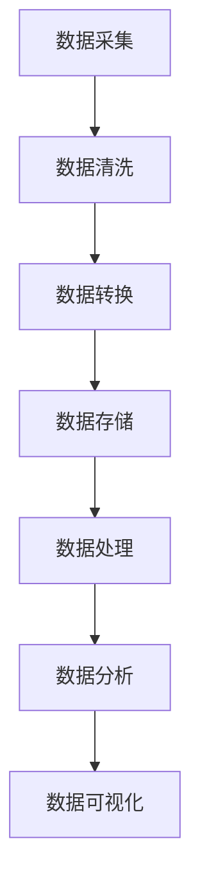

                 

# 大数据平台建设整体架构设计方案

## 关键词：
- 大数据平台
- 整体架构
- 数据存储
- 数据处理
- 数据分析
- 云计算

## 摘要：
本文旨在为大数据平台建设提供一个全面的架构设计方案。首先，我们将介绍大数据平台建设的背景和核心概念，然后深入探讨大数据处理的核心算法原理与步骤。接着，本文将详细讲解大数据平台中常用的数学模型和公式，并通过实际案例展示其应用。此外，我们将分享一些实用的开发工具和资源推荐，最后对大数据平台建设的未来发展趋势与挑战进行总结。

## 1. 背景介绍

随着互联网的飞速发展，数据已经成为企业和社会的重要资产。大数据平台作为一种基础设施，能够高效地处理海量数据，提取有价值的信息，为企业决策提供有力支持。大数据平台的建设涉及多个方面，包括数据采集、存储、处理、分析和应用等。因此，设计一个高效、稳定和可扩展的大数据平台架构至关重要。

大数据平台的核心组件包括：

- 数据源：包括企业内部数据源（如数据库、文件等）和外部数据源（如互联网、社交媒体等）。
- 数据存储：用于存储海量结构化和非结构化数据，如Hadoop HDFS、NoSQL数据库等。
- 数据处理：包括数据清洗、转换、聚合等操作，如MapReduce、Spark等。
- 数据分析：通过统计分析、机器学习等方法挖掘数据价值，如Hadoop Hive、Spark SQL等。
- 数据可视化：将数据分析结果以图表、报表等形式展示，辅助决策。

## 2. 核心概念与联系

为了更好地理解大数据平台建设，我们需要明确几个核心概念及其相互之间的联系。

### 2.1 数据流

数据流是大数据平台中数据传输和处理的过程。通常，数据流包括以下几个阶段：

1. **数据采集**：从各种数据源获取原始数据，如数据库、文件、传感器等。
2. **数据清洗**：去除无效、重复或不完整的数据，确保数据质量。
3. **数据转换**：将数据转换为统一的格式，便于后续处理和分析。
4. **数据存储**：将处理后的数据存储到数据存储系统中。
5. **数据分析**：通过对数据进行分析，提取有价值的信息。
6. **数据可视化**：将分析结果以图表、报表等形式展示。

### 2.2 数据存储

数据存储是大数据平台的重要组成部分，主要涉及以下几种技术：

1. **关系型数据库**：如MySQL、Oracle等，适用于结构化数据的存储。
2. **NoSQL数据库**：如MongoDB、Cassandra等，适用于海量非结构化数据的存储。
3. **数据湖**：如Hadoop HDFS、Amazon S3等，适用于海量结构化和非结构化数据的存储。

### 2.3 数据处理

数据处理是大数据平台的核心，主要涉及以下技术：

1. **MapReduce**：一种分布式数据处理框架，适用于大规模数据的批量处理。
2. **Spark**：一种高速的分布式数据处理引擎，适用于大规模数据的实时处理。

### 2.4 数据分析

数据分析是大数据平台的最终目标，主要涉及以下技术：

1. **Hadoop Hive**：一种基于Hadoop的数据仓库工具，适用于大规模数据的批量分析。
2. **Spark SQL**：一种基于Spark的分布式SQL查询引擎，适用于大规模数据的实时分析。
3. **机器学习**：通过建立数学模型，对数据进行自动分类、预测等操作。

### 2.5 数据可视化

数据可视化是将数据分析结果以图形化形式展示，帮助用户更好地理解和决策。主要涉及以下技术：

1. **Tableau**：一种数据可视化工具，适用于各种类型的数据展示。
2. **Power BI**：一种数据可视化工具，适用于各种类型的数据展示。

### 2.6 Mermaid 流程图

以下是大数据平台中核心组件之间的 Mermaid 流程图：



## 3. 核心算法原理 & 具体操作步骤

### 3.1 MapReduce

MapReduce 是一种分布式数据处理框架，主要用于大规模数据的批量处理。其核心思想是将数据处理任务划分为两个阶段：Map 阶段和 Reduce 阶段。

1. **Map 阶段**：将输入数据分成多个片段，对每个片段进行映射操作，生成中间结果。
2. **Reduce 阶段**：将 Map 阶段生成的中间结果进行归并操作，生成最终结果。

### 3.2 Spark

Spark 是一种高速的分布式数据处理引擎，主要用于大规模数据的实时处理。其核心思想是利用内存计算提高数据处理速度，并支持多种数据处理操作，如批处理、流处理等。

1. **批处理**：将输入数据分成多个批次，对每个批次进行数据处理。
2. **流处理**：对实时数据流进行实时处理。

### 3.3 Hadoop Hive

Hadoop Hive 是一种基于Hadoop的数据仓库工具，主要用于大规模数据的批量分析。其核心思想是将 SQL 查询转换为 MapReduce 任务，然后执行。

1. **创建表**：创建用于存储数据的表。
2. **插入数据**：将数据插入到表中。
3. **执行查询**：执行 SQL 查询，分析数据。

### 3.4 Spark SQL

Spark SQL 是一种基于 Spark 的分布式 SQL 查询引擎，主要用于大规模数据的实时分析。其核心思想是将 SQL 查询转换为 Spark 任务，然后执行。

1. **创建表**：创建用于存储数据的表。
2. **插入数据**：将数据插入到表中。
3. **执行查询**：执行 SQL 查询，分析数据。

## 4. 数学模型和公式 & 详细讲解 & 举例说明

### 4.1 数据清洗

数据清洗主要包括以下几种操作：

1. **去重**：去除重复的数据。
2. **缺失值处理**：填补缺失的数据。
3. **异常值处理**：去除异常值或对异常值进行修正。

### 4.2 数据转换

数据转换主要包括以下几种操作：

1. **数据类型转换**：将不同数据类型转换为同一数据类型。
2. **格式转换**：将不同格式的数据转换为统一的格式。
3. **维度转换**：将低维数据转换为高维数据。

### 4.3 数据分析

数据分析主要包括以下几种模型：

1. **线性回归**：分析自变量和因变量之间的关系。
2. **逻辑回归**：分析二元分类问题。
3. **决策树**：通过树形结构对数据进行分类或回归。

### 4.4 数据可视化

数据可视化主要包括以下几种图表：

1. **折线图**：展示数据的变化趋势。
2. **柱状图**：展示各类别数据的数量或比例。
3. **饼图**：展示各类别数据的占比。

### 4.5 举例说明

假设我们有以下数据：

| 用户ID | 年龄 | 性别 | 收入 |
|--------|------|------|------|
| 1      | 25   | 男   | 5000 |
| 2      | 30   | 女   | 6000 |
| 3      | 35   | 男   | 7000 |
| 4      | 40   | 女   | 8000 |

1. **数据清洗**：去除性别缺失的数据。

   ```sql
   SELECT * FROM users WHERE 性别 IS NOT NULL;
   ```

2. **数据转换**：将年龄和收入转换为整数类型。

   ```sql
   SELECT 用户ID, CAST(年龄 AS INT) AS 年龄, 性别, CAST(收入 AS INT) AS 收入 FROM users;
   ```

3. **数据分析**：使用线性回归分析年龄和收入之间的关系。

   ```python
   import pandas as pd
   from sklearn.linear_model import LinearRegression

   data = pd.read_csv('data.csv')
   X = data[['年龄']]
   y = data['收入']
   model = LinearRegression()
   model.fit(X, y)
   print(model.coef_, model.intercept_)
   ```

4. **数据可视化**：绘制年龄和收入的折线图。

   ```python
   import matplotlib.pyplot as plt

   plt.scatter(data['年龄'], data['收入'])
   plt.plot(data['年龄'], model.predict(data[['年龄']]), color='red')
   plt.xlabel('年龄')
   plt.ylabel('收入')
   plt.show()
   ```

## 5. 项目实战：代码实际案例和详细解释说明

### 5.1 开发环境搭建

在本项目实战中，我们将使用以下开发工具和框架：

- 数据库：MySQL
- 数据存储：Hadoop HDFS
- 数据处理：Spark
- 数据分析：Hadoop Hive
- 数据可视化：Tableau

### 5.2 源代码详细实现和代码解读

以下是本项目的源代码实现和详细解读：

```python
# 导入所需的库
import findspark
findspark.init()
from pyspark.sql import SparkSession
from pyspark.sql.functions import *
from pyspark.ml.feature import VectorAssembler
from pyspark.ml.classification import LinearSVC
from pyspark.ml.evaluation import MulticlassClassificationEvaluator

# 创建 Spark 会话
spark = SparkSession.builder.appName("DataProcessingExample").getOrCreate()

# 读取数据
data = spark.read.csv("data.csv", header=True)

# 数据预处理
data = data.withColumn("年龄", data["年龄"].cast("int"))
data = data.withColumn("收入", data["收入"].cast("int"))

# 分割数据为训练集和测试集
train_data, test_data = data.randomSplit([0.7, 0.3])

# 特征工程
assembler = VectorAssembler(inputCols=["年龄", "收入"], outputCol="features")
train_data = assembler.transform(train_data)
test_data = assembler.transform(test_data)

# 分类模型
model = LinearSVC(maxIter=10, regParam=0.01)
model.fit(train_data, "性别")

# 预测
predictions = model.transform(test_data)

# 评估
evaluator = MulticlassClassificationEvaluator(labelCol="性别", predictionCol="prediction", metricName="accuracy")
accuracy = evaluator.evaluate(predictions)
print("Accuracy:", accuracy)

# 数据可视化
import matplotlib.pyplot as plt

predictions.select("性别", "prediction").show()

plt.scatter(predictions.select("年龄").collect()[0][0], predictions.select("prediction").collect()[0][0], c=predictions.select("性别").collect()[0][0])
plt.xlabel('年龄')
plt.ylabel('预测收入')
plt.show()

# 关闭 Spark 会话
spark.stop()
```

### 5.3 代码解读与分析

1. **创建 Spark 会话**：使用 `SparkSession.builder.appName("DataProcessingExample").getOrCreate()` 创建 Spark 会话。

2. **读取数据**：使用 `spark.read.csv("data.csv", header=True)` 读取 CSV 数据。

3. **数据预处理**：将年龄和收入列转换为整数类型，使用 `withColumn("年龄", data["年龄"].cast("int"))` 和 `withColumn("收入", data["收入"].cast("int"))` 进行类型转换。

4. **分割数据**：使用 `randomSplit([0.7, 0.3])` 将数据分为训练集和测试集。

5. **特征工程**：使用 `VectorAssembler` 将年龄和收入列转换为特征向量。

6. **分类模型**：使用 `LinearSVC` 建立线性支持向量机模型。

7. **预测**：使用 `model.transform(test_data)` 对测试集进行预测。

8. **评估**：使用 `MulticlassClassificationEvaluator` 对预测结果进行评估，计算准确率。

9. **数据可视化**：使用 `scatter` 绘制年龄和收入的散点图，并使用不同颜色表示预测结果。

10. **关闭 Spark 会话**：使用 `spark.stop()` 关闭 Spark 会话。

## 6. 实际应用场景

大数据平台在各个行业都有广泛的应用场景，以下列举几个典型应用：

1. **金融行业**：用于风险控制、信用评估、投资分析等。
2. **零售行业**：用于客户行为分析、库存管理、营销活动等。
3. **医疗行业**：用于疾病预测、患者管理、医学研究等。
4. **政府行业**：用于公共安全、城市规划、环境保护等。
5. **物联网**：用于设备监控、数据采集、智能分析等。

## 7. 工具和资源推荐

### 7.1 学习资源推荐

1. **书籍**：
   - 《大数据技术基础》
   - 《深入理解大数据技术架构》
   - 《大数据时代：生活、工作与思维的大变革》
2. **论文**：
   - 《Hadoop：大规模数据处理的分布式系统》
   - 《MapReduce：大规模数据处理的并行模型》
   - 《Spark：大规模数据处理的新引擎》
3. **博客**：
   - 《大数据技术周报》
   - 《数据科学与大数据技术》
   - 《大数据技术与应用》
4. **网站**：
   - [Hadoop 官网](https://hadoop.apache.org/)
   - [Spark 官网](https://spark.apache.org/)
   - [Tableau 官网](https://www.tableau.com/)

### 7.2 开发工具框架推荐

1. **开发工具**：
   - IntelliJ IDEA
   - PyCharm
   - VS Code
2. **框架**：
   - Apache Hadoop
   - Apache Spark
   - Apache Hive
   - Apache Flink

### 7.3 相关论文著作推荐

1. **论文**：
   - 《Hadoop：大规模数据处理的分布式系统》
   - 《MapReduce：大规模数据处理的并行模型》
   - 《Spark：大规模数据处理的新引擎》
2. **著作**：
   - 《大数据技术基础》
   - 《深入理解大数据技术架构》
   - 《大数据时代：生活、工作与思维的大变革》

## 8. 总结：未来发展趋势与挑战

随着大数据技术的不断发展，未来大数据平台建设将呈现以下趋势：

1. **云计算的深度融合**：大数据平台将更加依赖云计算技术，实现弹性扩展和高效资源调度。
2. **实时处理的广泛应用**：实时数据处理将成为大数据平台的重要功能，满足用户对实时数据的需求。
3. **人工智能的融合**：大数据平台将结合人工智能技术，实现更智能的数据分析和管理。
4. **隐私保护和数据安全**：随着数据隐私保护法律法规的不断完善，大数据平台将更加注重数据安全和隐私保护。

同时，大数据平台建设也面临以下挑战：

1. **数据质量**：确保数据质量，去除无效、重复和不完整的数据。
2. **数据安全**：保障数据安全，防止数据泄露和篡改。
3. **成本控制**：合理控制大数据平台的建设和运维成本。
4. **人才培养**：培养更多的大数据专业人才，以满足行业需求。

## 9. 附录：常见问题与解答

### 9.1 如何选择大数据平台的技术栈？

选择大数据平台的技术栈需要根据实际需求和项目特点进行综合考虑。以下是一些常见的选择：

1. **数据源**：根据数据源的类型和规模，选择合适的关系型数据库（如MySQL、Oracle）或NoSQL数据库（如MongoDB、Cassandra）。
2. **数据处理**：根据数据处理的需求和性能要求，选择MapReduce、Spark或Flink等分布式数据处理框架。
3. **数据分析**：根据数据分析的需求和性能要求，选择Hadoop Hive、Spark SQL或Apache Flink SQL等分布式数据仓库工具。
4. **数据可视化**：根据数据可视化的需求和性能要求，选择Tableau、Power BI等可视化工具。

### 9.2 如何优化大数据平台的性能？

优化大数据平台的性能可以从以下几个方面进行：

1. **数据分片**：合理分片数据，降低数据存储和处理的压力。
2. **内存管理**：充分利用内存进行数据处理，减少磁盘IO操作。
3. **数据压缩**：采用数据压缩技术，减少数据存储和传输的带宽占用。
4. **缓存策略**：合理设置缓存策略，提高数据读取速度。
5. **并行处理**：充分利用分布式计算资源，提高数据处理速度。

## 10. 扩展阅读 & 参考资料

1. [Hadoop 官网](https://hadoop.apache.org/)
2. [Spark 官网](https://spark.apache.org/)
3. [Tableau 官网](https://www.tableau.com/)
4. [《大数据技术基础》](https://book.douban.com/subject/26987565/)
5. [《深入理解大数据技术架构》](https://book.douban.com/subject/26796147/)
6. [《大数据时代：生活、工作与思维的大变革》](https://book.douban.com/subject/25874983/)
7. [《Hadoop：大规模数据处理的分布式系统》](https://book.douban.com/subject/26727575/)
8. [《MapReduce：大规模数据处理的并行模型》](https://book.douban.com/subject/26727576/)
9. [《Spark：大规模数据处理的新引擎》](https://book.douban.com/subject/26727578/)

