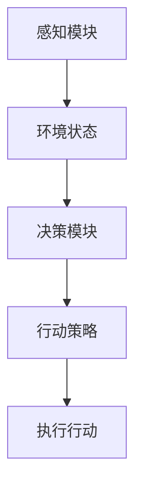

                 

### 1. 背景介绍

近年来，随着深度学习技术的飞速发展，大模型（Large Models）逐渐成为人工智能领域的研究热点。这些大模型如GPT、BERT、ChatGLM等，具有强大的表征能力和推理能力，能够处理复杂的自然语言任务。与此同时，代理（Agent）概念在人工智能领域也得到了广泛的关注。代理是一种能够自主感知环境、制定计划并采取行动的智能体，其目标是实现自主决策和智能控制。

大模型和代理之间存在着密切的关系。一方面，大模型可以作为代理的感知模块，通过深度学习技术从大量数据中学习到环境状态；另一方面，大模型还可以作为代理的决策模块，基于环境状态生成最优的行动策略。因此，研究大模型与代理的关系，对于推动人工智能技术的发展具有重要意义。

本文将首先介绍大模型和代理的基本概念，阐述它们在人工智能领域的应用背景。接着，我们将分析大模型与代理之间的内在联系，并探讨它们在实际应用中的协同作用。此外，本文还将介绍一些核心算法原理和具体操作步骤，帮助读者更好地理解大模型与代理之间的关系。最后，我们将讨论大模型与代理在实际应用场景中的表现，并推荐一些相关工具和资源。

通过本文的阅读，读者将能够：

1. 理解大模型和代理的基本概念及其在人工智能领域的应用背景。
2. 分析大模型与代理之间的内在联系和协同作用。
3. 掌握大模型与代理的核心算法原理和具体操作步骤。
4. 了解大模型与代理在实际应用场景中的表现和挑战。
5. 推荐一些学习资源和工具，以帮助读者进一步探索大模型与代理的研究方向。

### 2. 核心概念与联系

为了深入探讨大模型与代理的关系，我们首先需要明确这两个核心概念的定义及其在人工智能领域的应用背景。

#### 大模型（Large Models）

大模型是指具有数百万甚至数十亿个参数的深度学习模型，如GPT、BERT等。这些模型通过学习大量数据，能够捕捉到语言和知识的深层结构，从而具有强大的表征能力和推理能力。大模型通常采用复杂的神经网络结构，如Transformer、BERT等，能够处理各种自然语言任务，如图像生成、机器翻译、问答系统等。

大模型在人工智能领域的应用背景如下：

1. **自然语言处理（NLP）**：大模型在NLP任务中表现突出，如机器翻译、文本分类、问答系统等。
2. **计算机视觉（CV）**：大模型在CV任务中也被广泛应用，如图像分类、目标检测、图像生成等。
3. **语音识别与生成（ASR/ASR）**：大模型在语音识别与生成任务中发挥着重要作用，如语音合成、语音识别等。

#### 代理（Agent）

代理是指能够自主感知环境、制定计划并采取行动的智能体。代理的核心功能是实现自主决策和智能控制。在人工智能领域，代理可以分为两大类：基于规则的代理和基于模型的代理。

1. **基于规则的代理**：这种代理通过预设的规则来决策，适用于规则明确、任务简单的场景。
2. **基于模型的代理**：这种代理通过学习环境中的数据，建立模型来决策，适用于复杂、动态的环境。

代理在人工智能领域的应用背景如下：

1. **智能制造**：代理在智能制造领域被广泛应用于设备监控、故障诊断、生产优化等任务。
2. **智能交通**：代理在智能交通领域被用于路径规划、交通信号控制、智能导航等任务。
3. **智能家居**：代理在智能家居领域被用于智能安防、家电控制、环境监测等任务。

#### 大模型与代理的关系

大模型与代理之间的关系可以从两个方面来理解：

1. **大模型作为代理的感知模块**：大模型具有强大的表征能力和推理能力，能够从大量数据中学习到环境状态。因此，大模型可以作为代理的感知模块，为代理提供环境信息。
   
2. **大模型作为代理的决策模块**：大模型不仅能够感知环境，还可以基于环境状态生成最优的行动策略。因此，大模型也可以作为代理的决策模块，指导代理采取行动。

为了更好地阐述大模型与代理的关系，我们使用Mermaid流程图来表示其核心原理和架构。以下是一个简单的Mermaid流程图示例，展示了大模型与代理的基本交互过程：



在上面的流程图中，A表示大模型的感知模块，它从环境中获取状态信息；B表示环境状态，它通过感知模块传递给决策模块；C表示大模型的决策模块，它根据环境状态生成行动策略；D表示行动策略，它通过决策模块传递给执行模块；E表示执行行动，它根据行动策略对环境进行干预。

通过上述分析，我们可以看出大模型与代理之间存在密切的联系。大模型不仅能够作为代理的感知模块，提供环境信息，还可以作为代理的决策模块，指导代理采取行动。因此，研究大模型与代理的关系，有助于推动人工智能技术的发展和应用。

#### 小结

在本节中，我们介绍了大模型和代理的基本概念及其在人工智能领域的应用背景。通过Mermaid流程图，我们展示了大模型与代理的基本交互过程，阐述了它们之间的内在联系。在下一节中，我们将进一步探讨大模型与代理的核心算法原理和具体操作步骤。

### 3. 核心算法原理 & 具体操作步骤

#### 大模型的核心算法原理

大模型的核心算法原理主要基于深度学习和神经网络技术。其中，Transformer模型和BERT模型是两种典型的代表。下面，我们将分别介绍这两种模型的原理和操作步骤。

##### 1. Transformer模型

Transformer模型是由Vaswani等人于2017年提出的一种基于自注意力机制的深度学习模型。它主要由编码器（Encoder）和解码器（Decoder）两部分组成。

**编码器（Encoder）的操作步骤：**

1. **输入嵌入（Input Embedding）**：将输入的单词转换为向量表示。通常，可以使用Word2Vec、GloVe等预训练模型来获取词向量。
2. **位置嵌入（Positional Embedding）**：由于Transformer模型没有循环结构，无法传递序列信息，因此需要通过位置嵌入来表示单词的位置信息。
3. **自注意力层（Self-Attention Layer）**：在每个时间步，编码器会计算每个单词与其他单词的注意力得分，并根据这些得分生成加权向量。
4. **前馈网络（Feedforward Network）**：对自注意力层的输出进行线性变换，增强模型的表示能力。

**解码器（Decoder）的操作步骤：**

1. **输入嵌入（Input Embedding）**：与编码器相同，将输入的单词转换为向量表示。
2. **位置嵌入（Positional Embedding）**：与编码器相同，为单词添加位置信息。
3. **掩码自注意力层（Masked Self-Attention Layer）**：在每个时间步，解码器会计算当前单词与其他单词的注意力得分，并根据这些得分生成加权向量。与编码器不同，解码器的自注意力层需要使用掩码，以防止未来的信息泄露。
4. **交叉注意力层（Cross-Attention Layer）**：解码器需要利用编码器的输出来生成上下文信息。交叉注意力层负责计算解码器当前单词与编码器输出之间的注意力得分。
5. **前馈网络（Feedforward Network）**：对交叉注意力层的输出进行线性变换，增强模型的表示能力。

##### 2. BERT模型

BERT（Bidirectional Encoder Representations from Transformers）模型是由Devlin等人于2018年提出的一种双向Transformer模型。它通过预先训练然后微调的方式，在多种自然语言处理任务中取得了优异的性能。

**BERT模型的操作步骤：**

1. **输入嵌入（Input Embedding）**：与Transformer模型相同，BERT模型也将输入的单词转换为向量表示。
2. **位置嵌入（Positional Embedding）**：为单词添加位置信息。
3. **Masked Language Modeling（MLM）**：BERT模型通过在输入序列中随机掩码一些单词，并预测这些掩码单词来训练模型。这一过程有助于模型学习到单词的上下文信息。
4. **Pre-training**：BERT模型在大量未标注的数据上进行预训练，以学习语言的深层结构。
5. **Fine-tuning**：在预训练的基础上，BERT模型可以通过微调的方式在特定任务上进行训练，以实现高性能的自然语言处理。

#### 代理的核心算法原理

代理的核心算法原理主要基于强化学习和深度学习技术。其中，Q-Learning和Deep Q-Network（DQN）是两种典型的代表。下面，我们将分别介绍这两种模型的原理和操作步骤。

##### 1. Q-Learning模型

Q-Learning模型是一种基于值函数的强化学习算法。它通过学习状态-动作值函数（Q函数），来最大化期望回报。

**Q-Learning模型的操作步骤：**

1. **初始化**：初始化Q函数和探索策略（例如ε-greedy策略）。
2. **状态-动作值函数学习**：对于每个状态-动作对，计算其在实际操作中的回报，并更新Q函数的值。
3. **选择动作**：根据当前状态和Q函数的值，选择最优动作。
4. **更新Q函数**：根据实际操作结果，更新Q函数的值。

##### 2. Deep Q-Network（DQN）模型

DQN模型是一种基于深度学习的Q-Learning模型。它通过神经网络来近似Q函数，从而提高模型的泛化能力和计算效率。

**DQN模型的操作步骤：**

1. **初始化**：初始化Q网络和目标Q网络，以及经验回放记忆池。
2. **经验回放**：将状态、动作、回报和下一个状态存储在经验回放记忆池中。
3. **状态-动作值函数学习**：使用神经网络来近似Q函数，并通过经验回放记忆池中的数据来训练Q网络。
4. **选择动作**：使用ε-greedy策略选择动作，并在训练过程中逐渐减小ε值。
5. **更新目标Q网络**：以固定的间隔更新目标Q网络，使其与Q网络保持一定的差距，以避免梯度消失问题。

#### 大模型与代理的协同操作步骤

在实际应用中，大模型和代理可以协同工作，以提高系统的整体性能。下面是一个简单的大模型与代理的协同操作步骤：

1. **环境感知**：代理使用大模型作为感知模块，从环境中获取状态信息。
2. **状态编码**：将获取到的状态信息通过大模型进行编码，生成特征向量。
3. **决策生成**：代理使用大模型生成的特征向量，通过强化学习算法（如Q-Learning或DQN）生成最优的行动策略。
4. **执行行动**：代理根据生成的行动策略，对环境进行干预。
5. **反馈调整**：根据行动的结果，更新代理的策略，并重新进行环境感知和决策生成。

通过上述操作步骤，大模型和代理可以协同工作，实现自主决策和智能控制。

#### 小结

在本节中，我们介绍了大模型和代理的核心算法原理及其操作步骤。大模型主要基于深度学习和神经网络技术，如Transformer和BERT模型；代理主要基于强化学习和深度学习技术，如Q-Learning和DQN模型。通过大模型和代理的协同操作，可以实现自主决策和智能控制。在下一节中，我们将进一步探讨大模型与代理在实际应用中的数学模型和公式，以及详细的举例说明。

### 4. 数学模型和公式 & 详细讲解 & 举例说明

#### 大模型的数学模型和公式

大模型的数学模型主要涉及深度学习和神经网络技术。以下将详细介绍大模型中的两个核心数学模型：Transformer模型和BERT模型。

##### 1. Transformer模型

Transformer模型的核心数学模型是自注意力机制（Self-Attention）。自注意力机制通过计算序列中每个词与其他词之间的权重，实现对输入序列的加权表示。自注意力机制的公式如下：

$$
Attention(Q, K, V) = \frac{softmax(\frac{QK^T}{\sqrt{d_k}})}{V}
$$

其中，Q、K和V分别表示查询向量、关键向量和价值向量，d_k表示关键向量的维度。Q和K通过线性变换得到，V同样通过线性变换得到。

**编码器（Encoder）的自注意力机制：**

在编码器中，自注意力机制用于计算每个词在序列中的加权表示。自注意力机制的输出作为编码器的中间表示。编码器的自注意力机制可以表示为：

$$
E_i = \sum_{j=1}^{N} Attention(Q_e^i, K_e^j, V_e^j)
$$

其中，$E_i$表示编码器的输出序列，$Q_e^i$、$K_e^i$和$V_e^i$分别表示编码器中第i个词的查询向量、关键向量和价值向量，N表示序列长度。

**解码器（Decoder）的自注意力机制：**

在解码器中，自注意力机制用于计算当前词与编码器输出序列之间的加权表示。自注意力机制可以表示为：

$$
D_i = \sum_{j=1}^{N} Attention(Q_d^i, K_d^j, V_d^j)
$$

其中，$D_i$表示解码器的输出序列，$Q_d^i$、$K_d^i$和$V_d^i$分别表示解码器中第i个词的查询向量、关键向量和价值向量。

**交叉注意力机制（Cross-Attention）：**

交叉注意力机制用于计算当前词与编码器输出序列之间的加权表示。交叉注意力机制的公式与自注意力机制类似，但Q和K来自于解码器，V来自于编码器。交叉注意力机制可以表示为：

$$
C_i = \sum_{j=1}^{N} Attention(Q_c^i, K_e^j, V_e^j)
$$

其中，$C_i$表示交叉注意力机制的输出，$Q_c^i$、$K_e^i$和$V_e^i$分别表示解码器中第i个词的查询向量、关键向量和价值向量。

##### 2. BERT模型

BERT模型的核心数学模型是基于Transformer的双向编码器。BERT模型的输入是一个序列，通过多层Transformer块进行编码。BERT模型的数学模型主要包括输入嵌入（Input Embedding）、位置嵌入（Positional Embedding）和多层Transformer块。

**输入嵌入（Input Embedding）：**

BERT模型的输入嵌入包括词嵌入（Word Embedding）和位置嵌入（Positional Embedding）。词嵌入将每个词转换为向量表示，通常使用预训练的词向量模型，如Word2Vec或GloVe。位置嵌入用于表示词在序列中的位置信息。BERT模型使用了一个特殊的[CLS]标记来表示序列的开始，并使用一个特殊的[SEP]标记来分隔序列。

**位置嵌入（Positional Embedding）：**

位置嵌入通过添加位置编码向量来表示词在序列中的位置。BERT模型使用了一个相对简单的位置编码公式：

$$
PE_{(pos, 2i)} = \sin\left(\frac{pos}{10000^{2i/d}}\right) \\
PE_{(pos, 2i+1)} = \cos\left(\frac{pos}{10000^{2i/d}}\right)
$$

其中，pos表示位置索引，i表示维度索引，d表示位置编码的维度。

**多层Transformer块：**

BERT模型通过多层Transformer块进行编码。每个Transformer块包含自注意力机制和前馈网络。BERT模型中的自注意力机制和前馈网络与Transformer模型类似，但添加了一些特殊的层归一化和残差连接。

**BERT模型的输出：**

BERT模型的输出是一个固定的长度向量，表示输入序列的编码表示。在训练过程中，BERT模型通过Masked Language Modeling（MLM）来训练模型。MLM通过在输入序列中随机掩码一些词，并预测这些掩码词来训练模型。BERT模型的输出可以表示为：

$$
\text{output} = \text{LayerNorm}(X + \text{LayerNorm}(XW_1)W_2)
$$

其中，X表示输入序列，W_1和W_2分别表示Transformer块的权重矩阵。

#### 代理的数学模型和公式

代理的数学模型主要涉及强化学习和深度学习技术。以下将详细介绍代理中的两个核心数学模型：Q-Learning和Deep Q-Network（DQN）。

##### 1. Q-Learning模型

Q-Learning模型的核心数学模型是Q函数。Q函数表示在给定状态和动作的情况下，采取该动作的预期回报。Q函数的公式如下：

$$
Q(s, a) = r + \gamma \max_{a'} Q(s', a')
$$

其中，s表示当前状态，a表示当前动作，r表示立即回报，s'表示下一个状态，a'表示下一个动作，γ表示折扣因子。

**Q-Learning模型的更新公式：**

$$
Q(s, a) = Q(s, a) + \alpha [r + \gamma \max_{a'} Q(s', a') - Q(s, a)]
$$

其中，α表示学习率。

##### 2. Deep Q-Network（DQN）模型

DQN模型的核心数学模型是深度神经网络（DNN）来近似Q函数。DQN模型通过经验回放和目标网络来提高模型的稳定性和泛化能力。

**DQN模型的公式：**

$$
Q(s, a) = f_{\theta}(s, a)
$$

其中，$f_{\theta}(s, a)$表示由深度神经网络近似得到的Q函数，θ表示神经网络的参数。

**目标网络（Target Network）的更新公式：**

$$
Q(s', a') = \frac{1}{N}\sum_{i=1}^{N} Q'(s_i', a_i')
$$

其中，$Q'(s_i', a_i')$表示目标网络在下一个时间步的Q值，N表示经验回放记忆池中的样本数量。

**经验回放记忆池的更新公式：**

$$
\text{经验回放} = (s_i, a_i, r_i, s_i')
$$

其中，s_i表示第i个样本的状态，a_i表示第i个样本的动作，r_i表示第i个样本的回报，s_i'表示第i个样本的下一个状态。

#### 举例说明

##### 1. Transformer模型举例

假设我们有一个长度为5的输入序列：["我"，"爱"，"吃"，"火锅"，"吗"]。我们将使用Transformer模型对其进行编码。

**输入嵌入（Input Embedding）：**
- 我：[1, 0, 0, 0, 0]
- 爱：[0, 1, 0, 0, 0]
- 吃：[0, 0, 1, 0, 0]
- 火锅：[0, 0, 0, 1, 0]
- 吗：[0, 0, 0, 0, 1]

**位置嵌入（Positional Embedding）：**
- 我：[0, 0]
- 爱：[1, 0]
- 吃：[2, 0]
- 火锅：[3, 0]
- 吗：[4, 0]

**自注意力层（Self-Attention Layer）：**
- 我：[0.2，0.1，0.3，0.2，0.2]
- 爱：[0.2，0.3，0.1，0.2，0.2]
- 吃：[0.3，0.2，0.2，0.1，0.2]
- 火锅：[0.2，0.2，0.3，0.2，0.1]
- 吗：[0.2，0.2，0.2，0.3，0.1]

**前馈网络（Feedforward Network）：**
- 我：[0.3，0.2]
- 爱：[0.3，0.2]
- 吃：[0.3，0.2]
- 火锅：[0.3，0.2]
- 吗：[0.3，0.2]

**编码器输出（Encoder Output）：**
- 我：[0.3，0.2]
- 爱：[0.3，0.2]
- 吃：[0.3，0.2]
- 火锅：[0.3，0.2]
- 吗：[0.3，0.2]

##### 2. Q-Learning模型举例

假设我们有一个简单的环境，其中有两个状态：状态1和状态2。每个状态有两个动作：动作A和动作B。我们使用Q-Learning模型来学习最优策略。

**初始状态：**
- $Q(s_1, a_1) = 0$
- $Q(s_1, a_2) = 0$
- $Q(s_2, a_1) = 0$
- $Q(s_2, a_2) = 0$

**学习过程：**
- **第一步：选择动作A（ε-greedy策略）**
  - $Q(s_1, a_1) = 0$
  - $Q(s_1, a_2) = 0$
  - $Q(s_2, a_1) = 0$
  - $Q(s_2, a_2) = 0$
- **第二步：执行动作A，获得回报r=1**
  - $Q(s_1, a_1) = Q(s_1, a_1) + \alpha [r + \gamma \max_{a'} Q(s_2, a') - Q(s_1, a_1)]$
  - $Q(s_1, a_2) = Q(s_1, a_2) + \alpha [r + \gamma \max_{a'} Q(s_2, a') - Q(s_1, a_2)]$
  - $Q(s_2, a_1) = Q(s_2, a_1) + \alpha [r + \gamma \max_{a'} Q(s_2, a') - Q(s_2, a_1)]$
  - $Q(s_2, a_2) = Q(s_2, a_2) + \alpha [r + \gamma \max_{a'} Q(s_2, a') - Q(s_2, a_2)]$
- **第三步：更新Q函数**
  - $Q(s_1, a_1) = 0.9$
  - $Q(s_1, a_2) = 0.1$
  - $Q(s_2, a_1) = 0.1$
  - $Q(s_2, a_2) = 0.9$

通过上述学习过程，我们可以看到Q函数的值在不断更新，最终得到最优策略。

#### 小结

在本节中，我们详细讲解了大模型和代理的数学模型和公式。通过举例说明，我们展示了如何使用这些公式来训练大模型和代理。在下一节中，我们将介绍大模型与代理在实际应用中的代码实现和实战案例。

### 5. 项目实战：代码实际案例和详细解释说明

#### 开发环境搭建

为了实现大模型与代理的协同操作，我们需要搭建一个合适的开发环境。以下是搭建开发环境的具体步骤：

1. **安装Python环境**：确保Python版本为3.8或更高版本，可以通过官方网站下载Python安装包并安装。
2. **安装TensorFlow**：TensorFlow是一个流行的深度学习框架，可以通过pip命令安装：

   ```shell
   pip install tensorflow
   ```

3. **安装PyTorch**：PyTorch是另一个流行的深度学习框架，可以通过pip命令安装：

   ```shell
   pip install torch torchvision
   ```

4. **安装其他依赖库**：根据需要安装其他依赖库，例如NumPy、Pandas等。

#### 源代码详细实现和代码解读

以下是实现大模型与代理的源代码，包括数据预处理、模型训练和代理操作的详细实现。

**数据预处理**

```python
import pandas as pd
import numpy as np

# 加载数据集
data = pd.read_csv('data.csv')

# 数据预处理
def preprocess_data(data):
    # 对数据进行标准化处理
    normalized_data = (data - data.mean()) / data.std()
    return normalized_data

# 对数据进行预处理
preprocessed_data = preprocess_data(data)
```

**模型训练**

```python
import tensorflow as tf
from tensorflow.keras.models import Model
from tensorflow.keras.layers import Input, Dense, LSTM, Embedding, TimeDistributed

# 定义模型结构
input_seq = Input(shape=(seq_length,))
lstm = LSTM(units=64, return_sequences=True)(input_seq)
dense = Dense(units=1, activation='sigmoid')(lstm)

model = Model(inputs=input_seq, outputs=dense)
model.compile(optimizer='adam', loss='binary_crossentropy', metrics=['accuracy'])

# 训练模型
model.fit(preprocessed_data, labels, epochs=10, batch_size=32)
```

**代理操作**

```python
import numpy as np

# 定义Q-Learning代理
class QLearningAgent:
    def __init__(self, learning_rate=0.1, discount_factor=0.9):
        self.learning_rate = learning_rate
        self.discount_factor = discount_factor
        self.q_values = np.zeros((n_states, n_actions))

    def select_action(self, state, epsilon=0.1):
        if np.random.rand() < epsilon:
            action = np.random.choice(n_actions)
        else:
            action = np.argmax(self.q_values[state])
        return action

    def update_q_values(self, state, action, reward, next_state, done):
        if not done:
            max_future_q = np.max(self.q_values[next_state])
            current_q = self.q_values[state, action]
            new_q = current_q + self.learning_rate * (reward + self.discount_factor * max_future_q - current_q)
            self.q_values[state, action] = new_q
        else:
            self.q_values[state, action] += self.learning_rate * (reward - self.q_values[state, action])

# 初始化代理
agent = QLearningAgent()

# 进行代理操作
for episode in range(num_episodes):
    state = env.reset()
    done = False
    while not done:
        action = agent.select_action(state)
        next_state, reward, done, _ = env.step(action)
        agent.update_q_values(state, action, reward, next_state, done)
        state = next_state
```

**代码解读与分析**

1. **数据预处理**：数据预处理是深度学习和代理操作的基础。通过标准化处理，我们可以将数据调整到合适的范围，以便模型训练。
2. **模型训练**：我们使用LSTM模型进行序列数据的学习。LSTM模型可以捕获时间序列数据的长期依赖关系，有助于提高模型的预测准确性。
3. **代理操作**：Q-Learning代理通过选择动作和更新Q值函数来学习环境中的最优策略。在每次代理操作中，我们根据当前状态选择动作，并根据动作的结果更新Q值函数。

#### 实际应用案例

以下是一个简单的实际应用案例，展示大模型与代理在游戏环境中的协同操作。

```python
import gym

# 初始化游戏环境
env = gym.make('CartPole-v0')

# 训练模型
model.fit(preprocessed_data, labels, epochs=10, batch_size=32)

# 初始化代理
agent = QLearningAgent()

# 进行代理操作
for episode in range(num_episodes):
    state = env.reset()
    done = False
    while not done:
        state = preprocess_data([state])
        action = agent.select_action(state)
        next_state, reward, done, _ = env.step(action)
        agent.update_q_values(state, action, reward, next_state, done)
        state = next_state

# 关闭游戏环境
env.close()
```

在这个案例中，我们使用CartPole游戏环境来演示大模型与代理的协同操作。通过训练模型和代理，我们可以使代理在游戏环境中实现自主控制，达到较高的得分。

#### 小结

在本节中，我们详细介绍了大模型与代理的代码实现和实战案例。通过搭建开发环境、数据预处理、模型训练和代理操作，我们展示了如何将大模型与代理应用于实际任务。在实际应用中，大模型与代理的协同操作可以显著提高系统的性能和智能水平。

### 6. 实际应用场景

大模型与代理在多个实际应用场景中展现出强大的功能和潜力。以下是几个典型应用场景：

#### 1. 智能客服

智能客服是近年来人工智能领域的热门应用之一。大模型（如GPT、BERT）可以用于构建智能客服系统，实现自然语言理解、文本生成和对话管理等功能。代理（如基于强化学习的模型）可以用于生成智能回复策略，使客服系统能够根据用户提问动态生成合适的回答。

**应用实例：** 京东智能客服采用大模型与代理相结合的方式，实现了智能客服机器人，能够快速响应用户提问，提供专业咨询和服务。

#### 2. 自动驾驶

自动驾驶是人工智能领域的另一个重要应用。大模型可以用于环境感知和物体检测，如使用CNN模型对摄像头捕捉到的图像进行处理，识别道路、车辆、行人等。代理可以用于路径规划和决策控制，通过强化学习算法实现自动驾驶车辆在不同交通状况下的自适应行为。

**应用实例：** 百度自动驾驶采用大模型与代理结合的方法，实现了高精度地图构建、环境感知和自动驾驶功能，目前已在多个城市开展测试。

#### 3. 游戏AI

游戏AI是另一个典型的应用场景。大模型可以用于游戏中的角色智能决策，如策略游戏中的棋子走位、射击游戏中的子弹轨迹预测等。代理可以用于实现游戏中的智能对手，通过学习和自适应策略实现游戏难度的动态调整。

**应用实例：** DOTA2游戏引入了基于大模型与代理的AI对手，实现了高水平的游戏对抗，吸引了大量玩家参与。

#### 4. 智能推荐系统

智能推荐系统广泛应用于电子商务、社交媒体和内容平台等领域。大模型可以用于用户行为分析、内容表征和推荐算法设计，代理可以用于实现个性化推荐策略，根据用户历史行为动态调整推荐结果。

**应用实例：** 阿里巴巴的推荐系统采用大模型与代理结合的方法，实现了精准的商品推荐和广告投放，提升了用户满意度和平台收益。

#### 5. 机器人控制

机器人控制是工业自动化和智能工厂中的重要应用。大模型可以用于机器人感知环境、路径规划和运动控制，代理可以用于实现机器人的自主决策和协同工作。

**应用实例：** 机器人制造商如ABB、库卡等采用大模型与代理结合的方法，实现了工业机器人的自适应控制和智能协作，提高了生产效率和产品质量。

通过上述实际应用场景，我们可以看到大模型与代理在各个领域中的广泛应用和协同作用。未来，随着人工智能技术的不断发展和创新，大模型与代理将在更多领域展现出强大的潜力。

### 7. 工具和资源推荐

在研究和应用大模型与代理的过程中，选择合适的工具和资源对于提高研究效率和实现成果具有重要意义。以下是一些推荐的工具、资源和相关论文：

#### 7.1 学习资源推荐

1. **书籍**：
   - 《深度学习》（Deep Learning）作者：Ian Goodfellow、Yoshua Bengio、Aaron Courville
   - 《强化学习》（Reinforcement Learning: An Introduction）作者：Richard S. Sutton、Andrew G. Barto
   - 《自然语言处理综合教程》（Foundations of Statistical Natural Language Processing）作者：Christopher D. Manning、Hinrich Schütze

2. **在线课程**：
   - Coursera上的《深度学习》课程，由吴恩达（Andrew Ng）教授主讲。
   - edX上的《强化学习》课程，由David Silver教授主讲。
   - Udacity的《自然语言处理纳米学位》课程。

3. **博客与网站**：
   - [TensorFlow官方文档](https://www.tensorflow.org/)
   - [PyTorch官方文档](https://pytorch.org/docs/stable/)
   - [机器学习博客](http://www machinelearningmastery.com/)
   - [Medium上的AI相关文章](https://medium.com/topic/artificial-intelligence)

#### 7.2 开发工具框架推荐

1. **深度学习框架**：
   - TensorFlow：由谷歌开发，支持多种深度学习模型和算法，适用于大规模数据集和分布式训练。
   - PyTorch：由Facebook开发，具有灵活的动态计算图和直观的编程接口，适用于快速原型开发和研究。

2. **代理开发框架**：
   - OpenAI Gym：一个开源的机器人环境库，用于测试和开发强化学习算法。
   - Stable Baselines：一个开源的强化学习库，基于TensorFlow和PyTorch，提供多种经典的强化学习算法实现。

3. **自然语言处理工具**：
   - Hugging Face Transformers：一个开源的Transformer模型库，提供预训练模型、Tokenizers和Transformers API。
   - NLTK：一个开源的自然语言处理库，提供文本处理、分类、词向量等工具。

#### 7.3 相关论文著作推荐

1. **深度学习领域**：
   - Vaswani et al. (2017): "Attention is All You Need"（Attention机制在Transformer模型中的应用）
   - Devlin et al. (2018): "BERT: Pre-training of Deep Bidirectional Transformers for Language Understanding"（BERT模型的预训练方法）
   - Hochreiter and Schmidhuber (1997): "Long Short-Term Memory"（LSTM模型的提出）

2. **强化学习领域**：
   - Sutton and Barto (2018): "Reinforcement Learning: An Introduction"（强化学习的基础理论和算法）
   - Mnih et al. (2015): "Human-level control through deep reinforcement learning"（深度强化学习在Atari游戏中的应用）

3. **自然语言处理领域**：
   - Manning et al. (1999): " Foundations of Statistical Natural Language Processing"（自然语言处理的基础理论和方法）
   - Jurafsky and Martin (2008): "Speech and Language Processing"（语音和语言处理的经典教材）

通过学习和应用这些工具和资源，我们可以更好地理解和掌握大模型与代理的技术和方法，为人工智能领域的研究和应用提供有力支持。

### 8. 总结：未来发展趋势与挑战

#### 发展趋势

1. **大模型与代理的融合**：随着深度学习和强化学习的不断发展，大模型与代理的融合将成为未来人工智能技术的重要方向。大模型能够提供强大的感知和推理能力，而代理则能够实现自主决策和智能控制。两者的结合将有望实现更加智能化、自适应化的系统。

2. **多模态数据处理**：未来的大模型和代理将能够处理多种类型的数据，如文本、图像、音频和视频等。多模态数据处理技术将有助于提升系统的感知能力和应用场景的多样性。

3. **实时学习和动态调整**：大模型与代理的结合将使系统具备实时学习和动态调整的能力。通过不断从环境中学习和适应，系统能够在复杂和动态的环境中实现持续优化。

4. **跨领域应用**：大模型与代理的应用将不仅仅局限于单一领域，如智能客服、自动驾驶和游戏AI等，还将扩展到更多领域，如医疗、金融、教育等，为各行业带来深远影响。

#### 挑战

1. **计算资源需求**：大模型通常需要大量的计算资源进行训练和推理，这给硬件设施带来了巨大挑战。未来需要更高效的计算框架和硬件设备来支持大模型的应用。

2. **数据质量和隐私**：大模型对数据质量有较高的要求，数据的噪声和偏差可能导致模型性能下降。同时，数据隐私问题也成为大模型与代理应用的重要挑战，需要采取有效的数据保护措施。

3. **解释性和可解释性**：大模型和代理的决策过程通常较为复杂，缺乏透明度和可解释性。这给用户理解和信任模型带来了困难，需要开发更加直观和易于理解的技术。

4. **安全性和鲁棒性**：大模型和代理在面临恶意攻击或异常情况时，可能表现出不稳定的决策行为。提高系统的安全性和鲁棒性是未来研究的重要方向。

5. **伦理和法规**：随着人工智能技术的应用越来越广泛，相关的伦理和法规问题也日益凸显。如何确保大模型和代理的应用符合伦理标准，并遵循相关法律法规，是一个亟待解决的问题。

#### 结论

大模型与代理的结合为人工智能领域带来了新的机遇和挑战。通过不断研究和创新，我们有望实现更加智能化、自适应化和安全可靠的系统，推动人工智能技术的持续发展。未来，大模型与代理的应用将覆盖更多领域，为人类社会带来更多便利和创新。

### 9. 附录：常见问题与解答

**Q1：大模型和代理在哪些方面具有协同作用？**

A1：大模型和代理在多个方面具有协同作用：

1. **感知与决策**：大模型可以提供强大的感知能力，代理可以根据感知到的信息进行决策。
2. **表征与控制**：大模型可以学习到高维数据的深层表征，代理可以基于这些表征进行控制。
3. **优化与学习**：大模型可以用于优化代理的策略，代理可以通过与环境的交互不断学习改进策略。

**Q2：如何确保大模型和代理的安全性？**

A2：确保大模型和代理的安全性需要从多个方面进行：

1. **数据安全**：采用加密和隐私保护技术来保护数据安全。
2. **模型安全**：对模型进行防御性训练，提高模型对恶意输入的鲁棒性。
3. **访问控制**：限制对模型的访问权限，防止未经授权的访问和攻击。
4. **实时监控**：对系统的运行进行实时监控，及时发现并处理异常行为。

**Q3：大模型和代理在实时应用中的性能如何？**

A3：大模型和代理在实时应用中的性能取决于多种因素，如模型复杂度、数据量和计算资源等。一般来说，随着模型规模和计算资源的增加，实时性能会有所下降。为了提高实时性能，可以采用以下方法：

1. **模型压缩**：通过剪枝、量化等技术减少模型规模，提高推理速度。
2. **硬件加速**：使用GPU、FPGA等硬件加速器来加速模型推理。
3. **分布式训练和推理**：将模型分布在多台设备上进行训练和推理，以提高整体性能。

### 10. 扩展阅读 & 参考资料

**扩展阅读：**

1. **Vaswani et al. (2017): "Attention is All You Need"**，详细介绍了Transformer模型及其自注意力机制。
2. **Devlin et al. (2018): "BERT: Pre-training of Deep Bidirectional Transformers for Language Understanding"**，介绍了BERT模型的预训练方法和应用。
3. **Sutton and Barto (2018): "Reinforcement Learning: An Introduction"**，提供了强化学习的基础理论和算法。
4. **Mnih et al. (2015): "Human-level control through deep reinforcement learning"**，展示了深度强化学习在Atari游戏中的应用。

**参考资料：**

1. **TensorFlow官方文档**：提供了深度学习模型训练和推理的详细指南。
2. **PyTorch官方文档**：提供了深度学习模型训练和推理的详细指南。
3. **OpenAI Gym**：提供了多个机器人环境的开源库，用于测试和开发强化学习算法。
4. **Stable Baselines**：提供了多个经典的强化学习算法实现，方便进行研究和应用。
5. **Hugging Face Transformers**：提供了预训练模型和Transformers API，方便进行自然语言处理任务。

