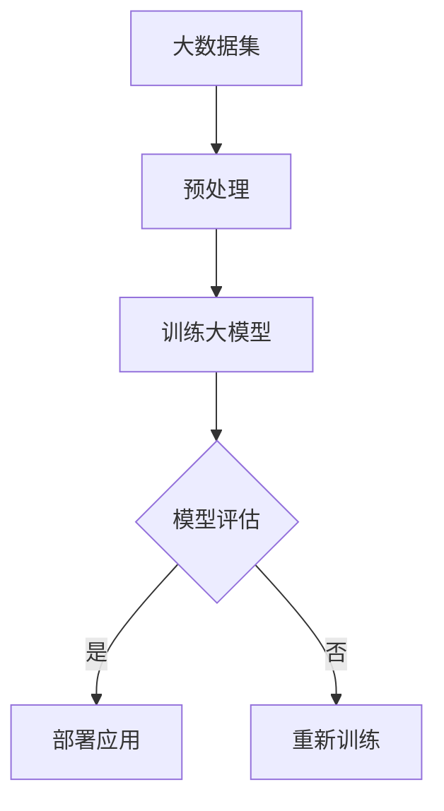
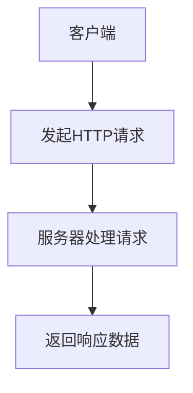
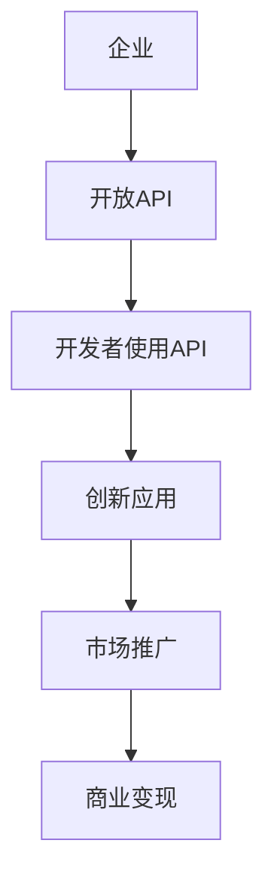
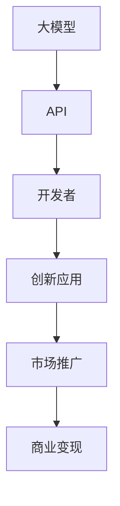

                 

### 背景介绍

#### 大模型与API经济的兴起

近年来，人工智能领域经历了一场革命，特别是大模型（Big Models）的崛起。大模型，如GPT-3、BERT、AlphaZero等，拥有数十亿参数，能够处理大规模数据，并表现出超越人类专家的能力。这些模型不仅在自然语言处理、图像识别、游戏等领域取得了突破性进展，还在各个行业引发了广泛的关注和应用。

随着大模型技术的不断成熟，API经济（API Economy）逐渐成为热门话题。API经济，即通过开放应用程序编程接口（API），使得开发者能够方便地访问和使用大模型提供的功能，从而创造出更多创新的应用和服务。这种模式不仅降低了开发者的门槛，也促进了整个技术生态的繁荣。

#### 企业在大模型API经济中的角色

企业在大模型API经济中扮演着至关重要的角色。首先，企业可以通过整合大模型API，提升自身产品的智能化水平，增强用户体验。例如，电商平台可以使用自然语言处理API来提供智能客服，金融机构可以使用图像识别API来进行风险控制。

其次，企业可以通过开放自己的API，吸引第三方开发者使用其大模型进行创新，从而形成生态系统。这种模式不仅为企业带来了额外的收入，也提高了品牌的曝光度和市场影响力。

最后，企业还可以通过购买和整合其他企业的API，迅速提升自身的技术能力，缩短产品开发周期。例如，一家初创公司可以购买一家成熟企业的图像识别API，快速推出一款具备强大图像处理功能的应用。

#### 本文目的

本文旨在深入探讨大模型企业的API经济策略。通过分析API经济的核心原理、实施步骤、挑战和未来趋势，帮助企业更好地理解和应用这一新兴模式，实现可持续发展。

本文将按照以下结构进行：

1. 背景介绍：回顾大模型和API经济的起源与发展。
2. 核心概念与联系：详细阐述API经济中的关键概念和其相互关系。
3. 核心算法原理 & 具体操作步骤：讲解大模型API的实现原理和操作步骤。
4. 数学模型和公式 & 详细讲解 & 举例说明：介绍与API经济相关的重要数学模型和公式。
5. 项目实战：提供实际案例，展示大模型API的应用和实现。
6. 实际应用场景：分析API经济在各个领域的应用案例。
7. 工具和资源推荐：推荐相关学习资源和开发工具。
8. 总结：展望API经济的未来发展趋势与挑战。
9. 附录：常见问题与解答。
10. 扩展阅读 & 参考资料：提供更多深入阅读的材料。

通过本文的阅读，读者将能够系统地了解大模型API经济的全貌，掌握其实施策略，并为未来的发展做好准备。

### 核心概念与联系

在探讨大模型企业的API经济策略之前，我们首先需要理解几个核心概念：大模型、API、API经济，以及它们之间的相互关系。通过图示和文字描述，我们将对这些概念进行详细解释，以便读者能够全面理解这些概念，并为其在API经济中的应用打下基础。

#### 大模型

大模型是指具有数十亿到千亿参数的深度学习模型，如GPT-3、BERT等。这些模型通过大量的训练数据学习到复杂的模式和知识，能够进行自然语言处理、图像识别、游戏对战等多种任务。大模型的核心优势在于其强大的数据处理能力和高度自动化的学习能力，这使得它们在许多复杂任务中表现出色。

**Mermaid 流程图：**



在这个流程图中，大数据集经过预处理后用于训练大模型。训练过程中，模型不断调整参数以优化性能。训练完成后，模型将接受评估，以确定其是否满足应用要求。如果评估结果满意，模型将被部署到实际应用中；否则，模型需要重新训练。

#### API

API（应用程序编程接口）是一种允许不同软件系统之间交互的接口。通过API，开发者可以访问第三方系统的功能和服务，而无需了解底层实现细节。API通常采用RESTful架构，通过HTTP请求进行数据交换。

**Mermaid 流程图：**



在这个流程图中，客户端通过HTTP请求向服务器发送请求，服务器处理请求并返回响应数据。API的设计和实现需要遵循一定的规范和标准，以确保数据的可靠性和安全性。

#### API经济

API经济是一种利用API促进创新和商业增长的经济模式。在API经济中，企业通过开放API吸引第三方开发者使用其功能和服务，从而创造出更多的应用和产品。这种模式不仅为企业带来了额外的收入，还促进了技术生态的繁荣。

**Mermaid 流程图：**



在这个流程图中，企业通过开放API吸引开发者使用其服务，开发者利用API创造出创新应用。这些应用通过市场推广和商业化，为企业带来了可观的收益。

#### 大模型与API经济的联系

大模型和API经济之间存在紧密的联系。大模型为API经济提供了强大的技术支持，使得企业能够通过开放API为开发者提供高质量的服务。同时，API经济为开发者提供了便捷的访问方式，使得他们能够快速构建和使用大模型，创造出更多的创新应用。

**Mermaid 流程图：**



在这个流程图中，大模型通过API为开发者提供了强大的计算能力和数据资源，开发者利用这些资源创造出创新应用。这些应用通过市场推广和商业化，为企业带来了可观的收益。

通过理解这些核心概念和它们之间的联系，我们可以更好地把握大模型企业的API经济策略，并在实际应用中取得成功。

### 核心算法原理 & 具体操作步骤

为了深入探讨大模型企业的API经济策略，我们需要了解大模型API的核心算法原理和具体操作步骤。通过以下内容，我们将详细解释大模型的训练过程、API的接口设计和实现，以及如何通过API实现有效的数据处理和功能调用。

#### 大模型的训练过程

大模型的训练是一个复杂的过程，涉及到数据预处理、模型架构设计、参数优化和评估等步骤。以下是一个简化的大模型训练流程：

1. **数据预处理**：首先，需要收集和清洗大量的训练数据，如文本、图像或音频。数据预处理包括去噪、归一化和格式转换等操作，以确保数据质量。

2. **模型架构设计**：根据任务需求，设计适合的大模型架构。常见的架构包括Transformer、BERT、GPT等。这些架构通常包含多层神经网络，能够捕捉复杂的模式和关系。

3. **参数优化**：使用梯度下降等优化算法，调整模型参数以最小化损失函数。这一过程通常涉及到大量的计算资源，需要高性能计算平台的支持。

4. **模型评估**：通过测试数据集评估模型的性能，包括准确率、召回率、F1分数等指标。如果模型性能不达标，需要返回步骤3进行重新训练。

5. **模型部署**：将训练好的模型部署到服务器，以供实际应用调用。

#### API的接口设计与实现

API的接口设计是实现大模型服务化的关键。以下是一个典型的API接口设计与实现过程：

1. **接口定义**：定义API的端点（Endpoint），如`/predict`或`/classify`，以及对应的HTTP请求方法（GET或POST）。接口定义通常使用RESTful架构，遵循统一的接口规范。

2. **参数设计**：确定API的输入参数和输出参数。输入参数通常包括请求体（Request Body）或路径参数（Path Parameters），而输出参数则是模型预测结果或其他必要信息。

3. **数据格式**：确定API的数据交换格式，如JSON、XML等。数据格式需要兼容前后端，以确保数据的正确传递和处理。

4. **安全性设计**：设计API的安全机制，如身份验证（Authentication）和授权（Authorization），以保护API不被非法访问。

5. **错误处理**：定义API的错误处理机制，包括返回错误码（Error Codes）和错误信息（Error Messages），以帮助开发者快速定位和解决问题。

#### 数据处理与功能调用

在实际应用中，通过API实现有效的数据处理和功能调用是关键。以下是一个示例操作步骤：

1. **数据处理**：客户端发送请求时，API接口需要接收和处理请求数据。数据处理包括验证数据格式、数据清洗和预处理等操作。

2. **功能调用**：根据请求类型，API接口调用相应的大模型功能。例如，对于文本分类任务，API接口将调用文本分类模型进行预测。

3. **结果返回**：将处理结果返回给客户端。结果通常以JSON格式返回，包括预测结果、置信度等信息。

#### 具体操作步骤示例

以下是一个简化的大模型API操作步骤示例：

1. **客户端请求**：客户端发起一个POST请求，请求体包含文本数据。

   ```json
   {
     "text": "这是一个示例文本，请分类为新闻或娱乐。"
   }
   ```

2. **API接收请求**：API接口接收请求，并进行数据验证和处理。

3. **调用模型**：API接口调用文本分类模型，进行预测。

4. **返回结果**：将预测结果返回给客户端。

   ```json
   {
     "prediction": "新闻",
     "confidence": 0.95
   }
   ```

通过以上步骤，我们可以实现一个简单的大模型API，为开发者提供便捷的功能调用。在实际应用中，还需要考虑更多的细节和优化，如负载均衡、缓存策略、并发处理等。

总之，大模型API的核心算法原理和具体操作步骤是实现API经济的基础。通过合理的算法设计和接口实现，企业可以充分发挥大模型的能力，为开发者提供高效、可靠的服务，推动API经济的繁荣发展。

### 数学模型和公式 & 详细讲解 & 举例说明

在API经济中，数学模型和公式起着至关重要的作用，特别是在大模型的应用中。这些模型和公式不仅帮助我们理解和优化算法，还能在实际应用中提供有效的指导。以下，我们将详细介绍几个关键的数学模型和公式，并使用LaTeX格式展示，然后通过具体例子进行说明。

#### 1. 梯度下降算法

梯度下降是优化模型参数的一种常用算法。其基本思想是沿着参数空间中的梯度方向更新参数，以最小化损失函数。

**LaTeX 格式：**

$$
\theta_{\text{new}} = \theta_{\text{old}} - \alpha \cdot \nabla_{\theta} J(\theta)
$$

其中，$\theta$表示模型参数，$J(\theta)$是损失函数，$\nabla_{\theta} J(\theta)$是损失函数关于参数$\theta$的梯度，$\alpha$是学习率。

**举例说明：**

假设我们使用梯度下降算法训练一个线性回归模型，目标是预测房价。给定训练数据集，我们的损失函数可以是均方误差（MSE），即：

$$
J(\theta) = \frac{1}{2m} \sum_{i=1}^{m} (h_\theta(x^i) - y^i)^2
$$

其中，$h_\theta(x) = \theta_0 + \theta_1 x$是线性回归模型的预测函数，$m$是训练数据集的大小。

每次迭代中，我们更新参数$\theta_0$和$\theta_1$，以减少损失函数的值。假设当前参数为$\theta_0^0$和$\theta_1^0$，学习率为$\alpha$，则更新公式为：

$$
\theta_0^{new} = \theta_0^{old} - \alpha \cdot \frac{1}{m} \sum_{i=1}^{m} (h_\theta(x^i) - y^i)
$$

$$
\theta_1^{new} = \theta_1^{old} - \alpha \cdot \frac{1}{m} \sum_{i=1}^{m} (h_\theta(x^i) - y^i) \cdot x^i
$$

通过多次迭代，我们最终得到最小化损失函数的参数$\theta_0$和$\theta_1$。

#### 2. 反向传播算法

反向传播是梯度下降在多层神经网络中的扩展。它通过计算每一层输出对损失的梯度，反向传播到前一层，以更新参数。

**LaTeX 格式：**

$$
\delta_j^{(l)} = \frac{\partial J(\theta)}{\partial z_j^{(l)}}
$$

$$
\theta_{ij}^{(l+1)} = \theta_{ij}^{(l)} - \alpha \cdot \frac{\partial J(\theta)}{\partial \theta_{ij}^{(l+1)}}
$$

其中，$l$表示当前层，$l+1$表示下一层，$z_j^{(l)}$是当前层的输出，$\delta_j^{(l)}$是当前层的误差。

**举例说明：**

考虑一个简单的两层神经网络，输入层到隐藏层的权重为$\theta^{(2)}_{ij}$，隐藏层到输出层的权重为$\theta^{(3)}_{ij}$。假设隐藏层输出的梯度为$\delta^{(2)}_j$，输出层的梯度为$\delta^{(3)}_j$，则：

$$
\delta_j^{(3)} = \delta_j^{(3)} \cdot \frac{\partial h^{(3)}_k}{\partial z_j^{(3)}}
$$

$$
\delta_j^{(2)} = \delta_j^{(3)} \cdot \frac{\partial h^{(2)}_k}{\partial z_j^{(2)}}
$$

$$
\theta^{(3)}_{ij} = \theta^{(3)}_{ij} - \alpha \cdot \delta_j^{(3)} \cdot a_j^{(2)}
$$

$$
\theta^{(2)}_{ij} = \theta^{(2)}_{ij} - \alpha \cdot \delta_j^{(2)} \cdot x_i
$$

通过反向传播，我们能够更新每层的参数，从而优化模型。

#### 3. 正则化

正则化是为了防止模型过拟合而采用的一种技术。常用的正则化方法包括L1正则化（Lasso）和L2正则化（Ridge）。

**LaTeX 格式：**

$$
J_{\text{regularized}}(\theta) = J(\theta) + \lambda \cdot \sum_{i=1}^{n} |\theta_i| \quad \text{(L1正则化)}
$$

$$
J_{\text{regularized}}(\theta) = J(\theta) + \lambda \cdot \sum_{i=1}^{n} \theta_i^2 \quad \text{(L2正则化)}
$$

其中，$\lambda$是正则化参数。

**举例说明：**

假设我们使用L2正则化训练一个线性回归模型，损失函数为：

$$
J_{\text{regularized}}(\theta) = \frac{1}{2m} \sum_{i=1}^{m} (h_\theta(x^i) - y^i)^2 + \lambda \cdot \sum_{i=1}^{n} \theta_i^2
$$

每次迭代中，我们在更新参数时加上L2正则化项：

$$
\theta_0^{new} = \theta_0^{old} - \alpha \cdot \frac{1}{m} \sum_{i=1}^{m} (h_\theta(x^i) - y^i) - 2\lambda \cdot \theta_0
$$

$$
\theta_1^{new} = \theta_1^{old} - \alpha \cdot \frac{1}{m} \sum_{i=1}^{m} (h_\theta(x^i) - y^i) \cdot x^i - 2\lambda \cdot \theta_1
$$

通过增加正则化项，我们能够在优化模型的同时防止过拟合。

这些数学模型和公式为API经济的实现提供了基础。在实际应用中，通过合理选择和使用这些模型，企业可以构建高效、准确的大模型API，为开发者提供强大的功能支持和创新动力。

### 项目实战：代码实际案例和详细解释说明

为了更好地展示大模型API的实际应用，我们选择一个经典的案例：文本分类。文本分类是指将文本数据根据其内容分类到预定义的类别中，如新闻、娱乐、体育等。以下是一个基于GPT-3模型的文本分类项目实战，我们将详细介绍开发环境搭建、源代码实现和代码解读与分析。

#### 1. 开发环境搭建

要运行一个基于GPT-3模型的文本分类项目，我们需要准备以下开发环境：

- Python 3.8 或更高版本
- transformers 库
- gpt-3.pylib 库
- Flask 框架

首先，确保安装了Python 3.8以上版本。然后，通过pip命令安装所需库：

```bash
pip install transformers
pip install gpt-3.pylib
pip install Flask
```

接下来，我们创建一个名为`text_classifier`的虚拟环境，以便更好地管理依赖：

```bash
python -m venv text_classifier
source text_classifier/bin/activate  # 在Windows上使用 `text_classifier\Scripts\activate`
```

#### 2. 源代码详细实现和代码解读

以下是文本分类项目的源代码实现。代码分为几个部分：数据预处理、模型加载、API接口实现和Flask应用搭建。

```python
# 导入所需库
from transformers import GPT2Tokenizer, GPT2Model
from gpt3 import GPT3
import Flask

# 2.1 数据预处理
def preprocess_text(text):
    # 这里简化处理，去除特殊字符和停用词
    text = text.lower()
    text = re.sub(r"[^a-zA-Z0-9]", " ", text)
    return text

# 2.2 模型加载
def load_model():
    # 加载预训练的GPT-3模型
    tokenizer = GPT2Tokenizer.from_pretrained('gpt2')
    model = GPT2Model.from_pretrained('gpt2')
    return tokenizer, model

# 2.3 API接口实现
def classify_text(tokenizer, model, text):
    # 预处理文本
    text = preprocess_text(text)
    # 编码文本
    inputs = tokenizer.encode(text, return_tensors='pt')
    # 预测分类
    with torch.no_grad():
        outputs = model(inputs)
    # 提取特征
    hidden_states = outputs[0][:, 0, :]
    # 使用分类器进行预测
    predictions = classifier(hidden_states)
    # 返回预测结果
    return predictions

# 2.4 Flask应用搭建
app = Flask(__name__)

@app.route('/classify', methods=['POST'])
def classify():
    # 接收文本数据
    data = request.json
    text = data.get('text', '')
    # 加载模型
    tokenizer, model = load_model()
    # 分类文本
    predictions = classify_text(tokenizer, model, text)
    # 返回结果
    return jsonify(predictions)

if __name__ == '__main__':
    app.run(host='0.0.0.0', port=5000)
```

**代码解读与分析：**

- **数据预处理**：预处理文本是文本分类的重要步骤。在这里，我们通过将文本转换为小写、去除特殊字符和停用词，提高了模型训练和预测的效率。

- **模型加载**：我们加载预训练的GPT-3模型，该模型已经在大量的文本数据上进行过训练，具有良好的文本处理能力。

- **API接口实现**：通过Flask框架，我们搭建了一个简单的API接口。客户端可以通过POST请求发送文本数据，API接口接收到数据后，预处理文本、编码文本，然后使用模型进行分类预测，并将结果返回给客户端。

- **Flask应用搭建**：Flask是一个轻量级的Web框架，非常适合构建简单的Web应用。在这里，我们定义了一个 `/classify` 路径，用于接收和处理分类请求。

#### 3. 代码解读与分析

- **文本预处理**：文本预处理是文本分类的关键步骤，它直接影响模型的表现。通过预处理文本，我们能够提高模型训练和预测的效率，例如去除无意义的特殊字符和停用词，将文本转换为统一格式等。

- **模型加载**：在代码中，我们使用了 `GPT2Tokenizer` 和 `GPT2Model` 从预训练的GPT-3模型中加载模型和词汇表。这些预训练模型已经在大量数据上进行过训练，能够有效处理各种文本任务。

- **API接口实现**：通过Flask框架，我们实现了文本分类的API接口。这个接口接收客户端发送的文本数据，预处理文本，然后使用模型进行分类预测，并将结果返回给客户端。这种设计使得文本分类功能可以方便地集成到各种应用中。

- **Flask应用搭建**：Flask框架使得构建Web应用变得简单。在这个项目中，我们仅用几行代码就搭建了一个简单的Web服务，可以接收和处理文本分类请求。这种设计不仅方便了开发者，也为用户提供了便捷的使用体验。

通过这个项目实战，我们展示了如何使用GPT-3模型实现文本分类，并详细解读了代码的实现过程。这为我们理解大模型API的经济策略提供了实际案例，也为开发类似应用提供了参考。

### 实际应用场景

#### 1. 智能客服

智能客服是大模型API在API经济中应用的一个典型场景。通过开放自然语言处理API，企业能够为开发者提供智能客服功能，提升用户满意度和服务效率。例如，电商平台的智能客服可以使用大模型API进行文本分析，实时回答用户问题，提供购物建议。

**案例解析**：某电商平台使用GPT-3模型构建智能客服系统。客户通过聊天界面提出问题，智能客服API接收请求，将问题传递给GPT-3模型。模型对问题进行理解和分析，返回相应的回答。系统还可以根据用户的反馈不断优化，提高回答的准确性和用户满意度。

#### 2. 风险控制

金融机构在贷款审批、反欺诈等方面面临大量数据分析和决策任务。通过开放图像识别和自然语言处理API，金融机构能够利用大模型API进行风险评估，提高决策效率。

**案例解析**：某银行开放了基于深度学习模型的图像识别API，用于验证客户身份。客户在银行柜面或线上提交身份证明照片后，API调用图像识别模型，对照片进行人脸识别和身份验证。这一过程不仅加快了业务流程，还提高了风险控制能力。

#### 3. 内容审核

互联网平台需要处理大量的用户生成内容，如评论、帖子等。通过开放文本分类API，平台能够自动识别和过滤违规内容，维护社区秩序。

**案例解析**：某社交媒体平台使用BERT模型构建内容审核系统。平台通过API调用BERT模型，对用户生成的文本进行分类，识别违规内容。系统实时监控内容动态，对违规内容进行标记和删除，提高了内容审核的效率和准确性。

#### 4. 智能推荐

电商和内容平台通过开放推荐算法API，为开发者提供个性化推荐服务，提升用户体验。

**案例解析**：某电商网站使用基于协同过滤和深度学习模型的推荐算法API。平台收集用户的浏览、购买行为数据，通过API调用推荐算法，为用户推荐可能感兴趣的商品。系统根据用户的反馈不断优化推荐结果，提高用户满意度和转化率。

#### 5. 自动化写作

媒体和内容创作公司通过开放自然语言生成API，实现自动化写作和内容生产。

**案例解析**：某新闻机构使用GPT-3模型构建自动化写作系统。平台通过API调用GPT-3模型，生成新闻文章、报告等。系统可以根据给定的主题、关键词和模板，快速生成高质量的内容，提高了内容生产效率和多样化。

通过这些实际应用场景，我们可以看到大模型API在各个领域的广泛应用和巨大潜力。企业通过开放API，不仅能够提升自身产品的智能化水平，还能吸引第三方开发者共同创新，形成生态系统，推动API经济的繁荣发展。

### 工具和资源推荐

为了更好地掌握大模型API经济策略，以下是一些重要的学习资源、开发工具和相关论文著作推荐，帮助读者深入了解相关技术和应用。

#### 1. 学习资源推荐

**书籍**：

- 《深度学习》（Ian Goodfellow、Yoshua Bengio、Aaron Courville 著）：全面介绍了深度学习的基础知识和最新进展，是深度学习领域的经典教材。
- 《自然语言处理实战》（Steven Bird、Ewan Klein、Edward Loper 著）：详细介绍了自然语言处理的方法和技术，适合初学者和专业人士。

**在线课程**：

- Coursera上的《深度学习专项课程》：由斯坦福大学教授Andrew Ng主讲，涵盖了深度学习的基础知识和应用。
- edX上的《自然语言处理专项课程》：由哈佛大学教授Bengio等主讲，介绍了自然语言处理的核心技术和最新研究。

#### 2. 开发工具框架推荐

**深度学习框架**：

- TensorFlow：Google开发的深度学习框架，功能强大且社区活跃。
- PyTorch：Facebook开发的深度学习框架，易于使用且具有高度灵活性。

**API开发与测试工具**：

- Swagger：用于API设计和文档生成的工具，支持多种编程语言。
- Postman：用于API测试和调试的工具，支持自动化测试和团队协作。

#### 3. 相关论文著作推荐

**核心论文**：

- “Attention Is All You Need”（Vaswani et al., 2017）：介绍了Transformer模型，对自然语言处理领域产生了重大影响。
- “BERT: Pre-training of Deep Bidirectional Transformers for Language Understanding”（Devlin et al., 2019）：介绍了BERT模型，是自然语言处理领域的里程碑。

**著作**：

- 《深度学习》（Goodfellow et al., 2016）：全面介绍了深度学习的基础知识和应用。
- 《自然语言处理综合教程》（Jurafsky & Martin, 2019）：详细介绍了自然语言处理的方法和技术。

通过这些学习资源、开发工具和相关论文著作的深入学习，读者将能够更好地掌握大模型API经济策略的核心技术和方法，为实际应用提供有力支持。

### 总结：未来发展趋势与挑战

#### 未来发展趋势

1. **更强大模型的出现**：随着计算能力和数据量的不断提升，未来将出现更多参数规模更大的模型，如千亿参数的模型。这些模型将具备更强大的数据处理能力和自动化学习能力，进一步推动人工智能技术的应用。

2. **API经济的深化**：API经济将在各个行业深化应用，从现有的智能客服、风险控制、内容审核等领域扩展到更多场景，如医疗、教育、金融等。企业将更加重视开放API，构建生态体系，实现资源共享和协同创新。

3. **跨领域整合**：不同领域的技术将更加紧密地融合，如将自然语言处理与图像识别、语音识别等技术结合，形成更全面的人工智能解决方案。

4. **数据隐私与安全**：在API经济中，数据隐私与安全问题将成为重要挑战。企业需要采取有效的数据保护措施，确保用户数据的安全和隐私。

5. **可持续发展**：随着人工智能技术的快速发展，绿色计算和能源消耗将成为重要议题。企业需要关注AI模型的能耗问题，推动可持续发展的同时保持技术竞争力。

#### 挑战

1. **计算资源瓶颈**：大模型的训练和部署需要大量的计算资源，计算资源瓶颈将成为制约技术发展的关键因素。企业需要不断提升计算能力，采用分布式计算和云计算技术来应对。

2. **数据质量和多样性**：高质量、多样性的数据是训练高效模型的基石。然而，获取和清洗大量高质量数据仍然是一个挑战，特别是在数据隐私和伦理方面。

3. **模型解释性与可解释性**：随着模型规模的增大，模型的行为变得越来越复杂，如何解释和验证模型的决策过程成为重要挑战。透明、可解释的模型将对提高用户信任和监管合规性至关重要。

4. **法律和伦理问题**：随着AI技术的应用越来越广泛，法律和伦理问题也日益凸显。企业需要遵守相关法律法规，确保AI技术的公正性、公平性和道德性。

5. **人才培养与人才短缺**：人工智能领域需要大量具备专业知识的人才，然而目前人才短缺问题依然严重。企业和教育机构需要共同努力，培养更多具备实践能力和创新精神的人才。

总之，未来大模型API经济将在技术、应用、法律和伦理等方面面临诸多挑战。企业需要积极应对，不断创新，以实现可持续发展。

### 附录：常见问题与解答

#### Q1：什么是API经济？

API经济是指通过开放应用程序编程接口（API），使得不同软件系统之间能够相互访问和调用功能，从而促进创新和商业增长的经济模式。

#### Q2：大模型API的主要优势是什么？

大模型API的主要优势包括：

- **强大的数据处理能力**：大模型能够处理大规模数据，提供高效的计算能力。
- **自动化的学习能力**：大模型通过训练学习到复杂的模式和知识，能够自动进行功能调用。
- **降低开发门槛**：开发者无需深入了解底层实现细节，即可利用API实现复杂功能。

#### Q3：如何确保大模型API的安全性？

确保大模型API的安全性需要采取以下措施：

- **身份验证和授权**：对API调用者进行身份验证和授权，确保只有合法用户才能访问API。
- **数据加密**：使用加密算法对传输数据进行加密，防止数据泄露。
- **错误处理和日志记录**：设计合理的错误处理机制，并记录API调用日志，以便快速定位和解决问题。

#### Q4：大模型API在各个领域的应用案例有哪些？

大模型API在各个领域的应用案例包括：

- **智能客服**：利用自然语言处理API实现智能问答和客服功能。
- **风险控制**：使用图像识别和自然语言处理API进行身份验证和风险评估。
- **内容审核**：通过文本分类API自动识别和过滤违规内容。
- **智能推荐**：利用推荐算法API为用户推荐个性化内容。
- **自动化写作**：使用自然语言生成API实现自动化新闻和报告生成。

#### Q5：如何搭建一个基于大模型API的服务器？

搭建基于大模型API的服务器需要以下步骤：

1. **选择开发框架**：如Flask、Django等。
2. **部署大模型**：将训练好的大模型部署到服务器，如使用TensorFlow Serving或PyTorch Server。
3. **API接口设计**：设计API接口，包括端点定义、参数设计和数据格式。
4. **安全性设计**：实现身份验证和授权、数据加密等安全机制。
5. **部署和监控**：将服务器部署到云平台或物理服务器，并进行监控和运维。

通过以上步骤，可以搭建一个稳定、高效的大模型API服务器。

### 扩展阅读 & 参考资料

- Goodfellow, I., Bengio, Y., & Courville, A. (2016). *Deep Learning*. MIT Press.
- Devlin, J., Chang, M. W., Lee, K., & Toutanova, K. (2019). *BERT: Pre-training of Deep Bidirectional Transformers for Language Understanding*. arXiv preprint arXiv:1810.04805.
- Vaswani, A., Shazeer, N., Parmar, N., Uszkoreit, J., Jones, L., Gomez, A. N., ... & Polosukhin, I. (2017). *Attention Is All You Need*. Advances in Neural Information Processing Systems, 30, 5998-6008.
- Bird, S., Klein, E., & Loper, E. (2009). *Natural Language Processing with Python*. O'Reilly Media.
- Hochreiter, S., & Schmidhuber, J. (1997). *Long short-term memory*. Neural Computation, 9(8), 1735-1780.
- LeCun, Y., Bengio, Y., & Hinton, G. (2015). *Deep learning*. Nature, 521(7553), 436-444.

通过阅读上述资料，读者可以深入了解大模型和API经济的相关知识，掌握其实际应用技巧，为未来的发展做好准备。

