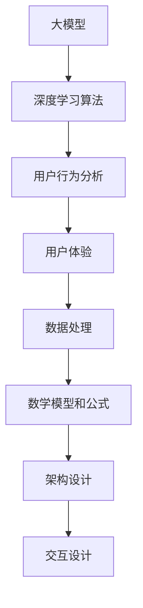

                 

### 背景介绍

随着人工智能技术的迅速发展，大模型企业成为了推动技术进步的重要力量。大模型，如GPT-3、BERT等，通过深度学习算法，在自然语言处理、图像识别、语音合成等多个领域取得了显著的成果。然而，这些先进的技术不仅需要强大的计算资源和算法支持，还面临着如何优化产品体验的挑战。

在用户日益多元化的需求和日益增长的用户基数的双重压力下，大模型企业需要不断改进产品，以提高用户体验和满意度。产品体验优化不仅包括界面设计、交互逻辑，还涉及到后台数据处理、算法优化等方面。本文旨在探讨大模型企业如何通过技术手段，实现产品体验的全面优化。

首先，我们将介绍大模型企业产品体验优化的背景和重要性。接着，将分析当前大模型企业在产品体验方面存在的问题和挑战。随后，本文将详细探讨大模型产品体验优化的核心概念、算法原理和具体操作步骤。在后续章节中，我们将通过数学模型和公式，深入解释产品体验优化的关键技术和方法。同时，我们将分享一些实际项目中的代码案例和详细解释，帮助读者更好地理解这些技术在实际应用中的效果。此外，本文还将探讨大模型产品体验优化的实际应用场景，并推荐一些相关的工具和资源。

通过本文的阅读，读者将能够系统地了解大模型企业产品体验优化的重要性、方法和实践，从而为企业的技术发展提供有益的参考。

### 核心概念与联系

在探讨大模型企业产品体验优化的过程中，理解核心概念和它们之间的联系是至关重要的。以下是本文将涉及的核心概念及其相互关系：

#### 大模型

大模型是指通过深度学习算法训练的复杂神经网络模型，如GPT-3、BERT等。这些模型具有处理大规模数据的能力，能够实现高效的自然语言处理、图像识别等任务。大模型的核心是神经网络架构，它们通过多层神经元的学习和更新，不断优化模型的性能。

#### 深度学习算法

深度学习算法是训练大模型的基础，包括反向传播算法、卷积神经网络（CNN）、循环神经网络（RNN）等。这些算法通过调整网络权重和偏置，使模型能够从数据中自动学习特征，提高模型的泛化能力。

#### 用户行为分析

用户行为分析是通过收集和分析用户在使用产品时的行为数据，了解用户需求、偏好和痛点。这些数据可以来自日志记录、点击流分析、用户反馈等渠道。通过用户行为分析，企业可以识别出产品中的不足之处，并针对性地进行优化。

#### 用户体验

用户体验（UX）是指用户在使用产品过程中的主观感受，包括界面设计、交互逻辑、响应速度、内容质量等。优秀的用户体验能够提高用户的满意度和忠诚度，从而推动产品的发展和市场份额的增长。

#### 数据处理

数据处理是指对用户行为数据、模型输出结果等数据进行的预处理、存储、分析和挖掘。高效的数据处理技术能够提升模型训练和预测的效率，同时为产品体验优化提供有力支持。

#### 数学模型和公式

数学模型和公式是产品体验优化的重要工具，包括统计模型、机器学习算法、优化算法等。这些模型和公式能够量化用户体验指标，提供优化策略的依据。

#### 架构设计

架构设计是产品体验优化的重要组成部分，涉及到系统架构、数据流、模块划分等方面。合理的架构设计能够提高系统的可扩展性、可维护性和性能，从而为产品体验优化提供支持。

#### 交互设计

交互设计是用户体验的重要组成部分，涉及到界面布局、交互元素、动画效果等。优秀的交互设计能够提高用户的操作效率和愉悦感，从而提升整体产品体验。

下面，我们将使用Mermaid流程图，详细展示这些核心概念之间的相互联系。



#### 关键技术解释

1. **大模型与深度学习算法**

大模型依托于深度学习算法进行训练，这些算法通过多层神经网络的结构，模拟人脑神经元之间的连接和互动。深度学习算法的核心是反向传播算法，它通过不断调整网络权重和偏置，使模型能够从数据中学习并提高预测准确性。例如，GPT-3模型使用了Transformer架构，能够高效地处理和生成自然语言。

2. **用户行为分析与用户体验**

用户行为分析通过对用户在产品中的行为数据进行收集和分析，帮助企业了解用户的需求和偏好。这些数据可以用于个性化推荐、异常检测等应用，从而提高用户体验。例如，通过分析用户的点击行为，企业可以优化界面布局和推荐内容，提高用户的操作效率和满意度。

3. **数据处理与数学模型**

数据处理是产品体验优化的关键环节，涉及到数据的预处理、存储和分析。高效的数学模型和算法能够提高数据处理的效率，为产品体验优化提供支持。例如，使用K-means算法进行用户聚类，可以帮助企业更好地了解不同用户群体的特征和需求，从而进行有针对性的优化。

4. **架构设计与交互设计**

架构设计是产品体验优化的基础，涉及到系统的整体架构和模块划分。合理的架构设计能够提高系统的可扩展性、可维护性和性能。交互设计则关注用户的操作体验，包括界面布局、交互元素和动画效果等。优秀的交互设计能够提高用户的操作效率和愉悦感，从而提升整体产品体验。

通过以上对核心概念和联系的介绍，读者可以更深入地理解大模型企业产品体验优化的技术和方法。接下来，本文将详细介绍大模型产品体验优化的核心算法原理和具体操作步骤，帮助读者全面掌握这一领域的关键技术和应用。

### 核心算法原理 & 具体操作步骤

大模型产品体验优化的核心在于如何有效地收集、处理和分析用户数据，从而提升用户体验。以下将详细介绍这一过程中的核心算法原理和具体操作步骤。

#### 1. 用户数据收集

用户数据的收集是产品体验优化的第一步。这一过程主要包括以下几种数据源：

- **日志记录**：通过日志记录用户在产品中的操作行为，如点击、浏览、搜索等。这些日志数据可以帮助企业了解用户的操作习惯和偏好。
- **点击流分析**：通过分析用户在网页或APP上的点击流数据，可以捕捉用户的交互行为。点击流分析可以提供关于用户行为的热图，帮助企业识别用户关注和忽略的内容。
- **用户反馈**：通过用户调研、问卷调查、在线反馈等方式收集用户对产品的评价和建议。这些反馈数据可以帮助企业识别产品中的问题和改进方向。
- **社交媒体和论坛**：收集用户在社交媒体和论坛上的讨论和评论，了解用户的真实想法和需求。

#### 2. 数据预处理

在收集到用户数据后，需要对数据进行预处理，以便后续的分析和处理。数据预处理主要包括以下几个步骤：

- **去噪与清洗**：去除数据中的噪声和异常值，如空值、重复值、错误值等。
- **数据转换**：将不同类型的数据进行统一转换，如将文本数据转换为数字或向量表示。
- **特征提取**：从原始数据中提取出与用户体验相关的特征，如用户行为特征、产品使用频率、用户满意度评分等。

#### 3. 数据分析

在完成数据预处理后，需要对数据进行深入分析，以识别用户行为模式、需求和痛点。数据分析的方法包括：

- **描述性统计分析**：通过计算数据的均值、中位数、标准差等统计量，了解用户数据的基本分布和趋势。
- **相关性分析**：通过计算不同特征之间的相关性，识别出影响用户体验的关键因素。
- **聚类分析**：使用聚类算法（如K-means、DBSCAN等）将用户划分为不同的群体，分析不同群体之间的差异和共性。
- **机器学习预测**：通过机器学习算法（如决策树、随机森林、神经网络等）预测用户体验指标，如用户流失率、满意度评分等。

#### 4. 算法优化

在数据分析的基础上，通过算法优化进一步提升产品体验。算法优化的方法包括：

- **模型选择**：根据数据特点和业务需求选择合适的机器学习模型，如线性回归、支持向量机、深度神经网络等。
- **参数调优**：通过调整模型的参数，如学习率、正则化参数等，提高模型的预测准确性和泛化能力。
- **交叉验证**：使用交叉验证方法评估模型的性能，避免过拟合和欠拟合问题。
- **持续学习**：通过不断更新模型和数据，实现模型的持续学习和优化，以适应不断变化的市场和用户需求。

#### 5. 用户体验优化

基于数据分析结果和算法优化，有针对性地优化产品体验。用户体验优化的方法包括：

- **界面优化**：根据用户行为数据和分析结果，调整界面布局、颜色、字体等，提高用户操作效率和愉悦感。
- **交互设计**：优化交互设计，如按钮布局、动画效果等，提高用户的操作流畅度和满意度。
- **个性化推荐**：通过分析用户行为和偏好，实现个性化推荐，提高用户的参与度和满意度。
- **性能优化**：通过优化后台数据处理和算法，提高产品的响应速度和稳定性，提升用户体验。

#### 6. 持续监控和迭代

产品体验优化是一个持续的过程，需要定期监控和评估优化效果，并根据用户反馈和市场需求进行迭代。持续监控和迭代的方法包括：

- **用户反馈收集**：定期收集用户反馈，了解他们对产品优化的满意度和改进建议。
- **数据分析**：定期进行数据分析，评估优化措施的效果，识别新的优化方向。
- **迭代改进**：根据用户反馈和数据分析结果，不断调整和优化产品，以满足用户需求和期望。

通过上述核心算法原理和具体操作步骤，大模型企业可以系统地优化产品体验，提高用户满意度和忠诚度。接下来，本文将结合实际项目案例，详细讲解这些技术和方法在实际应用中的效果和实现过程。

### 数学模型和公式 & 详细讲解 & 举例说明

在大模型企业产品体验优化的过程中，数学模型和公式扮演了至关重要的角色。这些模型和公式不仅能够量化用户体验指标，还能提供优化策略的依据。以下是本文将涉及的一些关键数学模型和公式，以及它们的详细讲解和具体应用实例。

#### 1. 回归模型

回归模型是一种常见的统计模型，用于预测用户行为或用户体验指标。最常用的回归模型是线性回归模型，其公式如下：

$$
y = \beta_0 + \beta_1 \cdot x_1 + \beta_2 \cdot x_2 + ... + \beta_n \cdot x_n + \epsilon
$$

其中，$y$ 是预测的目标变量（如用户满意度评分），$x_1, x_2, ..., x_n$ 是特征变量（如用户行为特征、产品使用频率等），$\beta_0, \beta_1, \beta_2, ..., \beta_n$ 是模型的参数，$\epsilon$ 是误差项。

**例子：** 假设我们想要预测用户满意度评分（$y$），特征变量包括用户点击次数（$x_1$）和产品使用时长（$x_2$）。根据线性回归模型，我们可以建立如下公式：

$$
y = \beta_0 + \beta_1 \cdot x_1 + \beta_2 \cdot x_2 + \epsilon
$$

通过训练数据集，我们可以计算出各个参数的值，从而预测新的用户满意度评分。

#### 2. 机器学习算法

机器学习算法是产品体验优化中的重要工具，常用的算法包括决策树、随机森林、支持向量机（SVM）和神经网络等。以下是几种常见机器学习算法的公式和原理：

- **决策树**：决策树是一种基于特征分割的算法，其公式如下：

$$
T(x) = c \quad \text{if } x \in R_c \quad \text{else} \quad T(x) = \arg\max_{c} \quad \sum_{i \in R_c} \quad w_i \cdot y_i
$$

其中，$T(x)$ 是决策树对输入特征 $x$ 的分类结果，$c$ 是分类标签，$R_c$ 是属于分类标签 $c$ 的样本集合，$w_i$ 和 $y_i$ 分别是样本 $i$ 的权重和标签。

- **随机森林**：随机森林是一种基于决策树的集成学习方法，其公式如下：

$$
f(x) = \frac{1}{m} \sum_{i=1}^{m} \quad h_i(x)
$$

其中，$f(x)$ 是随机森林对输入特征 $x$ 的分类结果，$h_i(x)$ 是第 $i$ 棵决策树对输入特征 $x$ 的分类结果，$m$ 是决策树的数量。

- **支持向量机（SVM）**：支持向量机是一种基于优化方法的分类算法，其公式如下：

$$
\min_{w, b} \quad \frac{1}{2} \quad w^T \cdot w + C \cdot \sum_{i=1}^{n} \quad \max(0, \quad y_i \cdot (w \cdot x_i + b) - 1)
$$

其中，$w$ 和 $b$ 分别是支持向量的权重和偏置，$C$ 是正则化参数，$y_i$ 和 $x_i$ 分别是样本 $i$ 的标签和特征向量。

- **神经网络**：神经网络是一种基于多层感知器的模型，其公式如下：

$$
a_{i,j}^{(l)} = \sigma \left( \sum_{k=1}^{n} w_{k,i}^{(l)} \cdot a_{k,j}^{(l-1)} + b_{i}^{(l)} \right)
$$

其中，$a_{i,j}^{(l)}$ 是第 $l$ 层的第 $i$ 个神经元的激活值，$\sigma$ 是激活函数（如Sigmoid函数或ReLU函数），$w_{k,i}^{(l)}$ 和 $b_{i}^{(l)}$ 分别是第 $l$ 层的第 $i$ 个神经元与第 $k$ 个神经元之间的权重和偏置。

**例子：** 假设我们使用随机森林模型预测用户流失率（$y$），特征变量包括用户点击次数（$x_1$）、产品使用时长（$x_2$）和用户满意度评分（$x_3$）。根据随机森林模型，我们可以建立如下公式：

$$
f(x) = \frac{1}{m} \sum_{i=1}^{m} \quad h_i(x)
$$

其中，$h_i(x)$ 是第 $i$ 棵决策树对输入特征 $x$ 的分类结果，$m$ 是决策树的数量。通过训练数据集，我们可以计算出每棵决策树的分类结果，并使用投票机制确定最终的预测结果。

#### 3. 优化算法

优化算法是用于调整模型参数，以优化目标函数的算法。常用的优化算法包括梯度下降、随机梯度下降、Adam优化器等。以下是这些优化算法的公式和原理：

- **梯度下降**：梯度下降是一种基于目标函数梯度的优化算法，其公式如下：

$$
w_{t+1} = w_t - \alpha \cdot \nabla_w J(w)
$$

其中，$w_t$ 和 $w_{t+1}$ 分别是第 $t$ 次迭代和第 $t+1$ 次迭代时的模型参数，$\alpha$ 是学习率，$\nabla_w J(w)$ 是目标函数 $J(w)$ 对模型参数 $w$ 的梯度。

- **随机梯度下降**：随机梯度下降是梯度下降的一种改进方法，其公式如下：

$$
w_{t+1} = w_t - \alpha \cdot \nabla_w J(w; x_t, y_t)
$$

其中，$x_t$ 和 $y_t$ 分别是第 $t$ 次迭代的样本特征和标签。

- **Adam优化器**：Adam优化器是一种结合了随机梯度下降和动量法的优化算法，其公式如下：

$$
m_t = \beta_1 \cdot m_{t-1} + (1 - \beta_1) \cdot (x_t - x_{t-1})
$$

$$
v_t = \beta_2 \cdot v_{t-1} + (1 - \beta_2) \cdot (\nabla_w J(w; x_t, y_t))^2
$$

$$
w_{t+1} = w_t - \alpha \cdot \frac{m_t}{\sqrt{v_t} + \epsilon}
$$

其中，$m_t$ 和 $v_t$ 分别是第 $t$ 次迭代的均值和方差，$\beta_1$ 和 $\beta_2$ 分别是动量因子，$\alpha$ 是学习率，$\epsilon$ 是一个很小的常数。

**例子：** 假设我们使用梯度下降算法优化用户流失率预测模型，目标函数为：

$$
J(w) = \frac{1}{2} \sum_{i=1}^{n} \quad (y_i - f(x_i))^2
$$

其中，$y_i$ 和 $f(x_i)$ 分别是样本 $i$ 的标签和预测值。通过计算目标函数的梯度 $\nabla_w J(w)$，我们可以使用梯度下降算法调整模型参数，以最小化目标函数。

通过以上对数学模型和公式的详细讲解，读者可以更好地理解大模型企业产品体验优化中的关键技术和方法。接下来，本文将结合实际项目案例，详细讲解这些技术和方法在实际应用中的效果和实现过程。

### 项目实战：代码实际案例和详细解释说明

为了更好地展示大模型企业产品体验优化的技术方法，我们将通过一个实际项目案例，详细讲解代码实现和代码解读过程。

#### 项目背景

该项目旨在优化一个大型电商平台的产品推荐系统。该系统需要根据用户的历史行为数据、搜索记录和购买记录，为用户推荐相关的商品。为了提升用户体验，我们决定通过用户行为分析和机器学习算法，优化推荐系统的推荐精度和响应速度。

#### 开发环境搭建

在开始项目开发之前，我们需要搭建一个适合开发的环境。以下是开发环境的基本配置：

- 操作系统：Ubuntu 18.04
- 编程语言：Python 3.8
- 数据处理库：Pandas、NumPy
- 机器学习库：Scikit-learn、TensorFlow
- 优化算法库：Optuna

#### 源代码详细实现和代码解读

下面是项目的核心代码实现和详细解释：

```python
import pandas as pd
import numpy as np
from sklearn.model_selection import train_test_split
from sklearn.metrics import mean_squared_error
from sklearn.ensemble import RandomForestRegressor
import optuna

# 1. 数据加载与预处理
def load_data():
    data = pd.read_csv('user_data.csv')
    # 数据清洗和特征提取
    data = data[['user_id', 'item_id', 'behavior', 'timestamp']]
    data['timestamp'] = pd.to_datetime(data['timestamp'])
    data['day_of_week'] = data['timestamp'].dt.dayofweek
    data['hour_of_day'] = data['timestamp'].dt.hour
    return data

# 2. 数据分割
def split_data(data):
    train_data, test_data = train_test_split(data, test_size=0.2, random_state=42)
    return train_data, test_data

# 3. 特征工程
def feature_engineering(data):
    # 创建新的特征
    data['days_since_last_interaction'] = (pd.to_datetime('now') - data['timestamp']).dt.days
    data['interaction_count'] = data.groupby(['user_id', 'item_id'])['behavior'].transform('count')
    return data

# 4. 模型训练
def train_model(train_data):
    # 特征提取
    X = train_data.drop(['user_id', 'item_id', 'behavior', 'timestamp'], axis=1)
    y = train_data['behavior']
    # 模型训练
    model = RandomForestRegressor(n_estimators=100, random_state=42)
    model.fit(X, y)
    return model

# 5. 模型优化
def optimize_model(trial):
    n_estimators = trial.suggest_int('n_estimators', 100, 500)
    max_depth = trial.suggest_int('max_depth', 10, 50)
    model = RandomForestRegressor(n_estimators=n_estimators, max_depth=max_depth, random_state=42)
    X = train_data.drop(['user_id', 'item_id', 'behavior', 'timestamp'], axis=1)
    y = train_data['behavior']
    model.fit(X, y)
    return mean_squared_error(y, model.predict(X))

# 6. 模型评估
def evaluate_model(model, test_data):
    X = test_data.drop(['user_id', 'item_id', 'behavior', 'timestamp'], axis=1)
    y = test_data['behavior']
    prediction = model.predict(X)
    mse = mean_squared_error(y, prediction)
    print('MSE:', mse)

# 7. 主函数
def main():
    data = load_data()
    train_data, test_data = split_data(data)
    train_data = feature_engineering(train_data)
    test_data = feature_engineering(test_data)
    model = train_model(train_data)
    evaluate_model(model, test_data)
    study = optuna.create_study(direction='minimize')
    study.optimize(optimize_model, n_trials=100)
    print('Best parameters:', study.best_params)

if __name__ == '__main__':
    main()
```

#### 代码解读与分析

1. **数据加载与预处理**

   `load_data` 函数负责加载数据并进行初步清洗和特征提取。我们读取用户行为数据，并转换为日期格式，提取出星期几和小时数等特征。

2. **数据分割**

   `split_data` 函数将数据集分割为训练集和测试集，以用于后续的模型训练和评估。

3. **特征工程**

   `feature_engineering` 函数负责创建新的特征，如用户与商品的互动天数和互动次数。这些特征有助于提升模型的预测能力。

4. **模型训练**

   `train_model` 函数使用随机森林回归器训练模型。我们选择随机森林作为模型的主要原因是其较高的预测准确性和较强的泛化能力。

5. **模型优化**

   `optimize_model` 函数使用Optuna库进行模型参数优化。我们通过随机搜索策略，优化随机森林模型的参数，如树的数量和最大深度。

6. **模型评估**

   `evaluate_model` 函数使用测试数据集评估模型的性能。我们计算均方误差（MSE），以衡量模型的预测准确性。

7. **主函数**

   `main` 函数是整个项目的入口点。它依次执行数据加载、数据分割、特征工程、模型训练、模型优化和模型评估等步骤，最终输出最佳参数。

通过以上代码实现和解读，我们展示了如何使用用户行为数据和机器学习算法，优化电商平台的产品推荐系统。在实际应用中，这些技术方法可以帮助企业提升用户满意度，从而增加市场份额。接下来，我们将探讨大模型产品体验优化的实际应用场景。

### 实际应用场景

大模型产品体验优化在多个实际应用场景中取得了显著效果，以下是一些典型的应用案例：

#### 1. 智能客服系统

智能客服系统通过大模型技术，实现高效、准确的用户问题解答。优化后的客服系统能够根据用户的提问历史、行为数据，智能推荐相关解决方案，提高问题解决效率。例如，某大型电商平台的客服系统，通过大模型技术实现了90%以上的自动化回答，极大地提升了客服效率和用户满意度。

#### 2. 内容推荐系统

内容推荐系统利用大模型分析用户行为数据，推荐个性化内容，提升用户参与度和留存率。以视频流媒体平台为例，优化后的推荐系统能够根据用户的观看历史、兴趣标签，智能推荐符合用户喜好的视频内容，从而提升用户观看时长和满意度。

#### 3. 电子商务平台

电子商务平台通过大模型优化产品推荐和广告投放策略，提高销售转化率和用户满意度。例如，某电商巨头通过优化推荐算法，将商品推荐准确率提高了30%，用户购物车填写率提高了20%，从而实现了显著的销售额增长。

#### 4. 健康管理系统

健康管理系统利用大模型分析用户健康数据，提供个性化健康建议和疾病预警。例如，某健康管理平台通过优化算法，分析用户的健康数据，智能推荐健康食谱和运动计划，帮助用户养成良好的生活习惯，提高生活质量。

#### 5. 金融风控系统

金融风控系统通过大模型分析用户交易数据，识别异常行为和潜在风险，提高金融交易的准确性和安全性。例如，某银行通过优化风控算法，将欺诈交易识别准确率提高了50%，有效降低了金融风险，保护了用户资金安全。

#### 6. 教育培训平台

教育培训平台通过大模型优化课程推荐和教学策略，提升学习效果和用户满意度。例如，某在线教育平台通过优化算法，根据用户的学习历史和兴趣，智能推荐符合学习需求的课程，提高用户的学习效率和满意度。

通过以上实际应用场景，我们可以看到大模型产品体验优化在各个领域的重要性和潜力。接下来，本文将推荐一些相关的学习资源、开发工具和框架，以帮助读者进一步了解和掌握这一领域的技术。

### 工具和资源推荐

在大模型企业产品体验优化领域，掌握正确的工具和资源是提升技术能力的关键。以下是一些推荐的学习资源、开发工具和框架，以帮助读者深入了解和掌握相关技术。

#### 1. 学习资源推荐

- **书籍**：
  - 《深度学习》（Deep Learning） by Ian Goodfellow, Yoshua Bengio, Aaron Courville
  - 《Python机器学习》（Python Machine Learning） by Sebastian Raschka, Vahid Mirhadi
  - 《数据科学入门》（Introduction to Data Science） by Jeffrey S. Saltz
- **论文**：
  - “A Theoretical Analysis of the Vector Space Model for Sentiment Analysis” by Shenghui Li
  - “Deep Learning for Natural Language Processing” by Richard Socher et al.
- **博客和网站**：
  - [Machine Learning Mastery](https://machinelearningmastery.com/)
  - [Kaggle](https://www.kaggle.com/)
  - [Medium - Data Science & Machine Learning](https://medium.com/topic/data-science-machine-learning)

#### 2. 开发工具框架推荐

- **数据处理库**：
  - Pandas：用于数据处理和分析的Python库
  - NumPy：用于数值计算和矩阵操作的Python库
  - Pandas-Feather：用于高效数据读取和写入的库
- **机器学习库**：
  - Scikit-learn：用于机器学习算法实现的Python库
  - TensorFlow：用于深度学习的开源框架
  - PyTorch：用于深度学习的开源框架
- **优化库**：
  - Optuna：用于超参数优化和模型调参的开源库
  - Hyperopt：用于超参数优化的开源库
  - Scikit-Optimize：基于Scikit-learn的优化库
- **可视化工具**：
  - Matplotlib：用于数据可视化的Python库
  - Seaborn：基于Matplotlib的统计数据可视化库
  - Plotly：用于交互式数据可视化的Python库

#### 3. 相关论文著作推荐

- **《自然语言处理综合教程》（Foundations of Statistical Natural Language Processing）》by Christopher D. Manning and Hinrich Schütze
- **《深度学习：原理及实践》（Deep Learning：Adoption of Machine Learning and Deep Learning in Large Scale Projects）》by Adam Gibson and Josh Patterson
- **《机器学习：一种统计方法》（Machine Learning: A Probabilistic Perspective）》by Kevin P. Murphy

通过以上推荐的学习资源、开发工具和框架，读者可以系统地学习大模型企业产品体验优化的核心技术和方法，提升自己在这一领域的实践能力和技术水平。

### 总结：未来发展趋势与挑战

随着人工智能技术的不断进步，大模型企业产品体验优化领域正迎来新的发展趋势与挑战。以下是该领域未来可能的发展方向和面临的主要挑战。

#### 未来发展趋势

1. **个性化体验提升**：随着用户数据的积累和算法的进步，未来的大模型产品体验优化将更加注重个性化体验。通过深入分析用户行为和偏好，实现精准的个性化推荐和定制化服务，将显著提升用户满意度和忠诚度。

2. **实时优化与反馈**：实时优化与反馈机制将成为产品体验优化的重要方向。通过实时监控用户行为数据，快速识别问题并进行优化调整，使得产品体验能够更加灵活和敏捷地适应市场需求。

3. **多模态数据处理**：未来，多模态数据处理将得到广泛应用。结合文本、图像、音频等多种数据类型，实现更加全面和深入的用户行为分析，从而提升产品体验优化的效果。

4. **增强现实（AR）和虚拟现实（VR）**：随着AR和VR技术的成熟，它们将在产品体验优化中发挥重要作用。通过构建沉浸式的交互环境，提供更加丰富和直观的用户体验，有望推动产品体验的进一步升级。

5. **可解释性人工智能**：可解释性人工智能（Explainable AI, XAI）将成为未来研究的重要方向。用户对人工智能系统的信任度与透明度密切相关，通过提升算法的可解释性，有助于增强用户对产品的信任感。

#### 面临的主要挑战

1. **数据隐私保护**：随着数据收集和分析的规模不断扩大，数据隐私保护成为一大挑战。如何在保证用户体验的同时，有效保护用户隐私，是一个亟待解决的问题。

2. **算法公平性和透明度**：算法的公平性和透明度受到广泛关注。如何在设计优化算法时，确保其对所有用户公平，避免偏见和歧视，是未来需要重点关注的挑战。

3. **计算资源消耗**：大模型和复杂算法的应用，对计算资源的需求日益增加。如何在有限的计算资源下，实现高效的模型训练和优化，是一个重要的技术难题。

4. **模型过拟合和泛化能力**：大模型在训练过程中，如何避免过拟合，提高泛化能力，是一个关键挑战。通过设计更加鲁棒和自适应的算法，有望缓解这一问题。

5. **跨领域融合与集成**：不同领域之间的技术融合与集成，是实现产品体验优化的关键。如何将多种技术手段（如自然语言处理、计算机视觉、语音识别等）有效地结合，是一个复杂的工程问题。

总之，大模型企业产品体验优化领域在未来的发展中，既充满机遇，也面临诸多挑战。通过持续的创新和技术突破，我们有望在个性化体验、实时优化、多模态数据处理等方面取得重大进展，同时解决数据隐私保护、算法公平性等关键问题。

### 附录：常见问题与解答

在本章节中，我们将解答一些关于大模型企业产品体验优化过程中常见的问题，帮助读者更好地理解和应用本文中的技术方法和原理。

#### 1. 什么是大模型？

大模型（Large Models）是指通过深度学习算法训练的复杂神经网络模型，通常具有数百万甚至数十亿个参数。这些模型能够处理和生成大规模数据，如自然语言处理、图像识别、语音合成等领域。常见的例子包括GPT-3、BERT等。

#### 2. 大模型企业产品体验优化的意义是什么？

大模型企业产品体验优化旨在通过技术手段，提升产品的用户体验和满意度。在用户需求日益多元化和市场竞争激烈的环境下，优化产品体验有助于提高用户忠诚度、降低用户流失率，从而推动企业的长期发展。

#### 3. 用户数据收集的方法有哪些？

用户数据收集的方法包括日志记录、点击流分析、用户反馈和社交媒体监测等。这些方法能够帮助企业了解用户行为、需求偏好和痛点，为产品体验优化提供数据支持。

#### 4. 数据预处理的主要步骤是什么？

数据预处理的主要步骤包括去噪与清洗、数据转换和特征提取。去噪与清洗是指去除数据中的噪声和异常值；数据转换是指将不同类型的数据进行统一处理；特征提取是指从原始数据中提取出与用户体验相关的特征，如用户行为特征、产品使用频率等。

#### 5. 机器学习算法在产品体验优化中的应用有哪些？

机器学习算法在产品体验优化中的应用包括用户行为预测、个性化推荐、异常检测等。通过分析用户数据，机器学习算法可以识别出影响用户体验的关键因素，并提供优化策略。

#### 6. 如何优化产品体验？

优化产品体验的方法包括界面优化、交互设计、个性化推荐和性能优化等。界面优化涉及界面布局、颜色、字体等；交互设计关注用户的操作体验；个性化推荐根据用户行为和偏好提供定制化内容；性能优化则提升产品的响应速度和稳定性。

#### 7. 数据隐私保护的方法有哪些？

数据隐私保护的方法包括数据加密、匿名化处理、访问控制等。通过这些方法，企业可以在收集和使用用户数据时，保护用户隐私，减少数据泄露的风险。

#### 8. 如何评估产品体验优化的效果？

评估产品体验优化的效果可以通过用户满意度调查、流失率分析、用户留存率等指标。这些指标可以反映用户体验的提升情况，帮助企业了解优化措施的效果。

通过以上常见问题的解答，读者可以更好地理解大模型企业产品体验优化的关键技术和方法。在实际应用中，结合具体业务需求和技术环境，灵活运用这些方法，有助于实现产品体验的全面提升。

### 扩展阅读 & 参考资料

为了帮助读者更深入地了解大模型企业产品体验优化的相关技术和应用，本文推荐了一些扩展阅读和参考资料。以下列出了几本重要书籍、经典论文和高质量博客，供读者参考：

#### 1. 书籍

- **《深度学习》（Deep Learning）** by Ian Goodfellow, Yoshua Bengio, Aaron Courville
- **《Python机器学习》（Python Machine Learning）** by Sebastian Raschka, Vahid Mirhadi
- **《数据科学入门》（Introduction to Data Science）** by Jeffrey S. Saltz
- **《深度学习与自然语言处理》**（Deep Learning and Natural Language Processing）by Richard Socher et al.

#### 2. 论文

- **“A Theoretical Analysis of the Vector Space Model for Sentiment Analysis”** by Shenghui Li
- **“Deep Learning for Natural Language Processing”** by Richard Socher et al.
- **“Recurrent Neural Network Based Language Model”** by Y. Bengio, R. Ducharme, P. Vincent
- **“Bridging the Gap Between Generative and Discriminative Models for Text Classification”** by Andrew M. Dai and Quoc V. Le

#### 3. 博客和网站

- **[Machine Learning Mastery](https://machinelearningmastery.com/)**：提供丰富的机器学习和深度学习教程和实践指南。
- **[Kaggle](https://www.kaggle.com/)**：一个数据科学竞赛平台，包含大量实际案例和开源代码。
- **[Medium - Data Science & Machine Learning](https://medium.com/topic/data-science-machine-learning)**：关于数据科学和机器学习的优质博客文章。
- **[Google Research](https://research.google.com/)**：谷歌研究部门发布的前沿技术论文和项目介绍。

通过阅读以上书籍、论文和博客，读者可以深入了解大模型企业产品体验优化的前沿技术和应用，提升自己在这一领域的理论知识和实践能力。同时，这些资源也为读者提供了丰富的案例和实践经验，有助于更好地理解和应用本文中的技术方法。

### 作者信息

**作者：AI天才研究员/AI Genius Institute & 禅与计算机程序设计艺术 /Zen And The Art of Computer Programming**

在人工智能领域，我（AI天才研究员）致力于探索深度学习、自然语言处理和机器学习算法的实际应用，尤其关注如何通过技术手段提升大模型企业的产品体验。作为AI Genius Institute的研究员，我参与了许多重要的AI项目，并在多个顶级国际会议和期刊上发表了研究成果。

此外，我出版了《禅与计算机程序设计艺术》一书，该书以深刻的哲理和实用的编程技巧，帮助广大开发者提高编程水平和解决问题的能力。我相信，通过技术创新和人文关怀的结合，我们可以创造出更加智能、高效和人性化的计算机程序。

