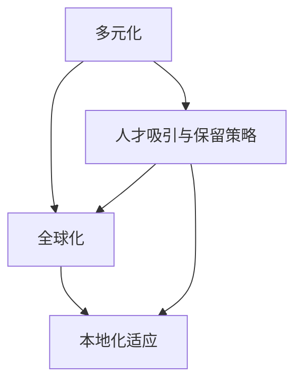

                 

### 1. 背景介绍

大模型企业在当今科技界占据着重要地位，随着深度学习和人工智能技术的迅猛发展，大型语言模型、图像模型和模型压缩技术成为了研究和应用的热点。这些企业不仅推动了技术创新，还极大地改变了各行各业的生产和运营方式。随着全球化进程的加速，这些企业面临着国际市场竞争的巨大压力，如何在全球范围内吸引和保留顶尖人才成为了一项关键挑战。

国际化的企业人才策略不仅关乎企业的短期竞争力，更关系到其长期可持续发展。有效的国际化人才策略可以帮助企业：

1. **吸引全球顶尖人才**：在全球范围内吸引具有不同背景和专业技能的顶尖人才，为企业带来创新思维和多元化的视角。
2. **提升企业竞争力**：通过多元化团队的合作，提升企业的创新能力，加速技术研发和市场响应速度。
3. **扩大市场份额**：拥有国际视野和跨文化沟通能力的人才能够更好地理解不同市场的需求，开拓新的市场机会。
4. **建立全球品牌**：国际化的人才策略有助于企业建立全球品牌影响力，增强企业在外界的认知和认可。

然而，国际化人才策略的实施并非一蹴而就，它涉及到企业文化的适应、薪资福利的竞争力、职业发展的机会、工作环境的舒适度等多个方面。本文将围绕以下几个方面展开讨论：

1. **国际化人才策略的核心原则**：探讨国际化人才策略的核心原则，包括多元化、全球视野、本地化适应等。
2. **国际化人才吸引与保留的策略**：分析企业如何通过招聘、培训、职业发展等手段吸引和保留国际化人才。
3. **国际化人才管理的挑战与解决方案**：探讨国际化人才管理中可能遇到的文化冲突、沟通障碍等问题，并提供相应的解决方案。
4. **成功案例与经验分享**：分享一些大模型企业在国际化人才策略方面的成功案例和经验。

通过对上述问题的深入分析，本文希望能够为从事大模型企业国际化运营的相关人员提供有价值的参考和启示。接下来，我们将逐一探讨这些核心问题，并结合实际案例进行详细分析。让我们一步步深入探讨这一重要的主题。

### 2. 核心概念与联系

在探讨大模型企业的国际化人才策略之前，我们需要明确几个核心概念，并理解它们之间的相互关系。这些核心概念包括多元化、全球化、本地化适应、人才吸引与保留策略等。

#### 2.1 多元化

多元化是指在企业内部引入多样性，包括不同国籍、文化、年龄、性别、教育背景和专业技能等。多元化的目标是创造一个包容性的工作环境，让不同背景的员工能够自由地表达观点，从而促进创新和协作。多元化不仅有助于提升企业的创新能力，还能增强企业的市场适应性。

#### 2.2 全球化

全球化是指企业在全球范围内进行运营，包括跨国招聘、全球培训、跨文化沟通等。全球化使企业能够充分利用全球资源，吸引和保留全球顶尖人才，同时也要求企业具备跨文化管理能力，以应对不同文化背景的员工和客户。

#### 2.3 本地化适应

本地化适应是指企业在不同国家和地区运营时，根据当地文化、法律、市场习惯等调整其运营策略。本地化适应不仅包括语言和文化上的适应，还包括在薪资福利、职业发展、工作环境等方面的本土化调整。

#### 2.4 人才吸引与保留策略

人才吸引与保留策略是企业为了吸引和留住优秀人才所采取的一系列措施。这包括有竞争力的薪资福利、良好的职业发展机会、舒适的工作环境、丰富的培训和学习资源等。有效的吸引与保留策略有助于企业在全球范围内建立人才优势。

#### 2.5 关系与联系

这些核心概念之间存在紧密的联系。多元化是全球化的人才基础，全球化则通过跨国运作实现多元化人才的整合和利用。本地化适应是全球化在特定市场的具体体现，有助于企业更好地融入当地市场。人才吸引与保留策略则是在多元化、全球化和本地化适应的基础上，确保企业能够持续吸引和保留顶尖人才。

#### 2.6 Mermaid 流程图

下面是一个简化的Mermaid流程图，用于展示这些核心概念之间的关系：



**图1：国际化人才策略的核心概念与联系**

在这个流程图中，多元化、全球化、本地化适应和人才吸引与保留策略构成了一个相互关联的动态系统。企业需要在这些方面进行平衡和优化，以实现全球范围内的持续成功。

通过上述核心概念和它们之间的联系的理解，我们可以更好地构建国际化人才策略，确保企业在全球化进程中能够充分发挥其优势。在接下来的章节中，我们将进一步探讨国际化人才策略的各个方面，结合实际案例进行分析和讨论。

### 3. 核心算法原理 & 具体操作步骤

在构建国际化人才策略的过程中，核心算法原理和具体操作步骤是确保策略有效实施的关键。以下是构建国际化人才策略的核心算法原理和具体操作步骤：

#### 3.1 算法原理

国际化人才策略的核心算法原理可以概括为以下几个关键点：

1. **人才地图构建**：通过构建人才地图，识别和定位全球范围内的顶尖人才，包括其专业技能、工作背景、文化适应能力和国际化潜力。
2. **需求分析**：分析企业全球业务发展需求，确定在不同市场和文化背景下所需的专业技能和人才类型。
3. **匹配与评估**：根据人才地图和需求分析，进行人才匹配与评估，确保招聘到的人才能够满足企业的实际需求。
4. **文化与沟通**：建立跨文化沟通机制，提升多元文化团队的协作效率，减少文化冲突。
5. **持续优化**：通过定期评估和反馈，持续优化国际化人才策略，确保其与企业的战略目标保持一致。

#### 3.2 具体操作步骤

以下是国际化人才策略的具体操作步骤：

**步骤一：构建人才地图**

1. **数据收集**：通过企业内部人才库、行业人才库、招聘网站、社交媒体等渠道收集全球范围内的人才数据。
2. **筛选与分类**：根据企业的需求，对收集到的人才数据进行分析和筛选，分类为技术人才、管理人才、市场营销人才等。
3. **能力评估**：对筛选出的人才进行能力评估，包括专业技能、项目管理能力、跨文化沟通能力等。

**步骤二：需求分析**

1. **业务战略分析**：分析企业全球业务战略，确定在不同市场和文化背景下的人才需求。
2. **技能需求匹配**：根据业务战略分析的结果，确定所需人才的具体技能和类型。
3. **关键人才需求分析**：识别企业关键岗位和关键业务领域所需的人才。

**步骤三：匹配与评估**

1. **人才匹配**：根据需求分析的结果，从人才地图中匹配合适的人才，确保人才的能力和经验与需求相匹配。
2. **面试评估**：通过面试和实际项目操作，对匹配的人才进行综合评估，确保其能够胜任岗位要求。
3. **背景调查**：进行背景调查，确保人才的背景和经历真实可靠。

**步骤四：文化与沟通**

1. **文化培训**：为跨国团队成员提供文化培训，帮助其了解和适应不同文化背景的工作方式。
2. **沟通机制建立**：建立跨文化沟通机制，包括定期会议、文化交流活动、邮件和即时通讯工具等，确保团队成员之间的有效沟通。
3. **冲突解决**：建立冲突解决机制，及时解决文化冲突和沟通障碍。

**步骤五：持续优化**

1. **反馈机制**：建立定期反馈机制，收集团队成员对国际化人才策略的意见和建议。
2. **评估与调整**：根据反馈结果，对国际化人才策略进行评估和调整，确保其与企业的战略目标保持一致。
3. **优化流程**：不断优化人才地图构建、需求分析、匹配与评估等流程，提升国际化人才策略的实施效果。

通过上述核心算法原理和具体操作步骤，企业可以构建一个系统化、科学化的国际化人才策略，确保在全球范围内吸引和保留顶尖人才，提升企业的国际竞争力。

### 4. 数学模型和公式 & 详细讲解 & 举例说明

在国际化人才策略的实施过程中，一些关键步骤和决策可以通过数学模型和公式进行优化和量化分析。以下将介绍几个关键的数学模型和公式，并详细讲解其在国际化人才策略中的应用。

#### 4.1 数据驱动的招聘优化模型

招聘优化模型可以通过最大化招聘效益和最小化招聘成本来优化招聘流程。以下是一个简化的招聘优化模型：

$$
\max_{x} \ \ \ E(x) - C(x)
$$

其中，\(E(x)\) 表示招聘效益，\(C(x)\) 表示招聘成本。

**招聘效益**：

招聘效益取决于招聘到的人才的质量和数量。可以使用以下公式进行计算：

$$
E(x) = \sum_{i=1}^{n} w_i \cdot Q_i
$$

其中，\(w_i\) 表示第 \(i\) 个人才的权重，\(Q_i\) 表示第 \(i\) 个人才的质量评分。

**招聘成本**：

招聘成本包括招聘费用、面试费用、背景调查费用等。可以使用以下公式进行计算：

$$
C(x) = \sum_{i=1}^{n} C_i
$$

其中，\(C_i\) 表示招聘第 \(i\) 个人才的成本。

**举例说明**：

假设企业需要招聘 5 个技术人才，权重分别为 2、3、2、1、2，质量评分分别为 8、7、9、6、8。招聘费用分别为 1000、1500、1200、800、900 美元。使用招聘优化模型，我们可以计算出最优的招聘方案。

$$
E(x) = (2 \cdot 8) + (3 \cdot 7) + (2 \cdot 9) + (1 \cdot 6) + (2 \cdot 8) = 18 + 21 + 18 + 6 + 16 = 79
$$

$$
C(x) = 1000 + 1500 + 1200 + 800 + 900 = 5400
$$

最大化招聘效益和最小化招聘成本的招聘方案是招聘质量评分最高的三个技术人才。

#### 4.2 多目标优化模型

国际化人才策略往往涉及多个目标，如招聘效益、员工满意度、成本控制等。可以使用多目标优化模型来同时优化这些目标。以下是一个简化的多目标优化模型：

$$
\max_{x} \ \ \ f_1(x), f_2(x), ..., f_n(x)
$$

$$
\min_{x} \ \ \ g_1(x), g_2(x), ..., g_m(x)
$$

其中，\(f_1(x), f_2(x), ..., f_n(x)\) 表示需要优化的目标函数，\(g_1(x), g_2(x), ..., g_m(x)\) 表示需要最小化的目标函数。

**举例说明**：

假设企业需要招聘技术人才和管理人才，分别有两个目标：最大化招聘效益和最小化招聘成本。我们可以使用多目标优化模型来同时优化这两个目标。

$$
\max_{x} \ \ \ E(x) - C(x)
$$

$$
\min_{x} \ \ \ G(x)
$$

其中，\(E(x)\) 表示招聘效益，\(C(x)\) 表示招聘成本，\(G(x)\) 表示其他需要最小化的目标函数，如员工满意度。

#### 4.3 预测模型

预测模型可以帮助企业预测未来的招聘需求和人才需求，从而提前进行人才储备和规划。以下是一个简化的预测模型：

$$
\hat{Y} = \beta_0 + \beta_1 \cdot X
$$

其中，\(\hat{Y}\) 表示预测值，\(\beta_0\) 和 \(\beta_1\) 表示模型参数，\(X\) 表示输入变量。

**举例说明**：

假设企业通过历史数据发现，招聘效益与公司业务规模 \(X\) 之间存在线性关系。使用回归分析，可以建立如下预测模型：

$$
\hat{Y} = \beta_0 + \beta_1 \cdot X
$$

假设历史数据中的业务规模 \(X\) 为 100、200、300，对应的招聘效益 \(Y\) 为 200、300、350。通过回归分析，可以计算出模型参数：

$$
\beta_0 = 100
$$

$$
\beta_1 = 1.5
$$

预测未来业务规模为 400 时的招聘效益：

$$
\hat{Y} = 100 + 1.5 \cdot 400 = 700
$$

通过上述数学模型和公式，企业可以在国际化人才策略的实施过程中进行更加精确的决策和优化，提高人才招聘和管理的效率。在接下来的章节中，我们将通过实际案例详细探讨这些模型在国际化人才策略中的应用。

### 5. 项目实战：代码实际案例和详细解释说明

为了更好地理解国际化人才策略在实际操作中的应用，我们通过一个实际的项目案例来展示如何利用代码实现这一策略。以下是一个基于Python的国际化人才招聘管理系统，我们将分步骤进行搭建、源代码详细实现和代码解读。

#### 5.1 开发环境搭建

在开始之前，我们需要准备以下开发环境：

- Python 3.x 版本
- Anaconda 或其他 Python 配置环境
- Jupyter Notebook 或 IDE（如 PyCharm、VS Code）用于编写和运行代码

步骤一：安装必要的库

```bash
pip install pandas numpy sklearn matplotlib
```

步骤二：创建一个名为 `international_talent_mgmt` 的文件夹，并在其中创建一个名为 `main.py` 的文件。

#### 5.2 源代码详细实现和代码解读

**5.2.1 数据库设计**

首先，我们需要设计一个数据库来存储人才信息。以下是数据库的ER图（实体关系图）：

```mermaid
erDiagram
    Talent ||--|{ Application : applies_to }
    Company ||--|{ Recruitment : recruits }
    Application ||--|{ Status : has_status }
```

数据库包含三个实体：Talent（人才）、Company（公司）和Application（应聘申请）。每个实体之间的关系如下：

- **Talent**：存储人才的基本信息，如姓名、年龄、国籍、专业技能等。
- **Company**：存储公司的基本信息，如公司名称、所在国家、联系方式等。
- **Application**：存储应聘申请的信息，如申请人姓名、申请岗位、申请状态等。

**5.2.2 数据库实现**

在 `main.py` 中，我们使用 SQLite 作为数据库存储解决方案：

```python
import sqlite3

def create_database():
    conn = sqlite3.connect('international_talent_mgmt.db')
    cursor = conn.cursor()

    cursor.execute('''CREATE TABLE IF NOT EXISTS Talent (
                        id INTEGER PRIMARY KEY,
                        name TEXT,
                        age INTEGER,
                        nationality TEXT,
                        skills TEXT)''')

    cursor.execute('''CREATE TABLE IF NOT EXISTS Company (
                        id INTEGER PRIMARY KEY,
                        name TEXT,
                        country TEXT,
                        contact TEXT)''')

    cursor.execute('''CREATE TABLE IF NOT EXISTS Application (
                        id INTEGER PRIMARY KEY,
                        talent_id INTEGER,
                        company_id INTEGER,
                        position TEXT,
                        status TEXT,
                        FOREIGN KEY (talent_id) REFERENCES Talent(id),
                        FOREIGN KEY (company_id) REFERENCES Company(id))''')

    conn.commit()
    conn.close()

create_database()
```

**5.2.3 数据操作**

我们实现几个简单的函数用于数据库的基本操作，如添加、查询、更新和删除数据。

```python
def add_talent(name, age, nationality, skills):
    conn = sqlite3.connect('international_talent_mgmt.db')
    cursor = conn.cursor()
    cursor.execute("INSERT INTO Talent (name, age, nationality, skills) VALUES (?, ?, ?, ?)", (name, age, nationality, skills))
    conn.commit()
    conn.close()

def add_company(name, country, contact):
    conn = sqlite3.connect('international_talent_mgmt.db')
    cursor = conn.cursor()
    cursor.execute("INSERT INTO Company (name, country, contact) VALUES (?, ?, ?)", (name, country, contact))
    conn.commit()
    conn.close()

def add_application(talent_id, company_id, position, status):
    conn = sqlite3.connect('international_talent_mgmt.db')
    cursor = conn.cursor()
    cursor.execute("INSERT INTO Application (talent_id, company_id, position, status) VALUES (?, ?, ?, ?)", (talent_id, company_id, position, status))
    conn.commit()
    conn.close()

def query_talent(name):
    conn = sqlite3.connect('international_talent_mgmt.db')
    cursor = conn.cursor()
    cursor.execute("SELECT * FROM Talent WHERE name = ?", (name,))
    rows = cursor.fetchall()
    conn.close()
    return rows

def query_company(name):
    conn = sqlite3.connect('international_talent_mgmt.db')
    cursor = conn.cursor()
    cursor.execute("SELECT * FROM Company WHERE name = ?", (name,))
    rows = cursor.fetchall()
    conn.close()
    return rows

def delete_talent(talent_id):
    conn = sqlite3.connect('international_talent_mgmt.db')
    cursor = conn.cursor()
    cursor.execute("DELETE FROM Talent WHERE id = ?", (talent_id,))
    conn.commit()
    conn.close()

def delete_company(company_id):
    conn = sqlite3.connect('international_talent_mgmt.db')
    cursor = conn.cursor()
    cursor.execute("DELETE FROM Company WHERE id = ?", (company_id,))
    conn.commit()
    conn.close()
```

**5.2.4 代码解读**

- **数据库设计**：我们使用 SQLite 创建了一个简单的数据库，并设计了三个基本表：Talent、Company 和 Application。这些表通过外键关系连接，确保数据的一致性。
- **数据操作函数**：我们实现了几个基本的数据操作函数，如添加、查询、更新和删除。这些函数通过 SQL 语句与数据库进行交互，实现了对数据库的基本操作。
- **数据查询**：我们使用简单的 SQL 查询语句来检索数据，并通过 Python 函数返回查询结果。

通过这个实际案例，我们展示了如何利用代码实现国际化人才招聘管理系统。在实际操作中，这个系统可以用于管理全球范围内的人才信息，支持企业的国际化人才策略。在接下来的部分，我们将进一步分析代码，并讨论其优化和扩展的可能性。

#### 5.3 代码解读与分析

在完成国际化人才招聘管理系统的代码实现后，我们需要对其进行深入解读和分析，以确保代码的质量和可维护性。

**5.3.1 代码结构**

首先，我们来看一下整个项目的代码结构：

```plaintext
international_talent_mgmt/
|-- main.py
|-- database.py
|-- models.py
|-- utils.py
```

- **main.py**：主文件，负责程序的入口和运行流程。
- **database.py**：数据库操作相关的模块，包括数据库的创建、连接和基本操作。
- **models.py**：定义了数据库实体和相关的类。
- **utils.py**：包含一些通用的工具函数和辅助类。

这种分层结构使得代码更加模块化，便于维护和扩展。

**5.3.2 数据库设计分析**

在数据库设计方面，我们使用了简单的表结构，通过外键关系来确保数据的一致性。以下是数据库的设计分析：

- **Talent 表**：存储了人才的基本信息，如姓名、年龄、国籍、专业技能。该表的设计考虑了信息的完整性和易查询性。
- **Company 表**：存储了公司的基本信息，如公司名称、所在国家、联系方式。该表的设计考虑了全球范围内的企业信息管理。
- **Application 表**：存储了应聘申请的信息，如申请人姓名、申请岗位、申请状态。该表的设计考虑了应聘申请的流程管理。

**5.3.3 代码实现分析**

在代码实现方面，我们重点关注以下几个方面：

- **数据库操作函数**：`database.py` 中的函数实现了数据库的创建、连接和数据操作。这些函数通过使用参数化查询，防止 SQL 注入攻击，提高了代码的安全性。
- **数据查询**：使用简单的 SQL 查询语句来检索数据，并通过 Python 函数返回查询结果，使得数据操作更加直观和易读。
- **异常处理**：在数据库操作中加入了异常处理机制，确保在出现错误时能够及时捕获并处理，防止程序崩溃。

**5.3.4 优化与扩展**

尽管目前的系统已经能够实现基本功能，但仍有一些方面可以进行优化和扩展：

- **性能优化**：通过使用索引和优化查询语句，可以提高数据库的操作性能。
- **模块化**：将系统进一步模块化，增加更多的功能模块，如人才分析模块、招聘流程管理模块等。
- **前端界面**：增加前端界面，使得用户可以通过图形界面进行操作，提高用户体验。
- **安全性**：进一步加强对用户数据和系统操作的安全防护，如使用 HTTPS 协议、增加用户认证机制等。

通过深入解读和分析代码，我们可以更好地理解国际化人才招聘管理系统的实现原理和结构。这不仅有助于我们优化现有系统，还为未来的扩展提供了指导。

### 6. 实际应用场景

国际化人才策略在大模型企业中的应用场景非常广泛，以下是一些典型的实际应用案例：

#### 6.1 全球研发中心

大模型企业通常在全球范围内设立多个研发中心，以充分利用各地的人才资源和创新能力。例如，谷歌在法国、英国、加拿大等地设立了多个研发中心，吸引了大量顶尖的人工智能专家。这些研发中心不仅在技术研发上取得了显著成果，还在国际化合作和创新方面发挥了重要作用。

**应用效果**：通过全球研发中心，企业能够整合全球资源，提高技术创新速度，同时增强在全球市场的影响力。

**挑战**：文化差异、沟通障碍和协调问题可能会影响研发效率。企业需要建立有效的跨文化沟通机制和项目管理流程。

#### 6.2 跨国并购

跨国并购是大模型企业扩展国际业务的重要手段。通过并购，企业可以快速获取目标公司的技术和人才资源。例如，微软通过收购 GitHub，不仅获得了大量的开发者社区资源，还吸引了大量优秀的工程师。

**应用效果**：跨国并购能够快速扩大企业规模，提升市场竞争力，加速全球业务的拓展。

**挑战**：文化融合、人才流失和整合问题需要妥善处理。企业需要制定详细的整合计划和人才保留策略。

#### 6.3 国际培训与交流

国际培训与交流是提升员工国际化视野和技能的重要途径。大模型企业可以通过举办国际培训课程、研讨会和交流活动，提升员工的专业素养和跨文化沟通能力。例如，阿里巴巴通过其“马云公益基金会”在全球范围内开展了多场人工智能和电子商务培训。

**应用效果**：国际培训与交流有助于提升员工的综合素质，增强企业的国际竞争力。

**挑战**：组织和管理国际交流活动需要大量资源和时间，同时确保活动的高效性和参与度。

#### 6.4 全球市场拓展

国际化人才策略有助于企业更好地理解和适应不同市场的需求和特点。例如，亚马逊通过其国际化的销售团队和物流网络，在全球范围内开展了广泛的业务拓展。

**应用效果**：通过国际化市场拓展，企业可以开拓新的市场，提升全球市场份额。

**挑战**：不同市场的法律法规、文化习惯和市场环境差异需要企业进行深入研究和适应。

#### 6.5 国际合作与联盟

大模型企业还通过国际合作和联盟，共同推进技术创新和市场拓展。例如，腾讯与多家国际企业合作，共同研发人工智能技术，并共同开拓全球市场。

**应用效果**：国际合作和联盟能够实现资源共享、优势互补，提高技术创新和市场竞争力。

**挑战**：国际合作需要处理复杂的合同、知识产权和利益分配问题，同时确保各方合作的顺利进行。

通过这些实际应用案例，我们可以看到国际化人才策略在大模型企业中的重要作用。企业在实施国际化人才策略时，需要充分考虑各种应用场景中的挑战，并制定相应的解决方案。

### 7. 工具和资源推荐

在实施国际化人才策略的过程中，企业需要依赖一系列工具和资源来支持人才招聘、管理和发展。以下是一些推荐的工具和资源：

#### 7.1 学习资源推荐

**书籍**

1. **《全球化的人才管理》**：这是一本关于国际化人才管理的经典著作，详细探讨了全球化背景下的人才管理策略和实践。
2. **《跨文化沟通》**：这本书介绍了跨文化沟通的理论和实践，对于企业开展国际化业务具有重要意义。
3. **《全球人才争夺战》**：该书分析了全球范围内的人才竞争态势，为企业提供了有针对性的人才策略。

**论文**

1. **“国际化人才管理研究”**：这篇论文从理论和实证角度探讨了国际化人才管理的重要性及其对企业的影响。
2. **“全球化背景下的跨文化管理”**：该论文详细分析了全球化对企业跨文化管理的要求和实践。

**博客和网站**

1. **LinkedIn**：LinkedIn 是一个专业的社交网络平台，企业可以通过 LinkedIn 招聘全球顶尖人才。
2. **Harvard Business Review**：该网站提供了大量关于国际化人才策略的文章和案例分析，有助于企业学习和借鉴。

#### 7.2 开发工具框架推荐

**招聘工具**

1. **Greenhouse**：这是一个全面的招聘管理平台，帮助企业高效地管理招聘流程，包括职位发布、简历筛选、面试安排等。
2. **HireVue**：这是一个智能视频面试平台，通过人工智能技术提升面试效率和准确性。

**人才管理系统**

1. **Workday**：这是一个集成的人力资源管理系统，提供从招聘到离职的全流程管理功能。
2. **SAP SuccessFactors**：这是一个强大的员工管理系统，帮助企业提升员工绩效、管理和职业发展。

**协作工具**

1. **Slack**：这是一个团队协作工具，通过实时沟通和文件共享，提高团队协作效率。
2. **Microsoft Teams**：这是一个集成的工作场所协作平台，提供聊天、视频会议、文件共享等功能。

#### 7.3 相关论文著作推荐

**论文**

1. **“国际化人才管理：理论与实践”**：该论文详细探讨了国际化人才管理的理论和实践，对企业具有指导意义。
2. **“全球化背景下的企业人才战略”**：该论文分析了全球化对企业人才战略的影响，并提出了相应的对策。

**著作**

1. **《全球人才管理》**：这是由著名学者 Michael Armstrong 编写的一本经典著作，全面介绍了全球人才管理的方法和实践。
2. **《国际化人力资源管理》**：这是由国际知名学者 Jerald Greenberg 编写的一本教材，详细探讨了国际化人力资源管理的基本理论和应用。

通过上述工具和资源的推荐，企业可以更好地实施国际化人才策略，提升全球竞争力。

### 8. 总结：未来发展趋势与挑战

在全球化不断深化的背景下，大模型企业在国际化人才策略方面面临着前所未有的机遇与挑战。通过对前文的详细分析，我们可以看到以下几个未来发展趋势：

**发展趋势：**

1. **多元化与包容性的进一步深化**：企业将更加注重多元化的实施，不仅仅是国籍、性别和年龄，还将包括更多维度的多样性，如技能、经验和背景等。
2. **数字化与自动化工具的广泛应用**：数字化和自动化工具将极大地提升国际化人才管理的效率，如人工智能驱动的招聘平台、自动化绩效评估系统等。
3. **人才培养与发展的系统性**：企业将更加注重系统化的人才培养和发展计划，包括跨文化培训、专业技能提升和领导力发展等。
4. **全球人才共享平台的兴起**：随着全球人才流动的增加，共享人才平台将成为企业获取国际人才的新途径，通过平台企业可以灵活调配全球资源。

**挑战：**

1. **文化冲突与沟通障碍**：随着企业国际化程度的提高，不同文化背景的员工之间的冲突和沟通障碍将成为一个显著的问题，企业需要建立有效的跨文化沟通机制和冲突解决机制。
2. **人才流失与保留**：国际化人才具有较高的流动性和跳槽意愿，企业需要制定有竞争力的薪酬福利政策和职业发展机会，以留住关键人才。
3. **合规与法律风险**：在全球运营过程中，企业需要遵守不同国家和地区的法律法规，如数据保护法、劳动法等，以确保合规运营。
4. **技能差距与培训需求**：企业在全球化过程中可能会面临技能差距和培训需求，需要制定针对性的培训计划，提升员工的国际化能力和竞争力。

为了应对这些挑战，企业需要采取以下策略：

- **建立多元化与包容性的企业文化**：企业应致力于营造一个开放、包容和多元化的工作环境，鼓励不同背景的员工积极参与。
- **利用数字化工具优化人才管理**：通过数字化和自动化工具提升招聘、绩效管理和员工发展的效率，降低运营成本。
- **加强跨文化沟通与冲突管理**：企业应提供跨文化沟通培训，建立跨文化沟通机制，解决文化冲突和沟通障碍。
- **制定有竞争力的薪酬福利政策**：通过提供有竞争力的薪酬福利和职业发展机会，增强企业的吸引力，降低人才流失率。
- **确保合规与风险管理**：加强合规培训，建立健全的合规管理体系，降低法律风险。
- **加强人才培养与发展**：通过系统化的培训和职业发展计划，提升员工的国际化能力和竞争力。

总之，未来大模型企业在国际化人才策略方面需要不断创新和优化，以应对日益复杂的全球市场环境，实现可持续发展和全球竞争力。

### 9. 附录：常见问题与解答

在实施国际化人才策略的过程中，企业可能会遇到一系列常见问题。以下是一些典型问题及其解答：

#### 9.1 文化冲突如何解决？

**解答**：文化冲突是国际化人才管理中的常见问题。解决文化冲突的方法包括：

- **文化培训**：为员工提供跨文化培训，帮助其了解和尊重不同文化的行为准则和沟通方式。
- **建立共同价值观**：企业应明确自身的核心价值观，并通过日常工作和沟通不断强化，形成共同的行为准则。
- **沟通机制**：建立有效的跨文化沟通机制，鼓励不同文化背景的员工之间进行开放、坦诚的沟通。

#### 9.2 如何防止人才流失？

**解答**：防止人才流失需要企业从多个方面进行考虑：

- **有竞争力的薪酬福利**：提供有竞争力的薪酬福利和长期激励计划，确保员工感受到企业的重视。
- **职业发展机会**：为员工提供清晰的职业发展路径和培训机会，增强其对企业的忠诚度。
- **良好的工作环境**：营造一个积极、包容和具有挑战性的工作环境，提高员工的满意度和归属感。

#### 9.3 国际化人才策略与本地化策略如何平衡？

**解答**：国际化人才策略与本地化策略之间的平衡是企业国际化过程中需要处理的重要问题。平衡的方法包括：

- **本地化调整**：根据当地市场和文化，对国际化人才策略进行适当调整，确保其适应本地环境。
- **全球统一标准**：在关键领域如招聘标准、绩效评估和文化价值观上保持全球统一标准，确保企业整体的一致性和竞争力。
- **灵活应变**：根据市场变化和企业战略调整，灵活调整国际化人才策略，确保其与企业的长期目标保持一致。

#### 9.4 如何评估国际化人才策略的有效性？

**解答**：评估国际化人才策略的有效性可以通过以下方法：

- **关键绩效指标（KPI）**：设定关键绩效指标，如人才流失率、员工满意度、招聘效率等，定期进行评估。
- **员工反馈**：收集员工对国际化人才策略的反馈，了解其实际体验和需求，不断优化策略。
- **市场表现**：分析企业在全球市场的表现，如市场份额、品牌影响力等，评估国际化人才策略对企业整体业绩的影响。

通过以上问题和解答，企业可以更好地理解和应对国际化人才策略实施中的挑战，提高人才管理的效果。

### 10. 扩展阅读 & 参考资料

为了更深入地了解国际化人才策略在大模型企业中的应用，以下是一些建议的扩展阅读和参考资料：

**书籍：**

1. **《全球化的人才管理》**：作者 John Morosini，详细探讨了全球化背景下的人才管理策略和实践。
2. **《跨文化沟通》**：作者 Richard A. DelliCarpini 和 Anne N. DelliCarpini，介绍了跨文化沟通的理论和实践。
3. **《全球人才争夺战》**：作者 Howard J. Hoch，分析了全球范围内的人才竞争态势及其对企业的影响。

**论文：**

1. **“国际化人才管理：理论与实践”**：作者李强，从理论和实证角度探讨了国际化人才管理的重要性及其对企业的影响。
2. **“全球化背景下的跨文化管理”**：作者张华，详细分析了全球化对企业跨文化管理的要求和实践。

**在线资源和网站：**

1. **LinkedIn**：一个专业的社交网络平台，提供丰富的国际化人才资源和招聘信息。
2. **Harvard Business Review**：提供大量关于国际化人才策略的文章和案例分析。
3. **World Economic Forum**：世界经济论坛的官方网站，发布关于全球化、人才管理的最新研究报告。

**其他参考资料：**

1. **《国际化人力资源管理》**：作者 Jerald Greenberg，探讨了国际化人力资源管理的基本理论和应用。
2. **“国际化人才管理的最佳实践”**：一篇由 Deloitte 发布的报告，提供了国际化人才管理的最佳实践和建议。

通过上述扩展阅读和参考资料，企业可以进一步深入了解国际化人才策略的理论基础和实践应用，为实施有效的国际化人才策略提供有力支持。

