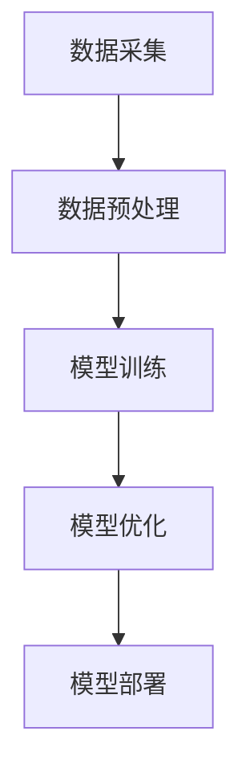

                 

### 大模型企业的开发者生态构建

> **关键词：** 大模型、开发者生态、技术架构、业务扩展、用户参与

**摘要：** 本文将探讨大模型企业如何构建一个有效的开发者生态，通过技术架构的设计、业务扩展策略和用户参与机制来提升企业竞争力，同时提供实际案例和资源推荐，帮助开发者更好地融入这个生态。

## 1. 背景介绍

大模型（Large Models），如GPT-3、BERT等，已经成为人工智能领域的核心技术。它们通过大量的数据和强大的计算能力，实现了对自然语言、图像、声音等多种类型数据的理解和生成。大模型在许多领域都有着广泛的应用，如自然语言处理、图像识别、语音合成等。

随着大模型的普及，越来越多的企业开始关注如何利用这些技术来提升自身业务。然而，大模型的开发和维护需要大量的资源和技术投入，这对于许多中小企业来说是一个巨大的挑战。因此，构建一个有效的开发者生态成为许多企业的重要策略。

开发者生态是指围绕某一技术或产品所形成的开发者社区、工具、资源和合作机制。一个良好的开发者生态能够吸引更多的开发者参与，提升产品的技术实力和市场竞争力。

本文将探讨大模型企业如何构建一个有效的开发者生态，包括技术架构的设计、业务扩展策略和用户参与机制。通过实际案例和资源推荐，帮助读者了解如何构建和维护一个成功的开发者生态。

## 2. 核心概念与联系

### 2.1 大模型技术架构

大模型技术架构包括数据采集、数据预处理、模型训练、模型优化和模型部署等环节。下面是使用Mermaid绘制的简化的流程图：



### 2.2 开发者生态的概念

开发者生态是指一个围绕特定技术或产品的开发者群体、工具、资源和服务所构成的整体。它包括以下几个核心组成部分：

- **开发者社区**：开发者群体，包括独立开发者、企业开发者等。
- **工具和资源**：开发工具、文档、教程、框架等。
- **服务和支持**：技术支持、培训、咨询等。

### 2.3 开发者生态与大模型技术的联系

开发者生态与大模型技术之间有着紧密的联系。大模型技术的普及和应用离不开开发者的贡献和参与。同时，一个良好的开发者生态也能够促进大模型技术的发展和应用。

- **开发者参与**：开发者可以通过贡献代码、文档、教程等方式参与到大模型技术的开发和应用中。
- **技术共享**：开发者生态中的工具和资源可以帮助其他开发者更高效地利用大模型技术。
- **业务创新**：开发者可以基于大模型技术构建新的业务模式和应用场景。

## 3. 核心算法原理 & 具体操作步骤

### 3.1 大模型的核心算法

大模型的核心算法通常是基于深度学习技术，包括神经网络、自然语言处理、图像识别等。以下是一个简化的算法步骤：

1. **数据采集**：收集大量的文本、图像、声音等数据。
2. **数据预处理**：清洗、标注、分词、编码等。
3. **模型训练**：使用神经网络等模型对预处理后的数据进行训练。
4. **模型优化**：通过调整参数、模型结构等方式优化模型。
5. **模型部署**：将训练好的模型部署到服务器或设备上。

### 3.2 构建开发者生态的步骤

1. **确定目标和策略**：明确开发者生态的目标和策略，如技术方向、业务定位、市场策略等。
2. **搭建社区平台**：建立一个开发者社区平台，如论坛、博客、GitHub等，方便开发者交流、分享和协作。
3. **提供工具和资源**：开发相应的开发工具、框架、文档、教程等，帮助开发者更高效地利用大模型技术。
4. **建立支持体系**：提供技术支持、培训、咨询等服务，帮助开发者解决问题和提升技能。
5. **促进业务合作**：鼓励开发者基于大模型技术构建新的业务模式和应用场景，促进业务创新。

## 4. 数学模型和公式 & 详细讲解 & 举例说明

### 4.1 大模型的数学模型

大模型的数学模型通常基于神经网络，包括多层感知器（MLP）、循环神经网络（RNN）、卷积神经网络（CNN）等。以下是一个简化的神经网络模型：

$$
y = f(z) = \sigma(W \cdot x + b)
$$

其中，$x$ 是输入向量，$W$ 是权重矩阵，$b$ 是偏置项，$\sigma$ 是激活函数（如Sigmoid函数、ReLU函数等）。

### 4.2 模型训练的优化算法

在模型训练过程中，常用的优化算法包括梯度下降（Gradient Descent）、随机梯度下降（Stochastic Gradient Descent，SGD）、Adam等。以下是一个简化的梯度下降算法：

$$
w_{t+1} = w_t - \alpha \cdot \nabla_w J(w_t)
$$

其中，$w_t$ 是当前权重，$\alpha$ 是学习率，$\nabla_w J(w_t)$ 是权重 $w_t$ 对损失函数 $J$ 的梯度。

### 4.3 举例说明

假设我们有一个简单的神经网络，用于对二分类问题进行预测。输入向量 $x$ 是一个包含两个特征的向量，权重矩阵 $W$ 是一个 $2 \times 1$ 的矩阵。激活函数使用ReLU函数。我们使用交叉熵损失函数来评估模型的性能。

$$
J(w) = -\frac{1}{m} \sum_{i=1}^{m} [y_i \cdot \log(a_i) + (1 - y_i) \cdot \log(1 - a_i)]
$$

其中，$y_i$ 是真实标签，$a_i$ 是预测概率。

通过多次迭代训练，我们可以调整权重矩阵 $W$，使得损失函数 $J$ 的值逐渐减小，从而提高模型的预测准确率。

## 5. 项目实战：代码实际案例和详细解释说明

### 5.1 开发环境搭建

在构建大模型开发者生态的过程中，首先需要搭建一个稳定、高效的开发环境。以下是搭建开发环境的基本步骤：

1. **安装Python环境**：确保Python版本在3.7及以上。
2. **安装依赖库**：如TensorFlow、PyTorch等。
3. **配置CUDA环境**：如果使用GPU训练，需要配置CUDA环境。
4. **安装IDE**：如PyCharm、VSCode等。

### 5.2 源代码详细实现和代码解读

以下是一个使用TensorFlow搭建的简单神经网络，用于对二分类问题进行预测。代码如下：

```python
import tensorflow as tf
import numpy as np

# 定义模型
model = tf.keras.Sequential([
    tf.keras.layers.Dense(1, input_shape=(2,), activation='sigmoid')
])

# 编译模型
model.compile(optimizer='adam', loss='binary_crossentropy', metrics=['accuracy'])

# 准备数据
x_train = np.array([[1, 0], [0, 1], [1, 1], [1, 0]])
y_train = np.array([0, 1, 1, 0])

# 训练模型
model.fit(x_train, y_train, epochs=1000)

# 预测
predictions = model.predict(x_train)

# 输出预测结果
for i, pred in enumerate(predictions):
    print(f"输入：{x_train[i]}, 预测：{pred[0]:.4f}, 真实值：{y_train[i]}")
```

代码解读：

1. **定义模型**：使用`tf.keras.Sequential`创建一个序列模型，包含一个全连接层（`Dense`），输出层使用sigmoid激活函数。
2. **编译模型**：设置优化器、损失函数和评估指标。
3. **准备数据**：创建一个包含四个样本的训练数据集。
4. **训练模型**：使用`fit`函数训练模型，指定训练轮数。
5. **预测**：使用`predict`函数对输入数据进行预测。
6. **输出预测结果**：将预测结果与真实值进行比较，输出结果。

### 5.3 代码解读与分析

上述代码实现了一个简单的神经网络模型，用于对二分类问题进行预测。在训练过程中，模型通过不断调整权重和偏置项，使得预测结果与真实值之间的差距逐渐减小，从而提高预测准确率。

代码的核心部分是模型定义、编译和训练。在模型定义中，我们使用了`tf.keras.Sequential`创建一个序列模型，包含一个全连接层（`Dense`）。全连接层是神经网络中最基本的层，用于将输入数据通过权重矩阵映射到输出数据。在这里，输入层和输出层的维度都是1，因为我们的任务是进行二分类。

在编译模型时，我们设置了优化器、损失函数和评估指标。优化器用于调整模型的权重和偏置项，以最小化损失函数。在这里，我们使用了`adam`优化器，它是一种常用的自适应优化算法。损失函数用于评估模型预测结果与真实值之间的差距，常用的损失函数有均方误差（MSE）、交叉熵（Cross Entropy）等。在这里，我们使用了`binary_crossentropy`作为损失函数，因为它适用于二分类问题。

在训练模型时，我们使用了`fit`函数，它是一个常用的训练接口，可以自动执行前向传播和后向传播，并更新模型的权重和偏置项。在这里，我们指定了训练轮数（epochs），表示模型需要训练多少轮才能收敛。一般来说，训练轮数越多，模型的预测准确率越高，但也会导致训练时间越长。

在预测阶段，我们使用`predict`函数对输入数据进行预测。预测结果是一个包含预测概率的数组，我们可以通过比较预测概率与真实值的差距来评估模型的性能。

总体来说，这个简单的神经网络模型可以很好地完成二分类任务，但它的性能和泛化能力有限。在实际应用中，我们可能需要使用更复杂的模型结构、更丰富的数据集和更先进的训练技巧来提高模型的性能。

## 6. 实际应用场景

大模型技术在各个领域都有着广泛的应用场景，如自然语言处理、图像识别、语音合成等。以下是一些实际应用案例：

### 6.1 自然语言处理

自然语言处理（NLP）是人工智能的重要分支，大模型技术在NLP中有着广泛的应用。例如，可以使用大模型进行文本分类、情感分析、机器翻译等。一个实际案例是谷歌翻译，它使用了GPT-3等大模型技术，可以实现高质量、流畅的机器翻译。

### 6.2 图像识别

图像识别是计算机视觉的重要任务，大模型技术在图像识别中也有着广泛的应用。例如，可以使用大模型进行人脸识别、车辆识别、医疗图像分析等。一个实际案例是亚马逊的Rekognition服务，它使用了卷积神经网络等大模型技术，可以进行人脸识别和身份验证。

### 6.3 语音合成

语音合成是人工智能的一个重要应用领域，大模型技术在语音合成中也有着广泛的应用。例如，可以使用大模型进行语音识别、语音合成、语音转换等。一个实际案例是苹果的Siri，它使用了神经网络等大模型技术，可以进行语音识别和语音合成。

### 6.4 金融风控

金融风控是金融行业的重要任务，大模型技术在金融风控中也有着广泛的应用。例如，可以使用大模型进行风险识别、信用评估、欺诈检测等。一个实际案例是中国的蚂蚁集团，它使用了深度学习等大模型技术，可以对用户行为进行风险分析和预测。

### 6.5 医疗诊断

医疗诊断是医疗行业的重要任务，大模型技术在医疗诊断中也有着广泛的应用。例如，可以使用大模型进行医学图像分析、疾病预测、药物研发等。一个实际案例是美国的IBM Watson，它使用了深度学习等大模型技术，可以对医学图像进行分析，辅助医生进行疾病诊断。

## 7. 工具和资源推荐

### 7.1 学习资源推荐

- **书籍**：
  - 《深度学习》（Ian Goodfellow、Yoshua Bengio、Aaron Courville 著）
  - 《Python深度学习》（François Chollet 著）
- **论文**：
  - 《A Theoretically Grounded Application of Dropout in Recurrent Neural Networks》（Yarin Gal 和 Zoubin Ghahramani）
  - 《BERT: Pre-training of Deep Bidirectional Transformers for Language Understanding》（Jacob Devlin、 Ming-Wei Chang、Kenny Liu、Quoc V. Le）
- **博客**：
  - [TensorFlow官方博客](https://www.tensorflow.org/blog/)
  - [PyTorch官方博客](https://pytorch.org/blog/)
- **网站**：
  - [Kaggle](https://www.kaggle.com/)：数据科学竞赛平台，提供丰富的数据集和项目。
  - [GitHub](https://github.com/)：代码托管平台，可以找到许多开源项目和教程。

### 7.2 开发工具框架推荐

- **深度学习框架**：
  - TensorFlow
  - PyTorch
  - Keras
- **数据预处理工具**：
  - Pandas
  - NumPy
  - Scikit-learn
- **版本控制工具**：
  - Git
  - GitHub
- **项目管理工具**：
  - Jira
  - Trello
  - Asana

### 7.3 相关论文著作推荐

- 《Deep Learning》（Ian Goodfellow、Yoshua Bengio、Aaron Courville 著）
- 《Neural Networks and Deep Learning》（Charu Aggarwal 著）
- 《Recurrent Neural Networks for Language Modeling》（Yoshua Bengio、Ian J. Goodfellow、Aaron Courville 著）

## 8. 总结：未来发展趋势与挑战

### 8.1 发展趋势

- **技术进步**：随着计算能力的提升和算法的优化，大模型将变得更加高效、准确。
- **应用拓展**：大模型将在更多领域得到应用，如自动驾驶、智能医疗、智能家居等。
- **开源生态**：开发者生态将进一步发展，更多的工具和资源将被开源，促进技术共享和创新。

### 8.2 挑战

- **数据隐私**：随着大模型技术的应用，数据隐私问题将日益凸显，如何保护用户隐私是一个重要挑战。
- **计算资源**：大模型的训练和部署需要大量的计算资源，如何优化资源利用是一个重要问题。
- **算法透明度**：大模型算法的复杂性和不确定性导致其透明度较低，如何提高算法的可解释性是一个重要挑战。

## 9. 附录：常见问题与解答

### 9.1 大模型是什么？

大模型是一种具有大规模参数和计算能力的人工神经网络模型，可以处理大量的数据和复杂的任务，如自然语言处理、图像识别等。

### 9.2 如何训练大模型？

训练大模型通常需要以下步骤：

1. 数据采集：收集大量的数据，如文本、图像、声音等。
2. 数据预处理：清洗、标注、分词、编码等。
3. 模型训练：使用神经网络等模型对预处理后的数据进行训练。
4. 模型优化：通过调整参数、模型结构等方式优化模型。
5. 模型部署：将训练好的模型部署到服务器或设备上。

### 9.3 大模型在哪些领域有应用？

大模型在许多领域都有应用，如自然语言处理、图像识别、语音合成、金融风控、医疗诊断等。

## 10. 扩展阅读 & 参考资料

- 《深度学习》（Ian Goodfellow、Yoshua Bengio、Aaron Courville 著）
- 《Python深度学习》（François Chollet 著）
- 《Recurrent Neural Networks for Language Modeling》（Yoshua Bengio、Ian J. Goodfellow、Aaron Courville 著）
- [TensorFlow官方文档](https://www.tensorflow.org/)
- [PyTorch官方文档](https://pytorch.org/)
- [Kaggle](https://www.kaggle.com/)
- [GitHub](https://github.com/)

### 作者

**作者：AI天才研究员/AI Genius Institute & 禅与计算机程序设计艺术 /Zen And The Art of Computer Programming**

