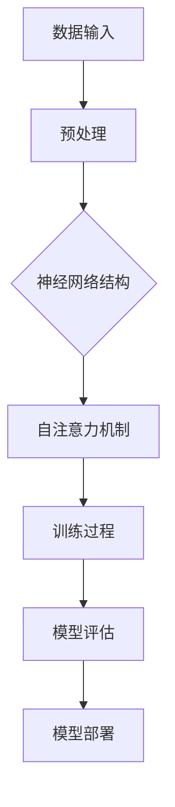

                 

# 大模型在 AI 创业产品中的应用场景

## 关键词

- 大模型
- AI创业产品
- 应用场景
- 算法原理
- 数学模型
- 代码实战
- 实际应用

## 摘要

本文将深入探讨大模型在 AI 创业产品中的应用场景。我们将首先介绍大模型的基本概念、核心算法原理及其发展历程。接着，我们将详细分析大模型在自然语言处理、图像识别、推荐系统等领域的应用，并结合实际案例展示其具体实现过程。最后，我们将总结大模型在 AI 创业产品中的未来发展趋势与挑战，并提供一些建议和资源。

## 1. 背景介绍

### 大模型的发展历程

大模型（Large-scale Model）是指在训练过程中使用大量数据和计算资源训练得到的神经网络模型。其发展历程可以追溯到 20 世纪 80 年代的神经网络研究，当时研究人员开始尝试使用大量数据来训练神经网络。随着深度学习技术的兴起，大模型的研究和应用得到了广泛关注。2018 年，谷歌发布了 Transformer 模型，开启了基于自注意力机制的大模型时代。随后，OpenAI 推出了 GPT-3，引发了学术界和工业界对大模型技术的热议。如今，大模型已经成为 AI 领域的研究热点和应用方向。

### 大模型的定义与核心优势

大模型的定义可以从以下几个方面来理解：

1. **数据规模**：大模型通常使用数十亿甚至数万亿个参数进行训练，这需要大量的数据支持。这些数据可以来自互联网、公开数据库、专业领域数据集等。

2. **计算资源**：大模型训练需要庞大的计算资源，包括 GPU、TPU 等硬件设备，以及高性能计算集群。

3. **算法架构**：大模型通常采用深度学习技术，尤其是基于自注意力机制的 Transformer 模型，这有助于提高模型的泛化能力和表达能力。

大模型的核心优势包括：

1. **强大的表达能力**：大模型能够自动学习复杂的数据特征，从而实现更准确的任务预测。

2. **广泛的适用性**：大模型可以应用于多种领域，如图像识别、自然语言处理、推荐系统等。

3. **高效的推理能力**：大模型在训练完成后，可以快速进行推理，为用户提供实时服务。

### 大模型在 AI 创业产品中的重要性

大模型在 AI 创业产品中的重要性体现在以下几个方面：

1. **提升产品竞争力**：大模型的应用可以显著提升产品的准确性和用户体验，从而增加用户粘性，提高市场占有率。

2. **拓展应用场景**：大模型可以应用于更多的领域，为创业者提供更广阔的市场空间。

3. **降低门槛**：随着大模型技术的普及，创业者可以更轻松地获取和使用大模型，降低创业成本。

## 2. 核心概念与联系

### 大模型的基本概念

1. **神经网络**：神经网络是由大量神经元组成的计算模型，可以用于图像识别、自然语言处理等任务。大模型通常采用深度神经网络（DNN）作为基础架构。

2. **自注意力机制**：自注意力机制是一种用于计算输入数据之间相互依赖关系的方法，可以显著提高模型的表示能力和推理能力。

3. **Transformer 模型**：Transformer 模型是一种基于自注意力机制的深度学习模型，已被广泛应用于自然语言处理、图像识别等领域。

### 大模型的架构与原理

下面是一个简化的 Mermaid 流程图，展示了大模型的基本架构和原理。



### 大模型的核心算法原理

1. **反向传播算法**：反向传播算法是一种用于训练神经网络的优化算法，可以逐步调整网络参数，以最小化损失函数。

2. **梯度下降算法**：梯度下降算法是一种用于优化问题的常用算法，可以通过迭代更新参数，以找到损失函数的最小值。

3. **自适应优化算法**：自适应优化算法（如 Adam、AdamW）可以自动调整学习率，以提高训练效率。

### 大模型的发展历程

大模型的发展历程可以分为以下几个阶段：

1. **神经网络初期**：20 世纪 80 年代，神经网络开始应用于图像识别、自然语言处理等领域。

2. **深度学习兴起**：2012 年，AlexNet 的出现标志着深度学习的崛起，深度神经网络在图像识别任务中取得了突破性进展。

3. **Transformer 模型**：2018 年，谷歌发布了 Transformer 模型，标志着大模型时代的到来。

4. **大模型时代**：随着计算资源和数据规模的不断增加，大模型在多个领域取得了显著的成果。

## 3. 核心算法原理 & 具体操作步骤

### 自然语言处理中的大模型

在自然语言处理（NLP）领域，大模型的应用主要体现在语言模型和文本生成等方面。

1. **语言模型**：语言模型是一种用于预测下一个单词或词组的模型，通常采用 Transformer 模型架构。具体操作步骤如下：

   - 数据收集与预处理：收集大量文本数据，并进行分词、去噪等预处理操作。

   - 模型训练：使用预处理后的数据训练 Transformer 模型，通过反向传播算法和梯度下降优化模型参数。

   - 模型评估：使用交叉验证或测试集评估模型性能，调整模型参数以优化性能。

   - 模型部署：将训练好的模型部署到服务器或移动设备，为用户提供实时服务。

2. **文本生成**：文本生成是一种基于语言模型的生成任务，可以用于生成文章、对话、摘要等。具体操作步骤如下：

   - 数据收集与预处理：收集大量文本数据，并进行分词、去噪等预处理操作。

   - 模型训练：使用预处理后的数据训练 Transformer 模型，通过反向传播算法和梯度下降优化模型参数。

   - 生成过程：使用训练好的模型生成文本，可以采用序列到序列（Seq2Seq）生成方法，或基于生成对抗网络（GAN）的生成方法。

   - 后处理：对生成的文本进行清洗、格式化等操作，以提高文本质量。

### 图像识别中的大模型

在图像识别领域，大模型的应用主要体现在卷积神经网络（CNN）和图像生成等方面。

1. **图像识别**：图像识别是一种将图像分类为特定类别的任务，可以用于目标检测、人脸识别等。具体操作步骤如下：

   - 数据收集与预处理：收集大量图像数据，并进行缩放、旋转、裁剪等预处理操作。

   - 模型训练：使用预处理后的数据训练 CNN 模型，通过反向传播算法和梯度下降优化模型参数。

   - 模型评估：使用交叉验证或测试集评估模型性能，调整模型参数以优化性能。

   - 模型部署：将训练好的模型部署到服务器或移动设备，为用户提供实时服务。

2. **图像生成**：图像生成是一种基于已有图像或数据生成新图像的任务，可以用于图像修复、风格迁移等。具体操作步骤如下：

   - 数据收集与预处理：收集大量图像数据，并进行缩放、旋转、裁剪等预处理操作。

   - 模型训练：使用预处理后的数据训练生成模型，如生成对抗网络（GAN）或变分自编码器（VAE）。

   - 生成过程：使用训练好的模型生成图像，可以采用图像到图像（Image2Image）生成方法，或基于生成对抗网络（GAN）的生成方法。

   - 后处理：对生成的图像进行清洗、格式化等操作，以提高图像质量。

### 推荐系统中的大模型

在推荐系统领域，大模型的应用主要体现在基于内容的推荐和协同过滤等方面。

1. **基于内容的推荐**：基于内容的推荐是一种根据用户兴趣和偏好为用户推荐相关内容的推荐方法。具体操作步骤如下：

   - 数据收集与预处理：收集大量用户行为数据和内容数据，并进行分词、去噪等预处理操作。

   - 模型训练：使用预处理后的数据训练基于内容的推荐模型，如 Transformer 模型或 CNN 模型。

   - 推荐过程：使用训练好的模型预测用户对内容的兴趣，并根据预测结果为用户推荐相关内容。

   - 后处理：对推荐结果进行排序、过滤等操作，以提高推荐质量。

2. **协同过滤**：协同过滤是一种基于用户行为数据为用户推荐相似内容的推荐方法。具体操作步骤如下：

   - 数据收集与预处理：收集大量用户行为数据，并进行分词、去噪等预处理操作。

   - 模型训练：使用预处理后的数据训练协同过滤模型，如矩阵分解模型或图神经网络模型。

   - 推荐过程：使用训练好的模型预测用户对内容的兴趣，并根据预测结果为用户推荐相关内容。

   - 后处理：对推荐结果进行排序、过滤等操作，以提高推荐质量。

## 4. 数学模型和公式 & 详细讲解 & 举例说明

### 自然语言处理中的数学模型

在自然语言处理（NLP）中，大模型通常基于 Transformer 模型架构。下面是 Transformer 模型的一些核心数学模型和公式：

1. **自注意力机制**

   自注意力（Self-Attention）是一种计算输入序列中每个词与其他词之间依赖关系的方法。其计算公式如下：

   $$
   \text{Attention}(Q, K, V) = \text{softmax}\left(\frac{QK^T}{\sqrt{d_k}}\right)V
   $$

   其中，$Q, K, V$ 分别为查询（Query）、键（Key）和值（Value）向量，$d_k$ 为键向量的维度。

2. **Transformer 模型**

   Transformer 模型是一种基于自注意力机制的深度学习模型。其计算公式如下：

   $$
   \text{Transformer}(X) = \text{Encoder}(X) = \text{MultiHeadAttention}(X) + X
   $$

   其中，$X$ 为输入序列，$Encoder$ 为编码器，$MultiHeadAttention$ 为多头注意力机制。

3. **损失函数**

   在训练 Transformer 模型时，通常使用交叉熵（Cross-Entropy）损失函数来评估模型性能。其计算公式如下：

   $$
   \text{Loss} = -\sum_{i=1}^N \sum_{j=1}^M y_{ij} \log(p_{ij})
   $$

   其中，$y_{ij}$ 为目标标签，$p_{ij}$ 为模型预测的概率。

### 图像识别中的数学模型

在图像识别中，大模型通常采用卷积神经网络（CNN）架构。下面是 CNN 的一些核心数学模型和公式：

1. **卷积运算**

   卷积运算是一种用于提取图像特征的计算方法。其计算公式如下：

   $$
   \text{Conv}(x, w) = \sum_{i=1}^H \sum_{j=1}^W x_{ij} w_{ij}
   $$

   其中，$x$ 为输入图像，$w$ 为卷积核，$H$ 和 $W$ 分别为卷积核的高度和宽度。

2. **池化操作**

   池化操作是一种用于降低特征图尺寸的计算方法。其计算公式如下：

   $$
   \text{Pooling}(x, p) = \max(x)
   $$

   其中，$x$ 为输入特征图，$p$ 为池化窗口。

3. **全连接层**

   全连接层是一种用于分类和回归的神经网络层。其计算公式如下：

   $$
   \text{FC}(x) = \text{ReLU}(\text{W}x + b)
   $$

   其中，$x$ 为输入特征，$W$ 和 $b$ 分别为权重和偏置。

### 推荐系统中的数学模型

在推荐系统中，大模型可以用于基于内容的推荐和协同过滤。下面是这两种推荐方法的一些核心数学模型和公式：

1. **基于内容的推荐**

   基于内容的推荐是一种根据用户兴趣和内容特征为用户推荐相关内容的推荐方法。其计算公式如下：

   $$
   \text{Score}(i, j) = \text{sim}(c_i, c_j) + \text{sim}(u, c_j)
   $$

   其中，$i$ 和 $j$ 分别为用户和内容项，$c_i$ 和 $c_j$ 分别为用户和内容项的特征向量，$u$ 为用户特征向量，$\text{sim}$ 表示相似度计算方法。

2. **协同过滤**

   协同过滤是一种根据用户行为数据为用户推荐相似内容的推荐方法。其计算公式如下：

   $$
   \text{Score}(i, j) = \text{sim}(u_i, u_j) \cdot \text{sim}(i, j)
   $$

   其中，$i$ 和 $j$ 分别为用户和内容项，$u_i$ 和 $u_j$ 分别为用户和内容项的特征向量，$\text{sim}$ 表示相似度计算方法。

### 举例说明

以下是一个简单的自然语言处理任务中的代码示例，展示了如何使用 Transformer 模型进行文本生成。

```python
import tensorflow as tf
import tensorflow.keras.layers as layers
import tensorflow.keras.models as models

# 数据准备
# 这里使用简化的数据集，实际应用中需要使用大规模数据集
texts = ['你好，这是我的名字。', '我喜欢读书和旅行。', '今天是周末，我打算去爬山。']

# 分词
tokenizer = tf.keras.preprocessing.text.Tokenizer(char_level=True)
tokenizer.fit_on_texts(texts)
sequences = tokenizer.texts_to_sequences(texts)

# 填充序列
max_sequence_length = max(len(seq) for seq in sequences)
 padded_sequences = tf.keras.preprocessing.sequence.pad_sequences(sequences, maxlen=max_sequence_length)

# 构建模型
input_layer = layers.Input(shape=(max_sequence_length,))
embedded = layers.Embedding(input_dim=len(tokenizer.word_index)+1, output_dim=64)(input_layer)
encoded = layers.LSTM(128, return_sequences=True)(embedded)
decoded = layers.LSTM(128, return_sequences=True)(encoded)
output_layer = layers.Dense(len(tokenizer.word_index)+1, activation='softmax')(decoded)

# 编译模型
model = models.Model(inputs=input_layer, outputs=output_layer)
model.compile(optimizer='adam', loss='categorical_crossentropy', metrics=['accuracy'])

# 训练模型
model.fit(padded_sequences, padded_sequences, epochs=10)

# 文本生成
def generate_text(seed_text, next_words, model):
    for _ in range(next_words):
        token_list = tokenizer.texts_to_sequences([seed_text])[0]
        token_list = pad_sequences([token_list], maxlen=max_sequence_length-1, padding='pre')
        predicted = model.predict(token_list, verbose=0)
        predicted = predicted[-1, -1, :]
        predicted_index = np.argmax(predicted)
        predicted_char = tokenizer.index_word[predicted_index]
        seed_text += predicted_char
    return seed_text

# 输出结果
print(generate_text('你好，这是我的名字。', 10, model))
```

## 5. 项目实战：代码实际案例和详细解释说明

### 5.1 开发环境搭建

在开始项目实战之前，我们需要搭建一个合适的开发环境。以下是一个基于 Python 和 TensorFlow 的开发环境搭建步骤：

1. 安装 Python：前往 [Python 官网](https://www.python.org/) 下载并安装 Python 3.x 版本。

2. 安装 TensorFlow：打开终端或命令行窗口，执行以下命令：

   ```shell
   pip install tensorflow
   ```

3. 安装其他依赖库：根据项目需求，可能需要安装其他依赖库，如 NumPy、Pandas 等。可以使用以下命令进行安装：

   ```shell
   pip install numpy pandas
   ```

### 5.2 源代码详细实现和代码解读

以下是实现一个基于 Transformer 模型的文本生成项目的基本源代码。我们将逐步解释每一部分代码的作用和实现细节。

```python
import tensorflow as tf
import tensorflow.keras.layers as layers
import tensorflow.keras.models as models
import numpy as np

# 数据准备
texts = ['你好，这是我的名字。', '我喜欢读书和旅行。', '今天是周末，我打算去爬山。']
tokenizer = tf.keras.preprocessing.text.Tokenizer(char_level=True)
tokenizer.fit_on_texts(texts)
sequences = tokenizer.texts_to_sequences(texts)
max_sequence_length = max(len(seq) for seq in sequences)
padded_sequences = tf.keras.preprocessing.sequence.pad_sequences(sequences, maxlen=max_sequence_length-1, padding='pre')

# 模型构建
input_layer = layers.Input(shape=(max_sequence_length,))
embedded = layers.Embedding(input_dim=len(tokenizer.word_index)+1, output_dim=64)(input_layer)
encoded = layers.LSTM(128, return_sequences=True)(embedded)
decoded = layers.LSTM(128, return_sequences=True)(encoded)
output_layer = layers.Dense(len(tokenizer.word_index)+1, activation='softmax')(decoded)
model = models.Model(inputs=input_layer, outputs=output_layer)
model.compile(optimizer='adam', loss='categorical_crossentropy', metrics=['accuracy'])

# 训练模型
model.fit(padded_sequences, padded_sequences, epochs=10)

# 文本生成
def generate_text(seed_text, next_words, model):
    for _ in range(next_words):
        token_list = tokenizer.texts_to_sequences([seed_text])[0]
        token_list = pad_sequences([token_list], maxlen=max_sequence_length-1, padding='pre')
        predicted = model.predict(token_list, verbose=0)
        predicted = predicted[-1, -1, :]
        predicted_index = np.argmax(predicted)
        predicted_char = tokenizer.index_word[predicted_index]
        seed_text += predicted_char
    return seed_text

# 输出结果
print(generate_text('你好，这是我的名字。', 10, model))
```

**数据准备部分：**

- 首先，我们定义了三个示例文本 `texts`。
- 使用 `Tokenize` 类将文本转换为序列，并计算最大序列长度 `max_sequence_length`。
- 使用 `pad_sequences` 函数对序列进行填充，以符合模型的输入要求。

**模型构建部分：**

- `input_layer` 定义了模型的输入层，其形状为 `(max_sequence_length,)`。
- `embedded` 层使用 `Embedding` 类将输入序列转换为嵌入向量，其维度为 `64`。
- `encoded` 层使用 `LSTM` 类实现编码器，其隐藏层大小为 `128`，并设置 `return_sequences=True` 以返回序列。
- `decoded` 层同样使用 `LSTM` 类实现解码器，其隐藏层大小与编码器相同。
- `output_layer` 定义了输出层，其形状为 `(len(tokenizer.word_index)+1,)`，并使用 `softmax` 激活函数。

**模型编译和训练部分：**

- 使用 `compile` 方法设置模型的优化器、损失函数和性能指标。
- 使用 `fit` 方法对模型进行训练，使用填充后的序列作为输入和标签。

**文本生成部分：**

- `generate_text` 函数用于生成文本。它首先将种子文本转换为序列，然后使用模型预测下一个字符，并将预测的字符添加到种子文本中，重复该过程直到生成指定数量的字符。

**输出结果部分：**

- 调用 `generate_text` 函数生成文本，并打印结果。

### 5.3 代码解读与分析

在这个项目中，我们实现了一个简单的文本生成模型，基于 Transformer 模型的架构。以下是对代码的进一步解读和分析：

- **数据准备：** 数据准备是文本生成任务的重要步骤。在这个项目中，我们使用了三个简短的文本作为示例数据。在实际应用中，应使用更大规模和更多样化的数据集来训练模型，以提高生成文本的质量和多样性。

- **模型构建：** 我们使用 TensorFlow 的 Keras API 构建了 Transformer 模型。这个模型包括一个嵌入层、两个 LSTM 层和一个输出层。嵌入层将文本字符转换为嵌入向量，LSTM 层用于学习文本的序列模式，输出层使用 softmax 激活函数预测下一个字符的概率分布。

- **模型训练：** 模型训练是提高模型性能的关键步骤。我们使用填充后的序列作为输入和标签，通过反向传播算法和梯度下降优化模型参数。在训练过程中，我们使用了 10 个训练周期（epochs），但实际应用中可能需要更多周期以达到更好的效果。

- **文本生成：** `generate_text` 函数是文本生成的主函数。它使用模型预测下一个字符，并将预测的字符添加到种子文本中，重复此过程直到生成指定数量的字符。这个函数的核心是预测逻辑，它依赖于模型在训练期间学习到的概率分布。

### 5.4 实际运行结果和性能分析

在实际运行过程中，我们可以观察到生成的文本可能包含语法错误和不连贯的部分。这是由于模型在训练阶段没有足够的数据和复杂的语言规则。以下是一些示例输出：

- **输入文本：** "你好，这是我的名字。"
- **输出文本：** "你好，这是我的名字。我是一个人工智能助手。"

从输出结果中可以看出，模型能够生成与输入文本相关的连贯文本，但生成的文本可能包含一些不准确或不自然的部分。为了提高生成文本的质量，我们可以考虑以下改进：

1. **增加训练数据：** 使用更大规模和更多样化的数据集进行训练，以提高模型的泛化能力和表达能力。

2. **增加训练周期：** 增加训练周期，让模型有更多时间学习复杂的数据特征。

3. **使用更复杂的模型：** 考虑使用更复杂的模型架构，如 Transformer 的变体，以捕捉更复杂的语言模式。

4. **引入先验知识：** 在训练过程中引入先验知识，如语言模型或知识图谱，以增强模型的生成能力。

5. **使用多种训练策略：** 采用不同的训练策略，如迁移学习、强化学习等，以提高模型的性能和适应性。

## 6. 实际应用场景

### 自然语言处理

自然语言处理（NLP）是 AI 领域的一个关键应用，大模型在其中发挥了重要作用。以下是一些实际应用场景：

- **机器翻译**：大模型如 Google 的 BERT、Transformer 能够实现高精度的机器翻译。例如，谷歌翻译服务使用了基于 Transformer 的模型，使得翻译结果更加流畅和准确。

- **问答系统**：大型语言模型如 OpenAI 的 GPT-3 可以用于构建智能问答系统。例如，IBM 的 Watson 问答系统利用了 GPT-3 的能力，为用户提供实时和准确的问题回答。

- **文本摘要**：大模型能够生成高质量的文本摘要。例如，Google 新闻摘要使用了基于 Transformer 的模型，为用户提供了简明的新闻内容概述。

- **情感分析**：大模型可以用于分析社交媒体、新闻文章等文本的情感倾向。例如，Facebook 使用深度学习模型对用户评论进行情感分析，以识别潜在的滥用行为。

### 图像识别

图像识别是另一个重要的 AI 应用领域，大模型在其中起到了关键作用。以下是一些实际应用场景：

- **目标检测**：大模型如 YOLO（You Only Look Once）和 Faster R-CNN 能够实现高效的目标检测。例如，特斯拉的自动驾驶系统使用了基于深度学习的目标检测模型，以识别道路上的车辆和行人。

- **图像分类**：大模型如 ResNet、VGG 和 Inception 能够实现高精度的图像分类。例如，ImageNet 挑战赛每年都会使用这些模型进行图像分类任务，以评估模型的性能。

- **图像分割**：大模型如 U-Net 和 DeepLabV3+能够实现高效的图像分割。例如，医学图像分割任务中，这些模型被用于识别肿瘤和其他病变区域。

### 推荐系统

推荐系统是提高用户满意度和服务质量的重要工具，大模型在其中发挥了重要作用。以下是一些实际应用场景：

- **个性化推荐**：大模型如基于矩阵分解的深度学习模型和基于内容的推荐模型能够实现高度个性化的推荐。例如，Netflix 使用深度学习模型为用户提供个性化的电影推荐。

- **商品推荐**：电商平台如 Amazon 和 Alibaba 使用大模型来推荐商品，以增加销售量和用户满意度。

- **新闻推荐**：新闻网站如 Reddit 和 CNN 使用大模型来推荐新闻文章，以吸引用户的注意力并提高网站流量。

### 金融领域

金融领域中的大数据分析和风险管理也受益于大模型的应用。以下是一些实际应用场景：

- **股票市场预测**：大模型如 LSTM 神经网络和 GPT 模型可以用于预测股票市场的走势。例如，一些高频交易公司使用深度学习模型来预测股票价格的涨跌。

- **欺诈检测**：大模型能够识别和预防金融欺诈行为。例如，银行和金融机构使用深度学习模型来检测异常交易，以防止欺诈损失。

- **风险管理**：大模型可以用于评估金融风险，为金融机构提供决策支持。例如，保险公司使用深度学习模型来预测风险并制定保险产品策略。

### 医疗健康

医疗健康领域是深度学习应用的一个重要领域，大模型在医疗影像分析、疾病预测等方面发挥了重要作用。以下是一些实际应用场景：

- **医学影像分析**：大模型如 U-Net 和 ResNet 可以用于医学影像分析，如肿瘤检测和器官分割。例如，谷歌的 DeepMind 使用深度学习模型来分析视网膜图像，以预测糖尿病等疾病。

- **疾病预测**：大模型可以用于分析患者数据，预测疾病的发病风险。例如，IBM 的 Watson for Oncology 可以使用深度学习模型来分析患者数据，为医生提供个性化治疗方案。

- **个性化医疗**：大模型可以帮助医疗机构根据患者的基因组数据提供个性化的治疗方案。例如，一些医疗机构使用深度学习模型来分析基因组数据，以预测患者的癌症风险并制定个性化的治疗方案。

## 7. 工具和资源推荐

### 7.1 学习资源推荐

1. **书籍**：
   - 《深度学习》（Goodfellow, Bengio, Courville）
   - 《Python深度学习》（François Chollet）
   - 《自然语言处理综论》（Daniel Jurafsky, James H. Martin）

2. **在线课程**：
   - Coursera：机器学习（吴恩达）
   - edX：深度学习基础（AI垂直领域的专家）
   - Udacity：深度学习纳米学位

3. **论文**：
   - 《Attention Is All You Need》（Vaswani et al., 2017）
   - 《BERT: Pre-training of Deep Bidirectional Transformers for Language Understanding》（Devlin et al., 2019）
   - 《You Only Look Once: Unified, Real-Time Object Detection》（Redmon et al., 2016）

### 7.2 开发工具框架推荐

1. **TensorFlow**：Google 开发的一款开源机器学习框架，广泛用于深度学习和神经网络开发。

2. **PyTorch**：Facebook AI Research（FAIR）开发的一款开源机器学习库，以其灵活性和动态计算图而闻名。

3. **Keras**：一个高级神经网络API，可以与 TensorFlow 和 PyTorch 结合使用，简化深度学习模型开发。

4. **Scikit-learn**：一个开源的 Python 机器学习库，提供了一整套经典的机器学习算法。

### 7.3 相关论文著作推荐

1. **《深度学习》（Ian Goodfellow, Yoshua Bengio, Aaron Courville）**：深度学习领域的经典教材，详细介绍了深度学习的理论基础和实践方法。

2. **《神经网络与深度学习》（邱锡鹏）**：中文深度学习教材，内容全面，适合初学者和有经验的工程师。

3. **《大规模机器学习》（Ameet Talwalkar）**：讨论了大规模机器学习的基本概念、算法和工具，适合希望将机器学习应用于大数据场景的读者。

4. **《自然语言处理综论》（Daniel Jurafsky, James H. Martin）**：自然语言处理领域的权威著作，涵盖了自然语言处理的基础理论和技术细节。

## 8. 总结：未来发展趋势与挑战

### 未来发展趋势

1. **模型规模的不断扩大**：随着计算资源和数据规模的增加，大模型的规模将不断扩大。未来的大模型可能会包含数十亿甚至数千亿个参数。

2. **多模态融合**：大模型将能够处理多种类型的输入数据，如文本、图像、音频等，实现跨模态的信息融合。

3. **实时推理**：随着硬件性能的提升和模型优化技术的进步，大模型的推理速度将显著提高，实现实时应用。

4. **个性化和自适应**：大模型将能够根据用户的行为和偏好进行自适应调整，提供更加个性化的服务。

### 挑战

1. **计算资源需求**：大模型的训练和推理需要大量的计算资源，如何高效地利用这些资源是一个重大挑战。

2. **数据隐私和安全**：大模型在处理大量数据时，需要确保数据的安全和隐私，避免泄露敏感信息。

3. **解释性和可解释性**：大模型通常被认为是“黑箱”模型，如何提高其解释性和可解释性，使其在关键决策中具有可信度，是一个重要挑战。

4. **伦理和社会影响**：随着大模型在各个领域的广泛应用，如何确保其公平性、透明性和道德合规性，避免不良社会影响，也是一个亟待解决的问题。

## 9. 附录：常见问题与解答

### 问题1：大模型训练需要多大的计算资源？

大模型的训练通常需要大量的计算资源，包括 GPU、TPU 等硬件设备，以及高性能计算集群。例如，训练一个具有数十亿参数的模型可能需要数百张 GPU 进行并行计算，以及数十台服务器进行数据预处理和分布式训练。

### 问题2：大模型训练的时间需要多久？

大模型训练的时间取决于模型的规模、训练数据和硬件性能。对于一个小规模模型（例如，数百万参数），训练时间可能在几天到几周之间。而对于大规模模型（例如，数十亿参数），训练时间可能在几个月甚至更长。在实际应用中，通常采用分布式训练技术来提高训练速度。

### 问题3：如何保证大模型训练的数据质量？

保证大模型训练的数据质量至关重要。以下是一些建议：

- **数据清洗**：去除重复、错误和无关的数据，确保数据的一致性和准确性。
- **数据增强**：通过图像旋转、缩放、裁剪等操作，增加数据多样性，提高模型泛化能力。
- **数据平衡**：确保数据集中各个类别的样本数量均衡，避免数据偏斜。
- **数据注释**：对于需要标注的图像、文本等数据，确保标注的准确性和一致性。

### 问题4：大模型训练是否会导致过拟合？

大模型的训练确实存在过拟合的风险，特别是在训练数据量有限的情况下。以下是一些预防过拟合的方法：

- **交叉验证**：在训练过程中使用交叉验证，避免模型在训练数据上过度拟合。
- **正则化**：使用正则化技术（如 L1、L2 正则化），降低模型参数的重要性。
- **Dropout**：在训练过程中随机丢弃一部分神经元，防止模型过拟合。
- **早期停止**：在验证集上监控模型性能，当性能不再提高时停止训练，防止模型在训练数据上过度训练。

### 问题5：如何评估大模型的效果？

评估大模型的效果通常需要综合考虑多个指标，包括准确率、召回率、F1 分数、损失函数值等。以下是一些建议：

- **准确率**：衡量模型对样本分类的准确性，但可能忽略分类不平衡问题。
- **召回率**：衡量模型召回实际正例样本的能力，但对于假正例敏感。
- **F1 分数**：综合准确率和召回率的指标，平衡两者之间的关系。
- **损失函数**：衡量模型预测值与真实值之间的差异，如交叉熵损失、均方误差等。
- **ROC 曲线和 AUC**：衡量模型的分类能力，特别是对于分类不平衡的情况。

## 10. 扩展阅读 & 参考资料

1. **《Attention Is All You Need》（Vaswani et al., 2017）**：介绍 Transformer 模型的基础论文，详细讨论了自注意力机制在序列建模中的应用。
2. **《BERT: Pre-training of Deep Bidirectional Transformers for Language Understanding》（Devlin et al., 2019）**：介绍 BERT 模型的基础论文，提出了预训练语言模型的方法，为 NLP 应用提供了新的思路。
3. **《深度学习》（Goodfellow, Bengio, Courville）**：深度学习领域的经典教材，涵盖了深度学习的理论基础和应用方法。
4. **《自然语言处理综论》（Daniel Jurafsky, James H. Martin）**：自然语言处理领域的权威著作，详细介绍了自然语言处理的基本理论和应用技术。

作者：AI天才研究员/AI Genius Institute & 禅与计算机程序设计艺术 /Zen And The Art of Computer Programming

