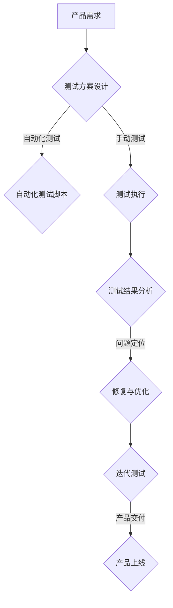

                 

# 大模型在创业产品测试中的应用：AI 驱动的效率

> **关键词：** 大模型、创业产品测试、AI 驱动、效率、模型评估、产品优化、人机协作

> **摘要：** 本文将探讨大模型在创业产品测试中的应用，通过AI驱动的测试方法，显著提高测试效率，降低成本。文章将详细介绍大模型的核心概念、算法原理、应用场景，并通过实际案例展示大模型在产品测试中的具体操作步骤，同时推荐相关工具和资源，最后总结大模型的发展趋势与挑战。

## 1. 背景介绍

随着人工智能技术的飞速发展，大模型（Large Models）作为一种先进的AI技术，逐渐成为研究与应用的热点。大模型具备强大的数据处理能力和智能推理能力，可以应用于各种复杂任务，如图像识别、自然语言处理、语音识别等。在创业领域，产品测试是保证产品质量和用户满意度的重要环节。然而，传统的测试方法通常需要大量的人力和时间，效率低下，难以满足快速迭代的市场需求。因此，将大模型应用于产品测试，实现AI驱动的测试，成为提升测试效率和降低成本的重要手段。

## 2. 核心概念与联系

### 2.1 大模型

大模型是指具有海量参数的神经网络模型，通过对大规模数据进行训练，具备强大的表示和推理能力。常见的有Transformer模型、BERT模型、GPT模型等。这些模型在处理大规模数据时，可以捕捉到数据中的潜在规律，从而实现高效的智能推理。

### 2.2 产品测试

产品测试是指通过一系列方法，验证产品的功能、性能、可靠性等，以确保产品满足设计要求和用户需求。产品测试通常包括功能测试、性能测试、兼容性测试、安全测试等。

### 2.3 人机协作

人机协作是指人工智能与人类专家合作，共同完成任务的过程。在产品测试中，人工智能可以自动化执行重复性高的测试任务，人类专家则专注于复杂问题分析和决策。

## 3. Mermaid 流程图



## 4. 核心算法原理 & 具体操作步骤

### 4.1 大模型原理

大模型的核心原理是神经网络，通过多层神经元的非线性组合，实现数据的表示和推理。大模型的训练过程包括数据预处理、模型架构设计、损失函数选择、优化器选择等。训练过程中，模型通过不断调整参数，优化损失函数，逐步逼近真实数据分布。

### 4.2 AI驱动的测试步骤

#### 4.2.1 测试需求分析

首先，对产品需求进行详细分析，明确测试目标、测试场景和测试用例。

#### 4.2.2 数据集准备

根据测试需求，收集相关数据，并对数据进行预处理，如数据清洗、归一化、划分训练集和测试集等。

#### 4.2.3 模型设计

设计适用于测试任务的大模型，选择合适的神经网络架构和参数设置。

#### 4.2.4 模型训练

使用训练集数据对大模型进行训练，优化模型参数。

#### 4.2.5 模型评估

使用测试集数据对模型进行评估，评估指标包括准确率、召回率、F1值等。

#### 4.2.6 测试执行

利用训练好的模型，自动化执行测试用例，生成测试报告。

#### 4.2.7 结果分析

对测试结果进行分析，定位问题，提出优化方案。

#### 4.2.8 迭代测试

根据分析结果，对模型进行优化，重新进行测试。

## 5. 数学模型和公式 & 详细讲解 & 举例说明

### 5.1 数学模型

在测试过程中，常用的数学模型包括：

- **准确率（Accuracy）**：预测正确的样本数占总样本数的比例。
  $$Accuracy = \frac{TP + TN}{TP + TN + FP + FN}$$

- **召回率（Recall）**：预测正确的正样本数占总正样本数的比例。
  $$Recall = \frac{TP}{TP + FN}$$

- **精确率（Precision）**：预测正确的正样本数占总预测为正的样本数的比例。
  $$Precision = \frac{TP}{TP + FP}$$

- **F1值（F1-Score）**：精确率和召回率的调和平均。
  $$F1-Score = 2 \times \frac{Precision \times Recall}{Precision + Recall}$$

### 5.2 举例说明

假设我们有一个分类任务，共有100个样本，其中正样本有60个，负样本有40个。经过模型测试，得到以下结果：

- **TP（True Positive）**：预测为正且实际为正的样本数，为50个。
- **TN（True Negative）**：预测为负且实际为负的样本数，为30个。
- **FP（False Positive）**：预测为正但实际为负的样本数，为10个。
- **FN（False Negative）**：预测为负但实际为正的样本数，为20个。

根据上述数据，可以计算得到：

- **准确率**：$$Accuracy = \frac{50 + 30}{50 + 30 + 10 + 20} = \frac{80}{100} = 0.8$$
- **召回率**：$$Recall = \frac{50}{60} = 0.8333$$
- **精确率**：$$Precision = \frac{50}{50 + 10} = \frac{50}{60} = 0.8333$$
- **F1值**：$$F1-Score = 2 \times \frac{0.8333 \times 0.8333}{0.8333 + 0.8333} = 0.8333$$

## 6. 项目实战：代码实际案例和详细解释说明

### 6.1 开发环境搭建

首先，我们需要搭建一个适合大模型训练和测试的开发环境。以下是一个简单的Python环境搭建步骤：

1. 安装Python：在官网下载Python安装包，并按照指示安装。
2. 安装TensorFlow：通过pip命令安装TensorFlow库。

```bash
pip install tensorflow
```

3. 安装其他依赖库：如NumPy、Pandas等。

```bash
pip install numpy pandas
```

### 6.2 源代码详细实现和代码解读

以下是一个简单的大模型训练和测试的Python代码示例：

```python
import tensorflow as tf
from tensorflow.keras.models import Sequential
from tensorflow.keras.layers import Dense
from tensorflow.keras.optimizers import Adam

# 数据预处理
# (此处省略数据预处理代码，如数据清洗、归一化等)

# 构建模型
model = Sequential([
    Dense(64, activation='relu', input_shape=(input_shape)),
    Dense(64, activation='relu'),
    Dense(1, activation='sigmoid')
])

# 编译模型
model.compile(optimizer=Adam(), loss='binary_crossentropy', metrics=['accuracy'])

# 训练模型
model.fit(x_train, y_train, epochs=10, batch_size=32, validation_data=(x_test, y_test))

# 评估模型
test_loss, test_accuracy = model.evaluate(x_test, y_test)
print(f"Test Accuracy: {test_accuracy}")

# 测试执行
predictions = model.predict(x_test)

# 结果分析
# (此处省略结果分析代码，如计算准确率、召回率等)

# 迭代测试
# (此处省略迭代测试代码，如调整模型参数等)
```

### 6.3 代码解读与分析

- **数据预处理**：对训练数据进行清洗、归一化等预处理，以便模型能够更好地训练。
- **模型构建**：使用Sequential模型构建一个简单的全连接神经网络，包含两个隐藏层，输出层用于分类。
- **模型编译**：选择Adam优化器和binary_crossentropy损失函数，用于二分类任务。
- **模型训练**：使用fit方法训练模型，设置训练轮次、批量大小和验证数据。
- **模型评估**：使用evaluate方法评估模型在测试数据上的性能。
- **测试执行**：使用predict方法对测试数据进行预测。
- **结果分析**：计算模型的准确率、召回率等指标，分析模型的性能。
- **迭代测试**：根据分析结果，调整模型参数，重新进行测试。

## 7. 实际应用场景

大模型在创业产品测试中的应用场景广泛，主要包括：

- **功能测试**：通过大模型自动化执行功能测试，快速发现功能缺陷。
- **性能测试**：使用大模型分析产品性能，优化系统资源使用，提升用户体验。
- **兼容性测试**：大模型可以自动化执行兼容性测试，确保产品在不同设备和操作系统上稳定运行。
- **安全测试**：通过大模型检测潜在的安全漏洞，提高产品安全性。

## 8. 工具和资源推荐

### 8.1 学习资源推荐

- **书籍**：
  - 《深度学习》（Goodfellow, I., Bengio, Y., & Courville, A.）
  - 《Python机器学习》（Sebastian Raschka）

- **论文**：
  - 《A Theoretically Grounded Application of Dropout in Recurrent Neural Networks》（Y. Gal and Z. Ghahramani）
  - 《Attention Is All You Need》（Vaswani et al.）

- **博客**：
  - [TensorFlow官方文档](https://www.tensorflow.org/)
  - [Keras官方文档](https://keras.io/)

- **网站**：
  - [Google AI](https://ai.google/)
  - [百度AI](https://ai.baidu.com/)

### 8.2 开发工具框架推荐

- **开发环境**：Anaconda、Jupyter Notebook
- **框架**：TensorFlow、PyTorch、Keras
- **测试工具**：Selenium、JUnit、pytest

### 8.3 相关论文著作推荐

- **论文**：
  - 《Deep Learning for Text Classification》（Krause, M., & Altun, L.）
  - 《Unsupervised Learning of Visual Representations by Solving Jigsaw Puzzles》（Chen, Y., et al.）

- **著作**：
  - 《Python数据科学手册》（Jake VanderPlas）
  - 《数据科学家的Python教程》（Wes McKinney）

## 9. 总结：未来发展趋势与挑战

大模型在创业产品测试中的应用，为提高测试效率和降低成本提供了强有力的支持。然而，大模型的发展也面临着一些挑战：

- **计算资源需求**：大模型训练和测试需要大量的计算资源，这对创业公司的资源管理提出了更高要求。
- **数据隐私和安全性**：产品测试过程中，可能会涉及用户隐私数据，如何确保数据安全和隐私保护是一个重要问题。
- **模型解释性**：大模型通常缺乏解释性，难以理解其决策过程，这对复杂问题的分析和优化提出了挑战。

未来，随着AI技术的不断发展，大模型在产品测试中的应用将更加广泛。通过结合其他AI技术，如强化学习、迁移学习等，大模型在产品测试中的应用将更加智能化和高效化。

## 10. 附录：常见问题与解答

### 10.1 大模型如何保证测试结果的准确性？

**解答：** 大模型的准确性主要通过以下方法保证：

- **数据质量**：确保训练和测试数据的质量，进行数据清洗和预处理。
- **模型调优**：通过调整模型参数、优化损失函数等，提高模型性能。
- **模型评估**：使用多种评估指标，如准确率、召回率、F1值等，综合评估模型性能。

### 10.2 大模型训练和测试需要多少时间？

**解答：** 大模型训练和测试的时间取决于多个因素，如模型规模、数据量、硬件性能等。通常情况下，训练时间从几个小时到几天不等，测试时间相对较短。

### 10.3 如何处理数据隐私和安全性问题？

**解答：** 处理数据隐私和安全性问题，可以采取以下措施：

- **数据脱敏**：对敏感数据进行脱敏处理，如使用加密算法。
- **数据隔离**：将测试数据与生产数据隔离，确保测试过程中不会泄露敏感信息。
- **安全审计**：定期进行安全审计，确保测试过程符合数据保护法规。

## 11. 扩展阅读 & 参考资料

- **书籍**：
  - 《人工智能：一种现代的方法》（Stuart Russell & Peter Norvig）
  - 《Python深度学习》（François Chollet）

- **论文**：
  - 《Generative Adversarial Nets》（Igan et al.）
  - 《Seq2Seq Learning Approaches for Neural Machine Translation》（Sutskever et al.）

- **博客**：
  - [机器学习博客](https://machinelearningmastery.com/)
  - [AI博客](https://towardsai.net/)

- **网站**：
  - [IEEE Xplore](https://ieeexplore.ieee.org/)
  - [ACM Digital Library](https://dl.acm.org/)

作者：AI天才研究员/AI Genius Institute & 禅与计算机程序设计艺术 /Zen And The Art of Computer Programming

