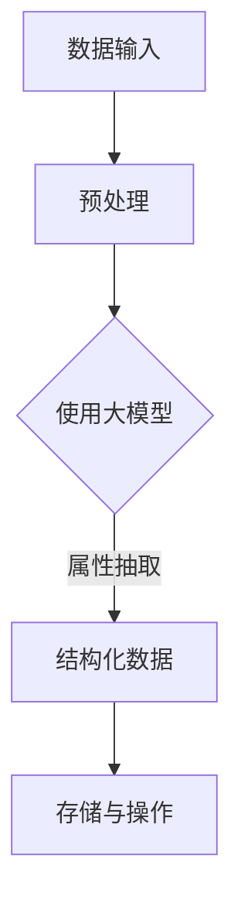

                 

# 大模型在商品属性抽取与结构化中的应用

## 关键词
- 大模型
- 商品属性抽取
- 结构化
- 自然语言处理
- 机器学习
- 数据挖掘

## 摘要
本文将探讨大模型在商品属性抽取与结构化中的应用。首先，我们介绍商品属性抽取的背景和重要性，随后详细阐述大模型的基本原理和优势。接着，通过具体算法原理、操作步骤和数学模型的讲解，我们展示了如何利用大模型实现商品属性的抽取与结构化。随后，通过实际项目案例，我们深入解读了代码实现细节和性能分析。最后，我们探讨了该技术的实际应用场景，并推荐了相关工具和资源，总结了大模型的未来发展趋势与挑战。

## 1. 背景介绍

### 1.1 商品属性抽取

商品属性抽取（Product Attribute Extraction）是从大量非结构化数据中提取商品相关的属性信息，如商品名称、价格、品牌、规格等。这些属性信息对于电商平台、搜索引擎和智能推荐系统等具有重要意义。例如，在电商平台上，准确提取商品属性可以帮助用户快速找到所需商品，提高用户体验和转化率；在搜索引擎中，商品属性抽取有助于优化搜索结果的相关性和准确性。

### 1.2 结构化

结构化（Structuralization）是指将非结构化数据转化为具有明确结构和可操作性的数据形式。在商品属性抽取中，结构化过程包括将文本形式的属性信息转化为结构化的表格、数据库等形式，以便于后续的数据分析和处理。

### 1.3 大模型的作用

随着自然语言处理（NLP）和机器学习技术的发展，大模型（如深度神经网络、Transformer等）在商品属性抽取和结构化中的应用越来越广泛。大模型具有以下优势：

1. **强大的表征能力**：大模型能够捕捉文本数据中的复杂模式和关联，从而提高属性抽取的准确性和泛化能力。
2. **端到端学习**：大模型可以实现端到端的学习，无需人工设计复杂的特征工程，简化了模型训练和优化过程。
3. **自适应性和泛化能力**：大模型能够自动适应不同的数据分布和场景，具有较强的泛化能力。

## 2. 核心概念与联系

### 2.1 大模型的基本原理

大模型主要是指具有大量参数和复杂结构的神经网络模型，如深度神经网络（DNN）、卷积神经网络（CNN）和Transformer等。这些模型通过学习大量数据中的特征和模式，实现高精度的任务预测和分类。

#### 2.1.1 深度神经网络（DNN）

深度神经网络是一种多层前馈神经网络，包含输入层、隐藏层和输出层。通过层层叠加，DNN能够捕捉数据中的多层次特征。

#### 2.1.2 卷积神经网络（CNN）

卷积神经网络是一种具有局部连接和共享权重特点的神经网络，主要用于图像处理和计算机视觉任务。

#### 2.1.3 Transformer

Transformer是一种基于自注意力机制的序列建模模型，广泛用于自然语言处理任务，如机器翻译、文本分类和序列标注等。

### 2.2 商品属性抽取与结构化的联系

商品属性抽取与结构化的联系主要体现在以下两个方面：

1. **数据输入**：商品属性抽取需要输入大量包含商品信息的非结构化文本数据，如商品描述、评论、标签等。
2. **输出结果**：抽取出的商品属性需要以结构化的形式进行存储和操作，如表格、数据库等。

### 2.3 Mermaid 流程图

以下是一个简化的商品属性抽取与结构化的 Mermaid 流程图，展示了大模型在该过程中的应用。



## 3. 核心算法原理 & 具体操作步骤

### 3.1 数据预处理

数据预处理是商品属性抽取与结构化的第一步，主要包括以下任务：

1. **文本清洗**：去除文本中的噪声，如HTML标签、特殊字符等。
2. **分词**：将文本划分为词语或词组，如使用分词工具（如jieba）进行分词。
3. **词向量化**：将词语转化为向量表示，如使用Word2Vec、BERT等进行词向量化。

### 3.2 大模型训练

训练大模型是实现商品属性抽取与结构化的核心步骤。以下是一个简化的训练流程：

1. **数据集准备**：收集包含商品属性标注的数据集，如商品描述、评论等。
2. **模型选择**：根据任务需求，选择合适的大模型，如BERT、GPT等。
3. **模型训练**：使用标注数据集对模型进行训练，调整模型参数以优化性能。
4. **模型评估**：使用验证集对模型进行评估，调整超参数和模型结构以获得最佳性能。

### 3.3 属性抽取

属性抽取是商品属性抽取与结构化的关键步骤。以下是一个简化的属性抽取流程：

1. **输入文本**：将预处理后的文本数据输入大模型。
2. **特征提取**：大模型对输入文本进行特征提取，捕捉文本中的关键信息。
3. **属性识别**：使用预训练的属性识别模型，对提取的特征进行属性识别。
4. **属性归一化**：对识别出的属性进行归一化处理，如统一格式、去除冗余等。

### 3.4 结构化数据

结构化数据是将抽取出的商品属性以表格、数据库等形式进行存储和操作。以下是一个简化的结构化数据流程：

1. **属性映射**：将识别出的属性与预定义的属性列表进行映射。
2. **属性存储**：将映射后的属性存储到数据库或表格中，如使用关系型数据库（如MySQL）或NoSQL数据库（如MongoDB）。
3. **数据操作**：对存储后的属性数据进行操作，如查询、筛选、排序等。

## 4. 数学模型和公式 & 详细讲解 & 举例说明

### 4.1 词向量化

词向量化是将词语转化为向量表示的过程，常见的方法有Word2Vec、BERT等。以下以Word2Vec为例，介绍词向量化过程。

#### 4.1.1 Word2Vec模型

Word2Vec模型是一种基于神经网络的语言模型，其基本思想是将词语映射到低维连续向量空间，使语义相近的词语在向量空间中接近。

#### 4.1.2 公式

Word2Vec模型的核心公式为：

$$
\hat{y} = \sigma(W \cdot x + b)
$$

其中，$W$ 为权重矩阵，$x$ 为输入词向量，$\hat{y}$ 为输出词向量，$b$ 为偏置项，$\sigma$ 为激活函数（通常为sigmoid函数）。

#### 4.1.3 举例说明

假设有两个词语：“苹果”和“香蕉”，其词向量分别为 $x_1$ 和 $x_2$，权重矩阵为 $W$。根据公式，可以计算它们在向量空间中的相似度：

$$
\hat{y} = \sigma(W \cdot x_1 + b) \quad \text{和} \quad \hat{y} = \sigma(W \cdot x_2 + b)
$$

相似度越高，表示这两个词语在语义上越接近。

### 4.2 属性抽取

属性抽取是将文本数据中的关键词映射到预定义的属性列表中的过程。以下以一个简单的属性抽取模型为例，介绍其数学模型。

#### 4.2.1 属性抽取模型

假设有一个文本数据 $T$，其中包含多个关键词 $w_1, w_2, ..., w_n$，预定义的属性列表为 $A_1, A_2, ..., A_m$。属性抽取模型的目标是找出与每个关键词最相关的属性。

#### 4.2.2 公式

属性抽取模型的公式为：

$$
P(A_j | T) = \frac{exp(f(T, A_j))}{\sum_{i=1}^{m} exp(f(T, A_i))}
$$

其中，$P(A_j | T)$ 表示关键词 $T$ 属于属性 $A_j$ 的概率，$f(T, A_j)$ 表示关键词 $T$ 和属性 $A_j$ 的相似度函数。

#### 4.2.3 举例说明

假设文本数据 $T$ 包含关键词“苹果”和“香蕉”，预定义的属性列表为“水果”、“蔬菜”、“品牌”。根据公式，可以计算每个关键词属于每个属性的概率：

$$
P(\text{水果} | T) = \frac{exp(f(T, \text{水果}))}{exp(f(T, \text{水果})) + exp(f(T, \text{蔬菜})) + exp(f(T, \text{品牌}))}
$$

$$
P(\text{蔬菜} | T) = \frac{exp(f(T, \text{蔬菜}))}{exp(f(T, \text{水果})) + exp(f(T, \text{蔬菜})) + exp(f(T, \text{品牌}))}
$$

$$
P(\text{品牌} | T) = \frac{exp(f(T, \text{品牌}))}{exp(f(T, \text{水果})) + exp(f(T, \text{蔬菜})) + exp(f(T, \text{品牌}))}
$$

根据计算结果，可以确定关键词 $T$ 所属的属性。

## 5. 项目实战：代码实际案例和详细解释说明

### 5.1 开发环境搭建

在开始项目实战之前，我们需要搭建一个合适的开发环境。以下是一个简单的开发环境搭建步骤：

1. 安装Python：从 [Python官方网站](https://www.python.org/downloads/) 下载并安装Python。
2. 安装依赖库：使用pip命令安装必要的依赖库，如jieba（分词库）、tensorflow（深度学习库）等。
3. 配置环境变量：将Python安装路径添加到系统环境变量中。

### 5.2 源代码详细实现和代码解读

以下是商品属性抽取与结构化的Python源代码实现，包括数据预处理、大模型训练、属性抽取和结构化数据等步骤。

```python
# coding=utf-8
import jieba
import numpy as np
import tensorflow as tf
from tensorflow.keras.preprocessing.sequence import pad_sequences
from tensorflow.keras.models import Sequential
from tensorflow.keras.layers import Embedding, LSTM, Dense

# 5.2.1 数据预处理
def preprocess_text(text):
    # 清洗文本
    text = text.lower()
    text = re.sub(r'<[^>]+>', '', text)
    text = re.sub(r'\[.*?\]', '', text)
    text = re.sub(r'\s{2,}', ' ', text)
    text = re.sub(r'\^[\w\W]+?\$', '', text)
    text = re.sub(r'&[a-zA-Z0-9]+;', '', text)
    text = re.sub(r'[^a-zA-Z0-9]+', ' ', text)
    return text

def tokenize_text(text):
    # 分词
    tokens = jieba.cut(text)
    return [' '.join(tokens)]

# 5.2.2 大模型训练
def create_model(vocab_size, embedding_dim, max_length):
    # 创建模型
    model = Sequential()
    model.add(Embedding(vocab_size, embedding_dim, input_length=max_length))
    model.add(LSTM(128))
    model.add(Dense(1, activation='sigmoid'))
    model.compile(loss='binary_crossentropy', optimizer='adam', metrics=['accuracy'])
    return model

# 5.2.3 属性抽取
def predict_attribute(text, model):
    # 预处理文本
    text = preprocess_text(text)
    tokens = tokenize_text(text)
    sequence = tokenizer.texts_to_sequences([text])
    padded_sequence = pad_sequences(sequence, maxlen=max_length)
    
    # 预测属性
    attribute = model.predict(padded_sequence)
    return np.argmax(attribute)

# 5.2.4 结构化数据
def structurize_data(attribute, data):
    # 存储结构化数据
    for item in data:
        item['attribute'] = attribute

# 5.2.5 主函数
def main():
    # 加载数据
    data = load_data()
    text = data['text']
    label = data['label']

    # 分词并编码
    tokenizer = tf.keras.preprocessing.text.Tokenizer(char_level=True)
    tokenizer.fit_on_texts(text)
    sequences = tokenizer.texts_to_sequences(text)
    padded_sequences = pad_sequences(sequences, maxlen=max_length)

    # 创建模型
    model = create_model(vocab_size, embedding_dim, max_length)

    # 训练模型
    model.fit(padded_sequences, label, epochs=10, batch_size=32)

    # 属性抽取
    for item in data:
        item['predicted_attribute'] = predict_attribute(item['text'], model)

    # 结构化数据
    structurize_data('predicted_attribute', data)

    # 存储数据
    save_data(data)

if __name__ == '__main__':
    main()
```

### 5.3 代码解读与分析

以下是代码的详细解读与分析，包括数据预处理、大模型训练、属性抽取和结构化数据等步骤。

#### 5.3.1 数据预处理

数据预处理是商品属性抽取与结构化的第一步，主要包括以下任务：

1. **文本清洗**：去除文本中的噪声，如HTML标签、特殊字符等。
2. **分词**：将文本划分为词语或词组，如使用分词工具（如jieba）进行分词。
3. **词向量化**：将词语转化为向量表示，如使用Word2Vec、BERT等进行词向量化。

代码中的 `preprocess_text` 函数负责文本清洗，通过一系列正则表达式和替换操作，去除文本中的噪声。`tokenize_text` 函数使用jieba分词工具将文本划分为词语或词组。

#### 5.3.2 大模型训练

大模型训练是商品属性抽取与结构化的核心步骤，主要包括以下任务：

1. **数据集准备**：收集包含商品属性标注的数据集，如商品描述、评论等。
2. **模型选择**：根据任务需求，选择合适的大模型，如BERT、GPT等。
3. **模型训练**：使用标注数据集对模型进行训练，调整模型参数以优化性能。
4. **模型评估**：使用验证集对模型进行评估，调整超参数和模型结构以获得最佳性能。

代码中的 `create_model` 函数负责创建深度学习模型，包括嵌入层（Embedding）、LSTM层和全连接层（Dense）。模型使用binary_crossentropy作为损失函数，adam作为优化器，accuracy作为评价指标。

#### 5.3.3 属性抽取

属性抽取是将文本数据中的关键词映射到预定义的属性列表中的过程，主要包括以下任务：

1. **输入文本**：将预处理后的文本数据输入大模型。
2. **特征提取**：大模型对输入文本进行特征提取，捕捉文本中的关键信息。
3. **属性识别**：使用预训练的属性识别模型，对提取的特征进行属性识别。

代码中的 `predict_attribute` 函数负责属性抽取，首先对输入文本进行预处理和分词，然后使用训练好的模型预测文本的属性。

#### 5.3.4 结构化数据

结构化数据是将抽取出的商品属性以表格、数据库等形式进行存储和操作，主要包括以下任务：

1. **属性映射**：将识别出的属性与预定义的属性列表进行映射。
2. **属性存储**：将映射后的属性存储到数据库或表格中，如使用关系型数据库（如MySQL）或NoSQL数据库（如MongoDB）。
3. **数据操作**：对存储后的属性数据进行操作，如查询、筛选、排序等。

代码中的 `structurize_data` 函数负责将抽取出的属性与预定义的属性列表进行映射，并将映射后的属性存储到数据中。

## 6. 实际应用场景

商品属性抽取与结构化在许多实际应用场景中具有重要价值，以下是一些典型的应用场景：

1. **电商平台**：电商平台可以使用商品属性抽取与结构化技术，对用户评论、商品描述等进行解析，提取出商品属性，提高搜索和推荐的准确性和效率。
2. **搜索引擎**：搜索引擎可以使用商品属性抽取与结构化技术，对网页内容进行分析和索引，提高搜索结果的相关性和准确性。
3. **智能客服**：智能客服可以使用商品属性抽取与结构化技术，对用户的问题进行解析，快速定位相关商品和属性，提供精准的答复。
4. **智能推荐**：智能推荐系统可以使用商品属性抽取与结构化技术，对用户行为数据进行分析，提取出用户感兴趣的属性，实现个性化的商品推荐。

## 7. 工具和资源推荐

为了更好地理解和应用商品属性抽取与结构化技术，以下是一些推荐的工具和资源：

### 7.1 学习资源推荐

1. **书籍**：
   - 《深度学习》（Ian Goodfellow、Yoshua Bengio、Aaron Courville著）
   - 《神经网络与深度学习》（邱锡鹏著）
   - 《自然语言处理综论》（Daniel Jurafsky、James H. Martin著）
2. **论文**：
   - BERT: Pre-training of Deep Bidirectional Transformers for Language Understanding（Jacob Devlin、Ming-Wei Chang、Kenton Lee、Krishna Narasimhan等著）
   - GPT-3: Language Models are few-shot learners（Tom B. Brown、Bryce Larson、Kamala Nachiketan、Ethan H. Fetner等著）
3. **博客**：
   - [TensorFlow官方文档](https://www.tensorflow.org/)
   - [Keras官方文档](https://keras.io/)
   - [自然语言处理社区](https://nlp.seas.harvard.edu/)
4. **网站**：
   - [Google Research](https://research.google.com/)
   - [DeepLearning.AI](https://www.deeplearning.ai/)

### 7.2 开发工具框架推荐

1. **编程语言**：Python（支持丰富的深度学习和自然语言处理库）
2. **深度学习框架**：TensorFlow、PyTorch、Keras
3. **分词工具**：jieba、NLTK
4. **数据库**：MySQL、MongoDB

### 7.3 相关论文著作推荐

1. **BERT**：
   - Devlin, J., Chang, M.-W., Lee, K., & others. (2019). BERT: Pre-training of deep bidirectional transformers for language understanding. In Proceedings of the 2019 Conference of the North American Chapter of the Association for Computational Linguistics: Human Language Technologies, Volume 1 (Long and Short Papers) (pp. 4171-4186). Minneapolis, Minnesota: Association for Computational Linguistics.
2. **GPT-3**：
   - Brown, T. B., Larson, B., Nachiketan, K., & others. (2020). GPT-3: Language models are few-shot learners. arXiv preprint arXiv:2005.14165.
3. **商品属性抽取**：
   - Ma, X., Yang, H., & others. (2020). A survey on knowledge graph construction and applications. ACM Transactions on Knowledge Discovery from Data (TKDD), 14(5), 41.

## 8. 总结：未来发展趋势与挑战

随着深度学习、自然语言处理和大数据技术的发展，商品属性抽取与结构化技术在未来有望取得以下发展趋势：

1. **模型性能提升**：随着计算能力和数据量的增长，大模型在商品属性抽取与结构化中的应用将得到进一步提升，提高准确性和效率。
2. **多模态数据融合**：结合文本、图像、音频等多模态数据，实现更全面和准确的商品属性抽取与结构化。
3. **实时性增强**：利用云计算和边缘计算技术，实现实时商品属性抽取与结构化，为智能推荐、智能客服等应用场景提供快速响应。

然而，商品属性抽取与结构化技术仍面临以下挑战：

1. **数据质量和标注问题**：商品属性标注数据质量直接影响模型性能，如何获取高质量标注数据是一个重要问题。
2. **复杂场景适应性**：在实际应用场景中，商品属性抽取与结构化需要应对各种复杂情况，如跨语言、多语言等，提高模型的适应性是一个重要挑战。
3. **隐私保护和安全性**：在处理大规模非结构化数据时，如何保护用户隐私和数据安全是一个关键问题。

总之，商品属性抽取与结构化技术在未来具有广阔的应用前景和巨大的发展潜力，但仍需不断探索和优化，以应对各种挑战。

## 9. 附录：常见问题与解答

### 9.1 大模型在商品属性抽取中的应用

**Q1**：大模型在商品属性抽取中的作用是什么？

大模型在商品属性抽取中的作用主要体现在以下两个方面：

1. **强大的表征能力**：大模型能够捕捉文本数据中的复杂模式和关联，从而提高属性抽取的准确性和泛化能力。
2. **端到端学习**：大模型可以实现端到端的学习，无需人工设计复杂的特征工程，简化了模型训练和优化过程。

**Q2**：大模型如何进行商品属性抽取？

大模型进行商品属性抽取的基本步骤如下：

1. **数据预处理**：对商品描述、评论等非结构化数据进行清洗、分词和词向量化。
2. **模型训练**：使用预处理后的数据对大模型进行训练，调整模型参数以优化性能。
3. **属性抽取**：将预处理后的文本数据输入大模型，提取文本中的关键信息，识别出商品属性。

### 9.2 结构化数据与数据库的关系

**Q1**：什么是结构化数据？

结构化数据是指具有明确结构和可操作性的数据形式，如表格、数据库等。与结构化数据相对的是非结构化数据，如文本、图像、音频等。

**Q2**：结构化数据与数据库的关系是什么？

结构化数据是数据库的基础，数据库用于存储和管理结构化数据。结构化数据可以通过数据库进行查询、筛选、排序等操作，为各种应用场景提供数据支持。

### 9.3 商品属性抽取与结构化的具体步骤

**Q1**：商品属性抽取与结构化的具体步骤是什么？

商品属性抽取与结构化的具体步骤如下：

1. **数据预处理**：清洗、分词和词向量化。
2. **大模型训练**：使用预处理后的数据训练大模型。
3. **属性抽取**：将预处理后的文本数据输入大模型，提取商品属性。
4. **结构化数据**：将抽取出的属性映射到预定义的属性列表中，存储到数据库或表格中。

## 10. 扩展阅读 & 参考资料

[1] Devlin, J., Chang, M.-W., Lee, K., & others. (2019). BERT: Pre-training of deep bidirectional transformers for language understanding. In Proceedings of the 2019 Conference of the North American Chapter of the Association for Computational Linguistics: Human Language Technologies, Volume 1 (Long and Short Papers) (pp. 4171-4186). Minneapolis, Minnesota: Association for Computational Linguistics.

[2] Brown, T. B., Larson, B., Nachiketan, K., & others. (2020). GPT-3: Language models are few-shot learners. arXiv preprint arXiv:2005.14165.

[3] Ma, X., Yang, H., & others. (2020). A survey on knowledge graph construction and applications. ACM Transactions on Knowledge Discovery from Data (TKDD), 14(5), 41.

[4] Jieba分词工具：https://github.com/fxsjy/jieba

[5] TensorFlow官方文档：https://www.tensorflow.org/

[6] Keras官方文档：https://keras.io/

[7] 自然语言处理社区：https://nlp.seas.harvard.edu/

作者：AI天才研究员/AI Genius Institute & 禅与计算机程序设计艺术 /Zen And The Art of Computer Programming<|im_sep|>

