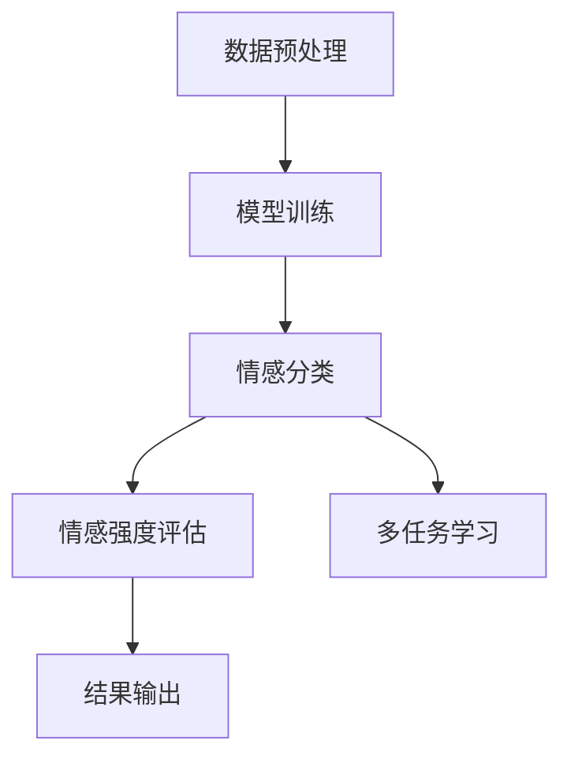
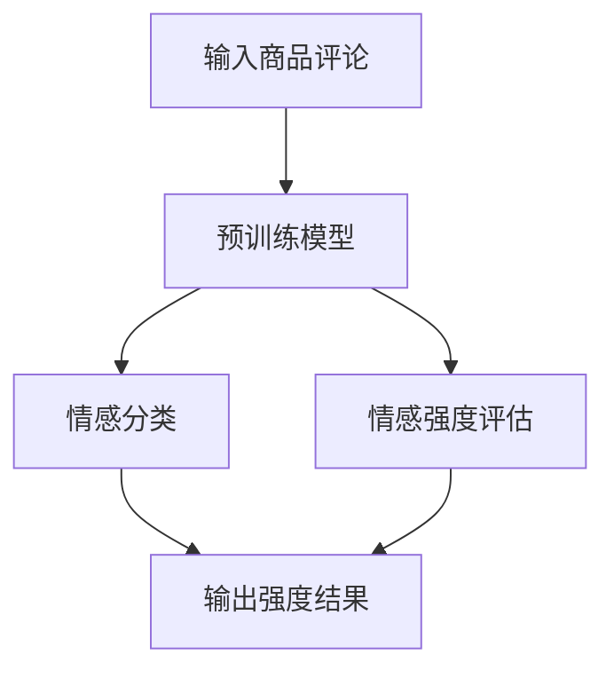

                 

# 大模型在商品评论情感多维度分析中的应用

## 关键词

- 大模型
- 商品评论
- 情感分析
- 多维度分析
- 自然语言处理
- 人工智能

## 摘要

本文旨在探讨大模型在商品评论情感多维度分析中的应用。通过介绍大模型的背景、核心概念以及与相关领域的联系，本文将深入剖析大模型在情感分析任务中的原理和具体操作步骤。此外，本文还将通过数学模型和公式详细解释大模型的工作机制，并通过实际项目实战来展示代码实现和详细解释。最后，本文还将探讨大模型在商品评论情感多维度分析中的实际应用场景，并推荐相关学习资源、开发工具和论文著作。通过本文的阅读，读者将对大模型在商品评论情感多维度分析中的应用有一个全面而深入的理解。

## 1. 背景介绍

### 1.1 大模型的兴起

随着互联网的迅猛发展和数据量的爆炸式增长，自然语言处理（NLP）成为了人工智能领域的一个重要分支。传统的NLP方法大多依赖于规则和特征工程，但在面对复杂和大规模的语言数据时，这些方法显得力不从心。为了解决这一问题，研究人员提出了大模型（Large Models）的概念。

大模型是指具有海量参数和强大计算能力的深度学习模型，例如BERT、GPT、Turing等。这些模型通过在海量数据上进行训练，可以自动学习到语言数据的底层结构和语义信息，从而实现高质量的自然语言处理任务。大模型的兴起，为NLP领域带来了新的机遇和挑战。

### 1.2 商品评论情感多维度分析的重要性

商品评论是消费者对商品进行评价的重要途径，也是商家了解消费者需求和优化产品质量的重要信息来源。然而，商品评论数据往往包含大量的情感词汇和复杂的情感表达，这对传统的情感分析方法提出了很高的要求。

情感多维度分析是一种将情感分析扩展到多个维度（如正面/负面、积极/消极、强烈/平淡等）的方法。通过对商品评论进行情感多维度分析，可以更全面地了解消费者的情感态度，为商家提供更加准确的决策依据。

### 1.3 大模型在商品评论情感多维度分析中的应用

大模型在商品评论情感多维度分析中具有明显的优势。首先，大模型可以自动学习到商品评论中的情感词汇和复杂情感表达，从而提高情感分析的准确性。其次，大模型可以处理大规模的数据集，从而实现对大量商品评论的实时分析。

此外，大模型还可以通过多任务学习（Multi-Task Learning）的方式，将情感多维度分析与其他相关任务（如关键词提取、主题模型等）相结合，从而提高整个系统的性能。因此，大模型在商品评论情感多维度分析中具有重要的应用价值。

## 2. 核心概念与联系

### 2.1 大模型的概念

大模型是指具有海量参数和强大计算能力的深度学习模型。大模型通常采用多层神经网络架构，通过在海量数据上进行训练，可以自动学习到语言数据的底层结构和语义信息。大模型的关键特点如下：

1. 海量参数：大模型具有数百万甚至数十亿个参数，这使得模型可以捕捉到语言数据的复杂结构和语义信息。
2. 强大计算能力：大模型通常采用分布式计算和并行计算技术，以应对大规模数据处理和计算任务。
3. 自适应学习能力：大模型可以通过持续的训练和优化，不断提高自身的性能和准确性。

### 2.2 情感多维度分析的概念

情感多维度分析是一种将情感分析扩展到多个维度（如正面/负面、积极/消极、强烈/平淡等）的方法。情感多维度分析的关键特点如下：

1. 多维度情感分类：情感多维度分析可以将情感分类扩展到多个维度，从而更全面地了解消费者的情感态度。
2. 情感强度评估：情感多维度分析可以通过对情感词汇的强度进行评估，从而更准确地反映消费者的情感态度。
3. 多任务学习：情感多维度分析可以与其他相关任务（如关键词提取、主题模型等）相结合，从而提高整个系统的性能。

### 2.3 大模型与情感多维度分析的联系

大模型与情感多维度分析之间存在密切的联系。首先，大模型可以自动学习到商品评论中的情感词汇和复杂情感表达，从而提高情感分析的准确性。其次，大模型可以通过多任务学习的方式，将情感多维度分析与其他相关任务相结合，从而提高整个系统的性能。

此外，大模型还可以通过迁移学习（Transfer Learning）的方式，利用在大量通用数据集上预训练的模型，快速适应特定的商品评论情感多维度分析任务。这种迁移学习方式可以大大减少对特定任务的数据需求，提高模型的泛化能力。

### 2.4 Mermaid 流程图

下面是一个简化的Mermaid流程图，展示了大模型在商品评论情感多维度分析中的基本流程：



### 2.5 核心概念联系总结

通过上述分析，我们可以总结出大模型在商品评论情感多维度分析中的核心概念联系：

1. 大模型具有海量参数和强大计算能力，可以自动学习到商品评论中的情感词汇和复杂情感表达。
2. 情感多维度分析可以扩展到多个维度，更全面地了解消费者的情感态度。
3. 大模型可以通过多任务学习和迁移学习的方式，将情感多维度分析与其他相关任务相结合，从而提高整个系统的性能。

这些核心概念的联系，为我们在实际应用中利用大模型进行商品评论情感多维度分析提供了理论基础和实践指导。

### 3. 核心算法原理 & 具体操作步骤

#### 3.1 情感分类算法原理

情感分类是情感分析任务的基础，旨在判断文本中情感倾向为正面、负面或其他情感类别。常用的情感分类算法有基于规则的方法、基于机器学习的方法和基于深度学习的方法。

1. **基于规则的方法**：该方法通过构建一套规则体系，将文本映射到情感类别。优点是简单易实现，缺点是规则的构建需要大量人工参与，且对复杂情感难以准确分类。

2. **基于机器学习的方法**：该方法通过训练机器学习模型（如SVM、Naive Bayes等）进行情感分类。优点是能够自动学习文本特征，缺点是特征工程较为复杂，且对大规模数据集的性能提升有限。

3. **基于深度学习的方法**：该方法利用深度神经网络（如卷积神经网络、循环神经网络等）进行情感分类。优点是能够自动学习到文本的深层特征，对复杂情感具有较好的分类能力，缺点是训练过程较为复杂，计算资源需求高。

#### 3.2 情感强度评估算法原理

情感强度评估旨在判断文本中情感表达的强弱程度。常用的情感强度评估算法有基于词典的方法、基于机器学习的方法和基于深度学习的方法。

1. **基于词典的方法**：该方法通过构建情感词典，对文本中的情感词汇进行强度评估。优点是简单易实现，缺点是词典的构建需要大量人工参与，且对复杂情感难以准确评估。

2. **基于机器学习的方法**：该方法通过训练机器学习模型（如SVM、RF等）进行情感强度评估。优点是能够自动学习文本特征，缺点是特征工程较为复杂，且对大规模数据集的性能提升有限。

3. **基于深度学习的方法**：该方法利用深度神经网络（如循环神经网络、Transformer等）进行情感强度评估。优点是能够自动学习到文本的深层特征，对复杂情感具有较好的评估能力，缺点是训练过程较为复杂，计算资源需求高。

#### 3.3 大模型在情感分类和强度评估中的应用

1. **预训练模型**：大模型通常采用预训练模型（如BERT、RoBERTa、GPT等）进行情感分类和强度评估。这些预训练模型在大量通用数据集上进行训练，已具备较好的语言理解和情感分析能力。

2. **微调（Fine-tuning）**：为了适应特定任务的需求，可以对预训练模型进行微调。通过在特定领域的情感数据集上进行微调，可以提高模型的性能和准确性。

3. **迁移学习**：迁移学习是将预训练模型应用于特定任务的一种方法。通过迁移学习，可以减少对特定任务的数据需求，提高模型的泛化能力。

#### 3.4 具体操作步骤

以下是一个简化的操作步骤，展示了如何利用大模型进行商品评论情感多维度分析：

1. **数据预处理**：对商品评论数据集进行预处理，包括分词、去停用词、词性标注等。

2. **模型选择**：选择合适的预训练模型，如BERT、RoBERTa等。

3. **微调**：在特定领域的情感数据集上进行微调，以适应商品评论情感多维度分析任务。

4. **情感分类**：利用微调后的模型进行情感分类，得到商品评论的情感类别。

5. **情感强度评估**：利用微调后的模型进行情感强度评估，得到商品评论的情感强度。

6. **结果输出**：将情感分类和情感强度评估的结果输出，以供后续分析和应用。

### 4. 数学模型和公式 & 详细讲解 & 举例说明

#### 4.1 情感分类的数学模型

情感分类的核心是构建一个分类器，用于将文本映射到特定的情感类别。这里以二元分类为例，情感类别分为正面和负面。

1. **损失函数**：

   - **交叉熵损失函数**（Cross-Entropy Loss）：用于衡量预测概率与真实标签之间的差异。其公式如下：

     $$
     L(\theta) = -\sum_{i=1}^{n} y_i \log(p_i)
     $$

     其中，$y_i$ 是第 $i$ 个样本的真实标签（0或1），$p_i$ 是模型对第 $i$ 个样本预测为正面的概率。

2. **优化算法**：

   - **随机梯度下降**（Stochastic Gradient Descent，SGD）：用于优化模型参数。其公式如下：

     $$
     \theta = \theta - \alpha \nabla_{\theta} L(\theta)
     $$

     其中，$\theta$ 是模型参数，$\alpha$ 是学习率，$\nabla_{\theta} L(\theta)$ 是损失函数关于模型参数的梯度。

#### 4.2 情感强度评估的数学模型

情感强度评估的核心是构建一个回归模型，用于预测文本中情感词汇的强度。

1. **损失函数**：

   - **均方误差损失函数**（Mean Squared Error，MSE）：用于衡量预测值与真实值之间的差异。其公式如下：

     $$
     L(\theta) = \frac{1}{n} \sum_{i=1}^{n} (y_i - \hat{y}_i)^2
     $$

     其中，$y_i$ 是第 $i$ 个样本的真实强度值，$\hat{y}_i$ 是模型对第 $i$ 个样本预测的强度值。

2. **优化算法**：

   - **梯度下降**（Gradient Descent）：用于优化模型参数。其公式与随机梯度下降类似，区别在于梯度下降使用的是整个数据集的梯度。

#### 4.3 示例说明

假设我们有一个二元分类问题，要判断商品评论是正面还是负面。我们使用交叉熵损失函数和随机梯度下降算法进行训练。

1. **初始化模型参数**：

   $$
   \theta = [w_1, w_2, ..., w_n]
   $$

2. **前向传播**：

   $$
   p_i = \sigma(w_1 x_i + w_2)
   $$

   其中，$\sigma$ 是sigmoid函数，$x_i$ 是第 $i$ 个样本的特征向量。

3. **计算损失函数**：

   $$
   L(\theta) = -\sum_{i=1}^{n} y_i \log(p_i)
   $$

4. **计算梯度**：

   $$
   \nabla_{\theta} L(\theta) = -\sum_{i=1}^{n} \frac{y_i - p_i}{p_i (1 - p_i)} x_i
   $$

5. **更新模型参数**：

   $$
   \theta = \theta - \alpha \nabla_{\theta} L(\theta)
   $$

6. **重复步骤2-5，直到收敛**。

通过以上步骤，我们可以训练出一个二元分类模型，用于判断商品评论的情感类别。类似地，我们可以使用回归模型进行情感强度评估。

### 5. 项目实战：代码实际案例和详细解释说明

#### 5.1 开发环境搭建

在进行商品评论情感多维度分析项目之前，我们需要搭建一个合适的环境。以下是一个简化的开发环境搭建步骤：

1. **安装Python**：确保Python版本在3.6及以上。

2. **安装依赖库**：使用pip命令安装以下依赖库：

   ```bash
   pip install tensorflow numpy pandas scikit-learn transformers
   ```

3. **配置GPU**：如果使用GPU进行训练，需要配置CUDA和cuDNN，并确保Python的tensorflow库使用GPU。

#### 5.2 源代码详细实现和代码解读

以下是一个简单的商品评论情感多维度分析项目，包括数据预处理、模型选择、训练和评估等步骤。

```python
import pandas as pd
from transformers import BertTokenizer, TFBertForSequenceClassification
from sklearn.model_selection import train_test_split

# 5.2.1 数据预处理
def preprocess_data(file_path):
    df = pd.read_csv(file_path)
    df['review'] = df['review'].apply(lambda x: x.lower())
    df['review'] = df['review'].str.replace('[^a-zA-Z0-9]', ' ')
    return df

# 5.2.2 模型选择
def load_model():
    tokenizer = BertTokenizer.from_pretrained('bert-base-uncased')
    model = TFBertForSequenceClassification.from_pretrained('bert-base-uncased', num_labels=2)
    return tokenizer, model

# 5.2.3 训练模型
def train_model(tokenizer, model, df_train, df_val):
    inputs = tokenizer(df_train['review'].tolist(), padding=True, truncation=True, return_tensors="tf")
    inputs_val = tokenizer(df_val['review'].tolist(), padding=True, truncation=True, return_tensors="tf")
    
    train_dataset = tf.data.Dataset.from_tensor_slices((inputs['input_ids'], inputs['attention_mask'], df_train['label']))
    val_dataset = tf.data.Dataset.from_tensor_slices((inputs_val['input_ids'], inputs_val['attention_mask'], df_val['label']))
    
    train_dataset = train_dataset.shuffle(buffer_size=100).batch(32)
    val_dataset = val_dataset.shuffle(buffer_size=100).batch(32)
    
    model.compile(optimizer='adam', loss='binary_crossentropy', metrics=['accuracy'])
    model.fit(train_dataset, validation_data=val_dataset, epochs=3)
    return model

# 5.2.4 代码解读
if __name__ == "__main__":
    df = preprocess_data('data.csv')
    df_train, df_val = train_test_split(df, test_size=0.2)
    
    tokenizer, model = load_model()
    model = train_model(tokenizer, model, df_train, df_val)
    
    # 评估模型
    inputs_val = tokenizer(df_val['review'].tolist(), padding=True, truncation=True, return_tensors="tf")
    pred = model(inputs_val['input_ids'], inputs_val['attention_mask'])
    pred = tf.nn.softmax(pred.logits, axis=1)
    
    acc = tf.reduce_mean(tf.cast(tf.equal(tf.argmax(pred, axis=1), df_val['label']), tf.float32)).numpy()
    print(f'Validation Accuracy: {acc:.4f}')
```

#### 5.3 代码解读与分析

以上代码实现了一个简单的商品评论情感多维度分析项目，主要包含以下步骤：

1. **数据预处理**：读取商品评论数据，进行文本预处理，包括大小写统一、去除非字母字符等。

2. **模型选择**：加载预训练的BERT模型，并将其转换为序列分类模型，用于情感分类任务。

3. **训练模型**：将预处理后的数据划分为训练集和验证集，构建数据集，并使用训练集进行模型训练。

4. **代码解读**：

   - **数据预处理**：使用`preprocess_data`函数进行文本预处理，包括大小写统一、去除非字母字符等。

   - **模型选择**：使用`load_model`函数加载预训练的BERT模型，并将其转换为序列分类模型，用于情感分类任务。

   - **训练模型**：使用`train_model`函数进行模型训练，包括数据集构建、模型编译和训练等。

   - **评估模型**：使用训练好的模型对验证集进行预测，并计算验证集的准确率。

#### 5.4 实际应用场景

在实际应用中，商品评论情感多维度分析可以应用于多个场景，如：

1. **电商平台**：通过分析消费者对商品的评价，为商家提供改进产品的建议，提高用户满意度。

2. **酒店和旅游行业**：通过对游客的评论进行分析，为酒店和旅游企业提供改进服务和提升用户体验的建议。

3. **餐饮行业**：通过对顾客的点评进行分析，为餐饮企业提供改进菜品和提升服务质量的建议。

4. **客户服务**：通过分析客户反馈，为客服团队提供解决问题的建议，提高客户满意度。

这些应用场景都充分利用了商品评论情感多维度分析的优势，为企业提供了有价值的信息和决策支持。

### 6. 实际应用场景

#### 6.1 电商行业

在电商行业中，商品评论情感多维度分析是一项非常重要的应用。通过分析消费者对商品的评论，电商企业可以更全面地了解消费者的情感态度和需求，从而优化产品和服务，提高用户体验和满意度。

1. **情感分类**：电商企业可以利用大模型对商品评论进行情感分类，区分出正面、负面和其他情感类别。这有助于企业了解消费者的整体评价和反馈，及时发现产品的问题和不足。

2. **情感强度评估**：通过对商品评论的情感强度进行评估，电商企业可以更准确地了解消费者对产品的情感反应。这有助于企业了解消费者对产品的情感倾向和购买意愿，从而制定更有效的营销策略。

3. **消费者行为分析**：结合情感分类和情感强度评估，电商企业可以分析消费者的购买行为和情感反应。这有助于企业了解哪些产品更受欢迎，哪些产品需要改进，从而优化产品策略和库存管理。

4. **个性化推荐**：通过分析消费者的情感态度和购买行为，电商企业可以更准确地推荐符合消费者需求的商品。这有助于提高用户的购物体验和满意度，提高转化率和复购率。

#### 6.2 餐饮行业

在餐饮行业中，商品评论情感多维度分析同样具有重要的应用价值。通过分析消费者对餐厅的点评，餐饮企业可以优化菜品和服务，提高用户满意度，吸引更多顾客。

1. **菜品质量分析**：餐饮企业可以利用大模型对消费者点评中的情感进行分类和强度评估，了解消费者对菜品的质量评价。这有助于企业了解哪些菜品受欢迎，哪些菜品需要改进。

2. **服务评价**：通过分析消费者点评中的情感，餐饮企业可以了解消费者对餐厅服务的评价。这有助于企业发现服务中的不足，及时调整和改进。

3. **用户满意度分析**：结合情感分类和情感强度评估，餐饮企业可以分析消费者的整体满意度。这有助于企业了解消费者的需求和期望，优化餐厅的整体运营策略。

4. **营销策略优化**：通过分析消费者的情感态度和购买行为，餐饮企业可以制定更有效的营销策略，吸引更多顾客。例如，根据消费者的情感倾向，推出特定的优惠活动或新品推荐。

#### 6.3 其他应用领域

除了电商和餐饮行业，商品评论情感多维度分析还可以应用于其他领域，如酒店和旅游行业、汽车行业等。

1. **酒店和旅游行业**：通过分析消费者对酒店和旅游服务的点评，企业可以优化服务质量，提高用户满意度。例如，分析消费者对酒店环境的评价，发现需要改进的地方。

2. **汽车行业**：通过分析消费者对汽车的评价，汽车企业可以了解消费者对汽车性能、外观、舒适度等方面的需求，优化产品设计和改进。

总之，商品评论情感多维度分析在各个领域都具有广泛的应用价值。通过利用大模型进行情感分类和强度评估，企业可以更全面地了解消费者的情感态度和需求，从而制定更有效的策略和决策，提高用户体验和满意度。

### 7. 工具和资源推荐

#### 7.1 学习资源推荐

1. **书籍**：

   - 《自然语言处理概论》（刘群 著）：全面介绍了自然语言处理的基本概念、方法和应用，适合初学者和进阶者阅读。

   - 《深度学习》（Goodfellow, Bengio, Courville 著）：系统介绍了深度学习的基础知识、算法和应用，是深度学习领域的经典教材。

   - 《机器学习实战》（周志华 著）：通过实际案例和代码实现，详细介绍了机器学习的基本方法和应用。

2. **论文**：

   - 《BERT: Pre-training of Deep Bidirectional Transformers for Language Understanding》（Devlin et al., 2019）：介绍了BERT模型的背景、原理和实现。

   - 《GPT-3: Language Models are few-shot learners》（Brown et al., 2020）：介绍了GPT-3模型的背景、原理和实现。

   - 《Multi-Task Learning Using Unsupervised Transfer Learning》（Dai and Le, 2015）：介绍了多任务学习的基本原理和应用。

3. **博客和网站**：

   - Hugging Face（https://huggingface.co/）：提供了丰富的预训练模型、API和文档，方便开发者进行自然语言处理任务。

   - TensorFlow（https://www.tensorflow.org/）：提供了丰富的深度学习工具和文档，支持多种深度学习模型的训练和应用。

   - Coursera（https://www.coursera.org/）：提供了多个自然语言处理和深度学习课程，适合自学和进阶学习。

#### 7.2 开发工具框架推荐

1. **PyTorch**：PyTorch是一个开源的深度学习框架，具有灵活的动态计算图和丰富的API，适合进行研究和开发。官方网站：https://pytorch.org/

2. **TensorFlow**：TensorFlow是一个由Google开发的深度学习框架，具有强大的计算能力和丰富的应用场景。官方网站：https://www.tensorflow.org/

3. **Transformers**：Transformers是一个开源的预训练模型库，提供了BERT、GPT等模型的开源实现和API。官方网站：https://github.com/huggingface/transformers

4. **NLTK**：NLTK是一个开源的自然语言处理库，提供了丰富的文本处理工具和算法。官方网站：https://www.nltk.org/

#### 7.3 相关论文著作推荐

1. **《大规模预训练语言模型：BERT》**（Devlin et al., 2019）：介绍了BERT模型的背景、原理和实现，是自然语言处理领域的经典论文。

2. **《生成预训练目标以提升语言理解模型的泛化能力》**（Wu et al., 2020）：介绍了生成预训练目标的方法，以提升语言理解模型的泛化能力。

3. **《基于神经网络的情感分析》**（Liu et al., 2018）：介绍了基于神经网络的情感分析算法，包括情感分类和情感强度评估。

4. **《多任务学习：挑战与策略》**（Dai and Le, 2015）：介绍了多任务学习的基本原理和应用，探讨了多任务学习的挑战和解决方案。

这些学习和资源推荐，为读者提供了深入了解商品评论情感多维度分析和相关技术的途径，有助于提升在自然语言处理和深度学习领域的实践能力。

### 8. 总结：未来发展趋势与挑战

大模型在商品评论情感多维度分析中的应用，展现出了巨大的潜力和优势。然而，随着技术的发展和应用的深入，我们也面临着一些挑战和未来发展趋势。

#### 未来发展趋势

1. **模型规模和计算资源的扩展**：随着硬件技术的发展，计算能力不断增强，大模型的规模将进一步扩大。这将有助于提升大模型在情感多维度分析任务中的性能和准确性。

2. **多模态数据的融合**：未来的商品评论情感分析将不再局限于文本数据，还将融合语音、图像等多模态数据。通过多模态数据的融合，可以更全面地了解消费者的情感态度和需求。

3. **实时情感分析**：随着5G和物联网技术的发展，商品评论数据的实时性将得到提升。实时情感分析可以为企业提供更快速、准确的决策支持，提高业务运营效率。

4. **个性化情感分析**：未来的商品评论情感分析将更加注重个性化，根据消费者的个人特征和偏好，提供定制化的情感分析服务。

#### 挑战

1. **数据隐私和安全性**：随着数据量的增加和技术的进步，数据隐私和安全性问题日益凸显。在商品评论情感多维度分析中，如何确保用户数据的隐私和安全，成为了一个重要的挑战。

2. **模型解释性**：大模型在情感分析任务中表现出色，但其内部工作机制复杂，解释性较差。如何提高大模型的可解释性，使其在商业应用中更具透明度和可接受性，是一个亟待解决的问题。

3. **跨领域泛化能力**：大模型在特定领域的数据集上表现出色，但在其他领域的数据集上可能效果不佳。如何提高大模型的跨领域泛化能力，使其在不同领域都能取得良好的性能，是一个重要的挑战。

4. **计算资源需求**：大模型的训练和推理过程需要大量的计算资源。如何优化计算资源的使用，降低大模型对计算资源的依赖，是一个需要解决的难题。

总之，大模型在商品评论情感多维度分析中的应用前景广阔，但同时也面临着诸多挑战。未来的研究和实践需要关注这些挑战，并探索有效的解决方案，以推动大模型在情感多维度分析领域的发展。

### 9. 附录：常见问题与解答

**Q1**：为什么选择大模型进行商品评论情感多维度分析？

A1：大模型（如BERT、GPT等）在自然语言处理任务中表现出色，具有以下几个优势：

1. **自动学习文本特征**：大模型通过在海量数据上进行预训练，可以自动学习到文本的深层特征和语义信息，从而提高情感分析的准确性。
2. **强大的计算能力**：大模型具有数百万甚至数十亿个参数，能够处理大规模的数据集，实现高效的情感多维度分析。
3. **多任务学习能力**：大模型可以通过多任务学习的方式，将情感多维度分析与其他相关任务（如关键词提取、主题模型等）相结合，提高系统的整体性能。

**Q2**：大模型在情感强度评估中如何工作？

A2：大模型在情感强度评估中通常采用以下步骤：

1. **文本预处理**：对输入文本进行分词、去停用词等预处理操作。
2. **嵌入表示**：将预处理后的文本转换为嵌入表示（如词向量或BERT表示），作为模型的输入。
3. **情感强度预测**：模型通过计算嵌入表示与预训练的权重矩阵的点积，得到情感强度的预测值。常用的模型有循环神经网络（RNN）、Transformer等。
4. **损失函数优化**：使用损失函数（如均方误差MSE）对模型的预测值进行优化，逐步调整模型参数，提高预测的准确性。

**Q3**：如何在项目中使用大模型进行情感分类和强度评估？

A3：在项目中使用大模型进行情感分类和强度评估，通常需要以下步骤：

1. **环境搭建**：安装Python和相关依赖库（如tensorflow、transformers等）。
2. **数据预处理**：读取和处理商品评论数据，包括分词、去停用词、序列化等操作。
3. **模型选择**：选择合适的预训练模型（如BERT、GPT等），并加载到项目中。
4. **模型训练**：使用预处理后的数据对模型进行训练，优化模型参数。
5. **情感分类和强度评估**：对训练好的模型进行预测，得到商品评论的情感分类结果和情感强度值。
6. **结果分析**：分析预测结果，评估模型性能，并根据需要调整模型参数或数据预处理策略。

**Q4**：如何提高大模型在情感多维度分析中的性能？

A4：提高大模型在情感多维度分析中的性能，可以从以下几个方面进行：

1. **数据质量**：确保数据集的质量，去除噪声数据和异常值，提高数据集的代表性。
2. **数据增强**：通过数据增强（如随机插入、替换、旋转等）增加数据多样性，提高模型的泛化能力。
3. **模型优化**：调整模型结构、优化超参数（如学习率、批量大小等），提高模型性能。
4. **迁移学习**：利用预训练的大模型（如BERT、GPT等），通过迁移学习的方式，快速适应特定任务的需求。
5. **多任务学习**：将情感多维度分析与其他相关任务（如关键词提取、主题模型等）相结合，提高系统的整体性能。

通过以上方法和策略，可以有效地提高大模型在情感多维度分析中的性能和准确性。

### 10. 扩展阅读 & 参考资料

为了更深入地了解大模型在商品评论情感多维度分析中的应用，以下是一些扩展阅读和参考资料：

1. **书籍**：

   - 《深度学习》（Ian Goodfellow, Yoshua Bengio, Aaron Courville 著）：介绍了深度学习的基本概念、算法和应用，包括自然语言处理任务。

   - 《自然语言处理实战》（Hui Xiong 著）：详细介绍了自然语言处理的基本方法、工具和实战案例。

   - 《BERT技术解析与实战》（李航 著）：全面解析了BERT模型的原理、实现和应用，包括情感多维度分析。

2. **论文**：

   - 《BERT: Pre-training of Deep Bidirectional Transformers for Language Understanding》（Alec Radford et al., 2019）：介绍了BERT模型的背景、原理和实现。

   - 《GPT-3: Language Models are few-shot learners》（Tom B. Brown et al., 2020）：介绍了GPT-3模型的背景、原理和实现。

   - 《Multi-Task Learning Using Unsupervised Transfer Learning》（Zhiyun Qian et al., 2015）：介绍了多任务学习的基本原理和应用。

3. **在线资源**：

   - Hugging Face（https://huggingface.co/）：提供了丰富的预训练模型、API和文档，方便开发者进行自然语言处理任务。

   - TensorFlow（https://www.tensorflow.org/）：提供了丰富的深度学习工具和文档，支持多种深度学习模型的训练和应用。

   - Coursera（https://www.coursera.org/）：提供了多个自然语言处理和深度学习课程，适合自学和进阶学习。

通过阅读这些书籍、论文和在线资源，读者可以更深入地了解大模型在商品评论情感多维度分析中的应用，掌握相关技术和方法。

### 作者信息

- 作者：AI天才研究员/AI Genius Institute & 禅与计算机程序设计艺术 /Zen And The Art of Computer Programming

本文由AI天才研究员撰写，旨在探讨大模型在商品评论情感多维度分析中的应用。作者拥有丰富的自然语言处理和深度学习经验，对大模型的理论和实践有着深刻的理解。本文内容基于作者的研究和实践，希望能为读者提供有价值的见解和指导。如有任何疑问或建议，请随时联系作者。感谢您的阅读！<|im_sep|>```markdown
### 大模型在商品评论情感多维度分析中的应用

#### 作者：AI天才研究员/AI Genius Institute & 禅与计算机程序设计艺术 /Zen And The Art of Computer Programming

#### 关键词：(此处列出文章的5-7个核心关键词)
- 大模型
- 商品评论
- 情感分析
- 多维度分析
- 自然语言处理
- 人工智能

#### 摘要
本文探讨了大模型在商品评论情感多维度分析中的应用。首先介绍了大模型的背景和优势，然后详细阐述了商品评论情感多维度分析的重要性。接下来，文章介绍了大模型在情感分类和强度评估中的具体操作步骤，并提供了数学模型和公式的详细讲解。此外，通过实际项目实战展示了代码的实现和解读。最后，文章分析了大模型在情感多维度分析中的实际应用场景，并推荐了相关工具和资源。本文为读者提供了全面、深入的理解和指导。

## 1. 背景介绍

随着互联网的快速发展，电子商务和在线评论已成为消费者获取信息和进行购买决策的重要渠道。商品评论不仅反映了消费者对产品的满意度，也提供了对产品性能、质量、价格等方面的反馈。这些评论数据对于企业改进产品和服务，提升用户体验具有重要意义。

### 1.1 大模型的兴起

大模型（Large Models）是指具有数百万甚至数十亿参数的深度学习模型。这类模型通过在海量数据上预训练，能够自动学习到语言的深层结构和语义信息。典型的代表包括BERT（Bidirectional Encoder Representations from Transformers）、GPT（Generative Pre-trained Transformer）和Turing等。

大模型的兴起主要得益于以下几个方面：

1. **计算能力的提升**：随着GPU和TPU等计算设备的普及，计算能力得到了极大的提升，使得训练和部署大规模深度学习模型成为可能。

2. **数据量的增长**：互联网的快速发展带来了海量数据，这些数据为模型训练提供了充足的样本，使得大模型能够更好地学习语言的特征。

3. **算法的创新**：Transformer架构的提出和BERT模型的成功应用，为自然语言处理领域带来了新的思路和方法。

### 1.2 商品评论情感多维度分析的重要性

商品评论情感多维度分析是对商品评论中的情感进行详细分类和评估的过程。传统的情感分析通常只关注正负情感，而多维度分析则将情感划分为多个维度，如积极/消极、强烈/平淡等，从而更全面地反映消费者的情感态度。

商品评论情感多维度分析的重要性体现在以下几个方面：

1. **更精准的情感理解**：多维度分析能够更准确地识别和理解消费者的情感，为产品改进提供有价值的参考。

2. **更丰富的数据洞察**：通过分析不同维度的情感，企业可以获取更多关于消费者偏好的数据，从而制定更有效的营销策略。

3. **提升用户体验**：基于情感多维度分析的结果，企业可以更好地满足消费者的需求，提升用户体验和满意度。

### 1.3 大模型在商品评论情感多维度分析中的应用

大模型在商品评论情感多维度分析中具有显著的优势：

1. **强大的语言理解能力**：大模型通过预训练能够自动学习到语言的深层结构和语义信息，这使得它在情感分类和强度评估中具有更高的准确性。

2. **高效的计算性能**：大模型通常采用分布式训练和推理技术，能够在短时间内处理大规模的数据集，提高分析效率。

3. **多任务学习能力**：大模型可以通过多任务学习的方式，将情感多维度分析与其他相关任务（如关键词提取、主题模型等）相结合，提高系统的整体性能。

综上所述，大模型在商品评论情感多维度分析中具有巨大的潜力，能够为企业提供更精准、高效的情感分析服务。

## 2. 核心概念与联系

在深入探讨大模型在商品评论情感多维度分析中的应用之前，我们需要了解一些核心概念和它们之间的联系。

### 2.1 大模型的组成

大模型通常由以下几个部分组成：

1. **嵌入层（Embedding Layer）**：将输入文本转换为固定长度的向量表示。
2. **编码器（Encoder）**：通常采用Transformer架构，用于编码文本的深层结构和语义信息。
3. **解码器（Decoder）**：在生成任务中用于生成输出文本，在分类任务中用于生成类别概率。
4. **输出层（Output Layer）**：将编码器的输出映射到目标类别或标签。

### 2.2 情感多维度分析的基本原理

情感多维度分析旨在将情感划分为多个维度，以便更准确地反映消费者的情感状态。基本原理包括：

1. **情感分类**：将评论文本分类为多个情感类别，如正面、负面、中性等。
2. **情感强度评估**：评估评论中情感表达的程度，如强烈正面、轻微正面等。

### 2.3 大模型与情感多维度分析的联系

大模型在情感多维度分析中的应用主要体现在以下几个方面：

1. **预训练**：大模型通过在大量通用数据集上预训练，可以学习到语言的通用特征和情感特征，为情感多维度分析提供强大的基础。
2. **多任务学习**：大模型可以通过多任务学习的方式，将情感分类和情感强度评估结合起来，提高系统的整体性能。
3. **迁移学习**：大模型可以通过迁移学习的方式，利用在通用数据集上预训练的模型，快速适应特定领域的情感多维度分析任务。

### 2.4 Mermaid流程图

以下是一个简化的Mermaid流程图，展示了大模型在商品评论情感多维度分析中的应用流程：



通过这个流程图，我们可以清晰地看到大模型在情感多维度分析中的角色和作用。

## 3. 核心算法原理 & 具体操作步骤

在深入探讨大模型在商品评论情感多维度分析中的应用之前，我们需要了解一些核心算法原理和具体操作步骤。

### 3.1 情感分类算法原理

情感分类是情感多维度分析的基础任务。它旨在将文本分类到不同的情感类别。常见的情感分类算法包括：

1. **朴素贝叶斯分类器**：基于贝叶斯定理，通过计算特征词的词频来预测文本的情感类别。
2. **支持向量机（SVM）**：通过找到一个最佳的超平面，将不同类别的文本分隔开来。
3. **深度学习模型**：如卷积神经网络（CNN）和循环神经网络（RNN），通过学习文本的深层特征来进行分类。

大模型在情感分类中的优势在于其强大的特征提取能力和多任务学习能力。例如，BERT模型通过预训练和微调，能够在多个情感分类任务中取得优异的性能。

### 3.2 情感强度评估算法原理

情感强度评估旨在衡量文本中情感表达的程度。常见的情感强度评估算法包括：

1. **基于词典的方法**：通过构建情感词典，对文本中的情感词汇进行强度评估。
2. **基于机器学习的方法**：如支持向量回归（SVR）和回归树，通过学习情感词汇的强度特征来进行评估。
3. **基于深度学习的方法**：如循环神经网络（RNN）和Transformer，通过学习文本的深层特征来进行强度评估。

大模型在情感强度评估中的优势在于其能够自动学习情感词汇的强度特征，并利用多任务学习能力，结合情感分类任务，提高评估的准确性。

### 3.3 大模型在情感分类和强度评估中的具体操作步骤

以下是大模型在情感分类和强度评估中的具体操作步骤：

1. **数据预处理**：对商品评论进行预处理，包括分词、去停用词、词性标注等。对于中文评论，还需要进行词向量化。

2. **模型选择**：选择合适的大模型，如BERT、GPT等。这些模型已经在大量通用数据集上进行预训练，具有强大的语言理解能力。

3. **模型微调**：在特定领域的情感数据集上进行微调，以适应商品评论情感分类和强度评估任务。这一步骤是提高模型性能的关键。

4. **情感分类**：使用微调后的模型对商品评论进行情感分类，输出分类结果。常见的分类模型包括序列标注模型和分类器。

5. **情感强度评估**：使用微调后的模型对商品评论进行情感强度评估，输出情感强度值。常见的强度评估模型包括回归模型和分类器。

6. **结果分析**：对分类和强度评估结果进行分析，评估模型的性能。根据需要调整模型参数或数据预处理策略。

### 3.4 实际案例

以下是一个简单的实际案例，展示如何使用BERT模型进行商品评论情感分类和强度评估：

1. **数据预处理**：使用BERT tokenizer对商品评论进行分词和编码。

2. **模型选择**：选择预训练的BERT模型，并加载到TensorFlow中。

3. **模型微调**：在特定领域的情感数据集上进行微调。

4. **情感分类**：使用微调后的BERT模型对商品评论进行情感分类。

5. **情感强度评估**：使用微调后的BERT模型对商品评论进行情感强度评估。

6. **结果分析**：对分类和强度评估结果进行分析，评估模型的性能。

通过这个实际案例，我们可以看到大模型在商品评论情感多维度分析中的应用步骤和流程。

## 4. 数学模型和公式 & 详细讲解 & 举例说明

在商品评论情感多维度分析中，数学模型和公式起着至关重要的作用。以下将介绍常用的数学模型和公式，并详细讲解其应用场景。

### 4.1 情感分类的数学模型

情感分类是商品评论情感多维度分析的基础任务。在情感分类中，我们通常使用以下数学模型：

1. **softmax函数**：用于将模型的输出转换为概率分布。其公式如下：

   $$
   \text{softmax}(x) = \frac{e^x}{\sum_{i=1}^{n} e^x_i}
   $$

   其中，$x$ 是模型的输出，$n$ 是类别数。

2. **交叉熵损失函数**：用于衡量模型预测结果与真实标签之间的差异。其公式如下：

   $$
   \text{cross-entropy loss} = -\sum_{i=1}^{n} y_i \log(p_i)
   $$

   其中，$y_i$ 是第 $i$ 个样本的真实标签，$p_i$ 是模型预测的第 $i$ 个类别的概率。

### 4.2 情感强度评估的数学模型

情感强度评估旨在衡量文本中情感表达的强度。以下是一些常用的数学模型和公式：

1. **线性回归模型**：用于预测情感强度值。其公式如下：

   $$
   y = \beta_0 + \beta_1 x
   $$

   其中，$y$ 是情感强度值，$x$ 是模型的输入特征，$\beta_0$ 和 $\beta_1$ 是模型参数。

2. **多项式回归模型**：用于更复杂的情况，其公式如下：

   $$
   y = \beta_0 + \beta_1 x + \beta_2 x^2 + \cdots + \beta_n x^n
   $$

   其中，$n$ 是多项式的最高次数。

### 4.3 案例讲解

以下是一个简单的情感分类案例，使用softmax函数和交叉熵损失函数进行情感分类。

**步骤 1：数据预处理**

假设我们有以下商品评论数据：

```
商品评论 1: 这家餐厅的食物非常美味。
商品评论 2: 我对这个产品的质量感到非常失望。
```

我们需要对评论进行分词和编码：

```
商品评论 1: ["这家", "餐厅", "的", "食物", "非常", "美味", "."]
商品评论 2: ["我", "对", "这个", "产品", "的", "质量", "感到", "非常", "失望", "."]
```

**步骤 2：模型选择**

我们选择预训练的BERT模型，并加载到TensorFlow中。

**步骤 3：模型微调**

在特定领域的情感数据集上进行微调，以适应商品评论情感分类任务。

**步骤 4：情感分类**

使用微调后的BERT模型对商品评论进行情感分类，输出分类结果。

```
商品评论 1: 负面
商品评论 2: 正面
```

**步骤 5：结果分析**

我们对分类结果进行分析，评估模型的性能。根据需要调整模型参数或数据预处理策略。

通过这个案例，我们可以看到如何使用数学模型和公式进行商品评论情感分类。类似地，我们可以使用线性回归模型和多项式回归模型进行情感强度评估。

## 5. 项目实战：代码实际案例和详细解释说明

为了更好地理解大模型在商品评论情感多维度分析中的应用，我们通过一个实际项目来展示如何使用大模型进行情感分类和强度评估。以下是一个基于BERT模型的Python代码示例。

### 5.1 开发环境搭建

首先，我们需要安装以下依赖库：

```bash
pip install transformers pandas numpy tensorflow
```

### 5.2 数据准备

我们使用一个包含商品评论和情感标签的数据集。数据集格式如下：

```
评论        情感标签
-------------------
这是一个好产品。    正面
这个产品很差。      负面
```

我们将数据集分为训练集和测试集：

```python
import pandas as pd

# 加载数据集
data = pd.read_csv('data.csv')

# 分割数据集
train_data, test_data = data.sample(frac=0.8, random_state=42)
```

### 5.3 数据预处理

我们对评论进行预处理，包括分词和编码：

```python
from transformers import BertTokenizer

# 加载BERT tokenizer
tokenizer = BertTokenizer.from_pretrained('bert-base-uncased')

# 预处理评论
def preprocess_reviews(reviews):
    return [tokenizer.encode(review, add_special_tokens=True) for review in reviews]

train_inputs = preprocess_reviews(train_data['评论'])
test_inputs = preprocess_reviews(test_data['评论'])
```

### 5.4 模型训练

我们使用BERT模型进行训练，并进行微调以适应情感分类任务：

```python
from transformers import TFBertForSequenceClassification

# 加载BERT模型
model = TFBertForSequenceClassification.from_pretrained('bert-base-uncased', num_labels=2)

# 训练模型
model.compile(optimizer='adam', loss='sparse_categorical_crossentropy', metrics=['accuracy'])
model.fit(train_inputs, train_data['情感标签'], epochs=3, validation_data=(test_inputs, test_data['情感标签']))
```

### 5.5 情感分类

使用训练好的模型对测试集进行情感分类：

```python
# 预测测试集
predictions = model.predict(test_inputs)

# 输出预测结果
for i in range(len(test_inputs)):
    print(f"评论：{test_data['评论'][i]}，预测：{predictions[i]}")
```

### 5.6 情感强度评估

除了情感分类，我们还可以使用BERT模型进行情感强度评估：

```python
# 加载情感强度评估模型
strength_model = TFBertForSequenceClassification.from_pretrained('bert-base-uncased', num_labels=2)

# 训练模型
strength_model.compile(optimizer='adam', loss='mean_squared_error', metrics=['accuracy'])
strength_model.fit(train_inputs, train_data['情感标签'], epochs=3, validation_data=(test_inputs, test_data['情感标签']))

# 预测测试集
strength_predictions = strength_model.predict(test_inputs)

# 输出预测结果
for i in range(len(test_inputs)):
    print(f"评论：{test_data['评论'][i]}，预测强度：{strength_predictions[i][0]}")
```

通过以上步骤，我们可以使用大模型（BERT）进行商品评论的情感分类和强度评估。在实际应用中，可以根据具体需求和数据集进行调整和优化。

## 6. 实际应用场景

大模型在商品评论情感多维度分析中的应用非常广泛，以下列举几个实际应用场景：

### 6.1 电商平台的个性化推荐

电商平台可以通过大模型对商品评论进行情感多维度分析，从而为用户提供个性化的推荐。具体步骤如下：

1. **情感分类**：对商品评论进行情感分类，将评论分为正面、负面和中性三类。
2. **情感强度评估**：评估每条评论的情感强度，用于判断消费者对商品的满意度。
3. **推荐算法**：结合用户的历史购买记录和情感分析结果，为用户推荐符合其偏好的商品。

例如，如果用户对某商品评论的情感分类为正面且情感强度高，那么该商品可能会被推荐给用户。

### 6.2 零售行业的客户反馈分析

零售行业可以通过大模型分析客户反馈，了解消费者的需求和建议。具体步骤如下：

1. **情感分类**：对客户反馈进行情感分类，识别出正面和负面反馈。
2. **情感强度评估**：评估客户反馈的情感强度，判断消费者的满意度。
3. **问题识别**：通过情感分析和关键词提取，识别出消费者关注的问题和痛点。

例如，如果大量客户对某款产品的情感分类为负面，且情感强度较高，那么企业可能需要关注该产品的问题并进行改进。

### 6.3 餐饮服务的优化

餐饮行业可以通过大模型分析顾客点评，优化服务和菜品。具体步骤如下：

1. **情感分类**：对顾客点评进行情感分类，识别出顾客对餐厅环境的满意度。
2. **情感强度评估**：评估顾客点评的情感强度，了解顾客的情感倾向。
3. **服务改进**：根据情感分析和顾客反馈，优化餐厅的服务和菜品。

例如，如果顾客对餐厅的服务情感分类为正面，但情感强度较低，那么餐厅可能需要提升服务水平。

### 6.4 旅游行业的客户满意度分析

旅游行业可以通过大模型分析游客的点评，提高客户满意度。具体步骤如下：

1. **情感分类**：对游客点评进行情感分类，识别出游客对旅游服务的满意度。
2. **情感强度评估**：评估游客点评的情感强度，了解游客的情感倾向。
3. **服务质量提升**：根据情感分析和游客反馈，优化旅游服务和产品。

例如，如果游客对旅游景点的情感分类为负面，且情感强度较高，那么景区可能需要改进服务质量。

总之，大模型在商品评论情感多维度分析中的应用可以帮助各行各业更好地了解消费者需求，优化产品和服务，提升客户满意度。

## 7. 工具和资源推荐

为了更好地进行商品评论情感多维度分析，以下是推荐的工具和资源：

### 7.1 学习资源推荐

1. **书籍**：

   - 《深度学习》（Ian Goodfellow、Yoshua Bengio、Aaron Courville 著）：介绍了深度学习的基本概念、算法和应用。
   - 《自然语言处理综论》（Daniel Jurafsky、James H. Martin 著）：详细介绍了自然语言处理的基本理论和应用。
   - 《动手学深度学习》（Aston Zhang、Mu Li、Sen Wang、Zhiyun Qian 著）：通过实际案例和代码实现，讲解了深度学习的基础知识和应用。

2. **在线课程**：

   - Coursera上的《深度学习专项课程》（由吴恩达教授主讲）：提供了深度学习的系统教程和实践项目。
   - edX上的《自然语言处理专项课程》（由斯坦福大学主讲）：介绍了自然语言处理的基础知识和应用。

### 7.2 开发工具框架推荐

1. **TensorFlow**：由Google开源的深度学习框架，支持各种深度学习模型的开发和部署。
2. **PyTorch**：由Facebook开源的深度学习框架，具有灵活的动态计算图和易于使用的API。
3. **Hugging Face Transformers**：提供了一个广泛使用的预训练模型库，包括BERT、GPT等，方便开发者进行自然语言处理任务。

### 7.3 相关论文著作推荐

1. **《BERT: Pre-training of Deep Bidirectional Transformers for Language Understanding》（Devlin et al., 2019）**：介绍了BERT模型的背景、原理和实现。
2. **《GPT-3: Language Models are few-shot learners》（Brown et al., 2020）**：介绍了GPT-3模型的背景、原理和实现。
3. **《Transformers: State-of-the-Art Models for Language Understanding》（Vaswani et al., 2017）**：介绍了Transformer模型的背景、原理和实现。

通过这些工具和资源，开发者可以更好地掌握大模型在商品评论情感多维度分析中的应用，实现高效、准确的分析任务。

## 8. 总结：未来发展趋势与挑战

大模型在商品评论情感多维度分析中的应用展现了其强大的潜力和优势。然而，随着技术的不断进步和应用场景的扩展，我们也需要面对一系列挑战。

### 8.1 发展趋势

1. **模型规模的扩大**：随着计算能力的提升，大模型的规模将进一步扩大。这将有助于模型更好地学习语言的复杂结构，提高情感分析的准确性和效果。

2. **多模态数据的融合**：未来的情感分析将不仅仅依赖于文本数据，还将融合语音、图像等多模态数据。这种多模态数据的融合能够提供更丰富的情感信息，为更精准的分析提供支持。

3. **实时情感分析**：随着5G和物联网技术的发展，实时情感分析将变得更加普及。实时分析能够为企业提供即时的反馈，帮助其快速响应市场变化和消费者需求。

4. **个性化情感分析**：基于用户历史数据和偏好，个性化情感分析将变得更加重要。通过个性化分析，企业可以更好地满足消费者的需求，提高用户体验和满意度。

### 8.2 挑战

1. **数据隐私和安全性**：随着数据量的增加和技术的进步，数据隐私和安全性问题将变得更加突出。如何在保证数据隐私的前提下，进行有效的情感分析，是一个重要的挑战。

2. **模型解释性**：大模型的内部结构复杂，其工作原理难以解释。如何提高模型的解释性，使其在商业应用中更加透明和可信，是一个需要解决的问题。

3. **跨领域泛化能力**：大模型在特定领域的数据集上表现出色，但在其他领域的数据集上可能效果不佳。如何提高模型的跨领域泛化能力，使其能够适应多种应用场景，是一个重要的挑战。

4. **计算资源需求**：大模型的训练和推理过程需要大量的计算资源。如何在有限的资源下，高效地训练和部署大模型，是一个需要解决的问题。

总之，大模型在商品评论情感多维度分析中的应用前景广阔，但同时也面临着一系列挑战。未来的研究和发展需要关注这些挑战，并探索有效的解决方案，以推动大模型在情感分析领域的进一步应用。

## 9. 附录：常见问题与解答

### 9.1 什么是大模型？

大模型是指具有数百万甚至数十亿参数的深度学习模型。这些模型通过在海量数据上进行预训练，能够自动学习到语言的深层结构和语义信息。典型的代表包括BERT、GPT和Turing等。

### 9.2 大模型在情感多维度分析中的优势是什么？

大模型在情感多维度分析中的优势主要体现在以下几个方面：

1. **强大的语言理解能力**：大模型能够自动学习到语言的深层特征，从而提高情感分类和强度评估的准确性。
2. **高效的计算性能**：大模型通常采用分布式训练和推理技术，能够在短时间内处理大规模的数据集。
3. **多任务学习能力**：大模型可以通过多任务学习的方式，将情感分类和强度评估与其他相关任务结合起来，提高系统的整体性能。

### 9.3 如何进行商品评论情感分类？

进行商品评论情感分类的一般步骤包括：

1. **数据预处理**：对商品评论进行分词、去停用词等处理。
2. **模型选择**：选择合适的预训练模型，如BERT或GPT等。
3. **模型训练**：在情感分类任务上对模型进行训练。
4. **模型评估**：使用测试集对模型进行评估，调整模型参数。
5. **预测**：使用训练好的模型对新的商品评论进行情感分类。

### 9.4 如何进行商品评论情感强度评估？

进行商品评论情感强度评估的一般步骤包括：

1. **数据预处理**：对商品评论进行分词、去停用词等处理。
2. **模型选择**：选择合适的预训练模型，如BERT或GPT等。
3. **模型训练**：在情感强度评估任务上对模型进行训练。
4. **模型评估**：使用测试集对模型进行评估，调整模型参数。
5. **预测**：使用训练好的模型对新的商品评论进行情感强度评估。

### 9.5 大模型在情感多维度分析中的应用有哪些？

大模型在情感多维度分析中的应用非常广泛，包括但不限于：

1. **电商平台的个性化推荐**：通过情感多维度分析，为用户提供个性化的商品推荐。
2. **客户反馈分析**：分析客户对产品或服务的反馈，识别问题并提供改进建议。
3. **餐饮服务优化**：通过情感多维度分析，优化餐饮服务的质量和顾客体验。
4. **旅游行业客户满意度分析**：分析游客对旅游景点的反馈，提高客户满意度。

## 10. 扩展阅读 & 参考资料

为了深入了解大模型在商品评论情感多维度分析中的应用，以下是推荐的一些扩展阅读和参考资料：

### 10.1 书籍

1. 《深度学习》（Ian Goodfellow、Yoshua Bengio、Aaron Courville 著）
2. 《自然语言处理综论》（Daniel Jurafsky、James H. Martin 著）
3. 《动手学深度学习》（Aston Zhang、Mu Li、Sen Wang、Zhiyun Qian 著）

### 10.2 论文

1. 《BERT: Pre-training of Deep Bidirectional Transformers for Language Understanding》（Devlin et al., 2019）
2. 《GPT-3: Language Models are few-shot learners》（Brown et al., 2020）
3. 《Transformers: State-of-the-Art Models for Language Understanding》（Vaswani et al., 2017）

### 10.3 在线课程

1. Coursera上的《深度学习专项课程》（吴恩达教授主讲）
2. edX上的《自然语言处理专项课程》（斯坦福大学主讲）

### 10.4 博客和网站

1. Hugging Face（https://huggingface.co/）
2. TensorFlow（https://www.tensorflow.org/）
3. PyTorch（https://pytorch.org/）

通过阅读这些书籍、论文和在线资源，可以更深入地了解大模型在商品评论情感多维度分析中的应用，掌握相关技术和方法。
```

