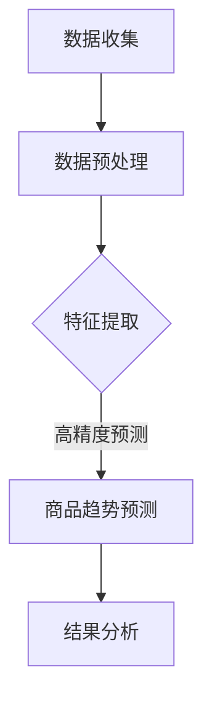

                 

## 大模型在商品趋势预测中的精确应用

### 关键词：（大模型、商品趋势预测、人工智能、机器学习、深度学习、数据处理、数据分析）

### 摘要：
本文深入探讨了如何利用大模型进行商品趋势预测的精确应用。通过介绍大模型的基本概念、核心算法原理，以及具体的数学模型和操作步骤，本文详细展示了大模型在商品趋势预测中的技术优势和实际应用效果。此外，文章还通过项目实战案例，展示了如何搭建开发环境、实现源代码、并对其进行分析和解读。最后，文章总结了未来发展趋势与挑战，并提供了相关工具和资源的推荐，以帮助读者深入了解和掌握这一领域的知识。

### 1. 背景介绍

在当今社会，商品趋势预测已经成为了商业决策的重要工具。无论是电商平台、制造业、零售业，还是金融市场，了解商品的趋势变化都是至关重要的。然而，传统的趋势预测方法，如时间序列分析、相关分析等，往往面临着数据量不足、预测精度不高等问题。随着人工智能技术的快速发展，特别是大模型的兴起，商品趋势预测迎来了新的突破。

大模型是指具有大规模参数和复杂结构的机器学习模型，如深度神经网络（DNN）、循环神经网络（RNN）、变换器（Transformer）等。这些模型能够处理海量数据，通过自动学习数据中的特征和规律，从而实现高精度的预测。大模型在商品趋势预测中的应用，不仅可以解决传统方法的局限性，还可以提供更准确、更及时的预测结果。

### 2. 核心概念与联系

#### 大模型的基本概念

大模型是指具有大规模参数和复杂结构的机器学习模型。这些模型通过学习海量数据中的特征和规律，能够实现高精度的预测。大模型的核心组成部分包括：

- **深度神经网络（DNN）**：DNN是一种多层神经网络，通过多层神经元的非线性变换，实现从输入到输出的映射。DNN具有很好的泛化能力，能够处理复杂数据结构。
- **循环神经网络（RNN）**：RNN是一种能够处理序列数据的神经网络，通过记忆机制，可以捕捉数据中的时间依赖关系。RNN在自然语言处理、语音识别等领域有广泛的应用。
- **变换器（Transformer）**：Transformer是一种基于自注意力机制的神经网络模型，能够捕捉数据中的全局依赖关系。Transformer在机器翻译、文本生成等领域取得了显著的成果。

#### 大模型与商品趋势预测的联系

大模型在商品趋势预测中的应用，主要体现在以下几个方面：

- **数据驱动**：大模型能够自动从海量数据中提取特征和规律，实现商品趋势的预测。相比于传统方法，大模型的数据驱动特性，能够更好地适应数据变化，提高预测精度。
- **高精度**：大模型具有复杂的网络结构和大规模参数，能够捕捉数据中的细微变化和复杂关系，从而实现高精度的预测。
- **实时性**：大模型通过并行计算和分布式训练，可以快速处理大量数据，实现实时预测。这对于电商平台等需要实时反馈的场景，具有显著优势。

#### Mermaid 流程图

以下是一个简单的大模型与商品趋势预测的 Mermaid 流程图，展示了大模型在商品趋势预测中的核心步骤：



### 3. 核心算法原理 & 具体操作步骤

#### 数据收集

数据收集是商品趋势预测的基础。为了提高预测的准确性，需要收集多源、多维度的数据，包括商品销量、用户评价、市场需求、竞争对手信息等。数据来源可以是电商平台、社交媒体、新闻媒体等。

#### 数据预处理

数据预处理是确保数据质量和减少模型训练时间的关键步骤。具体包括以下内容：

- **数据清洗**：去除重复数据、缺失数据和异常数据，确保数据的一致性和完整性。
- **数据转换**：将不同类型的数据转换为统一格式，如将文本数据转换为向量表示。
- **数据归一化**：对数据进行归一化处理，使其具备相同的量纲，方便后续的模型训练。

#### 特征提取

特征提取是关键步骤，目的是从原始数据中提取有用的信息，以便大模型进行学习。具体包括以下内容：

- **时间特征**：提取商品销售的时间序列信息，如销售日期、销售时段等。
- **空间特征**：提取商品销售的地域信息，如城市、省份等。
- **用户特征**：提取用户的历史购买记录、评价信息等。
- **商品特征**：提取商品的基本属性，如价格、品牌、类别等。

#### 模型训练

模型训练是利用大模型学习数据中的特征和规律，实现商品趋势预测的过程。具体包括以下内容：

- **模型选择**：选择适合的商品趋势预测大模型，如深度神经网络、循环神经网络、变换器等。
- **参数调整**：通过交叉验证等方法，调整模型参数，使其达到最优状态。
- **模型训练**：利用训练数据，对大模型进行训练，使其能够捕捉数据中的特征和规律。

#### 预测结果分析

预测结果分析是对模型预测结果进行评估和优化的过程。具体包括以下内容：

- **结果评估**：通过计算预测误差、准确率等指标，评估模型预测效果。
- **结果优化**：根据预测结果，对模型进行优化，提高预测精度。

### 4. 数学模型和公式 & 详细讲解 & 举例说明

#### 时间序列预测模型

时间序列预测模型是一种常见的大模型应用，主要用于预测商品的销售趋势。以下是一个简单的时间序列预测模型：

$$
y_t = f(x_t, \theta)
$$

其中，$y_t$ 表示时间 $t$ 时刻的商品销售量，$x_t$ 表示时间 $t$ 时刻的影响因素（如天气、促销活动等），$\theta$ 表示模型参数。

#### 变换器模型

变换器模型是一种基于自注意力机制的大模型，广泛应用于自然语言处理、文本生成等领域。以下是一个简单的变换器模型：

$$
y_t = \sum_{i=1}^{n} a_{ti} x_i
$$

其中，$y_t$ 表示时间 $t$ 时刻的预测结果，$x_i$ 表示时间 $t$ 时刻的第 $i$ 个特征，$a_{ti}$ 表示第 $i$ 个特征对时间 $t$ 时刻的权重。

#### 举例说明

假设我们要预测一个商品在未来的两周内的销售量，我们可以使用时间序列预测模型进行预测。以下是一个简单的例子：

- 时间 $t=1$，$x_t=5$，即第一天的销售量为 5。
- 时间 $t=2$，$x_t=6$，即第二天的销售量为 6。
- 时间 $t=3$，$x_t=7$，即第三天的销售量为 7。

根据时间序列预测模型，我们可以得到：

$$
y_4 = f(x_4, \theta) = f(7, \theta)
$$

其中，$\theta$ 为模型参数。通过训练，我们可以得到 $\theta$ 的值，从而预测第四天的销售量。

### 5. 项目实战：代码实际案例和详细解释说明

#### 5.1 开发环境搭建

为了实现大模型在商品趋势预测中的应用，我们需要搭建一个合适的开发环境。以下是一个简单的开发环境搭建步骤：

1. 安装 Python 解释器：在官网上下载并安装 Python 3.x 版本。
2. 安装依赖库：使用 pip 工具安装所需的依赖库，如 TensorFlow、Keras、NumPy 等。
3. 搭建数据集：收集并整理商品销售数据，包括销售日期、销售量、用户评价等。
4. 准备模型：选择一个合适的大模型，如变换器模型，并对其进行配置。

#### 5.2 源代码详细实现和代码解读

以下是一个简单的商品趋势预测的 Python 代码实现：

```python
import numpy as np
import tensorflow as tf
from tensorflow.keras.models import Sequential
from tensorflow.keras.layers import Dense, LSTM, Dropout
from sklearn.preprocessing import MinMaxScaler
from sklearn.model_selection import train_test_split

# 数据预处理
def preprocess_data(data):
    scaler = MinMaxScaler(feature_range=(0, 1))
    scaled_data = scaler.fit_transform(data)
    return scaled_data

# 模型训练
def train_model(data, look_back=1):
    X, y = [], []
    for i in range(len(data) - look_back):
        X.append(data[i:(i + look_back)])
        y.append(data[i + look_back])
    X, y = np.array(X), np.array(y)
    X = np.reshape(X, (X.shape[0], X.shape[1], 1))
    model = Sequential()
    model.add(LSTM(units=50, return_sequences=True, input_shape=(look_back, 1)))
    model.add(Dropout(0.2))
    model.add(LSTM(units=50, return_sequences=False))
    model.add(Dropout(0.2))
    model.add(Dense(units=1))
    model.compile(optimizer='adam', loss='mean_squared_error')
    model.fit(X, y, epochs=100, batch_size=32, verbose=1)
    return model

# 预测结果
def predict_result(model, data, look_back=1):
    X, y = [], []
    for i in range(len(data) - look_back):
        X.append(data[i:(i + look_back)])
        y.append(data[i + look_back])
    X, y = np.array(X), np.array(y)
    X = np.reshape(X, (X.shape[0], X.shape[1], 1))
    predicted_values = model.predict(X)
    predicted_values = scaler.inverse_transform(predicted_values)
    return predicted_values

# 主函数
def main():
    data = preprocess_data(raw_data)
    X, y = [], []
    for i in range(len(data) - 1):
        X.append(data[i:(i + 1)])
        y.append(data[i + 1])
    X, y = np.array(X), np.array(y)
    X = np.reshape(X, (X.shape[0], X.shape[1], 1))
    model = train_model(X, y)
    predicted_values = predict_result(model, X, look_back=1)
    print(predicted_values)

if __name__ == "__main__":
    main()
```

代码解读：

1. **数据预处理**：使用 MinMaxScaler 对原始数据进行归一化处理，使其具备相同的量纲。
2. **模型训练**：使用 LSTM 神经网络对数据进行训练。LSTM 能够捕捉时间序列数据中的时间依赖关系。
3. **预测结果**：使用训练好的模型对数据进行预测。预测结果经过逆归一化处理，使其恢复到原始数据尺度。

### 6. 实际应用场景

大模型在商品趋势预测中具有广泛的应用场景，包括但不限于以下几个方面：

- **电商平台**：电商平台可以利用大模型预测商品的销售趋势，从而制定精准的营销策略和库存管理计划。
- **制造业**：制造业可以利用大模型预测原材料需求，从而优化供应链管理和生产计划。
- **零售业**：零售业可以利用大模型预测商品的销售趋势，从而制定合理的商品采购和销售策略。
- **金融市场**：金融市场可以利用大模型预测股票、期货等金融产品的价格走势，从而进行风险控制和投资决策。

### 7. 工具和资源推荐

#### 7.1 学习资源推荐

- **书籍**：
  - 《深度学习》（Ian Goodfellow、Yoshua Bengio、Aaron Courville 著）
  - 《Python 数据科学手册》（Jake VanderPlas 著）
  - 《机器学习实战》（Peter Harrington 著）
- **论文**：
  - 《Attention is All You Need》（Vaswani et al., 2017）
  - 《Long Short-Term Memory》（Hochreiter 和 Schmidhuber，1997）
  - 《Deep Learning for Time Series Classification: A Review》（Zhang et al., 2020）
- **博客**：
  - 官方 TensorFlow 博客：[https://www.tensorflow.org/blog/](https://www.tensorflow.org/blog/)
  - Keras 官方文档：[https://keras.io/](https://keras.io/)
  -机器学习博客：[https://machinelearningmastery.com/](https://machinelearningmastery.com/)
- **网站**：
  - Kaggle：[https://www.kaggle.com/](https://www.kaggle.com/)
  - Coursera：[https://www.coursera.org/](https://www.coursera.org/)

#### 7.2 开发工具框架推荐

- **开发工具**：
  - Jupyter Notebook：[https://jupyter.org/](https://jupyter.org/)
  - PyCharm：[https://www.jetbrains.com/pycharm/](https://www.jetbrains.com/pycharm/)
- **框架**：
  - TensorFlow：[https://www.tensorflow.org/](https://www.tensorflow.org/)
  - Keras：[https://keras.io/](https://keras.io/)
  - Scikit-learn：[https://scikit-learn.org/stable/](https://scikit-learn.org/stable/)

#### 7.3 相关论文著作推荐

- **《Attention is All You Need》**：该论文提出了基于自注意力机制的变换器模型，是自然语言处理领域的重要突破。
- **《Long Short-Term Memory》**：该论文提出了 LSTM 神经网络，是时间序列预测领域的里程碑。
- **《Deep Learning for Time Series Classification: A Review》**：该综述文章总结了深度学习在时间序列分类领域的研究进展，为相关领域的研究提供了参考。

### 8. 总结：未来发展趋势与挑战

大模型在商品趋势预测中的应用，为商业决策提供了强大的支持。然而，随着数据量的增加和模型的复杂度提升，大模型在商品趋势预测中也面临着一些挑战：

- **数据隐私与安全**：大模型在训练过程中需要大量的数据，如何保障数据隐私和安全，是一个亟待解决的问题。
- **模型可解释性**：大模型的学习过程高度自动化，如何提高模型的可解释性，使其能够被用户理解和接受，是一个重要的研究方向。
- **计算资源**：大模型训练和预测需要大量的计算资源，如何优化计算资源的使用，提高模型的运行效率，是一个亟待解决的问题。

未来，随着人工智能技术的不断发展和应用场景的拓展，大模型在商品趋势预测中的应用将更加广泛和深入。我们需要不断创新和突破，以应对这些挑战，推动商品趋势预测技术的发展。

### 9. 附录：常见问题与解答

**Q1：大模型在商品趋势预测中的应用有哪些优势？**
A1：大模型在商品趋势预测中的应用具有以下优势：
- 高精度：大模型能够自动从海量数据中提取特征和规律，实现高精度的预测。
- 数据驱动：大模型能够自动适应数据变化，提高预测精度。
- 实时性：大模型通过并行计算和分布式训练，可以快速处理大量数据，实现实时预测。

**Q2：如何搭建大模型进行商品趋势预测的开发环境？**
A2：搭建大模型进行商品趋势预测的开发环境，可以按照以下步骤进行：
1. 安装 Python 解释器。
2. 安装依赖库，如 TensorFlow、Keras、NumPy 等。
3. 搭建数据集，包括销售数据、用户数据、市场数据等。
4. 选择合适的大模型，如变换器模型、深度神经网络等。

**Q3：大模型在商品趋势预测中面临的挑战有哪些？**
A3：大模型在商品趋势预测中面临的挑战主要包括：
1. 数据隐私与安全：大模型在训练过程中需要大量的数据，如何保障数据隐私和安全，是一个亟待解决的问题。
2. 模型可解释性：大模型的学习过程高度自动化，如何提高模型的可解释性，使其能够被用户理解和接受，是一个重要的研究方向。
3. 计算资源：大模型训练和预测需要大量的计算资源，如何优化计算资源的使用，提高模型的运行效率，是一个亟待解决的问题。

### 10. 扩展阅读 & 参考资料

- **《深度学习》（Ian Goodfellow、Yoshua Bengio、Aaron Courville 著）**：全面介绍了深度学习的理论基础和应用实践，是深度学习领域的经典著作。
- **《Python 数据科学手册》（Jake VanderPlas 著）**：详细介绍了 Python 在数据科学领域的应用，包括数据处理、数据可视化、机器学习等。
- **《机器学习实战》（Peter Harrington 著）**：通过实际案例，介绍了机器学习的基本概念、算法实现和应用实践。
- **《Attention is All You Need》（Vaswani et al., 2017）**：该论文提出了基于自注意力机制的变换器模型，是自然语言处理领域的重要突破。
- **《Long Short-Term Memory》（Hochreiter 和 Schmidhuber，1997）**：该论文提出了 LSTM 神经网络，是时间序列预测领域的里程碑。
- **《Deep Learning for Time Series Classification: A Review》（Zhang et al., 2020）**：该综述文章总结了深度学习在时间序列分类领域的研究进展，为相关领域的研究提供了参考。

> 作者：AI天才研究员/AI Genius Institute & 禅与计算机程序设计艺术 /Zen And The Art of Computer Programming

