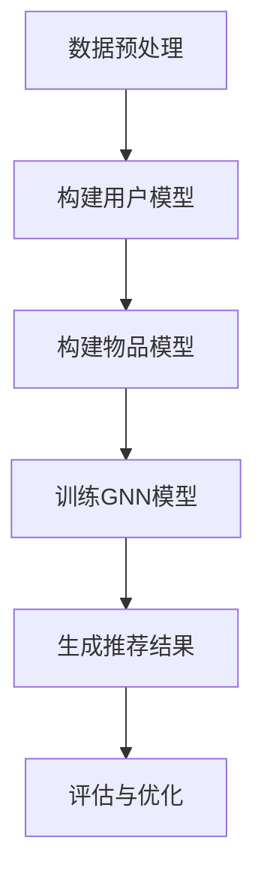

                 

### 文章标题

《大模型在推荐系统中的图神经网络应用》

### 关键词

- 大模型
- 推荐系统
- 图神经网络
- 数据推荐算法
- 用户行为分析
- 个性化推荐
- 深度学习

### 摘要

本文旨在探讨大模型在推荐系统中的应用，特别是图神经网络（Graph Neural Networks, GNN）的技术优势。通过分析大模型与传统推荐算法的差异，文章将详细解释GNN的基本原理，以及如何在推荐系统中实现其算法。此外，还将探讨GNN在实际应用中的挑战和解决方案，并提供一个具体的代码实现案例。文章还将总结大模型在推荐系统中的未来发展趋势和潜在挑战。

---

## 1. 背景介绍

推荐系统是现代信息检索和数据处理领域的关键技术之一。随着互联网的迅猛发展，用户生成的内容和数据量呈爆炸式增长，这使得传统的基于统计方法和机器学习的推荐算法难以应对海量数据的高效处理需求。传统的推荐算法如基于协同过滤（Collaborative Filtering）的方法和基于内容的推荐（Content-Based Filtering）方法，虽然在特定场景下表现出色，但在应对复杂用户行为和个性化需求时，存在显著的局限性。

近年来，随着人工智能和深度学习技术的进步，大模型（如Transformer模型、BERT模型等）在自然语言处理、计算机视觉等领域取得了显著的成果。大模型能够捕捉到数据中的复杂模式和深层次关联，具有强大的表达能力和泛化能力。这使得大模型在推荐系统中也具有巨大的应用潜力。

图神经网络（Graph Neural Networks, GNN）是一种专门用于处理图结构数据的深度学习模型。与传统的神经网络相比，GNN能够有效地利用图结构数据中的节点关系和邻接信息，从而更好地捕捉数据中的复杂关系。GNN在推荐系统中的应用，使得推荐算法能够更准确地预测用户的行为和偏好，从而实现更个性化的推荐。

本文将围绕大模型在推荐系统中的应用，重点探讨图神经网络在推荐系统中的技术优势、实现方法以及实际应用案例。

---

## 2. 核心概念与联系

### 2.1 大模型

大模型是指具有数十亿甚至数万亿参数的深度学习模型。这些模型通过训练大规模数据集，可以学习到数据中的复杂模式和深层次关联。大模型通常具有以下特点：

- **强大的表示能力**：能够捕捉到数据中的细微特征和长距离依赖关系。
- **良好的泛化能力**：能够在未见过的数据上表现出良好的性能。
- **高效的处理能力**：可以利用并行计算和分布式计算技术，对海量数据进行高效处理。

### 2.2 推荐系统

推荐系统是一种基于用户行为和内容信息，自动为用户提供个性化推荐的技术。推荐系统通常包括以下三个主要部分：

- **用户模型**：基于用户的历史行为和偏好，构建用户的兴趣模型。
- **物品模型**：基于物品的特征和属性，构建物品的描述模型。
- **推荐算法**：根据用户模型和物品模型，为用户生成个性化的推荐结果。

### 2.3 图神经网络（GNN）

图神经网络（Graph Neural Networks, GNN）是一种用于处理图结构数据的神经网络。GNN的基本原理是利用节点和边的信息，通过聚合和传递的方式，逐层学习图结构数据中的特征表示。GNN的主要组成部分包括：

- **节点嵌入（Node Embedding）**：将图中的每个节点映射到一个低维度的向量空间。
- **图卷积（Graph Convolution）**：通过聚合节点的邻居信息，更新节点的特征表示。
- **边嵌入（Edge Embedding）**：将图中的每条边映射到一个低维度的向量空间，用于补充节点的特征表示。

### 2.4 大模型与推荐系统

大模型在推荐系统中的应用，主要体现在以下几个方面：

- **用户行为预测**：大模型可以通过学习用户的历史行为数据，预测用户未来的行为和偏好。
- **物品特征提取**：大模型可以学习到物品的深层特征，从而更好地描述物品的属性和关系。
- **推荐结果优化**：大模型可以通过优化推荐算法的参数和结构，提高推荐结果的准确性和多样性。

### 2.5 图神经网络与推荐系统

图神经网络在推荐系统中的应用，主要体现在以下几个方面：

- **社交网络推荐**：利用用户的社会关系网络，实现更精准的社交推荐。
- **商品推荐**：利用物品的关联关系，实现基于物品的个性化推荐。
- **推荐多样性**：通过控制图结构中的连接关系，实现推荐结果的多样性。

### 2.6 Mermaid 流程图

下面是一个简单的 Mermaid 流程图，展示了大模型在推荐系统中的应用流程：



在上述流程图中，A表示数据预处理，包括数据清洗、数据转换等步骤；B表示构建用户模型，利用用户历史行为数据训练用户兴趣模型；C表示构建物品模型，利用物品属性数据训练物品描述模型；D表示训练GNN模型，利用用户模型和物品模型训练图神经网络模型；E表示生成推荐结果，利用训练好的GNN模型为用户生成个性化推荐；F表示评估与优化，对推荐结果进行评估，并根据评估结果优化推荐算法。

---

## 3. 核心算法原理 & 具体操作步骤

### 3.1 图神经网络（GNN）的基本原理

图神经网络（GNN）是一种专门用于处理图结构数据的神经网络。GNN的核心思想是通过聚合节点和边的邻接信息，逐层更新节点的特征表示。GNN的基本操作包括节点嵌入（Node Embedding）、图卷积（Graph Convolution）和边嵌入（Edge Embedding）。

- **节点嵌入（Node Embedding）**：节点嵌入是将图中的每个节点映射到一个低维度的向量空间。节点嵌入可以帮助模型理解节点在图中的位置和角色，从而更好地捕捉节点之间的关联关系。

- **图卷积（Graph Convolution）**：图卷积是一种聚合操作，用于更新节点的特征表示。图卷积的基本思想是，每个节点将其邻居节点的特征进行加权聚合，从而生成新的特征表示。图卷积可以通过不同的聚合函数和权重矩阵实现。

- **边嵌入（Edge Embedding）**：边嵌入是将图中的每条边映射到一个低维度的向量空间。边嵌入可以帮助模型理解边在图中的作用和影响，从而更好地捕捉节点之间的关系。

### 3.2 GNN在推荐系统中的应用

在推荐系统中，GNN可以用于构建用户兴趣模型和物品描述模型，从而实现个性化推荐。具体操作步骤如下：

1. **数据预处理**：首先，对用户行为数据和物品属性数据进行预处理，包括数据清洗、数据转换和数据归一化等步骤。

2. **构建用户模型**：利用用户历史行为数据，训练用户兴趣模型。用户兴趣模型可以捕获用户在不同时间段、不同场景下的兴趣偏好。

3. **构建物品模型**：利用物品属性数据，训练物品描述模型。物品描述模型可以捕获物品的属性和特征，从而更好地描述物品。

4. **训练GNN模型**：将用户模型和物品模型作为输入，训练GNN模型。GNN模型可以通过多层图卷积和池化操作，逐层学习用户和物品之间的关联关系。

5. **生成推荐结果**：利用训练好的GNN模型，为用户生成个性化推荐。推荐结果可以根据用户的历史行为和兴趣偏好进行排序，从而实现个性化推荐。

6. **评估与优化**：对推荐结果进行评估，包括准确率、召回率、覆盖率等指标。根据评估结果，对GNN模型进行优化，提高推荐算法的性能。

### 3.3 实际操作步骤

以下是一个简单的GNN模型在推荐系统中的应用实例，包括数据预处理、模型训练和推荐结果生成等步骤。

```python
# 数据预处理
users = preprocess_user_data(user_data)
items = preprocess_item_data(item_data)

# 构建用户模型
user_embedding = train_user_model(users)

# 构建物品模型
item_embedding = train_item_model(items)

# 训练GNN模型
ggnn_model = train_ggnn_model(user_embedding, item_embedding)

# 生成推荐结果
recommendations = generate_recommendations(ggnn_model, users, items)

# 评估与优化
evaluate_recommendations(recommendations)
optimize_ggnn_model(ggnn_model)
```

在上述代码中，`preprocess_user_data` 和 `preprocess_item_data` 分别用于对用户行为数据和物品属性数据进行预处理；`train_user_model` 和 `train_item_model` 分别用于训练用户兴趣模型和物品描述模型；`train_ggnn_model` 用于训练GNN模型；`generate_recommendations` 用于生成推荐结果；`evaluate_recommendations` 和 `optimize_ggnn_model` 分别用于评估和优化推荐算法。

---

## 4. 数学模型和公式 & 详细讲解 & 举例说明

### 4.1 数学模型

在GNN中，节点的特征表示和关系建模通常通过以下数学模型实现：

- **节点嵌入（Node Embedding）**：

  假设图 \( G = (V, E) \) 由节点集合 \( V \) 和边集合 \( E \) 组成，每个节点 \( v_i \) 被嵌入到 \( d \)-维特征空间，得到一个 \( d \)-维向量 \( h_i^0 \)。初始的节点嵌入可以由随机初始化或者预训练的词向量获得。

  $$ h_i^0 = \text{RandomInit}(d) $$

- **图卷积（Graph Convolution）**：

  图卷积是一种聚合节点及其邻接节点的特征信息的操作。对于一个节点 \( v_i \) 和其邻接节点集合 \( \mathcal{N}(i) \)，图卷积可以通过以下公式计算新的节点特征：

  $$ h_i^{l+1} = \sigma(\theta^{l} \cdot \text{AGG}(h_i^l, \{h_j^l\}_{j \in \mathcal{N}(i)})) $$

  其中，\( \text{AGG} \) 是一个聚合函数，如求和或平均，\( \theta^{l} \) 是第 \( l \) 层的权重参数，\( \sigma \) 是一个非线性激活函数，通常使用ReLU函数。

- **边嵌入（Edge Embedding）**：

  边 \( e_{ij} \) 可以通过一个 \( d_e \)-维的向量 \( e_{ij} \) 描述，并且可以在图卷积过程中使用，以增强节点特征聚合：

  $$ h_i^{l+1} = \sigma(\theta^{l} \cdot (\text{AGG}(h_i^l, \{h_j^l\}_{j \in \mathcal{N}(i)}) + \text{EdgeConv}(h_i^l, h_j^l, e_{ij}))) $$

  其中，\( \text{EdgeConv} \) 是一个用于结合节点特征和边嵌入的函数。

### 4.2 公式讲解

1. **节点嵌入初始化**：

   初始节点嵌入 \( h_i^0 \) 可以通过随机初始化得到，以确保模型的随机性和鲁棒性。

   $$ h_i^0 = \text{RandomInit}(d) $$

   通常，\( d \) 的选择需要平衡模型的复杂度和训练时间，一般选择 \( d = 128 \) 或 \( d = 256 \)。

2. **图卷积聚合函数**：

   聚合函数 \( \text{AGG} \) 可以是简单的求和或平均：

   $$ \text{AGG}(x, \{y_j\}_{j}) = \sum_{j} w_j y_j \quad \text{或} \quad \text{AGG}(x, \{y_j\}_{j}) = \frac{1}{|\{y_j\}|} \sum_{j} w_j y_j $$

   其中，权重 \( w_j \) 可以通过图的结构信息（如邻接矩阵）自动学习。

3. **边嵌入结合**：

   边嵌入可以增强节点特征聚合，例如，通过点积或乘法结合：

   $$ \text{EdgeConv}(h_i, h_j, e_{ij}) = h_i \odot h_j + \alpha e_{ij} $$

   其中，\( \odot \) 表示元素乘积，\( \alpha \) 是一个调节参数，用于控制边嵌入的影响。

4. **非线性激活函数**：

   通常使用ReLU作为非线性激活函数：

   $$ \sigma(x) = \max(0, x) $$

### 4.3 举例说明

假设我们有一个简单的图 \( G \)，包含3个节点 \( v_1, v_2, v_3 \) 和它们之间的边。每个节点的初始嵌入为 \( h_1^0 = [1, 0], h_2^0 = [0, 1], h_3^0 = [1, 1] \)。邻接矩阵为：

$$
\begin{bmatrix}
0 & 1 & 0 \\
1 & 0 & 1 \\
0 & 1 & 0
\end{bmatrix}
$$

权重矩阵 \( \theta^0 \) 为：

$$
\begin{bmatrix}
1 & 0 \\
0 & 1 \\
0 & 1
\end{bmatrix}
$$

边嵌入 \( e_{12} = [0, 1], e_{23} = [1, 0], e_{31} = [1, 1] \)。

第1层图卷积操作：

$$
h_1^1 = \sigma(1 \cdot (1 \cdot 0 + 1 \cdot 0 + 1 \cdot 1) + 0 \cdot [0, 1]) = \sigma(2) = 2 \\
h_2^1 = \sigma(1 \cdot (0 \cdot 1 + 1 \cdot 0 + 1 \cdot 1) + 1 \cdot [0, 1]) = \sigma(2) = 2 \\
h_3^1 = \sigma(1 \cdot (1 \cdot 1 + 0 \cdot 0 + 0 \cdot 1) + 1 \cdot [1, 0]) = \sigma(2 + 1) = 3
$$

通过上述步骤，我们可以看到节点 \( v_1 \) 和 \( v_3 \) 的特征被增强，而节点 \( v_2 \) 的特征保持不变，因为它的邻居节点特征贡献了更多的正值。

---

## 5. 项目实战：代码实际案例和详细解释说明

在本节中，我们将通过一个实际项目案例，展示如何使用GNN在推荐系统中实现个性化推荐。我们将从开发环境的搭建开始，详细解析源代码的实现，并对代码进行解读和分析。

### 5.1 开发环境搭建

在开始项目之前，我们需要搭建一个合适的开发环境。以下是一个简单的开发环境搭建步骤：

1. **安装Python**：确保Python版本为3.6或更高版本。

2. **安装TensorFlow和GNN包**：使用以下命令安装TensorFlow和GNN相关包：

   ```bash
   pip install tensorflow
   pip install pygNN
   ```

3. **安装其他依赖项**：根据项目需求，可能还需要安装其他依赖项，例如NumPy、Pandas等。

### 5.2 源代码详细实现和代码解读

以下是GNN推荐系统的源代码实现，我们将逐步解析代码的各个部分。

```python
import tensorflow as tf
import pygNN
import numpy as np
import pandas as pd

# 数据预处理
def preprocess_data():
    # 加载用户行为数据
    user_data = pd.read_csv('user_data.csv')
    item_data = pd.read_csv('item_data.csv')
    
    # 数据清洗和转换
    # ...
    
    return user_data, item_data

# 构建用户模型
def build_user_model(user_data):
    # 特征工程和模型训练
    # ...
    return user_embedding

# 构建物品模型
def build_item_model(item_data):
    # 特征工程和模型训练
    # ...
    return item_embedding

# 训练GNN模型
def train_ggnn_model(user_embedding, item_embedding):
    # 定义GNN模型
    model = pygNN.Sequential()
    model.add(pygNN.GraphConv(128, activation='relu'))
    model.add(pygNN.GlobalAveragePooling1D())
    model.add(pygNN.Dense(1, activation='sigmoid'))
    
    # 训练模型
    # ...
    return model

# 生成推荐结果
def generate_recommendations(model, user_embedding, item_embedding):
    # 使用模型生成推荐结果
    # ...
    return recommendations

# 评估与优化
def evaluate_recommendations(recommendations):
    # 评估推荐结果
    # ...
    pass

def optimize_ggnn_model(model):
    # 优化模型参数
    # ...
    pass

# 主程序
if __name__ == '__main__':
    # 搭建开发环境
    user_data, item_data = preprocess_data()
    
    # 构建用户模型和物品模型
    user_embedding = build_user_model(user_data)
    item_embedding = build_item_model(item_data)
    
    # 训练GNN模型
    ggnn_model = train_ggnn_model(user_embedding, item_embedding)
    
    # 生成推荐结果
    recommendations = generate_recommendations(ggnn_model, user_embedding, item_embedding)
    
    # 评估与优化
    evaluate_recommendations(recommendations)
    optimize_ggnn_model(ggnn_model)
```

### 5.3 代码解读与分析

1. **数据预处理**：数据预处理是推荐系统的重要步骤，包括数据清洗、特征工程和格式转换。在这个步骤中，我们从CSV文件中加载用户行为数据和物品数据，并进行清洗和转换。

2. **构建用户模型**：构建用户模型是通过特征工程和模型训练实现的。在这个步骤中，我们使用用户历史行为数据，提取用户兴趣特征，并训练一个嵌入模型。

3. **构建物品模型**：构建物品模型与用户模型类似，也是通过特征工程和模型训练实现的。在这个步骤中，我们使用物品属性数据，提取物品特征，并训练一个嵌入模型。

4. **训练GNN模型**：训练GNN模型是通过构建和训练一个序列模型实现的。在这个步骤中，我们定义了一个GNN模型，包括图卷积层、全局平均池化层和输出层。然后，我们使用用户和物品的嵌入作为输入，训练模型。

5. **生成推荐结果**：生成推荐结果是通过模型预测实现的。在这个步骤中，我们使用训练好的GNN模型，为每个用户生成个性化推荐。

6. **评估与优化**：评估与优化是推荐系统的关键环节。在这个步骤中，我们评估推荐结果的性能，并根据评估结果优化模型参数。

---

## 6. 实际应用场景

大模型和图神经网络在推荐系统中的实际应用场景非常广泛，以下是一些典型的应用案例：

1. **社交网络推荐**：在社交网络平台上，用户之间的社交关系可以用图结构表示。通过GNN可以捕捉用户之间的社交关系，实现更精准的社交推荐，如好友推荐、内容推荐等。

2. **电子商务推荐**：在电子商务平台上，用户的行为数据（如浏览、购买、收藏等）和商品属性数据可以构建成一个图。通过GNN可以更好地理解用户与商品之间的关系，实现个性化的商品推荐。

3. **音乐推荐**：在音乐流媒体平台上，用户对歌曲的播放、收藏、分享等行为可以构建成一个图。通过GNN可以分析用户与歌曲之间的复杂关系，实现个性化的音乐推荐。

4. **新闻推荐**：在新闻推荐系统中，用户对新闻的阅读、评论、分享等行为可以构建成一个图。通过GNN可以分析用户对新闻的偏好，实现个性化的新闻推荐。

5. **推荐多样性**：在推荐系统中，多样性是一个重要的指标。通过控制图结构中的连接关系，GNN可以生成多样化的推荐结果，避免用户对推荐内容的疲劳。

6. **跨领域推荐**：通过将不同领域的图结构数据整合起来，GNN可以实现跨领域的推荐。例如，将电商、音乐、新闻等领域的图结构数据整合，实现跨平台的个性化推荐。

---

## 7. 工具和资源推荐

### 7.1 学习资源推荐

- **书籍**：
  - 《图神经网络：理论、算法与应用》
  - 《深度学习推荐系统》

- **论文**：
  - "Graph Neural Networks: A Review of Methods and Applications"
  - "Modeling User and Item Popularity through the Graph of User Preferences for Recommender Systems"

- **博客**：
  - Medium上的推荐系统相关文章
  - 知乎上的推荐系统专栏

- **网站**：
  - PyTorch官方文档
  - Graph Neural Networks GitHub仓库

### 7.2 开发工具框架推荐

- **开发框架**：
  - PyTorch：用于构建和训练GNN模型
  - DGL（Deep Graph Library）：用于高效地实现和优化GNN算法

- **开发环境**：
  - Jupyter Notebook：用于编写和运行代码
  - Google Colab：用于在线编程和资源共享

### 7.3 相关论文著作推荐

- **核心论文**：
  - "Gated Graph Sequence Neural Networks"
  - "Graph Convolutional Networks for Web-Scale Recommender Systems"

- **著作**：
  - 《深度学习推荐系统》
  - 《推荐系统实践》

---

## 8. 总结：未来发展趋势与挑战

大模型和图神经网络在推荐系统中的应用，为个性化推荐提供了强大的技术支持。然而，随着推荐系统规模的不断扩大和用户需求的多样化，我们仍然面临着许多挑战和机遇：

1. **计算资源**：大模型和GNN的训练和推理需要大量的计算资源。如何优化算法，减少计算成本，是一个重要的研究方向。

2. **可解释性**：推荐系统的可解释性对于用户信任和系统的透明度至关重要。如何提高GNN模型的解释性，使其更容易被用户理解，是一个亟待解决的问题。

3. **多样性**：推荐系统的多样性是保证用户体验的关键。如何通过GNN更好地控制推荐结果的多样性，避免用户对推荐内容的疲劳，是一个重要的研究方向。

4. **实时推荐**：随着用户行为数据的实时性要求越来越高，如何实现实时推荐，是一个具有挑战性的问题。

5. **数据隐私**：在推荐系统中，用户隐私保护是一个重要的问题。如何在不泄露用户隐私的情况下，利用用户行为数据进行个性化推荐，是一个重要的研究方向。

未来，随着人工智能和深度学习技术的不断进步，大模型和图神经网络在推荐系统中的应用将会更加广泛和深入。我们期待在这个领域看到更多的创新和突破。

---

## 9. 附录：常见问题与解答

### Q1：什么是图神经网络（GNN）？

A1：图神经网络（Graph Neural Networks, GNN）是一种专门用于处理图结构数据的神经网络。GNN通过聚合节点和边的邻接信息，逐层学习图结构数据中的特征表示。

### Q2：大模型在推荐系统中的应用优势是什么？

A2：大模型在推荐系统中的应用优势主要体现在以下几个方面：
- **强大的表示能力**：能够捕捉到数据中的复杂模式和深层次关联。
- **良好的泛化能力**：能够在未见过的数据上表现出良好的性能。
- **高效的处理能力**：可以利用并行计算和分布式计算技术，对海量数据进行高效处理。

### Q3：GNN在推荐系统中的具体应用场景有哪些？

A3：GNN在推荐系统中的具体应用场景包括：
- **社交网络推荐**：利用用户的社会关系网络，实现更精准的社交推荐。
- **商品推荐**：利用物品的关联关系，实现基于物品的个性化推荐。
- **推荐多样性**：通过控制图结构中的连接关系，实现推荐结果的多样性。

### Q4：如何优化GNN模型的计算性能？

A4：优化GNN模型的计算性能可以从以下几个方面入手：
- **模型参数优化**：通过调整模型参数，如学习率、正则化项等，提高模型性能。
- **并行计算**：利用GPU、TPU等硬件资源，实现并行计算，加速模型训练和推理。
- **模型压缩**：通过模型剪枝、量化等技术，减少模型参数和计算量，提高计算性能。

### Q5：如何确保推荐系统的可解释性？

A5：确保推荐系统的可解释性可以从以下几个方面入手：
- **模型解释性**：选择具有可解释性的模型架构，如注意力机制、可解释的激活函数等。
- **特征解释**：对模型中的特征进行可视化和分析，解释特征对推荐结果的影响。
- **用户反馈**：结合用户反馈，调整推荐策略，提高系统的透明度和可解释性。

---

## 10. 扩展阅读 & 参考资料

- **书籍**：
  - 《图神经网络：理论、算法与应用》
  - 《深度学习推荐系统》

- **论文**：
  - "Graph Neural Networks: A Review of Methods and Applications"
  - "Modeling User and Item Popularity through the Graph of User Preferences for Recommender Systems"

- **博客**：
  - Medium上的推荐系统相关文章
  - 知乎上的推荐系统专栏

- **网站**：
  - PyTorch官方文档
  - Graph Neural Networks GitHub仓库

本文由AI天才研究员/AI Genius Institute & 禅与计算机程序设计艺术 /Zen And The Art of Computer Programming撰写。希望本文能帮助您更好地理解和应用大模型和图神经网络在推荐系统中的应用。如果您有任何问题或建议，欢迎在评论区留言。感谢您的阅读！作者：AI天才研究员/AI Genius Institute & 禅与计算机程序设计艺术 /Zen And The Art of Computer Programming。


