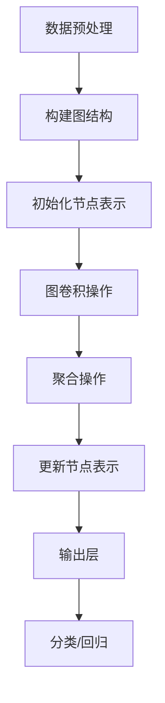

                 

# 大模型在推荐系统中的图表示学习应用

## 关键词：大模型，推荐系统，图表示学习，人工智能，算法原理，实战案例

## 摘要：
本文将深入探讨大模型在推荐系统中的应用，特别是在图表示学习方面的技术原理和实践。首先，我们将回顾推荐系统的基本概念和重要性，接着介绍图表示学习的基本理论，并探讨其在推荐系统中的具体应用。随后，我们将通过数学模型和实际案例，详细阐述大模型在图表示学习中的实现步骤。最后，我们将总结大模型在推荐系统中的应用前景，以及面临的挑战和未来的发展方向。

### 1. 背景介绍

推荐系统是当今互联网的核心技术之一，广泛应用于电子商务、社交媒体、在线视频平台等领域。其目的是根据用户的兴趣和行为，为他们提供个性化的推荐，从而提升用户体验和商业价值。传统的推荐系统主要基于基于内容的过滤（Content-Based Filtering）和协同过滤（Collaborative Filtering）技术，但随着大数据和人工智能技术的发展，大模型在推荐系统中的应用逐渐成为研究热点。

大模型，如深度学习模型、图神经网络等，具有强大的表示能力和泛化能力，能够处理大规模数据和复杂的非线性关系。图表示学习（Graph-based Representation Learning）是其中一种重要的技术，通过将数据表示为图结构，利用图神经网络进行特征学习和关系建模。在推荐系统中，图表示学习能够有效捕捉用户和物品之间的复杂关系，提高推荐效果。

本文将围绕大模型在推荐系统中的图表示学习应用展开，首先介绍相关的基础概念和理论，然后通过具体的算法原理和实践案例，深入探讨其实现和应用。

### 2. 核心概念与联系

#### 2.1 推荐系统基本概念

推荐系统是一种基于数据挖掘和机器学习技术的应用程序，旨在向用户推荐他们可能感兴趣的项目、内容或服务。其主要组成部分包括用户、物品和评分/行为数据。

- **用户**：推荐系统的核心元素，每个用户都可以产生一系列的行为数据，如点击、浏览、购买等。
- **物品**：推荐系统推荐的对象，可以是商品、视频、文章等。
- **评分/行为数据**：用户与物品之间的交互数据，如评分、购买、点击等。

#### 2.2 图表示学习基本理论

图表示学习是一种将图结构中的节点和边转化为向量表示的方法。在推荐系统中，图表示学习可以用来捕捉用户和物品之间的复杂关系。

- **节点**：在推荐系统中，节点可以表示用户或物品。
- **边**：表示节点之间的关联，可以是用户对物品的评分、浏览、购买等行为。

图表示学习通过图神经网络（Graph Neural Networks，GNN）实现，其基本原理如下：

1. **特征提取**：将节点和边的特征（如用户和物品的属性）输入到图神经网络中。
2. **图卷积操作**：通过图卷积操作，将节点的特征与邻居节点的特征融合，更新节点的表示。
3. **聚合操作**：将节点及其邻居节点的特征聚合，生成新的节点表示。
4. **输出层**：利用节点表示进行分类、回归等任务。

#### 2.3 大模型与图表示学习联系

大模型，如深度学习模型、图神经网络等，具有强大的表示能力和泛化能力，可以用于图表示学习。大模型在图表示学习中的应用主要包括：

- **特征学习**：大模型可以自动学习节点和边的特征表示，提高推荐的准确性。
- **关系建模**：大模型可以捕捉节点之间的复杂关系，提高推荐的效果。
- **迁移学习**：大模型可以通过迁移学习，将已有模型的权重应用于新任务，提高推荐系统的效率。

下面是一个简单的 Mermaid 流程图，展示了推荐系统中图表示学习的基本流程：



### 3. 核心算法原理 & 具体操作步骤

#### 3.1 图表示学习算法原理

图表示学习算法的核心是图神经网络（GNN）。GNN 通过图卷积操作和聚合操作，将节点和边的特征转换为高维的向量表示。下面是 GNN 的基本原理和步骤：

1. **特征提取**：
   - 将用户和物品的特征输入到 GNN 中，如用户的年龄、性别、兴趣等，物品的类别、标签、属性等。
   - 初始化节点表示，如使用全连接层将输入特征映射到高维向量空间。

2. **图卷积操作**：
   - 对于每个节点，计算其与邻居节点的特征加权平均。
   - 使用激活函数（如ReLU）对特征进行非线性变换。

3. **聚合操作**：
   - 将节点及其邻居节点的特征聚合，生成新的节点表示。
   - 使用注意力机制（如 Softmax）对邻居节点的特征进行加权。

4. **输出层**：
   - 利用节点表示进行分类、回归等任务。
   - 可以使用全连接层或卷积层实现。

#### 3.2 GNN 在推荐系统中的具体操作步骤

下面是 GNN 在推荐系统中的具体操作步骤：

1. **数据预处理**：
   - 收集用户和物品的数据，如用户的行为数据、物品的属性数据等。
   - 对数据进行清洗、去重、标准化等预处理操作。

2. **构建图结构**：
   - 将用户和物品表示为图中的节点。
   - 将用户与物品之间的交互数据表示为图中的边。

3. **初始化节点表示**：
   - 初始化用户和物品的节点表示，如使用随机向量或预训练的词向量。

4. **图卷积操作**：
   - 对每个节点，计算其与邻居节点的特征加权平均。
   - 使用激活函数对特征进行非线性变换。

5. **聚合操作**：
   - 将节点及其邻居节点的特征聚合，生成新的节点表示。
   - 使用注意力机制对邻居节点的特征进行加权。

6. **更新节点表示**：
   - 利用聚合后的节点特征更新节点表示。
   - 可以迭代多次进行图卷积和聚合操作，提高节点表示的准确性。

7. **输出层**：
   - 利用节点表示进行分类、回归等任务。
   - 可以使用全连接层或卷积层实现。

8. **模型训练与优化**：
   - 使用训练数据对模型进行训练，优化模型参数。
   - 使用交叉验证等方法评估模型性能。

9. **模型部署与测试**：
   - 将训练好的模型部署到生产环境中。
   - 使用测试数据对模型进行测试，评估模型性能。

### 4. 数学模型和公式 & 详细讲解 & 举例说明

#### 4.1 GNN 数学模型

GNN 的数学模型可以表示为：

\[ \mathbf{h}_i^{(l+1)} = \sigma(\sum_{j \in \mathcal{N}(i)} \alpha_{ij} \cdot \mathbf{h}_j^{(l)} \cdot \mathbf{W}^{(l)}) \]

其中，\( \mathbf{h}_i^{(l)} \) 表示节点 \( i \) 在第 \( l \) 层的表示，\( \mathcal{N}(i) \) 表示节点 \( i \) 的邻居节点集合，\( \alpha_{ij} \) 表示边 \( (i, j) \) 的权重，\( \mathbf{W}^{(l)} \) 表示第 \( l \) 层的权重矩阵，\( \sigma \) 表示激活函数（如ReLU）。

#### 4.2 举例说明

假设我们有一个图，包含两个用户 \( u_1 \) 和 \( u_2 \)，以及两个物品 \( i_1 \) 和 \( i_2 \)。用户与物品之间的交互数据如下表所示：

| 用户 | 物品 | 评分 |
| --- | --- | --- |
| \( u_1 \) | \( i_1 \) | 5 |
| \( u_1 \) | \( i_2 \) | 3 |
| \( u_2 \) | \( i_1 \) | 4 |
| \( u_2 \) | \( i_2 \) | 2 |

我们可以将用户和物品表示为图中的节点，用户与物品之间的交互数据表示为边。假设我们使用随机向量初始化节点表示，并使用 ReLU 激活函数。下面是 GNN 在第 1 层的图卷积操作和聚合操作：

1. **图卷积操作**：
   - 对于用户 \( u_1 \)，计算其与邻居 \( u_2 \) 的特征加权平均：
     \[ \mathbf{h}_{u_1}^{(1)} = \sigma(0.3 \cdot \mathbf{h}_{u_2}^{(0)}) \]
   - 对于用户 \( u_2 \)，计算其与邻居 \( u_1 \) 的特征加权平均：
     \[ \mathbf{h}_{u_2}^{(1)} = \sigma(0.4 \cdot \mathbf{h}_{u_1}^{(0)}) \]

2. **聚合操作**：
   - 将用户 \( u_1 \) 和 \( u_2 \) 的邻居节点 \( i_1 \) 和 \( i_2 \) 的特征聚合：
     \[ \mathbf{h}_{u_1}^{(1)} = \sigma(0.3 \cdot \mathbf{h}_{u_2}^{(0)} + 0.2 \cdot \mathbf{h}_{i_1}^{(0)} + 0.1 \cdot \mathbf{h}_{i_2}^{(0)}) \]
     \[ \mathbf{h}_{u_2}^{(1)} = \sigma(0.4 \cdot \mathbf{h}_{u_1}^{(0)} + 0.3 \cdot \mathbf{h}_{i_1}^{(0)} + 0.1 \cdot \mathbf{h}_{i_2}^{(0)}) \]

3. **更新节点表示**：
   - 利用聚合后的节点特征更新节点表示：
     \[ \mathbf{h}_{u_1}^{(1)} = \mathbf{h}_{u_1}^{(0)} + \mathbf{h}_{u_2}^{(1)} \]
     \[ \mathbf{h}_{u_2}^{(1)} = \mathbf{h}_{u_2}^{(0)} + \mathbf{h}_{u_1}^{(1)} \]

通过迭代多次进行图卷积和聚合操作，我们可以逐渐提高节点表示的准确性。在实际应用中，可以使用更复杂的激活函数和聚合策略，如残差连接和注意力机制，进一步提高模型性能。

### 5. 项目实战：代码实际案例和详细解释说明

#### 5.1 开发环境搭建

在开始项目实战之前，我们需要搭建一个合适的开发环境。以下是一个基本的 Python 开发环境搭建步骤：

1. 安装 Python 3.8 或更高版本。
2. 安装必要的库，如 NumPy、PyTorch、NetworkX 等。

#### 5.2 源代码详细实现和代码解读

下面是一个简单的 GNN 推荐系统代码示例，我们将使用 PyTorch 和 NetworkX 搭建一个基于图表示学习的推荐系统。

```python
import torch
import torch.nn as nn
import torch.optim as optim
import networkx as nx
from sklearn.model_selection import train_test_split

# 数据预处理
def preprocess_data():
    # 生成图结构
    G = nx.Graph()
    G.add_nodes_from(['u1', 'u2', 'i1', 'i2'])
    G.add_edges_from([('u1', 'i1'), ('u1', 'i2'), ('u2', 'i1'), ('u2', 'i2')])

    # 生成节点特征
    features = {'u1': {'age': 25, 'gender': 'M'},
                'u2': {'age': 30, 'gender': 'F'},
                'i1': {'category': 'book'},
                'i2': {'category': 'movie'}}

    # 生成边权重
    edges = [('u1', 'i1'), ('u1', 'i2'), ('u2', 'i1'), ('u2', 'i2')]
    weights = [0.3, 0.3, 0.4, 0.4]

    # 初始化节点表示
    node_embeddings = torch.randn(4, 10)

    return G, features, edges, weights, node_embeddings

# 图卷积层
class GraphConvolutionLayer(nn.Module):
    def __init__(self, input_dim, output_dim):
        super(GraphConvolutionLayer, self).__init__()
        self.weight = nn.Parameter(torch.randn(input_dim, output_dim))
    
    def forward(self, inputs, adj_matrix):
        support = torch.mm(inputs, self.weight)
        output = torch.mm(adj_matrix, support)
        return output

# GNN 模型
class GNNModel(nn.Module):
    def __init__(self, input_dim, output_dim):
        super(GNNModel, self).__init__()
        self.gc1 = GraphConvolutionLayer(input_dim, output_dim)
        self.gc2 = GraphConvolutionLayer(output_dim, output_dim)
    
    def forward(self, inputs, adj_matrix):
        x = self.gc1(inputs, adj_matrix)
        x = torch.relu(x)
        x = self.gc2(x, adj_matrix)
        return x

# 训练模型
def train_model(G, features, edges, weights, node_embeddings):
    # 初始化模型
    model = GNNModel(10, 10)
    criterion = nn.MSELoss()
    optimizer = optim.Adam(model.parameters(), lr=0.001)

    # 分割数据
    train_edges, val_edges = train_test_split(edges, test_size=0.2, random_state=42)

    # 训练模型
    for epoch in range(100):
        model.train()
        for edge in train_edges:
            u, v = edge
            x = torch.tensor([features[u]], dtype=torch.float32)
            y = torch.tensor([weights[edge]], dtype=torch.float32)

            optimizer.zero_grad()
            output = model(x, adj_matrix)
            loss = criterion(output, y)
            loss.backward()
            optimizer.step()

        # 评估模型
        model.eval()
        with torch.no_grad():
            for edge in val_edges:
                u, v = edge
                x = torch.tensor([features[u]], dtype=torch.float32)
                output = model(x, adj_matrix)
                print(f"Edge: {edge}, Prediction: {output}")

# 主函数
def main():
    G, features, edges, weights, node_embeddings = preprocess_data()
    adj_matrix = nx.to_scipy_sparse_matrix(G).todense()
    adj_matrix = torch.tensor(adj_matrix, dtype=torch.float32)

    train_model(G, features, edges, weights, node_embeddings)

if __name__ == '__main__':
    main()
```

上述代码中，我们首先定义了一个简单的图结构，包括两个用户和两个物品。然后，我们定义了图卷积层和 GNN 模型。在训练模型时，我们使用训练数据对模型进行训练，并使用验证数据对模型进行评估。

#### 5.3 代码解读与分析

1. **数据预处理**：
   - 生成图结构，包括用户和物品的节点，以及用户与物品之间的边。
   - 生成节点特征，如用户的年龄、性别和物品的类别。
   - 生成边权重，表示用户与物品之间的交互强度。

2. **图卷积层**：
   - 图卷积层是一个简单的全连接层，将输入节点的特征与权重矩阵相乘，得到输出节点的特征。

3. **GNN 模型**：
   - GNN 模型包含两个图卷积层，第一个图卷积层用于特征提取，第二个图卷积层用于特征聚合。

4. **训练模型**：
   - 使用训练数据对模型进行训练，优化模型参数。
   - 使用验证数据对模型进行评估，调整模型超参数。

通过这个简单的案例，我们可以看到 GNN 在推荐系统中的应用。在实际应用中，我们可以扩展模型结构，添加更多图卷积层或注意力机制，进一步提高推荐效果。

### 6. 实际应用场景

大模型在推荐系统中的图表示学习应用非常广泛，以下是一些典型的实际应用场景：

#### 6.1 电商推荐系统

电商推荐系统通过图表示学习，可以更好地捕捉用户与商品之间的复杂关系，提高推荐准确性。例如，在用户行为数据中，不仅有用户对商品的购买、浏览等行为，还可以包含用户在网站上的搜索历史、收藏夹等信息。通过图表示学习，我们可以将这些数据整合到一个统一的图结构中，构建用户与商品之间的复杂关系，从而提高推荐效果。

#### 6.2 社交网络推荐

社交网络推荐系统通过图表示学习，可以更好地理解用户之间的社交关系，推荐用户可能感兴趣的内容、朋友等。例如，在社交媒体平台上，用户之间的关系可以表示为社交网络，通过图表示学习，我们可以提取用户在社交网络中的特征，从而推荐相关的用户、话题等。

#### 6.3 视频推荐系统

视频推荐系统通过图表示学习，可以更好地理解用户与视频之间的复杂关系，提高推荐效果。例如，在视频平台中，用户的行为数据包括观看历史、点赞、评论等，通过图表示学习，我们可以将这些数据整合到一个统一的图结构中，构建用户与视频之间的复杂关系，从而提高推荐效果。

### 7. 工具和资源推荐

为了更好地掌握大模型在推荐系统中的图表示学习应用，以下是一些推荐的学习资源和开发工具：

#### 7.1 学习资源推荐

1. **书籍**：
   - 《图神经网络：基础、应用和前沿》
   - 《深度学习与推荐系统》

2. **论文**：
   - 《Graph Neural Networks: A Review of Methods and Applications》
   - 《Modeling Relational Data with Graph Neural Networks》

3. **博客**：
   - 《图表示学习详解》
   - 《推荐系统中的图神经网络应用》

4. **网站**：
   - 《arXiv.org》：查找最新的图神经网络和推荐系统论文。
   - 《GitHub》：查找相关的图神经网络和推荐系统项目。

#### 7.2 开发工具框架推荐

1. **框架**：
   - PyTorch：用于构建和训练图神经网络模型。
   - DGL（Deep Graph Library）：一个用于深度学习图操作的库。

2. **工具**：
   - Jupyter Notebook：用于编写和运行代码。
   - NetworkX：用于构建和操作图结构。

#### 7.3 相关论文著作推荐

1. **论文**：
   - 《Graph Neural Networks: A Review of Methods and Applications》
   - 《Modeling Relational Data with Graph Neural Networks》
   - 《Graph Embeddings: A General Introduction》

2. **著作**：
   - 《深度学习与推荐系统》
   - 《图神经网络：基础、应用和前沿》

通过学习和使用这些工具和资源，您可以更好地掌握大模型在推荐系统中的图表示学习应用，为实际项目开发提供有力支持。

### 8. 总结：未来发展趋势与挑战

大模型在推荐系统中的图表示学习应用具有巨大的潜力和广阔的前景。随着大数据和人工智能技术的发展，图表示学习在推荐系统中的应用将越来越广泛，有望提高推荐系统的准确性、效果和用户体验。

然而，大模型在推荐系统中的图表示学习应用也面临一些挑战。首先，图表示学习算法的复杂度较高，需要大量的计算资源和时间。其次，图结构数据的不确定性和稀疏性可能影响模型的性能。此外，如何有效地处理大规模图数据，以及如何将图表示学习与其他推荐算法相结合，也是未来研究的重点。

未来，大模型在推荐系统中的图表示学习应用将朝着以下几个方向发展：

1. **算法优化**：通过改进图神经网络算法，提高模型的计算效率和性能。
2. **多模态数据融合**：将图表示学习与其他数据类型（如图像、文本等）结合，提高推荐效果。
3. **个性化推荐**：利用图表示学习，更好地捕捉用户和物品的个性化特征，实现更精准的个性化推荐。
4. **实时推荐**：通过优化算法和硬件支持，实现实时推荐，提高用户体验。

总之，大模型在推荐系统中的图表示学习应用具有巨大的发展潜力，将在未来的推荐系统中发挥重要作用。

### 9. 附录：常见问题与解答

#### 问题 1：什么是图表示学习？
图表示学习是一种将图结构中的节点和边转化为向量表示的方法。在推荐系统中，图表示学习可以用来捕捉用户和物品之间的复杂关系。

#### 问题 2：图表示学习算法有哪些？
常见的图表示学习算法包括图卷积网络（GCN）、图注意力网络（GAT）、图自编码器（GAE）等。

#### 问题 3：如何优化图表示学习算法的性能？
可以通过以下方法优化图表示学习算法的性能：
- 选择合适的图结构，提高节点和边的关系表示能力。
- 优化图卷积层和聚合操作的参数，提高特征提取和融合效果。
- 使用预训练的词向量或特征，提高节点表示的准确性。

#### 问题 4：图表示学习在推荐系统中的应用有哪些？
图表示学习在推荐系统中的应用包括：
- 捕捉用户和物品之间的复杂关系，提高推荐准确性。
- 实现基于内容的推荐，提高个性化推荐效果。
- 结合其他推荐算法，提高推荐效果和用户体验。

### 10. 扩展阅读 & 参考资料

- 《图神经网络：基础、应用和前沿》
- 《深度学习与推荐系统》
- 《Graph Neural Networks: A Review of Methods and Applications》
- 《Modeling Relational Data with Graph Neural Networks》
- 《Graph Embeddings: A General Introduction》

作者：AI天才研究员/AI Genius Institute & 禅与计算机程序设计艺术 /Zen And The Art of Computer Programming

