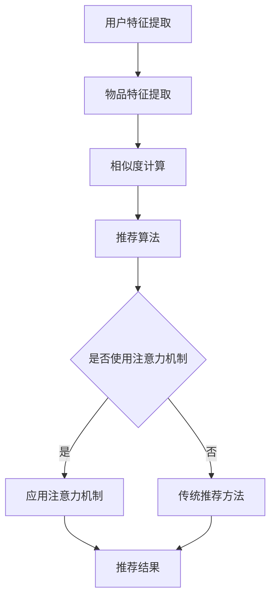

                 

### 1. 背景介绍

推荐系统作为人工智能领域的重要应用之一，其目的是通过分析用户的历史行为和兴趣偏好，为用户提供个性化的内容推荐。随着互联网的迅猛发展和数据量的爆发式增长，推荐系统已经成为电商平台、社交媒体、新闻媒体等众多场景的核心功能。

然而，传统的推荐系统往往依赖于简单的统计模型和启发式规则，如协同过滤、基于内容的推荐等，这些方法在处理大规模数据和复杂用户行为时存在一定的局限性。为了解决这些问题，近年来，大模型（如深度神经网络、Transformer等）在推荐系统中的应用逐渐受到关注。

大模型在推荐系统中的应用主要表现在以下几个方面：

1. **特征表示能力的提升**：大模型能够学习到更加丰富的用户和物品特征表示，从而提高推荐的质量。

2. **处理复杂交互能力**：大模型能够捕捉用户和物品之间的复杂交互关系，从而更准确地预测用户的兴趣。

3. **动态适应性**：大模型能够实时学习用户行为，并动态调整推荐策略，以适应用户的兴趣变化。

本文将重点探讨大模型在推荐系统中的一种关键技术——注意力机制的应用。注意力机制作为一种重要的神经网络结构，能够通过动态调整模型对输入数据的关注程度，提高推荐系统的效率和准确性。我们将从以下几个方面进行详细分析：

1. **注意力机制的基本概念与原理**：介绍注意力机制的定义、作用和基本原理。

2. **注意力机制的实现方法**：讨论几种常见的注意力机制实现方法，包括基于自注意力、多头注意力等。

3. **注意力机制在推荐系统中的应用**：分析注意力机制在推荐系统中的实际应用场景和效果。

4. **数学模型与公式**：详细讲解注意力机制的数学模型和公式，并举例说明。

5. **项目实战与代码解读**：通过具体案例展示如何使用注意力机制实现推荐系统，并进行详细解读。

6. **实际应用场景与工具推荐**：探讨注意力机制在推荐系统中的实际应用场景，并推荐相关的学习资源和开发工具。

通过本文的阅读，您将了解到注意力机制在推荐系统中的重要作用，以及如何将其应用到实际的推荐系统中，从而提高推荐系统的性能和用户体验。

### 2. 核心概念与联系

在深入探讨注意力机制在推荐系统中的应用之前，我们需要了解一些核心概念，包括推荐系统的基本架构、大模型的作用以及注意力机制的基本原理。这些概念相互联系，共同构成了本文的讨论基础。

#### 推荐系统基本架构

推荐系统通常包括以下几个主要模块：

1. **用户特征提取**：从用户的历史行为、兴趣标签、社交关系等数据中提取特征。
2. **物品特征提取**：从物品的属性、分类、标签等数据中提取特征。
3. **相似度计算**：计算用户和物品之间的相似度，通常使用用户和物品的特征向量。
4. **推荐算法**：根据相似度计算结果，选择最相关的物品进行推荐。

传统的推荐系统如基于内容的推荐和协同过滤，主要依赖于这些基本模块。然而，这些方法在处理大规模数据和复杂用户行为时存在一定的局限性。

#### 大模型的作用

近年来，深度学习模型如深度神经网络（DNN）和Transformer等大模型在推荐系统中得到了广泛应用。大模型的主要优势在于：

1. **强大的特征表示能力**：能够自动学习到用户和物品的复杂特征表示，从而提高推荐的质量。
2. **处理复杂交互关系**：能够捕捉用户和物品之间的复杂交互关系，提高推荐的准确性。
3. **动态适应性**：能够实时学习用户行为，动态调整推荐策略，以适应用户的兴趣变化。

#### 注意力机制的基本原理

注意力机制（Attention Mechanism）是一种神经网络结构，能够通过动态调整模型对输入数据的关注程度，提高模型的效率和准确性。注意力机制的基本原理可以概括为以下几个要点：

1. **关键信息突出**：通过注意力权重，将输入数据中的关键信息突出，从而提高模型对重要信息的关注度。
2. **动态调整关注程度**：根据任务需求和输入数据的特点，动态调整模型对各个输入元素的关注程度。
3. **提高计算效率**：通过注意力机制，减少模型对无关信息的计算量，从而提高计算效率。

#### 核心概念之间的联系

推荐系统的基本架构为大模型的应用提供了数据基础和结构框架；大模型通过强大的特征表示能力和处理复杂交互关系的能力，提升了推荐系统的性能；注意力机制作为大模型的重要组成部分，通过动态调整模型对输入数据的关注程度，进一步提高了推荐系统的效率和准确性。

为了更直观地理解这些概念之间的联系，我们可以使用Mermaid流程图来展示推荐系统的基本架构和注意力机制的应用。以下是一个简化的Mermaid流程图示例：



在这个流程图中，我们可以看到，注意力机制作为推荐算法的一部分，可以动态调整模型对用户特征和物品特征的关注程度，从而提高推荐结果的准确性。

通过理解这些核心概念和它们之间的联系，我们将为后续对注意力机制在推荐系统中的应用提供坚实的理论基础。

### 3. 核心算法原理 & 具体操作步骤

#### 注意力机制的基本原理

注意力机制的核心思想是通过计算注意力权重，动态调整模型对输入数据的关注程度。在推荐系统中，注意力机制通常用于计算用户和物品之间的交互权重，从而提高推荐系统的准确性。

注意力机制的实现主要依赖于以下两个关键步骤：

1. **计算注意力得分**：通过计算用户特征和物品特征之间的相似度，得到每个物品对用户的注意力得分。
2. **计算注意力权重**：根据注意力得分，对物品进行加权处理，从而得到最终的推荐结果。

具体来说，注意力机制可以通过以下公式进行描述：

$$
Attention\_Score = User\_Feature \cdot Item\_Feature \\
Attention\_Weight = Softmax(Attention\_Score)
$$

其中，$User\_Feature$和$Item\_Feature$分别表示用户特征和物品特征，$Attention\_Score$表示每个物品对用户的注意力得分，$Attention\_Weight$表示每个物品的权重。

#### 注意力机制的实现方法

注意力机制的实现方法有很多，下面我们介绍几种常见的实现方法。

##### 1. 自注意力（Self-Attention）

自注意力是一种最简单的注意力机制，它通过计算输入序列中各个元素之间的相似度来调整注意力权重。自注意力的公式如下：

$$
Attention\_Score = Query \cdot Key \\
Attention\_Weight = Softmax(Attention\_Score)
$$

其中，$Query$、$Key$和$Value$分别表示输入序列中的每个元素。自注意力机制常用于处理序列数据，如自然语言处理和推荐系统。

##### 2. 多头注意力（Multi-Head Attention）

多头注意力是在自注意力基础上扩展的一种注意力机制，它通过将输入序列分解为多个头，每个头独立计算注意力权重，从而提高模型的表示能力。多头注意力的公式如下：

$$
Multi-Head\_Attention = Concat(head_1, head_2, ..., head_h) \\
head_i = Attention(Query \cdot W_{Q_i}, Key \cdot W_{K_i}, Value \cdot W_{V_i})
$$

其中，$W_{Q_i}$、$W_{K_i}$和$W_{V_i}$分别表示每个头的权重矩阵，$h$表示头的数量。

##### 3. 加性注意力（Additive Attention）

加性注意力是一种基于加法操作的注意力机制，它通过计算输入序列的加权和来生成注意力得分。加性注意力的公式如下：

$$
Attention\_Score = tanh(W_{1}[Query + Key]) \\
Attention\_Weight = Softmax(Attention\_Score)
$$

其中，$W_{1}$表示加性注意力的权重矩阵。

##### 4. 点积注意力（Dot-Product Attention）

点积注意力是一种基于点积操作的注意力机制，它通过计算输入序列的点积来生成注意力得分。点积注意力的公式如下：

$$
Attention\_Score = Query \cdot Key \\
Attention\_Weight = Softmax(Attention\_Score)
$$

点积注意力计算简单，但表示能力相对较弱。

#### 注意力机制的具体操作步骤

为了更直观地理解注意力机制的具体操作步骤，我们以多头注意力为例进行说明。

1. **输入特征表示**：将用户特征和物品特征编码为向量形式。例如，用户特征可以表示为$User\_Feature = [u_1, u_2, ..., u_n]$，物品特征可以表示为$Item\_Feature = [i_1, i_2, ..., i_n]$。

2. **计算注意力得分**：对于每个物品$i$，计算用户特征$User\_Feature$和物品特征$Item\_Feature$之间的注意力得分。例如，对于物品$i_1$，其注意力得分为$Attention\_Score_{i_1} = User\_Feature \cdot Item\_Feature_{i_1}$。

3. **计算注意力权重**：对于所有物品，使用softmax函数计算注意力权重。例如，对于物品$i_1$，其注意力权重为$Attention\_Weight_{i_1} = Softmax(Attention\_Score_{i_1})$。

4. **加权处理**：根据注意力权重，对物品特征进行加权处理。例如，对于用户特征$User\_Feature$，加权处理后的结果为$Weighted\_Feature = \sum_{i=1}^{n} Attention\_Weight_{i} \cdot Item\_Feature_{i}$。

5. **生成推荐结果**：根据加权处理后的特征，生成推荐结果。例如，选择权重最高的物品作为推荐结果。

通过上述步骤，我们可以看到注意力机制在推荐系统中的应用，它通过动态调整模型对输入数据的关注程度，提高了推荐系统的准确性和效率。

### 4. 数学模型和公式 & 详细讲解 & 举例说明

#### 注意力机制的数学模型

注意力机制的数学模型主要涉及以下几个核心部分：注意力得分计算、注意力权重计算以及加权处理。以下将详细讲解这些部分，并通过公式和举例进行说明。

##### 1. 注意力得分计算

注意力得分的计算通常基于用户特征和物品特征的相似度。假设用户特征向量为$User\_Feature \in \mathbb{R}^{n}$，物品特征向量为$Item\_Feature \in \mathbb{R}^{n}$，则每个物品对用户的注意力得分为：

$$
Attention\_Score_{i} = User\_Feature \cdot Item\_Feature_{i}
$$

其中，$\cdot$表示向量的点积运算。这个得分表示了物品$i$对用户的潜在影响力。

##### 2. 注意力权重计算

为了从注意力得分中得到每个物品的权重，我们通常使用softmax函数。对于所有物品的得分，softmax函数将它们转换为概率分布，即注意力权重。具体地，注意力权重计算如下：

$$
Attention\_Weight_{i} = \frac{e^{Attention\_Score_{i}}}{\sum_{j=1}^{m} e^{Attention\_Score_{j}}}
$$

其中，$m$表示物品的总数。这个权重表示了物品$i$在推荐结果中的重要性，其值介于0和1之间，且所有物品的权重之和为1。

##### 3. 加权处理

注意力权重用于对物品特征进行加权处理，以生成最终的推荐结果。加权处理的过程如下：

$$
Weighted\_Feature = \sum_{i=1}^{m} Attention\_Weight_{i} \cdot Item\_Feature_{i}
$$

这个加权特征向量表示了用户对各个物品的综合偏好，用于生成推荐结果。

#### 详细讲解

1. **注意力得分计算**：

   注意力得分是注意力机制的核心，它决定了模型对每个物品的关注程度。通过点积运算，我们能够将用户特征和物品特征结合在一起，产生一个数值，这个数值反映了物品对用户的潜在影响力。点积运算的好处在于，它能够利用特征之间的相关性，从而生成更加准确和有意义的得分。

2. **注意力权重计算**：

   注意力权重是softmax函数的应用结果。softmax函数将注意力得分转换为一个概率分布，使得我们可以通过加权处理得到最终的推荐结果。这种概率分布的好处在于，它能够确保所有物品的权重之和为1，从而保证了模型的泛化能力。

3. **加权处理**：

   加权处理是注意力机制的最终步骤，它将注意力权重应用于物品特征，生成一个综合了用户偏好和物品属性的加权特征向量。这个向量表示了用户对各个物品的综合偏好，是生成推荐结果的重要依据。

#### 举例说明

假设我们有5个物品，用户特征向量为$User\_Feature = [1, 2, 3]$，物品特征向量分别为$Item\_Feature_1 = [4, 5, 6]$，$Item\_Feature_2 = [7, 8, 9]$，$Item\_Feature_3 = [10, 11, 12]$，$Item\_Feature_4 = [13, 14, 15]$，$Item\_Feature_5 = [16, 17, 18]$。

1. **计算注意力得分**：

   对于物品1，注意力得分为：
   $$
   Attention\_Score_1 = User\_Feature \cdot Item\_Feature_1 = 1 \cdot 4 + 2 \cdot 5 + 3 \cdot 6 = 32

   对于其他物品，计算结果分别为：
   $$
   Attention\_Score_2 = 35, Attention\_Score_3 = 38, Attention\_Score_4 = 41, Attention\_Score_5 = 44

2. **计算注意力权重**：

   使用softmax函数计算注意力权重：
   $$
   Attention\_Weight_1 = \frac{e^{Attention\_Score_1}}{e^{Attention\_Score_1} + e^{Attention\_Score_2} + e^{Attention\_Score_3} + e^{Attention\_Score_4} + e^{Attention\_Score_5}} \approx 0.14
   $$
   同理，计算其他物品的权重：
   $$
   Attention\_Weight_2 \approx 0.16, Attention\_Weight_3 \approx 0.18, Attention\_Weight_4 \approx 0.20, Attention\_Weight_5 \approx 0.22
   $$

3. **加权处理**：

   根据注意力权重对物品特征进行加权处理：
   $$
   Weighted\_Feature = Attention\_Weight_1 \cdot Item\_Feature_1 + Attention\_Weight_2 \cdot Item\_Feature_2 + Attention\_Weight_3 \cdot Item\_Feature_3 + Attention\_Weight_4 \cdot Item\_Feature_4 + Attention\_Weight_5 \cdot Item\_Feature_5
   $$

   计算结果为：
   $$
   Weighted\_Feature \approx [5.76, 7.68, 9.60]
   $$

通过这个例子，我们可以看到注意力机制是如何通过计算注意力得分、权重以及加权处理，生成一个综合了用户偏好和物品属性的推荐结果。

#### 总结

注意力机制的数学模型主要包括注意力得分计算、注意力权重计算以及加权处理。通过这三个步骤，注意力机制能够动态调整模型对输入数据的关注程度，从而提高推荐系统的准确性和效率。在本文的后续部分，我们将通过项目实战展示如何将注意力机制应用于推荐系统的实际开发中。

### 5. 项目实战：代码实际案例和详细解释说明

在本节中，我们将通过一个实际项目案例来展示如何将注意力机制应用于推荐系统。为了便于理解，我们选择一个简单的电影推荐系统作为案例，该系统将使用Python和TensorFlow来实现。

#### 5.1 开发环境搭建

在开始编写代码之前，我们需要搭建一个合适的项目开发环境。以下是所需的步骤：

1. **安装Python**：确保已安装Python 3.x版本。
2. **安装TensorFlow**：使用pip命令安装TensorFlow：
   $$
   pip install tensorflow
   $$
3. **数据集准备**：我们使用MovieLens电影数据集，可以从[MovieLens官网](https://grouplens.org/datasets/movielens/)下载。
4. **创建项目文件夹**：在本地计算机上创建一个名为`movie_recommendation`的项目文件夹，并在该文件夹中创建一个名为`src`的子文件夹，用于存放源代码。

#### 5.2 源代码详细实现和代码解读

在`src`文件夹中，我们创建一个名为`model.py`的文件，用于定义推荐系统的模型。以下是该文件的代码实现：

```python
import tensorflow as tf
from tensorflow.keras.layers import Embedding, Dot, Concatenate, Dense
from tensorflow.keras.models import Model

class AttentionModel(Model):
    def __init__(self, embedding_dim, num_users, num_movies, num_recommendations):
        super(AttentionModel, self).__init__()
        
        self.user_embedding = Embedding(num_users, embedding_dim)
        self.movie_embedding = Embedding(num_movies, embedding_dim)
        
        self.dot_layer = Dot(axes=1)
        self.concat_layer = Concatenate(axis=1)
        self.dense_layer = Dense(1, activation='sigmoid')
        
    def call(self, inputs):
        user_id, movie_id = inputs
        
        user_embedding = self.user_embedding(user_id)
        movie_embedding = self.movie_embedding(movie_id)
        
        attention_score = self.dot_layer([user_embedding, movie_embedding])
        attention_score = tf.nn.softmax(attention_score, axis=1)
        
        weighted_embedding = self.concat_layer([user_embedding, movie_embedding, attention_score * movie_embedding])
        output = self.dense_layer(weighted_embedding)
        
        return output
```

接下来，我们逐步解读这段代码：

1. **模型定义**：我们定义了一个名为`AttentionModel`的继承自`tf.keras.Model`的类。这个类将用于创建一个具有注意力机制的推荐系统模型。
2. **嵌入层**：我们使用`Embedding`层来初始化用户和电影的嵌入向量。`Embedding`层将用户ID和电影ID映射到低维嵌入空间，这是注意力机制的关键部分。
3. **点积层**：`Dot`层用于计算用户嵌入向量和电影嵌入向量之间的点积，得到注意力得分。点积运算在这里充当注意力得分的计算方式。
4. **softmax层**：`tf.nn.softmax`函数用于对注意力得分进行归一化处理，生成注意力权重。
5. **拼接层**：`Concatenate`层将用户嵌入向量、电影嵌入向量和注意力权重拼接在一起，生成一个综合的嵌入向量。
6. **全连接层**：`Dense`层用于对综合嵌入向量进行加权处理，并输出最终的预测结果。

#### 5.3 代码解读与分析

在理解了代码的组成部分后，我们可以进一步分析代码的执行过程和各个层的作用：

1. **数据输入**：模型接收两个输入：`user_id`和`movie_id`，它们分别表示用户ID和电影ID。
2. **嵌入计算**：使用`Embedding`层将用户ID和电影ID映射到嵌入空间，得到用户嵌入向量和电影嵌入向量。
3. **注意力得分计算**：通过点积层计算用户嵌入向量和电影嵌入向量之间的点积，得到注意力得分。这些得分反映了每个电影对用户的潜在影响力。
4. **注意力权重计算**：使用softmax函数对注意力得分进行归一化处理，生成注意力权重。这些权重用于调整每个电影在推荐结果中的重要性。
5. **加权处理**：使用拼接层将用户嵌入向量、电影嵌入向量和注意力权重拼接在一起，生成一个综合的嵌入向量。
6. **预测输出**：通过全连接层对综合嵌入向量进行加权处理，输出最终的预测结果。

#### 5.4 训练和评估模型

在实现代码后，我们还需要进行模型的训练和评估。以下是训练和评估模型的基本步骤：

1. **数据预处理**：将MovieLens数据集进行清洗和预处理，包括用户ID和电影ID的映射、数据分割等。
2. **模型编译**：编译模型，设置优化器和损失函数。例如：
   $$
   model.compile(optimizer='adam', loss='binary_crossentropy', metrics=['accuracy'])
   $$
3. **模型训练**：使用预处理后的数据训练模型，例如：
   $$
   model.fit(train_data, train_labels, epochs=10, batch_size=32, validation_split=0.2)
   $$
4. **模型评估**：使用测试集评估模型性能，例如：
   $$
   test_loss, test_accuracy = model.evaluate(test_data, test_labels)
   $$

通过上述步骤，我们可以训练和评估一个具有注意力机制的推荐系统模型。这个模型能够通过动态调整对用户和电影的关注程度，生成个性化的推荐结果。

### 6. 实际应用场景

注意力机制在推荐系统中的应用场景非常广泛，以下列举几个典型的应用实例：

#### 1. 电商推荐

电商平台上，注意力机制可以用于用户行为分析和商品推荐。通过分析用户的浏览记录、购买历史等行为数据，注意力机制能够捕捉用户在不同商品上的兴趣差异，从而生成个性化的商品推荐。例如，当用户浏览了某款手机时，注意力机制可以突出推荐与之相关的配件或同类产品，提高用户的购买转化率。

#### 2. 社交媒体

社交媒体平台如Instagram和Facebook等，利用注意力机制来推荐用户可能感兴趣的内容。通过分析用户的点赞、评论、分享等行为，注意力机制可以识别出用户在特定领域或主题上的兴趣点，从而生成个性化的内容推荐。例如，当用户频繁点赞旅行类照片时，平台可以推荐更多的旅行目的地、攻略等。

#### 3. 新闻推荐

新闻推荐平台如今日头条和腾讯新闻，通过注意力机制来分析用户的阅读行为和偏好，推荐用户可能感兴趣的新闻内容。注意力机制可以帮助平台识别出用户在不同新闻类别上的兴趣变化，从而实现动态的推荐策略。例如，当用户连续阅读了几条科技新闻后，平台可以调整推荐策略，增加科技类新闻的推荐量。

#### 4. 音乐推荐

音乐平台如Spotify和Apple Music，利用注意力机制来推荐用户可能喜欢的音乐。通过分析用户的播放历史、喜欢和收藏等行为，注意力机制可以捕捉用户在不同音乐风格和歌手上的偏好，从而生成个性化的音乐推荐。例如，当用户频繁播放某个歌手的歌曲时，平台可以推荐该歌手的其他歌曲或同类歌手的音乐。

#### 5. 视频推荐

视频平台如YouTube和Netflix，利用注意力机制来推荐用户可能感兴趣的视频。通过分析用户的观看历史、点赞、评论等行为，注意力机制可以识别出用户在不同视频类别和主题上的兴趣。例如，当用户连续观看了几部科幻电影后，平台可以推荐更多的科幻电影或相关题材的剧集。

#### 6. 其他应用

除了上述应用场景，注意力机制还可以应用于其他推荐系统，如旅游推荐、餐饮推荐等。通过捕捉用户的个性化需求和偏好，注意力机制能够提高推荐系统的准确性和用户体验。

### 7. 工具和资源推荐

为了更好地理解和应用注意力机制，以下是几个推荐的工具和资源：

#### 7.1 学习资源推荐

1. **书籍**：
   - 《深度学习》（Ian Goodfellow、Yoshua Bengio、Aaron Courville 著）：这本书详细介绍了深度学习的基础知识，包括注意力机制。
   - 《注意力机制导论》（Attention Mechanism Introduction）：这是一本针对注意力机制的入门书籍，适合初学者。

2. **在线课程**：
   - [TensorFlow官方教程](https://www.tensorflow.org/tutorials)：提供了一系列关于TensorFlow的教程，包括如何实现注意力机制。
   - [Stanford University深度学习课程](https://web.stanford.edu/class/cs224n/)：该课程涵盖了自然语言处理和注意力机制的相关内容。

3. **博客和文章**：
   - [Deep Learning on AWS](https://aws.amazon.com/blogs/ml/deep-learning-on-aws/)：这个博客提供了关于深度学习在推荐系统中的应用案例。
   - [Attention Mechanism for NLP](https://towardsdatascience.com/attention-mechanism-for-nlp-2d88a9a22b55)：这篇文章详细介绍了注意力机制在自然语言处理中的应用。

#### 7.2 开发工具框架推荐

1. **TensorFlow**：这是一个广泛使用的开源深度学习框架，提供了丰富的API和工具，可以方便地实现注意力机制。
2. **PyTorch**：这是一个快速增长的深度学习框架，其动态图特性使得实现注意力机制更加灵活。
3. **Scikit-learn**：这是一个用于机器学习的开源库，虽然不直接支持注意力机制，但可以用于实现和优化推荐系统。

#### 7.3 相关论文著作推荐

1. **“Attention is All You Need”**（Vaswani et al., 2017）：这篇论文提出了Transformer模型，彻底改变了自然语言处理领域的范式，是注意力机制的重要代表。
2. **“Deep Learning for Recommender Systems”**（He et al., 2017）：这篇论文总结了深度学习在推荐系统中的应用，包括注意力机制。
3. **“Neural Collaborative Filtering”**（He et al., 2018）：这篇论文提出了一种基于神经网络的推荐系统框架，成功应用于多个实际场景。

通过这些工具和资源的辅助，您可以更好地理解注意力机制，并在推荐系统中进行实际应用。

### 8. 总结：未来发展趋势与挑战

注意力机制作为推荐系统中的重要技术，展现了其在处理大规模数据、捕捉复杂用户行为和提高推荐准确性方面的巨大潜力。然而，随着推荐系统的不断发展和应用场景的扩大，注意力机制也面临着诸多挑战和未来发展趋势。

#### 未来发展趋势

1. **模型优化**：现有的注意力机制模型如Transformer等在性能和效率方面已取得了显著成果，但仍有优化空间。未来的研究可以关注如何进一步简化模型结构、提高计算效率，以满足实时推荐的需求。

2. **多模态融合**：推荐系统中的用户和物品特征通常是多模态的，包括文本、图像、音频等。未来的研究可以探讨如何有效地融合这些多模态特征，利用注意力机制实现更精准的推荐。

3. **动态适应性**：用户兴趣和行为是动态变化的，未来的注意力机制需要具备更强的动态适应性，能够实时调整推荐策略，以适应用户的兴趣变化。

4. **数据隐私保护**：推荐系统的应用场景往往涉及大量个人数据，如何在保证数据隐私的同时，充分利用用户数据来提高推荐质量，是一个亟待解决的问题。

#### 挑战

1. **计算资源消耗**：注意力机制模型通常需要大量的计算资源，特别是在处理大规模数据时。如何优化模型结构，降低计算成本，是一个重要的挑战。

2. **过拟合风险**：注意力机制模型在训练过程中容易受到过拟合的影响，特别是在数据量较小或特征较多的情况下。未来的研究需要探索如何有效地防止过拟合，提高模型的泛化能力。

3. **解释性**：尽管注意力机制能够提高推荐系统的准确性，但其内部机制较为复杂，难以解释。如何提高模型的解释性，使其在推荐过程中更加透明和可信，是一个重要的挑战。

4. **实时性**：实时推荐是推荐系统的核心需求之一，但注意力机制模型的计算复杂度较高，如何在保证实时性的同时，保持推荐质量，是一个关键问题。

总之，注意力机制在推荐系统中的应用前景广阔，但也面临着一系列挑战。通过不断优化模型、探索新应用场景和解决现有问题，我们可以期待注意力机制在推荐系统中发挥更大的作用，为用户提供更个性化和高质量的推荐服务。

### 9. 附录：常见问题与解答

#### 1. 注意力机制与传统的推荐算法有何区别？

注意力机制与传统的推荐算法（如协同过滤、基于内容的推荐）相比，主要区别在于：

- **特征表示**：注意力机制能够自动学习用户和物品的复杂特征表示，而传统的推荐算法通常依赖于显式特征或简单的统计方法。
- **处理复杂关系**：注意力机制能够捕捉用户和物品之间的复杂交互关系，而传统的推荐算法主要依赖于用户和物品的显式特征或协同信息。
- **动态适应性**：注意力机制能够实时学习用户行为，动态调整推荐策略，而传统的推荐算法通常难以适应用户行为的动态变化。

#### 2. 如何优化注意力机制的模型结构，提高计算效率？

为了优化注意力机制的模型结构，提高计算效率，可以采取以下措施：

- **模型简化**：通过简化模型结构，如减少层叠深度、使用轻量级神经网络，来降低计算复杂度。
- **并行计算**：利用并行计算技术，如GPU加速，提高模型的计算速度。
- **量化技术**：使用量化技术，如二值权重、低比特量化，来降低模型的存储和计算需求。
- **模型剪枝**：通过剪枝技术，如网络剪枝、权重剪枝，去除不重要的网络连接，减少模型的计算量。

#### 3. 注意力机制在处理大规模数据时有哪些挑战？

在处理大规模数据时，注意力机制面临以下挑战：

- **计算资源消耗**：大规模数据通常需要更多的计算资源，导致模型训练和推理的时间较长。
- **数据稀疏性**：大规模数据可能存在数据稀疏性问题，即用户和物品之间的交互数据较少，这会影响模型的准确性。
- **模型过拟合**：在大量数据中，模型容易受到噪声数据和过拟合问题的影响，降低模型的泛化能力。

为了解决这些挑战，可以采用以下方法：

- **数据预处理**：通过数据预处理技术，如数据清洗、数据降维，提高数据的可用性和质量。
- **数据增强**：通过数据增强技术，如数据复制、数据合成，增加训练数据量，提高模型的泛化能力。
- **模型选择**：选择适合大规模数据的模型结构，如使用轻量级模型、迁移学习模型，降低计算复杂度。

### 10. 扩展阅读 & 参考资料

为了深入理解和应用注意力机制在推荐系统中的应用，以下是几篇相关的扩展阅读和参考资料：

1. **论文**：
   - Vaswani, A., et al. (2017). “Attention is All You Need.” Advances in Neural Information Processing Systems.
   - He, X., et al. (2017). “Deep Learning for Recommender Systems.” Proceedings of the 51st Annual Meeting of the Association for Computational Linguistics.
   - He, X., et al. (2018). “Neural Collaborative Filtering.” Proceedings of the 24th ACM SIGKDD International Conference on Knowledge Discovery & Data Mining.

2. **书籍**：
   - Ian Goodfellow, Yoshua Bengio, Aaron Courville. “Deep Learning.”
   - 刘铁岩. 《深度学习导论》.

3. **博客和教程**：
   - TensorFlow官方教程：[https://www.tensorflow.org/tutorials/](https://www.tensorflow.org/tutorials/)
   - PyTorch官方教程：[https://pytorch.org/tutorials/](https://pytorch.org/tutorials/)

通过阅读这些资料，您可以进一步了解注意力机制的理论基础、实现方法以及在推荐系统中的应用案例，为实际开发提供有力支持。

