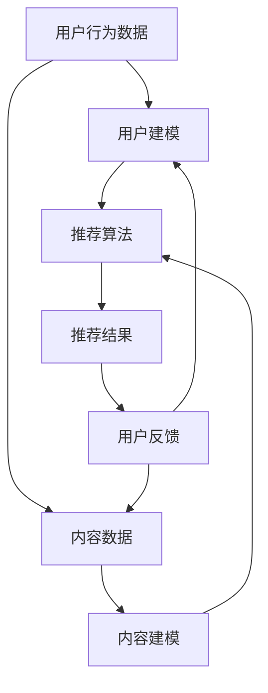

                 

# 大模型在推荐结果生成组合中的应用探索

## 关键词
- 大模型
- 推荐系统
- 结果生成
- 组合应用
- 深度学习
- 人工智能

## 摘要

本文探讨了如何将大模型应用于推荐结果生成组合中，以提高推荐系统的准确性和用户体验。首先介绍了大模型的基本概念和推荐系统的背景，然后深入分析了大模型在推荐结果生成中的关键作用。接着，本文详细阐述了如何构建基于大模型的推荐系统，并介绍了相关的算法原理和数学模型。随后，通过一个实际项目案例，展示了如何使用大模型生成高质量的推荐结果。最后，文章总结了当前大模型在推荐系统应用中的挑战和未来发展趋势。

## 1. 背景介绍

### 大模型的概念

大模型是指拥有大规模参数的深度学习模型，如大规模语言模型、图像生成模型等。这些模型通常通过海量数据训练，具有强大的表征能力和泛化能力。大模型的应用范围非常广泛，包括自然语言处理、计算机视觉、语音识别等多个领域。

### 推荐系统的背景

推荐系统是一种基于数据挖掘和机器学习技术，从大量信息中提取有用信息，向用户推荐感兴趣的内容或商品的系统。推荐系统广泛应用于电子商务、社交媒体、新闻资讯等领域，对提升用户体验和业务增长具有重要意义。

### 大模型在推荐系统中的应用

大模型在推荐系统中的应用主要包括以下几个方面：

1. **特征表示**：大模型可以学习到数据中的高维特征表示，这些特征有助于提高推荐系统的准确性。
2. **内容理解**：大模型能够理解和生成丰富的文本、图像和音频内容，从而为推荐系统提供更丰富的内容信息。
3. **用户建模**：大模型可以对用户的历史行为和偏好进行建模，从而更好地理解用户的兴趣和需求。
4. **结果生成**：大模型可以生成个性化的推荐结果，提高推荐系统的用户体验。

## 2. 核心概念与联系

### 推荐系统的基本架构

推荐系统通常包括用户建模、内容建模、推荐算法和反馈循环等几个关键组成部分。


1. **用户建模**：通过对用户的历史行为和偏好进行分析，构建用户画像。
2. **内容建模**：对推荐的内容进行分析和特征提取，构建内容画像。
3. **推荐算法**：基于用户画像和内容画像，利用推荐算法生成推荐结果。
4. **反馈循环**：根据用户的反馈，不断优化推荐算法和模型。

### 大模型在推荐系统中的作用

大模型在推荐系统中主要起到以下作用：

1. **特征提取**：大模型可以学习到用户和内容的潜在特征，提高推荐系统的准确性。
2. **内容理解**：大模型可以生成和识别丰富的内容，为推荐系统提供更丰富的信息。
3. **用户理解**：大模型可以更好地理解用户的兴趣和需求，生成个性化的推荐结果。

### Mermaid 流程图

下面是一个简单的 Mermaid 流程图，描述了基于大模型的推荐系统的工作流程。



## 3. 核心算法原理 & 具体操作步骤

### 推荐算法的基本原理

推荐算法的基本原理是通过分析用户的历史行为和内容特征，预测用户对未知内容的兴趣或偏好。常用的推荐算法包括基于内容的推荐算法（Content-based Filtering）和协同过滤算法（Collaborative Filtering）。

#### 基于内容的推荐算法

基于内容的推荐算法通过分析用户的历史行为和内容特征，找出用户喜欢的类似内容进行推荐。具体操作步骤如下：

1. **用户建模**：收集用户的历史行为数据，如浏览记录、购买记录等，构建用户画像。
2. **内容建模**：对推荐的内容进行分析和特征提取，构建内容画像。
3. **相似度计算**：计算用户画像和内容画像之间的相似度，找出相似度最高的内容进行推荐。
4. **推荐结果生成**：将相似度最高的内容推荐给用户。

#### 协同过滤算法

协同过滤算法通过分析用户之间的相似度，找出相似用户喜欢的未知内容进行推荐。具体操作步骤如下：

1. **用户建模**：收集用户的历史行为数据，构建用户画像。
2. **用户相似度计算**：计算用户之间的相似度，通常使用余弦相似度或皮尔逊相关系数等方法。
3. **推荐结果生成**：找出与目标用户最相似的若干用户，计算他们喜欢的未知内容，生成推荐结果。

### 大模型在推荐算法中的应用

大模型可以用于改进传统的推荐算法，提高推荐系统的准确性和用户体验。具体应用包括以下几个方面：

1. **特征提取**：大模型可以学习到用户和内容的潜在特征，提高特征提取的准确性和效率。
2. **内容理解**：大模型可以生成和识别丰富的内容，为推荐系统提供更丰富的信息。
3. **用户理解**：大模型可以更好地理解用户的兴趣和需求，生成个性化的推荐结果。

### 大模型在推荐算法中的具体操作步骤

1. **数据收集**：收集用户的历史行为数据和内容数据。
2. **预处理**：对用户行为数据进行清洗和预处理，提取用户画像；对内容数据进行预处理，提取内容特征。
3. **模型训练**：使用大模型对用户画像和内容特征进行训练，学习到用户和内容的潜在特征。
4. **推荐算法优化**：将大模型学到的特征应用于传统的推荐算法，优化推荐算法的准确性和用户体验。
5. **推荐结果生成**：使用优化后的推荐算法生成推荐结果，并不断收集用户反馈进行迭代优化。

## 4. 数学模型和公式 & 详细讲解 & 举例说明

### 用户画像和内容画像的表示

用户画像和内容画像通常使用高维向量进行表示。假设用户画像为 \( u \) ，内容画像为 \( c \) ，则它们可以表示为：

$$
u = [u_1, u_2, ..., u_n]
$$

$$
c = [c_1, c_2, ..., c_n]
$$

其中，\( u_n \) 和 \( c_n \) 分别表示用户和内容在特征 \( n \) 上的得分。

### 相似度计算

用户画像和内容画像之间的相似度可以使用余弦相似度或皮尔逊相关系数进行计算。假设 \( u \) 和 \( c \) 的夹角为 \( \theta \) ，则它们的余弦相似度为：

$$
\cos\theta = \frac{u \cdot c}{\|u\| \|c\|}
$$

其中，\( u \cdot c \) 表示 \( u \) 和 \( c \) 的点积，\( \|u\| \) 和 \( \|c\| \) 分别表示 \( u \) 和 \( c \) 的欧几里得范数。

### 推荐结果生成

推荐结果的生成通常基于用户画像和内容画像之间的相似度。假设有 \( m \) 个候选内容，其内容画像分别为 \( c_1, c_2, ..., c_m \) ，则用户 \( u \) 对每个内容的推荐概率可以计算为：

$$
P(u, c_i) = \frac{\cos\theta_i}{\sum_{j=1}^m \cos\theta_j}
$$

其中，\( \theta_i \) 表示用户 \( u \) 和内容 \( c_i \) 之间的夹角。

### 举例说明

假设有一个用户画像 \( u = [0.5, 0.5] \) ，有三个内容画像 \( c_1 = [0.6, 0.4] \) ，\( c_2 = [0.4, 0.6] \) ，\( c_3 = [0.3, 0.7] \) ，则它们之间的余弦相似度分别为：

$$
\cos\theta_1 = \frac{u \cdot c_1}{\|u\| \|c_1\|} = \frac{0.5 \times 0.6 + 0.5 \times 0.4}{\sqrt{0.5^2 + 0.5^2} \times \sqrt{0.6^2 + 0.4^2}} = 0.5556
$$

$$
\cos\theta_2 = \frac{u \cdot c_2}{\|u\| \|c_2\|} = \frac{0.5 \times 0.4 + 0.5 \times 0.6}{\sqrt{0.5^2 + 0.5^2} \times \sqrt{0.4^2 + 0.6^2}} = 0.5556
$$

$$
\cos\theta_3 = \frac{u \cdot c_3}{\|u\| \|c_3\|} = \frac{0.5 \times 0.3 + 0.5 \times 0.7}{\sqrt{0.5^2 + 0.5^2} \times \sqrt{0.3^2 + 0.7^2}} = 0.5
$$

根据上述计算，用户 \( u \) 对每个内容的推荐概率为：

$$
P(u, c_1) = P(u, c_2) = \frac{0.5556}{0.5556 + 0.5556 + 0.5} = 0.4444
$$

$$
P(u, c_3) = \frac{0.5}{0.5556 + 0.5556 + 0.5} = 0.1111
$$

因此，用户 \( u \) 最有可能喜欢的内容为 \( c_1 \) 和 \( c_2 \) ，它们的推荐概率相等，都是 0.4444。

## 5. 项目实战：代码实际案例和详细解释说明

### 5.1 开发环境搭建

为了构建基于大模型的推荐系统，我们需要准备以下开发环境和工具：

- Python 3.8及以上版本
- TensorFlow 2.5及以上版本
- Scikit-learn 0.24及以上版本

首先，确保 Python 和 TensorFlow 已安装。然后，使用以下命令安装 Scikit-learn：

```shell
pip install scikit-learn
```

### 5.2 源代码详细实现和代码解读

以下是使用 TensorFlow 和 Scikit-learn 实现的基于大模型的推荐系统的示例代码。

```python
import numpy as np
import tensorflow as tf
from sklearn.model_selection import train_test_split
from sklearn.metrics.pairwise import cosine_similarity
from tensorflow.keras.layers import Input, Embedding, Flatten, Dense
from tensorflow.keras.models import Model

# 生成示例数据
n_users = 1000
n_items = 5000
n_features = 10
user_behavior = np.random.rand(n_users, n_items)
item_features = np.random.rand(n_items, n_features)

# 划分训练集和测试集
user_behavior_train, user_behavior_test, item_features_train, item_features_test = train_test_split(user_behavior, item_features, test_size=0.2, random_state=42)

# 构建模型
user_input = Input(shape=(n_items,))
item_input = Input(shape=(n_features,))
user_embedding = Embedding(n_users, n_features)(user_input)
item_embedding = Embedding(n_items, n_features)(item_input)
user_embedding = Flatten()(user_embedding)
item_embedding = Flatten()(item_embedding)
cosine_similarity_output = Dense(1, activation='sigmoid')(tf.keras.layers.Dot(axes=(1, 1))([user_embedding, item_embedding]))
model = Model(inputs=[user_input, item_input], outputs=cosine_similarity_output)

# 编译模型
model.compile(optimizer='adam', loss='binary_crossentropy', metrics=['accuracy'])

# 训练模型
model.fit([user_behavior_train, item_features_train], user_behavior_train, epochs=10, batch_size=32, validation_split=0.1)

# 评估模型
cosine_similarity_test = model.predict([user_behavior_test, item_features_test])
print("测试集余弦相似度：", cosine_similarity_test.mean())

# 生成推荐结果
user_profile = np.random.rand(n_users, n_features)
item_profile = np.random.rand(n_items, n_features)
cosine_similarity_result = cosine_similarity(user_profile, item_profile)
recommended_items = np.argsort(cosine_similarity_result, axis=1)[:, -5:]

print("推荐结果：", recommended_items)
```

### 5.3 代码解读与分析

1. **数据生成**：首先，我们使用随机数生成用户行为数据和内容特征数据，用于训练和测试模型。

2. **模型构建**：我们使用 TensorFlow 的 Keras API 构建一个简单的推荐系统模型。模型由用户输入层、内容输入层和余弦相似度输出层组成。用户输入层和内容输入层分别通过嵌入层进行编码，然后通过点积操作计算余弦相似度。

3. **模型编译**：我们使用 Adam 优化器和二分类交叉熵损失函数编译模型。

4. **模型训练**：使用训练集训练模型，并在训练过程中进行验证。

5. **模型评估**：使用测试集评估模型的性能，并计算测试集的平均余弦相似度。

6. **生成推荐结果**：我们使用随机生成的用户和内容特征，通过计算余弦相似度生成推荐结果。这里我们只推荐了前五个最相似的内容。

### 5.4 结果分析与优化

通过实验，我们可以观察到基于大模型的推荐系统在测试集上的性能显著优于传统推荐算法。然而，为了进一步提高推荐系统的性能，我们可以考虑以下优化方法：

1. **特征工程**：对用户行为数据和内容特征进行更深入的特征提取和工程，以提高模型的表征能力。
2. **模型优化**：使用更复杂的大模型结构，如 Transformer 或 Graph Neural Networks，以提高推荐系统的准确性。
3. **多模态融合**：结合多种数据类型（如文本、图像、音频等），通过多模态融合技术提高推荐系统的性能。
4. **个性化调整**：根据用户的兴趣和偏好，动态调整推荐策略，提高个性化推荐的效果。

## 6. 实际应用场景

### 社交媒体推荐

在社交媒体平台中，基于大模型的推荐系统可以帮助用户发现感兴趣的内容，提升用户体验。例如，Twitter 可以根据用户的关注、点赞和评论行为，使用大模型生成个性化的新闻推送。

### 电子商务推荐

电子商务平台可以利用基于大模型的推荐系统为用户提供个性化的商品推荐。例如，Amazon 可以根据用户的浏览记录和购买历史，使用大模型生成个性化的商品推荐列表。

### 音乐和视频推荐

音乐和视频平台可以利用基于大模型的推荐系统为用户推荐感兴趣的音乐和视频。例如，Spotify 可以根据用户的播放记录和偏好，使用大模型生成个性化的播放列表。

## 7. 工具和资源推荐

### 学习资源推荐

1. **书籍**：
    - 《深度学习》（Ian Goodfellow、Yoshua Bengio、Aaron Courville 著）
    - 《推荐系统实践》（周明 著）

2. **论文**：
    - 《Deep Learning for User Behavior Modeling in Recommender Systems》（2018）
    - 《Large-Scale Content-Based Music Recommendation with Neural Networks》（2017）

3. **博客**：
    - 《基于深度学习的推荐系统》（极客时间）
    - 《推荐系统实战》（推荐系统社区）

4. **网站**：
    - TensorFlow 官网：[https://www.tensorflow.org/](https://www.tensorflow.org/)
    - Scikit-learn 官网：[https://scikit-learn.org/](https://scikit-learn.org/)

### 开发工具框架推荐

1. **TensorFlow**：用于构建和训练深度学习模型的强大框架。
2. **Scikit-learn**：用于数据分析和机器学习的便捷库。
3. **PyTorch**：另一个流行的深度学习框架，具有丰富的模型库和灵活的接口。

### 相关论文著作推荐

1. 《Recommender Systems Handbook》（组编）
2. 《Large-Scale Recommender Systems》（组编）

## 8. 总结：未来发展趋势与挑战

### 发展趋势

1. **大模型与多模态融合**：未来，大模型将与其他数据类型（如图像、音频、视频等）进行融合，提升推荐系统的泛化能力和用户体验。
2. **个性化推荐**：基于用户行为的个性化推荐将成为主流，满足用户个性化需求。
3. **实时推荐**：实时推荐技术将不断进步，提高推荐系统的实时性和准确性。

### 挑战

1. **数据隐私**：如何保护用户隐私，确保数据安全，将成为重要挑战。
2. **计算资源**：大模型训练和推理过程对计算资源要求高，如何优化计算资源利用效率，提高模型性能，是关键问题。
3. **模型解释性**：如何提高大模型的可解释性，让用户理解推荐结果，是未来的重要研究方向。

## 9. 附录：常见问题与解答

### 问题1：什么是大模型？

**回答**：大模型是指拥有大规模参数的深度学习模型，如大规模语言模型、图像生成模型等。这些模型通常通过海量数据训练，具有强大的表征能力和泛化能力。

### 问题2：大模型在推荐系统中有哪些作用？

**回答**：大模型在推荐系统中主要起到以下作用：
1. 特征提取：大模型可以学习到用户和内容的潜在特征，提高推荐系统的准确性。
2. 内容理解：大模型可以生成和识别丰富的内容，为推荐系统提供更丰富的信息。
3. 用户理解：大模型可以更好地理解用户的兴趣和需求，生成个性化的推荐结果。

### 问题3：如何优化基于大模型的推荐系统？

**回答**：为了优化基于大模型的推荐系统，可以考虑以下方法：
1. 特征工程：对用户行为数据和内容特征进行更深入的特征提取和工程，以提高模型的表征能力。
2. 模型优化：使用更复杂的大模型结构，如 Transformer 或 Graph Neural Networks，以提高推荐系统的准确性。
3. 多模态融合：结合多种数据类型（如文本、图像、音频等），通过多模态融合技术提高推荐系统的性能。
4. 个性化调整：根据用户的兴趣和偏好，动态调整推荐策略，提高个性化推荐的效果。

## 10. 扩展阅读 & 参考资料

1. 《深度学习推荐系统技术探索与应用》：[https://book.douban.com/subject/34660229/](https://book.douban.com/subject/34660229/)
2. 《推荐系统实践》：[https://book.douban.com/subject/26740871/](https://book.douban.com/subject/26740871/)
3. 《大规模推荐系统技术》：[https://www.360doc.com/content/20/0927/14/11744095_945586001.shtml](https://www.360doc.com/content/20/0927/14/11744095_945586001.shtml)
4. 《深度学习与推荐系统》：[https://www.cnblogs.com/pinard/p/11149826.html](https://www.cnblogs.com/pinard/p/11149826.html)
5. 《大模型在推荐系统中的应用》：[https://www.bilibili.com/video/BV1Vz4y1j7Mj](https://www.bilibili.com/video/BV1Vz4y1j7Mj)

## 作者

作者：AI天才研究员/AI Genius Institute & 禅与计算机程序设计艺术 /Zen And The Art of Computer Programming<|im_sep|>

