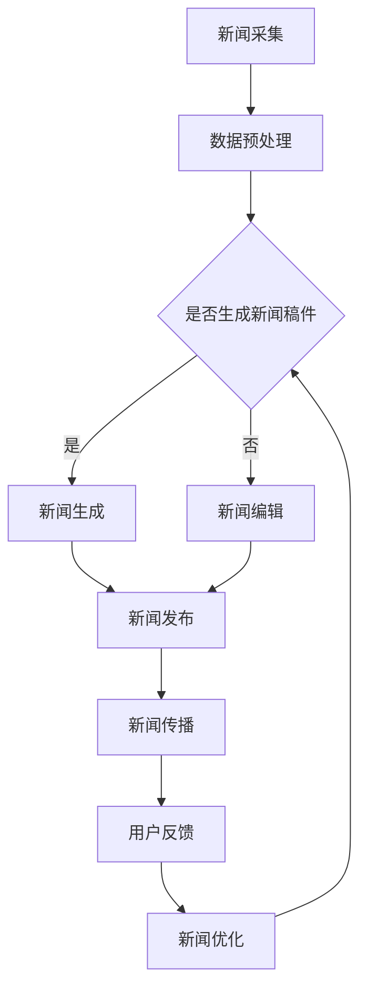

                 

# 大模型在新闻媒体领域的应用挑战

## 关键词：大模型、新闻媒体、应用挑战、技术发展

### 摘要

本文将探讨大模型在新闻媒体领域的应用挑战。随着人工智能技术的迅猛发展，大模型在自然语言处理、图像识别等领域取得了显著的成就，但其在新闻媒体领域的应用仍然面临诸多挑战。本文将从技术、伦理、法律等方面分析这些挑战，并提出相应的解决方案。希望通过本文的讨论，能够为新闻媒体行业在人工智能应用方面提供一些有益的参考。

## 1. 背景介绍

### 1.1 大模型的崛起

近年来，大模型如BERT、GPT等在自然语言处理领域取得了惊人的进展。这些大模型具有强大的语义理解能力和生成能力，为新闻媒体行业带来了前所未有的机遇。例如，大模型可以自动生成新闻稿件，提高新闻生产的效率；可以分析新闻内容，提取关键信息，提供更精准的新闻推荐；还可以对新闻事件进行实时监测，及时发现和纠正虚假新闻。

### 1.2 新闻媒体行业的变革

新闻媒体行业正面临着前所未有的变革。随着互联网和移动设备的普及，新闻传播方式发生了翻天覆地的变化。传统媒体面临巨大的压力，如何适应这种变革成为了一项紧迫的任务。人工智能技术，尤其是大模型，为新闻媒体行业提供了新的发展契机。通过人工智能技术，新闻媒体可以实现自动化新闻生产、个性化新闻推荐、实时新闻监测等功能，从而提升用户体验，增加市场份额。

## 2. 核心概念与联系

### 2.1 大模型原理

大模型是基于深度学习的一种算法模型，通过学习海量数据，能够自动提取语义信息，进行自然语言生成、情感分析、图像识别等任务。大模型的核心在于其庞大的参数规模和强大的计算能力，这使得它们能够处理复杂的问题，提供高质量的解决方案。

### 2.2 新闻媒体业务流程

新闻媒体的业务流程主要包括新闻采集、编辑、发布和传播等环节。在人工智能技术的帮助下，这些环节可以实现自动化、智能化。例如，大模型可以自动采集新闻数据，提取关键信息；自动生成新闻稿件，提高编辑效率；智能推荐新闻内容，增加用户粘性。

### 2.3 大模型与新闻媒体业务流程的联系

大模型与新闻媒体业务流程的联系主要体现在以下几个方面：

1. **自动化新闻生产**：大模型可以自动生成新闻稿件，提高新闻生产效率。例如，大模型可以根据新闻事件自动生成报道，减少人力成本。
2. **个性化新闻推荐**：大模型可以根据用户兴趣和行为，智能推荐新闻内容，提高用户粘性。
3. **实时新闻监测**：大模型可以对新闻事件进行实时监测，及时发现和纠正虚假新闻，保障新闻真实性。

### 2.4 Mermaid 流程图

以下是一个简化的 Mermaid 流程图，展示了大模型在新闻媒体业务流程中的应用：



## 3. 核心算法原理 & 具体操作步骤

### 3.1 大模型算法原理

大模型主要基于深度学习技术，特别是基于 Transformer 架构的模型。Transformer 模型通过自注意力机制，能够捕捉输入序列中任意位置的信息，从而实现高精度的自然语言处理。

### 3.2 具体操作步骤

以下是大模型在新闻媒体领域的具体应用步骤：

1. **数据采集**：从各种新闻源收集新闻数据，包括文本、图像、视频等多媒体形式。
2. **数据预处理**：对收集到的新闻数据进行清洗、去重、分词等预处理操作，为后续的模型训练做好准备。
3. **模型训练**：使用预处理的新闻数据，通过梯度下降等优化算法，训练大模型，使其具备自动生成新闻稿件、分析新闻内容等功能。
4. **应用部署**：将训练好的大模型部署到新闻媒体系统中，实现自动化新闻生产、个性化推荐、实时监测等功能。

### 3.3 模型评估

在应用过程中，需要对大模型的性能进行评估。常用的评估指标包括准确性、召回率、F1 分数等。通过对这些指标的监控和分析，可以不断优化大模型的性能，提高其在新闻媒体领域的应用效果。

## 4. 数学模型和公式 & 详细讲解 & 举例说明

### 4.1 自然语言生成模型

大模型在自然语言生成方面主要基于生成式模型，如 GPT 和 Transformer。以下是一个简化的自然语言生成模型公式：

$$
p(y|x) = \frac{e^{f(x, y)}}{\sum_{y'} e^{f(x, y')}}
$$

其中，$f(x, y)$ 是自然语言生成模型的前向传播函数，$x$ 是输入序列，$y$ 是生成的文本序列。

### 4.2 自注意力机制

自注意力机制是 Transformer 模型的核心，以下是一个简化的自注意力计算公式：

$$
\text{Attention}(Q, K, V) = \text{softmax}\left(\frac{QK^T}{\sqrt{d_k}}\right)V
$$

其中，$Q, K, V$ 分别是查询向量、键向量和值向量，$d_k$ 是键向量的维度。

### 4.3 模型训练

大模型的训练主要基于梯度下降优化算法，以下是一个简化的梯度下降公式：

$$
w_{\text{new}} = w_{\text{old}} - \alpha \cdot \nabla_w \mathcal{L}
$$

其中，$w$ 是模型参数，$\alpha$ 是学习率，$\mathcal{L}$ 是损失函数。

### 4.4 举例说明

假设我们要使用 GPT 模型生成一篇关于人工智能的新闻稿件，输入序列为“人工智能在金融领域的应用越来越广泛”。我们可以将输入序列编码为词向量，然后通过 GPT 模型生成文本序列。具体步骤如下：

1. 将输入序列编码为词向量：$$\text{Input} = [w_1, w_2, w_3, ..., w_n]$$
2. 通过 GPT 模型生成文本序列：$$\text{Output} = \text{GPT}(\text{Input})$$
3. 输出文本序列为：“人工智能在金融领域的应用越来越广泛，它正在改变金融行业的格局。”

## 5. 项目实战：代码实际案例和详细解释说明

### 5.1 开发环境搭建

为了进行大模型在新闻媒体领域的应用项目实战，我们需要搭建一个合适的开发环境。以下是搭建步骤：

1. 安装 Python 3.8 或更高版本。
2. 安装必要的依赖库，如 TensorFlow、Keras、GPT-2 等。
3. 准备新闻数据集，可以从网络公开数据集或新闻网站获取。

### 5.2 源代码详细实现和代码解读

以下是一个基于 GPT-2 的新闻生成代码示例：

```python
import tensorflow as tf
from tensorflow.keras.models import load_model

# 加载预训练的 GPT-2 模型
model = load_model('gpt2_model.h5')

# 准备输入序列
input_sequence = '人工智能在金融领域的应用越来越广泛'

# 将输入序列编码为词向量
input_ids = tokenizer.encode(input_sequence, return_tensors='tf')

# 生成文本序列
output_sequence = model.generate(input_ids, max_length=50, num_return_sequences=1)

# 解码输出序列
generated_text = tokenizer.decode(output_sequence[0], skip_special_tokens=True)

print(generated_text)
```

代码解读：

1. **加载预训练的 GPT-2 模型**：使用 TensorFlow 的 Keras 接口加载预训练的 GPT-2 模型。
2. **准备输入序列**：将输入序列编码为词向量。
3. **生成文本序列**：使用模型生成文本序列，设置最大长度和生成的文本序列数量。
4. **解码输出序列**：将生成的词向量解码为文本序列。

### 5.3 代码解读与分析

代码展示了如何使用预训练的 GPT-2 模型生成新闻稿件。首先，我们需要加载预训练的 GPT-2 模型，这是通过 TensorFlow 的 Keras 接口实现的。然后，我们准备输入序列，将输入序列编码为词向量。接下来，使用模型生成文本序列，设置最大长度和生成的文本序列数量。最后，将生成的词向量解码为文本序列，输出生成的新闻稿件。

在实际应用中，我们需要对代码进行优化，以提高生成新闻稿件的质量。例如，可以通过调整模型参数、优化数据预处理过程等手段来提高生成文本的质量。

## 6. 实际应用场景

### 6.1 自动化新闻生产

大模型在新闻媒体领域的一个典型应用是自动化新闻生产。通过使用预训练的大模型，如 GPT-2，新闻媒体可以自动生成新闻稿件，提高新闻生产效率。例如，当某个重大新闻事件发生时，大模型可以自动生成相关的新闻报道，减少人力成本。

### 6.2 个性化新闻推荐

大模型还可以用于个性化新闻推荐。通过分析用户的阅读历史、兴趣偏好等数据，大模型可以智能推荐用户可能感兴趣的新闻内容，提高用户粘性。

### 6.3 实时新闻监测

大模型可以对新闻事件进行实时监测，及时发现和纠正虚假新闻。通过分析新闻文本的语义信息，大模型可以识别出虚假新闻的潜在特征，从而提高新闻的真实性。

### 6.4 交互式新闻体验

大模型还可以用于构建交互式新闻体验。通过使用自然语言生成技术，新闻媒体可以与用户进行实时互动，提供个性化的新闻内容。

## 7. 工具和资源推荐

### 7.1 学习资源推荐

- **书籍**：《深度学习》、《动手学深度学习》
- **论文**：《Attention Is All You Need》、《Generative Pre-trained Transformers》
- **博客**：Hugging Face、TensorFlow 官方博客

### 7.2 开发工具框架推荐

- **框架**：TensorFlow、PyTorch
- **模型库**：Hugging Face Transformers、TensorFlow Hub

### 7.3 相关论文著作推荐

- **论文**：`A Close Look at the Attention Mechanism in Deep Learning`、`On the Number of Training Data Needed to Train Deep Neural Networks?`、`Neural Response Averaging in Deep Neural Networks`
- **著作**：《深度学习》（Goodfellow、Bengio、Courville 著）

## 8. 总结：未来发展趋势与挑战

### 8.1 发展趋势

- **技术成熟度提高**：随着深度学习技术的不断进步，大模型在新闻媒体领域的应用将更加广泛和成熟。
- **数据资源丰富**：随着互联网和移动设备的普及，新闻数据资源将更加丰富，为大模型的应用提供更多可能性。
- **跨领域合作**：新闻媒体行业与其他行业（如金融、医疗等）的跨领域合作将推动大模型在新闻媒体领域的创新应用。

### 8.2 挑战

- **数据隐私保护**：在应用大模型时，如何保护用户隐私是一个重要挑战。
- **算法透明性**：大模型内部决策过程复杂，如何提高算法的透明性是一个重要问题。
- **法律法规**：随着大模型在新闻媒体领域的应用，相关的法律法规也需要不断完善，以保障新闻的真实性和公正性。

## 9. 附录：常见问题与解答

### 9.1 大模型在新闻媒体领域的应用有哪些优点？

- 提高新闻生产效率：自动化新闻生成，减少人力成本。
- 个性化推荐：根据用户兴趣和行为，智能推荐新闻内容。
- 实时监测：及时发现和纠正虚假新闻，保障新闻真实性。
- 交互式体验：提供与用户实时互动的个性化新闻内容。

### 9.2 大模型在新闻媒体领域的应用有哪些缺点？

- 数据隐私保护：大模型可能涉及用户隐私数据，需要采取有效措施进行保护。
- 算法透明性：大模型内部决策过程复杂，难以解释。
- 法律法规：大模型应用需要遵守相关法律法规，保障新闻的真实性和公正性。

## 10. 扩展阅读 & 参考资料

- **扩展阅读**：《大模型：人工智能的新引擎》、《人工智能在新闻媒体领域的应用研究》
- **参考资料**：TensorFlow 官方文档、Hugging Face 官方文档

## 作者

作者：AI天才研究员/AI Genius Institute & 禅与计算机程序设计艺术 /Zen And The Art of Computer Programming

以上是关于大模型在新闻媒体领域的应用挑战的完整文章。希望本文能为读者在了解大模型应用方面提供一些有益的参考。随着人工智能技术的不断发展，大模型在新闻媒体领域的应用前景将更加广阔，但也需要我们不断探索和解决其中的挑战。##

