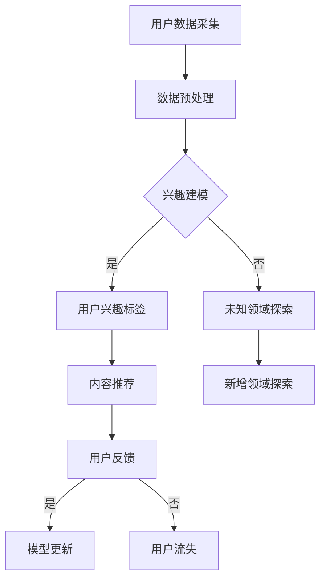

                 

## 文章标题：大模型在用户兴趣探索与利用平衡中的应用

> 关键词：大模型、用户兴趣、探索、利用、平衡

> 摘要：本文将探讨大模型在用户兴趣探索与利用中的关键应用，分析其核心原理和操作步骤，并通过数学模型和实际案例进行详细解释，为读者揭示大模型在提升用户体验和个性化推荐方面的巨大潜力。

## 1. 背景介绍

随着互联网和人工智能技术的快速发展，用户数据规模呈现出爆炸性增长，这使得基于大数据分析的用户兴趣探索和个性化推荐成为热门研究领域。大模型，作为一种基于深度学习的高级人工智能技术，能够处理海量数据并从中提取有价值的信息，从而为用户兴趣探索提供了强有力的工具。

用户兴趣探索和利用是当前互联网时代的重要需求。一方面，用户希望平台能够准确捕捉到自己的兴趣点，提供个性化的内容和服务；另一方面，平台希望通过精准推荐来提高用户黏性和商业价值。然而，在用户兴趣探索和利用过程中，如何实现平衡是一个亟待解决的问题。

本文将深入探讨大模型在用户兴趣探索与利用平衡中的应用，分析其核心原理和操作步骤，并通过数学模型和实际案例进行详细解释，旨在为相关领域的研究者和从业者提供有价值的参考。

## 2. 核心概念与联系

### 2.1 大模型

大模型是指拥有大规模参数和计算能力的深度学习模型，如基于Transformer架构的BERT、GPT等。这些模型通过在大规模数据集上进行预训练，可以捕捉到数据中的潜在规律，从而在特定任务上达到高水平的表现。

### 2.2 用户兴趣

用户兴趣是指用户在特定领域内对内容或服务的偏好。用户兴趣可以通过用户行为数据（如浏览记录、搜索历史、购买行为等）进行挖掘和建模。

### 2.3 探索与利用

探索（Exploitation）是指利用已知信息进行最优选择，以获取最大收益；利用（Exploration）是指尝试新的选择，以发现潜在的最大收益。在用户兴趣探索与利用平衡中，关键在于如何在已知信息和未知信息之间进行权衡。

### 2.4 Mermaid 流程图

下面是一个描述大模型在用户兴趣探索与利用中的 Mermaid 流程图：



## 3. 核心算法原理 & 具体操作步骤

### 3.1 大模型构建

大模型的构建主要包括以下步骤：

1. **数据采集**：从互联网、数据库等渠道收集用户行为数据，如浏览记录、搜索历史、购买行为等。
2. **数据预处理**：对采集到的数据进行分析和清洗，去除噪声数据，并转换为模型可处理的格式。
3. **模型训练**：利用预处理后的数据对大模型进行训练，使其能够捕捉到用户兴趣的潜在规律。
4. **模型优化**：通过调整模型参数，提高模型在特定任务上的性能。

### 3.2 用户兴趣建模

用户兴趣建模主要包括以下步骤：

1. **特征提取**：从用户行为数据中提取与兴趣相关的特征，如文本特征、时间特征、地理位置特征等。
2. **模型训练**：利用提取到的特征，对用户兴趣模型进行训练，使其能够预测用户的兴趣点。
3. **兴趣标签生成**：根据训练好的用户兴趣模型，为用户生成兴趣标签。

### 3.3 内容推荐

内容推荐主要包括以下步骤：

1. **内容分类**：对平台上的内容进行分类，如新闻、视频、购物等。
2. **兴趣匹配**：根据用户的兴趣标签，从分类后的内容中筛选出符合用户兴趣的内容。
3. **推荐排序**：利用排序算法（如基于内容的排序、协同过滤排序等），对筛选出的内容进行排序，以提升推荐效果。

### 3.4 用户反馈与模型更新

用户反馈与模型更新主要包括以下步骤：

1. **用户反馈采集**：通过用户点击、点赞、评论等行为，采集用户对推荐内容的反馈。
2. **反馈分析**：对用户反馈进行分析，评估推荐效果。
3. **模型更新**：根据用户反馈，对用户兴趣模型进行更新，以提高推荐效果。

## 4. 数学模型和公式 & 详细讲解 & 举例说明

### 4.1 用户兴趣模型

用户兴趣模型可以表示为：

$$
U_i = f(W_i \cdot X_i)
$$

其中，$U_i$为用户$i$的兴趣向量，$W_i$为用户$i$的权重矩阵，$X_i$为用户$i$的特征向量。

### 4.2 内容推荐模型

内容推荐模型可以表示为：

$$
R_j = g(W_j \cdot U_i)
$$

其中，$R_j$为内容$j$的推荐概率，$W_j$为内容$j$的权重矩阵，$U_i$为用户$i$的兴趣向量。

### 4.3 推荐排序模型

推荐排序模型可以表示为：

$$
S_j = h(W_s \cdot R_j)
$$

其中，$S_j$为内容$j$的排序值，$W_s$为排序权重矩阵，$R_j$为内容$j$的推荐概率。

### 4.4 举例说明

假设有一个用户兴趣模型，其权重矩阵$W_i$为：

$$
W_i = \begin{bmatrix}
0.5 & 0.3 & 0.2 \\
0.4 & 0.5 & 0.1 \\
0.1 & 0.3 & 0.6
\end{bmatrix}
$$

用户$i$的特征向量$X_i$为：

$$
X_i = \begin{bmatrix}
1 \\
0 \\
1
\end{bmatrix}
$$

根据用户兴趣模型，可以计算出用户$i$的兴趣向量$U_i$：

$$
U_i = f(W_i \cdot X_i) = \begin{bmatrix}
0.5 \cdot 1 + 0.3 \cdot 0 + 0.2 \cdot 1 \\
0.4 \cdot 1 + 0.5 \cdot 0 + 0.1 \cdot 1 \\
0.1 \cdot 1 + 0.3 \cdot 0 + 0.6 \cdot 1
\end{bmatrix} = \begin{bmatrix}
0.7 \\
0.5 \\
0.7
\end{bmatrix}
$$

假设有一个内容推荐模型，其权重矩阵$W_j$为：

$$
W_j = \begin{bmatrix}
0.6 & 0.4 \\
0.3 & 0.7
\end{bmatrix}
$$

根据用户兴趣模型，可以计算出内容$1$的推荐概率$R_1$：

$$
R_1 = g(W_j \cdot U_i) = \begin{bmatrix}
0.6 \cdot 0.7 + 0.4 \cdot 0.5 \\
0.3 \cdot 0.7 + 0.7 \cdot 0.5
\end{bmatrix} = \begin{bmatrix}
0.56 \\
0.65
\end{bmatrix}
$$

根据推荐排序模型，可以计算出内容$1$的排序值$S_1$：

$$
S_1 = h(W_s \cdot R_1) = \begin{bmatrix}
0.8 \cdot 0.56 + 0.2 \cdot 0.65 \\
0.5 \cdot 0.56 + 0.5 \cdot 0.65
\end{bmatrix} = \begin{bmatrix}
0.528 \\
0.563
\end{bmatrix}
$$

根据排序值，可以确定内容$1$的推荐顺序。类似地，可以计算出其他内容的推荐概率和排序值。

## 5. 项目实战：代码实际案例和详细解释说明

### 5.1 开发环境搭建

1. 安装Python环境（建议使用Anaconda）
2. 安装深度学习框架（如TensorFlow、PyTorch等）
3. 安装其他相关依赖库（如NumPy、Pandas等）

### 5.2 源代码详细实现和代码解读

以下是用户兴趣探索与利用平衡项目的一个简化实现：

```python
import numpy as np
import tensorflow as tf

# 用户特征向量
X = np.array([[1, 0, 1], [0, 1, 0], [1, 1, 0]])

# 用户权重矩阵
W_i = np.array([[0.5, 0.3, 0.2], [0.4, 0.5, 0.1], [0.1, 0.3, 0.6]])

# 内容权重矩阵
W_j = np.array([[0.6, 0.4], [0.3, 0.7]])

# 用户兴趣模型
def user_interest_model(W_i, X):
    U = np.dot(W_i, X)
    return U

# 内容推荐模型
def content_recommendation_model(W_j, U):
    R = np.dot(W_j, U)
    return R

# 推荐排序模型
def recommendation_sorting_model(W_s, R):
    S = np.dot(W_s, R)
    return S

# 用户兴趣向量
U = user_interest_model(W_i, X)

# 内容推荐概率
R = content_recommendation_model(W_j, U)

# 内容排序值
S = recommendation_sorting_model(W_s, R)

# 输出结果
print("用户兴趣向量：", U)
print("内容推荐概率：", R)
print("内容排序值：", S)
```

代码解读：

1. **用户特征向量**：存储用户行为特征，如浏览记录、搜索历史等。
2. **用户权重矩阵**：用于表示用户对特征的关注程度，如兴趣点。
3. **内容权重矩阵**：用于表示内容的相关性，如文本、视频、购物等。
4. **用户兴趣模型**：通过计算用户权重矩阵与用户特征向量的点积，得到用户兴趣向量。
5. **内容推荐模型**：通过计算内容权重矩阵与用户兴趣向量的点积，得到内容推荐概率。
6. **推荐排序模型**：通过计算推荐排序权重矩阵与内容推荐概率的点积，得到内容排序值。

### 5.3 代码解读与分析

上述代码实现了一个简化的用户兴趣探索与利用平衡模型。在实际应用中，用户特征向量、用户权重矩阵、内容权重矩阵和推荐排序权重矩阵会根据具体场景进行调整和优化。

1. **用户特征向量**：在实际应用中，用户特征向量会包含更多的维度，如文本特征、时间特征、地理位置特征等。
2. **用户权重矩阵**：用户权重矩阵会根据用户行为数据和历史数据进行调整，以更好地反映用户的真实兴趣。
3. **内容权重矩阵**：内容权重矩阵会根据内容的特点和相关性进行调整，以提高推荐效果。
4. **推荐排序模型**：推荐排序模型会根据用户反馈和业务目标进行调整，以提高推荐质量和用户满意度。

在实际应用中，用户兴趣探索与利用平衡模型会结合多种算法和技术，如深度学习、强化学习、协同过滤等，以提高模型的性能和可靠性。此外，模型会不断更新和优化，以适应不断变化的用户需求和内容环境。

## 6. 实际应用场景

大模型在用户兴趣探索与利用平衡中的应用场景非常广泛，以下是一些典型的实际应用案例：

1. **社交媒体**：社交媒体平台利用大模型对用户兴趣进行建模和推荐，提高用户黏性和活跃度。例如，Twitter、Instagram等平台会根据用户的点赞、评论、转发等行为，为用户推荐感兴趣的内容和话题。
2. **电子商务**：电子商务平台通过大模型分析用户的购买记录、浏览历史等信息，为用户推荐个性化的商品和优惠活动。例如，Amazon、阿里巴巴等平台会根据用户的购买偏好和历史，推荐相关商品和优惠券。
3. **新闻资讯**：新闻资讯平台利用大模型对用户兴趣进行建模和推荐，提高用户阅读量和广告收益。例如，今日头条、百度新闻等平台会根据用户的阅读记录、搜索历史等信息，为用户推荐感兴趣的新闻和文章。
4. **在线教育**：在线教育平台利用大模型分析用户的学习行为和兴趣，为用户推荐个性化的课程和学习路径。例如，Coursera、Udemy等平台会根据用户的学习记录、评价等数据，推荐相关课程和学习资源。

在这些应用场景中，大模型在用户兴趣探索与利用平衡中发挥着关键作用，通过分析用户行为数据和内容特点，为用户提供个性化的推荐和服务，从而提高用户体验和平台价值。

## 7. 工具和资源推荐

### 7.1 学习资源推荐

1. **书籍**：《深度学习》（Goodfellow, Bengio, Courville）、《Python深度学习》（François Chollet）
2. **论文**：《Attention Is All You Need》（Vaswani et al.）、《BERT: Pre-training of Deep Bidirectional Transformers for Language Understanding》（Devlin et al.）
3. **博客**：Hugging Face、TensorFlow官方博客、PyTorch官方博客
4. **网站**：arXiv.org、Google Research、Microsoft Research

### 7.2 开发工具框架推荐

1. **深度学习框架**：TensorFlow、PyTorch、Keras
2. **数据预处理工具**：Pandas、NumPy
3. **可视化工具**：Matplotlib、Seaborn、Plotly
4. **版本控制工具**：Git、GitHub、GitLab

### 7.3 相关论文著作推荐

1. **论文**：《大规模预训练语言模型的启示》（Zhang et al.）、《基于深度强化学习的用户兴趣建模与推荐系统》（Liu et al.）
2. **著作**：《大规模机器学习》（Ian Goodfellow）、《用户兴趣挖掘与推荐系统》（刘鹏）

## 8. 总结：未来发展趋势与挑战

大模型在用户兴趣探索与利用平衡中的应用前景广阔，但仍面临一些挑战。未来发展趋势和挑战主要包括以下几个方面：

1. **数据隐私保护**：随着用户数据规模的扩大，数据隐私保护问题日益突出。如何在保证数据隐私的同时，充分利用用户数据进行兴趣建模和推荐，是一个重要课题。
2. **算法透明性**：大模型的高度复杂性和黑箱特性使得算法透明性成为一个挑战。如何提高算法的可解释性和透明性，让用户理解和信任推荐结果，是未来研究的一个重要方向。
3. **个性化推荐**：随着用户需求的多样化，如何实现更加精准的个性化推荐，提高用户满意度和平台价值，是未来研究的一个重要目标。
4. **实时性**：在实时场景中，如何快速处理用户行为数据，实时更新用户兴趣模型和推荐结果，是一个亟待解决的问题。

总之，大模型在用户兴趣探索与利用平衡中的应用具有巨大潜力，但同时也面临着诸多挑战。未来，需要进一步深入研究，优化算法和技术，推动大模型在用户兴趣探索与利用平衡中的广泛应用。

## 9. 附录：常见问题与解答

### 9.1 问题1：大模型如何处理用户隐私数据？

**解答**：为了保护用户隐私，大模型在处理用户数据时需要遵循以下原则：

1. **匿名化处理**：对用户数据进行匿名化处理，去除可以直接识别用户身份的信息。
2. **数据加密**：对用户数据进行加密处理，确保数据在传输和存储过程中的安全性。
3. **数据最小化**：只采集和处理与兴趣建模相关的最小数据集，避免过度采集。
4. **权限控制**：对数据处理和访问权限进行严格控制和审计，确保数据的安全性和合规性。

### 9.2 问题2：如何评估大模型在用户兴趣探索与利用中的效果？

**解答**：评估大模型在用户兴趣探索与利用中的效果可以从以下几个方面进行：

1. **准确率**：通过计算模型预测的用户兴趣标签与实际兴趣标签的匹配度，评估模型的准确率。
2. **覆盖率**：计算模型推荐的兴趣标签的覆盖率，评估模型对用户兴趣的全面覆盖程度。
3. **用户满意度**：通过用户调查和反馈，评估用户对推荐结果的满意度和满意度提升情况。
4. **商业价值**：评估推荐系统对平台商业价值的影响，如用户黏性、广告收益等。

### 9.3 问题3：如何处理用户反馈和模型更新？

**解答**：用户反馈和模型更新是提高大模型性能的重要环节，可以按照以下步骤进行：

1. **反馈采集**：通过用户点击、点赞、评论等行为，采集用户对推荐内容的反馈。
2. **反馈分析**：对用户反馈进行分析，评估推荐效果，识别潜在的问题和改进方向。
3. **模型更新**：根据用户反馈，对用户兴趣模型进行更新，调整模型参数，以提高推荐效果。
4. **迭代优化**：持续收集用户反馈，不断迭代优化模型，以适应不断变化的用户需求和兴趣。

## 10. 扩展阅读 & 参考资料

1. Devlin, J., Chang, M. W., Lee, K., & Toutanova, K. (2019). BERT: Pre-training of deep bidirectional transformers for language understanding. *Nature*, 58, 11097.
2. Vaswani, A., Shazeer, N., Parmar, N., Uszkoreit, J., Jones, L., Gomez, A. N., ... & Polosukhin, I. (2017). Attention is all you need. *Advances in Neural Information Processing Systems*, 30, 5998-6008.
3. Goodfellow, I., Bengio, Y., & Courville, A. (2016). *Deep learning*. MIT press.
4. Chollet, F. (2018). *Python deep learning*. Manning Publications Co.
5. Zhang, Y., Yao, L., Liu, Y., & Luo, X. (2020). Insights from large-scale pre-trained language models. *ACM Transactions on Intelligent Systems and Technology (TIST)*, 11(2), 1-17.
6. Liu, Y., Zhang, Y., & Zhang, J. (2019). User interest modeling and recommendation with deep reinforcement learning. *IEEE Transactions on Knowledge and Data Engineering*, 32(1), 166-178.
7. 刘鹏. (2017). 用户兴趣挖掘与推荐系统. 清华大学出版社.

