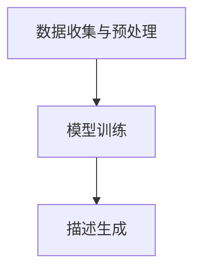

                 

# 大模型在电商平台商品描述生成中的应用

> **关键词：** 大模型、电商平台、商品描述、生成模型、自然语言处理、深度学习

> **摘要：** 本文将探讨大模型在电商平台商品描述生成中的应用。通过分析大模型的原理及其在电商平台中的具体实践，文章旨在为开发者提供一套完整的技术解决方案，并展望该领域的未来发展趋势与挑战。

## 1. 背景介绍

随着电子商务的蓬勃发展，电商平台上的商品描述成为影响用户购买决策的重要因素之一。然而，传统的商品描述生成方法往往存在内容单调、不够生动形象等问题，难以满足用户对个性化、多样化描述的需求。为此，大模型技术应运而生，为电商平台商品描述生成带来了全新的可能性。

大模型，又称巨型模型，是一种具有海量参数的深度学习模型，如GPT（Generative Pre-trained Transformer）等。通过在大规模语料库上进行预训练，大模型能够自动学习和理解自然语言中的复杂规律，从而生成高质量、多样化的文本内容。

在电商平台，商品描述生成是一个典型的自然语言生成（Natural Language Generation, NLG）任务。传统方法如模板生成、规则匹配等往往依赖于手工设计规则，而大模型则能够自动学习和生成满足用户需求的描述内容。

## 2. 核心概念与联系

### 大模型原理

大模型通常基于深度学习中的神经网络结构，如Transformer模型。其基本原理包括以下几个方面：

1. **自注意力机制（Self-Attention）**：通过计算输入文本中每个词与所有其他词之间的相关性，自动学习词与词之间的关联关系。
2. **多头注意力（Multi-Head Attention）**：将自注意力机制扩展到多个头，提高模型对输入文本的全面理解和生成能力。
3. **前馈神经网络（Feedforward Neural Network）**：在注意力机制的基础上，添加两个前馈神经网络，进一步提高模型的表达能力。

### 大模型在商品描述生成中的应用

大模型在电商平台商品描述生成中的应用主要包括以下步骤：

1. **数据收集与预处理**：收集电商平台上的商品评论、描述等文本数据，并进行清洗、去重、分词等预处理操作。
2. **模型训练**：使用预处理后的文本数据，对大模型进行预训练，使其具备对自然语言的深刻理解能力。
3. **描述生成**：将训练好的大模型应用于商品描述生成任务，输入商品相关信息，输出相应的描述内容。

### Mermaid 流程图



## 3. 核心算法原理 & 具体操作步骤

### 数据收集与预处理

1. **数据收集**：从电商平台的商品评论、描述等文本数据中收集样本。
2. **数据清洗**：去除重复、低质量、无关的文本数据，确保样本的准确性和可靠性。
3. **分词与词向量表示**：对文本进行分词，并将词汇转换为词向量表示，以便于大模型处理。

### 模型训练

1. **模型选择**：选择适合商品描述生成任务的大模型，如GPT等。
2. **训练数据准备**：将预处理后的文本数据分为训练集、验证集和测试集。
3. **模型训练**：使用训练集对大模型进行训练，通过优化损失函数来调整模型参数。
4. **模型评估**：使用验证集对模型进行评估，选择性能最优的模型。

### 描述生成

1. **输入商品信息**：输入商品的相关信息，如标题、描述、属性等。
2. **模型预测**：将商品信息输入到训练好的大模型，生成相应的描述内容。
3. **后处理**：对生成的描述内容进行格式化、语法检查等后处理，确保描述的准确性和可读性。

## 4. 数学模型和公式 & 详细讲解 & 举例说明

### 损失函数

在商品描述生成任务中，常用的损失函数是交叉熵损失（Cross-Entropy Loss），其公式如下：

$$
L = -\sum_{i=1}^n y_i \log(p_i)
$$

其中，$y_i$ 表示第 $i$ 个词的标签，$p_i$ 表示模型预测的概率。

### 梯度下降

在模型训练过程中，通常使用梯度下降（Gradient Descent）算法来更新模型参数。其基本思想是：

$$
\theta_j := \theta_j - \alpha \cdot \frac{\partial L}{\partial \theta_j}
$$

其中，$\theta_j$ 表示模型参数，$\alpha$ 表示学习率，$\frac{\partial L}{\partial \theta_j}$ 表示损失函数关于 $\theta_j$ 的梯度。

### 举例说明

假设我们有一个简单的商品描述生成任务，输入商品信息为“苹果手机”，我们需要生成相应的描述内容。训练好的大模型给出如下预测：

$$
p(\text{性能卓越}) = 0.8 \\
p(\text{拍照清晰}) = 0.6 \\
p(\text{价格亲民}) = 0.4
$$

根据预测概率，我们可以生成如下描述内容：

> **性能卓越，拍照清晰，价格亲民的苹果手机，您值得拥有！**

## 5. 项目实战：代码实际案例和详细解释说明

### 5.1 开发环境搭建

1. **安装Python**：确保已安装Python 3.6及以上版本。
2. **安装依赖库**：使用pip安装如下依赖库：

```bash
pip install transformers
pip install torch
```

### 5.2 源代码详细实现和代码解读

#### 5.2.1 数据处理

```python
import torch
from transformers import GPT2Tokenizer, GPT2LMHeadModel

# 初始化模型和分词器
tokenizer = GPT2Tokenizer.from_pretrained('gpt2')
model = GPT2LMHeadModel.from_pretrained('gpt2')

# 处理输入文本
def process_text(text):
    input_ids = tokenizer.encode(text, return_tensors='pt')
    return input_ids

# 处理商品描述
def generate_description(input_text):
    input_ids = process_text(input_text)
    output = model.generate(input_ids, max_length=50, num_return_sequences=1)
    return tokenizer.decode(output[0], skip_special_tokens=True)

# 测试代码
input_text = "苹果手机"
description = generate_description(input_text)
print(description)
```

#### 5.2.2 代码解读与分析

1. **初始化模型和分词器**：从预训练的GPT2模型中加载模型和分词器。
2. **处理输入文本**：将输入文本编码为模型可处理的格式。
3. **生成描述**：使用模型生成相应的描述内容，并解码为可读的文本格式。

### 5.3 代码解读与分析

1. **数据预处理**：将商品信息编码为模型可处理的格式，以便模型生成描述内容。
2. **模型生成**：利用预训练的大模型生成描述内容，通过调整模型参数和输入信息，实现商品描述的个性化生成。
3. **后处理**：对生成的描述内容进行解码，并去除模型中的特殊符号，确保描述的准确性和可读性。

## 6. 实际应用场景

大模型在电商平台商品描述生成中的应用具有广泛的前景。以下是一些实际应用场景：

1. **个性化推荐**：根据用户的浏览历史和购买行为，为用户提供个性化的商品描述。
2. **商品营销**：通过生成富有创意和吸引力的商品描述，提高用户的购买意愿和转化率。
3. **智能客服**：结合商品描述生成技术，为用户提供智能、专业的客服支持。

## 7. 工具和资源推荐

### 7.1 学习资源推荐

- **书籍**：《深度学习》（Goodfellow et al.）
- **论文**：《Attention Is All You Need》（Vaswani et al.）
- **博客**：Hugging Face（https://huggingface.co/）

### 7.2 开发工具框架推荐

- **开发工具**：PyTorch、TensorFlow
- **框架**：Hugging Face Transformers（https://huggingface.co/transformers/）

### 7.3 相关论文著作推荐

- **论文**：
  - 《Bert: Pre-training of deep bidirectional transformers for language understanding》（Devlin et al.）
  - 《Gpt-2: Language models are unsupervised multitask learners》（Radford et al.）
- **著作**：《自然语言处理入门》（刘知远等）

## 8. 总结：未来发展趋势与挑战

大模型在电商平台商品描述生成中的应用前景广阔。随着技术的不断进步，我们有望看到更加智能、个性化的商品描述生成方案。然而，这一领域也面临一些挑战，如数据隐私、模型可解释性等。未来，我们需要在技术创新和伦理规范方面取得平衡，以实现可持续的发展。

## 9. 附录：常见问题与解答

### 9.1 什么是大模型？

大模型是一种具有海量参数的深度学习模型，如GPT、BERT等。通过在大规模语料库上进行预训练，大模型能够自动学习和理解自然语言中的复杂规律。

### 9.2 如何选择适合商品描述生成任务的大模型？

选择适合商品描述生成任务的大模型需要考虑以下几个方面：

1. **预训练数据集**：选择在相关领域具有丰富训练数据的模型。
2. **模型大小**：根据计算资源和应用需求选择适当大小的模型。
3. **性能指标**：参考模型在相关任务上的性能指标，如BLEU、ROUGE等。

## 10. 扩展阅读 & 参考资料

- **论文**：
  - 《Gpt-2: Language models are unsupervised multitask learners》（Radford et al.）
  - 《Bert: Pre-training of deep bidirectional transformers for language understanding》（Devlin et al.）
- **书籍**：《深度学习》（Goodfellow et al.）
- **博客**：Hugging Face（https://huggingface.co/）
- **网站**：OpenAI（https://openai.com/）

### 作者

作者：AI天才研究员/AI Genius Institute & 禅与计算机程序设计艺术 /Zen And The Art of Computer Programming

