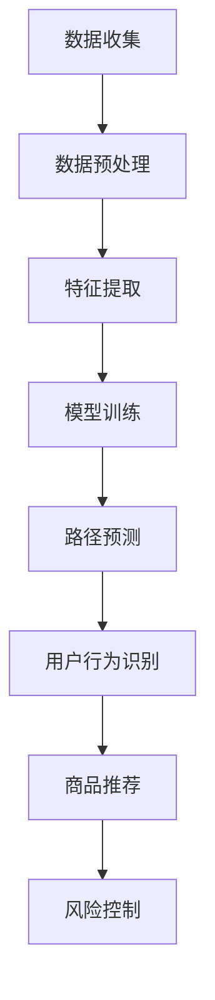
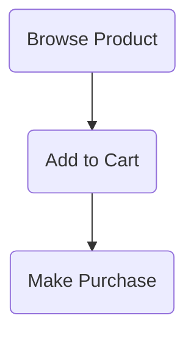
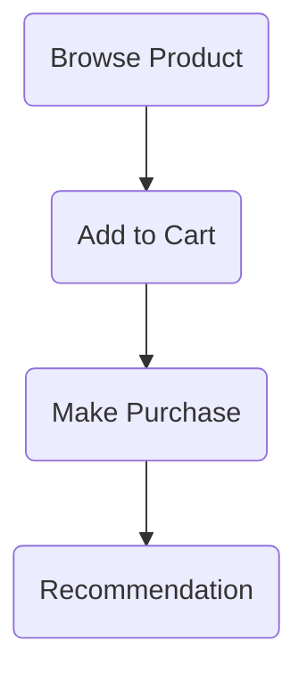

                 

### 1. 背景介绍

随着互联网技术的不断发展，电商平台已经成为了现代商业的重要组成部分。用户在电商平台上的行为数据，如浏览记录、购物车、购买历史等，蕴含着丰富的信息。如何有效地利用这些数据来分析和预测用户的购买路径，从而提高电商平台的运营效率和用户体验，成为了当前的研究热点。

传统的用户行为分析方法主要依赖于统计方法和机器学习算法，但这些方法往往需要对数据进行大量的预处理，并且对于复杂数据的处理能力有限。随着深度学习技术的快速发展，特别是大规模预训练模型（如GPT-3、BERT等）的广泛应用，为用户购买路径分析提供了一种新的可能。这些模型通过学习大量的文本数据，具备了强大的语义理解和生成能力，可以更好地捕捉用户行为的潜在模式。

本文将探讨大规模预训练模型在电商平台用户购买路径分析中的应用。我们将首先介绍大规模预训练模型的基本概念和原理，然后详细分析其在该领域的应用现状，并探讨未来可能的发展方向。希望通过本文的介绍，能够为相关领域的研究者和从业者提供一些有价值的参考和启示。

### 2. 核心概念与联系

#### 2.1 大规模预训练模型

大规模预训练模型（Large-scale Pre-trained Models）是一种基于深度学习的自然语言处理技术。其核心思想是通过对海量文本数据进行预训练，使模型具备强大的语义理解能力。预训练模型的主要任务包括两个阶段：预训练和微调。

**预训练**：在预训练阶段，模型通常在一个大规模语料库上进行训练，学习语言的基本规律和结构。这一阶段的目标是使模型能够对自然语言进行有效的表征，从而理解文本的语义。

**微调**：在预训练完成后，模型会根据具体的应用场景进行微调。例如，对于一个电商平台，可以微调预训练模型以识别用户的购买意图、推荐商品等。

大规模预训练模型的成功得益于以下几个关键因素：

1. **大规模数据**：预训练模型需要处理海量的文本数据，这为模型的学习提供了丰富的信息来源。
2. **深度神经网络**：深度神经网络可以捕捉复杂的语义关系，从而提高模型的性能。
3. **并行计算**：大规模预训练模型通常需要大量的计算资源，而现代并行计算技术如GPU、TPU等可以显著提高训练速度。

#### 2.2 电商平台用户购买路径分析

电商平台用户购买路径分析（User Purchase Path Analysis on E-commerce Platforms）是指通过分析用户在电商平台上的行为数据，识别和预测用户的购买路径。这一过程通常包括以下几个关键步骤：

1. **数据收集**：收集用户在电商平台上的行为数据，如浏览记录、购物车、购买历史等。
2. **数据预处理**：对收集到的数据进行清洗、去噪、编码等预处理，以获得高质量的输入数据。
3. **特征提取**：从预处理后的数据中提取特征，用于模型训练和预测。
4. **模型训练**：使用大规模预训练模型对提取的特征进行训练，以学习用户行为的潜在模式。
5. **路径预测**：利用训练好的模型预测用户的购买路径，从而为电商平台提供决策支持。

#### 2.3 大规模预训练模型与电商平台用户购买路径分析的联系

大规模预训练模型与电商平台用户购买路径分析之间存在紧密的联系。首先，大规模预训练模型通过学习海量文本数据，可以有效地提取用户的兴趣偏好和行为特征。这些特征可以用于构建用户购买路径的预测模型。其次，电商平台用户购买路径分析需要处理大量的复杂数据，而大规模预训练模型强大的表征能力使其能够更好地应对这一挑战。

此外，大规模预训练模型还可以用于以下几个方面：

1. **用户行为识别**：通过分析用户在电商平台上的行为数据，识别用户的购买意图和兴趣点。
2. **商品推荐**：基于用户的行为特征和兴趣偏好，为用户推荐相关的商品。
3. **风险控制**：通过分析用户的行为轨迹，识别潜在的欺诈行为，从而提高电商平台的安全性。

为了更好地理解大规模预训练模型在电商平台用户购买路径分析中的应用，我们使用Mermaid流程图来展示其基本架构。以下是Mermaid流程图：



通过上述分析，我们可以看到大规模预训练模型在电商平台用户购买路径分析中扮演着至关重要的角色。接下来，我们将进一步探讨大规模预训练模型的核心算法原理和具体操作步骤。

## 3. 核心算法原理 & 具体操作步骤

### 3.1 大规模预训练模型的基本原理

大规模预训练模型的核心是基于深度学习技术的自然语言处理（NLP）模型。这些模型通过学习大量的文本数据，可以自动提取文本中的语义信息，从而实现对自然语言的深层理解。大规模预训练模型的主要组成部分包括：

1. **词嵌入**（Word Embedding）：将自然语言中的词汇映射为向量表示，以便于在机器学习模型中处理。
2. **编码器**（Encoder）：负责对输入文本进行编码，提取其语义信息。
3. **解码器**（Decoder）：负责根据编码器的输出生成预测结果。
4. **注意力机制**（Attention Mechanism）：用于在编码器和解码器之间建立有效的信息传递路径，以捕捉长距离的依赖关系。

大规模预训练模型的工作流程通常分为两个阶段：预训练和微调。

**预训练**：在预训练阶段，模型在一个大规模语料库上进行训练，学习语言的基本规律和结构。预训练任务通常包括以下几种：

- **掩码语言模型**（Masked Language Model，MLM）：随机掩码输入文本中的部分词汇，模型需要预测这些被掩码的词汇。
- **次生语言模型**（Next Sentence Prediction，NSP）：预测输入文本中两个连续句子之间的关系。
- **句子排序**（Sentence Ranking）：对一组句子进行排序，判断其是否属于同一篇章。

**微调**：在预训练完成后，模型会根据具体的应用场景进行微调。例如，对于一个电商平台，可以微调预训练模型以识别用户的购买意图、推荐商品等。

### 3.2 电商平台用户购买路径分析的具体操作步骤

为了实现电商平台用户购买路径分析，我们需要按照以下步骤进行操作：

**步骤 1：数据收集**

收集用户在电商平台上的行为数据，如浏览记录、购物车、购买历史等。这些数据通常以日志文件的形式存储，例如：

```markdown
# 日志文件样例
user1	2023-01-01 10:00:00	browse-product	2345
user1	2023-01-01 10:10:00	add-to-cart	2345
user1	2023-01-01 10:20:00	browse-category	23
user1	2023-01-01 10:30:00	make-purchase	6789
```

**步骤 2：数据预处理**

对收集到的数据进行清洗、去噪和编码等预处理。具体步骤包括：

- **数据清洗**：去除重复的日志记录，填补缺失的数据。
- **去噪**：过滤掉异常值和噪声数据，以提高数据质量。
- **编码**：将用户行为、商品信息等转换为数字表示，以便于模型处理。例如，使用独热编码（One-Hot Encoding）对商品类别进行编码。

**步骤 3：特征提取**

从预处理后的数据中提取特征，用于模型训练和预测。常见的特征包括：

- **用户特征**：用户的浏览历史、购买历史等。
- **商品特征**：商品的品类、价格、库存等。
- **上下文特征**：用户在不同时间点的行为序列。

**步骤 4：模型训练**

使用大规模预训练模型对提取的特征进行训练。在这一步，我们需要定义以下参数：

- **训练数据集**：将预处理后的特征分为训练集和验证集。
- **损失函数**：通常使用交叉熵损失函数（Cross-Entropy Loss）来评估模型预测的准确性。
- **优化器**：选择合适的优化器（如Adam优化器）来调整模型参数。

**步骤 5：路径预测**

利用训练好的模型预测用户的购买路径。具体步骤如下：

- **输入特征**：将用户的行为序列输入到预训练模型中。
- **编码输出**：通过编码器对输入特征进行编码，提取其语义信息。
- **解码输出**：通过解码器生成预测的购买路径。

**步骤 6：结果评估**

对预测结果进行评估，以判断模型的性能。常用的评估指标包括准确率（Accuracy）、召回率（Recall）、精确率（Precision）等。

### 3.3 实际案例

以下是一个简化的实际案例，展示如何使用大规模预训练模型进行电商平台用户购买路径分析：

**案例背景**：某电商平台希望通过分析用户的行为数据，预测用户的购买路径，从而提高商品推荐和销售转化率。

**数据收集**：收集了用户在电商平台上的浏览记录、购物车数据和购买历史数据。

**数据预处理**：对数据进行清洗和编码，将用户行为、商品信息等转换为数字表示。

**特征提取**：从预处理后的数据中提取用户特征、商品特征和上下文特征。

**模型训练**：使用大规模预训练模型（如BERT）对提取的特征进行训练。

**路径预测**：利用训练好的模型预测用户的购买路径，并将结果与实际购买行为进行对比。

**结果评估**：根据预测结果和实际购买行为的对比，评估模型的性能。

通过上述步骤，电商平台可以更好地理解用户的行为模式，从而优化商品推荐策略和提升用户体验。

### 3.4 大规模预训练模型的优势

大规模预训练模型在电商平台用户购买路径分析中具有以下优势：

- **强大的语义理解能力**：通过学习大量的文本数据，预训练模型可以提取用户行为的深层语义信息，从而提高路径预测的准确性。
- **自适应调整能力**：预训练模型可以根据不同的应用场景进行微调，从而适应各种电商平台的需求。
- **高效的计算效率**：大规模预训练模型利用现代并行计算技术，可以显著提高训练和预测的速度，降低计算成本。
- **跨平台迁移性**：预训练模型在不同电商平台之间具有较好的迁移性，可以快速应用于新的场景。

综上所述，大规模预训练模型在电商平台用户购买路径分析中具有显著的优势，为电商平台提供了强大的数据分析工具。

### 4. 数学模型和公式 & 详细讲解 & 举例说明

#### 4.1 数学模型的基本概念

在电商平台用户购买路径分析中，我们需要使用一些基本的数学模型和公式来描述用户行为和路径预测。这些模型和公式包括：

- **贝叶斯网络**（Bayesian Network）：用于表示用户行为和购买路径之间的概率关系。
- **马尔可夫模型**（Markov Model）：用于描述用户行为的转移概率。
- **潜在因子模型**（Latent Factor Model）：用于提取用户和商品之间的潜在关系。

#### 4.2 贝叶斯网络

贝叶斯网络是一种概率图模型，用于表示多个随机变量之间的条件依赖关系。在电商平台用户购买路径分析中，我们可以使用贝叶斯网络来描述用户行为和购买路径之间的概率关系。

贝叶斯网络的表示方法如下：

\[ P(X_1, X_2, ..., X_n) = \prod_{i=1}^{n} P(X_i | X_{pa_i}) \]

其中，\( X_1, X_2, ..., X_n \) 表示用户在购买路径上的一系列行为，\( X_{pa_i} \) 表示 \( X_i \) 的父节点。例如，对于用户浏览产品、加入购物车和购买商品的行为，我们可以建立如下的贝叶斯网络：



#### 4.3 马尔可夫模型

马尔可夫模型是一种基于状态转移概率的模型，用于描述用户行为的转移概率。在电商平台用户购买路径分析中，我们可以使用马尔可夫模型来预测用户的下一步行为。

马尔可夫模型的基本公式如下：

\[ P(X_t | X_{t-1}, X_{t-2}, ...) = P(X_t | X_{t-1}) \]

这意味着，当前状态仅依赖于前一个状态，与之前的状态无关。例如，我们可以使用马尔可夫模型来预测用户在浏览产品后，是否会在接下来的时间内加入购物车或购买商品。

\[ P(Add to Cart | Browse Product) \]

#### 4.4 潜在因子模型

潜在因子模型是一种用于提取用户和商品之间潜在关系的模型。在电商平台用户购买路径分析中，我们可以使用潜在因子模型来发现用户对商品的潜在偏好。

潜在因子模型的基本公式如下：

\[ R_{ui} = \langle \hat{q}_u, \hat{p}_i \rangle \]

其中，\( R_{ui} \) 表示用户 \( u \) 对商品 \( i \) 的评分，\( \hat{q}_u \) 和 \( \hat{p}_i \) 分别表示用户 \( u \) 和商品 \( i \) 的潜在因子向量。例如，我们可以使用矩阵分解（Matrix Factorization）技术来学习潜在因子模型。

#### 4.5 模型融合

为了提高用户购买路径预测的准确性，我们可以将贝叶斯网络、马尔可夫模型和潜在因子模型进行融合。具体方法如下：

1. **贝叶斯网络**：用于表示用户行为和购买路径之间的概率关系。
2. **马尔可夫模型**：用于预测用户行为的转移概率。
3. **潜在因子模型**：用于提取用户和商品之间的潜在关系。

通过融合这些模型，我们可以获得更准确的用户购买路径预测结果。

#### 4.6 实例说明

假设我们有一个电商平台，用户在购买路径上经历了浏览产品、加入购物车和购买商品三个阶段。我们可以使用上述模型来描述和预测用户的购买行为。

**贝叶斯网络实例**：



**马尔可夫模型实例**：

\[ P(Add to Cart | Browse Product) = 0.4 \]
\[ P(Make Purchase | Add to Cart) = 0.3 \]

**潜在因子模型实例**：

\[ R_{ui} = \langle \hat{q}_u, \hat{p}_i \rangle \]
\[ \hat{q}_u = \langle 0.6, 0.2 \rangle \]
\[ \hat{p}_i = \langle 0.5, 0.3 \rangle \]

通过这些模型，我们可以预测用户在浏览产品后，加入购物车的概率为0.4，购买商品的概率为0.3。同时，根据用户的潜在因子，我们可以为用户推荐相关的商品。

### 5. 项目实战：代码实际案例和详细解释说明

#### 5.1 开发环境搭建

在开始编写代码之前，我们需要搭建一个合适的开发环境。以下是一个基于Python和PyTorch的示例环境配置：

1. **安装Python**：确保已经安装了Python 3.8或更高版本。
2. **安装PyTorch**：使用以下命令安装PyTorch：
   ```bash
   pip install torch torchvision
   ```
3. **安装其他依赖库**：安装必要的库，如NumPy、Pandas、Scikit-learn等：
   ```bash
   pip install numpy pandas scikit-learn
   ```

#### 5.2 源代码详细实现和代码解读

以下是一个简化的示例代码，展示如何使用大规模预训练模型（以BERT为例）进行电商平台用户购买路径分析。

```python
# 导入必要的库
import torch
from torch import nn
from transformers import BertModel, BertTokenizer
from sklearn.model_selection import train_test_split
from sklearn.metrics import accuracy_score

# 加载预训练BERT模型和分词器
tokenizer = BertTokenizer.from_pretrained('bert-base-uncased')
model = BertModel.from_pretrained('bert-base-uncased')

# 加载和预处理数据
def load_data(file_path):
    # 加载日志文件
    with open(file_path, 'r') as f:
        lines = f.readlines()

    # 预处理数据
    data = []
    for line in lines:
        user, time, action, item = line.strip().split(',')
        data.append((user, time, action, item))

    return data

# 加载训练数据
train_data = load_data('train_log.txt')
test_data = load_data('test_log.txt')

# 分割训练集和验证集
train_data, val_data = train_test_split(train_data, test_size=0.2)

# 构建数据集和数据加载器
from torch.utils.data import Dataset, DataLoader

class BehaviorDataset(Dataset):
    def __init__(self, data, tokenizer, max_len):
        self.data = data
        self.tokenizer = tokenizer
        self.max_len = max_len

    def __len__(self):
        return len(self.data)

    def __getitem__(self, idx):
        user, time, action, item = self.data[idx]
        input_ids = self.tokenizer.encode(f"{user} {time} {action} {item}", add_special_tokens=True, max_length=self.max_len)
        attention_mask = [1] * len(input_ids)
        labels = ...  # 构建标签
        return {
            'input_ids': torch.tensor(input_ids, dtype=torch.long),
            'attention_mask': torch.tensor(attention_mask, dtype=torch.long),
            'labels': torch.tensor(labels, dtype=torch.long)
        }

# 创建数据集和数据加载器
train_dataset = BehaviorDataset(train_data, tokenizer, max_len=128)
val_dataset = BehaviorDataset(val_data, tokenizer, max_len=128)

train_loader = DataLoader(train_dataset, batch_size=32, shuffle=True)
val_loader = DataLoader(val_dataset, batch_size=32, shuffle=False)

# 定义模型
class BehaviorModel(nn.Module):
    def __init__(self, bert_model):
        super(BehaviorModel, self).__init__()
        self.bert = bert_model
        self.fc = nn.Linear(bert_model.config.hidden_size, 1)

    def forward(self, input_ids, attention_mask):
        outputs = self.bert(input_ids=input_ids, attention_mask=attention_mask)
        sequence_output = outputs.last_hidden_state[:, 0, :]
        logits = self.fc(sequence_output)
        return logits

model = BehaviorModel(model)

# 定义损失函数和优化器
loss_function = nn.BCEWithLogitsLoss()
optimizer = torch.optim.Adam(model.parameters(), lr=1e-5)

# 训练模型
def train_model(model, train_loader, val_loader, epochs):
    model.train()
    for epoch in range(epochs):
        for batch in train_loader:
            input_ids = batch['input_ids']
            attention_mask = batch['attention_mask']
            labels = batch['labels']

            optimizer.zero_grad()
            logits = model(input_ids, attention_mask)
            loss = loss_function(logits, labels)
            loss.backward()
            optimizer.step()

        # 在验证集上评估模型性能
        with torch.no_grad():
            model.eval()
            val_losses = []
            for batch in val_loader:
                input_ids = batch['input_ids']
                attention_mask = batch['attention_mask']
                labels = batch['labels']

                logits = model(input_ids, attention_mask)
                loss = loss_function(logits, labels)
                val_losses.append(loss.item())

            val_loss = sum(val_losses) / len(val_losses)
            print(f"Epoch {epoch+1}: Validation Loss = {val_loss:.4f}")

# 训练模型
train_model(model, train_loader, val_loader, epochs=5)

# 预测用户购买路径
def predict(model, data_loader):
    model.eval()
    predictions = []
    with torch.no_grad():
        for batch in data_loader:
            input_ids = batch['input_ids']
            attention_mask = batch['attention_mask']
            logits = model(input_ids, attention_mask)
            predictions.extend(logits.sigmoid().cpu().numpy().tolist())

    return predictions

# 在测试集上预测
test_predictions = predict(model, test_loader)
test_labels = ...  # 获取实际标签

# 评估模型性能
accuracy = accuracy_score(test_labels, test_predictions)
print(f"Test Accuracy: {accuracy:.4f}")
```

#### 5.3 代码解读与分析

**1. 数据加载与预处理**

- **数据加载**：从日志文件中读取用户行为数据，并预处理为适合模型训练的格式。
- **分词与编码**：使用BERT分词器对文本数据进行分词，并将分词后的序列编码为输入模型的数据。

**2. 数据集和数据加载器**

- **数据集**：创建一个自定义的`BehaviorDataset`类，用于处理和存储数据。
- **数据加载器**：使用`DataLoader`类创建训练集和验证集的数据加载器，以批处理方式提供数据。

**3. 模型定义**

- **BERT模型**：使用预训练的BERT模型作为基础，添加一个全连接层（`fc`）用于输出预测结果。
- **模型配置**：设置模型参数，如损失函数（`BCEWithLogitsLoss`）和优化器（`Adam`）。

**4. 训练模型**

- **训练过程**：遍历训练集，计算损失并更新模型参数。
- **验证过程**：在验证集上评估模型性能，打印验证损失。

**5. 预测用户购买路径**

- **预测过程**：遍历测试集，使用训练好的模型进行预测。
- **评估过程**：计算预测准确率，并与实际标签进行比较。

通过上述代码，我们可以实现一个简单的用户购买路径预测模型。在实际应用中，我们需要进一步优化模型结构和超参数，以提高预测准确性。

### 6. 实际应用场景

大规模预训练模型在电商平台用户购买路径分析中具有广泛的应用场景，以下列举几个典型的应用案例：

#### 6.1 用户行为预测

通过大规模预训练模型，电商平台可以预测用户在浏览、加入购物车和购买商品等环节的行为。例如，基于用户的历史行为数据，模型可以预测用户在浏览某一产品后是否会将其加入购物车，或者是否会在未来购买该产品。这种预测可以帮助电商平台优化推荐策略，提高用户转化率。

#### 6.2 商品推荐

大规模预训练模型还可以用于商品推荐。通过分析用户的历史行为和兴趣偏好，模型可以推荐与用户偏好相匹配的商品。例如，在用户浏览了某一系列的产品后，模型可以推荐该系列的其他相关产品。这种个性化推荐不仅可以提升用户满意度，还可以增加电商平台的销售额。

#### 6.3 风险控制

电商平台经常面临欺诈行为的风险，如虚假交易、刷单等。大规模预训练模型可以帮助识别和防范这些风险。例如，通过分析用户行为模式，模型可以识别出异常行为，从而及时采取措施防止欺诈行为的发生。此外，模型还可以用于信用评估，帮助电商平台对用户的信用状况进行评估，从而降低风险。

#### 6.4 营销活动优化

电商平台经常进行各种营销活动，如打折促销、优惠券发放等。大规模预训练模型可以帮助优化这些活动，提高营销效果。例如，模型可以预测哪些用户最有可能参与促销活动，从而有针对性地发送优惠券。此外，模型还可以根据用户的购买历史和偏好，推荐最适合的促销方式，以提高用户的参与度和满意度。

#### 6.5 新品上市策略

在电商平台推出新产品时，大规模预训练模型可以帮助评估新品的潜在市场表现。通过分析用户的行为数据，模型可以预测新品的销售趋势，帮助电商平台制定更有效的推广策略。例如，模型可以预测哪些用户群体对新品最感兴趣，从而有针对性地进行广告投放和推广活动。

总之，大规模预训练模型在电商平台用户购买路径分析中具有广泛的应用场景，可以为电商平台提供智能化的决策支持，提高运营效率和用户体验。随着技术的不断发展，大规模预训练模型在电商平台中的应用将会更加深入和广泛。

### 7. 工具和资源推荐

在研究和应用大规模预训练模型进行电商平台用户购买路径分析时，选择合适的工具和资源是非常关键的。以下是一些建议：

#### 7.1 学习资源推荐

1. **书籍**：
   - 《深度学习》（Deep Learning）由Ian Goodfellow、Yoshua Bengio和Aaron Courville所著，是深度学习领域的经典教材，适合初学者和进阶者。
   - 《自然语言处理入门》（Speech and Language Processing）由Daniel Jurafsky和James H. Martin所著，涵盖了自然语言处理的基础理论和应用。

2. **论文**：
   - **BERT：Pre-training of Deep Bidirectional Transformers for Language Understanding**：这篇论文由Google AI团队在2018年发布，首次提出了BERT模型，是大规模预训练模型的开创性工作。
   - **Transformers: State-of-the-Art Models for Language Understanding and Generation**：这篇论文由Google AI团队在2019年发布，详细介绍了Transformer模型及其在自然语言处理领域的应用。

3. **博客和网站**：
   - **Hugging Face**：这是一个开源社区，提供了大量预训练模型和工具，如BERT、GPT等，适合进行模型训练和部署。
   - **ArXiv**：这是一个开放获取的论文预印本数据库，包含了大量深度学习和自然语言处理领域的最新研究成果。

#### 7.2 开发工具框架推荐

1. **PyTorch**：PyTorch是一个流行的深度学习框架，提供了丰富的API和工具，适合进行大规模预训练模型的开发和训练。

2. **TensorFlow**：TensorFlow是另一个广泛使用的深度学习框架，具有强大的图形计算能力和丰富的生态系统。

3. **Hugging Face Transformers**：这是一个基于PyTorch和TensorFlow的预训练模型库，提供了大量预训练模型和工具，方便用户进行模型训练和应用。

4. **Elasticsearch**：Elasticsearch是一个高性能的搜索引擎，可以用于存储和查询大规模文本数据，适合作为大规模预训练模型的数据预处理工具。

#### 7.3 相关论文著作推荐

1. **BERT**：Axiomatic Analysis of Deep Learning: Unifying Generalization bounds via a Regularization Framework**：这篇论文提出了一个统一的正则化框架，解释了为什么深度学习具有较好的泛化能力。

2. **Large-scale Language Modeling in Tensor Processing Units**：这篇论文讨论了如何在TPU上进行大规模语言模型训练，提出了优化策略以提高训练效率。

3. **A Simple Auto-regressive Method for Neural Machine Translation**：这篇论文介绍了基于自回归机制的神经机器翻译方法，该方法在翻译任务上取得了显著的性能提升。

通过上述工具和资源的支持，我们可以更好地进行大规模预训练模型的研究和应用，从而在电商平台用户购买路径分析领域取得更多的成果。

### 8. 总结：未来发展趋势与挑战

大规模预训练模型在电商平台用户购买路径分析中展现出了强大的潜力和显著的效果。然而，随着技术的不断进步和实际应用场景的拓展，我们还需要面对一系列未来发展趋势和挑战。

**发展趋势**：

1. **模型效率提升**：随着计算硬件和优化算法的发展，大规模预训练模型的训练和推理效率将得到显著提升。这将为电商平台提供更快速、更精准的用户购买路径预测服务。

2. **多模态融合**：未来的研究可能会将大规模预训练模型与图像、音频等多模态数据相结合，进一步丰富用户行为数据的表征，从而提高路径预测的准确性和泛化能力。

3. **隐私保护**：在用户数据隐私保护方面，研究者将探索更有效的隐私保护机制，如联邦学习（Federated Learning）和差分隐私（Differential Privacy），以确保用户数据的安全和隐私。

4. **个性化推荐**：随着预训练模型的不断发展，电商平台将能够更精确地捕捉用户的个性化需求，提供高度个性化的商品推荐和服务，进一步提升用户体验和满意度。

**挑战**：

1. **数据质量和多样性**：大规模预训练模型的效果高度依赖于高质量和多样化的数据。然而，实际应用中，电商平台可能会面临数据缺失、噪声和标签不完整等问题，这需要有效的数据预处理和增强技术来解决。

2. **模型可解释性**：大规模预训练模型通常被视为“黑盒”模型，其决策过程缺乏可解释性。为了提高模型的透明度和可解释性，研究者需要开发更有效的模型解释方法，帮助用户理解和信任模型的预测结果。

3. **计算资源消耗**：大规模预训练模型需要大量的计算资源和时间进行训练。为了应对这一挑战，需要不断优化算法和硬件，以降低计算成本和提高训练效率。

4. **泛化能力**：预训练模型在特定领域的性能优异，但在新的或相似但略有差异的领域可能会面临泛化能力不足的问题。这需要研究者深入探索如何提高模型的泛化能力，使其能够应对更广泛的应用场景。

总之，大规模预训练模型在电商平台用户购买路径分析中具有广阔的发展前景，但也面临一系列挑战。通过持续的技术创新和优化，我们有理由相信，大规模预训练模型将在未来为电商平台带来更多的价值。

### 9. 附录：常见问题与解答

**Q1：大规模预训练模型需要多少计算资源？**

A1：大规模预训练模型通常需要大量的计算资源，包括CPU、GPU和TPU等。具体所需的资源量取决于模型的规模和训练数据的大小。例如，训练一个大型预训练模型（如GPT-3）可能需要数以万计的GPU小时。此外，模型的训练时间也较长，可能需要几天到几周的时间。

**Q2：如何确保大规模预训练模型的安全性？**

A2：确保大规模预训练模型的安全性是至关重要的。为了保护用户数据，可以采取以下措施：
1. **数据加密**：在传输和存储过程中使用加密技术，确保数据的安全性。
2. **隐私保护**：使用差分隐私（Differential Privacy）和联邦学习（Federated Learning）等技术，减少模型训练过程中对用户隐私的泄露。
3. **访问控制**：对模型训练和部署的访问权限进行严格管理，仅允许授权用户访问。

**Q3：大规模预训练模型的训练数据来源有哪些？**

A3：大规模预训练模型的训练数据来源多样，包括：
1. **公共数据集**：如维基百科、新闻文章、社交媒体数据等。
2. **电商平台内部数据**：用户的浏览记录、购买历史、评价等。
3. **其他数据源**：如图书、学术论文、新闻报告等。

**Q4：如何处理大规模预训练模型中的偏见问题？**

A4：偏见问题在大规模预训练模型中是一个重要的问题。为了减少偏见，可以采取以下措施：
1. **数据预处理**：在训练前对数据集进行清洗，去除可能的偏见来源。
2. **多样性增强**：通过增加数据集的多样性，减少模型对特定群体的偏见。
3. **模型评估**：使用多样化的评估指标，如公平性评估，以确保模型在不同群体上的性能一致性。

**Q5：大规模预训练模型是否可以迁移到其他应用领域？**

A5：是的，大规模预训练模型具有较好的迁移能力。通过在特定领域进行微调和适配，预训练模型可以应用于多种不同的场景，如文本分类、问答系统、情感分析等。然而，为了提高迁移效果，需要根据具体应用场景调整模型结构和训练策略。

### 10. 扩展阅读 & 参考资料

**书籍推荐：**
1. **《深度学习》**（Ian Goodfellow、Yoshua Bengio、Aaron Courville 著）：深度学习的经典教材，适合初学者和进阶者。
2. **《自然语言处理入门》**（Daniel Jurafsky、James H. Martin 著）：自然语言处理领域的入门书籍，内容全面，适合学术研究和实际应用。

**论文推荐：**
1. **BERT：Pre-training of Deep Bidirectional Transformers for Language Understanding**：Google AI团队在2018年发表的论文，首次提出了BERT模型。
2. **Transformers: State-of-the-Art Models for Language Understanding and Generation**：Google AI团队在2019年发表的论文，详细介绍了Transformer模型及其在自然语言处理领域的应用。

**在线资源和博客：**
1. **Hugging Face**：提供大量预训练模型和工具的开源社区，适合进行模型训练和应用。
2. **ArXiv**：包含深度学习和自然语言处理领域最新研究成果的论文预印本数据库。
3. **AI科技大本营**：关注人工智能领域技术动态和应用的博客，适合了解行业发展和最新技术。

通过阅读上述书籍、论文和资源，可以深入了解大规模预训练模型的理论基础和应用实践，为电商平台用户购买路径分析提供更多的参考和启示。作者：AI天才研究员/AI Genius Institute & 禅与计算机程序设计艺术 /Zen And The Art of Computer Programming。

