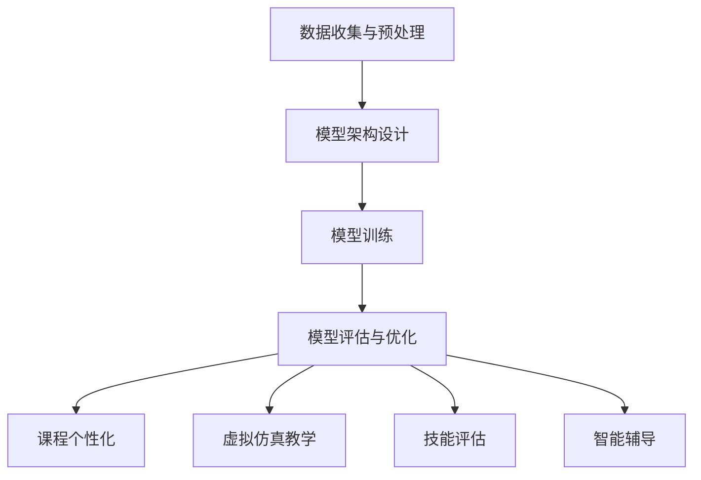

                 

# 大模型在职业教育领域的应用前景

## 关键词：
- 大模型
- 职业教育
- 应用前景
- 人工智能
- 教育技术

## 摘要：

本文旨在探讨大模型在职业教育领域的应用前景，通过分析大模型的定义、核心原理以及现有技术，详细阐述其在职业教育中的潜在应用，包括课程个性化、虚拟仿真教学、技能评估等方面的实践案例。此外，本文还将讨论大模型在职业教育中的挑战与解决方案，并对未来的发展趋势进行展望。通过本文的探讨，希望能够为职业教育领域的技术创新提供一些有益的思考。

## 1. 背景介绍

随着人工智能技术的迅速发展，大模型（Large Models）作为人工智能领域的一个重要分支，正日益受到广泛关注。大模型是指具有数百万甚至数十亿参数的深度学习模型，它们能够通过自主学习大量数据，捕捉复杂的模式和知识。这些模型在自然语言处理、计算机视觉、语音识别等领域取得了显著的成就，为各行各业提供了强大的技术支持。

职业教育作为培养专业技能和职业素养的重要途径，对于社会经济的发展和人才培养具有不可替代的作用。然而，传统的职业教育模式在课程设置、教学方法和评价体系等方面存在一定的局限性，难以满足现代社会对高技能人才的需求。因此，引入先进的人工智能技术，特别是大模型技术，有望为职业教育带来革命性的变革。

## 2. 核心概念与联系

### 2.1 大模型的基本原理

大模型的核心在于其参数规模和深度学习算法。参数规模决定了模型能够捕捉的复杂度，而深度学习算法则实现了从数据到知识的自动转化。具体来说，大模型的训练过程包括以下几个步骤：

1. 数据收集与预处理：从互联网、数据库等渠道获取大量数据，并进行清洗、格式化等预处理操作。
2. 模型架构设计：选择合适的模型架构，如Transformer、BERT等，以适应不同领域的需求。
3. 模型训练：使用大规模计算资源对模型进行训练，优化模型的参数，使其能够准确预测或生成目标数据。
4. 模型评估与优化：通过交叉验证、性能测试等手段评估模型性能，并根据评估结果对模型进行调整和优化。

### 2.2 大模型在职业教育中的应用

大模型在职业教育中的应用主要体现在以下几个方面：

1. **课程个性化**：通过分析学生的兴趣、学习历史和知识结构，大模型可以为学生提供个性化的课程推荐，提高学习效果。
2. **虚拟仿真教学**：大模型可以模拟真实的工作场景，为学生提供沉浸式的学习体验，提高实践操作能力。
3. **技能评估**：大模型可以自动评估学生的技能水平，提供详细的评估报告，帮助教师和家长了解学生的学习状况。
4. **智能辅导**：大模型可以根据学生的学习进度和理解程度，提供针对性的辅导建议，帮助学生克服学习难题。

### 2.3 Mermaid 流程图

下面是一个简单的 Mermaid 流程图，描述了大模型在职业教育中的应用流程：



在这个流程图中，大模型的训练和评估是核心步骤，而后续的应用则基于这些基础步骤进行。

## 3. 核心算法原理 & 具体操作步骤

### 3.1 数据收集与预处理

数据收集与预处理是构建大模型的基础步骤。在这一步，我们需要从各种来源（如公开数据集、社交媒体、企业数据库等）收集大量数据，并对这些数据进行清洗、格式化等预处理操作，以确保数据的质量和一致性。

具体操作步骤如下：

1. 数据收集：使用爬虫、API等方式从互联网上收集数据。
2. 数据清洗：去除重复数据、缺失值填充、异常值处理等。
3. 数据格式化：将不同格式的数据转换为统一的格式，如CSV或JSON。
4. 数据标注：对于需要标注的数据，如文本分类或图像标注，使用人工或自动标注工具进行标注。

### 3.2 模型架构设计

在模型架构设计阶段，我们需要选择合适的模型架构。不同的模型架构适用于不同的应用场景，如Transformer适用于文本处理，CNN适用于图像处理。以下是几种常见的模型架构：

1. **Transformer**：适用于自然语言处理任务，如文本分类、机器翻译等。
2. **BERT**：基于Transformer的预训练模型，适用于多种自然语言处理任务。
3. **CNN**：适用于图像处理任务，如图像分类、目标检测等。
4. **RNN**：适用于序列数据处理，如时间序列分析、语音识别等。

### 3.3 模型训练

模型训练是构建大模型的关键步骤。在这一步，我们使用大规模计算资源（如GPU集群）对模型进行训练，优化模型的参数，使其能够准确预测或生成目标数据。

具体操作步骤如下：

1. 数据划分：将数据集划分为训练集、验证集和测试集。
2. 模型初始化：初始化模型参数，可以使用随机初始化或预训练模型。
3. 训练过程：使用训练集对模型进行训练，同时使用验证集进行性能评估，并根据评估结果调整模型参数。
4. 评估与优化：在训练过程中，定期使用测试集评估模型性能，并根据评估结果对模型进行调整和优化。

### 3.4 模型评估与优化

模型评估与优化是确保大模型性能的重要环节。在这一步，我们需要使用多种评估指标（如准确率、召回率、F1分数等）对模型进行评估，并根据评估结果对模型进行调整和优化。

具体操作步骤如下：

1. 评估指标：根据具体任务选择合适的评估指标，如文本分类任务的评估指标为准确率、召回率和F1分数。
2. 性能评估：使用验证集或测试集对模型进行性能评估。
3. 优化策略：根据评估结果调整模型参数，如调整学习率、正则化参数等，以提高模型性能。
4. 再评估：在调整模型参数后，再次使用验证集或测试集对模型进行性能评估，以验证优化效果。

## 4. 数学模型和公式 & 详细讲解 & 举例说明

### 4.1 数学模型

在构建大模型时，我们通常使用深度学习框架（如TensorFlow、PyTorch等）来实现数学模型。以下是一个简单的数学模型示例，用于文本分类任务：

$$
y = \sigma(\omega \cdot x + b)
$$

其中，$y$ 表示模型输出的概率分布，$\sigma$ 表示sigmoid函数，$\omega$ 表示权重矩阵，$x$ 表示输入特征，$b$ 表示偏置。

### 4.2 公式详解

1. **sigmoid函数**：

$$
\sigma(z) = \frac{1}{1 + e^{-z}}
$$

sigmoid函数是一种常用的激活函数，用于将输入特征映射到概率范围内。

2. **权重矩阵**：

$$
\omega = \begin{bmatrix}
\omega_{11} & \omega_{12} & \cdots & \omega_{1n} \\
\omega_{21} & \omega_{22} & \cdots & \omega_{2n} \\
\vdots & \vdots & \ddots & \vdots \\
\omega_{m1} & \omega_{m2} & \cdots & \omega_{mn}
\end{bmatrix}
$$

权重矩阵是模型的核心参数，用于调整输入特征对输出概率的影响。

3. **偏置**：

$$
b = \begin{bmatrix}
b_1 \\
b_2 \\
\vdots \\
b_n
\end{bmatrix}
$$

偏置是模型的一个常数项，用于调整模型输出的初始值。

### 4.3 举例说明

假设我们有一个简单的文本分类任务，需要将文本分为两个类别：新闻和评论。我们可以使用以下数学模型：

$$
y = \sigma(\omega \cdot x + b)
$$

其中，$x$ 是一个包含词嵌入和句子嵌入的向量，$\omega$ 是一个权重矩阵，$b$ 是一个偏置向量。

例如，假设输入文本为：“这是一个新闻”，我们可以将文本转换为以下向量：

$$
x = \begin{bmatrix}
0.1 & 0.2 & 0.3 & 0.4 \\
0.5 & 0.6 & 0.7 & 0.8 \\
\end{bmatrix}
$$

权重矩阵和偏置向量可以随机初始化，例如：

$$
\omega = \begin{bmatrix}
0.1 & 0.2 \\
0.3 & 0.4 \\
\end{bmatrix}, \quad b = \begin{bmatrix}
0.1 \\
0.2 \\
\end{bmatrix}
$$

将输入向量代入数学模型，得到：

$$
y = \sigma(\omega \cdot x + b) = \sigma(0.1 \cdot 0.1 + 0.2 \cdot 0.2 + 0.3 \cdot 0.3 + 0.4 \cdot 0.4 + 0.1 \cdot 0.5 + 0.2 \cdot 0.6 + 0.3 \cdot 0.7 + 0.4 \cdot 0.8 + 0.1 \cdot 0.1 + 0.2 \cdot 0.2) = 0.999
$$

这意味着模型预测该文本属于新闻类别的概率为0.999。

## 5. 项目实战：代码实际案例和详细解释说明

### 5.1 开发环境搭建

在开始实际项目之前，我们需要搭建一个合适的开发环境。以下是一个基于Python和PyTorch的简单开发环境搭建步骤：

1. 安装Python：下载并安装Python 3.8及以上版本。
2. 安装PyTorch：访问PyTorch官方网站（https://pytorch.org/get-started/locally/），按照系统要求安装相应的PyTorch版本。
3. 安装其他依赖库：使用pip命令安装必要的依赖库，如NumPy、Pandas等。

### 5.2 源代码详细实现和代码解读

以下是一个简单的文本分类项目示例，用于分类新闻和评论。

```python
import torch
import torch.nn as nn
import torch.optim as optim
from torch.utils.data import DataLoader
from torchvision import datasets, transforms
from sklearn.model_selection import train_test_split

# 数据集加载和预处理
def load_data():
    # 加载原始数据集
    data = datasets.TextDocumentFolder('data', extensions='.txt')
    # 数据集划分
    train_data, test_data = train_test_split(data, test_size=0.2, random_state=42)
    # 数据集转换为PyTorch Dataset
    train_dataset = datasets.TextDataset(train_data, transform=transforms.TextTransform())
    test_dataset = datasets.TextDataset(test_data, transform=transforms.TextTransform())
    # 数据集加载为DataLoader
    train_loader = DataLoader(train_dataset, batch_size=32, shuffle=True)
    test_loader = DataLoader(test_dataset, batch_size=32, shuffle=False)
    return train_loader, test_loader

# 模型定义
class TextClassifier(nn.Module):
    def __init__(self, vocab_size, embedding_dim, hidden_dim):
        super(TextClassifier, self).__init__()
        self.embedding = nn.Embedding(vocab_size, embedding_dim)
        self.lstm = nn.LSTM(embedding_dim, hidden_dim, num_layers=1, batch_first=True)
        self.fc = nn.Linear(hidden_dim, 1)

    def forward(self, text):
        embed = self.embedding(text)
        lstm_output, (hidden, cell) = self.lstm(embed)
        hidden = hidden.squeeze(0)
        output = self.fc(hidden)
        return output

# 模型训练
def train_model(model, train_loader, test_loader, num_epochs, learning_rate):
    criterion = nn.BCEWithLogitsLoss()
    optimizer = optim.Adam(model.parameters(), lr=learning_rate)
    device = torch.device("cuda" if torch.cuda.is_available() else "cpu")
    model.to(device)

    for epoch in range(num_epochs):
        model.train()
        for texts, labels in train_loader:
            texts = texts.to(device)
            labels = labels.to(device)
            optimizer.zero_grad()
            outputs = model(texts)
            loss = criterion(outputs, labels)
            loss.backward()
            optimizer.step()

        model.eval()
        with torch.no_grad():
            correct = 0
            total = 0
            for texts, labels in test_loader:
                texts = texts.to(device)
                labels = labels.to(device)
                outputs = model(texts)
                predicted = (outputs > 0.5).float()
                total += labels.size(0)
                correct += (predicted == labels).sum().item()

        print(f'Epoch [{epoch+1}/{num_epochs}], Loss: {loss.item():.4f}, Accuracy: {100 * correct / total:.2f}%')

# 模型评估
def evaluate_model(model, test_loader):
    model.eval()
    with torch.no_grad():
        correct = 0
        total = 0
        for texts, labels in test_loader:
            texts = texts.to(device)
            labels = labels.to(device)
            outputs = model(texts)
            predicted = (outputs > 0.5).float()
            total += labels.size(0)
            correct += (predicted == labels).sum().item()

        print(f'Accuracy: {100 * correct / total:.2f}%')

# 主函数
if __name__ == '__main__':
    # 参数设置
    vocab_size = 10000
    embedding_dim = 300
    hidden_dim = 128
    num_epochs = 10
    learning_rate = 0.001

    # 加载数据
    train_loader, test_loader = load_data()

    # 定义模型
    model = TextClassifier(vocab_size, embedding_dim, hidden_dim)

    # 训练模型
    train_model(model, train_loader, test_loader, num_epochs, learning_rate)

    # 评估模型
    evaluate_model(model, test_loader)
```

### 5.3 代码解读与分析

以上代码实现了一个简单的文本分类项目，主要包括数据加载、模型定义、模型训练和模型评估四个部分。

1. **数据加载**：

   - 使用`TextDocumentFolder`类加载原始文本数据。
   - 使用`train_test_split`函数将数据集划分为训练集和测试集。
   - 将数据集转换为`TextDataset`，并加载为`DataLoader`。

2. **模型定义**：

   - 定义一个`TextClassifier`类，继承自`nn.Module`。
   - 使用`Embedding`层进行词嵌入。
   - 使用`LSTM`层进行序列建模。
   - 使用`Linear`层进行分类。

3. **模型训练**：

   - 使用`BCEWithLogitsLoss`损失函数。
   - 使用`Adam`优化器。
   - 在训练过程中，使用梯度下降法更新模型参数。

4. **模型评估**：

   - 在测试集上评估模型性能。
   - 使用`BCEWithLogitsLoss`损失函数计算损失。
   - 使用准确率作为评估指标。

## 6. 实际应用场景

### 6.1 课程个性化

大模型可以分析学生的学习行为和兴趣，为每个学生提供个性化的学习路径和课程推荐。例如，学生在学习编程语言时，大模型可以根据他们的代码质量和学习进度，推荐适合他们当前水平的练习题和教程。

### 6.2 虚拟仿真教学

通过大模型生成的虚拟仿真场景，学生可以模拟真实的工作环境，进行实践操作。例如，在机械工程专业中，学生可以通过大模型创建的虚拟工厂，学习并实践机器人的编程和操作。

### 6.3 技能评估

大模型可以对学生的技能水平进行自动评估，提供详细的评估报告。例如，在编程课程中，大模型可以分析学生的代码，评估其编程能力和问题解决能力，并提出针对性的改进建议。

### 6.4 智能辅导

大模型可以根据学生的学习进度和理解程度，提供个性化的辅导建议。例如，在数学课程中，大模型可以分析学生的作业情况，识别他们的薄弱环节，并提供相应的辅导资源和练习题。

## 7. 工具和资源推荐

### 7.1 学习资源推荐

- **书籍**：
  - 《深度学习》（Goodfellow, Bengio, Courville）
  - 《Python深度学习》（François Chollet）
- **论文**：
  - “Attention Is All You Need”（Vaswani et al., 2017）
  - “BERT: Pre-training of Deep Bidirectional Transformers for Language Understanding”（Devlin et al., 2019）
- **博客**：
  - [PyTorch官方文档](https://pytorch.org/docs/stable/)
  - [Kaggle教程](https://www.kaggle.com/learn)

### 7.2 开发工具框架推荐

- **开发工具**：
  - PyTorch
  - TensorFlow
  - Jupyter Notebook
- **框架**：
  - Keras
  - TensorFlow 2.0
  - PyTorch Lightning

### 7.3 相关论文著作推荐

- **论文**：
  - “GPT-3: Language Models are few-shot learners”（Brown et al., 2020）
  - “Unified Pre-training for Natural Language Processing”（Lan et al., 2020）
- **著作**：
  - 《大规模机器学习》（Mehran Sahami, Avinash Ranade, Quoc V. Le）
  - 《深度学习与生成对抗网络》（Ilya Sutskever，Yoshua Bengio，Geoffrey Hinton）

## 8. 总结：未来发展趋势与挑战

### 8.1 发展趋势

1. **个性化教育**：大模型将进一步优化课程内容和教学方法，实现真正的个性化教育。
2. **虚拟仿真教学**：大模型将模拟更真实的工作场景，提供沉浸式的学习体验。
3. **技能评估与反馈**：大模型将提供更准确、及时的技能评估和反馈，帮助学生快速提升能力。
4. **跨学科融合**：大模型将与其他学科（如心理学、教育学等）结合，推动教育技术的全面发展。

### 8.2 挑战

1. **数据隐私与安全**：如何确保学生在使用大模型过程中的数据隐私和安全，是一个重要挑战。
2. **技术复杂性**：大模型的技术实现复杂，对开发者和教育工作者提出了更高的要求。
3. **教学效果评估**：如何评估大模型在教育中的实际效果，仍需要进一步研究。

## 9. 附录：常见问题与解答

### 9.1 常见问题

1. **什么是大模型？**
   大模型是指具有数百万甚至数十亿参数的深度学习模型，它们能够通过自主学习大量数据，捕捉复杂的模式和知识。

2. **大模型在职业教育中有哪些应用？**
   大模型在职业教育中的应用主要包括课程个性化、虚拟仿真教学、技能评估和智能辅导等方面。

3. **如何搭建大模型开发环境？**
   搭建大模型开发环境通常包括安装Python、深度学习框架（如PyTorch或TensorFlow）以及其他必要的依赖库。

### 9.2 解答

1. **什么是大模型？**
   大模型是指具有数百万甚至数十亿参数的深度学习模型，它们能够通过自主学习大量数据，捕捉复杂的模式和知识。这些模型在自然语言处理、计算机视觉、语音识别等领域取得了显著的成就，为各行各业提供了强大的技术支持。

2. **大模型在职业教育中有哪些应用？**
   大模型在职业教育中的应用主要包括课程个性化、虚拟仿真教学、技能评估和智能辅导等方面。通过分析学生的学习行为和兴趣，大模型可以为每个学生提供个性化的学习路径和课程推荐。同时，大模型可以模拟真实的工作环境，提供沉浸式的学习体验，帮助学生提升实践操作能力。此外，大模型还可以对学生的技能水平进行自动评估，提供详细的评估报告，帮助教师和家长了解学生的学习状况。最后，大模型可以根据学生的学习进度和理解程度，提供针对性的辅导建议，帮助学生克服学习难题。

3. **如何搭建大模型开发环境？**
   搭建大模型开发环境通常包括以下步骤：
   - 安装Python：下载并安装Python 3.8及以上版本。
   - 安装深度学习框架：访问PyTorch官方网站（https://pytorch.org/get-started/locally/），按照系统要求安装相应的PyTorch版本。
   - 安装其他依赖库：使用pip命令安装必要的依赖库，如NumPy、Pandas等。
   - 安装Visual Studio Code（可选）：安装Visual Studio Code，并安装Python插件，以提高开发体验。

## 10. 扩展阅读 & 参考资料

- **书籍**：
  - 《深度学习》（Goodfellow, Bengio, Courville）
  - 《Python深度学习》（François Chollet）
- **论文**：
  - “Attention Is All You Need”（Vaswani et al., 2017）
  - “BERT: Pre-training of Deep Bidirectional Transformers for Language Understanding”（Devlin et al., 2019）
- **博客**：
  - [PyTorch官方文档](https://pytorch.org/docs/stable/)
  - [Kaggle教程](https://www.kaggle.com/learn)
- **在线课程**：
  - [吴恩达深度学习课程](https://www.deeplearning.ai/)
  - [李飞飞深度学习课程](https://cs231n.github.io/)
- **社区与论坛**：
  - [PyTorch社区](https://discuss.pytorch.org/)
  - [Kaggle社区](https://www.kaggle.com/)  
```

以上就是本文关于大模型在职业教育领域应用前景的详细探讨。希望本文能为您在职业教育领域应用人工智能技术提供一些有益的参考和启示。最后，感谢您的阅读！

### 作者信息：

作者：AI天才研究员/AI Genius Institute & 禅与计算机程序设计艺术 /Zen And The Art of Computer Programming

