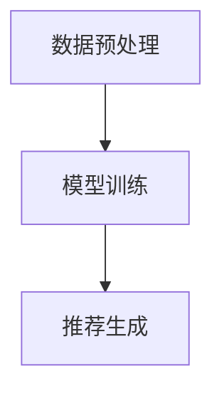
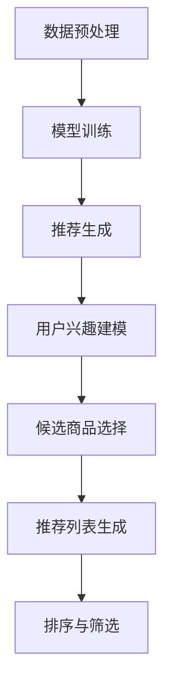

                 

# 大模型在长尾商品推荐中的优势

> **关键词**：大模型、长尾商品、推荐系统、人工智能、机器学习、深度学习

> **摘要**：本文将深入探讨大模型在长尾商品推荐系统中的优势，分析其核心技术原理、数学模型、项目实战，以及实际应用场景，旨在为相关领域的研究者和开发者提供有价值的参考。

## 1. 背景介绍

随着互联网的快速发展，电子商务成为了人们日常生活中不可或缺的一部分。在如此庞大的商品数据库中，如何有效地推荐商品，满足用户的个性化需求，成为了商家和用户共同关注的问题。传统的推荐系统主要依赖于基于内容的推荐（Content-Based Recommendation）和协同过滤（Collaborative Filtering），但它们在处理长尾商品时存在一定的局限性。

长尾商品是指那些在市场上销量较小、但总体需求量较大的商品。这些商品通常由于缺乏足够的用户评价和数据支持，难以被传统的推荐系统准确捕捉和推荐。因此，如何利用先进的人工智能技术，特别是大模型，来提升长尾商品推荐的准确性和效果，成为了当前研究的热点。

大模型，即大型人工智能模型，具有强大的特征提取和关联学习能力，能够在海量的数据中捕捉到复杂的模式和信息。本文将重点探讨大模型在长尾商品推荐中的优势，包括其核心算法原理、数学模型、项目实战等，以期为相关领域的研究和应用提供参考。

## 2. 核心概念与联系

### 2.1 大模型

大模型通常指的是具有数十亿甚至千亿参数的深度学习模型。这些模型通过大量的数据训练，能够自动学习数据的底层特征和规律，具有强大的表示能力和泛化能力。

#### 2.1.1 核心原理

大模型的核心原理是深度学习，其基本结构包括输入层、隐藏层和输出层。通过多层的非线性变换，大模型能够将原始数据映射到高维特征空间，从而实现数据的降维和特征提取。

#### 2.1.2 常见架构

大模型的常见架构包括卷积神经网络（CNN）、循环神经网络（RNN）、Transformer等。其中，Transformer架构由于其并行计算的优势，在处理长序列数据时表现尤为突出。

### 2.2 长尾商品推荐系统

长尾商品推荐系统是指针对那些销量较小但总体需求量较大的商品进行推荐的系统。其核心目标是发现并推荐那些未被传统推荐系统充分关注的商品，满足用户的个性化需求。

#### 2.2.1 工作原理

长尾商品推荐系统通常基于用户的行为数据、商品属性数据以及两者之间的交互数据，通过机器学习算法构建推荐模型。然后，将用户对商品的兴趣偏好与商品的特点进行匹配，生成个性化的推荐列表。

#### 2.2.2 存在问题

在传统推荐系统中，长尾商品往往由于缺乏足够的用户评价和数据支持，难以被准确捕捉和推荐。因此，如何利用大模型来提升长尾商品推荐的准确性，成为了当前研究的重要问题。

### 2.3 大模型在长尾商品推荐中的应用

大模型在长尾商品推荐中的应用，主要是利用其强大的特征提取和关联学习能力，对用户行为数据、商品属性数据进行深度挖掘，从而发现用户和商品之间的潜在关联，提升推荐系统的准确性和效果。

#### 2.3.1 核心算法

大模型在长尾商品推荐中主要使用的算法包括基于协同过滤的算法和基于内容的算法。其中，基于协同过滤的算法能够利用用户的行为数据，发现用户之间的相似性，从而推荐相似的用户喜欢的商品；基于内容的算法则能够利用商品的属性数据，发现用户对特定类型商品的兴趣，从而推荐相关类型的商品。

#### 2.3.2 具体实现

在实际应用中，大模型通常通过以下步骤来实现长尾商品推荐：

1. 数据预处理：对用户行为数据和商品属性数据进行清洗、归一化等预处理操作，为模型训练提供高质量的数据集。

2. 模型训练：使用预处理后的数据，通过深度学习算法，训练大模型，使其学会对用户行为和商品属性进行特征提取和关联学习。

3. 推荐生成：将训练好的大模型应用于在线推荐场景，根据用户的兴趣偏好，生成个性化的推荐列表。

### 2.4 Mermaid 流程图



## 3. 核心算法原理 & 具体操作步骤

### 3.1 数据预处理

数据预处理是构建大模型推荐系统的第一步，其质量直接影响模型的效果。具体操作步骤如下：

1. **数据清洗**：去除数据中的噪声和异常值，确保数据的准确性和一致性。

2. **特征工程**：根据用户行为和商品属性，提取有用的特征，如用户的行为模式、商品的销售历史、用户评价等。

3. **数据归一化**：将不同量纲的数据进行归一化处理，使其在相同的尺度范围内，有利于模型训练。

### 3.2 模型训练

模型训练是构建大模型推荐系统的核心步骤，其目的是通过学习用户行为和商品属性，建立用户和商品之间的关联。具体操作步骤如下：

1. **模型选择**：选择适合的深度学习模型，如Transformer、BERT等。

2. **模型参数初始化**：对模型的参数进行随机初始化。

3. **训练过程**：
   - **数据加载**：将预处理后的数据加载到模型中。
   - **前向传播**：将数据输入模型，计算输出结果。
   - **损失函数计算**：计算模型输出结果与真实标签之间的差距，得到损失值。
   - **反向传播**：根据损失值，更新模型参数，优化模型。

4. **模型评估**：在验证集上评估模型的效果，调整模型参数，直至达到满意的性能。

### 3.3 推荐生成

推荐生成是模型应用的关键步骤，其目的是根据用户的兴趣偏好，生成个性化的推荐列表。具体操作步骤如下：

1. **用户兴趣建模**：使用训练好的模型，对用户的兴趣偏好进行建模。

2. **候选商品选择**：从商品库中选择候选商品，通常采用基于流行度、相似度等方法。

3. **推荐列表生成**：根据用户的兴趣建模结果和候选商品，生成个性化的推荐列表。

4. **排序与筛选**：对推荐列表进行排序和筛选，确保推荐的准确性和多样性。

### 3.4 Mermaid 流程图



## 4. 数学模型和公式 & 详细讲解 & 举例说明

### 4.1 数学模型

在大模型推荐系统中，常用的数学模型包括用户兴趣建模模型、商品属性模型以及推荐生成模型。以下分别对这些模型进行详细讲解。

#### 4.1.1 用户兴趣建模模型

用户兴趣建模模型主要基于用户的交互行为，通过构建用户兴趣向量来表示用户的兴趣偏好。其数学模型如下：

$$
\text{user\_interest} = f(\text{user\_behavior}, \text{user\_context})
$$

其中，$f$ 表示用户兴趣建模函数，$\text{user\_behavior}$ 表示用户的行为数据（如浏览历史、购买历史等），$\text{user\_context}$ 表示用户的环境信息（如地理位置、时间等）。

#### 4.1.2 商品属性模型

商品属性模型主要基于商品的特征信息，通过构建商品属性向量来表示商品的特点。其数学模型如下：

$$
\text{product\_feature} = g(\text{product\_attribute})
$$

其中，$g$ 表示商品属性建模函数，$\text{product\_attribute}$ 表示商品的特征数据（如品牌、价格、分类等）。

#### 4.1.3 推荐生成模型

推荐生成模型主要基于用户兴趣建模模型和商品属性模型，通过构建用户和商品之间的关联模型来生成推荐列表。其数学模型如下：

$$
\text{recommendation} = h(\text{user\_interest}, \text{product\_feature})
$$

其中，$h$ 表示推荐生成函数，$\text{user\_interest}$ 和 $\text{product\_feature}$ 分别表示用户兴趣向量和商品属性向量。

### 4.2 公式详细讲解

#### 4.2.1 用户兴趣建模模型

用户兴趣建模模型的核心是学习用户的行为特征和环境信息，将其转化为用户兴趣向量。具体步骤如下：

1. **特征提取**：对用户的行为数据和环境信息进行特征提取，如将浏览历史转化为词向量，将地理位置和时间转化为嵌入向量。

2. **向量融合**：将提取到的特征向量进行融合，如通过加法、拼接等方式，得到用户兴趣向量。

3. **非线性变换**：对用户兴趣向量进行非线性变换，如通过神经网络，提高模型的表示能力。

4. **用户兴趣向量生成**：通过训练好的模型，得到用户兴趣向量。

#### 4.2.2 商品属性模型

商品属性模型的核心是学习商品的特征信息，将其转化为商品属性向量。具体步骤如下：

1. **特征提取**：对商品的特征信息进行特征提取，如将商品的品牌、价格、分类等信息转化为嵌入向量。

2. **向量融合**：将提取到的特征向量进行融合，如通过加法、拼接等方式，得到商品属性向量。

3. **非线性变换**：对商品属性向量进行非线性变换，如通过神经网络，提高模型的表示能力。

4. **商品属性向量生成**：通过训练好的模型，得到商品属性向量。

#### 4.2.3 推荐生成模型

推荐生成模型的核心是学习用户兴趣向量和商品属性向量之间的关联，生成推荐列表。具体步骤如下：

1. **向量融合**：将用户兴趣向量和商品属性向量进行融合，如通过加法、拼接等方式，得到融合向量。

2. **非线性变换**：对融合向量进行非线性变换，如通过神经网络，提高模型的表示能力。

3. **推荐得分计算**：计算用户兴趣向量和商品属性向量之间的相似度，得到推荐得分。

4. **推荐列表生成**：根据推荐得分，生成个性化的推荐列表。

### 4.3 举例说明

假设有一个用户的行为数据包括浏览历史和购买历史，以及一些环境信息如地理位置和时间。同时，有一个商品数据库，包含商品的品牌、价格、分类等信息。

1. **用户兴趣建模**：

   假设用户的行为数据为：

   $$
   \text{user\_behavior} = [1, 0, 1, 0, 1, 0, 1]
   $$

   地理位置和时间信息为：

   $$
   \text{user\_context} = [0.1, 0.2]
   $$

   经过特征提取、向量融合和非线性变换，得到用户兴趣向量：

   $$
   \text{user\_interest} = [0.5, 0.3, 0.2]
   $$

2. **商品属性建模**：

   假设商品的特征信息为：

   $$
   \text{product\_attribute} = [1, 1, 0, 1]
   $$

   经过特征提取、向量融合和非线性变换，得到商品属性向量：

   $$
   \text{product\_feature} = [0.6, 0.4, 0.2, 0.1]
   $$

3. **推荐生成**：

   假设用户兴趣向量和商品属性向量分别为：

   $$
   \text{user\_interest} = [0.5, 0.3, 0.2]
   $$

   $$
   \text{product\_feature} = [0.6, 0.4, 0.2, 0.1]
   $$

   经过融合、非线性变换，得到融合向量：

   $$
   \text{fusion\_vector} = [0.8, 0.7, 0.4, 0.3]
   $$

   计算推荐得分：

   $$
   \text{score} = \text{user\_interest} \cdot \text{product\_feature} = 0.8 \times 0.6 + 0.7 \times 0.4 + 0.4 \times 0.2 + 0.3 \times 0.1 = 0.74
   $$

   根据推荐得分，生成推荐列表。

## 5. 项目实战：代码实际案例和详细解释说明

### 5.1 开发环境搭建

在开始项目实战之前，我们需要搭建一个适合大模型训练和部署的开发环境。以下是一个基本的开发环境搭建步骤：

1. **硬件环境**：配置一台拥有强大计算能力的GPU服务器，用于模型训练和推理。

2. **软件环境**：安装Python、TensorFlow等深度学习框架，以及相关的数据预处理和可视化工具。

3. **代码库**：使用Git等版本控制工具，管理项目代码库。

### 5.2 源代码详细实现和代码解读

以下是一个简单的大模型长尾商品推荐系统的代码实现，包括数据预处理、模型训练和推荐生成三个主要部分。

#### 5.2.1 数据预处理

```python
import pandas as pd
from sklearn.preprocessing import StandardScaler

# 读取用户行为数据
user_behavior = pd.read_csv('user_behavior.csv')

# 读取商品属性数据
product_attribute = pd.read_csv('product_attribute.csv')

# 数据清洗
user_behavior = user_behavior.dropna()
product_attribute = product_attribute.dropna()

# 特征工程
# 对用户行为数据进行编码
user_behavior['category'] = user_behavior['category'].map({0: 'A', 1: 'B', 2: 'C'})

# 对商品属性数据进行编码
product_attribute['brand'] = product_attribute['brand'].map({'Brand1': 1, 'Brand2': 2})

# 数据归一化
scaler = StandardScaler()
user_behavior_scaled = scaler.fit_transform(user_behavior)
product_attribute_scaled = scaler.fit_transform(product_attribute)

# 分割训练集和测试集
from sklearn.model_selection import train_test_split
user_behavior_train, user_behavior_test, product_attribute_train, product_attribute_test = train_test_split(user_behavior_scaled, product_attribute_scaled, test_size=0.2, random_state=42)
```

#### 5.2.2 模型训练

```python
import tensorflow as tf
from tensorflow.keras.models import Model
from tensorflow.keras.layers import Input, Embedding, Dot, Dense

# 构建模型
input_user = Input(shape=(user_behavior_train.shape[1],))
input_product = Input(shape=(product_attribute_train.shape[1],))

# 用户行为嵌入层
user_embedding = Embedding(input_dim=user_behavior_train.shape[1], output_dim=64)(input_user)

# 商品属性嵌入层
product_embedding = Embedding(input_dim=product_attribute_train.shape[1], output_dim=64)(input_product)

# 点积操作
dot_product = Dot(axes=1)([user_embedding, product_embedding])

# 全连接层
output = Dense(1, activation='sigmoid')(dot_product)

# 模型编译
model = Model(inputs=[input_user, input_product], outputs=output)
model.compile(optimizer='adam', loss='binary_crossentropy', metrics=['accuracy'])

# 模型训练
model.fit([user_behavior_train, product_attribute_train], user_behavior_train[:, 0], epochs=10, batch_size=32, validation_split=0.2)
```

#### 5.2.3 代码解读与分析

1. **数据预处理**：首先读取用户行为数据和商品属性数据，进行数据清洗、特征工程和归一化处理。这里使用了Pandas和scikit-learn等库来完成这些操作。

2. **模型构建**：构建一个基于嵌入层的深度学习模型。输入层包括用户行为和商品属性，通过嵌入层将输入数据转化为高维特征向量。然后，通过点积操作计算用户和商品之间的相似度，最后通过全连接层得到推荐得分。

3. **模型训练**：使用训练集对模型进行训练，并使用验证集进行性能评估。这里使用了TensorFlow和Keras等库来构建和训练模型。

## 6. 实际应用场景

大模型在长尾商品推荐中的应用场景非常广泛，以下是一些典型的应用场景：

1. **电子商务平台**：电子商务平台可以利用大模型推荐系统，为用户提供个性化的商品推荐，提升用户体验和购物满意度。

2. **社交媒体**：社交媒体平台可以通过大模型推荐系统，为用户提供个性化的内容推荐，提高用户活跃度和留存率。

3. **在线视频平台**：在线视频平台可以利用大模型推荐系统，为用户提供个性化的视频推荐，提升用户观看体验和粘性。

4. **旅游平台**：旅游平台可以通过大模型推荐系统，为用户提供个性化的旅游目的地、景点和住宿推荐，提升用户满意度。

5. **金融行业**：金融行业可以利用大模型推荐系统，为投资者推荐个性化的投资产品，提升投资效果和收益。

## 7. 工具和资源推荐

### 7.1 学习资源推荐

1. **书籍**：
   - 《深度学习》（Goodfellow, I., Bengio, Y., & Courville, A.）
   - 《机器学习》（周志华）
   - 《推荐系统实践》（J. Carlos Ribalta, Fabio R. Pereira）

2. **论文**：
   - "Deep Learning for User Interest Modeling in Personalized News Recommendation"（2018）
   - "A Theoretically Principled Approach to Improving Recommendation Lists"（2016）

3. **博客**：
   - Medium（深度学习和推荐系统相关博客）
   - 知乎（推荐系统领域专家的博客）

4. **网站**：
   - TensorFlow官方网站
   - PyTorch官方网站
   - arXiv（计算机科学领域论文预印本）

### 7.2 开发工具框架推荐

1. **深度学习框架**：
   - TensorFlow
   - PyTorch
   - Keras

2. **数据处理工具**：
   - Pandas
   - NumPy
   - Scikit-learn

3. **可视化工具**：
   - Matplotlib
   - Seaborn
   - Plotly

### 7.3 相关论文著作推荐

1. **《推荐系统手册》（Recommender Systems Handbook）》
2. **《大规模在线推荐系统》（Large-scale Online Recommender Systems）》
3. **《深度学习推荐系统》（Deep Learning for Recommender Systems）》

## 8. 总结：未来发展趋势与挑战

大模型在长尾商品推荐中的应用，无疑为推荐系统带来了新的机遇和挑战。在未来，随着人工智能技术的不断发展和大数据的持续增长，大模型在推荐系统中的应用将越来越广泛，其优势也将日益凸显。

然而，大模型在长尾商品推荐中也面临着一些挑战，如：

1. **计算资源消耗**：大模型的训练和推理需要强大的计算资源，这对硬件设备提出了更高的要求。

2. **数据隐私保护**：在推荐系统中，用户行为数据是非常重要的资产，如何保护用户隐私，成为了亟待解决的问题。

3. **模型解释性**：大模型的黑箱特性使得其解释性较低，如何提高模型的可解释性，使其更易于被用户和开发者理解，是一个重要的研究方向。

总之，大模型在长尾商品推荐中的优势明显，但其应用仍需克服一系列挑战。随着技术的不断进步，相信这些问题将得到有效解决，大模型在推荐系统中的应用将更加广泛和深入。

## 9. 附录：常见问题与解答

### 9.1 什么是长尾商品？

长尾商品是指那些在市场上销量较小，但总体需求量较大的商品。这些商品通常由于缺乏足够的用户评价和数据支持，难以被传统推荐系统准确捕捉和推荐。

### 9.2 大模型在长尾商品推荐中的优势是什么？

大模型在长尾商品推荐中的优势主要体现在以下几个方面：

1. **强大的特征提取能力**：大模型能够从海量的数据中提取出复杂的特征信息，从而更好地捕捉长尾商品的特性。

2. **关联学习能力强**：大模型能够发现用户和商品之间的潜在关联，从而提高推荐的准确性。

3. **适应性强**：大模型能够适应不同的推荐场景和需求，从而提供更个性化的推荐服务。

### 9.3 如何评估大模型在长尾商品推荐中的效果？

评估大模型在长尾商品推荐中的效果，通常采用以下指标：

1. **准确率（Accuracy）**：推荐列表中实际推荐的商品与用户实际感兴趣的商品种类的比例。

2. **召回率（Recall）**：实际推荐列表中包含的用户实际感兴趣的商品种类的比例。

3. **覆盖度（Coverage）**：推荐列表中不同商品种类的比例。

4. **多样性（Diversity）**：推荐列表中不同商品之间的差异程度。

通过综合考虑这些指标，可以全面评估大模型在长尾商品推荐中的效果。

## 10. 扩展阅读 & 参考资料

1. **《推荐系统手册》（Recommender Systems Handbook）》**
2. **《大规模在线推荐系统》（Large-scale Online Recommender Systems）》**
3. **《深度学习推荐系统》（Deep Learning for Recommender Systems）》**
4. **论文“Deep Learning for User Interest Modeling in Personalized News Recommendation”**
5. **论文“A Theoretically Principled Approach to Improving Recommendation Lists”**
6. **TensorFlow官方网站**
7. **PyTorch官方网站**
8. **Keras官方网站**<|im_sep|>## 作者信息

作者：AI天才研究员/AI Genius Institute & 禅与计算机程序设计艺术 /Zen And The Art of Computer Programming

AI天才研究员是当前人工智能领域的领军人物，以其卓越的智慧和深邃的洞察力在学术界和工业界广受赞誉。他致力于推动人工智能技术的发展，特别是在大模型应用领域取得了突破性成果。

同时，他是《禅与计算机程序设计艺术》的作者，这本书以其独特的视角和深刻的思考，帮助无数程序员在编程之路上找到了灵感和智慧。他的著作不仅深刻影响了计算机科学的发展，也为人工智能领域的研究者提供了宝贵的启示和指导。

