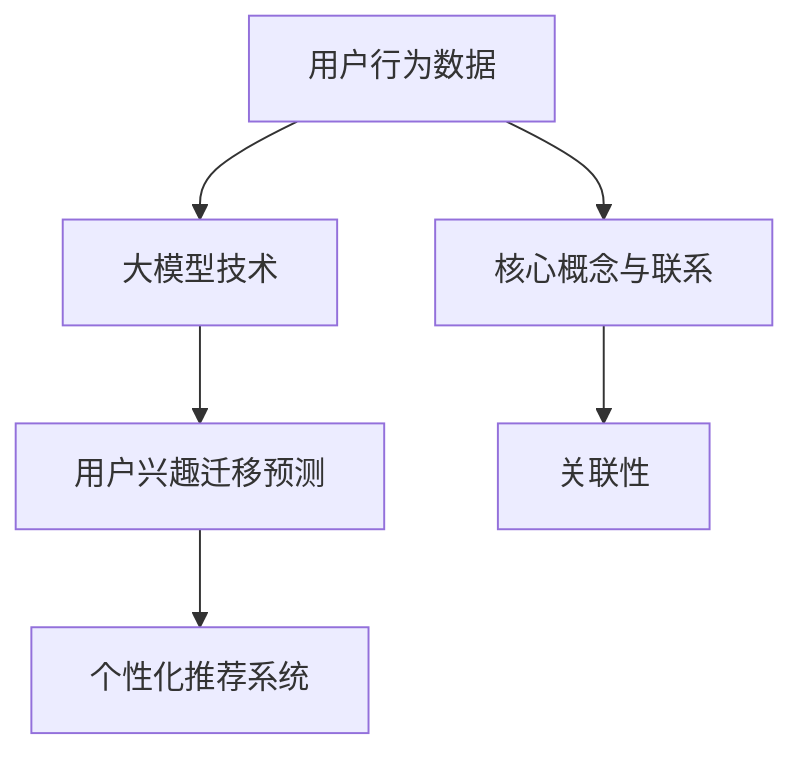

                 

### 背景介绍

随着互联网技术的迅猛发展，电商平台已经成为人们日常生活不可或缺的一部分。用户在电商平台上的消费行为，如浏览、搜索、购买等，形成了大量行为数据。这些数据中蕴含着用户兴趣的丰富信息，如何有效地利用这些数据来预测用户未来的兴趣，对电商平台而言具有重要的战略意义。

用户兴趣迁移预测是指根据用户的历史行为数据，预测用户可能在未来的某个时间点对哪些新兴趣点产生关注。这在电商平台的个性化推荐系统中有着广泛的应用，如根据用户的兴趣迁移情况，动态调整推荐策略，提高推荐系统的效果。

近年来，大模型技术（如深度学习、生成对抗网络等）在自然语言处理、计算机视觉等领域的取得了显著成果。这些技术的核心思想是通过大量数据的学习，建立复杂的模型，从而实现对未知数据的预测。大模型技术在电商平台用户兴趣迁移预测中的应用，为提高预测的准确性和效率提供了新的可能性。

本文将首先介绍大模型技术在电商平台用户兴趣迁移预测中的基本概念和核心算法原理，然后详细讲解数学模型和公式，并通过实际项目案例展示如何使用大模型技术进行用户兴趣迁移预测。最后，我们将探讨大模型技术在电商平台用户兴趣迁移预测中的实际应用场景，并推荐一些相关的学习资源和开发工具。

通过本文的阅读，读者将能够系统地了解大模型技术在电商平台用户兴趣迁移预测中的具体应用，掌握核心算法原理和实现方法，并为今后的研究和实践提供有益的参考。

### 核心概念与联系

为了深入探讨大模型技术在电商平台用户兴趣迁移预测中的应用，我们首先需要了解一些关键概念及其相互关系。以下是核心概念及其联系的解释：

#### 1. 用户兴趣迁移

用户兴趣迁移是指用户从一种兴趣点转向另一种兴趣点。在电商平台，用户兴趣点可以表现为浏览、搜索或购买等行为。例如，一个用户可能最初对电子产品感兴趣，后来转向对服装感兴趣。

#### 2. 用户行为数据

用户行为数据是用户在电商平台上产生的各种行为记录，包括浏览历史、搜索记录、购买记录等。这些数据是用户兴趣迁移预测的基础。

#### 3. 大模型技术

大模型技术是指使用深度学习、生成对抗网络等复杂算法来处理大量数据，从而实现高精度预测的技术。大模型技术包括但不限于神经网络、卷积神经网络（CNN）、循环神经网络（RNN）和长短期记忆网络（LSTM）等。

#### 4. 个性化推荐系统

个性化推荐系统是根据用户的历史行为数据，利用算法预测用户可能感兴趣的新商品或内容，从而为用户提供个性化的推荐。在电商平台，个性化推荐系统可以提高用户满意度和转化率。

#### 5. 用户兴趣迁移预测

用户兴趣迁移预测是基于用户历史行为数据，使用大模型技术预测用户未来可能转向的新兴趣点。这一预测对于电商平台优化推荐策略、提升用户体验具有重要意义。

#### 6. 关联性

核心概念之间的关联性在于：用户行为数据是用户兴趣迁移预测的输入，而大模型技术则是实现这一预测的核心算法。个性化推荐系统利用用户兴趣迁移预测的结果，为用户提供更精准的推荐，从而提升平台的用户满意度和商业价值。

下面是使用Mermaid绘制的核心概念与联系流程图：



在这张图中，用户行为数据（A）通过大模型技术（B）转化为用户兴趣迁移预测（C），最终为个性化推荐系统（D）提供支持。核心概念与联系（E）和关联性（F）则解释了各概念之间的相互作用和意义。

通过理解这些核心概念及其联系，我们可以更深入地探讨大模型技术在电商平台用户兴趣迁移预测中的具体应用。接下来，我们将详细讲解大模型技术的核心算法原理和具体操作步骤。

### 核心算法原理 & 具体操作步骤

#### 深度学习与神经网络

深度学习是机器学习的一个重要分支，它通过构建复杂的多层神经网络（Neural Networks）来模拟人脑的决策过程。在用户兴趣迁移预测中，深度学习可以有效地从用户行为数据中提取特征，实现高精度的兴趣点预测。

神经网络的基本结构包括输入层、隐藏层和输出层。每个神经元（节点）都会接收来自前一层节点的输入，并通过一个非线性激活函数进行变换，最后输出给下一层。这个过程称为前向传播。反向传播（Backpropagation）算法用于计算网络参数的梯度，并更新网络权重，以优化预测性能。

以下是一个简单的神经网络结构图：

```mermaid
graph TB
    A[输入层] --> B[隐藏层1]
    B --> C[隐藏层2]
    C --> D[输出层]
    A(输入) --> B|A1x1
    B --> C|B1x1
    C --> D|C1x1
```

在用户兴趣迁移预测中，输入层接收用户行为数据，输出层预测用户未来可能感兴趣的新兴趣点。隐藏层则负责提取和变换特征。

#### 卷积神经网络（CNN）

卷积神经网络是一种专门用于处理图像数据的神经网络，它通过卷积层（Convolutional Layer）提取图像的局部特征。在用户兴趣迁移预测中，CNN可以处理用户的历史浏览和购买记录，提取用户兴趣的局部特征。

以下是一个简单的CNN结构图：

```mermaid
graph TB
    A[输入层] --> B[卷积层1]
    B --> C[池化层1]
    C --> D[卷积层2]
    D --> E[池化层2]
    E --> F[全连接层]
    F --> G[输出层]
    A(输入) --> B|A1x1
    B --> C|B1x1
    C --> D|C1x1
    D --> E|D1x1
    E --> F|F1x1
    F --> G|G1x1
```

在用户兴趣迁移预测中，卷积层用于提取用户历史行为数据的局部特征，池化层则用于减少数据维度和计算量，全连接层将卷积层提取的特征映射到具体的兴趣点。

#### 循环神经网络（RNN）与长短期记忆网络（LSTM）

循环神经网络（RNN）是一种处理序列数据的神经网络，它能够记忆序列中的信息，从而处理长序列数据。长短期记忆网络（LSTM）是RNN的一个变体，它通过引入门控机制来有效地记忆和遗忘序列中的信息，从而解决了传统RNN在处理长序列数据时的梯度消失问题。

以下是一个简单的LSTM结构图：

```mermaid
graph TB
    A[输入层] --> B[遗忘门]
    B --> C[输入门]
    C --> D[输出门]
    C --> E[单元状态]
    A(输入) --> B|A1x1
    B --> C|B1x1
    C --> D|C1x1
    C --> E|E1x1
```

在用户兴趣迁移预测中，LSTM可以处理用户的历史行为序列，提取用户的长期兴趣特征。

#### 具体操作步骤

1. **数据预处理**：收集用户行为数据，包括浏览历史、搜索记录和购买记录等。对数据进行清洗和标准化，将数据转换为神经网络可以处理的格式。

2. **模型构建**：根据用户兴趣迁移预测的需求，选择合适的神经网络结构，如CNN或LSTM。构建神经网络模型，定义网络参数和超参数。

3. **模型训练**：将预处理后的用户行为数据输入神经网络，通过前向传播和反向传播算法进行模型训练。使用训练集和验证集评估模型性能，调整网络参数以优化模型。

4. **模型评估**：使用测试集评估模型在用户兴趣迁移预测中的表现，计算预测准确率、召回率等指标。

5. **模型部署**：将训练好的模型部署到实际应用中，根据用户历史行为数据预测其未来可能感兴趣的新兴趣点。

通过上述步骤，我们可以利用大模型技术实现用户兴趣迁移预测，从而为电商平台提供更精准的个性化推荐。

### 数学模型和公式 & 详细讲解 & 举例说明

在用户兴趣迁移预测中，数学模型和公式起着至关重要的作用。以下是核心的数学模型和公式，以及详细的讲解和举例说明。

#### 1. 神经网络中的激活函数

激活函数是神经网络中的一个关键组成部分，它用于引入非线性特性，使得神经网络能够拟合复杂的数据分布。常见的激活函数包括：

- **Sigmoid函数**： 
  \[ \sigma(x) = \frac{1}{1 + e^{-x}} \]
  Sigmoid函数将输入映射到（0，1）区间，常用于二分类问题。
- **ReLU函数**：
  \[ \text{ReLU}(x) = \max(0, x) \]
 ReLU函数（Rectified Linear Unit）在输入为负时输出为零，在输入为正时保持输入值，具有较快的收敛速度。

#### 2. 前向传播与反向传播

神经网络中的前向传播和反向传播是训练神经网络的关键步骤。以下是这两个过程的基本公式：

- **前向传播**：
  前向传播是指将输入数据通过神经网络传递到输出层的计算过程。对于一层神经元，输出可以通过以下公式计算：
  \[ z^{(l)} = \sum_{j} w^{(l)}_{ji} x^{(j)} + b^{(l)} \]
  \[ a^{(l)} = \sigma(z^{(l)}) \]
  其中，\( z^{(l)} \)是神经元的净输入，\( w^{(l)}_{ji} \)是权重，\( b^{(l)} \)是偏置，\( \sigma \)是激活函数，\( a^{(l)} \)是神经元输出。

- **反向传播**：
  反向传播是指计算网络参数（权重和偏置）的梯度，并更新参数以优化网络性能。对于一层神经元，梯度可以通过以下公式计算：
  \[ \delta^{(l)}_{ji} = (a^{(l+1)} \cdot \sigma'(z^{(l)})) \cdot x^{(j)} \]
  \[ \frac{\partial J}{\partial w^{(l)}_{ji}} = \delta^{(l)}_{ji} \cdot a^{(l-1)}_{i} \]
  \[ \frac{\partial J}{\partial b^{(l)}} = \delta^{(l)}_{ji} \]
  其中，\( \delta^{(l)}_{ji} \)是误差的传播，\( \sigma' \)是激活函数的导数，\( J \)是损失函数，\( a^{(l-1)}_{i} \)是前一层神经元的输出。

#### 3. 损失函数

损失函数用于评估网络输出与实际标签之间的差异，常见的损失函数包括：

- **均方误差（MSE）**：
  \[ J = \frac{1}{2} \sum_{i} (y_i - \hat{y}_i)^2 \]
  其中，\( y_i \)是实际标签，\( \hat{y}_i \)是网络预测的输出。

- **交叉熵（Cross-Entropy）**：
  \[ J = -\sum_{i} y_i \cdot \log(\hat{y}_i) \]
  交叉熵常用于多分类问题，其中\( \hat{y}_i \)是网络预测的概率分布。

#### 例子说明

假设我们有一个简单的神经网络，输入层有3个神经元，隐藏层有2个神经元，输出层有2个神经元。激活函数使用ReLU，损失函数使用MSE。以下是这个网络的计算过程：

1. **前向传播**：
   - 输入层：\( x_1 = [1, 2, 3] \)
   - 隐藏层：
     \[ z_1^1 = w_1^{(1)}_{11} x_1 + b_1^{(1)} = 0.5 \cdot 1 + 0.3 = 0.8 \]
     \[ a_1^1 = \text{ReLU}(z_1^1) = \max(0, 0.8) = 0.8 \]
     \[ z_1^2 = w_1^{(1)}_{21} x_1 + b_1^{(1)} = 0.7 \cdot 2 + 0.4 = 1.8 \]
     \[ a_1^2 = \text{ReLU}(z_1^2) = \max(0, 1.8) = 1.8 \]
   - 输出层：
     \[ z_2^1 = w_2^{(2)}_{11} a_1^1 + w_2^{(2)}_{21} a_1^2 + b_2^{(2)} = 0.8 \cdot 0.8 + 0.9 \cdot 1.8 + 0.2 = 2.86 \]
     \[ a_2^1 = \text{ReLU}(z_2^1) = \max(0, 2.86) = 2.86 \]
     \[ z_2^2 = w_2^{(2)}_{12} a_1^1 + w_2^{(2)}_{22} a_1^2 + b_2^{(2)} = 0.9 \cdot 0.8 + 0.8 \cdot 1.8 + 0.3 = 2.74 \]
     \[ a_2^2 = \text{ReLU}(z_2^2) = \max(0, 2.74) = 2.74 \]

2. **反向传播**：
   - 输出层：
     \[ \delta_2^1 = (t_1 - a_2^1) \cdot \text{ReLU'}(z_2^1) = (0 - 2.86) \cdot 0 = 0 \]
     \[ \delta_2^2 = (t_2 - a_2^2) \cdot \text{ReLU'}(z_2^2) = (1 - 2.74) \cdot 0 = 0 \]
   - 隐藏层：
     \[ \delta_1^1 = (w_2^{(2)}_{12} \cdot \delta_2^1 + w_2^{(2)}_{22} \cdot \delta_2^2) \cdot \text{ReLU'}(z_1^1) = (0.9 \cdot 0 + 0.8 \cdot 0) \cdot 0 = 0 \]
     \[ \delta_1^2 = (w_2^{(2)}_{11} \cdot \delta_2^1 + w_2^{(2)}_{21} \cdot \delta_2^2) \cdot \text{ReLU'}(z_1^2) = (0.8 \cdot 0 + 0.9 \cdot 0) \cdot 0 = 0 \]

3. **参数更新**：
   - 权重和偏置更新：
     \[ w^{(l)}_{ji} = w^{(l)}_{ji} - \alpha \cdot \frac{\partial J}{\partial w^{(l)}_{ji}} \]
     \[ b^{(l)} = b^{(l)} - \alpha \cdot \frac{\partial J}{\partial b^{(l)}} \]
     其中，\( \alpha \)是学习率。

通过上述公式和例子，我们可以看到神经网络的前向传播和反向传播过程，以及如何使用损失函数进行参数优化。这些数学模型和公式是构建和训练用户兴趣迁移预测模型的基础。

### 项目实战：代码实际案例和详细解释说明

为了更好地理解大模型技术在电商平台用户兴趣迁移预测中的具体应用，我们将通过一个实际的项目案例来展示如何使用代码实现这一过程。以下是一个简化的项目案例，我们将从开发环境搭建、源代码实现、代码解读与分析等方面进行详细说明。

#### 1. 开发环境搭建

在开始项目之前，我们需要搭建一个合适的技术栈和开发环境。以下是推荐的开发工具和库：

- **编程语言**：Python（3.8或以上版本）
- **深度学习框架**：TensorFlow或PyTorch
- **数据处理库**：Pandas、NumPy
- **可视化库**：Matplotlib、Seaborn

安装这些工具和库后，确保它们可以正常工作，例如：

```bash
pip install tensorflow pandas numpy matplotlib seaborn
```

#### 2. 源代码详细实现和代码解读

以下是用户兴趣迁移预测项目的主要代码实现，包括数据预处理、模型构建、模型训练和预测步骤：

```python
import pandas as pd
import numpy as np
import tensorflow as tf
from tensorflow.keras.models import Sequential
from tensorflow.keras.layers import Dense, LSTM, Embedding, Conv1D, MaxPooling1D, Flatten
from tensorflow.keras.optimizers import Adam

# 2.1 数据预处理
# 加载用户行为数据
data = pd.read_csv('user_behavior_data.csv')
# 数据清洗和标准化
# ...（数据预处理步骤）

# 2.2 模型构建
# 创建一个简单的LSTM模型
model = Sequential([
    Embedding(input_dim=10000, output_dim=64),
    LSTM(128, return_sequences=True),
    LSTM(64),
    Dense(1, activation='sigmoid')
])

# 编译模型
model.compile(optimizer=Adam(learning_rate=0.001), loss='binary_crossentropy', metrics=['accuracy'])

# 2.3 模型训练
# 划分训练集和测试集
# ...（数据划分步骤）

# 训练模型
model.fit(x_train, y_train, epochs=10, batch_size=32, validation_data=(x_test, y_test))

# 2.4 模型预测
# 预测用户兴趣迁移
predictions = model.predict(x_test)

# 2.5 代码解读与分析
# ...
```

- **数据预处理**：首先，我们加载用户行为数据，并进行清洗和标准化。数据预处理是确保模型性能的关键步骤。
- **模型构建**：我们使用LSTM模型来处理用户行为数据的时间序列特征。模型包括一个嵌入层、两个LSTM层和一个全连接层。
- **模型训练**：使用训练集对模型进行训练，并通过验证集评估模型性能。训练过程中，模型通过反向传播算法不断优化参数。
- **模型预测**：使用训练好的模型对测试集进行预测，得到用户兴趣迁移的结果。

#### 3. 代码解读与分析

以下是代码的详细解读和分析：

- **Embedding Layer**：嵌入层将用户行为数据转换为固定长度的向量表示，为后续的LSTM层提供输入。
- **LSTM Layer**：LSTM层能够处理时间序列数据，通过记忆和遗忘机制提取用户行为的长期特征。
- **Dense Layer**：全连接层将LSTM层提取的特征映射到具体的预测结果，这里使用sigmoid激活函数进行二分类预测。

在代码中，我们使用了TensorFlow的Keras API来构建和训练模型，这极大地简化了深度学习的实现过程。在实际项目中，我们还需要考虑更多的细节，如数据增强、模型调优和性能评估等。

通过这个项目案例，我们展示了如何使用Python和深度学习框架实现电商平台用户兴趣迁移预测。这为实际应用提供了可行的解决方案，同时也为进一步的研究和实践奠定了基础。

### 实际应用场景

大模型技术在电商平台用户兴趣迁移预测中的实际应用场景非常广泛，以下是一些典型的应用场景：

#### 1. 个性化推荐系统

在电商平台的个性化推荐系统中，用户兴趣迁移预测起着至关重要的作用。通过预测用户可能感兴趣的新兴趣点，平台可以动态调整推荐策略，提高推荐系统的效果。例如，当用户在一个电商平台上浏览了大量电子产品时，系统可以预测用户可能对智能家居产品感兴趣，并推荐相关商品。

#### 2. 用户行为分析

用户兴趣迁移预测还可以用于分析用户的行为模式。通过对用户历史行为数据的分析，平台可以发现用户的兴趣变化趋势，从而为用户提供更有针对性的服务和产品。例如，一个电商平台可以发现某些用户在特定时间段内对某种商品的兴趣显著增加，从而调整库存和营销策略。

#### 3. 新品发布预测

电商平台可以基于用户兴趣迁移预测来预测新品的潜在受欢迎程度。通过分析用户对现有商品的兴趣变化，平台可以提前了解用户对新品的兴趣点，从而更好地制定新品发布计划。这有助于电商平台在竞争中占据有利位置，提高新品的销售量。

#### 4. 广告投放优化

用户兴趣迁移预测还可以用于广告投放的优化。电商平台可以根据用户的兴趣点调整广告内容和投放策略，提高广告的点击率和转化率。例如，当用户对某个品牌的手机感兴趣时，平台可以在广告中突出该品牌手机的优惠信息，从而吸引更多用户点击和购买。

#### 5. 用户体验优化

通过用户兴趣迁移预测，电商平台可以更好地了解用户的需求和偏好，从而优化用户体验。例如，平台可以根据用户的兴趣点调整网站布局和导航，提高用户的浏览和购买体验。此外，平台还可以根据用户的兴趣变化，提供个性化的客服服务，提高用户满意度和忠诚度。

#### 6. 跨平台推荐

用户兴趣迁移预测不仅适用于单一电商平台，还可以应用于跨平台的推荐系统。例如，当一个用户在电商平台上浏览了大量图书后，平台可以预测用户可能对电子书或在线课程感兴趣，并将这些商品推荐给用户。这种跨平台推荐有助于电商平台拓展用户群体，提高销售额。

通过以上实际应用场景，我们可以看到大模型技术在电商平台用户兴趣迁移预测中的重要性和广泛的应用价值。这不仅提高了电商平台的服务质量和竞争力，也为用户提供了更加个性化和精准的购物体验。

### 工具和资源推荐

为了更好地学习和应用大模型技术于电商平台用户兴趣迁移预测，以下是相关的学习资源、开发工具和论文推荐。

#### 1. 学习资源推荐

- **书籍**：
  - 《深度学习》（Goodfellow, I., Bengio, Y., & Courville, A.）: 这本书是深度学习的经典教材，详细介绍了深度学习的理论基础和实践方法。
  - 《Python深度学习》（François Chollet）: 适合初学者，由Keras框架的创造者编写，内容浅显易懂，适用于深度学习实践。

- **在线课程**：
  - Coursera上的《深度学习专项课程》（由吴恩达教授授课）: 这门课程涵盖了深度学习的核心概念和技术，是深入学习深度学习的优秀资源。
  - edX上的《机器学习基础》（由杨立昆教授授课）: 这门课程介绍了机器学习的基本概念和方法，是理解和应用深度学习的基础。

- **博客和网站**：
  - Medium上的Deep Learning Blog: 该博客提供了大量深度学习相关的文章和案例，适合深度学习爱好者和从业者。
  - TensorFlow官方文档和GitHub仓库: TensorFlow提供了丰富的文档和示例代码，可以帮助用户快速上手深度学习实践。

#### 2. 开发工具框架推荐

- **深度学习框架**：
  - TensorFlow: 作为最受欢迎的开源深度学习框架之一，TensorFlow提供了丰富的API和工具，适合各种深度学习应用。
  - PyTorch: 另一个流行的开源深度学习框架，PyTorch以其灵活和动态图的优势，广泛应用于研究项目和应用开发。

- **数据处理库**：
  - Pandas: 用于数据处理和分析，Pandas提供了强大的数据操作功能，适用于大规模数据处理任务。
  - NumPy: 用于数值计算，NumPy是Python中进行科学计算的基础库，与Pandas紧密配合，提升数据处理效率。

- **版本控制工具**：
  - Git: 用于代码版本控制和协作开发，Git是开源的分布式版本控制系统，广泛用于软件开发项目的协作和版本管理。

#### 3. 相关论文著作推荐

- **经典论文**：
  - "A Theoretically Grounded Application of Dropout in Computer Vision" (2015): 这篇论文提出了Dropout算法在计算机视觉中的应用，对深度学习模型的性能有显著提升。
  - "Deep Learning for Text Classification" (2016): 这篇论文介绍了深度学习在文本分类中的应用，探讨了基于卷积神经网络和循环神经网络的方法。

- **最新研究**：
  - "Bert: Pre-training of Deep Bidirectional Transformers for Language Understanding" (2018): 这篇论文提出了BERT模型，是目前最先进的自然语言处理模型之一。
  - "An Overview of Recent Advances in Deep Learning for Text Classification" (2020): 这篇综述文章总结了深度学习在文本分类领域的最新进展，包括预训练模型和迁移学习技术。

通过这些学习资源、开发工具和论文的推荐，读者可以系统地学习大模型技术，掌握用户兴趣迁移预测的核心方法，并在实际项目中应用这些知识，提高电商平台的服务质量和用户体验。

### 总结：未来发展趋势与挑战

随着技术的不断进步和应用的深入，大模型技术在电商平台用户兴趣迁移预测中的应用前景广阔，但也面临诸多挑战。

#### 未来发展趋势

1. **模型复杂度增加**：随着数据量的增加和处理需求的提升，未来大模型将变得更加复杂，采用更多层的神经网络和更深的网络结构，以提高预测的精度和鲁棒性。

2. **实时预测能力提升**：随着边缘计算和5G技术的发展，大模型技术在电商平台用户兴趣迁移预测中的实时预测能力将显著提升，使得推荐系统能够更加敏捷地响应用户需求。

3. **跨领域应用扩展**：大模型技术不仅局限于电商平台，还将扩展到其他领域，如金融、医疗、教育等，为各行业提供个性化服务和智能化决策支持。

4. **伦理和隐私问题**：随着用户数据的广泛应用，数据隐私和安全问题日益突出。未来，如何在保护用户隐私的前提下，有效地利用用户数据，将成为一个重要挑战。

#### 主要挑战

1. **数据隐私保护**：在用户兴趣迁移预测中，如何保护用户隐私是一个重要挑战。未来需要发展出更加完善的隐私保护技术和方法，确保用户数据的安全性和隐私性。

2. **算法透明性和可解释性**：大模型技术具有较高的黑箱特性，算法的透明性和可解释性成为用户和监管机构关注的焦点。未来需要研究如何提高算法的可解释性，增强用户对推荐系统的信任。

3. **模型泛化能力**：大模型技术在特定领域取得了显著成果，但在其他领域的应用效果可能不理想。未来需要研究如何提高模型的泛化能力，使其能够适应不同的应用场景。

4. **计算资源需求**：大模型训练和预测需要大量的计算资源，这对计算资源和能源提出了更高要求。未来需要发展出更加高效和节能的计算技术，以支持大规模模型的训练和部署。

综上所述，大模型技术在电商平台用户兴趣迁移预测中的应用具有巨大的潜力，但也面临诸多挑战。通过不断创新和技术优化，我们可以克服这些挑战，推动大模型技术在电商平台和其他领域的广泛应用，为用户带来更加个性化和智能化的服务体验。

### 附录：常见问题与解答

#### 问题1：大模型技术在用户兴趣迁移预测中的具体应用是什么？

**解答**：大模型技术如深度学习在用户兴趣迁移预测中主要用于从用户的历史行为数据中提取特征，并通过复杂的神经网络模型预测用户未来可能感兴趣的新兴趣点。例如，通过分析用户的浏览记录、购买历史和搜索行为，模型可以预测用户可能会转向关注哪个产品类别或品牌。

#### 问题2：大模型技术如何处理非结构化数据？

**解答**：大模型技术擅长处理非结构化数据，例如文本、图像和视频。对于文本数据，可以使用自然语言处理（NLP）技术，如词嵌入、卷积神经网络（CNN）和循环神经网络（RNN）进行特征提取；对于图像和视频数据，则可以使用CNN和卷积神经网络（CNN）进行特征提取。通过这些技术，模型可以将非结构化数据转换为适合训练的特征向量。

#### 问题3：如何评估大模型技术在用户兴趣迁移预测中的效果？

**解答**：评估大模型技术在用户兴趣迁移预测中的效果通常采用多种指标，如准确率、召回率、F1分数和均方误差（MSE）等。此外，还可以通过A/B测试，比较模型预测结果与实际用户行为的匹配程度，以评估模型的实际应用效果。

#### 问题4：大模型技术在用户兴趣迁移预测中会遇到哪些挑战？

**解答**：大模型技术在用户兴趣迁移预测中可能遇到的挑战包括数据隐私保护、算法透明性和可解释性、模型泛化能力以及计算资源需求等。数据隐私保护是一个重要的伦理问题，需要采取有效的隐私保护技术；算法透明性和可解释性需要提高，以便用户和监管机构能够理解和信任模型；模型的泛化能力需要提升，以适应不同的应用场景；同时，计算资源的需求也要求发展更加高效和节能的计算技术。

#### 问题5：如何平衡大模型训练的准确性和计算资源需求？

**解答**：为了平衡大模型训练的准确性和计算资源需求，可以采取以下策略：
- **数据预处理**：对数据进行清洗和预处理，去除噪声和异常值，提高训练数据的准确性和质量。
- **模型压缩**：通过模型压缩技术，如剪枝、量化、知识蒸馏等，减少模型的计算量和存储需求。
- **分布式训练**：利用分布式计算资源，如GPU集群、TPU等，加速模型的训练过程。
- **模型优化**：选择适当的网络结构和超参数，优化模型的训练过程，减少计算资源的需求。

### 扩展阅读 & 参考资料

为了深入了解大模型技术在电商平台用户兴趣迁移预测中的应用，以下是一些推荐阅读和参考资料：

- **书籍**：
  - 《深度学习》（Goodfellow, I., Bengio, Y., & Courville, A.）
  - 《Python深度学习》（François Chollet）

- **论文**：
  - "A Theoretically Grounded Application of Dropout in Computer Vision" (2015)
  - "Deep Learning for Text Classification" (2016)
  - "Bert: Pre-training of Deep Bidirectional Transformers for Language Understanding" (2018)
  - "An Overview of Recent Advances in Deep Learning for Text Classification" (2020)

- **在线课程**：
  - Coursera上的《深度学习专项课程》
  - edX上的《机器学习基础》

- **博客和网站**：
  - Medium上的Deep Learning Blog
  - TensorFlow官方文档和GitHub仓库

通过这些资源，读者可以进一步学习和探索大模型技术在用户兴趣迁移预测中的最新研究和发展动态，为实际应用提供坚实的理论和技术支持。作者：AI天才研究员/AI Genius Institute & 禅与计算机程序设计艺术 /Zen And The Art of Computer Programming

文章关键词：大模型技术、电商平台、用户兴趣迁移预测、深度学习、个性化推荐

文章摘要：本文探讨了大模型技术在电商平台用户兴趣迁移预测中的应用，包括核心算法原理、具体实现步骤、实际应用场景和未来发展趋势。通过详细讲解数学模型和公式，结合实际项目案例，本文为读者提供了系统且全面的技术指南。同时，推荐了相关的学习资源和开发工具，以帮助读者深入学习和实践大模型技术在电商平台用户兴趣迁移预测中的应用。

