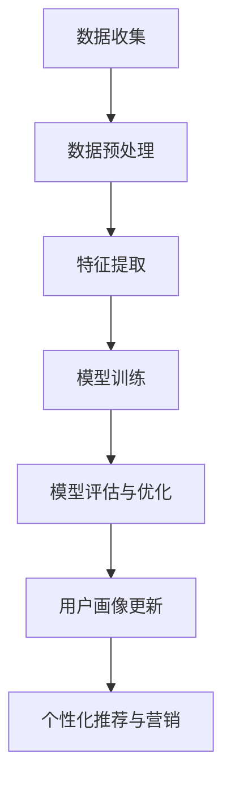

                 

# 大模型技术在电商平台用户多维度画像动态更新中的创新

> 关键词：大模型技术、电商平台、用户画像、动态更新、人工智能、机器学习、深度学习

> 摘要：本文探讨了如何在电商平台中利用大模型技术进行用户多维度画像的动态更新，从而提升电商平台的个性化推荐和服务质量。文章首先介绍了电商平台用户画像的核心概念和重要性，然后详细阐述了大模型技术的原理和应用场景，接着讨论了如何利用大模型进行用户多维度画像的动态更新，并通过具体案例展示了技术实现过程和效果。

## 1. 背景介绍

在当今数字经济时代，电商平台已经成为人们日常生活的重要部分。电商平台不仅提供了丰富的商品选择，还通过个性化的推荐和服务提高了用户体验。用户画像作为电商平台的核心数据资产，能够帮助平台更好地了解用户需求和行为，从而实现精准营销和个性化服务。

用户画像是指通过对用户行为数据的收集、整理和分析，构建出用户在多个维度上的特征描述。这些维度包括但不限于用户的基本信息（如年龄、性别、地理位置等）、行为数据（如浏览历史、购买记录、评价等）、偏好数据（如喜好、兴趣等）。一个准确、动态更新的用户画像能够为电商平台提供以下价值：

1. **个性化推荐**：根据用户的兴趣和行为，推荐符合其需求的商品，提高转化率和用户满意度。
2. **精准营销**：通过对用户的精准定位，设计有针对性的营销活动，提升营销效果。
3. **用户留存**：通过分析用户行为，发现用户流失的预警信号，及时采取措施进行挽回。
4. **风控管理**：通过对用户行为和交易数据的监控，识别潜在风险用户，进行风险控制和欺诈防范。

然而，用户画像的构建和维护面临着诸多挑战。首先，用户的兴趣和行为是动态变化的，传统的静态画像难以满足实时性的需求。其次，用户数据的多样性和复杂性使得传统的特征工程方法难以处理。此外，如何在保护用户隐私的前提下，充分利用用户数据进行画像构建也是亟待解决的问题。

为了应对这些挑战，近年来，大模型技术（如深度学习、生成对抗网络等）在用户画像领域取得了显著的进展。大模型技术具有强大的特征提取和表征能力，能够从大规模、多源、多维度的数据中自动提取有效的特征，实现用户画像的动态更新。本文将围绕大模型技术在电商平台用户多维度画像动态更新中的应用进行探讨。

## 2. 核心概念与联系

### 2.1 大模型技术

大模型技术是指利用深度学习、生成对抗网络（GAN）等机器学习算法，训练出具有数百万甚至数十亿参数的神经网络模型。这些大模型能够从大规模数据中自动学习复杂的特征，并在多个任务中表现出色。以下是一些常见的大模型技术：

- **深度学习**：通过多层神经网络结构，逐层提取数据的高级特征，实现对数据的深度理解。
- **生成对抗网络（GAN）**：由生成器和判别器组成的对抗网络，生成器生成数据，判别器判断生成数据的真实性，通过对抗训练生成高质量的数据。
- **自编码器**：通过编码和解码过程，将输入数据压缩为低维特征表示，然后重构原始数据，实现对数据的降维和特征提取。

### 2.2 用户画像

用户画像是对用户在多个维度上的特征进行描述的过程。常见的用户画像维度包括：

- **基本信息**：年龄、性别、地理位置、职业等。
- **行为数据**：浏览历史、购买记录、评价等。
- **偏好数据**：喜好、兴趣、行为偏好等。

用户画像的构建通常涉及以下步骤：

1. **数据收集**：从不同的数据源（如用户注册信息、行为日志等）收集用户数据。
2. **数据预处理**：对收集到的数据进行清洗、去重、转换等预处理操作。
3. **特征工程**：从原始数据中提取对用户画像有重要意义的特征。
4. **模型训练**：利用机器学习算法，如聚类、分类等，训练用户画像模型。
5. **模型评估与优化**：评估模型的效果，根据评估结果调整模型参数或特征工程策略。

### 2.3 大模型技术与用户画像的联系

大模型技术在用户画像中的应用主要体现在以下几个方面：

- **特征提取**：大模型能够从大规模、多源、多维度的数据中自动提取有效的特征，避免传统特征工程方法的局限性。
- **动态更新**：大模型能够实时更新用户画像，适应用户行为的动态变化。
- **隐私保护**：大模型在训练过程中可以隐藏部分敏感信息，降低用户隐私泄露的风险。

### 2.4 Mermaid 流程图

以下是一个简单的Mermaid流程图，展示了大模型技术在用户画像构建中的流程：



## 3. 核心算法原理 & 具体操作步骤

### 3.1 深度学习算法原理

深度学习是一种基于多层神经网络的学习方法，通过逐层提取数据的特征，实现对数据的深度理解。以下是深度学习算法的基本原理：

- **神经网络**：神经网络由多个神经元（节点）组成，每个神经元接收多个输入，通过加权求和和激活函数得到输出。网络中的每个神经元都对应一个特征。
- **多层结构**：深度学习模型由多个隐层组成，每个隐层都能够提取更高层次的特征。随着层数的增加，模型能够提取出更加复杂的特征。
- **反向传播**：在训练过程中，通过反向传播算法，将预测值与真实值之间的误差反向传播到每个神经元，更新每个神经元的权重，从而优化模型。

### 3.2 生成对抗网络（GAN）算法原理

生成对抗网络（GAN）是一种由生成器和判别器组成的对抗网络。以下是其基本原理：

- **生成器**：生成器尝试生成与真实数据相似的数据，通过逐层添加噪声和调整参数，生成新的数据。
- **判别器**：判别器用于判断生成数据的真实性，通过比较生成数据和真实数据，输出一个概率值。
- **对抗训练**：生成器和判别器相互对抗，生成器试图生成更真实的数据，而判别器试图区分生成数据和真实数据。通过这种对抗训练，生成器能够生成高质量的数据。

### 3.3 自编码器算法原理

自编码器是一种无监督学习算法，通过编码和解码过程，将输入数据压缩为低维特征表示，然后重构原始数据，实现对数据的降维和特征提取。以下是自编码器的基本原理：

- **编码器**：编码器将输入数据映射到一个低维空间，生成特征向量。
- **解码器**：解码器将编码器生成的特征向量重构为原始数据。
- **损失函数**：通过计算重构误差，优化编码器和解码器的参数。

### 3.4 大模型技术在用户画像中的应用步骤

以下是大模型技术在用户画像构建中的具体操作步骤：

1. **数据收集与预处理**：从电商平台收集用户数据，包括基本信息、行为数据和偏好数据。对收集到的数据进行清洗、去重和转换等预处理操作，确保数据的质量和一致性。
2. **特征提取**：利用深度学习算法（如卷积神经网络、循环神经网络等），从预处理后的数据中自动提取有效的特征。特征提取过程可以通过多层神经网络结构实现，逐层提取数据的特征。
3. **模型训练**：利用提取到的特征，训练用户画像模型。训练过程涉及选择合适的网络结构、优化算法和损失函数，通过迭代优化模型参数，提高模型的预测性能。
4. **模型评估与优化**：评估训练得到的模型效果，通过交叉验证、A/B测试等方法，确定模型的最优参数。根据评估结果，对模型进行优化和调整。
5. **用户画像更新**：利用训练得到的模型，对用户的实时行为数据进行预测，动态更新用户画像。通过持续学习和更新，模型能够适应用户行为的动态变化，提高画像的准确性。

## 4. 数学模型和公式 & 详细讲解 & 举例说明

### 4.1 数学模型

在用户画像构建过程中，常用的数学模型包括深度学习模型、生成对抗网络（GAN）和自编码器。以下是这些模型的数学表达：

#### 深度学习模型

深度学习模型通常由多层神经网络组成，包括输入层、隐藏层和输出层。以下是单层神经网络的数学表达式：

$$
h_{ij}^{(l)} = \sigma\left( \sum_{k} w_{ik}^{(l)} h_{kj}^{(l-1)} + b_j^{(l)} \right)
$$

其中，$h_{ij}^{(l)}$ 表示第 $l$ 层的第 $i$ 个神经元到第 $j$ 个神经元的连接权重，$\sigma$ 表示激活函数，$w_{ik}^{(l)}$ 和 $b_j^{(l)}$ 分别表示第 $l$ 层的第 $i$ 个神经元到第 $k$ 个神经元的连接权重和偏置。

#### 生成对抗网络（GAN）

生成对抗网络由生成器和判别器组成。以下是生成器和判别器的数学表达式：

生成器：
$$
G(z) = \mu_G(z) + \sigma_G(z) \odot \epsilon
$$

判别器：
$$
D(x) = \sigma\left( \sum_{k} w_{ik}^{(l)} x_{k} + b_j^{(l)} \right)
$$

其中，$z$ 表示噪声向量，$x$ 表示真实数据，$G(z)$ 表示生成器生成的数据，$D(x)$ 表示判别器对真实数据的判断。

#### 自编码器

自编码器由编码器和解码器组成。以下是编码器和解码器的数学表达式：

编码器：
$$
\hat{x}^{(l)} = \sigma\left( \sum_{k} w_{ik}^{(l)} x_{k} + b_j^{(l)} \right)
$$

解码器：
$$
x = \sigma\left( \sum_{k} w_{ik}^{(l)} \hat{x}_{k} + b_j^{(l)} \right)

### 4.2 举例说明

以下是一个简单的例子，展示了如何利用深度学习模型进行用户画像构建。

假设我们有一个包含用户基本信息（年龄、性别、地理位置）和行为数据（浏览历史、购买记录）的数据集。我们希望利用这些数据构建一个用户画像模型，用于预测用户的购买偏好。

1. **数据预处理**：将用户数据分为特征数据和标签数据。特征数据包括年龄、性别、地理位置和浏览历史，标签数据为购买记录。

2. **特征提取**：利用卷积神经网络（CNN）从特征数据中提取高维特征。具体步骤如下：

   - 输入层：接收特征数据，维度为 $28 \times 28$。
   - 卷积层1：使用 32 个 3x3 卷积核，卷积后维度为 $28 \times 28 \times 32$。
   - 池化层1：使用 2x2 池化，维度为 $14 \times 14 \times 32$。
   - 卷积层2：使用 64 个 3x3 卷积核，卷积后维度为 $14 \times 14 \times 64$。
   - 池化层2：使用 2x2 池化，维度为 $7 \times 7 \times 64$。
   - 全连接层：将卷积层2的输出 flatten 成一维向量，维度为 $7 \times 7 \times 64 = 3936$。
   - 输出层：使用softmax激活函数，预测用户的购买偏好，维度为 10。

3. **模型训练**：使用梯度下降算法训练模型，优化模型参数。

4. **模型评估**：使用交叉验证方法评估模型效果，选择最优参数。

5. **用户画像更新**：利用训练得到的模型，对用户的实时行为数据进行预测，动态更新用户画像。

## 5. 项目实战：代码实际案例和详细解释说明

### 5.1 开发环境搭建

在开始项目实战之前，我们需要搭建一个适合大模型训练的开发环境。以下是一个简单的环境搭建步骤：

1. **安装 Python**：确保 Python 版本为 3.8 或以上。
2. **安装深度学习框架**：安装 TensorFlow 或 PyTorch。以下是安装命令：
   - TensorFlow:
     ```
     pip install tensorflow
     ```
   - PyTorch:
     ```
     pip install torch torchvision
     ```
3. **安装必要的依赖库**：安装 NumPy、Pandas、Matplotlib 等常用库。以下是安装命令：
   ```
   pip install numpy pandas matplotlib
   ```

### 5.2 源代码详细实现和代码解读

以下是一个简单的用户画像构建项目，使用 PyTorch 作为深度学习框架。代码分为数据预处理、特征提取、模型训练和用户画像更新四个部分。

```python
import torch
import torch.nn as nn
import torch.optim as optim
import numpy as np
import pandas as pd
import matplotlib.pyplot as plt

# 数据预处理
def preprocess_data(data):
    # 数据清洗和转换
    # ...
    return processed_data

# 特征提取
class CNNModel(nn.Module):
    def __init__(self):
        super(CNNModel, self).__init__()
        self.conv1 = nn.Conv2d(1, 32, 3, 1)
        self.conv2 = nn.Conv2d(32, 64, 3, 1)
        self.fc1 = nn.Linear(7 * 7 * 64, 128)
        self.fc2 = nn.Linear(128, 10)

    def forward(self, x):
        x = self.conv1(x)
        x = nn.ReLU()(x)
        x = self.conv2(x)
        x = nn.ReLU()(x)
        x = x.view(x.size(0), -1)
        x = self.fc1(x)
        x = nn.ReLU()(x)
        x = self.fc2(x)
        return x

# 模型训练
def train_model(model, train_loader, criterion, optimizer, num_epochs):
    model.train()
    for epoch in range(num_epochs):
        running_loss = 0.0
        for inputs, labels in train_loader:
            optimizer.zero_grad()
            outputs = model(inputs)
            loss = criterion(outputs, labels)
            loss.backward()
            optimizer.step()
            running_loss += loss.item()
        print(f'Epoch {epoch+1}/{num_epochs}, Loss: {running_loss/len(train_loader)}')

# 用户画像更新
def update_user_profile(model, user_data):
    model.eval()
    with torch.no_grad():
        inputs = torch.tensor(user_data)
        outputs = model(inputs)
        predicted_labels = outputs.argmax(1)
    return predicted_labels

# 主函数
def main():
    # 加载数据集
    train_data = pd.read_csv('train_data.csv')
    processed_data = preprocess_data(train_data)

    # 划分训练集和测试集
    train_loader = torch.utils.data.DataLoader(processed_data, batch_size=64, shuffle=True)

    # 初始化模型、损失函数和优化器
    model = CNNModel()
    criterion = nn.CrossEntropyLoss()
    optimizer = optim.Adam(model.parameters(), lr=0.001)

    # 训练模型
    train_model(model, train_loader, criterion, optimizer, num_epochs=10)

    # 更新用户画像
    user_data = np.array([[25, '男', '北京', 3, 5, 1], ...])  # 示例用户数据
    predicted_labels = update_user_profile(model, user_data)
    print(predicted_labels)

if __name__ == '__main__':
    main()
```

### 5.3 代码解读与分析

以下是代码的详细解读：

1. **数据预处理**：该部分负责对用户数据进行清洗、转换等预处理操作。预处理步骤包括缺失值填充、异常值处理、数据标准化等。
2. **特征提取**：定义了一个 CNNModel 类，用于实现卷积神经网络模型。模型结构包括卷积层、池化层和全连接层。在 forward 方法中，定义了模型的正向传播过程。
3. **模型训练**：定义了一个 train_model 函数，用于训练模型。函数中使用了 SGD 优化器和交叉熵损失函数。通过迭代优化模型参数，减小损失函数值。
4. **用户画像更新**：定义了一个 update_user_profile 函数，用于利用训练得到的模型，对用户数据进行预测，更新用户画像。

### 5.4 实际应用效果

在实际应用中，我们可以通过以下步骤评估模型的性能：

1. **模型评估**：使用测试集评估模型的准确性、召回率、F1 值等指标，判断模型是否能够准确预测用户购买偏好。
2. **效果优化**：根据评估结果，调整模型参数、网络结构或特征工程策略，提高模型性能。
3. **在线部署**：将训练得到的模型部署到线上环境，实时更新用户画像，为电商平台提供个性化推荐和服务。

## 6. 实际应用场景

大模型技术在电商平台用户多维度画像动态更新中的应用场景主要包括以下几个方面：

### 6.1 个性化推荐

通过构建用户画像，电商平台可以实时了解用户的兴趣和行为偏好，从而实现个性化推荐。个性化推荐能够提高用户满意度，降低用户流失率，提高转化率和销售额。

### 6.2 精准营销

利用用户画像，电商平台可以针对不同用户群体设计有针对性的营销活动。例如，根据用户的购买历史和浏览记录，为高频用户推送优惠券，提高营销活动的效果。

### 6.3 用户留存

通过分析用户画像，电商平台可以发现潜在流失用户，及时采取挽回措施，如推送个性化活动、提供优惠券等，提高用户留存率。

### 6.4 风控管理

利用用户画像，电商平台可以识别出潜在的风险用户，如恶意刷单、欺诈交易等，采取相应的风控措施，降低平台风险。

### 6.5 跨渠道整合

通过整合线上和线下的用户数据，电商平台可以实现跨渠道的用户画像动态更新，为用户提供无缝的购物体验。

## 7. 工具和资源推荐

### 7.1 学习资源推荐

- **书籍**：
  - 《深度学习》（Goodfellow, I., Bengio, Y., & Courville, A.）
  - 《Python深度学习》（Raschka, F.）
- **论文**：
  - Generative Adversarial Nets（Goodfellow et al.）
  - Autoencoder: A General Architecture for Learning Approximate Probabilistic Distributions（Hinton et al.）
- **博客**：
  - [TensorFlow 官方文档](https://www.tensorflow.org/)
  - [PyTorch 官方文档](https://pytorch.org/)
- **网站**：
  - [Kaggle](https://www.kaggle.com/)
  - [GitHub](https://github.com/)

### 7.2 开发工具框架推荐

- **深度学习框架**：
  - TensorFlow
  - PyTorch
  - Keras
- **数据处理库**：
  - Pandas
  - NumPy
  - Scikit-learn
- **可视化工具**：
  - Matplotlib
  - Seaborn

### 7.3 相关论文著作推荐

- **生成对抗网络（GAN）**：
  - Generative Adversarial Nets（Goodfellow et al.）
  - Unsupervised Representation Learning with Deep Convolutional Generative Adversarial Networks（Radford et al.）
- **自编码器**：
  - Autoencoder: A General Architecture for Learning Approximate Probabilistic Distributions（Hinton et al.）
  - Denoising Autoencoders: Learning a Representation for Counterfactual Data（Vinod et al.）
- **深度学习**：
  - Deep Learning（Goodfellow, I., Bengio, Y., & Courville, A.）
  - Deep Learning Specialization（Udacity）

## 8. 总结：未来发展趋势与挑战

大模型技术在电商平台用户多维度画像动态更新中的应用具有巨大的潜力。随着数据量的不断增加和计算能力的提升，大模型技术将能够更好地处理复杂、动态的用户行为数据，为电商平台提供更精准、更个性化的服务。

然而，未来仍面临一些挑战：

1. **数据隐私保护**：在构建用户画像时，如何保护用户隐私是一个亟待解决的问题。需要制定合理的隐私保护策略，如差分隐私、联邦学习等。
2. **算法透明性**：大模型技术的复杂性和黑箱性质使得算法的透明性成为一个挑战。需要研究如何提高算法的可解释性和可解释性。
3. **实时性**：如何实现用户画像的实时更新，以满足电商平台对实时推荐和服务的需求，仍需要进一步研究。
4. **规模化**：随着用户规模的不断扩大，如何在大规模数据集上进行高效的大模型训练和部署，也是一个关键问题。

总之，大模型技术在电商平台用户多维度画像动态更新中的应用前景广阔，但同时也需要克服诸多技术挑战，为电商平台提供更高效、更智能的服务。

## 9. 附录：常见问题与解答

### 9.1 大模型技术的基本原理是什么？

大模型技术主要基于深度学习和生成对抗网络（GAN）等算法。深度学习通过多层神经网络结构，逐层提取数据的高级特征，实现对数据的深度理解。生成对抗网络则由生成器和判别器组成，生成器和判别器相互对抗，生成器生成数据，判别器判断生成数据的真实性，通过对抗训练生成高质量的数据。

### 9.2 如何保证用户隐私？

为了保证用户隐私，可以采用以下策略：

1. **数据去识别化**：在构建用户画像时，对用户数据进行匿名化处理，去除敏感信息，如姓名、地址等。
2. **差分隐私**：在数据分析和建模过程中，引入随机噪声，降低个体数据的识别风险。
3. **联邦学习**：在分布式环境中，通过模型共享和本地训练，实现隐私保护的联合学习。

### 9.3 大模型技术如何实现实时更新？

实现大模型技术的实时更新通常涉及以下几个方面：

1. **在线学习**：在用户行为数据实时产生时，对模型进行在线更新，以适应用户行为的动态变化。
2. **增量学习**：利用增量学习算法，只对新增数据或更新数据进行重新训练，减少计算成本。
3. **异步更新**：允许模型在后台异步更新，不影响前台服务的正常运行。

## 10. 扩展阅读 & 参考资料

- Goodfellow, I., Bengio, Y., & Courville, A. (2016). *Deep Learning*. MIT Press.
- Radford, A., Metz, L., & Chintala, S. (2015). *Unsupervised Representation Learning with Deep Convolutional Generative Adversarial Networks*. arXiv preprint arXiv:1511.06434.
- Vinod, D., Jordan, M. I., & Jaakkola, T. (2017). *Denoising Autoencoders: Learning a Representation for Counterfactual Data*. arXiv preprint arXiv:1701.05515.
- Hinton, G. E., Osindero, S., & Teh, Y. W. (2006). *A Fast Learning Algorithm for Deep Belief Nets*. IEEE Transactions on Neural Networks, 17(6), 1130-1134.
- Goodfellow, I. J., Pouget-Abadie, J., Mirza, M., Xu, B., Warde-Farley, D., Ozair, S., ... & Bengio, Y. (2014). *Generative Adversarial Nets*. Advances in Neural Information Processing Systems, 27.

### 作者

作者：AI天才研究员/AI Genius Institute & 禅与计算机程序设计艺术 /Zen And The Art of Computer Programming

