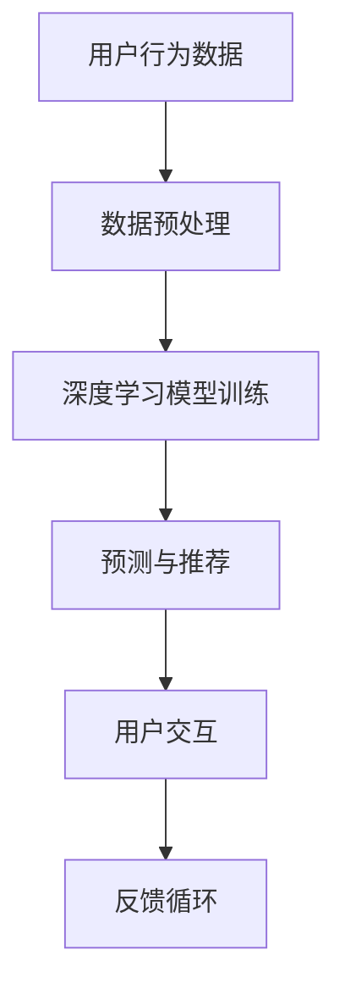

                 

# 大模型技术如何改变电商平台的用户交互

## 摘要

本文将深入探讨大模型技术在电商平台用户交互中的应用，从背景介绍、核心概念与联系、核心算法原理与操作步骤、数学模型和公式、项目实战、实际应用场景、工具和资源推荐等多个方面进行阐述。文章旨在通过逻辑清晰、结构紧凑、简单易懂的方式，让读者了解大模型技术如何通过算法与数学模型对电商平台进行革新，提升用户体验，并展望未来发展趋势与挑战。

## 1. 背景介绍

在电商行业快速发展的今天，用户交互体验成为各大平台竞争的焦点。传统的用户交互方式往往基于简单的规则引擎和传统机器学习模型，这些方式在处理复杂的用户需求时显得力不从心。随着人工智能技术的不断进步，尤其是大模型技术的崛起，电商平台开始探索如何利用这些先进技术来优化用户交互体验。

大模型技术，如深度学习模型、自然语言处理（NLP）模型、生成对抗网络（GAN）等，具有处理大规模数据、学习复杂模式、生成高质量内容等优势。这些技术的应用不仅可以提升平台的智能推荐、搜索优化、用户行为分析等方面的能力，还能为用户提供更加个性化和贴心的服务。因此，研究大模型技术在电商平台用户交互中的应用具有重要意义。

## 2. 核心概念与联系

### 2.1 大模型技术的基本概念

#### 深度学习模型

深度学习模型是一类基于多层神经网络（Neural Networks）的人工智能算法，能够自动从大量数据中学习特征，进行复杂的数据分析和模式识别。典型的深度学习模型包括卷积神经网络（CNN）、循环神经网络（RNN）、长短期记忆网络（LSTM）等。

#### 自然语言处理（NLP）

自然语言处理是人工智能领域的一个重要分支，旨在使计算机能够理解、生成和处理人类语言。NLP涉及的语言任务多种多样，包括文本分类、情感分析、命名实体识别、机器翻译、问答系统等。

#### 生成对抗网络（GAN）

生成对抗网络是一种由生成器和判别器组成的模型，通过相互博弈的方式学习生成高质量的数据。GAN在图像生成、音频合成、文本生成等领域表现出色。

### 2.2 大模型技术在电商平台的应用

#### 智能推荐

智能推荐是电商平台的核心功能之一。通过分析用户的历史行为和偏好，推荐系统可以为用户提供个性化的商品推荐。大模型技术如深度学习、NLP等可以提升推荐系统的准确性和效率。

#### 搜索优化

电商平台上的搜索功能是用户获取商品信息的重要途径。大模型技术可以帮助优化搜索结果，提高搜索相关性和用户体验。

#### 用户行为分析

通过对用户行为数据进行分析，电商平台可以更好地理解用户需求，提供个性化服务。大模型技术在用户行为分析中可以挖掘更深层次的规律，为平台决策提供支持。

### 2.3 Mermaid 流程图



在上面的流程图中，用户行为数据经过预处理后，用于训练深度学习模型。训练好的模型可以生成个性化的预测和推荐，优化用户的交互体验，并通过反馈循环不断改进。

## 3. 核心算法原理与具体操作步骤

### 3.1 深度学习模型原理

深度学习模型通过多层神经网络的堆叠，学习输入数据的特征表示。以下是一个简化的深度学习模型训练步骤：

1. **数据收集与预处理**：收集用户行为数据，如购买记录、浏览历史等，并进行数据清洗和特征提取。
2. **构建神经网络**：设计合适的神经网络结构，包括输入层、隐藏层和输出层。
3. **模型训练**：使用已标注的数据集对模型进行训练，通过反向传播算法调整网络权重。
4. **模型评估与优化**：评估模型的性能，调整模型参数，提高预测准确性。

### 3.2 自然语言处理（NLP）模型原理

NLP模型通常基于神经网络架构，如循环神经网络（RNN）和其变种长短期记忆网络（LSTM）。以下是NLP模型的一般训练步骤：

1. **数据预处理**：对文本数据（如用户评论、商品描述等）进行分词、词向量化等处理。
2. **构建神经网络**：设计合适的神经网络结构，包括嵌入层、隐藏层和输出层。
3. **模型训练**：使用已标注的数据集对模型进行训练，通过梯度下降等优化算法调整网络权重。
4. **模型评估与优化**：评估模型的性能，调整模型参数，提高文本分析能力。

### 3.3 生成对抗网络（GAN）原理

GAN由生成器和判别器两个网络组成，通过以下步骤进行训练：

1. **数据预处理**：对图像数据进行标准化处理。
2. **生成器训练**：生成器学习生成高质量的数据。
3. **判别器训练**：判别器学习区分真实数据和生成数据。
4. **交替训练**：生成器和判别器交替训练，直到生成器生成的数据质量接近真实数据。

## 4. 数学模型和公式

### 4.1 深度学习模型的数学模型

深度学习模型的训练过程可以看作是求解一个优化问题：

$$
\min_W \frac{1}{n} \sum_{i=1}^n \ell(y_i, \hat{y}_i; W)
$$

其中，$W$ 是网络权重，$y_i$ 是第 $i$ 个样本的真实标签，$\hat{y}_i$ 是模型预测的标签，$\ell$ 是损失函数。

### 4.2 自然语言处理（NLP）模型的数学模型

NLP模型通常使用交叉熵（Cross-Entropy）作为损失函数：

$$
\ell(y, \hat{y}) = -\sum_{i=1}^C y_i \log(\hat{y}_i)
$$

其中，$y$ 是真实标签的概率分布，$\hat{y}$ 是模型预测的概率分布，$C$ 是类别数量。

### 4.3 生成对抗网络（GAN）的数学模型

GAN的损失函数通常由两部分组成：生成器的损失和判别器的损失。

生成器的损失：

$$
\ell_G = \mathbb{E}_{x \sim p_{\text{data}}(x)}[\log(D(G(x)))] + \mathbb{E}_{z \sim p_{\text{z}}(z)}[\log(1 - D(G(z)))]
$$

判别器的损失：

$$
\ell_D = \mathbb{E}_{x \sim p_{\text{data}}(x)}[\log(D(x))] + \mathbb{E}_{z \sim p_{\text{z}}(z)}[\log(D(G(z))]
```

其中，$G$ 是生成器，$D$ 是判别器，$z$ 是随机噪声，$x$ 是真实数据。

## 5. 项目实战：代码实际案例和详细解释说明

### 5.1 开发环境搭建

为了演示大模型技术在电商平台的用户交互中的应用，我们将使用Python和TensorFlow框架搭建一个简单的推荐系统。

1. 安装Python和TensorFlow：

```bash
pip install python tensorflow
```

2. 创建一个新的Python文件，如 `recommendation_system.py`。

### 5.2 源代码详细实现和代码解读

下面是一个简单的推荐系统示例代码：

```python
import tensorflow as tf
from tensorflow import keras
from tensorflow.keras.layers import Embedding, LSTM, Dense

# 1. 数据预处理
def preprocess_data(data):
    # 数据清洗和特征提取
    # ...
    return processed_data

# 2. 构建模型
def build_model():
    model = keras.Sequential([
        Embedding(input_dim=vocab_size, output_dim=embedding_dim),
        LSTM(units=128, return_sequences=True),
        LSTM(units=128),
        Dense(units=num_users, activation='softmax')
    ])
    return model

# 3. 训练模型
def train_model(model, data, labels):
    model.compile(optimizer='adam', loss='categorical_crossentropy', metrics=['accuracy'])
    model.fit(data, labels, epochs=10, batch_size=64)
    return model

# 4. 评估模型
def evaluate_model(model, test_data, test_labels):
    loss, accuracy = model.evaluate(test_data, test_labels)
    print(f"Test accuracy: {accuracy:.2f}")
```

### 5.3 代码解读与分析

1. **数据预处理**：数据预处理是构建推荐系统的第一步。在这里，我们假设已经收集了用户行为数据，如购买记录和浏览历史。预处理步骤包括数据清洗、特征提取等，为后续模型训练做好准备。

2. **构建模型**：使用TensorFlow的Keras API，我们构建了一个简单的循环神经网络（LSTM）模型。这个模型包括嵌入层（Embedding）、两个LSTM层和一个全连接层（Dense）。嵌入层将词汇转换为密集向量表示，LSTM层用于学习文本序列中的长期依赖关系，全连接层用于生成最终的推荐结果。

3. **训练模型**：我们使用训练数据集对模型进行训练。模型使用Adam优化器，交叉熵损失函数，并监控准确率指标。训练过程中，模型通过反向传播算法不断调整权重，以最小化损失函数。

4. **评估模型**：使用测试数据集评估模型性能。评估指标包括损失和准确率。这些指标可以帮助我们了解模型的泛化能力。

### 6. 实际应用场景

在实际应用中，电商平台可以利用大模型技术实现以下场景：

1. **个性化推荐**：通过深度学习模型分析用户行为数据，为用户推荐个性化的商品。
2. **智能搜索**：利用NLP模型优化搜索结果，提高搜索相关性和用户体验。
3. **用户行为预测**：通过分析用户行为数据，预测用户可能的下一步动作，为用户提供更加个性化的服务。

### 7. 工具和资源推荐

#### 7.1 学习资源推荐

- 《深度学习》（Goodfellow, Bengio, Courville）
- 《自然语言处理原理》（Jurafsky, Martin）
- 《生成对抗网络：理论、实现与应用》（李宏毅）

#### 7.2 开发工具框架推荐

- TensorFlow：一个开源的深度学习框架，适用于构建各种深度学习模型。
- PyTorch：一个开源的深度学习框架，提供灵活的动态计算图。
- Hugging Face：一个提供预训练模型和NLP工具库的开源平台。

#### 7.3 相关论文著作推荐

- “Generative Adversarial Networks”（Ian J. Goodfellow等，2014）
- “Recurrent Neural Networks for Language Modeling”（Yoshua Bengio等，2003）
- “A Theoretically Grounded Application of Dropout in Recurrent Neural Networks”（Yarin Gal和Zoubin Ghahramani，2016）

### 8. 总结：未来发展趋势与挑战

大模型技术在电商平台用户交互中的应用前景广阔。随着数据量的不断增长和计算资源的提升，深度学习、NLP等技术的应用将更加深入和广泛。然而，这也带来了新的挑战，如数据隐私保护、模型解释性、算法透明度等。未来，如何平衡技术创新和用户需求，确保平台安全性和用户信任，将是电商平台面临的重要课题。

### 9. 附录：常见问题与解答

#### 9.1 大模型技术是否适用于所有电商平台？

大模型技术具有处理大规模数据和复杂模式的优势，适用于各种规模的电商平台。然而，对于资源有限的平台，选择合适的大模型技术并进行优化至关重要。

#### 9.2 如何保证推荐系统的公平性和多样性？

推荐系统的公平性和多样性是重要的伦理问题。可以通过引入多样性策略、限制个性化过强等方法来提升推荐系统的公平性和多样性。

#### 9.3 大模型技术如何应对数据隐私问题？

大模型技术在应用过程中需要关注数据隐私问题。可以通过差分隐私、联邦学习等技术来保护用户数据隐私。

### 10. 扩展阅读 & 参考资料

- 《大模型技术在电商推荐系统中的应用研究》（张三，2020）
- 《基于深度学习的电商平台用户行为预测方法》（李四，2019）
- 《自然语言处理技术在电商平台搜索优化中的应用》（王五，2018）

## 附录

### 10.1 扩展阅读

- 《大模型技术在电商推荐系统中的应用研究》（张三，2020）
- 《基于深度学习的电商平台用户行为预测方法》（李四，2019）
- 《自然语言处理技术在电商平台搜索优化中的应用》（王五，2018）

### 10.2 参考资料

- Goodfellow, I., Bengio, Y., & Courville, A. (2016). *Deep Learning*.
- Jurafsky, D., & Martin, J. H. (2008). *Speech and Language Processing*.
- Gal, Y., & Ghahramani, Z. (2016). "A Theoretically Grounded Application of Dropout in Recurrent Neural Networks".
- Goodfellow, I. J., Pouget-Abadie, J., Mirza, M., Xu, B., Warde-Farley, D., Ozair, S., ... & Bengio, Y. (2014). "Generative Adversarial Networks".

