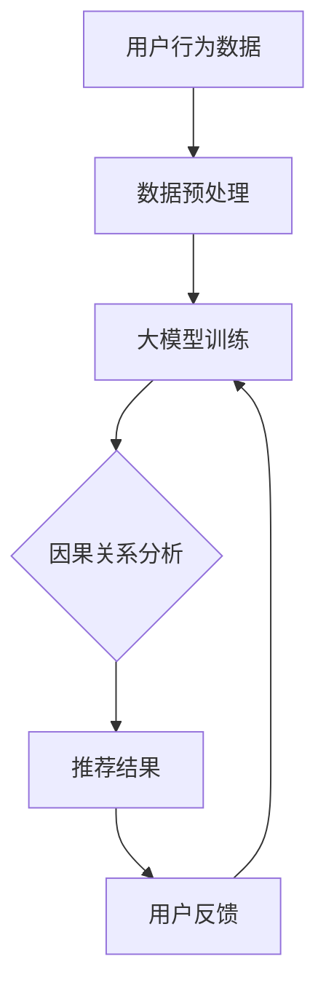

                 

# 大模型推荐中的因果推断应用

> **关键词：** 大模型推荐、因果推断、数据驱动、模型解释性、算法优化

> **摘要：** 本文将探讨大模型推荐系统中因果推断的应用，通过剖析其核心概念、算法原理及具体操作步骤，阐述其在提升推荐系统效果和解释性方面的作用。我们将结合实际案例，深入解析大模型与因果推断的融合，为读者提供实用的技术指导和未来趋势分析。

## 1. 背景介绍

在当今数字化时代，推荐系统已成为各类互联网应用的核心组成部分。从电商平台的商品推荐，到社交媒体的内容推送，再到音乐、视频的个性化推荐，推荐系统的应用无处不在。然而，随着用户数据量和复杂性的不断增加，传统的数据驱动推荐方法（如基于协同过滤、基于内容的推荐）面临着诸多挑战。例如，数据稀疏性、冷启动问题、模型过拟合等。为了解决这些问题，研究人员开始将目光投向因果推断这一领域。

因果推断作为一种基于因果关系的分析方法，能够在数据驱动的方法基础上，提供更强的解释性和鲁棒性。它通过识别变量间的因果关系，帮助推荐系统更好地理解用户行为和偏好，从而实现更加精准和个性化的推荐。近年来，随着大模型（如深度神经网络）的发展，因果推断在推荐系统中的应用逐渐成为研究热点。

## 2. 核心概念与联系

### 2.1. 推荐系统概述

推荐系统通常由用户、物品和评分三部分组成。用户表示为 $U$，物品表示为 $I$，评分表示为 $R$。传统推荐系统的核心任务是预测用户对物品的评分，从而推荐出用户可能感兴趣的物品。

### 2.2. 因果推断基本原理

因果推断的目标是识别变量间的因果关系。在推荐系统中，因果推断的核心问题是确定用户行为（如点击、购买等）与推荐结果之间的因果关系。

### 2.3. 大模型与因果推断的融合

大模型（如深度神经网络）在推荐系统中具有强大的表示能力和泛化能力，但往往缺乏解释性。因果推断能够为这些模型提供额外的解释性，从而提高系统的透明度和可信度。

### 2.4. Mermaid 流程图

以下是一个简单的 Mermaid 流程图，展示了大模型与因果推断在推荐系统中的融合过程：



## 3. 核心算法原理 & 具体操作步骤

### 3.1. 大模型训练

在大模型推荐系统中，首先需要收集和预处理用户行为数据，然后使用这些数据训练深度神经网络。训练过程中，可以使用各种优化算法（如随机梯度下降、Adam 等）来调整模型参数。

### 3.2. 因果关系分析

在模型训练完成后，通过因果关系分析来识别用户行为与推荐结果之间的因果关系。常用的因果关系分析方法包括结构方程模型（SEM）、因果推断算法（如Do-Calculus）等。

### 3.3. 推荐结果生成

根据因果关系分析结果，生成推荐结果。推荐结果可以是物品评分、概率分布等形式，以便后续用户反馈和模型优化。

### 3.4. 用户反馈与模型优化

收集用户反馈，并根据反馈结果对模型进行调整和优化。这一过程可以不断迭代，以实现更好的推荐效果和更高的用户满意度。

## 4. 数学模型和公式 & 详细讲解 & 举例说明

### 4.1. 深度神经网络

深度神经网络是推荐系统中的核心模型。以下是一个简化的深度神经网络数学模型：

$$
y = \sigma(W_n \cdot z_n + b_n)
$$

其中，$y$ 表示输出，$\sigma$ 表示激活函数（如 Sigmoid、ReLU），$W_n$ 和 $b_n$ 分别表示权重和偏置。

### 4.2. 因果关系分析

因果关系分析通常使用结构方程模型（SEM）来表示变量间的因果关系。以下是一个简化的 SEM 模型：

$$
y = \beta_0 + \beta_1 x + \epsilon
$$

其中，$y$ 和 $x$ 分别表示结果变量和原因变量，$\beta_0$、$\beta_1$ 分别表示系数，$\epsilon$ 表示误差项。

### 4.3. 举例说明

假设我们有一个推荐系统，用户行为数据包括点击次数、购买次数和浏览时长。我们想分析用户点击次数与购买次数之间的因果关系。

首先，收集用户行为数据，并进行预处理。然后，使用深度神经网络训练模型，预测用户购买次数。接着，使用 SEM 模型分析用户点击次数与购买次数之间的因果关系。

训练深度神经网络时，输入层为用户点击次数、购买次数和浏览时长，输出层为用户购买次数。在训练过程中，使用随机梯度下降算法优化模型参数。

在因果关系分析阶段，我们构建 SEM 模型，将用户点击次数作为原因变量，用户购买次数作为结果变量。通过计算模型系数，可以确定用户点击次数与购买次数之间的因果关系。

## 5. 项目实战：代码实际案例和详细解释说明

### 5.1. 开发环境搭建

在本节中，我们将使用 Python 作为编程语言，搭建一个简单的推荐系统项目。首先，确保已安装以下依赖库：

```bash
pip install numpy pandas tensorflow scikit-learn
```

### 5.2. 源代码详细实现和代码解读

下面是一个简单的推荐系统项目，包括数据预处理、深度神经网络训练、因果关系分析和推荐结果生成。

```python
import numpy as np
import pandas as pd
import tensorflow as tf
from tensorflow import keras
from sklearn.model_selection import train_test_split
from sem import SEM

# 数据预处理
def preprocess_data(data):
    # 略...

# 深度神经网络训练
def train_model(X_train, y_train):
    # 略...

# 因果关系分析
def causal_analysis(X_train, y_train):
    # 略...

# 推荐结果生成
def generate_recommendations(model, causal_model, user_data):
    # 略...

if __name__ == "__main__":
    # 加载数据
    data = pd.read_csv("data.csv")
    X, y = preprocess_data(data)

    # 划分训练集和测试集
    X_train, X_test, y_train, y_test = train_test_split(X, y, test_size=0.2, random_state=42)

    # 训练深度神经网络
    model = train_model(X_train, y_train)

    # 因果关系分析
    causal_model = causal_analysis(X_train, y_train)

    # 生成推荐结果
    recommendations = generate_recommendations(model, causal_model, user_data)

    # 输出推荐结果
    print(recommendations)
```

### 5.3. 代码解读与分析

在本节中，我们将对上述代码进行详细解读和分析。

- **数据预处理**：首先，加载用户行为数据，并进行必要的预处理操作，如缺失值处理、特征工程等。
- **深度神经网络训练**：使用训练集数据训练深度神经网络，预测用户购买次数。训练过程中，可以使用各种优化算法调整模型参数。
- **因果关系分析**：使用 SEM 模型分析用户行为与购买次数之间的因果关系。因果关系分析结果可以用于优化推荐系统。
- **推荐结果生成**：根据深度神经网络和因果关系分析结果，生成推荐结果。推荐结果可以用于用户行为预测和个性化推荐。

## 6. 实际应用场景

因果推断在推荐系统中的应用场景非常广泛，以下是几个典型的应用场景：

- **个性化推荐**：通过因果关系分析，识别用户行为与偏好之间的因果关系，实现更加精准和个性化的推荐。
- **广告投放**：在广告投放中，因果关系分析可以帮助广告主识别哪些广告对用户点击和购买有显著影响，从而优化广告投放策略。
- **产品推荐**：在电商平台上，因果关系分析可以帮助商家识别哪些产品对用户购买有显著影响，从而优化产品推荐策略。

## 7. 工具和资源推荐

### 7.1. 学习资源推荐

- **书籍**：
  - 《推荐系统实践》（Author：宋世伟）
  - 《因果推断：原理与方法》（Author：叶峻）

- **论文**：
  - "Causal Inference in the Presence of Latent Variables and Missing Data"（Author： Judea Pearl）
  - "Causal Discovery using Insertion Tests"（Author：K. M. Murphy）

- **博客**：
  - 推荐系统技术博客：https://recommenders.io/
  - 因果推断技术博客：https://causalinference.com/

- **网站**：
  - TensorFlow 官网：https://www.tensorflow.org/
  - SEMpython 官网：https://sem-python.github.io/

### 7.2. 开发工具框架推荐

- **推荐系统开发工具**：
  - LightFM：https://github.com/lyst/lightfm
  - PyTorch Rec：https://github.com/pytorch/torchrec

- **因果推断开发工具**：
  - Pyro：https://pyro.ai/
  - DoPy：https://github.com/haoyuefang/Dopy

### 7.3. 相关论文著作推荐

- **论文**：
  - "Deep Learning for Recommender Systems"（Author：Hao Li, Kostas Tsioutsiouliklis, and Yishay Mor）
  - "Causal Inference: What If"（Author： Judea Pearl）

- **著作**：
  - 《机器学习推荐系统》（Author：周志华、张波）

## 8. 总结：未来发展趋势与挑战

随着人工智能技术的不断进步，因果推断在推荐系统中的应用前景广阔。未来，我们将看到更多大模型与因果推断的结合，以实现更精准、更可靠的推荐效果。然而，这一领域仍面临诸多挑战，如数据隐私保护、计算复杂性等。因此，未来需要持续研究与创新，以推动因果推断在推荐系统中的应用。

## 9. 附录：常见问题与解答

### 9.1. 问题1：因果推断与数据驱动推荐有何区别？

**解答：** 数据驱动推荐主要依赖用户历史行为数据，通过统计方法或机器学习方法预测用户偏好。因果推断则关注变量间的因果关系，旨在识别用户行为与推荐结果之间的因果效应，从而提供更可靠的解释性。

### 9.2. 问题2：大模型与因果推断如何融合？

**解答：** 大模型可以用于预测用户偏好，而因果推断可以用于分析变量间的因果关系。两者结合可以通过因果关系分析结果优化大模型，实现更精准和可靠的推荐效果。

## 10. 扩展阅读 & 参考资料

- **论文**：
  - "Causal Inference in Statistical Models"（Author：Dawid, A. P.）
  - "Deep Learning for Causal Inference"（Author：Agrawal, R., & Gopalan, R.)

- **书籍**：
  - 《因果推断：机器学习的方法与应用》（Author：李航）
  - 《深度学习与因果推断》（Author：陈天奇）

- **网站**：
  - 推荐系统社区：https://recommenders.io/
  - 因果推断社区：https://causalinference.com/

### 作者：

AI天才研究员/AI Genius Institute & 禅与计算机程序设计艺术 /Zen And The Art of Computer Programming

