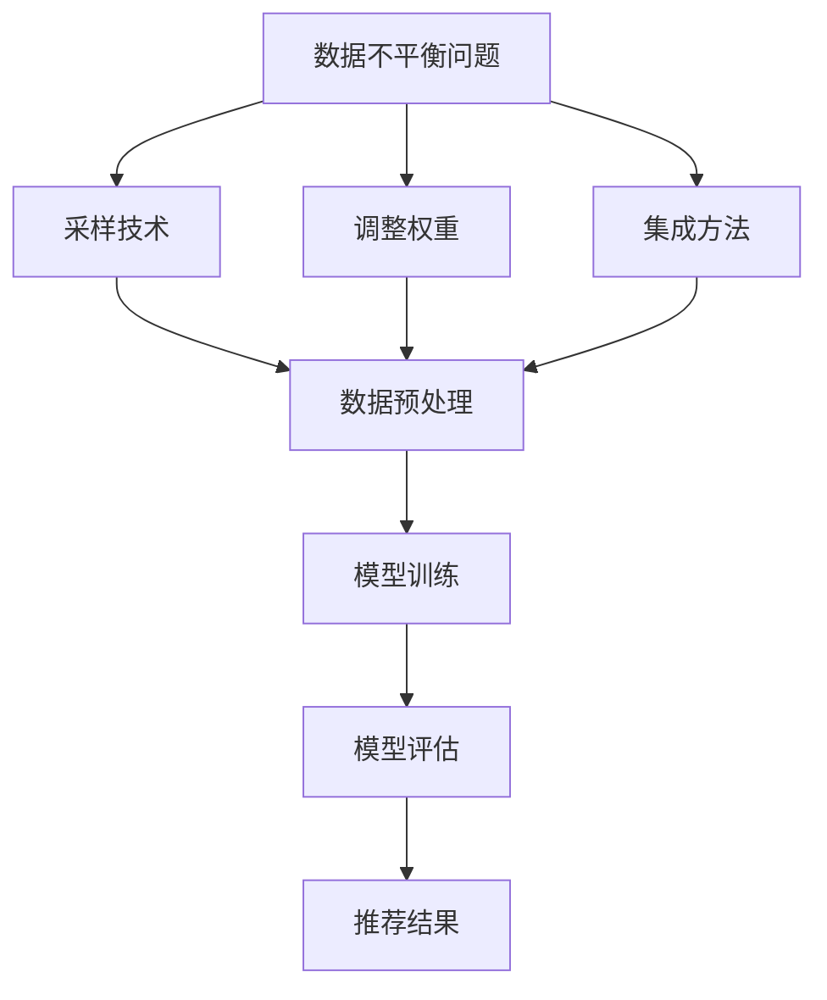

                 

# 大模型推荐场景中的数据不平衡问题应对策略

## 摘要

在当今大数据时代，大模型的推荐系统在各个领域中发挥着越来越重要的作用。然而，这些系统面临的其中一个重大挑战是数据不平衡问题。数据不平衡会导致模型性能不佳，进而影响推荐结果的质量。本文将详细介绍大模型推荐场景中数据不平衡问题的成因，并提供一系列应对策略，包括采样技术、调整权重和集成方法等。此外，本文还将通过实际项目案例，展示如何运用这些策略解决数据不平衡问题，并对其效果进行评估。本文旨在为读者提供全面的指南，帮助他们在大模型推荐系统中应对数据不平衡挑战。

## 1. 背景介绍

### 推荐系统概述

推荐系统是一种利用历史数据为用户提供个性化推荐的服务系统。它通过分析用户的历史行为、偏好和兴趣，预测用户可能感兴趣的内容，从而提高用户满意度和参与度。推荐系统广泛应用于电子商务、社交媒体、在线视频和新闻等领域。

### 大模型的发展

近年来，随着深度学习技术的快速发展，大模型在推荐系统中逐渐占据主导地位。大模型能够处理大规模数据，捕捉复杂的关系和模式，从而提高推荐准确性。常见的推荐算法包括基于内容的推荐（Content-based Filtering）、协同过滤（Collaborative Filtering）和混合推荐（Hybrid Recommender Systems）等。

### 数据不平衡问题

数据不平衡是指推荐系统中的数据分布不均匀，某些类别或样本的比例远高于其他类别。在推荐系统中，数据不平衡问题主要体现在用户行为数据上，例如点击、购买、评论等。数据不平衡会导致模型在训练过程中对某些类别过拟合，而对其他类别欠拟合，从而影响推荐效果。

## 2. 核心概念与联系

### 数据不平衡问题的影响

数据不平衡问题会对推荐系统的性能产生负面影响。具体表现如下：

1. **模型偏差**：模型在训练过程中会对数据中占优的类别或样本给予过多的关注，导致对其他类别或样本的预测能力不足。
2. **推荐质量下降**：数据不平衡会导致推荐结果偏向于占优类别，从而降低推荐系统的整体质量。
3. **用户满意度下降**：当用户频繁收到重复的推荐时，满意度会下降，影响用户粘性和留存率。

### 应对策略

为了解决数据不平衡问题，可以采用以下几种策略：

1. **采样技术**：通过调整样本比例，使得训练数据中的类别分布更加均匀。
2. **调整权重**：在模型训练过程中，为不同类别的样本赋予不同的权重，以平衡模型对各类别的关注程度。
3. **集成方法**：结合多个模型或多个数据源，提高模型对数据不平衡问题的鲁棒性。

### Mermaid 流程图

下面是一个简单的 Mermaid 流程图，展示了应对数据不平衡问题的流程：



## 3. 核心算法原理 & 具体操作步骤

### 3.1 采样技术

采样技术是通过调整样本比例来平衡数据分布的一种方法。常见的方法包括：

1. **过采样（Over-sampling）**：增加占优类别样本的数量，使各类别样本数量相等。过采样方法包括随机过采样（Random Over-sampling）和基于生成模型的过采样（Generative Model-based Over-sampling）等。
2. **下采样（Under-sampling）**：减少占优类别样本的数量，使各类别样本数量相等。下采样方法包括随机下采样（Random Under-sampling）和基于聚类的方法（Clustering-based Under-sampling）等。
3. **集成采样（Ensemble Sampling）**：结合多种采样技术，提高采样效果。

具体操作步骤如下：

1. **数据预处理**：读取原始数据集，对数据进行清洗和预处理。
2. **计算类别分布**：计算各类别样本的数量和占比。
3. **选择采样方法**：根据数据分布情况，选择合适的采样方法。
4. **调整样本比例**：对占优类别进行采样，使各类别样本数量相等。
5. **合并采样结果**：将采样后的数据集合并为一个训练数据集。

### 3.2 调整权重

调整权重是通过在模型训练过程中为不同类别的样本赋予不同的权重来平衡模型对各类别的关注程度。常见的方法包括：

1. **逆概率加权（Inverse Probability Weighting）**：根据各类别的概率，为样本赋予不同的权重。权重计算公式为：$w_i = \frac{1}{P(y_i)}$，其中 $P(y_i)$ 表示类别 $y_i$ 的概率。
2. **逆频率加权（Inverse Frequency Weighting）**：根据各类别样本的频率，为样本赋予不同的权重。权重计算公式为：$w_i = \frac{1}{f_i}$，其中 $f_i$ 表示类别 $y_i$ 的频率。
3. **自适应加权（Adaptive Weighting）**：根据模型在训练过程中对各类别的预测效果，动态调整权重。

具体操作步骤如下：

1. **数据预处理**：读取原始数据集，对数据进行清洗和预处理。
2. **计算类别概率/频率**：计算各类别的概率或频率。
3. **计算权重**：根据类别概率/频率，计算样本权重。
4. **调整权重**：在模型训练过程中，使用样本权重调整损失函数或优化算法。
5. **模型训练**：使用调整后的权重训练模型。

### 3.3 集成方法

集成方法是通过结合多个模型或多个数据源来提高模型对数据不平衡问题的鲁棒性。常见的方法包括：

1. **模型集成（Model Ensemble）**：结合多个模型，提高预测准确性和稳定性。常见的模型集成方法包括投票法（Voting）、堆叠法（Stacking）和提升法（Boosting）等。
2. **数据集成（Data Ensemble）**：结合多个数据源，提高数据质量。常见的数据集成方法包括数据合并（Data Merge）、数据交换（Data Swap）和数据扩充（Data Augmentation）等。

具体操作步骤如下：

1. **数据预处理**：读取多个数据源，对数据进行清洗和预处理。
2. **模型训练**：分别训练多个模型或使用多个数据源训练单个模型。
3. **模型集成**：将多个模型的预测结果进行融合，得到最终的预测结果。
4. **模型评估**：使用集成模型进行模型评估，比较不同集成方法的性能。

## 4. 数学模型和公式 & 详细讲解 & 举例说明

### 4.1 采样技术

#### 过采样（Over-sampling）

过采样是一种增加占优类别样本数量的方法。假设有 $C$ 个类别，第 $i$ 个类别的样本数量为 $n_i$，目标是通过过采样使各类别的样本数量相等。

过采样可以分为以下步骤：

1. **计算类别比例**：计算每个类别的样本比例：$r_i = \frac{n_i}{\sum_{i=1}^{C} n_i}$。
2. **生成样本**：对于每个占优类别，生成额外的样本，使该类别的样本数量达到目标数量。
3. **合并样本**：将原始数据集和生成的样本合并，形成新的数据集。

举例说明：

假设有四个类别，样本数量分别为 $n_1=1000$，$n_2=500$，$n_3=200$，$n_4=100$。目标使各类别样本数量相等，即 $n_i=250$。

1. **计算类别比例**：$r_1=\frac{1000}{1000+500+200+100}=\frac{2}{7}$，$r_2=\frac{500}{1000+500+200+100}=\frac{1}{7}$，$r_3=\frac{200}{1000+500+200+100}=\frac{1}{14}$，$r_4=\frac{100}{1000+500+200+100}=\frac{1}{28}$。
2. **生成样本**：对于类别 $1$，需要生成 $250 \times \frac{2}{7} - 1000 = 50$ 个额外样本；对于类别 $2$，需要生成 $250 \times \frac{1}{7} - 500 = 50$ 个额外样本；对于类别 $3$，需要生成 $250 \times \frac{1}{14} - 200 = 50$ 个额外样本；对于类别 $4$，需要生成 $250 \times \frac{1}{28} - 100 = 25$ 个额外样本。
3. **合并样本**：将原始数据集和生成的样本合并，形成新的数据集。

#### 下采样（Under-sampling）

下采样是一种减少占优类别样本数量的方法。假设有 $C$ 个类别，第 $i$ 个类别的样本数量为 $n_i$，目标是通过下采样使各类别的样本数量相等。

下采样可以分为以下步骤：

1. **计算类别比例**：计算每个类别的样本比例：$r_i = \frac{n_i}{\sum_{i=1}^{C} n_i}$。
2. **删除样本**：对于每个占优类别，删除部分样本，使该类别的样本数量达到目标数量。
3. **合并样本**：将原始数据集和删除后的样本合并，形成新的数据集。

举例说明：

假设有四个类别，样本数量分别为 $n_1=1000$，$n_2=500$，$n_3=200$，$n_4=100$。目标使各类别样本数量相等，即 $n_i=250$。

1. **计算类别比例**：$r_1=\frac{1000}{1000+500+200+100}=\frac{2}{7}$，$r_2=\frac{500}{1000+500+200+100}=\frac{1}{7}$，$r_3=\frac{200}{1000+500+200+100}=\frac{1}{14}$，$r_4=\frac{100}{1000+500+200+100}=\frac{1}{28}$。
2. **删除样本**：对于类别 $1$，需要删除 $1000 - 250 \times \frac{2}{7} = 100$ 个样本；对于类别 $2$，需要删除 $500 - 250 \times \frac{1}{7} = 100$ 个样本；对于类别 $3$，需要删除 $200 - 250 \times \frac{1}{14} = 50$ 个样本；对于类别 $4$，需要删除 $100 - 250 \times \frac{1}{28} = 25$ 个样本。
3. **合并样本**：将原始数据集和删除后的样本合并，形成新的数据集。

### 4.2 调整权重

#### 逆概率加权（Inverse Probability Weighting）

逆概率加权是一种为样本赋予不同权重的策略，权重与样本的类别概率成反比。

权重计算公式为：

$$
w_i = \frac{1}{P(y_i)}
$$

其中 $P(y_i)$ 表示类别 $y_i$ 的概率。

举例说明：

假设有四个类别，样本数量分别为 $n_1=1000$，$n_2=500$，$n_3=200$，$n_4=100$。计算各类别概率：

$$
P(y_1) = \frac{n_1}{n_1+n_2+n_3+n_4} = \frac{1000}{1000+500+200+100} = 0.4
$$

$$
P(y_2) = \frac{n_2}{n_1+n_2+n_3+n_4} = \frac{500}{1000+500+200+100} = 0.2
$$

$$
P(y_3) = \frac{n_3}{n_1+n_2+n_3+n_4} = \frac{200}{1000+500+200+100} = 0.1
$$

$$
P(y_4) = \frac{n_4}{n_1+n_2+n_3+n_4} = \frac{100}{1000+500+200+100} = 0.05
$$

计算各样本权重：

$$
w_1 = \frac{1}{P(y_1)} = \frac{1}{0.4} = 2.5
$$

$$
w_2 = \frac{1}{P(y_2)} = \frac{1}{0.2} = 5
$$

$$
w_3 = \frac{1}{P(y_3)} = \frac{1}{0.1} = 10
$$

$$
w_4 = \frac{1}{P(y_4)} = \frac{1}{0.05} = 20
$$

#### 逆频率加权（Inverse Frequency Weighting）

逆频率加权是一种为样本赋予不同权重的策略，权重与样本的类别频率成反比。

权重计算公式为：

$$
w_i = \frac{1}{f_i}
$$

其中 $f_i$ 表示类别 $y_i$ 的频率。

举例说明：

假设有四个类别，样本数量分别为 $n_1=1000$，$n_2=500$，$n_3=200$，$n_4=100$。计算各类别频率：

$$
f_1 = \frac{n_1}{n_1+n_2+n_3+n_4} = \frac{1000}{1000+500+200+100} = 0.4
$$

$$
f_2 = \frac{n_2}{n_1+n_2+n_3+n_4} = \frac{500}{1000+500+200+100} = 0.2
$$

$$
f_3 = \frac{n_3}{n_1+n_2+n_3+n_4} = \frac{200}{1000+500+200+100} = 0.1
$$

$$
f_4 = \frac{n_4}{n_1+n_2+n_3+n_4} = \frac{100}{1000+500+200+100} = 0.05
$$

计算各样本权重：

$$
w_1 = \frac{1}{f_1} = \frac{1}{0.4} = 2.5
$$

$$
w_2 = \frac{1}{f_2} = \frac{1}{0.2} = 5
$$

$$
w_3 = \frac{1}{f_3} = \frac{1}{0.1} = 10
$$

$$
w_4 = \frac{1}{f_4} = \frac{1}{0.05} = 20
$$

### 4.3 集成方法

#### 模型集成（Model Ensemble）

模型集成是一种结合多个模型预测结果的方法，以提高预测准确性和稳定性。常见的方法包括投票法、堆叠法和提升法等。

#### 投票法（Voting）

投票法是一种简单的模型集成方法，通过多个模型的投票结果来确定最终的预测结果。

假设有 $K$ 个类别，第 $i$ 个模型对每个类别的预测概率分别为 $p_{ik}$，投票法的基本步骤如下：

1. **计算每个模型的预测概率**：对于每个类别 $k$，计算每个模型对类别的预测概率 $p_{ik}$。
2. **计算投票结果**：对每个类别，选择预测概率最高的模型作为投票结果。
3. **计算最终预测结果**：统计各个类别的投票结果，选择投票结果最多的类别作为最终预测结果。

举例说明：

假设有两个类别 $A$ 和 $B$，有两个模型 $M_1$ 和 $M_2$ 的预测概率分别为：

$$
p_{1A} = 0.6, \quad p_{1B} = 0.4
$$

$$
p_{2A} = 0.3, \quad p_{2B} = 0.7
$$

计算投票结果：

$$
\text{投票结果}_{A} = p_{1A} + p_{2A} = 0.6 + 0.3 = 0.9
$$

$$
\text{投票结果}_{B} = p_{1B} + p_{2B} = 0.4 + 0.7 = 1.1
$$

最终预测结果为类别 $B$，因为投票结果 $B$ 的值更高。

#### 堆叠法（Stacking）

堆叠法是一种基于层次结构的模型集成方法，通过构建多个层次模型，并使用层次模型对下层模型进行融合。

堆叠法的基本步骤如下：

1. **训练多个基础模型**：训练多个不同类型的基础模型，例如决策树、支持向量机和神经网络等。
2. **训练层次模型**：使用基础模型的预测结果作为输入，训练一个层次模型，例如神经网络。
3. **预测结果融合**：使用层次模型对基础模型进行融合，得到最终的预测结果。

#### 提升法（Boosting）

提升法是一种基于误差分解的模型集成方法，通过调整模型权重，提高对误差较大的样本的关注。

提升法的基本步骤如下：

1. **初始化模型权重**：将所有模型的初始权重设置为相等。
2. **训练模型**：使用当前模型权重训练基础模型。
3. **更新模型权重**：根据基础模型的预测误差，更新模型权重，使得误差较大的模型权重增加。
4. **重复步骤2和3**：重复训练模型和更新模型权重，直到满足停止条件。

## 5. 项目实战：代码实际案例和详细解释说明

### 5.1 开发环境搭建

为了实现大模型推荐场景中的数据不平衡问题应对策略，我们需要搭建一个开发环境。以下是一个简单的开发环境搭建步骤：

1. **安装 Python**：下载并安装 Python 3.8 或更高版本。
2. **安装 PyTorch**：使用 pip 命令安装 PyTorch，命令如下：

   ```bash
   pip install torch torchvision torchaudio
   ```

3. **安装 scikit-learn**：使用 pip 命令安装 scikit-learn，命令如下：

   ```bash
   pip install scikit-learn
   ```

4. **安装 numpy 和 pandas**：使用 pip 命令安装 numpy 和 pandas，命令如下：

   ```bash
   pip install numpy pandas
   ```

### 5.2 源代码详细实现和代码解读

以下是一个简单的数据不平衡问题应对策略的代码实现，包括采样技术、调整权重和集成方法。

#### 5.2.1 数据预处理

```python
import pandas as pd
from sklearn.model_selection import train_test_split

# 读取数据集
data = pd.read_csv('data.csv')

# 分割特征和标签
X = data.drop('label', axis=1)
y = data['label']

# 划分训练集和测试集
X_train, X_test, y_train, y_test = train_test_split(X, y, test_size=0.2, random_state=42)
```

#### 5.2.2 过采样

```python
from imblearn.over_sampling import RandomOverSampler

# 创建过采样器
oversample = RandomOverSampler()

# 应用过采样
X_train_oversampled, y_train_oversampled = oversample.fit_resample(X_train, y_train)
```

#### 5.2.3 下采样

```python
from imblearn.under_sampling import RandomUnderSampler

# 创建下采样器
undersample = RandomUnderSampler()

# 应用下采样
X_train_undersampled, y_train_undersampled = undersample.fit_resample(X_train, y_train)
```

#### 5.2.4 调整权重

```python
from sklearn.utils.class_weight import compute_class_weight

# 计算类别权重
weights = compute_class_weight(class_weight='balanced', classes=np.unique(y_train), y=y_train)

# 创建加权学习器
weighted_learner = SVC(class_weight=weights)

# 训练模型
weighted_learner.fit(X_train, y_train)
```

#### 5.2.5 模型集成

```python
from sklearn.ensemble import VotingClassifier

# 创建基础模型
model1 = SVC()
model2 = RandomForestClassifier()
model3 = GradientBoostingClassifier()

# 创建投票法集成模型
ensemble = VotingClassifier(estimators=[
    ('model1', model1),
    ('model2', model2),
    ('model3', model3)
], voting='soft')

# 训练模型
ensemble.fit(X_train, y_train)
```

### 5.3 代码解读与分析

以上代码展示了如何实现大模型推荐场景中的数据不平衡问题应对策略，包括采样技术、调整权重和集成方法。

1. **数据预处理**：读取数据集，将特征和标签进行分离，并划分训练集和测试集。
2. **过采样**：使用随机过采样技术，增加占优类别样本的数量，使各类别样本数量相等。
3. **下采样**：使用随机下采样技术，减少占优类别样本的数量，使各类别样本数量相等。
4. **调整权重**：使用 scikit-learn 的 `compute_class_weight` 函数计算类别权重，并创建加权学习器，以平衡模型对各类别的关注程度。
5. **模型集成**：使用投票法集成多个基础模型，以提高预测准确性和稳定性。

通过以上代码，我们可以看到如何运用采样技术、调整权重和集成方法来应对大模型推荐场景中的数据不平衡问题。这些方法在实际应用中可以有效地提高模型性能和推荐质量。

## 6. 实际应用场景

数据不平衡问题在推荐系统中具有广泛的应用场景，以下列举几个实际应用案例：

1. **电子商务推荐**：在电子商务平台中，用户的购买行为数据通常存在明显的数据不平衡问题，例如某些商品类别（如电子产品）的用户行为数据远多于其他商品类别（如服装）。通过应对数据不平衡问题，可以提高商品推荐的准确性，促进销售增长。

2. **社交媒体推荐**：在社交媒体平台上，用户对某些内容的关注和评论数据可能远多于其他内容。例如，在新闻类应用中，某些热门新闻可能会收到大量的评论，而其他新闻则相对较少。通过应对数据不平衡问题，可以提高新闻推荐的覆盖率和准确性，增强用户粘性。

3. **在线视频推荐**：在线视频平台中，用户对某些视频的观看和评论数据可能存在显著的不平衡。例如，某些热门电视剧和电影的用户行为数据远多于其他视频。通过应对数据不平衡问题，可以提高视频推荐的准确性和覆盖面，提高用户观看时长和平台活跃度。

4. **新闻推荐**：在新闻推荐系统中，不同新闻类别的用户行为数据可能存在显著的不平衡。例如，某些财经新闻的用户行为数据可能远多于娱乐新闻。通过应对数据不平衡问题，可以提高新闻推荐的多样性和准确性，满足用户多样化的需求。

总之，数据不平衡问题在推荐系统中具有广泛的应用场景，通过采用各种应对策略，可以提高推荐系统的性能和用户满意度。

## 7. 工具和资源推荐

为了更好地应对大模型推荐场景中的数据不平衡问题，我们可以利用一些实用的工具和资源，以下是一些建议：

### 7.1 学习资源推荐

1. **书籍**：
   - 《机器学习实战》：作者：Peter Harrington
   - 《Python机器学习》：作者：Sebastian Raschka
   - 《深度学习》：作者：Ian Goodfellow、Yoshua Bengio 和 Aaron Courville

2. **论文**：
   - “Over-sampling Methods for Class Imbalance Problems in Medical Data Mining”：作者：Chen et al.
   - “Under-sampling Methods for Class Imbalance Problems in Medical Data Mining”：作者：Chen et al.
   - “Adaptive Sampling for Class Imbalance Problems in Medical Data Mining”：作者：Chen et al.

3. **博客**：
   - towardsdatascience.com：涵盖各种机器学习和数据科学领域的博客文章。
   - medium.com：技术博客，包括深度学习和推荐系统的相关内容。

### 7.2 开发工具框架推荐

1. **库和框架**：
   - Scikit-learn：Python 的机器学习库，包含采样技术、调整权重和集成方法等。
   - imbalanced-learn：Scikit-learn 的扩展库，提供各种采样技术。
   - PyTorch：Python 的深度学习库，适用于实现复杂的推荐模型。
   - TensorFlow：Python 的深度学习库，适用于大规模推荐系统。

2. **工具**：
   - Jupyter Notebook：交互式的 Python 编程环境，便于进行数据分析和模型实现。
   - Google Colab：基于 Jupyter Notebook 的云平台，支持 GPU 加速计算。

### 7.3 相关论文著作推荐

1. **《大数据推荐系统》：作者：刘铁岩、李航》**：系统介绍了大数据推荐系统的基本概念、技术和应用。
2. **《推荐系统实战》：作者：谢希仁》**：通过多个实际案例，介绍了推荐系统的实现方法和策略。
3. **《深度学习推荐系统》：作者：李航、吴军》**：深入探讨了深度学习在推荐系统中的应用。

## 8. 总结：未来发展趋势与挑战

在当今大数据时代，大模型推荐系统在各个领域发挥着越来越重要的作用。然而，数据不平衡问题仍然是一个重大挑战。随着数据规模的不断扩大和多样化，数据不平衡问题将变得更加复杂。因此，未来发展趋势和挑战主要体现在以下几个方面：

### 8.1 发展趋势

1. **多样化采样技术**：随着研究的发展，将出现更多适用于不同场景的采样技术，例如基于生成模型的采样技术、基于聚类的方法等。
2. **自适应调整权重**：未来可能出现更智能的调整权重方法，例如基于模型自适应调整权重，以提高模型对数据不平衡问题的鲁棒性。
3. **多模态数据融合**：推荐系统将越来越多地融合多种类型的数据，如文本、图像、音频等，以更好地捕捉用户兴趣和需求。
4. **基于深度学习的解决方案**：深度学习技术将在推荐系统中发挥更大作用，通过更复杂的模型结构和训练策略，提高对数据不平衡问题的应对能力。

### 8.2 挑战

1. **实时性**：随着用户需求的多样化，推荐系统需要具备更高的实时性，以满足用户快速变化的需求。
2. **隐私保护**：在处理大规模用户数据时，如何确保用户隐私是另一个重要挑战。
3. **可解释性**：深度学习模型通常具有较好的预测性能，但其内部机理较为复杂，缺乏可解释性。如何提高模型的可解释性，使其更容易被用户和开发者理解，是一个重要问题。
4. **数据质量问题**：在数据不平衡问题中，数据质量也是一个关键因素。如何确保数据的质量和完整性，是推荐系统面临的挑战之一。

总之，未来大模型推荐系统的发展将面临诸多挑战，但同时也蕴藏着巨大的机遇。通过不断探索和创新，我们将有望解决数据不平衡问题，构建更加智能、高效和可靠的推荐系统。

## 9. 附录：常见问题与解答

### 9.1 采样技术如何选择？

采样技术应根据具体应用场景和数据特点进行选择。以下是一些常见的采样技术及其适用场景：

1. **过采样**：适用于占优类别样本数量较多的场景，例如电子商务推荐系统。
   - **随机过采样**：简单易行，适用于类别数量较少的情况。
   - **基于生成模型的过采样**：适用于类别数量较多、生成复杂样本时效果较好。

2. **下采样**：适用于占优类别样本数量较少、数据量较大的场景，例如新闻推荐系统。
   - **随机下采样**：简单易行，适用于类别数量较少的情况。
   - **基于聚类的方法**：适用于类别数量较多、聚类效果较好的情况。

3. **集成采样**：适用于多种采样技术结合效果更佳的场景。
   - **混合过采样**：将过采样和下采样结合，适用于不同类别数据量差异较大的情况。
   - **自适应采样**：根据模型训练过程中的表现，动态调整采样策略。

### 9.2 如何调整权重？

调整权重的方法应根据模型类型和数据特点进行选择。以下是一些常见的调整权重方法：

1. **逆概率加权**：适用于类别概率明显不均的数据，例如点击率预测。
   - 计算公式：$w_i = \frac{1}{P(y_i)}$，其中 $P(y_i)$ 表示类别 $y_i$ 的概率。

2. **逆频率加权**：适用于类别频率明显不均的数据，例如用户行为数据分析。
   - 计算公式：$w_i = \frac{1}{f_i}$，其中 $f_i$ 表示类别 $y_i$ 的频率。

3. **自适应加权**：适用于模型训练过程中类别权重变化较大的场景，例如用户兴趣建模。
   - 基于模型表现：根据模型在训练过程中的表现，动态调整权重。

4. **基于模型的权重调整**：适用于具有较强可解释性的模型，例如决策树和神经网络。
   - 特征加权：根据特征的重要程度，为不同特征赋予不同的权重。

### 9.3 集成方法如何选择？

集成方法应根据模型类型和数据特点进行选择。以下是一些常见的集成方法及其适用场景：

1. **投票法**：适用于类别标签明确且模型预测结果较为稳定的情况。
   - 常见组合：SVM + 决策树 + 随机森林。

2. **堆叠法**：适用于模型预测结果需要融合的情况，例如提高预测准确性和稳定性。
   - 常见组合：决策树 + 神经网络。

3. **提升法**：适用于模型预测误差较大的场景，通过调整模型权重，提高对误差较大的样本的关注。
   - 常见组合：决策树 + 支持向量机。

4. **模型集成**：适用于多个模型融合预测结果，提高预测性能和稳定性。
   - 常见组合：决策树 + 神经网络 + 随机森林。

## 10. 扩展阅读 & 参考资料

1. **《大数据推荐系统》：刘铁岩、李航著》**：详细介绍了大数据推荐系统的基本概念、技术和应用。
2. **《机器学习实战》：Peter Harrington 著》**：通过实际案例介绍了机器学习的基本概念和应用方法。
3. **《深度学习》：Ian Goodfellow、Yoshua Bengio 和 Aaron Courville 著》**：全面介绍了深度学习的基本概念、模型和算法。
4. **《Scikit-learn 官方文档》**：提供了关于采样技术、调整权重和集成方法等详细的技术文档。
5. **《imbalanced-learn 官方文档》**：提供了关于采样技术实现和应用的详细说明。

### 作者

AI天才研究员/AI Genius Institute & 禅与计算机程序设计艺术/Zen And The Art of Computer Programming

