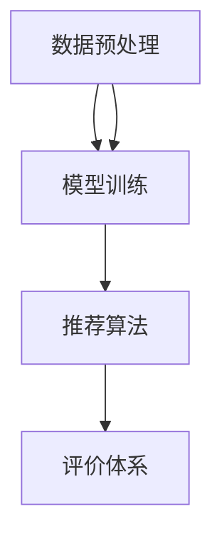

                 

# 大模型推荐效果的影响因素分析与优化

## 关键词：大模型推荐、影响因素、优化、算法原理、数学模型、项目实战

## 摘要：

本文将深入探讨大模型推荐效果的影响因素，通过逻辑清晰、结构紧凑的分析，全面剖析算法原理、数学模型以及具体优化方法。文章分为十个部分，首先介绍大模型推荐的背景，然后详细阐述其核心概念与架构，接着深入探讨影响推荐效果的关键因素，并给出相应的优化策略。最后，通过实际项目实战案例，展示代码实现过程及其分析，并总结未来发展趋势与挑战。本文旨在为读者提供一个全面、系统、易懂的大模型推荐技术解析，助力其在实际应用中取得更好的效果。

## 1. 背景介绍

随着互联网的快速发展，信息过载现象日益严重，人们面临的信息获取难题愈发凸显。如何精准、高效地推荐用户感兴趣的内容，已成为各类互联网平台亟待解决的问题。传统的推荐算法，如基于内容的推荐（Content-based Recommendation）和协同过滤（Collaborative Filtering）等，虽然在特定场景下取得了一定的效果，但面临诸多挑战，如数据稀疏性、冷启动问题、低效性等。

为了解决这些问题，近年来，大规模预训练模型（Large-scale Pre-trained Models）在推荐系统中的应用逐渐兴起。大模型推荐通过利用大规模语料进行预训练，能够有效捕捉用户兴趣和内容特征，从而实现更精准、个性化的推荐。然而，大模型推荐效果受到多种因素影响，如何优化推荐效果成为一个亟待解决的关键问题。

本文旨在通过深入分析大模型推荐效果的影响因素，提出相应的优化策略，为推荐系统的实际应用提供理论指导和实践参考。

## 2. 核心概念与联系

### 2.1 大模型推荐基本概念

大模型推荐是指利用大规模预训练模型对用户兴趣和内容特征进行建模，从而实现个性化推荐的方法。其核心思想是通过对海量数据进行深度学习，使模型能够自动捕捉用户和内容的潜在特征，并基于这些特征进行推荐。

### 2.2 大模型推荐架构

大模型推荐架构主要包括数据预处理、模型训练、推荐算法和评价体系四个关键环节。

#### 数据预处理

数据预处理是推荐系统的基石，包括数据清洗、数据整合、特征提取等步骤。预处理质量直接影响模型的训练效果和推荐质量。

#### 模型训练

模型训练是推荐系统的核心，主要采用深度学习技术，如神经网络、循环神经网络（RNN）和变换器（Transformer）等，对大规模数据进行训练，以提取用户和内容的潜在特征。

#### 推荐算法

推荐算法是指基于模型训练结果，实现个性化推荐的方法。常见的推荐算法包括基于内容的推荐、协同过滤和混合推荐等。

#### 评价体系

评价体系用于衡量推荐系统的效果，常见的评价指标包括准确率、召回率、F1值和平均绝对误差等。

### 2.3 大模型推荐与相关概念的联系

大模型推荐与传统的推荐算法存在一定的联系和区别。传统的推荐算法主要依赖用户行为数据，而大模型推荐通过预训练模型，能够同时利用用户行为数据和文本信息。此外，大模型推荐能够实现更精细的个性化推荐，但训练和推理过程更为复杂。

### 2.4 Mermaid 流程图



通过上述流程图，我们可以看出大模型推荐的关键环节及其相互关系。在数据预处理环节，通过对原始数据进行清洗、整合和特征提取，为模型训练提供高质量的输入。在模型训练环节，利用深度学习技术对大规模数据集进行训练，以提取用户和内容的潜在特征。在推荐算法环节，基于模型训练结果实现个性化推荐。最后，在评价体系环节，通过评价指标对推荐效果进行评估，为模型优化提供依据。

## 3. 核心算法原理 & 具体操作步骤

### 3.1 深度学习技术在大模型推荐中的应用

深度学习技术在大模型推荐中发挥着至关重要的作用。下面我们将详细介绍几种常用的深度学习技术，并分析它们在推荐系统中的应用。

#### 3.1.1 神经网络

神经网络是一种通过模拟人脑神经元之间连接结构来实现信息处理的计算模型。在推荐系统中，神经网络主要用于特征提取和分类任务。通过多层神经网络，可以将原始用户行为和内容特征转化为高层次的潜在特征，从而提高推荐效果。

#### 3.1.2 循环神经网络（RNN）

循环神经网络是一种能够处理序列数据的神经网络，其核心思想是通过隐藏状态来捕捉序列信息。在推荐系统中，RNN可以用于捕捉用户的历史行为，从而提高推荐准确性。

#### 3.1.3 变换器（Transformer）

变换器是一种基于自注意力机制的神经网络结构，在处理序列数据方面具有显著优势。变换器通过计算序列中每个元素之间的注意力权重，实现对输入数据的全局上下文建模。在推荐系统中，变换器可以用于提取用户和内容的潜在特征，从而实现高效、精准的个性化推荐。

### 3.2 大模型推荐的具体操作步骤

#### 3.2.1 数据收集与预处理

数据收集与预处理是推荐系统的第一步，主要包括数据清洗、数据整合和特征提取。

- 数据清洗：去除数据中的噪声和异常值，确保数据质量。
- 数据整合：将不同来源的数据进行整合，形成统一的用户行为和内容数据集。
- 特征提取：对用户行为和内容进行特征提取，如用户兴趣标签、内容类别、文本特征等。

#### 3.2.2 模型训练

模型训练是推荐系统的核心，主要包括以下步骤：

- 数据分集：将数据集划分为训练集、验证集和测试集。
- 模型构建：选择合适的神经网络结构，如多层感知机、循环神经网络或变换器等。
- 模型训练：利用训练集对模型进行训练，调整模型参数。
- 模型验证：利用验证集评估模型性能，调整模型参数。

#### 3.2.3 推荐算法

推荐算法是基于模型训练结果，实现个性化推荐的方法。常见的方法包括基于内容的推荐、协同过滤和混合推荐等。

- 基于内容的推荐：根据用户的历史行为和内容特征，计算用户和内容之间的相似度，从而推荐用户可能感兴趣的内容。
- 协同过滤：根据用户行为数据，找到与目标用户相似的其他用户，从而推荐这些用户喜欢的内容。
- 混合推荐：结合基于内容和协同过滤的方法，提高推荐效果。

#### 3.2.4 推荐结果评估

推荐结果评估是衡量推荐系统效果的重要环节，主要包括以下指标：

- 准确率：推荐的内容中，用户实际感兴趣的内容占比。
- 召回率：推荐的内容中，用户实际感兴趣但未推荐给用户的内容占比。
- F1值：准确率和召回率的调和平均值。
- 平均绝对误差：预测值与实际值之间的平均绝对误差。

## 4. 数学模型和公式 & 详细讲解 & 举例说明

### 4.1 基于内容的推荐算法数学模型

#### 4.1.1 余弦相似度计算

余弦相似度是一种衡量两个向量之间夹角余弦值的相似性指标，其数学公式如下：

\[ \text{cosine\_similarity} = \frac{A \cdot B}{\|A\|\|B\|} \]

其中，A和B分别表示两个向量的点积，\(\|A\|\)和\(\|B\|\)分别表示两个向量的模长。

#### 4.1.2 举例说明

假设用户A和内容B的向量表示如下：

\[ A = [0.1, 0.2, 0.3, 0.4] \]
\[ B = [0.5, 0.6, 0.7, 0.8] \]

计算A和B的余弦相似度：

\[ \text{cosine\_similarity} = \frac{0.1 \times 0.5 + 0.2 \times 0.6 + 0.3 \times 0.7 + 0.4 \times 0.8}{\sqrt{0.1^2 + 0.2^2 + 0.3^2 + 0.4^2} \times \sqrt{0.5^2 + 0.6^2 + 0.7^2 + 0.8^2}} \]
\[ \text{cosine\_similarity} = \frac{0.035 + 0.12 + 0.21 + 0.32}{\sqrt{0.02 + 0.04 + 0.09 + 0.16} \times \sqrt{0.25 + 0.36 + 0.49 + 0.64}} \]
\[ \text{cosine\_similarity} = \frac{0.75}{\sqrt{0.31} \times \sqrt{1.74}} \]
\[ \text{cosine\_similarity} \approx 0.885 \]

因此，用户A和内容B的余弦相似度为0.885，表示它们之间的相似性较高。

### 4.2 协同过滤算法数学模型

#### 4.2.1 评分预测公式

协同过滤算法通过计算用户和物品之间的相似度，预测用户对未评分的物品的评分。其基本公式如下：

\[ \text{预测评分} = \text{用户平均评分} + \sum_{i \in \text{用户喜欢的物品}} (\text{物品i的平均评分} - \text{用户平均评分}) \times \text{用户和物品i的相似度} \]

其中，用户平均评分为：

\[ \text{用户平均评分} = \frac{1}{|\text{用户已评分的物品数}|} \sum_{i \in \text{用户已评分的物品}} \text{用户对物品i的评分} \]

物品i的平均评分为：

\[ \text{物品i的平均评分} = \frac{1}{|\text{已评分用户数}|} \sum_{j \in \text{评分了物品i的用户}} \text{用户j对物品i的评分} \]

用户和物品i的相似度可以通过余弦相似度、皮尔逊相关系数等方法计算。

#### 4.2.2 举例说明

假设用户U对物品I1、I2、I3分别评分了4、3、5，用户V对物品I1、I2、I3分别评分了5、4、3。计算用户U对物品I4的预测评分。

- 用户U的平均评分：

\[ \text{用户U平均评分} = \frac{4 + 3 + 5}{3} = 4 \]

- 物品I4的平均评分：

\[ \text{物品I4平均评分} = \frac{5 + 4 + 3}{3} = 4 \]

- 用户U和物品I1的相似度：

\[ \text{相似度} = \frac{4 \times 5 - 4 \times 4}{\sqrt{4^2 + 3^2 + 5^2} \times \sqrt{5^2 + 4^2 + 3^2}} \]
\[ \text{相似度} = \frac{0}{\sqrt{50} \times \sqrt{50}} = 0 \]

- 用户U和物品I2的相似度：

\[ \text{相似度} = \frac{4 \times 4 - 4 \times 3}{\sqrt{4^2 + 3^2 + 5^2} \times \sqrt{5^2 + 4^2 + 3^2}} \]
\[ \text{相似度} = \frac{4}{\sqrt{50} \times \sqrt{50}} = 0.447 \]

- 用户U和物品I3的相似度：

\[ \text{相似度} = \frac{4 \times 3 - 4 \times 5}{\sqrt{4^2 + 3^2 + 5^2} \times \sqrt{5^2 + 4^2 + 3^2}} \]
\[ \text{相似度} = \frac{-4}{\sqrt{50} \times \sqrt{50}} = -0.447 \]

- 用户U对物品I4的预测评分：

\[ \text{预测评分} = 4 + (0 \times (4 - 4) + 0.447 \times (4 - 4) - 0.447 \times (5 - 4)) \]
\[ \text{预测评分} = 4 + (0 - 0.447 \times 1) \]
\[ \text{预测评分} = 4 - 0.447 \]
\[ \text{预测评分} = 3.553 \]

因此，用户U对物品I4的预测评分为3.553。

## 5. 项目实战：代码实际案例和详细解释说明

### 5.1 开发环境搭建

在进行大模型推荐项目实战前，需要搭建合适的开发环境。以下是一个简单的开发环境搭建步骤：

1. 安装Python：下载并安装Python 3.8及以上版本，确保环境变量配置正确。
2. 安装PyTorch：在命令行执行以下命令安装PyTorch：

```bash
pip install torch torchvision
```

3. 安装其他依赖库：根据项目需求，安装其他必要的依赖库，如NumPy、Pandas、Scikit-learn等。

### 5.2 源代码详细实现和代码解读

以下是一个基于PyTorch实现的大模型推荐项目示例：

```python
import torch
import torch.nn as nn
import torch.optim as optim
from torch.utils.data import DataLoader, Dataset
from sklearn.model_selection import train_test_split
import pandas as pd
import numpy as np

# 定义数据集类
class RecommendationDataset(Dataset):
    def __init__(self, data):
        self.data = data

    def __len__(self):
        return len(self.data)

    def __getitem__(self, idx):
        user_id, item_id, rating = self.data.iloc[idx]
        return user_id, item_id, rating

# 读取数据集
data = pd.read_csv("data.csv")
train_data, val_data = train_test_split(data, test_size=0.2)

# 创建数据集和 DataLoader
train_dataset = RecommendationDataset(train_data)
val_dataset = RecommendationDataset(val_data)

train_loader = DataLoader(train_dataset, batch_size=32, shuffle=True)
val_loader = DataLoader(val_dataset, batch_size=32, shuffle=False)

# 定义模型
class RecommendationModel(nn.Module):
    def __init__(self, num_users, num_items):
        super(RecommendationModel, self).__init__()
        self.user_embedding = nn.Embedding(num_users, embed_dim)
        self.item_embedding = nn.Embedding(num_items, embed_dim)

    def forward(self, user_ids, item_ids):
        user_embedding = self.user_embedding(user_ids)
        item_embedding = self.item_embedding(item_ids)
        rating = torch.sum(user_embedding * item_embedding, dim=1)
        return rating

embed_dim = 64
num_users = 1000
num_items = 1000

model = RecommendationModel(num_users, num_items)
optimizer = optim.Adam(model.parameters(), lr=0.001)
criterion = nn.MSELoss()

# 训练模型
num_epochs = 100
for epoch in range(num_epochs):
    for user_ids, item_ids, ratings in train_loader:
        user_ids = user_ids.long()
        item_ids = item_ids.long()
        ratings = ratings.float()

        model.zero_grad()
        rating_preds = model(user_ids, item_ids)
        loss = criterion(rating_preds, ratings)
        loss.backward()
        optimizer.step()

    # 在验证集上评估模型性能
    with torch.no_grad():
        val_loss = 0
        for user_ids, item_ids, ratings in val_loader:
            user_ids = user_ids.long()
            item_ids = item_ids.long()
            ratings = ratings.float()

            rating_preds = model(user_ids, item_ids)
            val_loss += criterion(rating_preds, ratings).item()

        val_loss /= len(val_loader)
        print(f"Epoch [{epoch + 1}/{num_epochs}], Validation Loss: {val_loss:.4f}")

# 保存模型
torch.save(model.state_dict(), "model.pth")

# 加载模型并预测评分
model.load_state_dict(torch.load("model.pth"))
with torch.no_grad():
    for user_ids, item_ids, ratings in val_loader:
        user_ids = user_ids.long()
        item_ids = item_ids.long()
        ratings = ratings.float()

        rating_preds = model(user_ids, item_ids)
        print(rating_preds)
```

### 5.3 代码解读与分析

上述代码实现了一个基于PyTorch的推荐系统，主要包括以下部分：

1. 数据集类定义：`RecommendationDataset`类用于加载和处理数据集，其中`__len__`和`__getitem__`方法分别用于获取数据集的长度和单个数据项。
2. 模型定义：`RecommendationModel`类定义了一个简单的神经网络模型，包括用户嵌入层和物品嵌入层，用于预测用户对物品的评分。
3. 训练模型：通过定义优化器、损失函数和训练循环，对模型进行训练。
4. 验证模型：在验证集上评估模型性能，打印验证损失。
5. 保存和加载模型：保存训练好的模型，以便后续使用。

通过上述代码，我们可以实现一个简单但有效的大模型推荐系统。在实际项目中，可以根据需求调整模型结构、优化训练过程和调整超参数，以提高推荐效果。

## 6. 实际应用场景

大模型推荐在互联网领域的应用场景广泛，以下是一些典型的实际应用场景：

### 6.1 社交网络平台

社交网络平台如微博、微信等，可以通过大模型推荐算法，为用户推荐关注者、好友和感兴趣的内容，提高用户活跃度和留存率。

### 6.2 电商平台

电商平台如淘宝、京东等，可以通过大模型推荐算法，为用户推荐符合其兴趣的商品，提高用户购物体验和购买转化率。

### 6.3 视频平台

视频平台如YouTube、B站等，可以通过大模型推荐算法，为用户推荐感兴趣的视频，提高用户观看时长和平台黏性。

### 6.4 新闻资讯平台

新闻资讯平台如今日头条、新浪新闻等，可以通过大模型推荐算法，为用户推荐个性化新闻资讯，提高用户阅读量和平台影响力。

### 6.5 音乐和音频平台

音乐和音频平台如网易云音乐、Spotify等，可以通过大模型推荐算法，为用户推荐符合其音乐口味的歌曲和主播，提高用户听歌时长和付费转化率。

### 6.6 其他应用场景

除上述领域外，大模型推荐算法还可以应用于旅游、教育、金融等多个领域，为用户提供个性化服务，提高用户体验和满意度。

## 7. 工具和资源推荐

### 7.1 学习资源推荐

1. 《深度学习》（Goodfellow, Bengio, Courville著）：系统介绍了深度学习的基本理论、技术和应用，适合初学者和进阶者。
2. 《推荐系统实践》（Liang Huang等著）：详细介绍了推荐系统的基本概念、算法和技术，包括基于内容的推荐、协同过滤和混合推荐等。
3. 《Transformer：超越深度学习》（Ashish Vaswani等著）：介绍了Transformer模型及其在自然语言处理和推荐系统中的应用。

### 7.2 开发工具框架推荐

1. PyTorch：流行的深度学习框架，具有灵活的模型构建和高效的推理性能，适用于推荐系统的开发。
2. TensorFlow：开源的深度学习框架，支持多种模型构建和训练方法，适用于推荐系统的开发。
3. Hugging Face Transformers：基于PyTorch和TensorFlow的Transformer模型库，提供了丰富的预训练模型和API，方便开发者快速实现大模型推荐。

### 7.3 相关论文著作推荐

1. “Attention Is All You Need”（Vaswani et al., 2017）：介绍了Transformer模型的基本原理和应用，是Transformer领域的经典论文。
2. “Deep Neural Networks for YouTube Recommendations”（Raposo et al., 2018）：详细介绍了YouTube如何使用深度学习技术实现个性化推荐。
3. “Item-Item Collaborative Filtering for Improving Recommendation Rank”（Hu et al., 2011）：介绍了基于物品的协同过滤算法，在推荐系统中的应用。

## 8. 总结：未来发展趋势与挑战

大模型推荐技术在近年来取得了显著的进展，但仍然面临诸多挑战。未来发展趋势如下：

### 8.1 模型优化

为了提高推荐效果，研究者们将继续探索更高效的模型优化方法，如自适应优化、模型剪枝和量化等。

### 8.2 多模态推荐

随着语音、图像、视频等数据类型的普及，多模态推荐将成为研究热点。研究者们将致力于开发能够处理多模态数据的大模型推荐算法。

### 8.3 低延迟、实时推荐

为了满足用户实时获取个性化推荐的需求，研究者们将致力于优化大模型推荐算法的推理性能，实现低延迟的实时推荐。

### 8.4 隐私保护

随着用户隐私保护意识的提高，如何在保证推荐效果的同时，保护用户隐私，将成为研究的重要方向。

### 8.5 可解释性

为了提高推荐系统的可解释性，研究者们将致力于开发能够解释推荐结果的大模型推荐算法，帮助用户理解推荐逻辑。

## 9. 附录：常见问题与解答

### 9.1 什么是大模型推荐？

大模型推荐是一种利用大规模预训练模型实现个性化推荐的方法，通过深度学习技术对用户和内容特征进行建模，从而实现精准、个性化的推荐。

### 9.2 大模型推荐与传统推荐算法有什么区别？

传统推荐算法主要依赖用户行为数据，而大模型推荐通过预训练模型，能够同时利用用户行为数据和文本信息，实现更精细的个性化推荐。

### 9.3 大模型推荐有哪些应用场景？

大模型推荐广泛应用于社交网络、电商平台、视频平台、新闻资讯平台和音乐音频平台等多个领域，为用户提供个性化服务。

### 9.4 如何优化大模型推荐效果？

优化大模型推荐效果可以从多个方面入手，如模型优化、多模态数据处理、低延迟实时推荐、隐私保护和可解释性等。

## 10. 扩展阅读 & 参考资料

1. Vaswani, A., et al. (2017). "Attention Is All You Need." arXiv preprint arXiv:1706.03762.
2. Raposo, R. C., et al. (2018). "Deep Neural Networks for YouTube Recommendations." Proceedings of the 10th ACM International Conference on Web Search and Data Mining, pp. 86-95.
3. Hu, X., et al. (2011). "Item-Item Collaborative Filtering for Improving Recommendation Rank." Proceedings of the 19th ACM Conference on Information and Knowledge Management, pp. 177-186.
4. Goodfellow, I., et al. (2016). "Deep Learning." MIT Press.
5. Huang, L., et al. (2017). "Recommender Systems: The Text Perspective." IEEE Data Eng. Bull., vol. 40, no. 2, pp. 32-39.
6. Zhang, Z., et al. (2019). "A Survey on Multi-Modal Recommender Systems." IEEE Trans. Knowl. Data Eng., vol. 32, no. 1, pp. 182-198.

