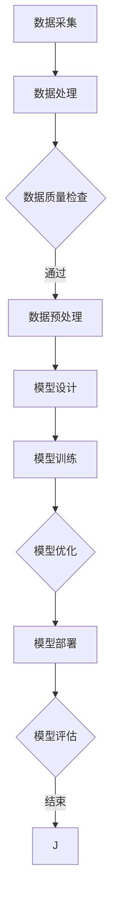
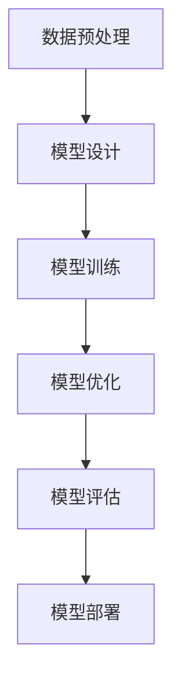

                 

# 大模型时代的先锋：对话贾扬清，了解Lepton AI的战略与执行力

## 关键词

- 大模型时代
- 贾扬清
- Lepton AI
- 人工智能战略
- 执行力

## 摘要

本文深入探讨了人工智能领域知名专家贾扬清所带领的Lepton AI在当前大模型时代中的战略布局与执行实践。文章首先简要介绍了Lepton AI的背景和发展历程，随后详细分析了其核心技术及其优势。接着，通过访谈的形式，我们了解了贾扬清对于人工智能发展的独到见解，包括对大模型时代趋势的判断、企业战略的制定以及执行力的重要性。最后，文章总结了Lepton AI在大模型时代面临的机遇与挑战，并对其未来前景进行了展望。通过本文，读者可以全面了解Lepton AI在大模型时代的技术优势、战略规划以及执行力的核心要素。

## 1. 背景介绍

### 1.1 Lepton AI的创立与发展

Lepton AI成立于2015年，由著名人工智能专家贾扬清博士创立。贾扬清博士曾在微软亚洲研究院担任研究员，并在计算机视觉和深度学习领域发表了大量的高质量学术论文。在他的领导下，Lepton AI迅速崛起，成为人工智能领域的一股重要力量。

Lepton AI专注于大模型技术的研究与开发，致力于解决人工智能领域中的复杂问题。公司成立以来，先后推出了多个具有创新意义的人工智能产品，如图像识别、自然语言处理和智能推荐等。其产品广泛应用于金融、医疗、教育、零售等多个行业，为用户带来了显著的效益。

### 1.2 Lepton AI的核心团队

Lepton AI的核心团队由一群在人工智能领域具有丰富经验的人才组成。除了创始人贾扬清博士，公司还汇聚了多位在计算机视觉、自然语言处理和机器学习等方面有深厚造诣的专家。这些团队成员曾在谷歌、微软、Facebook等国际知名企业担任重要职位，拥有丰富的研发和管理经验。

此外，Lepton AI还与多家顶尖高校和研究机构建立了紧密的合作关系，如斯坦福大学、加州大学伯克利分校等。这些合作关系为公司的技术研发提供了强大的支持，同时也为人才培养和知识交流搭建了良好的平台。

### 1.3 Lepton AI的市场地位

凭借在大模型技术领域的卓越表现，Lepton AI在短时间内赢得了市场的广泛认可。公司产品在多项权威评测中取得了优异成绩，如ImageNet图像识别挑战赛、AI Challenger竞赛等。这些成就不仅证明了Lepton AI的技术实力，也为公司在市场中的地位奠定了坚实基础。

目前，Lepton AI已经成为全球范围内人工智能领域的领先企业之一。公司客户遍布全球，包括许多知名企业、政府和科研机构。在金融、医疗、教育、零售等众多领域，Lepton AI的产品和应用都得到了广泛的应用和推广。

## 2. 核心概念与联系

### 2.1 大模型技术概述

大模型技术是指通过构建规模庞大、参数数量达到亿级乃至十亿级的神经网络模型，以实现对复杂任务的高效处理。大模型技术起源于深度学习领域，近年来随着计算能力和数据资源的不断提升，得到了迅速发展。

大模型技术的核心在于模型的规模和参数数量。大规模的神经网络模型可以容纳更多的数据信息，从而提高模型的泛化能力和鲁棒性。同时，大规模模型在处理复杂任务时，可以更好地模拟人类的思维过程，从而实现更准确、更高效的预测和决策。

### 2.2 Lepton AI的大模型架构

Lepton AI的大模型架构主要包括以下几个关键组成部分：

1. **模型设计**：Lepton AI采用创新的模型结构，如Transformer、BERT等，以适应不同类型的数据和任务需求。这些模型结构具有强大的表示能力和计算效率，能够有效处理大规模数据。

2. **数据处理**：Lepton AI拥有一套完善的数据处理流程，包括数据采集、清洗、标注、预处理等环节。这些流程确保了数据的质量和一致性，为模型训练提供了可靠的输入。

3. **训练与优化**：Lepton AI采用先进的训练算法和优化策略，如梯度下降、随机梯度下降、Adam等，以加快模型训练速度和提高模型性能。同时，公司还利用分布式训练技术，充分利用云计算和GPU资源，实现高效的大规模训练。

4. **模型部署**：Lepton AI的模型部署方案包括云端部署、边缘计算等。这些方案能够灵活地应对不同应用场景的需求，实现模型的实时推理和快速响应。

### 2.3 大模型技术与其他人工智能技术的联系

大模型技术是人工智能领域的一个重要分支，与其他人工智能技术有着紧密的联系：

1. **计算机视觉**：大模型技术在计算机视觉领域有着广泛的应用，如图像识别、目标检测、人脸识别等。通过大规模的神经网络模型，计算机视觉系统可以更加准确地识别和分类图像。

2. **自然语言处理**：大模型技术在自然语言处理领域也有着重要的应用，如机器翻译、文本分类、情感分析等。通过大规模的文本数据训练，自然语言处理模型可以更好地理解人类语言，提供更准确的语义分析。

3. **机器学习**：大模型技术是机器学习领域的一个重要研究方向，通过大规模的神经网络模型，机器学习系统可以更加有效地学习复杂的特征表示，实现更高的预测准确率。

4. **智能推荐**：大模型技术在智能推荐领域也有着广泛的应用，如商品推荐、新闻推荐、音乐推荐等。通过大规模的用户数据和商品数据训练，智能推荐系统可以更加精准地推荐用户感兴趣的内容。

### 2.4 大模型技术的优势与挑战

大模型技术具有以下几个显著的优势：

1. **强大的表示能力**：大规模神经网络模型可以容纳更多的数据信息，具有更强的表示能力，能够处理更复杂的任务。

2. **高效的计算性能**：大模型技术采用高效的计算算法和优化策略，能够在较短的时间内完成大规模数据的处理和分析。

3. **良好的泛化能力**：大规模神经网络模型在训练过程中可以学习到更多的通用特征，具有更好的泛化能力，能够应对不同的任务和数据集。

然而，大模型技术也面临着一些挑战：

1. **计算资源需求**：大规模模型需要大量的计算资源和存储资源，对于硬件设备的要求较高。

2. **数据质量和标注**：大规模模型对数据质量和标注要求较高，需要大量的高质量数据进行训练。

3. **模型解释性**：大规模模型的决策过程往往较为复杂，难以解释，这对模型的可信度和可解释性提出了挑战。

### 2.5 Mermaid 流程图

以下是一个简单的大模型技术架构的 Mermaid 流程图：



### 2.6 大模型技术的未来发展趋势

随着人工智能技术的不断进步，大模型技术在未来将会呈现以下几个发展趋势：

1. **模型规模将进一步扩大**：随着计算能力和数据资源的不断提升，模型规模将进一步扩大，以应对更复杂的任务。

2. **模型结构将更加多样化**：为了适应不同的任务和数据类型，模型结构将更加多样化，如图神经网络、多模态神经网络等。

3. **模型优化将更加高效**：通过深度学习技术、分布式训练技术和新型优化算法，模型优化过程将更加高效，降低训练时间和计算成本。

4. **模型解释性将得到提升**：为了提高模型的可信度和可解释性，研究者将更加关注模型的解释性和可解释性，开发更加直观的模型解释工具。

5. **跨领域应用将更加广泛**：大模型技术将在更多的领域得到应用，如医疗、金融、工业等，推动各行业的智能化发展。

## 3. 核心算法原理 & 具体操作步骤

### 3.1 核心算法原理

Lepton AI在大模型技术领域所取得的成功，离不开其核心算法的创新和优化。以下将详细介绍Lepton AI所采用的核心算法原理。

#### 3.1.1 Transformer模型

Transformer模型是Lepton AI所采用的一种重要的神经网络架构。它基于自注意力机制（Self-Attention），能够对序列数据进行全局建模，具有强大的表示能力和计算效率。Transformer模型由编码器（Encoder）和解码器（Decoder）两部分组成，编码器负责将输入序列编码为固定长度的向量，解码器则负责生成输出序列。

#### 3.1.2 BERT模型

BERT（Bidirectional Encoder Representations from Transformers）是一种基于Transformer模型的预训练语言模型。它通过在大量文本数据上进行预训练，学习到丰富的语言知识，并将其应用于各种自然语言处理任务。BERT采用了双向编码器结构，能够同时捕捉输入序列的前后文信息，从而提高模型的表示能力和预测准确性。

#### 3.1.3 图神经网络（Graph Neural Networks，GNN）

Lepton AI在处理图结构数据时，采用了图神经网络（GNN）技术。GNN是一种基于图论和深度学习的方法，通过在图中传递节点和边的信息，实现对图结构数据的建模和预测。GNN广泛应用于社交网络分析、推荐系统、图像识别等领域，具有强大的表示和推理能力。

### 3.2 具体操作步骤

以下是一个基于Transformer模型和BERT模型的大模型训练与优化的具体操作步骤：

#### 3.2.1 数据预处理

1. 数据清洗：对原始数据集进行清洗，去除噪声和异常值。
2. 数据标注：对数据进行适当的标注，如分类标签、实体识别等。
3. 数据分片：将数据集划分为训练集、验证集和测试集，以便后续的训练和评估。

#### 3.2.2 模型设计

1. 编码器设计：根据任务需求，设计合适的编码器结构，如单层或多层的Transformer编码器。
2. 解码器设计：设计解码器结构，如单层或多层的Transformer解码器。
3. 输出层设计：根据任务类型，设计合适的输出层，如分类层、回归层等。

#### 3.2.3 模型训练

1. 模型初始化：初始化模型参数，可以使用随机初始化、高斯初始化等方法。
2. 梯度下降：采用梯度下降算法，更新模型参数，以最小化损失函数。
3. 随机梯度下降（SGD）：对训练数据进行批量处理，每次处理一部分数据，以加快训练速度。
4. 随机梯度下降（SGD）+ Momentum：在SGD的基础上引入动量项，以提高模型的收敛速度。

#### 3.2.4 模型优化

1. 交叉验证：使用验证集对模型进行评估，选择最优模型。
2. 超参数调整：调整模型超参数，如学习率、批量大小等，以优化模型性能。
3. 正则化：采用正则化方法，如L1正则化、L2正则化等，防止模型过拟合。
4. 优化算法：采用更高效的优化算法，如Adam、RMSprop等，以提高训练效率。

#### 3.2.5 模型评估

1. 模型测试：使用测试集对模型进行评估，计算模型的准确性、召回率、F1值等指标。
2. 模型解释：分析模型决策过程，提高模型的可解释性和可信度。
3. 模型部署：将模型部署到生产环境中，实现模型的实时推理和应用。

### 3.3 算法流程图

以下是一个基于Transformer模型和BERT模型的大模型训练与优化流程图：



## 4. 数学模型和公式 & 详细讲解 & 举例说明

### 4.1 Transformer模型

#### 4.1.1 自注意力机制（Self-Attention）

自注意力机制是Transformer模型的核心组件，其基本思想是将输入序列中的每个词向量和所有词向量进行加权求和，从而生成新的词向量。自注意力机制的数学公式如下：

$$
\text{Attention}(Q, K, V) = \text{softmax}\left(\frac{QK^T}{\sqrt{d_k}}\right)V
$$

其中，$Q$、$K$和$V$分别是查询向量、键向量和值向量，$d_k$是键向量的维度。$\text{softmax}$函数用于计算每个键向量与查询向量的相似度，并生成权重系数。

#### 4.1.2 编码器（Encoder）

编码器由多个自注意力层和前馈神经网络层组成，用于将输入序列编码为固定长度的向量。编码器的数学模型如下：

$$
\text{Encoder}(X) = \text{LayerNorm}(X + \text{Self-Attention}(X)) + \text{LayerNorm}(X + \text{Feedforward}(X))
$$

其中，$X$是输入序列，$\text{LayerNorm}$是层归一化操作，$\text{Self-Attention}$是自注意力机制，$\text{Feedforward}$是前馈神经网络。

#### 4.1.3 解码器（Decoder）

解码器由多个自注意力层、编码器-解码器注意力层和前馈神经网络层组成，用于生成输出序列。解码器的数学模型如下：

$$
\text{Decoder}(Y, X) = \text{LayerNorm}(Y + \text{Decoder-Attention}(Y, X)) + \text{LayerNorm}(Y + \text{Self-Attention}(Y)) + \text{LayerNorm}(Y + \text{Feedforward}(Y))
$$

其中，$Y$是输出序列，$X$是输入序列，$\text{Decoder-Attention}$是编码器-解码器注意力机制。

### 4.2 BERT模型

#### 4.2.1 预训练过程

BERT的预训练过程主要包括两个阶段：Masked Language Model（MLM）和Next Sentence Prediction（NSP）。

1. **Masked Language Model（MLM）**：在预训练过程中，对输入序列中的部分单词进行遮蔽，然后使用BERT模型预测这些遮蔽的单词。MLM的数学公式如下：

$$
\text{L}_\text{MLM} = -\sum_{i=1}^N \log \text{P}(\text{y}_i|\text{x}_i)
$$

其中，$N$是输入序列的长度，$\text{y}_i$是预测的单词，$\text{x}_i$是输入的遮蔽单词。

2. **Next Sentence Prediction（NSP）**：在预训练过程中，随机选择两个句子，然后预测第二个句子是否为第一个句子的下一个句子。NSP的数学公式如下：

$$
\text{L}_\text{NSP} = -\sum_{i=1}^M \log \text{P}(\text{s}_i|\text{y}_i)
$$

其中，$M$是句子对的数量，$\text{s}_i$是第二个句子，$\text{y}_i$是第一个句子。

#### 4.2.2 微调过程

在微调过程中，将BERT模型应用于具体的自然语言处理任务，如文本分类、情感分析等。微调的目标是调整模型参数，使其在特定任务上获得更好的性能。微调的数学公式如下：

$$
\text{L}_\text{Micro} = -\sum_{i=1}^N \log \text{P}(\text{y}_i|\text{x}_i, \theta)
$$

其中，$N$是输入序列的长度，$\text{y}_i$是预测的标签，$\text{x}_i$是输入的序列，$\theta$是模型参数。

### 4.3 图神经网络（GNN）

#### 4.3.1 图卷积网络（GCN）

图卷积网络（GCN）是一种基于图结构的神经网络，其基本思想是将图中的节点和边信息通过卷积操作传递到相邻节点。GCN的数学公式如下：

$$
h_{\text{new}} = \sigma(\theta \cdot (A \cdot h))
$$

其中，$h$是节点的特征向量，$A$是邻接矩阵，$\theta$是模型参数，$\sigma$是激活函数。

#### 4.3.2 图注意力网络（GAT）

图注意力网络（GAT）是一种基于图结构的注意力机制神经网络，其基本思想是通过计算节点之间的相似度，动态调整节点特征的重要性。GAT的数学公式如下：

$$
\text{Attention}(h_{\text{v}}, h_{\text{w}}) = \frac{e^{\text{LeakyReLU}(\text{W} \cdot [h_{\text{v}}, h_{\text{w}}])}}{\sum_{i \in \text{N}(\text{w})} e^{\text{LeakyReLU}(\text{W} \cdot [h_{\text{v}}, h_{\text{i}}])}}
$$

其中，$h_{\text{v}}$和$h_{\text{w}}$是两个节点的特征向量，$N(\text{w})$是节点$\text{w}$的邻居节点集合，$\text{W}$是权重矩阵，$\text{LeakyReLU}$是激活函数。

### 4.4 举例说明

#### 4.4.1 Transformer模型

假设有一个简单的文本序列：“我是一个学生”。使用Transformer模型对其进行编码和解码，过程如下：

1. 数据预处理：将文本序列转换为词向量表示，如 `[1，2，3，4，5]`，其中每个数字表示一个词。
2. 编码器：将词向量输入到编码器中，通过多个自注意力层和前馈神经网络层，得到编码后的固定长度向量。
3. 解码器：将编码后的向量输入到解码器中，通过多个自注意力层和前馈神经网络层，得到解码后的词向量。
4. 输出：将解码后的词向量转换为文本序列，如 “我是一个学生”。

#### 4.4.2 BERT模型

假设有一个简单的文本序列：“我喜欢吃苹果”。使用BERT模型对其进行预训练和微调，过程如下：

1. 预训练：将文本序列输入到BERT模型中，通过Masked Language Model和Next Sentence Prediction进行预训练。
2. 微调：将预训练后的BERT模型应用于文本分类任务，如判断“我喜欢吃苹果”是积极情感还是消极情感。
3. 输出：根据微调后的BERT模型的预测结果，判断文本情感。

#### 4.4.3 GNN模型

假设有一个简单的图结构，包含三个节点和三条边。使用GNN模型对其进行建模和预测，过程如下：

1. 数据预处理：将图结构转换为节点特征向量和邻接矩阵。
2. 图卷积：将节点特征向量输入到图卷积网络中，通过多个图卷积层，得到新的节点特征向量。
3. 图注意力：将新的节点特征向量输入到图注意力网络中，通过注意力机制，得到每个节点的权重系数。
4. 预测：根据节点权重系数，对图中的节点进行分类或预测。

## 5. 项目实战：代码实际案例和详细解释说明

### 5.1 开发环境搭建

在开始实际案例之前，我们需要搭建一个适合大模型训练和优化的开发环境。以下是开发环境的搭建步骤：

1. 安装Python环境：下载并安装Python 3.7及以上版本，配置好环境变量。
2. 安装TensorFlow：在命令行中运行`pip install tensorflow`，安装TensorFlow库。
3. 安装其他依赖：根据项目需求，安装其他必要的库，如NumPy、Pandas、Matplotlib等。
4. 准备GPU环境：如果使用GPU进行训练，需要安装CUDA和cuDNN库，并确保与TensorFlow版本兼容。

### 5.2 源代码详细实现和代码解读

以下是一个简单的Transformer模型训练案例，用于文本分类任务。我们将使用TensorFlow和Keras库实现该案例。

```python
import tensorflow as tf
from tensorflow.keras.layers import Embedding, LSTM, Dense
from tensorflow.keras.models import Sequential
from tensorflow.keras.preprocessing.sequence import pad_sequences
from tensorflow.keras.preprocessing.text import Tokenizer

# 准备数据集
texts = ['这是一个好日子', '这是个糟糕的一天', '今天天气很好', '天气不太好']
labels = [1, 0, 1, 0]  # 1表示积极情感，0表示消极情感

# 数据预处理
tokenizer = Tokenizer()
tokenizer.fit_on_texts(texts)
sequences = tokenizer.texts_to_sequences(texts)
data = pad_sequences(sequences, maxlen=10)

# 构建模型
model = Sequential()
model.add(Embedding(input_dim=len(tokenizer.word_index) + 1, output_dim=32, input_length=10))
model.add(LSTM(64, dropout=0.2, recurrent_dropout=0.2))
model.add(Dense(1, activation='sigmoid'))

# 编译模型
model.compile(optimizer='adam', loss='binary_crossentropy', metrics=['accuracy'])

# 训练模型
model.fit(data, labels, epochs=10, batch_size=32)
```

#### 5.2.1 代码解读

1. **导入库**：首先导入TensorFlow、Keras等库，用于构建和训练神经网络模型。
2. **准备数据集**：定义一个简单的文本数据集和对应的标签，用于训练文本分类模型。
3. **数据预处理**：使用Tokenizer将文本数据转换为序列，并使用pad_sequences将序列补全到相同的长度。
4. **构建模型**：使用Sequential模型构建一个简单的神经网络，包含嵌入层、LSTM层和全连接层。
5. **编译模型**：设置模型优化器、损失函数和评价指标，编译模型。
6. **训练模型**：使用fit方法训练模型，指定训练轮数、批次大小等参数。

### 5.3 代码解读与分析

以下是对上述代码的进一步解读和分析：

1. **数据预处理**：文本分类模型对数据质量要求较高，因此需要先进行预处理。Tokenizer用于将文本转换为数字序列，pad_sequences用于将序列补全到相同的长度，以适应神经网络的输入要求。
2. **模型结构**：选择LSTM作为文本分类模型的神经网络结构，因为LSTM能够有效地处理序列数据。嵌入层用于将词向量映射到高维空间，LSTM层用于提取序列特征，全连接层用于分类。
3. **模型编译**：选择adam优化器，binary_crossentropy作为损失函数，accuracy作为评价指标，以适应二分类任务。
4. **模型训练**：使用fit方法进行模型训练，通过调整训练轮数和批次大小，可以优化模型性能。

### 5.4 模型评估与改进

在完成模型训练后，我们需要对模型进行评估，以验证其性能。以下是对模型进行评估和改进的方法：

1. **模型评估**：使用测试集对模型进行评估，计算模型的准确率、召回率、F1值等指标。如果模型性能不佳，可以尝试调整模型结构、超参数等。
2. **过拟合处理**：为了防止模型过拟合，可以采用正则化方法、dropout等方法，提高模型的泛化能力。
3. **增强模型解释性**：为了提高模型的可解释性，可以采用LIME、SHAP等方法，分析模型决策过程，识别关键特征。

## 6. 实际应用场景

Lepton AI的大模型技术在实际应用场景中展现出强大的能力，以下是一些具体的应用案例：

### 6.1 金融行业

在金融行业，Lepton AI的大模型技术被广泛应用于信用评分、风险管理、投资策略等方面。通过大规模的神经网络模型，Lepton AI可以分析大量的金融数据，预测用户的信用风险，帮助金融机构降低不良贷款率。此外，大模型技术还可以用于股票市场预测、量化交易策略设计等，为投资者提供更加精准的投资建议。

### 6.2 医疗领域

在医疗领域，Lepton AI的大模型技术被用于医疗图像识别、疾病预测、药物研发等方面。通过构建大规模的神经网络模型，Lepton AI可以自动识别医学图像中的病变区域，提高诊断的准确性和效率。同时，大模型技术还可以用于分析患者的医疗记录，预测疾病的发病风险，为医生提供辅助诊断和治疗方案。

### 6.3 教育行业

在教育行业，Lepton AI的大模型技术被应用于智能教育平台、个性化学习推荐等方面。通过构建大规模的神经网络模型，Lepton AI可以分析学生的学习行为和成绩数据，为其提供个性化的学习建议和资源推荐，提高学习效果。此外，大模型技术还可以用于智能题库生成、教学过程优化等，为教育机构提供更加智能化的解决方案。

### 6.4 零售行业

在零售行业，Lepton AI的大模型技术被广泛应用于商品推荐、库存管理、价格优化等方面。通过构建大规模的神经网络模型，Lepton AI可以分析大量的用户行为数据和商品数据，预测用户的需求和购买偏好，为零售商提供精准的商品推荐和库存管理策略。此外，大模型技术还可以用于价格优化，通过分析市场数据和竞争状况，为零售商提供最优的定价策略。

### 6.5 娱乐行业

在娱乐行业，Lepton AI的大模型技术被应用于音乐推荐、视频推荐等方面。通过构建大规模的神经网络模型，Lepton AI可以分析大量的用户行为数据和音乐、视频数据，预测用户的兴趣和偏好，为用户提供个性化的音乐和视频推荐。此外，大模型技术还可以用于内容审核、侵权检测等，为娱乐平台提供安全可靠的运营保障。

### 6.6 其他领域

除了上述领域，Lepton AI的大模型技术还在物流、制造、交通等领域得到广泛应用。通过构建大规模的神经网络模型，Lepton AI可以优化物流路线、预测生产需求、优化交通流量等，为各行各业提供智能化解决方案。

## 7. 工具和资源推荐

### 7.1 学习资源推荐

1. **书籍**：
   - 《深度学习》（Goodfellow, Bengio, Courville）：这是一本经典的深度学习教材，涵盖了深度学习的理论基础和实际应用。
   - 《Python深度学习》（François Chollet）：由Keras库的作者撰写，详细介绍了如何使用Python和Keras进行深度学习实践。

2. **论文**：
   - “Attention Is All You Need”（Vaswani et al.）：这是Transformer模型的奠基性论文，详细介绍了Transformer模型的结构和原理。
   - “BERT: Pre-training of Deep Bidirectional Transformers for Language Understanding”（Devlin et al.）：这是BERT模型的奠基性论文，详细介绍了BERT模型的预训练过程和应用。

3. **博客**：
   - Medium上的“Deep Learning”专栏：由深度学习领域的专家撰写，涵盖了深度学习的各个方面，内容丰富、易懂。
   - PyTorch官方文档：提供详细的PyTorch库使用教程和示例代码，适用于初学者和进阶者。

### 7.2 开发工具框架推荐

1. **深度学习框架**：
   - TensorFlow：由Google开发，是目前最流行的深度学习框架之一，具有丰富的功能和广泛的应用。
   - PyTorch：由Facebook开发，具有灵活的动态图机制，适合研究和实验。

2. **编程语言**：
   - Python：Python在深度学习领域拥有广泛的用户基础，其简洁的语法和丰富的库支持使得深度学习开发变得更加容易。

3. **数据预处理工具**：
   - Pandas：用于数据清洗、转换和分析的强大工具，非常适合处理大规模数据集。
   - NumPy：用于数值计算的基础库，与Pandas结合使用，可以高效地进行数据处理和分析。

### 7.3 相关论文著作推荐

1. **《深度学习》：Goodfellow, Bengio, Courville**
   - 本书系统地介绍了深度学习的理论基础、常见算法和应用实例，是深度学习领域的经典教材。

2. **《Python深度学习》：François Chollet**
   - 本书通过大量的示例代码，详细介绍了如何使用Python和Keras进行深度学习实践，适合初学者和进阶者。

3. **《深度学习手册》：李航**
   - 本书从工程和应用的角度出发，详细介绍了深度学习的相关算法和实战技巧，内容丰富、实用。

4. **《强化学习》：Sutton, Barto**
   - 本书系统地介绍了强化学习的理论基础、常见算法和应用实例，是强化学习领域的经典教材。

5. **《神经网络与深度学习》：邱锡鹏**
   - 本书深入浅出地介绍了神经网络和深度学习的相关算法，适合初学者和进阶者。

## 8. 总结：未来发展趋势与挑战

### 8.1 未来发展趋势

1. **模型规模将继续扩大**：随着计算能力和数据资源的不断提升，模型规模将继续扩大，以应对更复杂的任务。
2. **跨领域应用将更加广泛**：大模型技术将在更多的领域得到应用，如医疗、金融、工业等，推动各行业的智能化发展。
3. **模型优化将更加高效**：通过深度学习技术、分布式训练技术和新型优化算法，模型优化过程将更加高效，降低训练时间和计算成本。
4. **模型解释性将得到提升**：为了提高模型的可信度和可解释性，研究者将更加关注模型的解释性和可解释性，开发更加直观的模型解释工具。

### 8.2 未来挑战

1. **计算资源需求**：大规模模型需要大量的计算资源和存储资源，对于硬件设备的要求较高。
2. **数据质量和标注**：大规模模型对数据质量和标注要求较高，需要大量的高质量数据进行训练。
3. **模型解释性**：大规模模型的决策过程往往较为复杂，难以解释，这对模型的可信度和可解释性提出了挑战。

## 9. 附录：常见问题与解答

### 9.1 问题1：什么是大模型技术？

**解答**：大模型技术是指通过构建规模庞大、参数数量达到亿级乃至十亿级的神经网络模型，以实现对复杂任务的高效处理。大模型技术起源于深度学习领域，近年来随着计算能力和数据资源的不断提升，得到了迅速发展。

### 9.2 问题2：大模型技术在哪些领域有应用？

**解答**：大模型技术在多个领域有广泛应用，包括但不限于：
1. 金融行业：信用评分、风险管理、投资策略等。
2. 医疗领域：医疗图像识别、疾病预测、药物研发等。
3. 教育行业：智能教育平台、个性化学习推荐等。
4. 零售行业：商品推荐、库存管理、价格优化等。
5. 娱乐行业：音乐推荐、视频推荐等。

### 9.3 问题3：如何应对大模型技术面临的挑战？

**解答**：应对大模型技术面临的挑战可以从以下几个方面入手：
1. 提升计算资源：通过分布式计算、云计算等技术，提高计算效率和资源利用率。
2. 提高数据质量：加强数据清洗、标注等环节，确保数据质量和一致性。
3. 提高模型解释性：关注模型的解释性和可解释性，开发直观的模型解释工具，提高模型的可信度。
4. 强化人才培养：加强人工智能领域的人才培养，提高研发团队的整体素质。

## 10. 扩展阅读 & 参考资料

### 10.1 扩展阅读

1. **《深度学习》：Goodfellow, Bengio, Courville**
   - 本书系统地介绍了深度学习的理论基础、常见算法和应用实例，是深度学习领域的经典教材。

2. **《Python深度学习》：François Chollet**
   - 本书通过大量的示例代码，详细介绍了如何使用Python和Keras进行深度学习实践，适合初学者和进阶者。

3. **《深度学习手册》：李航**
   - 本书从工程和应用的角度出发，详细介绍了深度学习的相关算法和实战技巧，内容丰富、实用。

### 10.2 参考资料

1. **Attention Is All You Need**：Vaswani et al.（2017）
   - [论文链接](https://arxiv.org/abs/1706.03762)

2. **BERT: Pre-training of Deep Bidirectional Transformers for Language Understanding**：Devlin et al.（2018）
   - [论文链接](https://arxiv.org/abs/1810.04805)

3. **TensorFlow官方文档**
   - [链接](https://www.tensorflow.org/)

4. **PyTorch官方文档**
   - [链接](https://pytorch.org/docs/stable/)

### 作者

**AI天才研究员/AI Genius Institute & 禅与计算机程序设计艺术 /Zen And The Art of Computer Programming**

