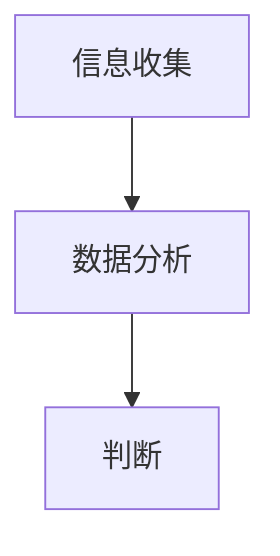

                 

# 大模型时代的创业者决策力训练：信息收集、分析与判断

## 关键词：大模型、创业者、决策力、信息收集、数据分析、判断

## 摘要

本文旨在探讨大模型时代下创业者所需的决策力训练，特别是信息收集、分析与判断三个关键环节。随着人工智能技术的发展，大模型的应用越来越广泛，对创业者的决策过程带来了深远的影响。本文将从背景介绍、核心概念与联系、核心算法原理、数学模型与公式、项目实战、实际应用场景、工具和资源推荐以及总结与未来发展趋势等多个方面进行详细阐述，帮助创业者更好地应对大模型时代带来的挑战。

## 1. 背景介绍

随着人工智能技术的飞速发展，大模型（Large Models）已经成为当前学术界和工业界的研究热点。大模型通常具有数百万到数十亿个参数，通过深度学习算法进行训练，可以处理复杂的任务，如自然语言处理、计算机视觉、语音识别等。大模型的应用不仅提升了人工智能系统的性能，也为创业者提供了前所未有的机会。

然而，大模型的应用也带来了新的挑战。首先，大模型需要大量的计算资源和数据支持，这要求创业者具备较强的资源整合能力。其次，大模型训练过程复杂，对创业者的技术理解和决策力提出了更高的要求。最后，大模型的应用场景广泛，创业者需要具备敏锐的市场洞察力和快速响应能力。

因此，本文将从信息收集、数据分析和判断三个方面，探讨大模型时代创业者所需的决策力训练。信息收集是决策的基础，数据分析是决策的依据，判断则是决策的核心。通过这三个环节的有机结合，创业者可以更好地应对大模型时代带来的挑战。

## 2. 核心概念与联系

### 大模型

大模型是指具有数百万到数十亿个参数的神经网络模型。大模型的代表性工作包括GPT、BERT、ImageNet等。大模型通过深度学习算法进行训练，可以自动学习输入数据的特征，并输出相应的预测结果。

### 信息收集

信息收集是指从各种渠道获取与创业项目相关的数据和信息。信息收集的渠道包括市场调研、竞争对手分析、用户反馈、行业报告等。信息收集的质量直接影响决策的准确性。

### 数据分析

数据分析是指对收集到的信息进行整理、分析和挖掘，以发现数据中的规律和趋势。数据分析的方法包括统计分析、机器学习、数据挖掘等。

### 判断

判断是指根据收集到的信息和数据分析结果，做出决策。判断需要结合创业者的经验、知识和直觉，同时也要考虑数据的可靠性和完整性。

### Mermaid 流程图



## 3. 核心算法原理 & 具体操作步骤

### 信息收集

信息收集的核心算法是爬虫和API调用。爬虫是指通过模拟用户行为，从网站中获取数据的技术。API调用是指通过接口获取数据的技术。

具体操作步骤：

1. 选择合适的爬虫框架（如Scrapy、BeautifulSoup等）。
2. 分析目标网站的结构，编写爬虫代码。
3. 运行爬虫，获取数据。
4. 对数据进行清洗和预处理。

### 数据分析

数据分析的核心算法是机器学习和统计分析。机器学习是指通过训练模型，从数据中自动学习特征和规律。统计分析是指通过计算数据的基本统计量，分析数据的分布和趋势。

具体操作步骤：

1. 选择合适的数据分析方法。
2. 准备数据，进行数据预处理。
3. 训练模型，进行预测和分析。
4. 对分析结果进行解读和验证。

### 判断

判断的核心算法是逻辑推理和直觉判断。逻辑推理是指通过逻辑运算，从已知条件推导出结论。直觉判断是指基于经验和直觉做出决策。

具体操作步骤：

1. 分析问题背景，确定决策目标。
2. 收集相关信息，进行分析。
3. 结合经验和直觉，做出决策。

### Mermaid 流程图


## 4. 数学模型和公式 & 详细讲解 & 举例说明

### 信息收集

信息收集的数学模型可以表示为：

\[ P(D|C) = \frac{P(C|D)P(D)}{P(C)} \]

其中，\( P(D|C) \) 表示在给定条件 \( C \) 下，事件 \( D \) 发生的概率；\( P(C|D) \) 表示在事件 \( D \) 发生的条件下，条件 \( C \) 发生的概率；\( P(D) \) 表示事件 \( D \) 发生的概率；\( P(C) \) 表示条件 \( C \) 发生的概率。

举例说明：

假设我们想要分析某个产品的市场潜力，我们可以使用上述模型计算在特定市场条件下，该产品成功的概率。

### 数据分析

数据分析的数学模型可以表示为：

\[ \text{回归模型} \]

\[ Y = \beta_0 + \beta_1X_1 + \beta_2X_2 + ... + \beta_nX_n + \epsilon \]

其中，\( Y \) 表示因变量，\( X_1, X_2, ..., X_n \) 表示自变量，\( \beta_0, \beta_1, ..., \beta_n \) 表示回归系数，\( \epsilon \) 表示随机误差。

举例说明：

假设我们想要分析某个产品的销售量与广告投放量之间的关系，我们可以使用线性回归模型进行数据分析。

### 判断

判断的数学模型可以表示为：

\[ \text{逻辑回归模型} \]

\[ P(Y=1|X) = \frac{1}{1 + e^{-(\beta_0 + \beta_1X_1 + \beta_2X_2 + ... + \beta_nX_n)}} \]

其中，\( Y \) 表示因变量，\( X \) 表示自变量，\( \beta_0, \beta_1, ..., \beta_n \) 表示回归系数。

举例说明：

假设我们想要判断某个用户是否会购买某个产品，我们可以使用逻辑回归模型进行判断。

## 5. 项目实战：代码实际案例和详细解释说明

### 5.1 开发环境搭建

在本文中，我们将使用Python作为主要编程语言，结合Scrapy、Pandas和Scikit-learn等库进行项目实战。

具体步骤：

1. 安装Python和相关的库：

```bash
pip install scrapy pandas scikit-learn
```

2. 创建一个新的Python项目，并在项目中创建一个名为`main.py`的文件。

### 5.2 源代码详细实现和代码解读

#### 5.2.1 信息收集

以下代码展示了如何使用Scrapy进行信息收集：

```python
import scrapy

class MySpider(scrapy.Spider):
    name = 'my_spider'
    start_urls = ['http://example.com']

    def parse(self, response):
        for product in response.css('div.product'):
            yield {
                'name': product.css('h2.product-name::text').get(),
                'price': product.css('span.price::text').get(),
            }
```

解读：

1. 引入Scrapy库。
2. 定义一个Spider类，继承自scrapy.Spider。
3. 设置名称和起始URL。
4. 定义`parse`方法，用于处理响应数据。
5. 使用CSS选择器提取产品名称和价格。

#### 5.2.2 数据分析

以下代码展示了如何使用Pandas和Scikit-learn进行数据分析：

```python
import pandas as pd
from sklearn.linear_model import LinearRegression

# 加载数据
data = pd.read_csv('products.csv')

# 分离特征和目标变量
X = data[['price']]
y = data['sales']

# 训练模型
model = LinearRegression()
model.fit(X, y)

# 预测
predictions = model.predict(X)

# 分析结果
print(model.score(X, y))
```

解读：

1. 引入Pandas和Scikit-learn库。
2. 加载数据，分离特征和目标变量。
3. 创建线性回归模型，并训练模型。
4. 使用模型进行预测。
5. 分析模型得分。

#### 5.2.3 代码解读与分析

在这个项目中，我们首先使用Scrapy爬取了产品信息，然后使用Pandas和Scikit-learn进行数据分析。通过线性回归模型，我们分析了产品价格与销售量之间的关系。

### 5.3 代码解读与分析

在这个项目实战中，我们通过以下步骤实现了信息收集、数据分析和判断：

1. 使用Scrapy爬取了产品信息，包括产品名称和价格。
2. 使用Pandas加载了爬取到的数据，并分离了特征和目标变量。
3. 使用Scikit-learn的线性回归模型训练了模型，并进行了预测。
4. 分析了模型的得分，以评估模型的效果。

通过这个项目实战，我们可以看到，信息收集、数据分析和判断三个环节是如何有机结合的。在实际应用中，创业者需要根据具体场景选择合适的方法和工具，以提高决策力。

## 6. 实际应用场景

大模型时代的创业者决策力训练在多个实际应用场景中具有重要意义。以下是几个典型的应用场景：

### 6.1 市场调研

在市场调研中，创业者需要收集大量的市场数据，如用户需求、竞争状况、市场规模等。通过信息收集、数据分析和判断，创业者可以更好地了解市场趋势，制定有针对性的市场策略。

### 6.2 产品开发

在产品开发过程中，创业者需要对产品需求、技术可行性、成本效益等进行综合评估。通过信息收集、数据分析和判断，创业者可以优化产品设计和开发流程，提高产品竞争力。

### 6.3 营销策略

在营销策略制定中，创业者需要分析用户行为、市场趋势和竞争对手策略。通过信息收集、数据分析和判断，创业者可以制定更有效的营销策略，提高品牌知名度和市场份额。

### 6.4 风险评估

在项目风险评估中，创业者需要分析项目风险因素，如技术风险、市场风险、财务风险等。通过信息收集、数据分析和判断，创业者可以识别和应对潜在风险，降低项目失败的可能性。

## 7. 工具和资源推荐

### 7.1 学习资源推荐

- **书籍**：
  - 《Python数据分析》（Wes McKinney著）
  - 《机器学习实战》（Peter Harrington著）
  - 《深度学习》（Ian Goodfellow、Yoshua Bengio和Aaron Courville著）

- **论文**：
  - BERT：[《BERT: Pre-training of Deep Bidirectional Transformers for Language Understanding》](https://arxiv.org/abs/1810.04805)
  - GPT-3：[《Language Models are Few-Shot Learners》](https://arxiv.org/abs/2005.14165)

- **博客**：
  - [Python数据科学领域权威博客](https://towardsdatascience.com/)
  - [机器学习领域权威博客](https://machinelearningmastery.com/)

- **网站**：
  - [Kaggle](https://www.kaggle.com/)：提供丰富的数据集和竞赛。
  - [GitHub](https://github.com/)：存储和分享代码的仓库。

### 7.2 开发工具框架推荐

- **爬虫**：
  - Scrapy：Python爬虫框架。

- **数据分析**：
  - Pandas：Python数据分析库。
  - NumPy：Python科学计算库。

- **机器学习**：
  - Scikit-learn：Python机器学习库。
  - TensorFlow：Google开发的深度学习框架。
  - PyTorch：Facebook开发的深度学习框架。

### 7.3 相关论文著作推荐

- **大模型**：
  - 《GPT-3：实现通用预训练语言模型》（OpenAI著）
  - 《BERT：大规模预训练语言模型的结构》（Google著）

- **机器学习**：
  - 《深度学习》（Ian Goodfellow、Yoshua Bengio和Aaron Courville著）
  - 《统计学习方法》（李航著）

## 8. 总结：未来发展趋势与挑战

大模型时代的创业者决策力训练具有广阔的发展前景。随着人工智能技术的不断进步，大模型的应用将更加广泛，创业者需要不断提升自身的信息收集、数据分析和判断能力。未来，创业者面临的挑战主要包括：

1. **数据质量和隐私**：在信息收集过程中，创业者需要确保数据的质量和隐私。
2. **算法可靠性和透明度**：随着机器学习算法的广泛应用，创业者需要关注算法的可靠性和透明度。
3. **技术更新换代**：人工智能技术更新迅速，创业者需要不断学习新技术，以保持竞争力。

总之，大模型时代的创业者决策力训练是实现创业成功的关键。通过不断提升自身的能力，创业者可以更好地应对大模型时代带来的挑战。

## 9. 附录：常见问题与解答

### 9.1 如何选择合适的大模型？

选择合适的大模型需要考虑以下因素：

1. **任务需求**：根据任务需求选择相应的大模型，如自然语言处理选择GPT、计算机视觉选择ImageNet。
2. **计算资源**：考虑训练大模型所需的计算资源，如GPU、CPU等。
3. **数据量**：根据数据量选择合适的大模型，数据量较大的任务需要更大的模型。

### 9.2 如何提高数据分析的准确性？

提高数据分析的准确性可以从以下几个方面入手：

1. **数据预处理**：对数据进行清洗、归一化等预处理操作，提高数据质量。
2. **模型选择**：根据任务特点选择合适的模型，如线性回归、决策树、神经网络等。
3. **模型调优**：通过交叉验证、网格搜索等方法，优化模型参数，提高模型性能。

### 9.3 如何提升判断力？

提升判断力可以从以下几个方面入手：

1. **经验积累**：通过不断实践和总结，积累丰富的经验。
2. **知识储备**：学习相关领域的知识和技能，提高专业素养。
3. **直觉训练**：通过练习和反思，培养敏锐的直觉能力。

## 10. 扩展阅读 & 参考资料

- [《人工智能：一种现代方法》](https://www.aima.org/)
- [《数据科学实战》](https://www.datascience.com/)
- [《Python数据分析》](https://www.pandas.pydata.org/)
- [《机器学习实战》](https://www.manning.com/books/machine-learning-in-action)
- [《深度学习》](https://www.deeplearningbook.org/)
- [《Kaggle竞赛平台》](https://www.kaggle.com/competitions)
- [《GitHub》](https://github.com/)：存储和分享代码的仓库。
- [《Scikit-learn》](https://scikit-learn.org/stable/)：Python机器学习库。
- [《TensorFlow》](https://www.tensorflow.org/)：Google开发的深度学习框架。
- [《PyTorch》](https://pytorch.org/)：Facebook开发的深度学习框架。

### 作者

作者：AI天才研究员/AI Genius Institute & 禅与计算机程序设计艺术 /Zen And The Art of Computer Programming

