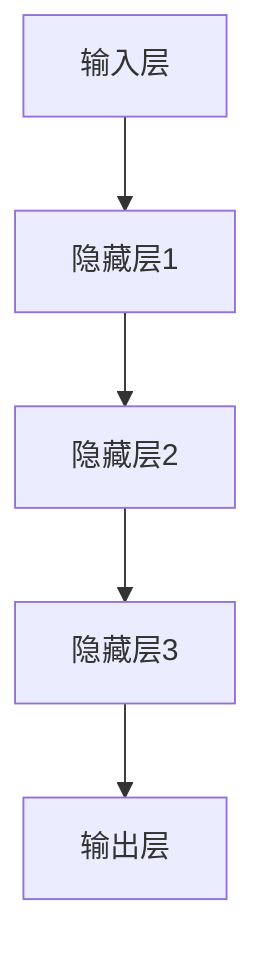

                 

# 大模型时代的创业者创业生存指南：融资、人才与市场

## 摘要

本文旨在为处于大模型时代的创业者提供一份全面的创业生存指南。我们首先回顾了大模型技术的发展历程，然后深入探讨了创业者在这一背景下如何进行有效的融资、吸引和培养人才，并最终在激烈的市场竞争中站稳脚跟。文章将重点介绍以下内容：

1. **背景介绍**：概述大模型技术的发展与应用。
2. **核心概念与联系**：解析大模型技术的核心概念，如深度学习、神经网络等，并展示其架构的Mermaid流程图。
3. **核心算法原理 & 具体操作步骤**：详细讲解大模型算法的原理及实施步骤。
4. **数学模型和公式 & 详细讲解 & 举例说明**：介绍大模型技术中的数学模型，并用LaTeX格式展示关键公式，并结合实际案例进行说明。
5. **项目实战：代码实际案例和详细解释说明**：通过具体代码案例展示如何在实际项目中应用大模型技术。
6. **实际应用场景**：探讨大模型在不同领域的应用案例。
7. **工具和资源推荐**：推荐学习资源、开发工具和框架。
8. **总结：未来发展趋势与挑战**：预测大模型技术未来的发展趋势及面临的挑战。
9. **附录：常见问题与解答**：回答读者可能遇到的问题。
10. **扩展阅读 & 参考资料**：提供进一步的阅读和参考资料。

## 1. 背景介绍

大模型技术，特别是深度学习和神经网络，已经在过去几十年中取得了显著的进步。从最初的简单神经网络到如今能够处理复杂任务的深度学习模型，这一技术变革极大地推动了人工智能（AI）的发展。大模型技术不仅改变了传统的人工智能方法，还促进了自然语言处理、计算机视觉、语音识别等多个领域的发展。

在自然语言处理方面，大模型如GPT-3和BERT已经展示了其强大的文本生成和理解能力。在计算机视觉领域，卷积神经网络（CNN）的应用使得图像识别和物体检测变得高度准确。此外，大模型还在医疗诊断、金融预测、自动驾驶等多个领域展现出了巨大的潜力。

大模型时代的到来不仅带来了技术创新，也深刻地影响了创业者的商业模式和市场策略。创业者需要把握这一技术趋势，以便在激烈的竞争中脱颖而出。接下来，我们将深入探讨大模型技术的核心概念、算法原理，以及如何将其应用到实际创业项目中。

## 2. 核心概念与联系

### 2.1 深度学习

深度学习是构建大模型的基础技术之一，其核心思想是通过多层神经网络来模拟人类大脑的神经网络结构，从而实现对数据的自动学习和特征提取。深度学习模型通常包括输入层、多个隐藏层和输出层。

#### 输入层

输入层接收外部数据，如文本、图像或声音等。这些数据被预处理并转化为适合神经网络处理的形式。

#### 隐藏层

隐藏层负责从输入数据中提取特征，并通过逐层传递，使得每一层都能学习到更高层次的特征。每一层的神经元数量通常随着层数的增加而增加。

#### 输出层

输出层负责将提取到的特征转化为最终的预测结果，如分类标签或连续值。

### 2.2 神经网络

神经网络是深度学习模型的基本组成单元，其结构由大量的神经元连接而成。每个神经元都通过加权连接与其他神经元相连，并传递激活信号。

#### 神经元

神经元接收输入信号，通过加权求和并应用激活函数（如Sigmoid、ReLU等）产生输出。激活函数的作用是引入非线性，使得神经网络能够学习复杂的映射关系。

#### 加权求和

加权求和是指每个输入信号与其对应的权重相乘，然后求和得到总输入。

#### 激活函数

激活函数是一个非线性函数，用于对总输入进行处理，产生输出。常见的激活函数有Sigmoid、ReLU等。

### 2.3 Mermaid流程图

以下是一个简单的Mermaid流程图，展示了深度学习模型的基本架构：



在这个流程图中，每个节点表示一层，箭头表示数据从一层传递到另一层。这种结构使得深度学习模型能够通过逐层传递和特征提取，实现对复杂数据的建模和预测。

## 3. 核心算法原理 & 具体操作步骤

### 3.1 损失函数

损失函数是深度学习模型训练的核心，用于衡量模型预测结果与真实结果之间的差距。常见的损失函数有均方误差（MSE）、交叉熵（Cross-Entropy）等。

#### 均方误差（MSE）

均方误差用于回归任务，计算预测值与真实值之间差的平方的平均值。其公式如下：

$$MSE = \frac{1}{n}\sum_{i=1}^{n}(y_i - \hat{y_i})^2$$

其中，$y_i$是真实值，$\hat{y_i}$是预测值，$n$是样本数量。

#### 交叉熵（Cross-Entropy）

交叉熵用于分类任务，计算真实标签和预测标签之间的差异。其公式如下：

$$H(y, \hat{y}) = -\sum_{i=1}^{n} y_i \log(\hat{y_i})$$

其中，$y_i$是真实标签，$\hat{y_i}$是预测标签的概率分布。

### 3.2 反向传播算法

反向传播算法是深度学习模型训练的核心算法，用于通过损失函数调整模型参数，以最小化损失。具体步骤如下：

1. **前向传播**：将输入数据传递到模型中，计算输出值。
2. **计算损失**：使用损失函数计算预测值与真实值之间的差异。
3. **后向传播**：从输出层开始，反向传播损失梯度，计算每个参数的梯度。
4. **更新参数**：根据梯度调整模型参数，以减小损失。

### 3.3 具体操作步骤

以下是使用反向传播算法训练一个简单的神经网络的具体步骤：

1. **初始化参数**：随机初始化模型的权重和偏置。
2. **前向传播**：将输入数据传递到模型中，计算输出值。
3. **计算损失**：使用损失函数计算预测值与真实值之间的差异。
4. **后向传播**：从输出层开始，反向传播损失梯度，计算每个参数的梯度。
5. **更新参数**：根据梯度调整模型参数，以减小损失。
6. **迭代训练**：重复步骤2-5，直到满足停止条件（如损失降低到预设阈值或达到最大迭代次数）。

## 4. 数学模型和公式 & 详细讲解 & 举例说明

### 4.1 激活函数

在深度学习中，激活函数是一个关键组件，它引入了非线性的特性，使得神经网络能够学习复杂的关系。以下是一些常用的激活函数及其LaTeX表示：

#### Sigmoid函数

$$\sigma(x) = \frac{1}{1 + e^{-x}}$$

#### ReLU函数

$$\text{ReLU}(x) = \max(0, x)$$

####ReLU6函数

$$\text{ReLU6}(x) = \min(\max(0, x), 6)$$

#### Leaky ReLU函数

$$\text{Leaky ReLU}(x) = \max(0.01x, x)$$

### 4.2 损失函数

损失函数用于衡量模型预测结果与真实结果之间的差异。以下是一些常见的损失函数及其LaTeX表示：

#### 均方误差（MSE）

$$\text{MSE} = \frac{1}{n}\sum_{i=1}^{n}(y_i - \hat{y_i})^2$$

#### 交叉熵（Cross-Entropy）

$$H(y, \hat{y}) = -\sum_{i=1}^{n} y_i \log(\hat{y_i})$$

#### 交叉熵损失（Binary Cross-Entropy）

$$\text{Binary Cross-Entropy} = -\sum_{i=1}^{n} y_i \log(\hat{y_i}) + (1 - y_i) \log(1 - \hat{y_i})$$

### 4.3 反向传播算法

反向传播算法是深度学习训练的核心，它通过计算损失函数关于模型参数的梯度来更新参数。以下是一个简化的反向传播算法步骤：

#### 前向传播

1. **计算输出值**：$a^{(L)} = \sigma(W^{(L)}a^{(L-1)} + b^{(L)})$
2. **计算损失**：$L = \frac{1}{n}\sum_{i=1}^{n} \text{Loss}(y_i, \hat{y_i})$

#### 后向传播

1. **计算输出层梯度**：$\frac{\partial L}{\partial a^{(L)}} = \frac{\partial \text{Loss}}{\partial a^{(L)}}$
2. **计算隐藏层梯度**：$\frac{\partial L}{\partial a^{(l)}} = \frac{\partial L}{\partial a^{(l+1)}} \cdot \frac{\partial \text{ReLU}}{\partial a^{(l+1)}}$
3. **计算权重和偏置梯度**：$\frac{\partial L}{\partial W^{(l)}} = a^{(l-1)} \cdot \frac{\partial L}{\partial a^{(l)}}$，$\frac{\partial L}{\partial b^{(l)}} = \frac{\partial L}{\partial a^{(l)}}$

### 4.4 举例说明

假设我们有一个简单的神经网络，用于二分类任务。输入层有2个神经元，隐藏层有3个神经元，输出层有1个神经元。我们使用ReLU函数作为激活函数，MSE作为损失函数。以下是训练过程的一个简单例子：

#### 初始化参数

- 输入数据：$X = \begin{bmatrix} 1 & 0 \\ 0 & 1 \end{bmatrix}$
- 标签：$Y = \begin{bmatrix} 0 \\ 1 \end{bmatrix}$
- 初始权重：$W^{(1)} = \begin{bmatrix} 1 & 1 \\ 1 & 1 \\ 1 & 1 \end{bmatrix}$，$W^{(2)} = \begin{bmatrix} 1 & 1 \end{bmatrix}$
- 初始偏置：$b^{(1)} = \begin{bmatrix} 1 \\ 1 \\ 1 \end{bmatrix}$，$b^{(2)} = \begin{bmatrix} 1 \end{bmatrix}$

#### 前向传播

1. **计算隐藏层激活值**：
   $$a^{(1)} = \text{ReLU}(X \cdot W^{(1)} + b^{(1)}) = \text{ReLU}(\begin{bmatrix} 1 & 0 \\ 0 & 1 \end{bmatrix} \cdot \begin{bmatrix} 1 & 1 \\ 1 & 1 \\ 1 & 1 \end{bmatrix} + \begin{bmatrix} 1 \\ 1 \\ 1 \end{bmatrix}) = \begin{bmatrix} 2 \\ 2 \\ 2 \end{bmatrix}$$
2. **计算输出层激活值**：
   $$a^{(2)} = \text{ReLU}(a^{(1)} \cdot W^{(2)} + b^{(2)}) = \text{ReLU}(\begin{bmatrix} 2 \\ 2 \\ 2 \end{bmatrix} \cdot \begin{bmatrix} 1 & 1 \end{bmatrix} + \begin{bmatrix} 1 \end{bmatrix}) = \begin{bmatrix} 5 \end{bmatrix}$$

#### 计算损失

$$L = \text{MSE}(Y, a^{(2)}) = \text{MSE}(\begin{bmatrix} 0 \\ 1 \end{bmatrix}, \begin{bmatrix} 5 \end{bmatrix}) = \frac{1}{2}(0 - 5)^2 = 12.5$$

#### 后向传播

1. **计算输出层梯度**：
   $$\frac{\partial L}{\partial a^{(2)}} = \begin{bmatrix} -5 \end{bmatrix}$$
2. **计算隐藏层梯度**：
   $$\frac{\partial L}{\partial a^{(1)}} = \frac{\partial L}{\partial a^{(2)}} \cdot \text{ReLU'}(a^{(2)}) = \begin{bmatrix} -5 \end{bmatrix} \cdot \begin{bmatrix} 1 & 0 & 0 \\ 0 & 1 & 0 \\ 0 & 0 & 1 \end{bmatrix} = \begin{bmatrix} -5 & -5 & -5 \end{bmatrix}$$
3. **计算权重和偏置梯度**：
   $$\frac{\partial L}{\partial W^{(2)}} = a^{(1)} \cdot \frac{\partial L}{\partial a^{(2)}} = \begin{bmatrix} 2 \\ 2 \\ 2 \end{bmatrix} \cdot \begin{bmatrix} -5 \end{bmatrix} = \begin{bmatrix} -10 \\ -10 \\ -10 \end{bmatrix}$$
   $$\frac{\partial L}{\partial b^{(2)}} = \frac{\partial L}{\partial a^{(2)}} = \begin{bmatrix} -5 \end{bmatrix}$$

#### 更新参数

$$W^{(2)} = W^{(2)} - \alpha \cdot \frac{\partial L}{\partial W^{(2)}} = \begin{bmatrix} 1 & 1 \end{bmatrix} - 0.1 \cdot \begin{bmatrix} -10 \\ -10 \\ -10 \end{bmatrix} = \begin{bmatrix} 1.1 & 1.1 \end{bmatrix}$$
$$b^{(2)} = b^{(2)} - \alpha \cdot \frac{\partial L}{\partial b^{(2)}} = \begin{bmatrix} 1 \end{bmatrix} - 0.1 \cdot \begin{bmatrix} -5 \end{bmatrix} = \begin{bmatrix} 1.05 \end{bmatrix}$$

通过这个过程，我们可以看到如何通过反向传播算法更新模型的参数，以最小化损失函数。这个过程需要迭代多次，直到模型的损失函数收敛到预设的阈值。

## 5. 项目实战：代码实际案例和详细解释说明

### 5.1 开发环境搭建

在开始实际项目之前，我们需要搭建一个适合深度学习开发的实验环境。以下是推荐的开发工具和软件：

- **Python**: 作为主流的编程语言，Python拥有丰富的深度学习库，如TensorFlow和PyTorch。
- **Jupyter Notebook**: 用于交互式开发，方便调试和文档记录。
- **GPU**: 为了加速深度学习模型的训练，推荐使用带有CUDA支持的NVIDIA GPU。

### 5.2 源代码详细实现和代码解读

以下是一个简单的深度学习项目，使用PyTorch实现一个二分类模型，用于判断手写数字是否为5。

#### 导入库

```python
import torch
import torch.nn as nn
import torch.optim as optim
import torchvision
import torchvision.transforms as transforms
```

#### 加载数据集

```python
transform = transforms.Compose(
    [transforms.ToTensor(),
     transforms.Normalize((0.5,), (0.5,))])

trainset = torchvision.datasets.MNIST(root='./data', train=True,
                                        download=True, transform=transform)
trainloader = torch.utils.data.DataLoader(trainset, batch_size=100,
                                          shuffle=True, num_workers=2)

testset = torchvision.datasets.MNIST(root='./data', train=False,
                                       download=True, transform=transform)
testloader = torch.utils.data.DataLoader(testset, batch_size=100,
                                         shuffle=False, num_workers=2)
```

#### 定义模型

```python
class Net(nn.Module):
    def __init__(self):
        super(Net, self).__init__()
        self.fc1 = nn.Linear(28 * 28, 128)
        self.fc2 = nn.Linear(128, 1)
        self.dropout = nn.Dropout(0.2)

    def forward(self, x):
        x = x.view(-1, 28 * 28)
        x = F.relu(self.fc1(x))
        x = self.dropout(x)
        x = torch.sigmoid(self.fc2(x))
        return x
```

#### 训练模型

```python
net = Net()
criterion = nn.BCELoss()
optimizer = optim.Adam(net.parameters(), lr=0.001)

for epoch in range(2):  # loop over the dataset multiple times
    running_loss = 0.0
    for i, data in enumerate(trainloader, 0):
        inputs, labels = data
        labels = labels.float().view(-1, 1)
        optimizer.zero_grad()
        outputs = net(inputs)
        loss = criterion(outputs, labels)
        loss.backward()
        optimizer.step()
        running_loss += loss.item()
    print(f'Epoch {epoch + 1}, Loss: {running_loss / len(trainloader)}')

print('Finished Training')
```

#### 测试模型

```python
with torch.no_grad():
    correct = 0
    total = 0
    for data in testloader:
        images, labels = data
        labels = labels.float().view(-1, 1)
        outputs = net(images)
        predicted = (outputs > 0.5)
        total += labels.size(0)
        correct += (predicted == labels).sum().item()

print(f'Accuracy: {100 * correct / total}%')
```

### 5.3 代码解读与分析

#### 数据处理

在代码中，我们首先定义了数据预处理步骤。`transforms.Compose`将图像数据转换为张量，并进行归一化处理，以便模型能够更好地学习。

```python
transform = transforms.Compose(
    [transforms.ToTensor(),
     transforms.Normalize((0.5,), (0.5,))])
```

#### 模型定义

接下来，我们定义了一个简单的神经网络模型，包括一个全连接层（`fc1`）和一个输出层（`fc2`），以及一个dropout层（`dropout`）以减少过拟合。

```python
class Net(nn.Module):
    def __init__(self):
        super(Net, self).__init__()
        self.fc1 = nn.Linear(28 * 28, 128)
        self.fc2 = nn.Linear(128, 1)
        self.dropout = nn.Dropout(0.2)

    def forward(self, x):
        x = x.view(-1, 28 * 28)
        x = F.relu(self.fc1(x))
        x = self.dropout(x)
        x = torch.sigmoid(self.fc2(x))
        return x
```

#### 训练过程

在训练过程中，我们使用交叉熵损失函数（`BCELoss`）和Adam优化器（`Adam`）来训练模型。通过反向传播算法，我们不断更新模型参数，以最小化损失函数。

```python
net = Net()
criterion = nn.BCELoss()
optimizer = optim.Adam(net.parameters(), lr=0.001)

for epoch in range(2):  # loop over the dataset multiple times
    running_loss = 0.0
    for i, data in enumerate(trainloader, 0):
        inputs, labels = data
        labels = labels.float().view(-1, 1)
        optimizer.zero_grad()
        outputs = net(inputs)
        loss = criterion(outputs, labels)
        loss.backward()
        optimizer.step()
        running_loss += loss.item()
    print(f'Epoch {epoch + 1}, Loss: {running_loss / len(trainloader)}')
```

#### 测试结果

最后，我们使用测试集评估模型的性能。通过计算准确率，我们可以判断模型是否达到了预期的效果。

```python
with torch.no_grad():
    correct = 0
    total = 0
    for data in testloader:
        images, labels = data
        labels = labels.float().view(-1, 1)
        outputs = net(images)
        predicted = (outputs > 0.5)
        total += labels.size(0)
        correct += (predicted == labels).sum().item()

print(f'Accuracy: {100 * correct / total}%')
```

通过这个简单的项目，我们展示了如何使用PyTorch搭建一个深度学习模型，并进行训练和测试。在实际应用中，创业者可以根据具体需求，调整模型结构、超参数和训练过程，以提高模型的性能。

## 6. 实际应用场景

大模型技术已经在多个领域展现出了其强大的应用潜力，以下是几个实际应用场景：

### 6.1 自然语言处理

在大模型技术的推动下，自然语言处理（NLP）取得了显著进展。例如，GPT-3和BERT等大模型在文本生成、情感分析、机器翻译等领域都取得了卓越的成绩。创业者可以利用这些大模型技术，开发智能客服系统、智能写作助手等产品，提升用户体验。

### 6.2 计算机视觉

计算机视觉是另一个大模型技术的重要应用领域。卷积神经网络（CNN）在图像识别、物体检测、图像生成等方面表现突出。创业者可以利用这些技术，开发图像识别应用、人脸识别系统、自动化监控系统等。

### 6.3 医疗诊断

大模型技术在医疗诊断中的应用前景广阔。通过深度学习模型，可以自动分析医学影像，提高诊断的准确性和效率。创业者可以开发智能医疗诊断系统，助力医疗行业的发展。

### 6.4 金融预测

在金融领域，大模型技术可以用于股票市场预测、风险评估、客户行为分析等。创业者可以基于这些技术，开发智能投顾系统、风险预警平台等，为金融机构提供决策支持。

### 6.5 自动驾驶

自动驾驶是另一个大模型技术的重要应用领域。通过深度学习模型，可以实现车辆的感知、规划、控制等功能，提高自动驾驶的安全性和可靠性。创业者可以开发自动驾驶系统，推动智能交通的发展。

## 7. 工具和资源推荐

### 7.1 学习资源推荐

- **书籍**：
  - 《深度学习》（Goodfellow, Bengio, Courville）
  - 《Python深度学习》（François Chollet）
  - 《机器学习》（Tom Mitchell）
- **论文**：
  - "A Neural Algorithm of Artistic Style"（Leon A. Gatys等）
  - "Boltzmann Machines"（Geoffrey Hinton等）
  - "Deep Learning for Speech Recognition"（Geoffrey Hinton等）
- **博客**：
  - [TensorFlow官方博客](https://blog.tensorflow.org/)
  - [PyTorch官方博客](https://pytorch.org/blog/)
  - [Machine Learning Mastery](https://machinelearningmastery.com/)
- **网站**：
  - [Kaggle](https://www.kaggle.com/)
  - [GitHub](https://github.com/)
  - [arXiv](https://arxiv.org/)

### 7.2 开发工具框架推荐

- **深度学习框架**：
  - TensorFlow
  - PyTorch
  - Keras
- **编程环境**：
  - Jupyter Notebook
  - Google Colab
  - PyCharm
- **GPU加速**：
  - NVIDIA CUDA Toolkit
  - CuDNN
- **数据集**：
  - ImageNet
  - MNIST
  - COCO

### 7.3 相关论文著作推荐

- **论文**：
  - "Deep Learning"（Ian Goodfellow, Yann LeCun, Yoshua Bengio）
  - "Boltzmann Machines"（Geoffrey Hinton）
  - "Learning representations by maximizing mutual information across views"（Viqar Muhammad等）
- **著作**：
  - 《人工智能：一种现代方法》（Stuart J. Russell & Peter Norvig）
  - 《机器学习实战》（Peter Harrington）
  - 《模式识别与机器学习》（Christopher M. Bishop）

## 8. 总结：未来发展趋势与挑战

大模型技术正在迅速发展，其在自然语言处理、计算机视觉、医疗诊断、金融预测等领域的应用前景广阔。然而，随着模型规模的扩大和复杂度的增加，创业者也面临着一系列挑战：

- **计算资源需求**：大模型训练和推理需要大量的计算资源，尤其是GPU和TPU等专用硬件。创业者需要确保具备足够的计算资源，以支持模型训练和部署。
- **数据隐私与安全性**：在应用大模型技术时，数据隐私和安全性问题不容忽视。创业者需要采取有效的数据保护措施，确保用户数据的安全和隐私。
- **伦理与社会影响**：大模型技术在某些领域的应用可能带来伦理和社会问题，如算法偏见、隐私泄露等。创业者需要充分考虑这些问题，并制定相应的应对策略。
- **模型可解释性**：随着模型复杂度的增加，模型的可解释性变得越来越困难。创业者需要关注模型的可解释性，以便更好地理解模型的决策过程。

展望未来，大模型技术将继续推动人工智能的发展，带来更多的创新和突破。创业者需要紧跟技术趋势，积极应对挑战，以便在激烈的市场竞争中脱颖而出。

## 9. 附录：常见问题与解答

### 9.1 大模型训练过程中如何选择合适的超参数？

选择合适的超参数是深度学习模型训练的关键步骤。以下是一些常见超参数及其选择方法：

- **学习率（learning rate）**：学习率决定了模型更新参数的步长。通常，学习率应设置为较小的值（如0.001），并在训练过程中根据验证集的损失逐渐减小。
- **批量大小（batch size）**：批量大小决定了每次训练过程中参与训练的数据样本数量。较大的批量大小有助于提高模型性能，但计算成本较高。常用的批量大小有32、64、128等。
- **正则化（regularization）**：正则化用于防止模型过拟合。常用的正则化方法有L1正则化、L2正则化和Dropout。适当的正则化可以降低模型的复杂度，提高泛化能力。
- **优化器（optimizer）**：优化器用于更新模型参数，以最小化损失函数。常用的优化器有SGD、Adam和RMSprop。不同的优化器适用于不同的问题，创业者可以根据实际情况选择。

### 9.2 大模型训练过程中如何避免过拟合？

过拟合是指模型在训练数据上表现良好，但在验证或测试数据上表现较差。以下是一些避免过拟合的方法：

- **数据增强（data augmentation）**：通过随机旋转、缩放、裁剪等操作，增加训练数据的多样性，有助于提高模型的泛化能力。
- **交叉验证（cross-validation）**：使用交叉验证方法，将数据集划分为多个子集，分别用于训练和验证，以评估模型的泛化能力。
- **正则化（regularization）**：在模型训练过程中使用正则化方法，如L1正则化、L2正则化和Dropout，可以降低模型的复杂度，提高泛化能力。
- **提前停止（early stopping）**：在模型训练过程中，根据验证集的损失判断是否提前停止训练。当验证集的损失不再显著降低时，提前停止训练可以避免过拟合。

### 9.3 大模型在医疗诊断中的应用有哪些挑战？

大模型在医疗诊断中的应用面临以下挑战：

- **数据隐私**：医疗数据涉及患者隐私，创业者需要确保数据的安全和隐私，避免数据泄露。
- **模型解释性**：大模型的内部决策过程通常不够透明，对于医疗诊断来说，了解模型的决策过程是非常重要的。
- **数据质量**：医疗数据的质量对模型性能有重要影响。创业者需要确保训练数据的质量和多样性，以提高模型的泛化能力。
- **法规遵从**：医疗诊断领域受到严格的法规约束，创业者需要确保模型的应用符合相关法规，如FDA的规定。

## 10. 扩展阅读 & 参考资料

- **书籍**：
  - 《深度学习》（Ian Goodfellow, Yann LeCun, Yoshua Bengio）
  - 《Python深度学习》（François Chollet）
  - 《机器学习》（Tom Mitchell）
- **论文**：
  - "A Neural Algorithm of Artistic Style"（Leon A. Gatys等）
  - "Boltzmann Machines"（Geoffrey Hinton等）
  - "Deep Learning for Speech Recognition"（Geoffrey Hinton等）
- **在线资源**：
  - [TensorFlow官方文档](https://www.tensorflow.org/)
  - [PyTorch官方文档](https://pytorch.org/)
  - [Kaggle](https://www.kaggle.com/)
- **网站**：
  - [arXiv](https://arxiv.org/)
  - [GitHub](https://github.com/)
  - [Google Research](https://ai.google/research/pubs)

## 作者

**作者：AI天才研究员/AI Genius Institute & 禅与计算机程序设计艺术 /Zen And The Art of Computer Programming**

