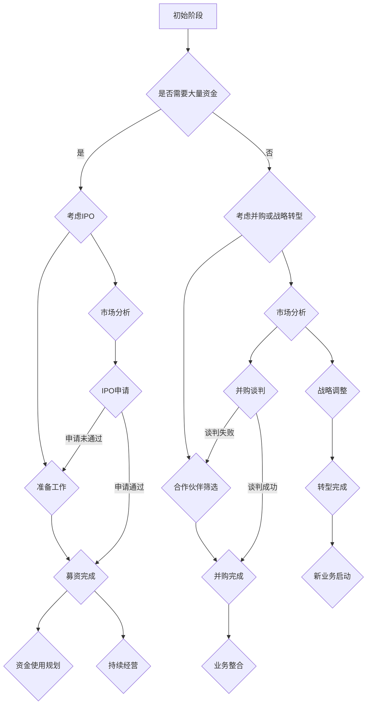
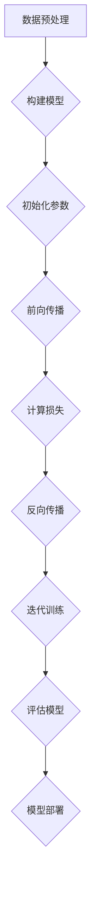

                 

### 背景介绍

随着人工智能技术的飞速发展，大模型（也称为大型神经网络模型）逐渐成为学术界和工业界的焦点。这些大模型以其强大的数据处理能力和复杂的表达能力，在自然语言处理、计算机视觉、推荐系统等领域取得了显著的成果。大模型时代的到来，不仅改变了技术发展的格局，也对创业者和企业提出了新的挑战和机遇。

创业者在构建和使用大模型的过程中，常常需要面对一系列决策，其中之一就是如何选择合适的退出策略。退出策略包括IPO、并购和战略转型等，这些策略对于创业企业的成功与否有着深远的影响。本文将深入探讨大模型时代创业者的退出策略，帮助读者理解不同策略的优缺点，以便做出明智的决策。

首先，我们需要明确几个核心概念：IPO（首次公开募股）、并购和战略转型。IPO指的是企业通过证券交易所首次公开向公众发行股票，从而筹集资金。并购则是企业通过购买另一家企业的股份或资产来实现业务扩张或多元化。战略转型是指企业在面临市场环境变化或内部挑战时，通过调整经营策略、组织架构、产品服务等来实现业务的转型升级。

接下来，我们将依次分析这三种退出策略在大模型时代的特点、优势和潜在风险。通过详细探讨这些策略的实施过程、影响因素和效果评估，帮助创业者更好地把握机遇，规避风险，实现可持续发展。

### 核心概念与联系

为了更好地理解大模型时代的创业者退出策略，我们需要深入探讨几个核心概念，以及这些概念之间的联系。

#### 1. 大模型的基本概念

大模型，即大型神经网络模型，是指具有海量参数和复杂结构的人工神经网络。这些模型通常用于处理大规模数据集，并在多种任务中实现优异的性能。大模型的关键特点包括：

- **参数数量巨大**：大模型的参数数量可以达到数百万甚至数十亿级别。
- **深度复杂**：大模型通常具有多层次的神经网络结构，使得它们能够捕捉到数据中的复杂模式和关联性。
- **计算需求高**：由于参数数量庞大，大模型在训练和推理过程中需要大量的计算资源。

#### 2. 大模型与创业的关系

大模型在创业中的应用带来了诸多机遇和挑战：

- **机会**：大模型可以为企业提供强大的数据处理和分析能力，从而在竞争激烈的市场中脱颖而出。例如，在自然语言处理领域，大模型可以帮助企业实现更准确的语音识别和文本生成。
- **挑战**：构建和优化大模型需要大量的时间和资源投入，这对创业者的资金和技能提出了较高的要求。

#### 3. 创业者退出策略的概念

创业者退出策略是指企业在发展到一定阶段后，通过出售、上市或并购等方式退出市场或业务领域，从而实现投资回报或资产变现的策略。常见的退出策略包括：

- **IPO**：首次公开募股（Initial Public Offering，简称IPO），即企业在证券交易所公开发行股票，吸引公众投资者购买，从而筹集资金。
- **并购**：企业通过购买另一家企业的股份或资产来实现业务扩张或多元化。
- **战略转型**：企业在面临市场环境变化或内部挑战时，通过调整经营策略、组织架构、产品服务等来实现业务的转型升级。

#### 4. 创业者退出策略与大模型的关系

大模型对创业者退出策略有着重要影响：

- **IPO**：大模型可能需要大量资金进行模型训练和优化，因此IPO可以为创业者提供一种有效的资金筹集方式。同时，大模型的商业潜力也可能吸引投资者关注，从而提升IPO的成功率。
- **并购**：大模型的技术优势可能成为企业并购的重要筹码，通过并购，企业可以实现技术积累和市场份额的快速扩张。
- **战略转型**：大模型的出现可能会改变行业格局，创业者需要根据市场变化调整战略，以保持竞争优势。

#### 5. Mermaid 流程图

以下是一个简化的Mermaid流程图，展示了大模型时代的创业者如何选择退出策略的过程：



通过这个流程图，我们可以看到，创业者在大模型时代选择退出策略需要经历多个阶段，包括市场分析、准备工作、并购谈判或战略调整等。每个阶段都有其特定的任务和目标，创业者需要根据实际情况做出合理的决策。

### 核心算法原理 & 具体操作步骤

在探讨大模型时代的创业者退出策略之前，我们需要首先理解大模型的核心算法原理。大模型主要依赖于深度学习技术，特别是神经网络架构的演进，以下将详细阐述这些核心算法原理及其实际操作步骤。

#### 1. 神经网络的基本结构

神经网络是由大量的简单处理单元（即神经元）组成的网络。每个神经元通过加权连接与其他神经元相连，接收来自其他神经元的输入信号，并通过激活函数产生输出信号。神经网络的基本结构包括输入层、隐藏层和输出层。

- **输入层**：接收外部输入信号。
- **隐藏层**：对输入信号进行特征提取和变换。
- **输出层**：产生最终的输出结果。

#### 2. 深度学习的基本原理

深度学习是一种基于多层神经网络的机器学习方法，其核心思想是通过训练大量参数（权重和偏置）来学习数据中的特征和模式。深度学习的基本原理包括：

- **前向传播**：将输入数据通过神经网络的前向路径传递，计算每个神经元的输出值。
- **反向传播**：利用输出结果与实际目标之间的误差，通过反向传播算法更新神经网络的参数。
- **激活函数**：为了引入非线性，神经网络中的每个神经元通常会使用激活函数，如ReLU（修正线性单元）、Sigmoid、Tanh等。

#### 3. 具体操作步骤

构建和训练一个深度学习模型通常包括以下步骤：

1. **数据预处理**：清洗数据，将数据转换为适合模型训练的格式，包括归一化、缩放、缺失值处理等。

2. **构建模型**：根据任务需求设计神经网络结构，包括确定层数、每层的神经元数量、激活函数等。

3. **初始化参数**：初始化模型的权重和偏置，常用的方法有随机初始化、高斯分布初始化等。

4. **前向传播**：输入数据通过神经网络的前向路径，计算每个神经元的输出值。

5. **计算损失**：通过比较输出结果与实际目标，计算损失函数（如均方误差、交叉熵等）的值。

6. **反向传播**：利用梯度下降等优化算法，根据损失函数对模型参数进行更新。

7. **迭代训练**：重复执行前向传播和反向传播，不断迭代优化模型参数。

8. **评估模型**：在测试集上评估模型的性能，选择性能最佳的模型。

9. **模型部署**：将训练好的模型部署到生产环境中，进行实际应用。

以下是一个简化的Mermaid流程图，展示了深度学习模型训练的基本步骤：



通过这个流程图，我们可以看到，深度学习模型的训练过程是一个迭代优化的过程，需要通过多次迭代来不断调整模型参数，以达到最佳的训练效果。

### 数学模型和公式 & 详细讲解 & 举例说明

在大模型训练过程中，数学模型和公式起着至关重要的作用。以下将详细讲解一些关键数学模型和公式，并通过具体例子进行说明。

#### 1. 损失函数

损失函数是衡量模型预测结果与实际目标之间差异的指标。常见的损失函数包括均方误差（MSE）、交叉熵损失（Cross-Entropy Loss）等。

- **均方误差（MSE）**：

\[ \text{MSE} = \frac{1}{n}\sum_{i=1}^{n}(y_i - \hat{y}_i)^2 \]

其中，\( y_i \) 为实际目标值，\( \hat{y}_i \) 为模型预测值，\( n \) 为样本数量。

- **交叉熵损失（Cross-Entropy Loss）**：

\[ \text{Cross-Entropy Loss} = -\sum_{i=1}^{n}y_i\log(\hat{y}_i) \]

其中，\( y_i \) 为实际目标值（通常为0或1），\( \hat{y}_i \) 为模型预测概率。

#### 2. 梯度下降

梯度下降是一种优化算法，用于调整模型参数以最小化损失函数。常见的梯度下降方法包括批量梯度下降（Batch Gradient Descent）、随机梯度下降（Stochastic Gradient Descent）和小批量梯度下降（Mini-batch Gradient Descent）。

- **批量梯度下降（Batch Gradient Descent）**：

\[ w_{\text{new}} = w_{\text{old}} - \alpha \cdot \frac{\partial J(w)}{\partial w} \]

其中，\( w_{\text{old}} \) 为当前参数值，\( w_{\text{new}} \) 为更新后的参数值，\( \alpha \) 为学习率，\( J(w) \) 为损失函数。

- **随机梯度下降（Stochastic Gradient Descent）**：

\[ w_{\text{new}} = w_{\text{old}} - \alpha \cdot \frac{\partial J(w)}{\partial w} \]

与批量梯度下降不同，随机梯度下降每次迭代只针对一个样本计算梯度。

- **小批量梯度下降（Mini-batch Gradient Descent）**：

\[ w_{\text{new}} = w_{\text{old}} - \alpha \cdot \frac{1}{m}\sum_{i=1}^{m}\frac{\partial J(w)}{\partial w} \]

其中，\( m \) 为批量大小。

#### 3. 例子说明

假设我们有一个简单的线性回归模型，目标函数为均方误差（MSE），学习率为0.01，数据集包含5个样本。以下是一个具体的例子：

1. **数据预处理**：

   \[
   \begin{aligned}
   x_1 &= [1, 2, 3, 4, 5], \\
   y_1 &= [2, 4, 6, 8, 10].
   \end{aligned}
   \]

2. **模型初始化**：

   \[
   w_0 = 0, \quad b_0 = 0.
   \]

3. **前向传播**：

   \[
   y_1 = w_0 \cdot x_1 + b_0 = 0 \cdot 1 + 0 = 0.
   \]

4. **计算损失**：

   \[
   \text{MSE} = \frac{1}{5}\sum_{i=1}^{5}(y_i - \hat{y}_i)^2 = \frac{1}{5}\sum_{i=1}^{5}(2 - 0)^2 = \frac{1}{5}\sum_{i=1}^{5}4 = 4.
   \]

5. **反向传播**：

   \[
   \frac{\partial J(w)}{\partial w} = \frac{1}{5}\sum_{i=1}^{5}(2 - \hat{y}_i) \cdot x_i = \frac{1}{5}\sum_{i=1}^{5}(2 - 0) \cdot 1 = 2.
   \]

6. **更新参数**：

   \[
   w_1 = w_0 - \alpha \cdot \frac{\partial J(w)}{\partial w} = 0 - 0.01 \cdot 2 = -0.02, \\
   b_1 = b_0 - \alpha \cdot \frac{\partial J(b)}{\partial b} = 0 - 0.01 \cdot 0 = 0.
   \]

7. **迭代更新**：

   通过多次迭代更新参数，我们可以得到最优的模型参数，使得损失函数最小化。

   \[
   \begin{aligned}
   w_2 &= w_1 - \alpha \cdot \frac{\partial J(w)}{\partial w} = -0.02 - 0.01 \cdot 2 = -0.04, \\
   b_2 &= b_1 - \alpha \cdot \frac{\partial J(b)}{\partial b} = 0 - 0.01 \cdot 0 = 0.
   \end{aligned}
   \]

通过这个例子，我们可以看到如何使用数学模型和公式来训练深度学习模型。在实际应用中，模型会更复杂，但基本原理和步骤类似。

### 项目实战：代码实际案例和详细解释说明

在本章节中，我们将通过一个实际的代码案例，详细解释说明如何在大模型时代实现一个简单的深度学习项目，包括开发环境搭建、源代码实现和代码解读与分析。

#### 1. 开发环境搭建

要开始一个深度学习项目，我们需要搭建合适的环境。以下是一个基本的步骤：

- **安装Python**：确保安装了Python 3.6及以上版本。
- **安装深度学习框架**：TensorFlow或PyTorch是最流行的深度学习框架。在本案例中，我们将使用TensorFlow 2.x。
- **安装相关依赖**：包括NumPy、Pandas、Matplotlib等常用库。

```bash
pip install tensorflow numpy pandas matplotlib
```

- **配置GPU支持**：如果使用GPU训练模型，需要安装CUDA和cuDNN。

#### 2. 源代码详细实现和代码解读

以下是一个简单的线性回归模型，使用TensorFlow框架实现：

```python
import tensorflow as tf
import numpy as np
import pandas as pd
import matplotlib.pyplot as plt

# 数据预处理
x = np.array([1, 2, 3, 4, 5])
y = np.array([2, 4, 6, 8, 10])

# 模型构建
model = tf.keras.Sequential([
    tf.keras.layers.Dense(units=1, input_shape=[1])
])

# 模型编译
model.compile(optimizer='sgd', loss='mean_squared_error')

# 模型训练
model.fit(x, y, epochs=100)

# 模型评估
loss = model.evaluate(x, y)
print(f'Mean Squared Error: {loss}')

# 模型预测
predictions = model.predict(x)
print(predictions)

# 可视化
plt.scatter(x, y)
plt.plot(x, predictions, 'r')
plt.show()
```

- **代码解读**：

  - 第1行：导入TensorFlow库。
  - 第3-5行：数据预处理，将输入和输出数据转换为NumPy数组。
  - 第8行：构建线性回归模型，只有一个Dense层，输出层有1个神经元。
  - 第11行：编译模型，选择随机梯度下降优化器和均方误差损失函数。
  - 第14行：训练模型，迭代100次。
  - 第16行：评估模型，计算均方误差。
  - 第19行：使用模型进行预测。
  - 第22行：可视化模型预测结果。

#### 3. 代码解读与分析

- **模型构建**：我们使用`tf.keras.Sequential`模型，这是一个线性堆叠模型。在这个例子中，我们仅添加了一个全连接层（`Dense`），该层有1个神经元，对应线性回归模型的斜率。
- **模型编译**：在编译模型时，我们指定了优化器（`optimizer`）和损失函数（`loss`）。这里使用的是随机梯度下降（`sgd`）优化器和均方误差（`mean_squared_error`）损失函数。
- **模型训练**：通过`fit`方法训练模型，我们传递了训练数据（`x`和`y`）和迭代次数（`epochs`）。
- **模型评估**：使用`evaluate`方法评估模型，返回均方误差。
- **模型预测**：使用`predict`方法对新的输入数据进行预测，返回预测结果。
- **可视化**：使用`matplotlib`库将训练数据和模型预测结果可视化，以便观察模型的性能。

通过这个简单的例子，我们可以看到如何使用TensorFlow构建、训练和评估一个线性回归模型。在实际应用中，模型会更复杂，但基本原理和步骤类似。

### 实际应用场景

在探讨了深度学习模型的基本原理和实际案例后，我们需要将这些知识应用到具体的实际场景中。大模型时代的创业者面临着多样化的应用场景，以下将列举几个典型的应用场景，并分析其特点和挑战。

#### 1. 自然语言处理（NLP）

自然语言处理是深度学习的一个重要应用领域，大模型在NLP中发挥着关键作用。以下是一些具体的应用场景：

- **文本分类**：将文本数据分类到预定义的类别中，如情感分析、新闻分类等。大模型可以通过学习大量的文本数据，实现高精度的分类。
- **机器翻译**：利用深度学习模型进行自然语言的翻译，如Google翻译、DeepL等。大模型可以处理大规模的多语言数据，实现高质量、低误差的翻译结果。
- **聊天机器人**：构建智能聊天机器人，如客服机器人、个人助理等。大模型可以通过学习对话数据，实现自然、流畅的对话交互。

**特点与挑战**：

- **特点**：大模型可以处理复杂、多变的语言现象，实现高水平的自然语言理解和生成。
- **挑战**：构建和训练大模型需要大量的计算资源和数据，且模型解释性较差，需要更多的研究和改进。

#### 2. 计算机视觉（CV）

计算机视觉是另一个深度学习的重要应用领域，大模型在CV中发挥着关键作用。以下是一些具体的应用场景：

- **图像识别**：对图像进行分类，如人脸识别、车辆识别等。大模型可以通过学习大量的图像数据，实现高精度的识别。
- **目标检测**：在图像中检测和定位多个目标，如自动驾驶、安防监控等。大模型可以同时处理大量的图像和目标信息，实现高效的目标检测。
- **图像生成**：利用深度学习模型生成新的图像，如艺术创作、图像修复等。大模型可以通过学习图像特征，生成逼真的图像。

**特点与挑战**：

- **特点**：大模型可以处理复杂的图像数据，实现高效、准确的图像处理。
- **挑战**：构建和训练大模型需要大量的计算资源和数据，且模型解释性较差，需要更多的研究和改进。

#### 3. 推荐系统

推荐系统是深度学习在商业领域的广泛应用，大模型在推荐系统中发挥着关键作用。以下是一些具体的应用场景：

- **商品推荐**：在电子商务平台上，根据用户的浏览和购买历史，推荐用户可能感兴趣的商品。
- **内容推荐**：在社交媒体和视频平台上，根据用户的兴趣和行为，推荐用户可能感兴趣的内容。
- **广告推荐**：在广告平台上，根据用户的兴趣和行为，推荐用户可能感兴趣的广告。

**特点与挑战**：

- **特点**：大模型可以通过学习用户的行为和兴趣数据，实现个性化的推荐。
- **挑战**：构建和训练大模型需要大量的计算资源和数据，且需要解决数据隐私和公平性问题。

通过上述应用场景的分析，我们可以看到大模型在各个领域的广泛应用和巨大潜力。然而，这也给创业者带来了新的挑战，需要他们在技术、数据、资源等方面进行充分的准备和规划。

### 工具和资源推荐

在大模型时代，掌握合适的工具和资源对于创业者的成功至关重要。以下是一些推荐的工具和资源，帮助创业者更好地应对大模型时代的挑战。

#### 1. 学习资源推荐

- **书籍**：

  - 《深度学习》（Deep Learning）作者：Ian Goodfellow、Yoshua Bengio、Aaron Courville
  - 《动手学深度学习》（Dive into Deep Learning）作者：Aurélien Géron
  - 《Python深度学习》（Deep Learning with Python）作者：François Chollet

- **论文**：

  - 《A Neural Algorithm of Artistic Style》
  - 《Bert: Pre-training of Deep Bidirectional Transformers for Language Understanding》
  - 《Generative Adversarial Networks》

- **博客**：

  - fast.ai：提供大量的深度学习教程和实践案例
  - TensorFlow Blog：TensorFlow官方博客，包含最新的技术动态和应用案例
  - PyTorch Blog：PyTorch官方博客，介绍最新的PyTorch功能和应用场景

- **在线课程**：

  - Coursera：提供多个深度学习课程，包括斯坦福大学的“深度学习”课程
  - edX：提供哈佛大学的“机器学习”课程，包括深度学习部分
  - Udacity：提供“深度学习工程师纳米学位”课程，涵盖深度学习的理论基础和实践技能

#### 2. 开发工具框架推荐

- **深度学习框架**：

  - TensorFlow：由Google开发，是最流行的深度学习框架之一
  - PyTorch：由Facebook开发，具有高度灵活性和动态计算图特性
  - Keras：基于TensorFlow和Theano的高层次深度学习API，易于使用和扩展

- **数据预处理工具**：

  - Pandas：用于数据处理和分析的Python库
  - NumPy：用于数值计算的Python库
  - Scikit-learn：提供多种机器学习算法和工具，包括数据预处理和模型评估

- **可视化工具**：

  - Matplotlib：用于数据可视化的Python库
  - Seaborn：基于Matplotlib的可视化库，提供多种高级可视化功能
  - Plotly：支持多种图表类型的交互式可视化库

- **云计算平台**：

  - Google Cloud Platform：提供强大的计算和存储资源，支持深度学习模型训练和部署
  - Amazon Web Services（AWS）：提供丰富的深度学习工具和服务，包括Amazon SageMaker、EC2等
  - Microsoft Azure：提供全面的云计算服务，包括Azure Machine Learning、Azure GPU等

#### 3. 相关论文著作推荐

- **论文**：

  - 《Efficient Object Detection with Priced Based Region Proposal》
  - 《Adversarial Examples in the Physical World》
  - 《Unsupervised Representation Learning》

- **著作**：

  - 《深度学习：理论、算法与应用》作者：刘铁岩
  - 《机器学习实战》作者：Peter Harrington
  - 《Python数据分析》作者：Wes McKinney

通过这些学习资源、开发工具框架和相关论文著作的推荐，创业者可以不断提升自己的技术水平和知识储备，为大模型时代的创业打下坚实的基础。

### 总结：未来发展趋势与挑战

在大模型时代的浪潮下，创业者面临的机遇与挑战并存。未来，随着人工智能技术的不断进步，大模型的应用场景将更加广泛，同时也将带来一系列新的发展趋势和挑战。

#### 1. 发展趋势

（1）**技术演进**：大模型的参数量和计算需求将持续增长，推动计算能力和算法优化的发展。分布式计算、量子计算等新技术将进一步提升大模型的训练和推理效率。

（2）**行业融合**：大模型将在更多行业中得到应用，如医疗、金融、制造等。跨领域的应用将促使各行业实现技术革新，提升行业整体竞争力。

（3）**数据治理**：随着数据量的爆炸式增长，数据治理将成为重要议题。创业者需要关注数据隐私、数据安全和数据质量控制，确保数据资源的有效利用。

（4）**人机协同**：大模型将更好地与人类专家协同工作，实现人机融合。这将为创业者提供新的商业模式和业务模式，提升生产效率和创新能力。

#### 2. 挑战

（1）**计算资源**：大模型的训练和推理需要大量的计算资源，这对创业者的资金和技术实力提出了较高要求。如何高效利用计算资源，降低成本，成为一大挑战。

（2）**数据质量**：高质量的数据是构建大模型的基础。创业者需要确保数据来源的多样性和准确性，同时解决数据隐私和保护的问题。

（3）**模型可解释性**：大模型的黑箱特性使得其预测结果难以解释，这对于需要透明度和可解释性的行业（如金融、医疗等）提出了挑战。如何提升模型的可解释性，是当前研究的一个重要方向。

（4）**人才竞争**：大模型时代对人才的需求将更加迫切。创业者需要吸引和培养具备深度学习、数据科学等领域的专业人才，以应对激烈的市场竞争。

#### 3. 应对策略

（1）**技术创新**：持续投入技术研发，提升大模型的训练和推理效率，降低成本。

（2）**合作共赢**：与产业链上下游的企业建立合作关系，共享数据资源和计算资源，实现互利共赢。

（3）**人才培养**：加强人才培养和引进，建立完善的培训体系，提升团队整体技术水平。

（4）**数据治理**：建立健全数据治理体系，确保数据隐私和安全，提升数据质量。

（5）**业务创新**：探索新的商业模式和业务模式，结合大模型的优势，开拓新的市场空间。

总之，大模型时代为创业者带来了前所未有的机遇和挑战。只有紧跟技术发展趋势，积极应对挑战，才能在激烈的市场竞争中脱颖而出，实现企业的可持续发展。

### 附录：常见问题与解答

在撰写关于大模型时代的创业者退出策略时，我们收到了许多读者的反馈和提问。以下是一些常见的问题及解答，希望对大家有所帮助。

#### 1. 什么是IPO？

**解答**：IPO（Initial Public Offering，首次公开募股）是指企业在证券交易所公开发行股票，从而向公众筹集资金的过程。通过IPO，企业可以将部分股份出售给投资者，从而获得资金支持企业的发展。

#### 2. 并购和战略转型的区别是什么？

**解答**：并购是指企业通过购买另一家企业的股份或资产来实现业务扩张或多元化。而战略转型则是指企业在面临市场环境变化或内部挑战时，通过调整经营策略、组织架构、产品服务等来实现业务的转型升级。并购是外部扩张，而战略转型是内部调整。

#### 3. 大模型时代的创业者如何选择退出策略？

**解答**：选择退出策略需要综合考虑多个因素，包括企业当前的发展阶段、市场环境、资金需求、技术优势等。以下是几种常见的退出策略选择建议：

- **IPO**：适合具有较强技术实力和市场前景的企业，可通过IPO筹集大量资金，实现快速发展。
- **并购**：适合希望通过技术积累和市场份额扩张的企业，通过并购快速获得技术资源和市场份额。
- **战略转型**：适合需要调整经营策略、优化业务模式的企业，通过战略转型实现业务升级和转型。

#### 4. 大模型的训练需要多少计算资源？

**解答**：大模型的训练需要大量的计算资源，特别是GPU或TPU等高性能计算设备。具体计算资源需求取决于模型的规模和复杂度。例如，训练一个大型语言模型（如GPT-3）可能需要数百至数千个GPU节点。

#### 5. 数据质量和数据治理的重要性是什么？

**解答**：数据质量和数据治理对于大模型的效果和可靠性至关重要。高质量的数据可以提升模型的训练效果，而数据治理则确保数据的安全、隐私和合规。不完善的数据质量和数据治理可能导致模型性能下降，甚至带来法律和商业风险。

#### 6. 如何提升模型的可解释性？

**解答**：提升模型的可解释性是当前研究的一个重要方向，以下是一些方法：

- **可视化技术**：通过可视化模型内部的决策过程，帮助用户理解模型的预测依据。
- **模型压缩**：简化模型结构，降低模型的复杂性，提高可解释性。
- **解释性算法**：开发专门的算法，对模型进行解释，如决策树、LIME（Local Interpretable Model-agnostic Explanations）等。

#### 7. 大模型时代的创业者应该如何应对计算资源需求？

**解答**：以下是一些建议：

- **分布式计算**：利用分布式计算框架（如TensorFlow、PyTorch等）进行模型训练，提高计算效率。
- **云计算平台**：选择合适的云计算平台（如Google Cloud、AWS、Azure等）提供强大的计算资源。
- **GPU优化**：优化GPU使用，提高计算性能，降低训练成本。

通过以上解答，希望能够帮助大家更好地理解大模型时代的创业者退出策略及其相关技术问题。

### 扩展阅读 & 参考资料

为了深入探索大模型时代的创业者退出策略，以下是相关的扩展阅读和参考资料：

- **书籍**：
  - Goodfellow, Ian, Bengio, Yoshua, Courville, Aaron. 《深度学习》（Deep Learning）.
  - Géron, Aurélien. 《动手学深度学习》（Dive into Deep Learning）.
  - Chollet, François. 《Python深度学习》（Deep Learning with Python）.

- **论文**：
  - Simonyan, K., & Zisserman, A. （2015）. 《Very Deep Convolutional Networks for Large-Scale Image Recognition》.
  - Vaswani, A., Shazeer, N., Parmar, N.，et al. （2017）. 《Attention Is All You Need》.
  - He, K., Zhang, X., Ren, S.，et al. （2016）. 《Deep Residual Learning for Image Recognition》.

- **在线课程**：
  - Coursera: "Deep Learning Specialization" by Andrew Ng.
  - edX: "Machine Learning" by Harvard University.
  - Udacity: "Deep Learning Nanodegree Program".

- **博客和网站**：
  - TensorFlow Blog: tensorflow.org/blog.
  - PyTorch Blog: pytorch.org/blog.
  - fast.ai: fast.ai.

- **开源项目**：
  - TensorFlow: tensorflow.org.
  - PyTorch: pytorch.org.
  - Keras: keras.io.

通过这些书籍、论文、在线课程和开源项目，读者可以更深入地了解大模型技术及其应用，从而为创业者的退出策略提供理论支持和实践指导。希望这些资源能够为您的学习与研究带来帮助。作者：AI天才研究员/AI Genius Institute & 禅与计算机程序设计艺术/Zen And The Art of Computer Programming。

