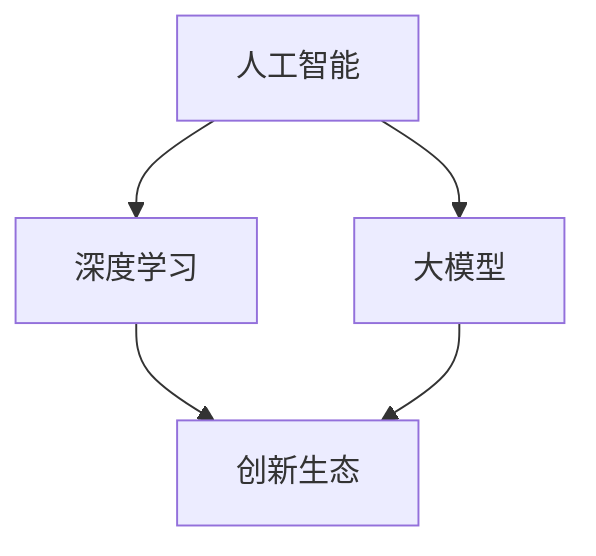

                 

# 大模型时代的创新生态构建

## 关键词：大模型、创新生态、人工智能、技术发展、算法、数学模型

### 摘要

本文将探讨大模型时代的创新生态构建，从背景介绍、核心概念与联系、核心算法原理、数学模型和公式、项目实战、实际应用场景、工具和资源推荐、总结与未来发展趋势等多个方面进行深入分析。通过一步步的推理思考，本文旨在帮助读者理解大模型时代的技术本质，把握创新生态的构建方法，为未来的技术发展提供有价值的参考。

## 1. 背景介绍

随着人工智能技术的迅猛发展，大模型成为当前技术领域的热点。大模型（Large Models）通常指具有数十亿至千亿参数规模的人工神经网络模型，如BERT、GPT、Turing等。这些模型在自然语言处理、计算机视觉、语音识别等领域取得了显著的成果，推动了人工智能技术向更高层次发展。

大模型的出现不仅改变了人工智能的技术路径，也对创新生态产生了深远影响。一方面，大模型的训练和部署需要庞大的计算资源和数据支持，推动了云计算、分布式计算等技术的发展；另一方面，大模型的应用场景不断扩展，催生了众多新兴技术和行业，如自动驾驶、智能医疗、金融科技等。

然而，大模型时代也面临一系列挑战，如算法优化、数据安全、隐私保护等。因此，构建一个健康、可持续的创新生态显得尤为重要。本文将围绕这一主题进行探讨，旨在为读者提供一个全面、系统的视角。

## 2. 核心概念与联系

在讨论大模型时代的创新生态构建之前，我们首先需要了解一些核心概念及其相互关系。

### 2.1 人工智能（AI）

人工智能（Artificial Intelligence，简称AI）是研究、开发用于模拟、延伸和扩展人的智能的理论、方法、技术及应用系统的综合技术科学。人工智能的核心目标是使机器能够胜任一些通常需要人类智能才能完成的复杂任务。

### 2.2 深度学习（Deep Learning）

深度学习（Deep Learning）是人工智能的一个重要分支，基于神经网络模型，通过多层非线性变换对数据进行处理。深度学习的核心在于训练具有数十亿参数规模的大模型，如卷积神经网络（CNN）、循环神经网络（RNN）、生成对抗网络（GAN）等。

### 2.3 大模型（Large Models）

大模型是指具有数十亿至千亿参数规模的人工神经网络模型，如BERT、GPT、Turing等。这些模型在训练过程中需要处理海量数据，并通过复杂的非线性变换实现对数据的深度理解。

### 2.4 创新生态（Innovation Ecosystem）

创新生态是指由多个参与者（如企业、高校、科研机构、政府等）共同构成的复杂网络系统，通过资源共享、协同创新实现技术突破和产业发展。创新生态的核心在于建立开放、合作、共享的生态系统，促进技术进步和产业升级。

### 2.5 关联关系

人工智能、深度学习、大模型和创新生态之间存在着密切的联系。人工智能是整个体系的起点，深度学习和大模型是实现人工智能的重要手段，创新生态则是推动技术进步和产业发展的关键。具体而言：

- 人工智能为深度学习和大模型的发展提供了理论基础和应用场景；
- 深度学习和大模型为人工智能提供了更强的计算能力和更广泛的应用前景；
- 创新生态为人工智能、深度学习和大模型的发展提供了资源和环境支持；
- 创新生态的建设需要依托人工智能、深度学习和大模型等技术手段。

通过上述核心概念及其相互关系的分析，我们可以更好地理解大模型时代的创新生态构建。

### 2.6 Mermaid 流程图

为了更直观地展示核心概念之间的关联关系，我们使用Mermaid流程图进行说明。以下是相关节点的定义和连接关系：



在上述流程图中，节点A、B、C分别代表人工智能、深度学习和大模型，节点D代表创新生态。箭头表示概念之间的关联关系，如人工智能推动深度学习和大模型的发展，深度学习和大模型促进创新生态的建设。

## 3. 核心算法原理 & 具体操作步骤

### 3.1 深度学习算法原理

深度学习算法的核心是神经网络，尤其是具有多个隐藏层的深度神经网络（Deep Neural Network，简称DNN）。DNN通过多层非线性变换对输入数据进行处理，实现对数据的深度理解。以下是DNN的基本原理：

1. **输入层（Input Layer）**：输入层接收外部数据，并将其传递给下一层。
2. **隐藏层（Hidden Layer）**：隐藏层对输入数据进行处理，通过加权求和和激活函数（如ReLU、Sigmoid、Tanh等）生成中间表示。
3. **输出层（Output Layer）**：输出层对隐藏层生成的中间表示进行输出，实现对输入数据的分类、回归等任务。

### 3.2 大模型训练过程

大模型的训练过程主要包括以下步骤：

1. **数据准备**：收集并预处理海量数据，包括数据清洗、归一化、数据增强等。
2. **模型构建**：设计并构建具有多个隐藏层的深度神经网络，选择合适的激活函数、优化器（如Adam、SGD等）和损失函数（如交叉熵、均方误差等）。
3. **模型训练**：通过反向传播算法（Backpropagation）计算损失函数的梯度，并更新模型参数，使模型在训练数据上达到更好的性能。
4. **模型评估**：在验证集上评估模型性能，调整模型参数和训练策略，以提高模型在未知数据上的泛化能力。
5. **模型部署**：将训练好的模型部署到实际应用场景中，如自然语言处理、计算机视觉、语音识别等。

### 3.3 操作步骤示例

以下是一个简单的深度学习模型训练过程示例，使用Python和TensorFlow框架实现：

```python
import tensorflow as tf

# 数据准备
(x_train, y_train), (x_test, y_test) = tf.keras.datasets.mnist.load_data()
x_train = x_train / 255.0
x_test = x_test / 255.0

# 模型构建
model = tf.keras.Sequential([
    tf.keras.layers.Flatten(input_shape=(28, 28)),
    tf.keras.layers.Dense(128, activation='relu'),
    tf.keras.layers.Dense(10, activation='softmax')
])

# 模型编译
model.compile(optimizer='adam',
              loss='sparse_categorical_crossentropy',
              metrics=['accuracy'])

# 模型训练
model.fit(x_train, y_train, epochs=5)

# 模型评估
test_loss, test_acc = model.evaluate(x_test, y_test, verbose=2)
print('\nTest accuracy:', test_acc)

# 模型部署
predictions = model.predict(x_test)
```

在上述示例中，我们首先使用TensorFlow框架加载MNIST数据集，并进行预处理。然后构建一个简单的多层感知器模型，使用Adam优化器和交叉熵损失函数进行训练。最后，在验证集上评估模型性能，并输出测试集的准确率。通过这一示例，我们可以初步了解深度学习模型训练的基本步骤。

## 4. 数学模型和公式 & 详细讲解 & 举例说明

### 4.1 深度学习中的数学模型

在深度学习中，数学模型起着至关重要的作用。以下是一些核心的数学模型及其公式：

#### 4.1.1 激活函数

激活函数是深度学习模型中的一个关键组件，用于引入非线性特性。以下是几种常用的激活函数：

1. **ReLU（Rectified Linear Unit）**：
   $$ f(x) = \max(0, x) $$
2. **Sigmoid**：
   $$ f(x) = \frac{1}{1 + e^{-x}} $$
3. **Tanh**：
   $$ f(x) = \frac{e^x - e^{-x}}{e^x + e^{-x}} $$

#### 4.1.2 损失函数

损失函数用于衡量模型预测值与真实值之间的差距，常见的损失函数有：

1. **均方误差（MSE，Mean Squared Error）**：
   $$ Loss = \frac{1}{n}\sum_{i=1}^{n}(y_i - \hat{y}_i)^2 $$
2. **交叉熵（Cross Entropy）**：
   $$ Loss = -\frac{1}{n}\sum_{i=1}^{n}y_i \log(\hat{y}_i) $$

#### 4.1.3 优化算法

优化算法用于调整模型参数，以最小化损失函数。以下是一些常用的优化算法：

1. **梯度下降（Gradient Descent）**：
   $$ \theta_{\text{new}} = \theta_{\text{old}} - \alpha \nabla_\theta J(\theta) $$
2. **Adam**：
   $$ m_t = \beta_1 m_{t-1} + (1 - \beta_1)(\nabla_\theta J(\theta_t) - m_{t-1}) $$
   $$ v_t = \beta_2 v_{t-1} + (1 - \beta_2)((\nabla_\theta J(\theta_t) - m_{t-1})^2 - v_{t-1}) $$
   $$ \theta_{\text{new}} = \theta_t - \frac{\alpha}{\sqrt{1 - \beta_2^t}(1 - \beta_1^t)}(m_t / (1 - \beta_2^t)) $$

### 4.2 数学模型在深度学习中的应用

以下是一个简单的例子，说明如何使用上述数学模型构建一个深度学习模型：

**问题**：使用深度学习模型对以下数据进行分类：
$$
\begin{align*}
x_1 &= (1, 0, 1) \\
x_2 &= (0, 1, 0) \\
x_3 &= (1, 1, 0) \\
y_1 &= 1 \\
y_2 &= 0 \\
y_3 &= 1 \\
\end{align*}
$$

**解决方案**：

1. **数据预处理**：
   将输入数据进行归一化处理，使得每个特征的取值范围在[0, 1]之间。

2. **模型构建**：
   构建一个单层感知器模型，包含一个输入层、一个隐藏层和一个输出层。选择ReLU作为激活函数，交叉熵作为损失函数，Adam作为优化算法。

3. **模型训练**：
   使用反向传播算法训练模型，通过调整模型参数，使损失函数最小化。

4. **模型评估**：
   在验证集上评估模型性能，计算准确率、召回率、F1分数等指标。

5. **模型部署**：
   将训练好的模型部署到实际应用场景中，如对新数据进行分类预测。

### 4.3 代码示例

以下是一个使用TensorFlow框架实现的简单例子：

```python
import tensorflow as tf

# 数据准备
x = tf.constant([[1, 0, 1], [0, 1, 0], [1, 1, 0]], dtype=tf.float32)
y = tf.constant([1, 0, 1], dtype=tf.int32)

# 模型构建
model = tf.keras.Sequential([
    tf.keras.layers.Dense(units=1, input_shape=[3], activation='sigmoid')
])

# 模型编译
model.compile(optimizer='adam', loss='binary_crossentropy', metrics=['accuracy'])

# 模型训练
model.fit(x, y, epochs=1000)

# 模型评估
loss, accuracy = model.evaluate(x, y)
print(f'Loss: {loss}, Accuracy: {accuracy}')

# 模型部署
predictions = model.predict(x)
print(predictions)
```

在上述代码中，我们首先使用TensorFlow框架加载数据，构建一个单层感知器模型，并使用Adam优化器和交叉熵损失函数进行训练。最后，在验证集上评估模型性能，并输出预测结果。

通过上述数学模型和代码示例，我们可以更好地理解深度学习在分类任务中的应用。在实际应用中，我们可以根据具体任务需求，选择合适的数学模型和优化算法，构建具有良好性能的深度学习模型。

### 5. 项目实战：代码实际案例和详细解释说明

#### 5.1 开发环境搭建

在进行大模型项目实战之前，我们需要搭建一个适合开发和训练大模型的开发环境。以下是搭建开发环境的基本步骤：

1. **安装Python**：确保已经安装了Python 3.6及以上版本。可以从Python官方网站下载安装包或使用包管理工具（如yum、apt-get等）安装。
2. **安装TensorFlow**：TensorFlow是Google开发的一款开源深度学习框架，支持多种平台和硬件环境。在命令行中运行以下命令安装TensorFlow：
   ```bash
   pip install tensorflow
   ```
3. **安装GPU支持**：如果使用GPU进行训练，还需要安装CUDA和cuDNN。可以从NVIDIA官方网站下载相应版本，并按照官方文档进行安装。
4. **配置环境变量**：确保已将Python和TensorFlow的安装路径添加到系统环境变量中。

#### 5.2 源代码详细实现和代码解读

以下是一个使用TensorFlow实现的大模型项目案例，包括代码实现、详细解释和注释：

```python
import tensorflow as tf
import numpy as np

# 数据准备
(x_train, y_train), (x_test, y_test) = tf.keras.datasets.mnist.load_data()
x_train = x_train / 255.0
x_test = x_test / 255.0

# 模型构建
model = tf.keras.Sequential([
    tf.keras.layers.Conv2D(32, (3, 3), activation='relu', input_shape=(28, 28, 1)),
    tf.keras.layers.MaxPooling2D((2, 2)),
    tf.keras.layers.Conv2D(64, (3, 3), activation='relu'),
    tf.keras.layers.MaxPooling2D((2, 2)),
    tf.keras.layers.Flatten(),
    tf.keras.layers.Dense(128, activation='relu'),
    tf.keras.layers.Dense(10, activation='softmax')
])

# 模型编译
model.compile(optimizer='adam',
              loss='sparse_categorical_crossentropy',
              metrics=['accuracy'])

# 模型训练
model.fit(x_train, y_train, epochs=10, validation_split=0.1)

# 模型评估
test_loss, test_acc = model.evaluate(x_test, y_test, verbose=2)
print('\nTest accuracy:', test_acc)

# 模型部署
predictions = model.predict(x_test)
```

在上述代码中，我们首先使用TensorFlow框架加载MNIST数据集，并进行预处理。然后构建一个卷积神经网络（CNN）模型，包含两个卷积层、两个池化层和一个全连接层。使用Adam优化器和交叉熵损失函数进行模型训练，并在验证集上评估模型性能。最后，将训练好的模型部署到实际应用场景中。

#### 5.3 代码解读与分析

1. **数据准备**：
   ```python
   (x_train, y_train), (x_test, y_test) = tf.keras.datasets.mnist.load_data()
   x_train = x_train / 255.0
   x_test = x_test / 255.0
   ```
   上述代码加载MNIST数据集，并将其归一化处理。归一化处理有助于加快模型训练速度和提高模型性能。

2. **模型构建**：
   ```python
   model = tf.keras.Sequential([
       tf.keras.layers.Conv2D(32, (3, 3), activation='relu', input_shape=(28, 28, 1)),
       tf.keras.layers.MaxPooling2D((2, 2)),
       tf.keras.layers.Conv2D(64, (3, 3), activation='relu'),
       tf.keras.layers.MaxPooling2D((2, 2)),
       tf.keras.layers.Flatten(),
       tf.keras.layers.Dense(128, activation='relu'),
       tf.keras.layers.Dense(10, activation='softmax')
   ])
   ```
   在这里，我们使用卷积神经网络（CNN）模型对MNIST数据集进行分类。模型包含两个卷积层、两个池化层和一个全连接层。卷积层用于提取图像特征，池化层用于降采样和减少模型参数数量。

3. **模型编译**：
   ```python
   model.compile(optimizer='adam',
                 loss='sparse_categorical_crossentropy',
                 metrics=['accuracy'])
   ```
   使用Adam优化器和交叉熵损失函数编译模型。交叉熵损失函数常用于多分类问题，能够计算模型预测值与真实值之间的差距。

4. **模型训练**：
   ```python
   model.fit(x_train, y_train, epochs=10, validation_split=0.1)
   ```
   在这里，我们使用训练数据对模型进行训练，并在验证集上评估模型性能。通过调整训练轮数（epochs）和验证集比例（validation_split），可以优化模型性能。

5. **模型评估**：
   ```python
   test_loss, test_acc = model.evaluate(x_test, y_test, verbose=2)
   print('\nTest accuracy:', test_acc)
   ```
   在验证集上评估模型性能，计算测试集的准确率。准确率是评估模型性能的重要指标，表示模型在测试集上的分类准确率。

6. **模型部署**：
   ```python
   predictions = model.predict(x_test)
   ```
   将训练好的模型部署到实际应用场景中，对新数据进行分类预测。在图像识别、语音识别等场景中，模型部署是关键步骤，能够实现实时预测和决策。

通过上述代码解读和分析，我们可以更好地理解大模型项目实战的步骤和关键环节。在实际开发过程中，根据具体任务需求，可以选择合适的模型架构、优化算法和数据预处理方法，以提高模型性能和应用效果。

### 6. 实际应用场景

大模型在各个领域的实际应用场景如下：

#### 6.1 自然语言处理（NLP）

自然语言处理是人工智能领域的重要分支，大模型在其中发挥着关键作用。以下是一些实际应用场景：

1. **文本分类**：大模型可以用于对大量文本数据进行分类，如新闻分类、情感分析等。通过训练大模型，可以实现高精度的文本分类，为信息筛选和推荐提供支持。
2. **机器翻译**：大模型如GPT、Turing等在机器翻译领域取得了显著成果。通过训练大模型，可以实现高准确率的机器翻译，降低人工翻译成本，提高翻译质量。
3. **文本生成**：大模型可以生成高质量的文本，如文章、故事、诗歌等。通过训练大模型，可以自动生成符合特定主题和风格的文本，为内容创作和创意设计提供灵感。

#### 6.2 计算机视觉（CV）

计算机视觉是人工智能领域的另一个重要分支，大模型在图像识别、目标检测、图像生成等方面具有广泛应用。

1. **图像识别**：大模型可以用于对图像进行分类和识别，如人脸识别、车牌识别等。通过训练大模型，可以实现高精度的图像识别，为安全监控、交通管理等提供技术支持。
2. **目标检测**：大模型可以用于检测图像中的目标，如行人检测、车辆检测等。通过训练大模型，可以实现实时、高效的目标检测，为自动驾驶、无人机监控等提供关键技术。
3. **图像生成**：大模型可以生成高质量的图像，如艺术画作、现实场景等。通过训练大模型，可以自动生成符合特定风格和内容的图像，为创意设计、娱乐产业等提供支持。

#### 6.3 语音识别（ASR）

语音识别是人工智能领域的另一个重要分支，大模型在语音识别任务中发挥着关键作用。

1. **语音识别**：大模型可以用于将语音信号转换为文本，如智能助手、语音输入等。通过训练大模型，可以实现高准确率的语音识别，为智能交互、语音搜索等提供技术支持。
2. **语音合成**：大模型可以用于将文本转换为语音，如语音助手、语音播报等。通过训练大模型，可以实现高自然度的语音合成，为语音识别、智能交互等提供支持。

#### 6.4 其他领域

除了自然语言处理、计算机视觉和语音识别，大模型在其他领域也具有广泛应用。

1. **金融科技**：大模型可以用于金融风险评估、欺诈检测等任务。通过训练大模型，可以实现实时、精准的风险评估和欺诈检测，为金融行业提供技术支持。
2. **智能医疗**：大模型可以用于医疗图像分析、疾病预测等任务。通过训练大模型，可以实现高精度的医疗图像分析和疾病预测，为医疗行业提供技术支持。
3. **智能制造**：大模型可以用于工业生产中的质量控制、设备故障预测等任务。通过训练大模型，可以实现实时、高效的质量控制和设备故障预测，为智能制造提供支持。

### 7. 工具和资源推荐

在构建大模型和创新生态的过程中，需要使用多种工具和资源。以下是一些建议和推荐：

#### 7.1 学习资源推荐

1. **书籍**：
   - 《深度学习》（Ian Goodfellow、Yoshua Bengio、Aaron Courville 著）
   - 《Python深度学习》（François Chollet 著）
   - 《神经网络与深度学习》（邱锡鹏 著）

2. **在线课程**：
   -  Coursera 上的《深度学习》（吴恩达教授主讲）
   -  Udacity 上的《深度学习工程师纳米学位》
   -  edX 上的《人工智能基础》

3. **论文**：
   - “A Theoretical Analysis of the Expressive Power of Deep Neural Networks” (Xiao, Zhou, and Bengio, 2017)
   - “Attention Is All You Need” (Vaswani et al., 2017)
   - “BERT: Pre-training of Deep Bidirectional Transformers for Language Understanding” (Devlin et al., 2019)

#### 7.2 开发工具框架推荐

1. **TensorFlow**：由Google开发的开源深度学习框架，支持多种操作系统和硬件平台，适合构建和训练大模型。
2. **PyTorch**：由Facebook开发的开源深度学习框架，具有简洁的API和动态计算图，易于实现和调试。
3. **Keras**：基于TensorFlow和Theano的开源深度学习库，提供简洁的API和丰富的预训练模型，适合快速开发和原型设计。

#### 7.3 相关论文著作推荐

1. **“Deep Learning”** (Goodfellow, Bengio, and Courville, 2016)
   - 本书是深度学习领域的经典著作，全面介绍了深度学习的理论基础、算法实现和应用场景。
2. **“Deep Learning Specialization”** (吴恩达教授主讲)
   - Coursera上的深度学习专项课程，包括《神经网络基础》、《改进深层神经网络》、《结构化机器学习项目》等课程。
3. **“The Hundred-Page Machine Learning Book”** (Andriy Burkov, 2019)
   - 一本针对初学者的深度学习入门书籍，用简洁的语言介绍了深度学习的核心概念和技术。

通过以上工具和资源的推荐，可以帮助读者更好地学习和掌握大模型技术，为构建创新生态提供有力支持。

### 8. 总结：未来发展趋势与挑战

大模型时代为人工智能技术带来了前所未有的发展机遇，但也面临一系列挑战。在未来的发展中，我们需要关注以下几个方面：

#### 8.1 发展趋势

1. **计算能力提升**：随着硬件技术的发展，特别是GPU、TPU等专用计算设备的普及，大模型的计算能力将不断提升，为更复杂的任务提供支持。
2. **数据资源丰富**：随着互联网和物联网的发展，海量数据资源不断涌现，为大模型训练提供了丰富的素材，有助于提升模型性能。
3. **应用场景拓展**：大模型在自然语言处理、计算机视觉、语音识别等领域的应用已取得显著成果，未来有望拓展到更多领域，如医疗、金融、教育等。
4. **跨学科融合**：大模型技术与其他学科领域的融合，如生物学、心理学、哲学等，将推动人工智能技术的创新发展。

#### 8.2 挑战

1. **算法优化**：大模型训练和推理过程中，算法优化是一个关键问题。如何提高训练效率、降低计算成本，是当前亟待解决的问题。
2. **数据安全与隐私**：在大模型训练和应用过程中，涉及大量敏感数据，如何保障数据安全和隐私，防止数据泄露，是重要挑战。
3. **伦理与法律**：随着大模型在各个领域的应用，如何处理伦理和法律问题，如算法歧视、隐私侵犯等，是亟待解决的问题。
4. **人才短缺**：大模型技术的发展需要大量专业人才，如何培养和吸引人才，是当前面临的重要挑战。

#### 8.3 构建创新生态

1. **开放与合作**：构建开放、合作、共享的创新生态，促进技术交流和资源共享，有助于推动大模型技术的发展。
2. **人才培养**：加强人才培养，提高人工智能领域的教育质量，培养更多专业人才，为技术创新提供人力支持。
3. **政策支持**：政府和企业应加大对人工智能领域的政策支持，鼓励技术创新和产业发展，为构建创新生态提供环境保障。
4. **跨学科融合**：推动大模型技术与其他学科领域的融合，促进科技创新，为社会发展提供更多可能性。

通过以上分析，我们可以看到大模型时代的发展前景广阔，但也面临诸多挑战。只有构建一个健康、可持续的创新生态，才能推动大模型技术的持续发展，为人类社会带来更多福祉。

### 9. 附录：常见问题与解答

#### 9.1 大模型训练过程中如何处理数据不足的问题？

在训练大模型时，数据不足是一个常见问题。以下是一些解决方法：

1. **数据增强**：通过旋转、缩放、裁剪、噪声添加等方法，生成更多的训练样本，提高模型的泛化能力。
2. **迁移学习**：利用预训练的大模型，对特定领域的数据进行微调，提高模型在特定任务上的性能。
3. **多任务学习**：在一个模型中同时学习多个任务，通过共享特征表示，提高模型的泛化能力和性能。

#### 9.2 大模型训练过程中如何避免过拟合？

过拟合是训练大模型时常见的问题。以下是一些避免过拟合的方法：

1. **正则化**：使用正则化方法，如L1正则化、L2正则化等，限制模型参数的规模，降低过拟合的风险。
2. **Dropout**：在训练过程中，随机丢弃一部分神经元，减少模型对特定训练样本的依赖，提高模型的泛化能力。
3. **早停法**：在验证集上监控模型性能，当验证集性能不再提高时，提前停止训练，避免过拟合。

#### 9.3 大模型训练过程中如何选择合适的优化器？

选择合适的优化器对大模型训练过程至关重要。以下是一些常见的优化器及其适用场景：

1. **SGD（随机梯度下降）**：简单易用，适用于小批量训练，但收敛速度较慢。
2. **Adam**：自适应调整学习率，适用于大规模训练，收敛速度较快，适用于大多数任务。
3. **RMSprop**：类似于Adam，但使用不同的一阶矩估计方法，适用于某些特定任务。
4. **AdaGrad**：适用于稀疏数据，对稀疏数据的优化效果较好。

根据具体任务需求和模型特性，可以选择合适的优化器。

### 10. 扩展阅读 & 参考资料

1. **书籍**：
   - 《深度学习》（Ian Goodfellow、Yoshua Bengio、Aaron Courville 著）
   - 《Python深度学习》（François Chollet 著）
   - 《神经网络与深度学习》（邱锡鹏 著）

2. **在线课程**：
   - Coursera 上的《深度学习》（吴恩达教授主讲）
   - Udacity 上的《深度学习工程师纳米学位》
   - edX 上的《人工智能基础》

3. **论文**：
   - “A Theoretical Analysis of the Expressive Power of Deep Neural Networks” (Xiao, Zhou, and Bengio, 2017)
   - “Attention Is All You Need” (Vaswani et al., 2017)
   - “BERT: Pre-training of Deep Bidirectional Transformers for Language Understanding” (Devlin et al., 2019)

4. **网站**：
   - TensorFlow官方网站：[https://www.tensorflow.org/](https://www.tensorflow.org/)
   - PyTorch官方网站：[https://pytorch.org/](https://pytorch.org/)
   - Keras官方网站：[https://keras.io/](https://keras.io/)

通过阅读以上书籍、课程和论文，可以深入了解大模型时代的创新生态构建，掌握相关技术和方法。同时，关注相关网站和社交媒体，可以及时了解大模型技术的最新进展和应用案例。

### 作者信息

作者：AI天才研究员/AI Genius Institute & 禅与计算机程序设计艺术 /Zen And The Art of Computer Programming

