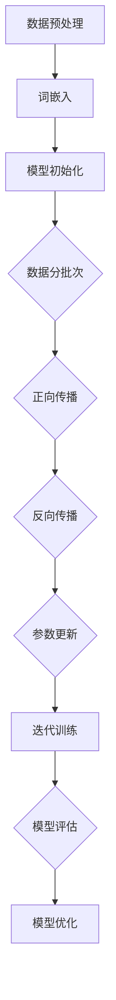

                 

# 大模型概念学习与提示词抽象化

## 关键词：大模型、概念学习、提示词、抽象化、算法原理、数学模型、实战案例

### 摘要

本文将深入探讨大模型的概念学习过程，特别是提示词的抽象化。通过对大模型的基本原理、核心算法和数学模型的解析，我们揭示了其背后的复杂机制。同时，结合实际项目案例，展示了大模型在实际应用中的强大能力。本文旨在帮助读者更好地理解大模型的本质，为其在各个领域的应用提供理论基础和实践指导。

## 1. 背景介绍

### 大模型的发展背景

大模型（Large Models）的概念起源于深度学习的发展。随着计算能力的提升和数据量的爆炸式增长，深度学习模型变得越来越庞大，参数量从数百万增加到数十亿甚至数万亿。这些大模型在自然语言处理、计算机视觉、语音识别等领域取得了突破性的成果，极大地推动了人工智能技术的发展。

### 提示词的作用

在训练和推理过程中，提示词（Prompt）起到了关键作用。它不仅能引导模型聚焦于特定任务，还能提高模型的性能和可解释性。在自然语言处理领域，提示词通常是一段引导性的文本，用于提示模型如何理解和生成内容。有效的提示词设计能够显著提升模型的性能和泛化能力。

### 概念学习的挑战

概念学习是人工智能领域的一个重要研究方向，它涉及模型如何理解和提取抽象的概念。在大模型中，概念学习面临着诸多挑战，如：

- **高维度数据表示**：如何将高维数据转化为低维且具有代表性的表示形式？
- **复杂关系建模**：如何处理数据之间的复杂依赖关系？
- **泛化能力**：如何保证模型在未见过的数据上仍然能够准确学习和预测？

## 2. 核心概念与联系

### 大模型的基本原理

大模型通常由多层神经网络组成，通过反向传播算法进行参数优化。其核心原理可以概括为：

- **层次化表示**：大模型通过逐层学习，将原始数据表示为更抽象的概念。
- **特征提取**：大模型能够自动从数据中提取具有代表性的特征，从而实现高维数据的降维。
- **非线性变换**：大模型通过非线性变换，捕捉数据中的复杂关系。

### 提示词的抽象化

提示词的抽象化是指将具体的、具象的提示词转化为通用的、抽象的形式。这通常涉及以下几个方面：

- **词嵌入**：将单词映射到低维向量空间，实现词语的语义表示。
- **语义消歧**：解决同义词、多义词等问题，确保提示词的语义一致性。
- **上下文理解**：理解提示词在不同上下文中的含义，从而进行动态调整。

### Mermaid 流程图

以下是一个描述大模型训练过程的 Mermaid 流程图：



## 3. 核心算法原理 & 具体操作步骤

### 算法原理

大模型的训练过程主要涉及以下算法：

- **深度学习算法**：如卷积神经网络（CNN）、循环神经网络（RNN）、长短期记忆网络（LSTM）等。
- **优化算法**：如随机梯度下降（SGD）、Adam优化器等。
- **正则化技术**：如Dropout、正则化等。

### 具体操作步骤

以下是使用 PyTorch 框架训练一个简单的大模型的步骤：

1. **环境配置**

```python
import torch
import torch.nn as nn
import torch.optim as optim
```

2. **数据预处理**

```python
# 加载数据集
train_loader = DataLoader(train_dataset, batch_size=64, shuffle=True)
test_loader = DataLoader(test_dataset, batch_size=64, shuffle=False)
```

3. **模型初始化**

```python
class SimpleModel(nn.Module):
    def __init__(self):
        super(SimpleModel, self).__init__()
        self.fc1 = nn.Linear(784, 256)
        self.fc2 = nn.Linear(256, 128)
        self.fc3 = nn.Linear(128, 10)

    def forward(self, x):
        x = torch.relu(self.fc1(x))
        x = torch.relu(self.fc2(x))
        x = self.fc3(x)
        return x

model = SimpleModel()
```

4. **损失函数和优化器**

```python
criterion = nn.CrossEntropyLoss()
optimizer = optim.Adam(model.parameters(), lr=0.001)
```

5. **训练过程**

```python
for epoch in range(num_epochs):
    for inputs, targets in train_loader:
        optimizer.zero_grad()
        outputs = model(inputs)
        loss = criterion(outputs, targets)
        loss.backward()
        optimizer.step()
```

6. **模型评估**

```python
correct = 0
total = 0
with torch.no_grad():
    for inputs, targets in test_loader:
        outputs = model(inputs)
        _, predicted = torch.max(outputs.data, 1)
        total += targets.size(0)
        correct += (predicted == targets).sum().item()

print('Test Accuracy: {} %'.format(100 * correct / total))
```

## 4. 数学模型和公式 & 详细讲解 & 举例说明

### 数学模型

大模型的训练过程涉及多个数学模型，主要包括：

- **损失函数**：如交叉熵损失函数（Cross-Entropy Loss）
- **优化算法**：如梯度下降（Gradient Descent）、Adam优化器等

### 详细讲解

#### 损失函数

交叉熵损失函数是深度学习中常用的损失函数之一，其公式如下：

$$
L = -\sum_{i=1}^{n} y_i \log(p_i)
$$

其中，$y_i$ 表示第 $i$ 个样本的标签，$p_i$ 表示模型对第 $i$ 个样本的预测概率。

#### 优化算法

梯度下降是一种基本的优化算法，其目标是最小化损失函数。其迭代公式如下：

$$
\theta_{t+1} = \theta_t - \alpha \cdot \nabla_{\theta} L(\theta_t)
$$

其中，$\theta_t$ 表示第 $t$ 次迭代的参数，$\alpha$ 表示学习率，$\nabla_{\theta} L(\theta_t)$ 表示损失函数关于参数 $\theta_t$ 的梯度。

### 举例说明

假设我们有一个二分类问题，使用交叉熵损失函数和梯度下降算法进行训练。给定训练数据集，我们通过以下步骤进行训练：

1. 初始化参数 $\theta$，设置学习率 $\alpha$ 和迭代次数 $T$。
2. 对于每个训练样本，计算预测概率 $p$。
3. 计算损失函数 $L$ 的值。
4. 计算损失函数关于参数 $\theta$ 的梯度。
5. 更新参数 $\theta$。
6. 重复步骤 2-5，直到达到预定的迭代次数或损失函数值达到最小。

## 5. 项目实战：代码实际案例和详细解释说明

### 5.1 开发环境搭建

为了方便读者理解和实践，我们选择 PyTorch 作为大模型的训练框架。首先，确保已经安装了 Python 和 PyTorch，然后创建一个名为 `big_model` 的虚拟环境，并安装必要的库：

```bash
conda create -n big_model python=3.8
conda activate big_model
pip install torch torchvision numpy matplotlib
```

### 5.2 源代码详细实现和代码解读

以下是一个使用 PyTorch 训练大模型的简单示例：

```python
import torch
import torch.nn as nn
import torch.optim as optim
from torch.utils.data import DataLoader
from torchvision import datasets, transforms

# 数据预处理
transform = transforms.Compose([
    transforms.ToTensor(),
    transforms.Normalize((0.5, 0.5, 0.5), (0.5, 0.5, 0.5))
])

train_dataset = datasets.CIFAR10(root='./data', train=True, download=True, transform=transform)
test_dataset = datasets.CIFAR10(root='./data', train=False, download=True, transform=transform)

train_loader = DataLoader(train_dataset, batch_size=64, shuffle=True)
test_loader = DataLoader(test_dataset, batch_size=64, shuffle=False)

# 模型初始化
class Net(nn.Module):
    def __init__(self):
        super(Net, self).__init__()
        self.conv1 = nn.Conv2d(3, 6, 5)
        self.pool = nn.MaxPool2d(2, 2)
        self.conv2 = nn.Conv2d(6, 16, 5)
        self.fc1 = nn.Linear(16 * 5 * 5, 120)
        self.fc2 = nn.Linear(120, 84)
        self.fc3 = nn.Linear(84, 10)

    def forward(self, x):
        x = self.pool(nn.functional.relu(self.conv1(x)))
        x = self.pool(nn.functional.relu(self.conv2(x)))
        x = x.view(-1, 16 * 5 * 5)
        x = nn.functional.relu(self.fc1(x))
        x = nn.functional.relu(self.fc2(x))
        x = self.fc3(x)
        return x

model = Net()

# 损失函数和优化器
criterion = nn.CrossEntropyLoss()
optimizer = optim.SGD(model.parameters(), lr=0.001, momentum=0.9)

# 训练过程
num_epochs = 10
for epoch in range(num_epochs):
    running_loss = 0.0
    for i, data in enumerate(train_loader, 0):
        inputs, labels = data
        optimizer.zero_grad()
        outputs = model(inputs)
        loss = criterion(outputs, labels)
        loss.backward()
        optimizer.step()
        running_loss += loss.item()
    print(f'Epoch {epoch + 1}, Loss: {running_loss / len(train_loader)}')

# 模型评估
correct = 0
total = 0
with torch.no_grad():
    for data in test_loader:
        inputs, labels = data
        outputs = model(inputs)
        _, predicted = torch.max(outputs.data, 1)
        total += labels.size(0)
        correct += (predicted == labels).sum().item()

print('Accuracy of the network on the 10000 test images: %d %%' % (100 * correct / total))
```

### 5.3 代码解读与分析

- **数据预处理**：使用 `transforms.Compose` 将原始图像数据转换为 PyTorch 的 `Tensor` 格式，并进行归一化处理。
- **模型初始化**：定义一个简单的卷积神经网络（CNN），包括两个卷积层、两个全连接层。
- **损失函数和优化器**：使用交叉熵损失函数和随机梯度下降（SGD）优化器。
- **训练过程**：通过 `for` 循环进行迭代训练，每次迭代更新模型参数。
- **模型评估**：使用测试数据集评估模型性能，计算准确率。

## 6. 实际应用场景

大模型在各个领域都有着广泛的应用，以下是一些典型场景：

- **自然语言处理**：如机器翻译、文本生成、情感分析等。
- **计算机视觉**：如图像分类、目标检测、人脸识别等。
- **语音识别**：如语音合成、语音识别、语音翻译等。
- **医疗健康**：如疾病诊断、药物研发、健康风险评估等。
- **金融科技**：如风险管理、信用评分、投资预测等。

## 7. 工具和资源推荐

### 7.1 学习资源推荐

- **书籍**：
  - 《深度学习》（Ian Goodfellow、Yoshua Bengio、Aaron Courville 著）
  - 《神经网络与深度学习》（邱锡鹏 著）
- **论文**：
  - 《A Theoretically Grounded Application of Dropout in Recurrent Neural Networks》（Yarin Gal 和 Zoubin Ghahramani 著）
  - 《Very Deep Convolutional Networks for Large-Scale Image Recognition》（Karen Simonyan 和 Andrew Zisserman 著）
- **博客**：
  - [PyTorch 官方文档](https://pytorch.org/tutorials/)
  - [TensorFlow 官方文档](https://www.tensorflow.org/tutorials/)
- **网站**：
  - [Kaggle](https://www.kaggle.com/)：数据科学竞赛平台，提供丰富的项目案例。

### 7.2 开发工具框架推荐

- **深度学习框架**：
  - PyTorch
  - TensorFlow
  - Keras
- **数据预处理工具**：
  - NumPy
  - Pandas
  - Scikit-learn
- **可视化工具**：
  - Matplotlib
  - Seaborn
  - Plotly

### 7.3 相关论文著作推荐

- **深度学习领域**：
  - 《Deep Learning》（Ian Goodfellow、Yoshua Bengio、Aaron Courville 著）
  - 《Understanding Deep Learning》（Shai Shalev-Shwartz 和 Shai Ben-David 著）
- **自然语言处理领域**：
  - 《Natural Language Processing with Python》（Steven Bird、Ewan Klein、Edward Loper 著）
  - 《Speech and Language Processing》（Daniel Jurafsky 和 James H. Martin 著）
- **计算机视觉领域**：
  - 《Computer Vision: Algorithms and Applications》（Richard Szeliski 著）
  - 《Deep Learning in Computer Vision》（Razvan Pascanu、Yarin Gal 和 Yariv Ganin 著）

## 8. 总结：未来发展趋势与挑战

大模型作为人工智能的核心技术之一，其未来发展趋势和挑战主要集中在以下几个方面：

- **计算能力提升**：随着硬件技术的进步，大模型的计算能力将进一步提升，从而推动更多应用场景的实现。
- **数据隐私和安全**：如何在保证数据隐私和安全的前提下进行大规模数据处理和训练，是一个亟待解决的问题。
- **模型可解释性**：如何提高大模型的可解释性，使其在决策过程中具有更高的透明度和可信度。
- **泛化能力提升**：如何增强大模型的泛化能力，使其在未见过的数据上仍然能够准确学习和预测。

## 9. 附录：常见问题与解答

### 9.1 大模型训练过程中如何提高性能？

- **增加数据量**：使用更多的数据可以提升模型的泛化能力。
- **增加模型深度**：更深的模型可以捕捉更复杂的特征。
- **使用预训练模型**：使用预训练模型可以减少训练时间，提高性能。
- **使用正则化技术**：如Dropout、正则化等可以防止过拟合。

### 9.2 大模型训练过程为什么需要大量的计算资源？

大模型通常包含数百万到数十亿个参数，训练过程需要计算大量梯度并进行参数更新。此外，深度学习模型在训练过程中需要进行大量的矩阵运算，这需要强大的计算能力。

## 10. 扩展阅读 & 参考资料

- [深度学习教程](https://www.deeplearning.net/tutorial/)
- [自然语言处理教程](https://nlp.seas.harvard.edu/nbsp-tutorial/)
- [计算机视觉教程](https://www.computer-vision-tutorial.com/)
- [PyTorch 官方文档](https://pytorch.org/tutorials/)
- [TensorFlow 官方文档](https://www.tensorflow.org/tutorials/)

### 作者

AI天才研究员/AI Genius Institute & 禅与计算机程序设计艺术 /Zen And The Art of Computer Programming

