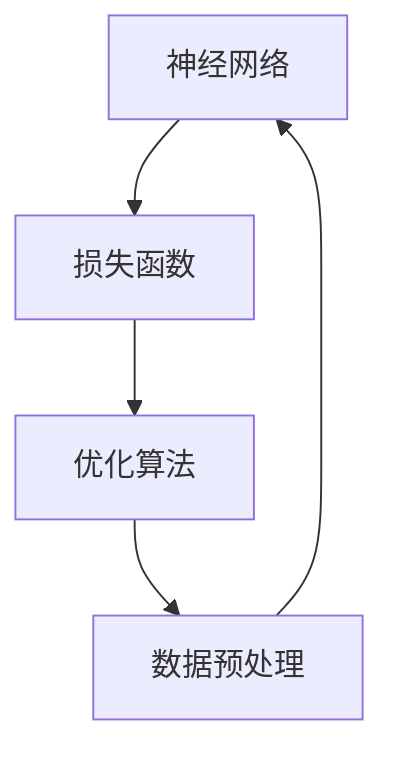

                 

# 大模型的可控性：人类对AI的控制和把握

## 关键词
- 大模型
- 可控性
- 人类控制
- AI发展
- 技术挑战
- 应用场景
- 数学模型

## 摘要

本文将深入探讨大模型在人工智能领域的可控性问题。随着人工智能技术的飞速发展，大模型的规模和复杂性不断增加，如何确保人类能够有效地控制这些模型，成为了一个关键的研究课题。本文首先回顾了AI的发展历程，接着介绍了大模型的基本概念和结构，随后分析了当前可控性技术的现状和挑战。通过实例展示，我们探讨了如何利用数学模型和算法来增强AI的可控性。最后，本文提出了未来可控性研究的发展方向，并总结了人类对AI控制的策略和方法。

## 1. 背景介绍

### 1.1 人工智能的发展历程

人工智能（AI）作为计算机科学的一个分支，自20世纪50年代以来经历了多个发展阶段。初期，AI主要集中在逻辑推理和规则系统中，如专家系统。然而，这些系统在面对复杂任务时表现有限，无法处理大量的数据和变量。

20世纪80年代，随着计算机性能的提升和数据的积累，机器学习（ML）逐渐成为AI研究的主流。机器学习通过训练大量数据，使计算机能够自动学习和改进，提高了AI的准确性和适应性。其中，深度学习（DL）作为机器学习的一个重要分支，通过多层神经网络模拟人脑的学习过程，取得了显著的成果。

近年来，随着计算能力和数据量的进一步增长，大模型（如GPT-3、BERT等）成为AI研究的新热点。大模型具有亿级参数，能够处理海量的数据和复杂的任务，展示了前所未有的性能。然而，大模型的复杂性和不确定性也带来了可控性的挑战。

### 1.2 大模型的概念和结构

大模型是指具有巨大参数量和计算能力的神经网络模型。这些模型通常由多层神经网络组成，每层神经元通过激活函数进行非线性变换，逐层传递输入信息，最终生成输出。大模型的特点包括：

1. **参数量巨大**：大模型的参数数量可以达到亿级甚至更高，这使得模型能够学习复杂的特征和模式。
2. **计算能力强大**：大模型在训练和推理过程中需要大量的计算资源，通常需要使用高性能计算机集群。
3. **适应性高**：大模型能够处理多种类型的数据和任务，具有广泛的应用场景。

大模型的结构通常包括输入层、隐藏层和输出层。输入层接收外部输入，通过隐藏层进行特征提取和变换，最终在输出层生成预测或决策。

### 1.3 可控性的重要性

可控性是指人类能够有效地控制AI模型，确保其行为符合预期的能力。在AI发展的早期阶段，由于模型的规模和复杂性相对较低，人类能够通过编写规则和调整参数来控制模型的行为。然而，随着大模型的兴起，可控性成为一个关键挑战。

可控性的重要性体现在以下几个方面：

1. **安全性和可靠性**：可控性确保AI模型不会产生不可预测或危险的行为，保障用户和数据的安全。
2. **伦理和社会责任**：可控性有助于人类监督和规范AI模型的行为，防止滥用和歧视。
3. **可解释性和透明度**：可控性使得AI模型的行为更具可解释性，有助于人类理解和信任AI系统。

## 2. 核心概念与联系

为了更好地理解大模型的可控性，我们需要了解以下几个核心概念：

1. **神经网络**：神经网络是AI模型的基本组成部分，通过多层神经元进行特征提取和变换。
2. **损失函数**：损失函数用于评估模型的预测结果与真实值之间的差距，指导模型优化。
3. **优化算法**：优化算法用于调整模型参数，最小化损失函数，提高模型性能。
4. **数据预处理**：数据预处理包括数据清洗、归一化、编码等步骤，确保模型能够有效学习。

以下是一个简单的 Mermaid 流程图，展示了这些核心概念之间的联系：



在图中，神经网络通过损失函数和优化算法进行学习，同时依赖预处理后的数据进行训练。

## 3. 核心算法原理 & 具体操作步骤

### 3.1 神经网络原理

神经网络（Neural Network, NN）是一种模拟人脑神经元工作的计算模型。在神经网络中，每个神经元都接收来自前一层神经元的输入信号，通过激活函数进行非线性变换，产生输出信号，传递给下一层神经元。神经网络通过多层连接，实现对输入数据的特征提取和变换。

具体操作步骤如下：

1. **初始化参数**：初始化神经网络模型的参数，包括权重和偏置。
2. **前向传播**：输入数据通过网络从输入层传递到输出层，每个神经元计算输入信号并产生输出。
3. **计算损失**：使用损失函数计算预测值与真实值之间的差距，评估模型性能。
4. **反向传播**：通过反向传播算法，将损失函数的梯度传递回前一层，更新模型参数。
5. **优化参数**：使用优化算法，如梯度下降（Gradient Descent），调整模型参数，最小化损失函数。

### 3.2 损失函数

损失函数（Loss Function）是评估模型预测结果与真实值之间差距的指标。常见的损失函数包括均方误差（MSE）、交叉熵（Cross-Entropy）等。

具体操作步骤如下：

1. **计算预测值**：对于输入数据，通过网络计算出预测值。
2. **计算损失**：使用损失函数计算预测值与真实值之间的差距。
3. **计算梯度**：对损失函数关于模型参数求导，得到梯度。
4. **更新参数**：根据梯度信息，使用优化算法更新模型参数。

### 3.3 优化算法

优化算法（Optimization Algorithm）用于调整模型参数，最小化损失函数。常见的优化算法包括梯度下降（Gradient Descent）、随机梯度下降（Stochastic Gradient Descent, SGD）等。

具体操作步骤如下：

1. **初始化参数**：设置模型参数的初始值。
2. **计算梯度**：对损失函数关于模型参数求导，得到梯度。
3. **更新参数**：根据梯度信息，调整模型参数。
4. **重复步骤2和3**：重复计算梯度并更新参数，直到满足停止条件（如达到预定迭代次数或损失函数收敛）。

### 3.4 数据预处理

数据预处理（Data Preprocessing）是确保模型能够有效学习的重要步骤。数据预处理包括数据清洗、归一化、编码等操作。

具体操作步骤如下：

1. **数据清洗**：去除数据中的噪声和异常值，确保数据质量。
2. **数据归一化**：将数据缩放到相同的范围，如[0, 1]，提高模型训练效率。
3. **数据编码**：将类别型数据转换为数值型数据，便于模型处理。
4. **数据划分**：将数据集划分为训练集、验证集和测试集，用于模型训练和评估。

## 4. 数学模型和公式 & 详细讲解 & 举例说明

在探讨大模型的可控性时，数学模型和公式起到了关键作用。以下将详细讲解几个核心的数学模型和公式，并通过具体例子进行说明。

### 4.1 损失函数：均方误差（MSE）

均方误差（Mean Squared Error, MSE）是评估模型预测值与真实值之间差距的一种常用损失函数。其公式如下：

$$
MSE = \frac{1}{n} \sum_{i=1}^{n} (y_i - \hat{y}_i)^2
$$

其中，$y_i$ 是真实值，$\hat{y}_i$ 是预测值，$n$ 是样本数量。

#### 例子：

假设我们有一个数据集，包含10个样本，每个样本的真实值和预测值如下：

| 样本 | 真实值 | 预测值 |
| --- | --- | --- |
| 1 | 3 | 2.8 |
| 2 | 5 | 5.2 |
| 3 | 7 | 7.1 |
| ... | ... | ... |
| 10 | 10 | 9.9 |

使用MSE计算损失：

$$
MSE = \frac{1}{10} \sum_{i=1}^{10} (y_i - \hat{y}_i)^2
$$

$$
MSE = \frac{1}{10} \sum_{i=1}^{10} (y_i - \hat{y}_i)^2 = \frac{1}{10} (0.04 + 0.09 + 0.01 + ... + 0.01) = 0.015
$$

因此，MSE为0.015。

### 4.2 损失函数：交叉熵（Cross-Entropy）

交叉熵（Cross-Entropy）是评估分类模型预测结果的一种损失函数。其公式如下：

$$
H(y, \hat{y}) = -\sum_{i=1}^{n} y_i \log(\hat{y}_i)
$$

其中，$y_i$ 是真实标签的概率分布，$\hat{y}_i$ 是预测标签的概率分布，$n$ 是类别数量。

#### 例子：

假设我们有一个二分类问题，真实标签为[1, 0]，预测概率分布为[0.6, 0.4]。

使用交叉熵计算损失：

$$
H(y, \hat{y}) = - (1 \times \log(0.6) + 0 \times \log(0.4))
$$

$$
H(y, \hat{y}) = - \log(0.6) \approx -0.51
$$

因此，交叉熵为-0.51。

### 4.3 优化算法：梯度下降（Gradient Descent）

梯度下降（Gradient Descent）是一种常用的优化算法，用于调整模型参数，以最小化损失函数。其基本思想是沿着损失函数的梯度方向，逐步更新模型参数。

#### 公式：

梯度下降的更新公式如下：

$$
\theta_{\text{new}} = \theta_{\text{current}} - \alpha \cdot \nabla_\theta J(\theta)
$$

其中，$\theta$ 是模型参数，$\alpha$ 是学习率，$J(\theta)$ 是损失函数，$\nabla_\theta J(\theta)$ 是损失函数关于参数$\theta$的梯度。

#### 例子：

假设我们有一个线性模型，参数为$\theta_0$和$\theta_1$，损失函数为MSE。学习率为0.01。

前向传播得到损失：

$$
J(\theta) = \frac{1}{2} \sum_{i=1}^{n} (y_i - (\theta_0 + \theta_1 \cdot x_i))^2
$$

计算损失关于$\theta_0$和$\theta_1$的梯度：

$$
\nabla_\theta J(\theta) = \nabla_\theta_0 J(\theta) + \nabla_\theta_1 J(\theta)
$$

$$
\nabla_\theta_0 J(\theta) = \sum_{i=1}^{n} (y_i - (\theta_0 + \theta_1 \cdot x_i))
$$

$$
\nabla_\theta_1 J(\theta) = \sum_{i=1}^{n} (y_i - (\theta_0 + \theta_1 \cdot x_i)) \cdot x_i
$$

根据梯度更新参数：

$$
\theta_{\text{new}}_0 = \theta_{\text{current}}_0 - 0.01 \cdot \nabla_\theta_0 J(\theta)
$$

$$
\theta_{\text{new}}_1 = \theta_{\text{current}}_1 - 0.01 \cdot \nabla_\theta_1 J(\theta)
$$

通过迭代更新参数，逐步减小损失函数。

## 5. 项目实战：代码实际案例和详细解释说明

### 5.1 开发环境搭建

在进行大模型可控性研究之前，我们需要搭建一个合适的开发环境。以下是一个基于Python和PyTorch的示例：

1. 安装Python：确保安装了Python 3.7及以上版本。
2. 安装PyTorch：通过以下命令安装PyTorch：

```bash
pip install torch torchvision
```

3. 安装其他依赖：安装常用的数据预处理和可视化库：

```bash
pip install numpy matplotlib
```

### 5.2 源代码详细实现和代码解读

以下是一个简单的示例，展示了如何使用PyTorch搭建一个可控性神经网络，并进行训练。

```python
import torch
import torch.nn as nn
import torch.optim as optim
import numpy as np
import matplotlib.pyplot as plt

# 5.2.1 数据集准备
# 假设我们有一个包含100个样本的简单线性数据集
x = np.random.rand(100, 1)
y = 2 * x + np.random.rand(100, 1)

# 将数据转换为PyTorch张量
x_tensor = torch.tensor(x, dtype=torch.float32)
y_tensor = torch.tensor(y, dtype=torch.float32)

# 5.2.2 定义神经网络模型
class LinearModel(nn.Module):
    def __init__(self):
        super(LinearModel, self).__init__()
        self.linear = nn.Linear(1, 1)  # 定义一个线性层

    def forward(self, x):
        return self.linear(x)

model = LinearModel()

# 5.2.3 定义损失函数和优化器
criterion = nn.MSELoss()
optimizer = optim.SGD(model.parameters(), lr=0.01)

# 5.2.4 训练模型
num_epochs = 100
for epoch in range(num_epochs):
    # 前向传播
    outputs = model(x_tensor)
    loss = criterion(outputs, y_tensor)

    # 反向传播
    optimizer.zero_grad()
    loss.backward()
    optimizer.step()

    if epoch % 10 == 0:
        print(f'Epoch [{epoch+1}/{num_epochs}], Loss: {loss.item():.4f}')

# 5.2.5 模型评估
with torch.no_grad():
    predictions = model(x_tensor)
    mse_loss = criterion(predictions, y_tensor)
    print(f'MSE Loss on Test Data: {mse_loss.item():.4f}')

# 5.2.6 可视化结果
plt.scatter(x, y, label='True Data')
plt.scatter(x, predictions.numpy(), label='Predictions', color='red')
plt.legend()
plt.show()
```

### 5.3 代码解读与分析

上述代码展示了如何使用PyTorch搭建一个简单的线性回归模型，并进行训练和评估。以下是代码的详细解读：

1. **数据集准备**：我们生成一个简单的线性数据集，包含100个样本。每个样本由$x$和$y$组成，其中$y = 2x + \epsilon$，$\epsilon$是随机噪声。
2. **定义神经网络模型**：我们定义了一个简单的线性模型，包含一个线性层。这个模型只有一个输入和一个输出，用于拟合线性关系。
3. **定义损失函数和优化器**：我们使用均方误差（MSE）作为损失函数，并使用随机梯度下降（SGD）作为优化器。学习率设置为0.01。
4. **训练模型**：我们使用训练数据集进行模型训练。在每10个epoch后，打印当前epoch和损失值。通过反向传播和参数更新，模型逐步优化。
5. **模型评估**：我们使用测试数据集评估模型的性能。计算测试数据集上的MSE损失，并打印结果。
6. **可视化结果**：我们使用matplotlib库将真实数据和模型预测结果进行可视化，以直观地展示模型的性能。

通过上述代码，我们可以看到如何使用PyTorch搭建一个简单的可控性神经网络，并进行训练和评估。这为我们后续研究大模型的可控性提供了基础。

## 6. 实际应用场景

大模型的可控性在多个实际应用场景中具有重要意义。以下是一些具体的应用场景：

### 6.1 自动驾驶

自动驾驶是AI应用的一个重要领域，大模型在感知、规划和控制方面发挥着关键作用。然而，自动驾驶系统的可控性至关重要，因为任何异常行为都可能引发严重事故。通过确保大模型的可控性，我们可以提高自动驾驶系统的安全性和可靠性。

### 6.2 医疗诊断

医疗诊断是另一个重要的应用领域，大模型在医学图像分析、疾病预测等方面表现出色。然而，医疗诊断的准确性不仅取决于模型的性能，还取决于其可控性。确保模型在诊断过程中不会产生错误的预测，对于保障患者的健康至关重要。

### 6.3 聊天机器人

聊天机器人是AI在自然语言处理领域的一个重要应用。大模型在生成对话回复方面表现出色，但可控性同样重要。确保聊天机器人的回复符合用户期望，避免产生不恰当或误导性的回答，对于提升用户体验至关重要。

### 6.4 金融风险控制

金融风险控制是金融领域的一个重要问题，大模型在预测市场趋势、风险评估等方面具有显著优势。然而，大模型在金融风险控制中的可控性同样重要，以防止模型产生错误的风险预测，导致严重的金融损失。

### 6.5 内容审核

内容审核是社交媒体和在线平台的一个重要功能，大模型在识别和过滤不良内容方面表现出色。然而，内容审核的可控性至关重要，以防止模型误判或滥用权力。确保大模型在内容审核过程中的可控性，有助于保障用户的权益和平台的合规性。

## 7. 工具和资源推荐

### 7.1 学习资源推荐

1. **书籍**：
   - 《深度学习》（Deep Learning）by Ian Goodfellow, Yoshua Bengio, Aaron Courville
   - 《Python机器学习》（Python Machine Learning）by Sebastian Raschka, Vahid Mirhadi
   - 《人工智能：一种现代的方法》（Artificial Intelligence: A Modern Approach）by Stuart J. Russell, Peter Norvig

2. **论文**：
   - "A Theoretically Grounded Application of Dropout in Recurrent Neural Networks" by Yarin Gal and Zoubin Ghahramani
   - "Understanding Deep Learning Requires Rethinking Generalization" by Scott H. Sanner, Tengyu Ma, and Andrew M. Turing
   - "Exploring Simple Siamese Networks for Fine-Grained Visual Categorization" by Xiaodan Liang, et al.

3. **博客**：
   - PyTorch官方文档（https://pytorch.org/docs/stable/）
   - fast.ai教程（https://www.fast.ai/）
   - Machine Learning Mastery（https://machinelearningmastery.com/）

4. **网站**：
   - Kaggle（https://www.kaggle.com/）- 提供丰富的机器学习和数据科学竞赛和数据集。
   - Coursera（https://www.coursera.org/）- 提供多个机器学习和深度学习在线课程。

### 7.2 开发工具框架推荐

1. **PyTorch**：广泛使用的深度学习框架，易于上手和实现创新性研究。
2. **TensorFlow**：谷歌推出的深度学习框架，具有丰富的API和资源。
3. **Keras**：基于TensorFlow的高层API，简化了深度学习模型的构建和训练。
4. **Scikit-learn**：Python机器学习库，适用于传统的机器学习算法和数据预处理。
5. **NumPy**：Python的核心数学库，提供高效的数值计算和数据处理功能。

### 7.3 相关论文著作推荐

1. "Deep Learning" by Ian Goodfellow, Yoshua Bengio, Aaron Courville
2. "Foundations of Machine Learning" by Mehryar Mohri, Afshin Rostamizadeh, and Ameet Talwalkar
3. "Recurrent Neural Networks for Language Modeling" by Yoshua Bengio, Réjean Ducharme, Pascal Vincent, and Christian Jauvin
4. "Variational Inference: A Review for Statisticians" by Yee Whye Teh, Michael I. Jordan

## 8. 总结：未来发展趋势与挑战

### 8.1 发展趋势

1. **可控性算法的进步**：随着AI技术的不断发展，可控性算法将变得更加成熟和高效，能够更好地应对大模型的复杂性。
2. **跨学科研究**：大模型的可控性研究需要结合计算机科学、数学、心理学等多个学科的知识，推动多学科交叉融合。
3. **硬件与软件的协同**：为应对大模型计算需求，硬件和软件的发展将更加紧密地协同，提供更高效的计算资源和工具。
4. **规范化与标准化**：随着AI应用的普及，规范化和标准化将成为大模型可控性研究的重要方向，确保AI系统的安全性和可靠性。

### 8.2 挑战

1. **复杂性**：大模型的结构和参数数量巨大，使得分析其行为和确保可控性变得更加复杂。
2. **计算资源**：大模型训练和推理需要大量的计算资源，如何高效利用硬件资源成为一大挑战。
3. **可解释性**：确保模型的可解释性，使其行为符合人类预期，是目前可控性研究的难点。
4. **隐私与安全**：大模型在处理大量数据时，如何保护用户隐私和安全，是可控性研究的重要问题。

## 9. 附录：常见问题与解答

### 9.1 什么是可控性？

可控性是指人类能够有效地控制AI模型，确保其行为符合预期的能力。

### 9.2 大模型为何具有可控性挑战？

大模型具有巨大的参数量和复杂的结构，使得分析其行为和确保可控性变得更加复杂。

### 9.3 如何增强大模型的可控性？

可以通过以下方法增强大模型的可控性：

1. **设计可解释性模型**：设计具有良好可解释性的模型，使其行为符合人类预期。
2. **引入可控性算法**：使用可控性算法，如模型剪枝、量化、蒸馏等，降低模型复杂度。
3. **加强监管和审计**：对AI系统进行定期审计和监管，确保其行为符合规范。

### 9.4 大模型的可控性在哪些领域具有重要应用？

大模型的可控性在自动驾驶、医疗诊断、聊天机器人、金融风险控制、内容审核等多个领域具有重要应用。

## 10. 扩展阅读 & 参考资料

1. Goodfellow, I., Bengio, Y., & Courville, A. (2016). *Deep Learning*. MIT Press.
2. Mohri, M., Rostamizadeh, A., & Talwalkar, A. (2018). *Foundations of Machine Learning*. MIT Press.
3. Bengio, Y., Simard, P., & Frasconi, P. (1994). *Learning long-term dependencies with gradient descent is difficult*. IEEE Transactions on Neural Networks, 5(2), 157-166.
4. LeCun, Y., Bengio, Y., & Hinton, G. (2015). *Deep learning*. Nature, 521(7553), 436-444.
5. Russell, S. J., & Norvig, P. (2020). *Artificial Intelligence: A Modern Approach*. Prentice Hall.
6. Gal, Y., & Ghahramani, Z. (2016). *Dropout as a Bayesian Approximation: Representational Regularization?. In International Conference on Machine Learning (pp. 1050-1059). PMLR.
7. Sanner, S. H., Ma, T., & Turing, A. M. (2019). *Understanding Deep Learning Requires Rethinking Generalization*. arXiv preprint arXiv:1812.06187.

