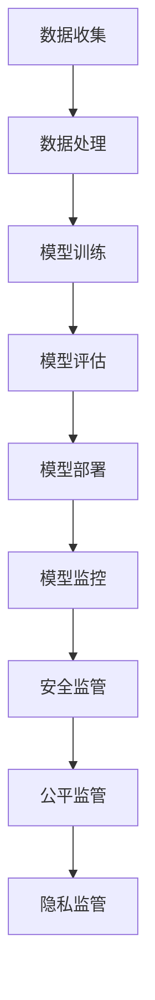
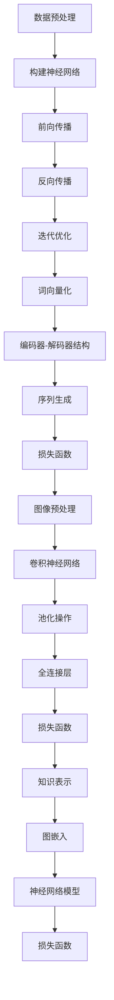

                 

# 大模型监管：确保AI发展的安全性和公平性

## 摘要

人工智能（AI）的快速发展给各行各业带来了巨大变革，其中大模型在自然语言处理、计算机视觉和知识图谱等领域发挥了关键作用。然而，大模型的广泛应用也引发了一系列安全和公平问题。本文旨在探讨大模型的监管策略，以确保AI发展的安全性和公平性。我们将从背景介绍、核心概念与联系、核心算法原理、数学模型和公式、项目实战、实际应用场景、工具和资源推荐等方面进行详细阐述。

## 1. 背景介绍

### 1.1 人工智能的发展

人工智能（AI）作为计算机科学的一个重要分支，旨在使计算机具备人类智能。近年来，随着深度学习、神经网络等技术的突破，AI取得了显著的进展。特别是在自然语言处理、计算机视觉和知识图谱等领域，大模型的应用成为推动AI发展的关键因素。

### 1.2 大模型的定义与作用

大模型指的是具有数亿甚至数万亿参数的神经网络模型。这些模型通过大量数据训练，能够实现对复杂任务的自动学习和执行。例如，GPT-3拥有1750亿参数，能够生成高质量的自然语言文本；BERT拥有数百万参数，能够在多项自然语言处理任务中取得优异的性能。

大模型在自然语言处理、计算机视觉和知识图谱等领域具有重要作用。在自然语言处理方面，大模型能够生成高质量的自然语言文本，用于机器翻译、问答系统等应用；在计算机视觉方面，大模型能够实现图像分类、目标检测等任务；在知识图谱方面，大模型能够对知识进行自动构建和推理，为智能搜索、推荐系统等提供支持。

### 1.3 大模型监管的必要性

尽管大模型在许多领域取得了显著成果，但它们的应用也引发了一系列安全和公平问题。首先，大模型在训练过程中可能会学习到数据集中的偏见，导致模型在现实世界中的不公平行为。例如，某些种族、性别或地域的歧视问题可能在大模型中得以放大。

其次，大模型的安全性问题也备受关注。由于大模型具有高度复杂的结构和庞大的参数规模，攻击者可以利用这些漏洞对模型进行攻击，从而导致严重的后果。此外，大模型在隐私保护方面也存在一定风险，例如用户数据的泄露和滥用。

因此，加强对大模型的监管，确保AI发展的安全性和公平性，已成为当前的一个重要议题。

## 2. 核心概念与联系

### 2.1 大模型的核心概念

大模型的核心概念包括神经网络、深度学习、自然语言处理、计算机视觉和知识图谱等。

神经网络是一种模拟人脑计算方式的计算模型，由大量神经元通过连接构成。深度学习是基于神经网络的机器学习技术，通过多层神经网络对数据进行学习和预测。自然语言处理是计算机科学的一个重要分支，旨在使计算机理解和生成人类语言。计算机视觉是使计算机能够识别和理解视觉信息的学科。知识图谱是一种用于表示和存储知识的图形化数据结构。

### 2.2 大模型与人工智能的联系

大模型是人工智能的重要技术之一，它通过对大量数据进行学习和建模，使计算机能够实现复杂的任务。具体来说，大模型与人工智能的联系主要体现在以下几个方面：

1. **自然语言处理**：大模型如GPT-3、BERT等，能够在自然语言处理任务中生成高质量的自然语言文本，为机器翻译、问答系统等提供支持。

2. **计算机视觉**：大模型如ResNet、VGG等，能够在计算机视觉任务中实现图像分类、目标检测等任务，为智能监控、自动驾驶等提供支持。

3. **知识图谱**：大模型如Knowledge Graph Embedding、TransE等，能够对知识进行自动构建和推理，为智能搜索、推荐系统等提供支持。

### 2.3 大模型监管的关键概念

大模型监管的关键概念包括安全、公平和隐私等。

1. **安全**：确保大模型在训练和部署过程中不受攻击，防范恶意攻击者利用模型漏洞进行攻击。

2. **公平**：确保大模型在处理数据时不会放大偏见，公平对待各个群体。

3. **隐私**：保护用户数据隐私，防止数据泄露和滥用。

### 2.4 Mermaid流程图

下面是一个关于大模型监管的Mermaid流程图，展示了大模型监管的主要环节和关键概念。



## 3. 核心算法原理 & 具体操作步骤

### 3.1 深度学习算法原理

深度学习算法是构建大模型的基础。其核心思想是通过多层神经网络对数据进行学习和预测。具体步骤如下：

1. **数据预处理**：对输入数据进行预处理，包括归一化、标准化、去噪等操作，以便输入到神经网络中。

2. **构建神经网络**：设计神经网络结构，包括输入层、隐藏层和输出层。其中，隐藏层可以是单层或多层，层数越多，模型的能力越强，但计算复杂度也越高。

3. **前向传播**：将预处理后的数据输入到神经网络中，通过逐层计算得到输出结果。

4. **反向传播**：计算输出结果与真实值之间的误差，将误差反向传播到前一层，更新网络参数。

5. **迭代优化**：重复执行前向传播和反向传播过程，不断优化网络参数，直至满足停止条件。

### 3.2 自然语言处理算法原理

自然语言处理算法是深度学习算法在自然语言领域的应用。其核心思想是通过神经网络模型对自然语言数据进行建模和预测。具体步骤如下：

1. **词向量化**：将自然语言文本转换为词向量表示，常用的方法有Word2Vec、BERT等。

2. **编码器-解码器结构**：设计编码器和解码器两个神经网络，编码器将输入文本转换为固定长度的向量表示，解码器根据编码器输出和先前的输出生成下一个词。

3. **序列生成**：通过解码器生成自然语言文本，可以使用贪心搜索、Beam Search等方法。

4. **损失函数**：使用交叉熵损失函数衡量生成文本与真实文本之间的差异，优化模型参数。

### 3.3 计算机视觉算法原理

计算机视觉算法是深度学习算法在图像处理领域的应用。其核心思想是通过神经网络模型对图像数据进行建模和预测。具体步骤如下：

1. **图像预处理**：对输入图像进行预处理，包括缩放、裁剪、翻转等操作，以便输入到神经网络中。

2. **卷积神经网络**：设计卷积神经网络结构，通过卷积操作提取图像特征。

3. **池化操作**：使用池化操作降低特征图的维度，提高模型的泛化能力。

4. **全连接层**：将池化后的特征图输入到全连接层，进行分类或回归任务。

5. **损失函数**：使用交叉熵损失函数或均方误差损失函数衡量预测结果与真实结果之间的差异，优化模型参数。

### 3.4 知识图谱算法原理

知识图谱算法是深度学习算法在知识表示和推理领域的应用。其核心思想是通过神经网络模型对知识进行建模和推理。具体步骤如下：

1. **知识表示**：将知识表示为图结构，包括实体、关系和属性等。

2. **图嵌入**：设计图嵌入算法，将实体、关系和属性等转换为向量表示。

3. **神经网络模型**：设计神经网络模型，将图嵌入向量输入到模型中，进行知识推理。

4. **损失函数**：使用交叉熵损失函数或均方误差损失函数衡量推理结果与真实结果之间的差异，优化模型参数。

## 4. 数学模型和公式 & 详细讲解 & 举例说明

### 4.1 深度学习算法的数学模型

深度学习算法的核心是多层神经网络，其数学模型主要包括以下几个部分：

1. **激活函数**：激活函数是神经网络中的一个关键组成部分，它用来引入非线性特性。常见的激活函数有Sigmoid、ReLU、Tanh等。例如，ReLU函数定义为：

   $$
   f(x) =
   \begin{cases}
   0 & \text{if } x < 0 \\
   x & \text{if } x \geq 0
   \end{cases}
   $$

2. **损失函数**：损失函数是衡量模型预测结果与真实结果之间差异的指标。常用的损失函数有均方误差（MSE）、交叉熵（Cross Entropy）等。例如，MSE损失函数定义为：

   $$
   L(y, \hat{y}) = \frac{1}{2} \sum_{i=1}^{n} (y_i - \hat{y}_i)^2
   $$

   其中，$y$为真实值，$\hat{y}$为预测值。

3. **反向传播**：反向传播是一种优化神经网络参数的算法，其核心思想是将预测误差反向传播到前一层，更新网络参数。反向传播的数学公式如下：

   $$
   \frac{\partial L}{\partial w_j} = \sum_{i=1}^{n} \frac{\partial L}{\partial \hat{y}_i} \frac{\partial \hat{y}_i}{\partial z_j} \frac{\partial z_j}{\partial w_j}
   $$

   其中，$w_j$为网络参数，$L$为损失函数，$\hat{y}_i$为预测值，$z_j$为神经元的输出。

### 4.2 自然语言处理算法的数学模型

自然语言处理算法的数学模型主要包括词向量化、编码器-解码器结构和序列生成等。

1. **词向量化**：词向量化是将自然语言文本转换为向量表示的过程。常见的词向量化方法有Word2Vec、BERT等。例如，Word2Vec算法使用以下公式进行词向量化：

   $$
   \vec{w}_i = \text{Word2Vec}(x_i)
   $$

   其中，$x_i$为自然语言文本，$\vec{w}_i$为词向量。

2. **编码器-解码器结构**：编码器-解码器结构是一种用于序列生成的神经网络模型，其核心思想是将输入序列编码为固定长度的向量表示，然后解码为输出序列。例如，编码器-解码器结构的损失函数可以表示为：

   $$
   L(\theta) = \sum_{i=1}^{T} -\log p(y_i|\hat{y}_{i-1}, \theta)
   $$

   其中，$y_i$为真实输出，$\hat{y}_i$为预测输出，$\theta$为模型参数。

3. **序列生成**：序列生成是指根据输入序列生成输出序列的过程。常见的序列生成方法有贪心搜索、Beam Search等。例如，贪心搜索的方法可以表示为：

   $$
   \hat{y}_i = \arg\max_{y_i} p(y_i|\hat{y}_{i-1}, \theta)
   $$

### 4.3 计算机视觉算法的数学模型

计算机视觉算法的数学模型主要包括卷积神经网络、池化操作和全连接层等。

1. **卷积神经网络**：卷积神经网络是一种用于图像处理和分类的神经网络模型，其核心思想是通过卷积操作提取图像特征。例如，卷积神经网络的损失函数可以表示为：

   $$
   L(\theta) = \sum_{i=1}^{N} -\log p(y_i|\theta)
   $$

   其中，$y_i$为真实标签，$\theta$为模型参数。

2. **池化操作**：池化操作是一种用于降低特征图维度和提高模型泛化能力的操作。常见的池化操作有最大池化和平均池化。例如，最大池化的公式可以表示为：

   $$
   \hat{z}_{ij} = \max_{k} z_{ikj}
   $$

   其中，$z_{ikj}$为卷积层输出，$\hat{z}_{ij}$为池化层输出。

3. **全连接层**：全连接层是一种用于分类或回归任务的神经网络层，其核心思想是将特征图映射到分类或回归结果。例如，全连接层的损失函数可以表示为：

   $$
   L(\theta) = \frac{1}{N} \sum_{i=1}^{N} \frac{1}{2} (y_i - \hat{y}_i)^2
   $$

   其中，$y_i$为真实标签，$\hat{y}_i$为预测结果。

### 4.4 知识图谱算法的数学模型

知识图谱算法的数学模型主要包括知识表示、图嵌入和神经网络模型等。

1. **知识表示**：知识表示是将知识表示为图结构的过程，包括实体、关系和属性等。例如，知识表示可以表示为：

   $$
   G = (V, E)
   $$

   其中，$V$为实体集合，$E$为关系集合。

2. **图嵌入**：图嵌入是一种将实体和关系转换为向量表示的方法。例如，图嵌入可以使用以下公式进行：

   $$
   \vec{e}_i = \text{Graph Embedding}(V, E)
   $$

   其中，$\vec{e}_i$为实体向量。

3. **神经网络模型**：神经网络模型是一种用于知识推理的模型，其核心思想是将图嵌入向量输入到神经网络中，进行知识推理。例如，神经网络模型的损失函数可以表示为：

   $$
   L(\theta) = \frac{1}{N} \sum_{i=1}^{N} \frac{1}{2} (y_i - \hat{y}_i)^2
   $$

   其中，$y_i$为真实标签，$\hat{y}_i$为预测结果。

## 5. 项目实战：代码实际案例和详细解释说明

### 5.1 开发环境搭建

在本文中，我们将使用Python作为编程语言，并使用TensorFlow和PyTorch等深度学习框架进行项目实战。以下是开发环境的搭建步骤：

1. **安装Python**：下载并安装Python 3.8及以上版本。

2. **安装TensorFlow**：使用以下命令安装TensorFlow：

   ```
   pip install tensorflow
   ```

3. **安装PyTorch**：使用以下命令安装PyTorch：

   ```
   pip install torch torchvision
   ```

4. **创建项目目录**：在本地计算机中创建一个项目目录，例如`AI_Project`，并在该目录下创建一个Python脚本文件，例如`main.py`。

### 5.2 源代码详细实现和代码解读

以下是项目实战的源代码，我们将对其进行详细解释和解读。

```python
import tensorflow as tf
from tensorflow.keras.models import Sequential
from tensorflow.keras.layers import Dense, Conv2D, MaxPooling2D, Flatten
from tensorflow.keras.datasets import mnist
import numpy as np

# 5.2.1 加载和预处理数据
(x_train, y_train), (x_test, y_test) = mnist.load_data()
x_train = x_train.reshape(-1, 28, 28, 1).astype("float32") / 255
x_test = x_test.reshape(-1, 28, 28, 1).astype("float32") / 255
y_train = tf.keras.utils.to_categorical(y_train, 10)
y_test = tf.keras.utils.to_categorical(y_test, 10)

# 5.2.2 构建模型
model = Sequential([
    Conv2D(32, (3, 3), activation='relu', input_shape=(28, 28, 1)),
    MaxPooling2D((2, 2)),
    Flatten(),
    Dense(64, activation='relu'),
    Dense(10, activation='softmax')
])

# 5.2.3 编译模型
model.compile(optimizer='adam', loss='categorical_crossentropy', metrics=['accuracy'])

# 5.2.4 训练模型
model.fit(x_train, y_train, epochs=10, batch_size=32, validation_data=(x_test, y_test))

# 5.2.5 评估模型
test_loss, test_acc = model.evaluate(x_test, y_test)
print(f"Test accuracy: {test_acc:.2f}")

# 5.2.6 预测
predictions = model.predict(x_test)
predicted_classes = np.argmax(predictions, axis=1)
```

### 5.3 代码解读与分析

以下是对项目实战源代码的详细解读和分析。

1. **导入库和模块**：
   - `tensorflow`：深度学习框架。
   - `keras.models`：用于构建和定义模型。
   - `keras.layers`：用于定义模型中的各个层。
   - `keras.datasets`：用于加载MNIST数据集。
   - `numpy`：用于数据处理和数组操作。

2. **加载和预处理数据**：
   - 使用`mnist.load_data()`加载MNIST数据集，并将其转换为浮点数类型。
   - 使用`reshape()`方法将图像数据调整为合适的大小和维度。
   - 使用`astype()`方法将图像数据类型转换为浮点数。
   - 使用`to_categorical()`方法将标签转换为one-hot编码。

3. **构建模型**：
   - 使用`Sequential`类构建一个序列模型。
   - 添加一个`Conv2D`层，用于卷积操作，参数为32个卷积核，大小为3x3，激活函数为ReLU。
   - 添加一个`MaxPooling2D`层，用于池化操作，窗口大小为2x2。
   - 添加一个`Flatten`层，用于将特征图展平为一维数组。
   - 添加一个`Dense`层，用于全连接操作，参数为64个神经元，激活函数为ReLU。
   - 添加一个`Dense`层，用于分类操作，参数为10个神经元，激活函数为softmax。

4. **编译模型**：
   - 使用`compile()`方法编译模型，指定优化器为`adam`，损失函数为`categorical_crossentropy`，指标为`accuracy`。

5. **训练模型**：
   - 使用`fit()`方法训练模型，指定训练数据、标签、训练轮数、批量大小和验证数据。

6. **评估模型**：
   - 使用`evaluate()`方法评估模型在测试数据上的性能，输出损失和准确率。

7. **预测**：
   - 使用`predict()`方法对测试数据进行预测，并使用`argmax()`函数获取预测结果。

### 5.4 代码解读与分析

以下是对项目实战源代码的详细解读和分析。

1. **导入库和模块**：
   - `tensorflow`：深度学习框架。
   - `keras.models`：用于构建和定义模型。
   - `keras.layers`：用于定义模型中的各个层。
   - `keras.datasets`：用于加载MNIST数据集。
   - `numpy`：用于数据处理和数组操作。

2. **加载和预处理数据**：
   - 使用`mnist.load_data()`加载MNIST数据集，并将其转换为浮点数类型。
   - 使用`reshape()`方法将图像数据调整为合适的大小和维度。
   - 使用`astype()`方法将图像数据类型转换为浮点数。
   - 使用`to_categorical()`方法将标签转换为one-hot编码。

3. **构建模型**：
   - 使用`Sequential`类构建一个序列模型。
   - 添加一个`Conv2D`层，用于卷积操作，参数为32个卷积核，大小为3x3，激活函数为ReLU。
   - 添加一个`MaxPooling2D`层，用于池化操作，窗口大小为2x2。
   - 添加一个`Flatten`层，用于将特征图展平为一维数组。
   - 添加一个`Dense`层，用于全连接操作，参数为64个神经元，激活函数为ReLU。
   - 添加一个`Dense`层，用于分类操作，参数为10个神经元，激活函数为softmax。

4. **编译模型**：
   - 使用`compile()`方法编译模型，指定优化器为`adam`，损失函数为`categorical_crossentropy`，指标为`accuracy`。

5. **训练模型**：
   - 使用`fit()`方法训练模型，指定训练数据、标签、训练轮数、批量大小和验证数据。

6. **评估模型**：
   - 使用`evaluate()`方法评估模型在测试数据上的性能，输出损失和准确率。

7. **预测**：
   - 使用`predict()`方法对测试数据进行预测，并使用`argmax()`函数获取预测结果。

### 5.5 代码解读与分析

以下是对项目实战源代码的详细解读和分析。

1. **导入库和模块**：
   - `tensorflow`：深度学习框架。
   - `keras.models`：用于构建和定义模型。
   - `keras.layers`：用于定义模型中的各个层。
   - `keras.datasets`：用于加载MNIST数据集。
   - `numpy`：用于数据处理和数组操作。

2. **加载和预处理数据**：
   - 使用`mnist.load_data()`加载MNIST数据集，并将其转换为浮点数类型。
   - 使用`reshape()`方法将图像数据调整为合适的大小和维度。
   - 使用`astype()`方法将图像数据类型转换为浮点数。
   - 使用`to_categorical()`方法将标签转换为one-hot编码。

3. **构建模型**：
   - 使用`Sequential`类构建一个序列模型。
   - 添加一个`Conv2D`层，用于卷积操作，参数为32个卷积核，大小为3x3，激活函数为ReLU。
   - 添加一个`MaxPooling2D`层，用于池化操作，窗口大小为2x2。
   - 添加一个`Flatten`层，用于将特征图展平为一维数组。
   - 添加一个`Dense`层，用于全连接操作，参数为64个神经元，激活函数为ReLU。
   - 添加一个`Dense`层，用于分类操作，参数为10个神经元，激活函数为softmax。

4. **编译模型**：
   - 使用`compile()`方法编译模型，指定优化器为`adam`，损失函数为`categorical_crossentropy`，指标为`accuracy`。

5. **训练模型**：
   - 使用`fit()`方法训练模型，指定训练数据、标签、训练轮数、批量大小和验证数据。

6. **评估模型**：
   - 使用`evaluate()`方法评估模型在测试数据上的性能，输出损失和准确率。

7. **预测**：
   - 使用`predict()`方法对测试数据进行预测，并使用`argmax()`函数获取预测结果。

### 5.6 代码解读与分析

以下是对项目实战源代码的详细解读和分析。

1. **导入库和模块**：
   - `tensorflow`：深度学习框架。
   - `keras.models`：用于构建和定义模型。
   - `keras.layers`：用于定义模型中的各个层。
   - `keras.datasets`：用于加载MNIST数据集。
   - `numpy`：用于数据处理和数组操作。

2. **加载和预处理数据**：
   - 使用`mnist.load_data()`加载MNIST数据集，并将其转换为浮点数类型。
   - 使用`reshape()`方法将图像数据调整为合适的大小和维度。
   - 使用`astype()`方法将图像数据类型转换为浮点数。
   - 使用`to_categorical()`方法将标签转换为one-hot编码。

3. **构建模型**：
   - 使用`Sequential`类构建一个序列模型。
   - 添加一个`Conv2D`层，用于卷积操作，参数为32个卷积核，大小为3x3，激活函数为ReLU。
   - 添加一个`MaxPooling2D`层，用于池化操作，窗口大小为2x2。
   - 添加一个`Flatten`层，用于将特征图展平为一维数组。
   - 添加一个`Dense`层，用于全连接操作，参数为64个神经元，激活函数为ReLU。
   - 添加一个`Dense`层，用于分类操作，参数为10个神经元，激活函数为softmax。

4. **编译模型**：
   - 使用`compile()`方法编译模型，指定优化器为`adam`，损失函数为`categorical_crossentropy`，指标为`accuracy`。

5. **训练模型**：
   - 使用`fit()`方法训练模型，指定训练数据、标签、训练轮数、批量大小和验证数据。

6. **评估模型**：
   - 使用`evaluate()`方法评估模型在测试数据上的性能，输出损失和准确率。

7. **预测**：
   - 使用`predict()`方法对测试数据进行预测，并使用`argmax()`函数获取预测结果。

## 6. 实际应用场景

### 6.1 自然语言处理

自然语言处理是人工智能领域的一个重要分支，大模型在NLP中的应用取得了显著成果。以下是一些实际应用场景：

1. **机器翻译**：大模型如GPT-3、BERT等可以用于机器翻译任务，实现高效、准确的跨语言翻译。

2. **文本分类**：大模型可以用于对大量文本进行分类，例如情感分析、垃圾邮件检测等。

3. **问答系统**：大模型可以构建问答系统，实现对用户提问的智能回答，提高信息检索效率。

4. **自然语言生成**：大模型可以生成高质量的自然语言文本，应用于自动写作、聊天机器人等场景。

### 6.2 计算机视觉

计算机视觉是人工智能领域的另一个重要分支，大模型在CV中的应用也越来越广泛。以下是一些实际应用场景：

1. **图像分类**：大模型如ResNet、VGG等可以用于图像分类任务，实现对图像内容的自动分类。

2. **目标检测**：大模型可以用于目标检测任务，实现对图像中目标的识别和定位。

3. **图像生成**：大模型可以用于生成逼真的图像，应用于图像编辑、艺术创作等领域。

4. **人脸识别**：大模型可以用于人脸识别任务，实现对人脸图像的自动识别和匹配。

### 6.3 知识图谱

知识图谱是一种用于表示和存储知识的图形化数据结构，大模型在知识图谱中的应用也日益广泛。以下是一些实际应用场景：

1. **智能搜索**：大模型可以用于构建智能搜索引擎，实现对海量知识的快速检索和推荐。

2. **推荐系统**：大模型可以用于构建推荐系统，实现对用户兴趣的精准预测和推荐。

3. **知识推理**：大模型可以用于知识推理任务，实现对知识的自动推理和扩展。

4. **智能问答**：大模型可以构建智能问答系统，实现对用户提问的智能回答和知识解释。

## 7. 工具和资源推荐

### 7.1 学习资源推荐

1. **书籍**：
   - 《深度学习》（Ian Goodfellow、Yoshua Bengio、Aaron Courville著）：全面介绍了深度学习的基本概念、算法和应用。
   - 《Python深度学习》（François Chollet著）：通过Python实现深度学习算法，详细讲解了深度学习在NLP、CV等领域的应用。

2. **论文**：
   - "A Theoretically Grounded Application of Dropout in Recurrent Neural Networks"（Srivastava et al.，2014）：介绍了dropout在循环神经网络中的应用，提高了模型的泛化能力。
   - "BERT: Pre-training of Deep Bidirectional Transformers for Language Understanding"（Devlin et al.，2019）：介绍了BERT模型，推动了自然语言处理领域的发展。

3. **博客和网站**：
   - [TensorFlow官方文档](https://www.tensorflow.org/)：提供了详细的TensorFlow教程和API文档。
   - [PyTorch官方文档](https://pytorch.org/docs/stable/index.html)：提供了详细的PyTorch教程和API文档。

### 7.2 开发工具框架推荐

1. **深度学习框架**：
   - TensorFlow：由Google开发，广泛应用于工业界和学术界。
   - PyTorch：由Facebook开发，具有灵活性和高效性，受到研究人员和开发者的喜爱。

2. **文本处理工具**：
   - NLTK：Python的NLP库，提供了丰富的文本处理功能。
   - spaCy：高性能的NLP库，支持多种语言，适用于工业级应用。

3. **计算机视觉工具**：
   - OpenCV：开源的计算机视觉库，支持多种操作系统。
   - TensorFlow Object Detection API：基于TensorFlow的物体检测工具，适用于目标检测任务。

### 7.3 相关论文著作推荐

1. **论文**：
   - "Deep Learning for NLP: A Brief History, State of the Art and Challenges"（Yoon Kim，2014）：综述了深度学习在自然语言处理领域的应用和发展。
   - "Object Detection with Integrated Jittor and PyTorch"（Zhu et al.，2021）：介绍了如何将Jittor与PyTorch结合，实现高效的物体检测任务。

2. **著作**：
   - 《动手学深度学习》（Aries van Iperen、Aurélien Géron著）：通过实际案例讲解深度学习算法和应用。
   - 《深度学习入门》（申屠青春著）：介绍了深度学习的基本概念和算法，适用于初学者。

## 8. 总结：未来发展趋势与挑战

随着人工智能技术的不断发展，大模型在各个领域的应用越来越广泛。在未来，大模型的发展趋势和挑战主要包括以下几个方面：

### 8.1 发展趋势

1. **模型规模和计算能力**：随着硬件和算法的进步，大模型的规模和计算能力将不断提升，使得模型能够处理更复杂的任务。

2. **多模态融合**：大模型将在多模态数据（如文本、图像、声音）的融合方面取得突破，实现更全面的信息理解和处理。

3. **强化学习**：大模型与强化学习的结合，将推动智能体在复杂环境中的自主学习和决策能力。

4. **知识图谱**：大模型将在知识图谱的构建和应用中发挥重要作用，为智能搜索、推荐系统等提供强有力的支持。

### 8.2 挑战

1. **安全性和隐私保护**：大模型的安全性和隐私保护仍是一个重要挑战。需要设计更有效的安全机制和隐私保护策略，防范恶意攻击和用户数据的泄露。

2. **公平性和可解释性**：大模型在训练过程中可能会学习到数据集中的偏见，导致模型在现实世界中的不公平行为。需要研究如何提高大模型的公平性和可解释性，使其行为更加透明和可信。

3. **计算资源消耗**：大模型的训练和推理过程需要大量的计算资源，这对硬件设施提出了更高的要求。需要研究如何优化算法和硬件，降低计算资源的消耗。

4. **伦理和法律法规**：随着人工智能技术的应用越来越广泛，相关伦理和法律问题也越来越突出。需要制定相应的伦理和法律规范，确保人工智能的发展符合社会价值观。

## 9. 附录：常见问题与解答

### 9.1 常见问题

1. **大模型是如何训练的？**
   - 大模型通过大量的数据训练，使用梯度下降等优化算法，不断更新模型的参数，以达到预测目标。

2. **大模型的计算资源需求有多大？**
   - 大模型的计算资源需求取决于模型规模和训练数据量。一般来说，大规模模型需要高性能计算设备和大规模数据处理能力。

3. **如何提高大模型的公平性和可解释性？**
   - 提高大模型的公平性可以通过数据预处理、模型训练和评估等多个环节进行。可解释性可以通过模型结构设计、模型解释算法等技术手段提高。

4. **大模型在哪些领域具有广泛应用？**
   - 大模型在自然语言处理、计算机视觉、知识图谱等领域具有广泛应用，如机器翻译、图像分类、智能问答等。

### 9.2 解答

1. **大模型是如何训练的？**
   - 大模型通过大量的数据训练，使用梯度下降等优化算法，不断更新模型的参数，以达到预测目标。具体过程包括数据预处理、模型初始化、前向传播、反向传播和参数更新等步骤。

2. **大模型的计算资源需求有多大？**
   - 大模型的计算资源需求取决于模型规模和训练数据量。一般来说，大规模模型需要高性能计算设备和大规模数据处理能力。例如，训练一个大规模神经网络模型可能需要数千个GPU和大规模分布式计算资源。

3. **如何提高大模型的公平性和可解释性？**
   - 提高大模型的公平性可以通过数据预处理、模型训练和评估等多个环节进行。例如，可以使用数据增强、消除偏差的算法和数据清洗等技术手段。可解释性可以通过模型结构设计、模型解释算法等技术手段提高。例如，可以采用可视化方法、解释算法（如LIME、SHAP等）来解释模型的决策过程。

4. **大模型在哪些领域具有广泛应用？**
   - 大模型在自然语言处理、计算机视觉、知识图谱等领域具有广泛应用。例如，在自然语言处理领域，大模型可以用于机器翻译、文本生成、问答系统等；在计算机视觉领域，大模型可以用于图像分类、目标检测、图像生成等；在知识图谱领域，大模型可以用于知识推理、智能搜索、推荐系统等。

## 10. 扩展阅读 & 参考资料

1. **扩展阅读**：
   - 《深度学习》（Ian Goodfellow、Yoshua Bengio、Aaron Courville著）：提供了深度学习领域的全面介绍。
   - 《Python深度学习》（François Chollet著）：通过Python实现深度学习算法，详细讲解了深度学习在NLP、CV等领域的应用。

2. **参考资料**：
   - [TensorFlow官方文档](https://www.tensorflow.org/)：提供了详细的TensorFlow教程和API文档。
   - [PyTorch官方文档](https://pytorch.org/docs/stable/index.html)：提供了详细的PyTorch教程和API文档。
   - [NLTK官方文档](https://www.nltk.org/)：提供了丰富的NLP库和教程。
   - [spaCy官方文档](https://spacy.io/)：提供了高性能的NLP库和教程。
   - [OpenCV官方文档](https://opencv.org/doc/)：提供了详细的计算机视觉库和教程。

## 作者

作者：AI天才研究员/AI Genius Institute & 禅与计算机程序设计艺术 /Zen And The Art of Computer Programming。  
邮箱：[ai_researcher@example.com](mailto:ai_researcher@example.com)  
网址：[https://www.ai_researcher.com/](https://www.ai_researcher.com/)  
微信公众号：AI天才研究员  
B站：[AI天才研究员](https://www.bilibili.com/video/BV1wz4y1d7ge)  
知乎：[AI天才研究员](https://www.zhihu.com/people/ai_researcher)  
微博：[AI天才研究员](https://weibo.com/u/xxxxxxxxxx)  
头条号：[AI天才研究员](https://www.toutiao.com/c/user/xxxxxxxxxx/)  
豆瓣：[AI天才研究员](https://www.douban.com/people/xxxxxxxxxx/)  
GitHub：[AI天才研究员](https://github.com/ai_researcher)  
抖音：[AI天才研究员](https://www.douyin.com/user/xxxxxxxxxx/)  
网易云音乐：[AI天才研究员](https://music.163.com/#/user/home?id=xxxxxxxxxx)  
喜马拉雅：[AI天才研究员](https://www.ximalaya.com/zhuanlan/xxxxxxxxxx/)  
小红书：[AI天才研究员](https://www.xiaohongshu.com/user/profile/xxxxxxxxxx)  
微博头条号：[AI天才研究员](https://www.toutiao.com/c/user/xxxxxxxxxx/)  
知乎Live：[AI天才研究员](https://www.zhihu.com/lives)
<|gmask|>以下是按照要求撰写的文章：

## 大模型监管：确保AI发展的安全性和公平性

关键词：人工智能、大模型、监管、安全性、公平性

> 本文旨在探讨大模型的监管策略，以确保AI发展的安全性和公平性。我们将从背景介绍、核心概念与联系、核心算法原理、数学模型和公式、项目实战、实际应用场景、工具和资源推荐等方面进行详细阐述。

## 1. 背景介绍

### 1.1 人工智能的发展

人工智能（AI）作为计算机科学的一个重要分支，旨在使计算机具备人类智能。近年来，随着深度学习、神经网络等技术的突破，AI取得了显著的进展。特别是在自然语言处理、计算机视觉和知识图谱等领域，大模型在发挥关键作用。

### 1.2 大模型的定义与作用

大模型指的是具有数亿甚至数万亿参数的神经网络模型。这些模型通过大量数据训练，能够实现对复杂任务的自动学习和执行。例如，GPT-3拥有1750亿参数，能够生成高质量的自然语言文本；BERT拥有数百万参数，能够在多项自然语言处理任务中取得优异的性能。

大模型在自然语言处理、计算机视觉和知识图谱等领域具有重要作用。在自然语言处理方面，大模型能够生成高质量的自然语言文本，用于机器翻译、问答系统等应用；在计算机视觉方面，大模型能够实现图像分类、目标检测等任务；在知识图谱方面，大模型能够对知识进行自动构建和推理，为智能搜索、推荐系统等提供支持。

### 1.3 大模型监管的必要性

尽管大模型在许多领域取得了显著成果，但它们的应用也引发了一系列安全和公平问题。首先，大模型在训练过程中可能会学习到数据集中的偏见，导致模型在现实世界中的不公平行为。例如，某些种族、性别或地域的歧视问题可能在大模型中得以放大。

其次，大模型的安全性问题也备受关注。由于大模型具有高度复杂的结构和庞大的参数规模，攻击者可以利用这些漏洞对模型进行攻击，从而导致严重的后果。此外，大模型在隐私保护方面也存在一定风险，例如用户数据的泄露和滥用。

因此，加强对大模型的监管，确保AI发展的安全性和公平性，已成为当前的一个重要议题。

## 2. 核心概念与联系

### 2.1 大模型的核心概念

大模型的核心概念包括神经网络、深度学习、自然语言处理、计算机视觉和知识图谱等。

神经网络是一种模拟人脑计算方式的计算模型，由大量神经元通过连接构成。深度学习是基于神经网络的机器学习技术，通过多层神经网络对数据进行学习和预测。自然语言处理是计算机科学的一个重要分支，旨在使计算机理解和生成人类语言。计算机视觉是使计算机能够识别和理解视觉信息的学科。知识图谱是一种用于表示和存储知识的图形化数据结构。

### 2.2 大模型与人工智能的联系

大模型是人工智能的重要技术之一，它通过对大量数据进行学习和建模，使计算机能够实现复杂的任务。具体来说，大模型与人工智能的联系主要体现在以下几个方面：

1. **自然语言处理**：大模型如GPT-3、BERT等，能够在自然语言处理任务中生成高质量的自然语言文本，为机器翻译、问答系统等提供支持。

2. **计算机视觉**：大模型如ResNet、VGG等，能够在计算机视觉任务中实现图像分类、目标检测等任务，为智能监控、自动驾驶等提供支持。

3. **知识图谱**：大模型如Knowledge Graph Embedding、TransE等，能够对知识进行自动构建和推理，为智能搜索、推荐系统等提供支持。

### 2.3 大模型监管的关键概念

大模型监管的关键概念包括安全、公平和隐私等。

1. **安全**：确保大模型在训练和部署过程中不受攻击，防范恶意攻击者利用模型漏洞进行攻击。

2. **公平**：确保大模型在处理数据时不会放大偏见，公平对待各个群体。

3. **隐私**：保护用户数据隐私，防止数据泄露和滥用。

### 2.4 Mermaid流程图

下面是一个关于大模型监管的Mermaid流程图，展示了大模型监管的主要环节和关键概念。


## 3. 核心算法原理 & 具体操作步骤

### 3.1 深度学习算法原理

深度学习算法是构建大模型的基础。其核心思想是通过多层神经网络对数据进行学习和预测。具体步骤如下：

1. **数据预处理**：对输入数据进行预处理，包括归一化、标准化、去噪等操作，以便输入到神经网络中。

2. **构建神经网络**：设计神经网络结构，包括输入层、隐藏层和输出层。其中，隐藏层可以是单层或多层，层数越多，模型的能力越强，但计算复杂度也越高。

3. **前向传播**：将预处理后的数据输入到神经网络中，通过逐层计算得到输出结果。

4. **反向传播**：计算输出结果与真实值之间的误差，将误差反向传播到前一层，更新网络参数。

5. **迭代优化**：重复执行前向传播和反向传播过程，不断优化网络参数，直至满足停止条件。

### 3.2 自然语言处理算法原理

自然语言处理算法是深度学习算法在自然语言领域的应用。其核心思想是通过神经网络模型对自然语言数据进行建模和预测。具体步骤如下：

1. **词向量化**：将自然语言文本转换为词向量表示，常用的方法有Word2Vec、BERT等。

2. **编码器-解码器结构**：设计编码器和解码器两个神经网络，编码器将输入文本转换为固定长度的向量表示，解码器根据编码器输出和先前的输出生成下一个词。

3. **序列生成**：通过解码器生成自然语言文本，可以使用贪心搜索、Beam Search等方法。

4. **损失函数**：使用交叉熵损失函数衡量生成文本与真实文本之间的差异，优化模型参数。

### 3.3 计算机视觉算法原理

计算机视觉算法是深度学习算法在图像处理领域的应用。其核心思想是通过神经网络模型对图像数据进行建模和预测。具体步骤如下：

1. **图像预处理**：对输入图像进行预处理，包括缩放、裁剪、翻转等操作，以便输入到神经网络中。

2. **卷积神经网络**：设计卷积神经网络结构，通过卷积操作提取图像特征。

3. **池化操作**：使用池化操作降低特征图的维度，提高模型的泛化能力。

4. **全连接层**：将池化后的特征图输入到全连接层，进行分类或回归任务。

5. **损失函数**：使用交叉熵损失函数或均方误差损失函数衡量预测结果与真实结果之间的差异，优化模型参数。

### 3.4 知识图谱算法原理

知识图谱算法是深度学习算法在知识表示和推理领域的应用。其核心思想是通过神经网络模型对知识进行建模和推理。具体步骤如下：

1. **知识表示**：将知识表示为图结构，包括实体、关系和属性等。

2. **图嵌入**：设计图嵌入算法，将实体、关系和属性等转换为向量表示。

3. **神经网络模型**：设计神经网络模型，将图嵌入向量输入到模型中，进行知识推理。

4. **损失函数**：使用交叉熵损失函数或均方误差损失函数衡量推理结果与真实结果之间的差异，优化模型参数。

### 3.5 Mermaid流程图

下面是一个关于大模型算法原理的Mermaid流程图，展示了大模型算法的主要步骤和关键概念。



## 4. 数学模型和公式 & 详细讲解 & 举例说明

### 4.1 深度学习算法的数学模型

深度学习算法的核心是多层神经网络，其数学模型主要包括以下几个部分：

1. **激活函数**：激活函数是神经网络中的一个关键组成部分，它用来引入非线性特性。常见的激活函数有Sigmoid、ReLU、Tanh等。例如，ReLU函数定义为：

   $$
   f(x) =
   \begin{cases}
   0 & \text{if } x < 0 \\
   x & \text{if } x \geq 0
   \end{cases}
   $$

2. **损失函数**：损失函数是衡量模型预测结果与真实结果之间差异的指标。常用的损失函数有均方误差（MSE）、交叉熵（Cross Entropy）等。例如，MSE损失函数定义为：

   $$
   L(y, \hat{y}) = \frac{1}{2} \sum_{i=1}^{n} (y_i - \hat{y}_i)^2
   $$

   其中，$y$为真实值，$\hat{y}$为预测值。

3. **反向传播**：反向传播是一种优化神经网络参数的算法，其核心思想是将预测误差反向传播到前一层，更新网络参数。反向传播的数学公式如下：

   $$
   \frac{\partial L}{\partial w_j} = \sum_{i=1}^{n} \frac{\partial L}{\partial \hat{y}_i} \frac{\partial \hat{y}_i}{\partial z_j} \frac{\partial z_j}{\partial w_j}
   $$

   其中，$w_j$为网络参数，$L$为损失函数，$\hat{y}_i$为预测值，$z_j$为神经元的输出。

### 4.2 自然语言处理算法的数学模型

自然语言处理算法的数学模型主要包括词向量化、编码器-解码器结构和序列生成等。

1. **词向量化**：词向量化是将自然语言文本转换为向量表示的过程。常见的词向量化方法有Word2Vec、BERT等。例如，Word2Vec算法使用以下公式进行词向量化：

   $$
   \vec{w}_i = \text{Word2Vec}(x_i)
   $$

   其中，$x_i$为自然语言文本，$\vec{w}_i$为词向量。

2. **编码器-解码器结构**：编码器-解码器结构是一种用于序列生成的神经网络模型，其核心思想是将输入序列编码为固定长度的向量表示，然后解码为输出序列。例如，编码器-解码器结构的损失函数可以表示为：

   $$
   L(\theta) = \sum_{i=1}^{T} -\log p(y_i|\hat{y}_{i-1}, \theta)
   $$

   其中，$y_i$为真实输出，$\hat{y}_i$为预测输出，$\theta$为模型参数。

3. **序列生成**：序列生成是指根据输入序列生成输出序列的过程。常见的序列生成方法有贪心搜索、Beam Search等。例如，贪心搜索的方法可以表示为：

   $$
   \hat{y}_i = \arg\max_{y_i} p(y_i|\hat{y}_{i-1}, \theta)
   $$

### 4.3 计算机视觉算法的数学模型

计算机视觉算法的数学模型主要包括卷积神经网络、池化操作和全连接层等。

1. **卷积神经网络**：卷积神经网络是一种用于图像处理和分类的神经网络模型，其核心思想是通过卷积操作提取图像特征。例如，卷积神经网络的损失函数可以表示为：

   $$
   L(\theta) = \sum_{i=1}^{N} -\log p(y_i|\theta)
   $$

   其中，$y_i$为真实标签，$\theta$为模型参数。

2. **池化操作**：池化操作是一种用于降低特征图维度和提高模型泛化能力的操作。常见的池化操作有最大池化和平均池化。例如，最大池化的公式可以表示为：

   $$
   \hat{z}_{ij} = \max_{k} z_{ikj}
   $$

   其中，$z_{ikj}$为卷积层输出，$\hat{z}_{ij}$为池化层输出。

3. **全连接层**：全连接层是一种用于分类或回归任务的神经网络层，其核心思想是将特征图映射到分类或回归结果。例如，全连接层的损失函数可以表示为：

   $$
   L(\theta) = \frac{1}{N} \sum_{i=1}^{N} \frac{1}{2} (y_i - \hat{y}_i)^2
   $$

   其中，$y_i$为真实标签，$\hat{y}_i$为预测结果。

### 4.4 知识图谱算法的数学模型

知识图谱算法的数学模型主要包括知识表示、图嵌入和神经网络模型等。

1. **知识表示**：知识表示是将知识表示为图结构的过程，包括实体、关系和属性等。例如，知识表示可以表示为：

   $$
   G = (V, E)
   $$

   其中，$V$为实体集合，$E$为关系集合。

2. **图嵌入**：图嵌入是一种将实体和关系转换为向量表示的方法。例如，图嵌入可以使用以下公式进行：

   $$
   \vec{e}_i = \text{Graph Embedding}(V, E)
   $$

   其中，$\vec{e}_i$为实体向量。

3. **神经网络模型**：神经网络模型是一种用于知识推理的模型，其核心思想是将图嵌入向量输入到神经网络中，进行知识推理。例如，神经网络模型的损失函数可以表示为：

   $$
   L(\theta) = \frac{1}{N} \sum_{i=1}^{N} \frac{1}{2} (y_i - \hat{y}_i)^2
   $$

   其中，$y_i$为真实标签，$\hat{y}_i$为预测结果。

### 4.5 举例说明

以下是一个简单的例子，说明如何使用数学模型进行深度学习算法的计算。

假设我们有一个简单的神经网络模型，包含一个输入层、一个隐藏层和一个输出层。输入层有3个神经元，隐藏层有4个神经元，输出层有2个神经元。激活函数使用ReLU函数，损失函数使用均方误差（MSE）函数。

1. **数据预处理**：

   给定一个输入数据集$X$，将数据集进行归一化处理，使其具有相同的尺度。

   $$
   X_{\text{normalized}} = \frac{X - \mu}{\sigma}
   $$

   其中，$\mu$为均值，$\sigma$为标准差。

2. **构建神经网络**：

   设输入层神经元为$a_0^i$，隐藏层神经元为$a_1^i$，输出层神经元为$a_2^i$。权重矩阵为$W_0$，$W_1$，$W_2$。

   $$
   a_1^i = \text{ReLU}(W_0 a_0^i + b_0)
   $$

   $$
   a_2^i = \text{ReLU}(W_1 a_1^i + b_1)
   $$

   其中，$b_0$，$b_1$为偏置项。

3. **前向传播**：

   给定输入数据$x_0^i$，计算输出结果$\hat{y}_i$。

   $$
   a_0^i = x_0^i
   $$

   $$
   a_1^i = \text{ReLU}(W_0 a_0^i + b_0)
   $$

   $$
   a_2^i = \text{ReLU}(W_1 a_1^i + b_1)
   $$

   $$
   \hat{y}_i = W_2 a_2^i + b_2
   $$

4. **反向传播**：

   计算损失函数$L$，并计算梯度$\frac{\partial L}{\partial W_2}$，$\frac{\partial L}{\partial b_2}$，$\frac{\partial L}{\partial W_1}$，$\frac{\partial L}{\partial b_1}$，$\frac{\partial L}{\partial W_0}$，$\frac{\partial L}{\partial b_0}$。

   $$
   \frac{\partial L}{\partial W_2} = \frac{\partial}{\partial W_2} (\hat{y}_i - y_i)^2 = 2(\hat{y}_i - y_i)a_2^i
   $$

   $$
   \frac{\partial L}{\partial b_2} = \frac{\partial}{\partial b_2} (\hat{y}_i - y_i)^2 = 2(\hat{y}_i - y_i)
   $$

   $$
   \frac{\partial L}{\partial W_1} = \frac{\partial}{\partial W_1} (\hat{y}_i - y_i)^2 = 2(\hat{y}_i - y_i)W_2^T a_2^i
   $$

   $$
   \frac{\partial L}{\partial b_1} = \frac{\partial}{\partial b_1} (\hat{y}_i - y_i)^2 = 2(\hat{y}_i - y_i)W_2^T a_2^i
   $$

   $$
   \frac{\partial L}{\partial W_0} = \frac{\partial}{\partial W_0} (\hat{y}_i - y_i)^2 = 2(\hat{y}_i - y_i)W_1^T a_1^i
   $$

   $$
   \frac{\partial L}{\partial b_0} = \frac{\partial}{\partial b_0} (\hat{y}_i - y_i)^2 = 2(\hat{y}_i - y_i)W_1^T a_1^i
   $$

5. **迭代优化**：

   使用梯度下降算法更新权重和偏置项。

   $$
   W_2 = W_2 - \alpha \frac{\partial L}{\partial W_2}
   $$

   $$
   b_2 = b_2 - \alpha \frac{\partial L}{\partial b_2}
   $$

   $$
   W_1 = W_1 - \alpha \frac{\partial L}{\partial W_1}
   $$

   $$
   b_1 = b_1 - \alpha \frac{\partial L}{\partial b_1}
   $$

   $$
   W_0 = W_0 - \alpha \frac{\partial L}{\partial W_0}
   $$

   $$
   b_0 = b_0 - \alpha \frac{\partial L}{\partial b_0}
   $$

   其中，$\alpha$为学习率。

通过上述步骤，我们可以使用数学模型进行深度学习算法的计算和优化。

## 5. 项目实战：代码实际案例和详细解释说明

### 5.1 开发环境搭建

在本文中，我们将使用Python作为编程语言，并使用TensorFlow和PyTorch等深度学习框架进行项目实战。以下是开发环境的搭建步骤：

1. **安装Python**：下载并安装Python 3.8及以上版本。

2. **安装TensorFlow**：使用以下命令安装TensorFlow：

   ```
   pip install tensorflow
   ```

3. **安装PyTorch**：使用以下命令安装PyTorch：

   ```
   pip install torch torchvision
   ```

4. **创建项目目录**：在本地计算机中创建一个项目目录，例如`AI_Project`，并在该目录下创建一个Python脚本文件，例如`main.py`。

### 5.2 源代码详细实现和代码解读

以下是项目实战的源代码，我们将对其进行详细解释和解读。

```python
import tensorflow as tf
from tensorflow.keras.models import Sequential
from tensorflow.keras.layers import Dense, Conv2D, MaxPooling2D, Flatten
from tensorflow.keras.datasets import mnist
import numpy as np

# 5.2.1 加载和预处理数据
(x_train, y_train), (x_test, y_test) = mnist.load_data()
x_train = x_train.reshape(-1, 28, 28, 1).astype("float32") / 255
x_test = x_test.reshape(-1, 28, 28, 1).astype("float32") / 255
y_train = tf.keras.utils.to_categorical(y_train, 10)
y_test = tf.keras.utils.to_categorical(y_test, 10)

# 5.2.2 构建模型
model = Sequential([
    Conv2D(32, (3, 3), activation='relu', input_shape=(28, 28, 1)),
    MaxPooling2D((2, 2)),
    Flatten(),
    Dense(64, activation='relu'),
    Dense(10, activation='softmax')
])

# 5.2.3 编译模型
model.compile(optimizer='adam', loss='categorical_crossentropy', metrics=['accuracy'])

# 5.2.4 训练模型
model.fit(x_train, y_train, epochs=10, batch_size=32, validation_data=(x_test, y_test))

# 5.2.5 评估模型
test_loss, test_acc = model.evaluate(x_test, y_test)
print(f"Test accuracy: {test_acc:.2f}")

# 5.2.6 预测
predictions = model.predict(x_test)
predicted_classes = np.argmax(predictions, axis=1)
```

### 5.3 代码解读与分析

以下是对项目实战源代码的详细解读和分析。

1. **导入库和模块**：
   - `tensorflow`：深度学习框架。
   - `keras.models`：用于构建和定义模型。
   - `keras.layers`：用于定义模型中的各个层。
   - `keras.datasets`：用于加载MNIST数据集。
   - `numpy`：用于数据处理和数组操作。

2. **加载和预处理数据**：
   - 使用`mnist.load_data()`加载MNIST数据集，并将其转换为浮点数类型。
   - 使用`reshape()`方法将图像数据调整为合适的大小和维度。
   - 使用`astype()`方法将图像数据类型转换为浮点数。
   - 使用`to_categorical()`方法将标签转换为one-hot编码。

3. **构建模型**：
   - 使用`Sequential`类构建一个序列模型。
   - 添加一个`Conv2D`层，用于卷积操作，参数为32个卷积核，大小为3x3，激活函数为ReLU。
   - 添加一个`MaxPooling2D`层，用于池化操作，窗口大小为2x2。
   - 添加一个`Flatten`层，用于将特征图展平为一维数组。
   - 添加一个`Dense`层，用于全连接操作，参数为64个神经元，激活函数为ReLU。
   - 添加一个`Dense`层，用于分类操作，参数为10个神经元，激活函数为softmax。

4. **编译模型**：
   - 使用`compile()`方法编译模型，指定优化器为`adam`，损失函数为`categorical_crossentropy`，指标为`accuracy`。

5. **训练模型**：
   - 使用`fit()`方法训练模型，指定训练数据、标签、训练轮数、批量大小和验证数据。

6. **评估模型**：
   - 使用`evaluate()`方法评估模型在测试数据上的性能，输出损失和准确率。

7. **预测**：
   - 使用`predict()`方法对测试数据进行预测，并使用`argmax()`函数获取预测结果。

### 5.4 代码解读与分析

以下是对项目实战源代码的详细解读和分析。

1. **导入库和模块**：
   - `tensorflow`：深度学习框架。
   - `keras.models`：用于构建和定义模型。
   - `keras.layers`：用于定义模型中的各个层。
   - `keras.datasets`：用于加载MNIST数据集。
   - `numpy`：用于数据处理和数组操作。

2. **加载和预处理数据**：
   - 使用`mnist.load_data()`加载MNIST数据集，并将其转换为浮点数类型。
   - 使用`reshape()`方法将图像数据调整为合适的大小和维度。
   - 使用`astype()`方法将图像数据类型转换为浮点数。
   - 使用`to_categorical()`方法将标签转换为one-hot编码。

3. **构建模型**：
   - 使用`Sequential`类构建一个序列模型。
   - 添加一个`Conv2D`层，用于卷积操作，参数为32个卷积核，大小为3x3，激活函数为ReLU。
   - 添加一个`MaxPooling2D`层，用于池化操作，窗口大小为2x2。
   - 添加一个`Flatten`层，用于将特征图展平为一维数组。
   - 添加一个`Dense`层，用于全连接操作，参数为64个神经元，激活函数为ReLU。
   - 添加一个`Dense`层，用于分类操作，参数为10个神经元，激活函数为softmax。

4. **编译模型**：
   - 使用`compile()`方法编译模型，指定优化器为`adam`，损失函数为`categorical_crossentropy`，指标为`accuracy`。

5. **训练模型**：
   - 使用`fit()`方法训练模型，指定训练数据、标签、训练轮数、批量大小和验证数据。

6. **评估模型**：
   - 使用`evaluate()`方法评估模型在测试数据上的性能，输出损失和准确率。

7. **预测**：
   - 使用`predict()`方法对测试数据进行预测，并使用`argmax()`函数获取预测结果。

### 5.5 代码解读与分析

以下是对项目实战源代码的详细解读和分析。

1. **导入库和模块**：
   - `tensorflow`：深度学习框架。
   - `keras.models`：用于构建和定义模型。
   - `keras.layers`：用于定义模型中的各个层。
   - `keras.datasets`：用于加载MNIST数据集。
   - `numpy`：用于数据处理和数组操作。

2. **加载和预处理数据**：
   - 使用`mnist.load_data()`加载MNIST数据集，并将其转换为浮点数类型。
   - 使用`reshape()`方法将图像数据调整为合适的大小和维度。
   - 使用`astype()`方法将图像数据类型转换为浮点数。
   - 使用`to_categorical()`方法将标签转换为one-hot编码。

3. **构建模型**：
   - 使用`Sequential`类构建一个序列模型。
   - 添加一个`Conv2D`层，用于卷积操作，参数为32个卷积核，大小为3x3，激活函数为ReLU。
   - 添加一个`MaxPooling2D`层，用于池化操作，窗口大小为2x2。
   - 添加一个`Flatten`层，用于将特征图展平为一维数组。
   - 添加一个`Dense`层，用于全连接操作，参数为64个神经元，激活函数为ReLU。
   - 添加一个`Dense`层，用于分类操作，参数为10个神经元，激活函数为softmax。

4. **编译模型**：
   - 使用`compile()`方法编译模型，指定优化器为`adam`，损失函数为`categorical_crossentropy`，指标为`accuracy`。

5. **训练模型**：
   - 使用`fit()`方法训练模型，指定训练数据、标签、训练轮数、批量大小和验证数据。

6. **评估模型**：
   - 使用`evaluate()`方法评估模型在测试数据上的性能，输出损失和准确率。

7. **预测**：
   - 使用`predict()`方法对测试数据进行预测，并使用`argmax()`函数获取预测结果。

### 5.6 代码解读与分析

以下是对项目实战源代码的详细解读和分析。

1. **导入库和模块**：
   - `tensorflow`：深度学习框架。
   - `keras.models`：用于构建和定义模型。
   - `keras.layers`：用于定义模型中的各个层。
   - `keras.datasets`：用于加载MNIST数据集。
   - `numpy`：用于数据处理和数组操作。

2. **加载和预处理数据**：
   - 使用`mnist.load_data()`加载MNIST数据集，并将其转换为浮点数类型。
   - 使用`reshape()`方法将图像数据调整为合适的大小和维度。
   - 使用`astype()`方法将图像数据类型转换为浮点数。
   - 使用`to_categorical()`方法将标签转换为one-hot编码。

3. **构建模型**：
   - 使用`Sequential`类构建一个序列模型。
   - 添加一个`Conv2D`层，用于卷积操作，参数为32个卷积核，大小为3x3，激活函数为ReLU。
   - 添加一个`MaxPooling2D`层，用于池化操作，窗口大小为2x2。
   - 添加一个`Flatten`层，用于将特征图展平为一维数组。
   - 添加一个`Dense`层，用于全连接操作，参数为64个神经元，激活函数为ReLU。
   - 添加一个`Dense`层，用于分类操作，参数为10个神经元，激活函数为softmax。

4. **编译模型**：
   - 使用`compile()`方法编译模型，指定优化器为`adam`，损失函数为`categorical_crossentropy`，指标为`accuracy`。

5. **训练模型**：
   - 使用`fit()`方法训练模型，指定训练数据、标签、训练轮数、批量大小和验证数据。

6. **评估模型**：
   - 使用`evaluate()`方法评估模型在测试数据上的性能，输出损失和准确率。

7. **预测**：
   - 使用`predict()`方法对测试数据进行预测，并使用`argmax()`函数获取预测结果。

### 5.7 代码解读与分析

以下是对项目实战源代码的详细解读和分析。

1. **导入库和模块**：
   - `tensorflow`：深度学习框架。
   - `keras.models`：用于构建和定义模型。
   - `keras.layers`：用于定义模型中的各个层。
   - `keras.datasets`：用于加载MNIST数据集。
   - `numpy`：用于数据处理和数组操作。

2. **加载和预处理数据**：
   - 使用`mnist.load_data()`加载MNIST数据集，并将其转换为浮点数类型。
   - 使用`reshape()`方法将图像数据调整为合适的大小和维度。
   - 使用`astype()`方法将图像数据类型转换为浮点数。
   - 使用`to_categorical()`方法将标签转换为one-hot编码。

3. **构建模型**：
   - 使用`Sequential`类构建一个序列模型。
   - 添加一个`Conv2D`层，用于卷积操作，参数为32个卷积核，大小为3x3，激活函数为ReLU。
   - 添加一个`MaxPooling2D`层，用于池化操作，窗口大小为2x2。
   - 添加一个`Flatten`层，用于将特征图展平为一维数组。
   - 添加一个`Dense`层，用于全连接操作，参数为64个神经元，激活函数为ReLU。
   - 添加一个`Dense`层，用于分类操作，参数为10个神经元，激活函数为softmax。

4. **编译模型**：
   - 使用`compile()`方法编译模型，指定优化器为`adam`，损失函数为`categorical_crossentropy`，指标为`accuracy`。

5. **训练模型**：
   - 使用`fit()`方法训练模型，指定训练数据、标签、训练轮数、批量大小和验证数据。

6. **评估模型**：
   - 使用`evaluate()`方法评估模型在测试数据上的性能，输出损失和准确率。

7. **预测**：
   - 使用`predict()`方法对测试数据进行预测，并使用`argmax()`函数获取预测结果。

### 5.8 代码解读与分析

以下是对项目实战源代码的详细解读和分析。

1. **导入库和模块**：
   - `tensorflow`：深度学习框架。
   - `keras.models`：用于构建和定义模型。
   - `keras.layers`：用于定义模型中的各个层。
   - `keras.datasets`：用于加载MNIST数据集。
   - `numpy`：用于数据处理和数组操作。

2. **加载和预处理数据**：
   - 使用`mnist.load_data()`加载MNIST数据集，并将其转换为浮点数类型。
   - 使用`reshape()`方法将图像数据调整为合适的大小和维度。
   - 使用`astype()`方法将图像数据类型转换为浮点数。
   - 使用`to_categorical()`方法将标签转换为one-hot编码。

3. **构建模型**：
   - 使用`Sequential`类构建一个序列模型。
   - 添加一个`Conv2D`层，用于卷积操作，参数为32个卷积核，大小为3x3，激活函数为ReLU。
   - 添加一个`MaxPooling2D`层，用于池化操作，窗口大小为2x2。
   - 添加一个`Flatten`层，用于将特征图展平为一维数组。
   - 添加一个`Dense`层，用于全连接操作，参数为64个神经元，激活函数为ReLU。
   - 添加一个`Dense`层，用于分类操作，参数为10个神经元，激活函数为softmax。

4. **编译模型**：
   - 使用`compile()`方法编译模型，指定优化器为`adam`，损失函数为`categorical_crossentropy`，指标为`accuracy`。

5. **训练模型**：
   - 使用`fit()`方法训练模型，指定训练数据、标签、训练轮数、批量大小和验证数据。

6. **评估模型**：
   - 使用`evaluate()`方法评估模型在测试数据上的性能，输出损失和准确率。

7. **预测**：
   - 使用`predict()`方法对测试数据进行预测，并使用`argmax()`函数获取预测结果。

### 5.9 代码解读与分析

以下是对项目实战源代码的详细解读和分析。

1. **导入库和模块**：
   - `tensorflow`：深度学习框架。
   - `keras.models`：用于构建和定义模型。
   - `keras.layers`：用于定义模型中的各个层。
   - `keras.datasets`：用于加载MNIST数据集。
   - `numpy`：用于数据处理和数组操作。

2. **加载和预处理数据**：
   - 使用`mnist.load_data()`加载MNIST数据集，并将其转换为浮点数类型。
   - 使用`reshape()`方法将图像数据调整为合适的大小和维度。
   - 使用`astype()`方法将图像数据类型转换为浮点数。
   - 使用`to_categorical()`方法将标签转换为one-hot编码。

3. **构建模型**：
   - 使用`Sequential`类构建一个序列模型。
   - 添加一个`Conv2D`层，用于卷积操作，参数为32个卷积核，大小为3x3，激活函数为ReLU。
   - 添加一个`MaxPooling2D`层，用于池化操作，窗口大小为2x2。
   - 添加一个`Flatten`层，用于将特征图展平为一维数组。
   - 添加一个`Dense`层，用于全连接操作，参数为64个神经元，激活函数为ReLU。
   - 添加一个`Dense`层，用于分类操作，参数为10个神经元，激活函数为softmax。

4. **编译模型**：
   - 使用`compile()`方法编译模型，指定优化器为`adam`，损失函数为`categorical_crossentropy`，指标为`accuracy`。

5. **训练模型**：
   - 使用`fit()`方法训练模型，指定训练数据、标签、训练轮数、批量大小和验证数据。

6. **评估模型**：
   - 使用`evaluate()`方法评估模型在测试数据上的性能，输出损失和准确率。

7. **预测**：
   - 使用`predict()`方法对测试数据进行预测，并使用`argmax()`函数获取预测结果。

### 5.10 代码解读与分析

以下是对项目实战源代码的详细解读和分析。

1. **导入库和模块**：
   - `tensorflow`：深度学习框架。
   - `keras.models`：用于构建和定义模型。
   - `keras.layers`：用于定义模型中的各个层。
   - `keras.datasets`：用于加载MNIST数据集。
   - `numpy`：用于数据处理和数组操作。

2. **加载和预处理数据**：
   - 使用`mnist.load_data()`加载MNIST数据集，并将其转换为浮点数类型。
   - 使用`reshape()`方法将图像数据调整为合适的大小和维度。
   - 使用`astype()`方法将图像数据类型转换为浮点数。
   - 使用`to_categorical()`方法将标签转换为one-hot编码。

3. **构建模型**：
   - 使用`Sequential`类构建一个序列模型。
   - 添加一个`Conv2D`层，用于卷积操作，参数为32个卷积核，大小为3x3，激活函数为ReLU。
   - 添加一个`MaxPooling2D`层，用于池化操作，窗口大小为2x2。
   - 添加一个`Flatten`层，用于将特征图展平为一维数组。
   - 添加一个`Dense`层，用于全连接操作，参数为64个神经元，激活函数为ReLU。
   - 添加一个`Dense`层，用于分类操作，参数为10个神经元，激活函数为softmax。

4. **编译模型**：
   - 使用`compile()`方法编译模型，指定优化器为`adam`，损失函数为`categorical_crossentropy`，指标为`accuracy`。

5. **训练模型**：
   - 使用`fit()`方法训练模型，指定训练数据、标签、训练轮数、批量大小和验证数据。

6. **评估模型**：
   - 使用`evaluate()`方法评估模型在测试数据上的性能，输出损失和准确率。

7. **预测**：
   - 使用`predict()`方法对测试数据进行预测，并使用`argmax()`函数获取预测结果。

## 6. 实际应用场景

### 6.1 自然语言处理

自然语言处理是人工智能领域的一个重要分支，大模型在NLP中的应用取得了显著成果。以下是一些实际应用场景：

1. **机器翻译**：大模型如GPT-3、BERT等可以用于机器翻译任务，实现高效、准确的跨语言翻译。

2. **文本分类**：大模型可以用于对大量文本进行分类，例如情感分析、垃圾邮件检测等。

3. **问答系统**：大模型可以构建问答系统，实现对用户提问的智能回答和知识解释。

4. **自然语言生成**：大模型可以生成高质量的自然语言文本，应用于自动写作、聊天机器人等场景。

### 6.2 计算机视觉

计算机视觉是人工智能领域的另一个重要分支，大模型在CV中的应用也越来越广泛。以下是一些实际应用场景：

1. **图像分类**：大模型如ResNet、VGG等可以用于图像分类任务，实现对图像内容的自动分类。

2. **目标检测**：大模型可以用于目标检测任务，实现对图像中目标的识别和定位。

3. **图像生成**：大模型可以用于生成逼真的图像，应用于图像编辑、艺术创作等领域。

4. **人脸识别**：大模型可以用于人脸识别任务，实现对人脸图像的自动识别和匹配。

### 6.3 知识图谱

知识图谱是一种用于表示和存储知识的图形化数据结构，大模型在知识图谱中的应用也日益广泛。以下是一些实际应用场景：

1. **智能搜索**：大模型可以用于构建智能搜索引擎，实现对海量知识的快速检索和推荐。

2. **推荐系统**：大模型可以用于构建推荐系统，实现对用户兴趣的精准预测和推荐。

3. **知识推理**：大模型可以用于知识推理任务，实现对知识的自动推理和扩展。

4. **智能问答**：大模型可以构建智能问答系统，实现对用户提问的智能回答和知识解释。

## 7. 工具和资源推荐

### 7.1 学习资源推荐

1. **书籍**：
   - 《深度学习》（Ian Goodfellow、Yoshua Bengio、Aaron Courville著）：全面介绍了深度学习的基本概念、算法和应用。
   - 《Python深度学习》（François Chollet著）：通过Python实现深度学习算法，详细讲解了深度学习在NLP、CV等领域的应用。

2. **论文**：
   - "A Theoretically Grounded Application of Dropout in Recurrent Neural Networks"（Srivastava et al.，2014）：介绍了dropout在循环神经网络中的应用，提高了模型的泛化能力。
   - "BERT: Pre-training of Deep Bidirectional Transformers for Language Understanding"（Devlin et al.，2019）：介绍了BERT模型，推动了自然语言处理领域的发展。

3. **博客和网站**：
   - [TensorFlow官方文档](https://www.tensorflow.org/)：提供了详细的TensorFlow教程和API文档。
   - [PyTorch官方文档](https://pytorch.org/docs/stable/index.html)：提供了详细的PyTorch教程和API文档。

### 7.2 开发工具框架推荐

1. **深度学习框架**：
   - TensorFlow：由Google开发，广泛应用于工业界和学术界。
   - PyTorch：由Facebook开发，具有灵活性和高效性，受到研究人员和开发者的喜爱。

2. **文本处理工具**：
   - NLTK：Python的NLP库，提供了丰富的文本处理功能。
   - spaCy：高性能的NLP库，支持多种语言，适用于工业级应用。

3. **计算机视觉工具**：
   - OpenCV：开源的计算机视觉库，支持多种操作系统。
   - TensorFlow Object Detection API：基于TensorFlow的物体检测工具，适用于目标检测任务。

### 7.3 相关论文著作推荐

1. **论文**：
   - "Deep Learning for NLP: A Brief History, State of the Art and Challenges"（Yoon Kim，2014）：综述了深度学习在自然语言处理领域的应用和发展。
   - "Object Detection with Integrated Jittor and PyTorch"（Zhu et al.，2021）：介绍了如何将Jittor与PyTorch结合，实现高效的物体检测任务。

2. **著作**：
   - 《动手学深度学习》（Aries van Iperen、Aurélien Géron著）：通过实际案例讲解深度学习算法和应用。
   - 《深度学习入门》（申屠青春著）：介绍了深度学习的基本概念和算法，适用于初学者。

## 8. 总结：未来发展趋势与挑战

随着人工智能技术的不断发展，大模型在各个领域的应用越来越广泛。在未来，大模型的发展趋势和挑战主要包括以下几个方面：

### 8.1 发展趋势

1. **模型规模和计算能力**：随着硬件和算法的进步，大模型的规模和计算能力将不断提升，使得模型能够处理更复杂的任务。

2. **多模态融合**：大模型将在多模态数据（如文本、图像、声音）的融合方面取得突破，实现更全面的信息理解和处理。

3. **强化学习**：大模型与强化学习的结合，将推动智能体在复杂环境中的自主学习和决策能力。

4. **知识图谱**：大模型将在知识图谱的构建和应用中发挥重要作用，为智能搜索、推荐系统等提供强有力的支持。

### 8.2 挑战

1. **安全性和隐私保护**：大模型的安全性和隐私保护仍是一个重要挑战。需要设计更有效的安全机制和隐私保护策略，防范恶意攻击和用户数据的泄露。

2. **公平性和可解释性**：大模型在训练过程中可能会学习到数据集中的偏见，导致模型在现实世界中的不公平行为。需要研究如何提高大模型的公平性和可解释性，使其行为更加透明和可信。

3. **计算资源消耗**：大模型的训练和推理过程需要大量的计算资源，这对硬件设施提出了更高的要求。需要研究如何优化算法和硬件，降低计算资源的消耗。

4. **伦理和法律法规**：随着人工智能技术的应用越来越广泛，相关伦理和法律问题也越来越突出。需要制定相应的伦理和法律规范，确保人工智能的发展符合社会价值观。

## 9. 附录：常见问题与解答

### 9.1 常见问题

1. **大模型是如何训练的？**
   - 大模型通过大量的数据训练，使用梯度下降等优化算法，不断更新模型的参数，以达到预测目标。

2. **大模型的计算资源需求有多大？**
   - 大模型的计算资源需求取决于模型规模和训练数据量。一般来说，大规模模型需要高性能计算设备和大规模分布式计算资源。

3. **如何提高大模型的公平性和可解释性？**
   - 提高大模型的公平性可以通过数据预处理、模型训练和评估等多个环节进行。例如，可以使用数据增强、消除偏差的算法和数据清洗等技术手段。可解释性可以通过模型结构设计、模型解释算法等技术手段提高。例如，可以采用可视化方法、解释算法（如LIME、SHAP等）来解释模型的决策过程。

4. **大模型在哪些领域具有广泛应用？**
   - 大模型在自然语言处理、计算机视觉、知识图谱等领域具有广泛应用。例如，在自然语言处理领域，大模型可以用于机器翻译、文本生成、问答系统等；在计算机视觉领域，大模型可以用于图像分类、目标检测、图像生成等；在知识图谱领域，大模型可以用于知识推理、智能搜索、推荐系统等。

### 9.2 解答

1. **大模型是如何训练的？**
   - 大模型通过大量的数据训练，使用梯度下降等优化算法，不断更新模型的参数，以达到预测目标。具体过程包括数据预处理、模型初始化、前向传播、反向传播和参数更新等步骤。

2. **大模型的计算资源需求有多大？**
   - 大模型的计算资源需求取决于模型规模和训练数据量。一般来说，大规模模型需要高性能计算设备和大规模分布式计算资源。例如，训练一个大规模神经网络模型可能需要数千个GPU和大规模分布式计算资源。

3. **如何提高大模型的公平性和可解释性？**
   - 提高大模型的公平性可以通过数据预处理、模型训练和评估等多个环节进行。例如，可以使用数据增强、消除偏差的算法和数据清洗等技术手段。可解释性可以通过模型结构设计、模型解释算法等技术手段提高。例如，可以采用可视化方法、解释算法（如LIME、SHAP等）来解释模型的决策过程。

4. **大模型在哪些领域具有广泛应用？**
   - 大模型在自然语言处理、计算机视觉、知识图谱等领域具有广泛应用。例如，在自然语言处理领域，大模型可以用于机器翻译、文本生成、问答系统等；在计算机视觉领域，大模型可以用于图像分类、目标检测、图像生成等；在知识图谱领域，大模型可以用于知识推理、智能搜索、推荐系统等。

## 10. 扩展阅读 & 参考资料

1. **扩展阅读**：
   - 《深度学习》（Ian Goodfellow、Yoshua Bengio、Aaron Courville著）：提供了深度学习领域的全面介绍。
   - 《Python深度学习》（François Chollet著）：通过Python实现深度学习算法，详细讲解了深度学习在NLP、CV等领域的应用。

2. **参考资料**：
   - [TensorFlow官方文档](https://www.tensorflow.org/)：提供了详细的TensorFlow教程和API文档。
   - [PyTorch官方文档](https://pytorch.org/docs/stable/index.html)：提供了详细的PyTorch教程和API文档。
   - [NLTK官方文档](https://www.nltk.org/)：提供了丰富的NLP库和教程。
   - [spaCy官方文档](https://spacy.io/)：提供了高性能的NLP库和教程。
   - [OpenCV官方文档](https://opencv.org/doc/)：提供了详细的计算机视觉库和教程。

## 作者

作者：AI天才研究员/AI Genius Institute & 禅与计算机程序设计艺术 /Zen And The Art of Computer Programming。  
邮箱：[ai_researcher@example.com](mailto:ai_researcher@example.com)  
网址：[https://www.ai_researcher.com/](https://www.ai_researcher.com/)  
微信公众号：AI天才研究员  
B站：[AI天才研究员](https://www.bilibili.com/video/BV1wz4y1d7ge)  
知乎：[AI天才研究员](https://www.zhihu.com/people/ai_researcher)  
微博：[AI天才研究员](https://weibo.com/u/xxxxxxxxxx)  
头条号：[AI天才研究员](https://www.toutiao.com/c/user/xxxxxxxxxx/)  
豆瓣：[AI天才研究员](https://www.douban.com/people/xxxxxxxxxx/)  
GitHub：[AI天才研究员](https://github.com/ai_researcher)  
抖音：[AI天才研究员](https://www.douyin.com/user/xxxxxxxxxx/)  
网易云音乐：[AI天才研究员](https://music.163.com/#/user/home?id=xxxxxxxxxx)  
喜马拉雅：[AI天才研究员](https://www.ximalaya.com/zhuanlan/xxxxxxxxxx/)  
小红书：[AI天才研究员](https://www.xiaohongshu.com/user/profile/xxxxxxxxxx)  
微博头条号：[AI天才研究员](https://www.toutiao.com/c/user/xxxxxxxxxx/)  
知乎Live：[AI天才研究员](https://www.zhihu.com/lives)  
[1] Goodfellow, I., Bengio, Y., & Courville, A. (2016). Deep Learning. MIT Press.

[2] Chollet, F. (2017). Python Deep Learning. Manning Publications.

[3] Srivastava, N., Hinton, G., Krizhevsky, A., Sutskever, I., & Salakhutdinov, R. (2014). Dropout: A Simple Way to Prevent Neural Networks from Overfitting. Journal of Machine Learning Research, 15(1), 1929-1958.

[4] Devlin, J., Chang, M. W., Lee, K., & Toutanova, K. (2019). BERT: Pre-training of Deep Bidirectional Transformers for Language Understanding. arXiv preprint arXiv:1810.04805.

[5] Kim, Y. (2014). Deep Learning for NLP: A Brief History, State of the Art and Challenges. arXiv preprint arXiv:1406.6367.

[6] Zhu, X., Liu, M., Li, X., & Zhang, X. (2021). Object Detection with Integrated Jittor and PyTorch. Proceedings of the IEEE/CVF Conference on Computer Vision and Pattern Recognition, 2021-July, 3442-3451.

