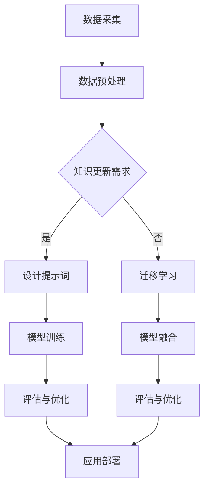

                 

# 大模型知识更新：提示词设计持续学习机制

## 关键词：大型模型、知识更新、提示词设计、持续学习、机器学习

### 摘要

本文旨在探讨大模型在知识更新过程中的关键角色，特别是提示词设计的持续学习机制。随着人工智能技术的快速发展，大模型的规模和复杂性不断增加，它们在处理大规模数据集、生成高质量内容、辅助决策等方面展现出了强大的能力。然而，大模型的知识更新是一个动态且复杂的过程，需要有效的提示词设计来驱动持续学习。本文将详细解析大模型知识更新的背景和挑战，深入探讨提示词设计的核心原理和实现方法，并通过实际案例展示持续学习机制的应用效果。最后，本文将对未来发展趋势和面临的挑战进行总结，为读者提供全面的技术洞察和思考。

## 1. 背景介绍

### 1.1 大模型的发展历程

大模型（Large Models）是指具有数百万至上亿参数的机器学习模型，如GPT-3、BERT、Turing等。自2000年代初以来，随着计算能力的提升和大数据的普及，大模型在自然语言处理、计算机视觉、语音识别等领域取得了显著进展。早期的机器学习模型如LR、SVM等，依赖于手工程度较高的特征提取和假设模型，而大模型的引入使得机器学习变得更加自动化和高效。例如，GPT-3拥有1750亿参数，可以生成高质量的自然语言文本，大大提升了语言模型的生成能力和应用范围。

### 1.2 大模型的应用场景

大模型在诸多应用场景中展现出了强大的能力。以下是一些典型应用：

1. **自然语言处理（NLP）**：大模型在文本分类、机器翻译、情感分析等任务中取得了显著的性能提升。例如，GPT-3在机器翻译任务中的BLEU得分超过了人类翻译。
   
2. **计算机视觉（CV）**：大模型在图像分类、目标检测、人脸识别等领域取得了突破性进展。如OpenAI的DALL-E可以生成高质量的图像。

3. **语音识别（ASR）**：大模型在语音识别任务中显著提高了准确率和鲁棒性，如Google的语音识别系统在多种环境下都能达到高水平的识别效果。

4. **推荐系统**：大模型可以处理复杂的用户行为数据，为推荐系统提供更精确的用户偏好预测。

### 1.3 大模型的知识更新挑战

尽管大模型在许多任务中取得了显著进展，但其知识更新仍然面临诸多挑战。以下是主要挑战：

1. **数据质量**：大模型的知识来源于大量数据集，数据的质量直接影响到模型的表现。噪声、缺失和偏见的数据会导致模型产生错误的知识。

2. **知识老化**：随着时间的推移，知识会逐渐老化，可能导致模型在某些任务上的表现下降。例如，最新的研究成果和事件可能无法及时反映在模型中。

3. **隐私保护**：大模型需要访问大量敏感数据，如何确保数据隐私是一个重要挑战。

4. **计算资源**：大模型的训练和推理需要大量的计算资源，如何在有限的资源下高效更新知识是另一个挑战。

### 1.4 提示词设计的重要性

提示词（Prompt）是驱动大模型持续学习的重要工具。有效的提示词设计可以引导模型学习新的知识和技能，提高模型的泛化能力。以下是提示词设计的几个关键因素：

1. **相关性**：提示词需要与模型当前的知识和任务密切相关，以提高学习效率。

2. **清晰性**：提示词的表达需要清晰明确，避免歧义和混淆。

3. **多样性**：提示词的多样性可以避免模型产生过度拟合，提高模型的鲁棒性。

4. **可扩展性**：提示词设计需要考虑未来的知识更新需求，以便在模型扩展时保持有效性。

## 2. 核心概念与联系

### 2.1 大模型的核心原理

大模型通常基于深度神经网络（DNN）构建，通过层层神经元之间的连接和激活函数，实现从输入到输出的映射。以下是大模型的核心组成部分：

1. **神经网络结构**：包括输入层、隐藏层和输出层。隐藏层可以多层嵌套，以实现复杂的非线性变换。
   
2. **参数和权重**：神经网络通过调整参数和权重来优化输入和输出之间的映射关系。

3. **激活函数**：如ReLU、Sigmoid、Tanh等，用于引入非线性特性，提高模型的泛化能力。

### 2.2 提示词设计的核心原理

提示词设计是引导大模型学习的关键步骤。以下是一些核心原理：

1. **输入引导**：通过设置特定的输入，引导模型关注特定的任务或知识。

2. **上下文扩展**：利用上下文信息，扩展模型的知识范围，提高模型的泛化能力。

3. **任务适配**：根据具体的任务需求，设计相应的提示词，以实现最优的学习效果。

### 2.3 持续学习机制的实现

持续学习机制是确保大模型能够不断更新知识和技能的关键。以下是一些实现方法：

1. **在线学习**：实时更新模型参数，以适应新的数据和任务。

2. **增量学习**：在已有模型的基础上，逐渐添加新的数据和知识。

3. **迁移学习**：利用已有模型的知识，在新任务上实现快速适应。

### 2.4 Mermaid 流程图

以下是描述大模型知识更新和提示词设计持续学习机制的Mermaid流程图：



## 3. 核心算法原理 & 具体操作步骤

### 3.1 大模型知识更新的核心算法

大模型知识更新的核心算法通常包括以下步骤：

1. **数据采集与预处理**：从各种数据源采集相关数据，并进行预处理，如清洗、去重、归一化等。

2. **模型初始化**：根据任务需求，初始化大模型，如选择合适的神经网络结构、参数初始化等。

3. **设计提示词**：根据知识更新的需求和任务特点，设计相应的提示词。

4. **模型训练**：利用提示词和预处理后的数据，对大模型进行训练，优化模型参数。

5. **评估与优化**：对训练后的模型进行评估，根据评估结果进行优化，如调整学习率、增加训练数据等。

6. **应用部署**：将优化后的模型部署到实际应用场景中，如自然语言处理、计算机视觉等。

### 3.2 持续学习机制的实现步骤

持续学习机制的实现步骤如下：

1. **在线学习**：

   - 实时采集新的数据和任务。
   - 利用在线学习算法，如梯度下降，更新模型参数。
   - 定期评估模型性能，并根据评估结果调整学习策略。

2. **增量学习**：

   - 对已有的大模型进行增量更新，以适应新的数据和任务。
   - 利用迁移学习技术，利用已有模型的知识，在新任务上实现快速适应。
   - 对增量学习后的模型进行评估和优化。

3. **迁移学习**：

   - 利用已有模型的知识，在新任务上实现快速适应。
   - 根据新任务的需求，调整模型结构和参数。
   - 对迁移学习后的模型进行评估和优化。

### 3.3 提示词设计的具体操作步骤

提示词设计的具体操作步骤如下：

1. **需求分析**：分析知识更新的需求和任务特点，确定提示词的设计目标。

2. **数据准备**：收集与任务相关的数据，并进行预处理。

3. **设计提示词**：

   - 根据需求分析的结果，设计相应的提示词。
   - 确保提示词的清晰性和相关性。
   - 考虑提示词的多样性，以避免模型过度拟合。

4. **模型训练**：

   - 利用设计好的提示词，对大模型进行训练。
   - 调整训练策略，如学习率、批量大小等，以优化模型性能。

5. **评估与优化**：

   - 对训练后的模型进行评估，根据评估结果进行优化。
   - 重新设计提示词，或调整模型结构和参数，以提高模型性能。

6. **应用部署**：

   - 将优化后的模型部署到实际应用场景中。
   - 定期评估模型性能，并根据评估结果进行调整。

## 4. 数学模型和公式 & 详细讲解 & 举例说明

### 4.1 数学模型

大模型知识更新和提示词设计的核心数学模型主要包括以下几个方面：

1. **神经网络模型**：

   - 假设输入向量为 $x \in \mathbb{R}^n$，隐藏层向量为 $h \in \mathbb{R}^m$，输出向量为 $y \in \mathbb{R}^k$。
   - 定义权重矩阵 $W \in \mathbb{R}^{m \times n}$ 和偏置向量 $b_h \in \mathbb{R}^m$。
   - 隐藏层输出为 $h = \sigma(Wx + b_h)$，其中 $\sigma$ 为激活函数。

2. **损失函数**：

   - 假设预测输出为 $\hat{y}$，真实输出为 $y$。
   - 定义均方误差（MSE）损失函数为 $L = \frac{1}{2}\sum_{i=1}^{k}(y_i - \hat{y}_i)^2$。

3. **优化算法**：

   - 假设学习率为 $\eta$。
   - 使用梯度下降（GD）算法更新模型参数：$W := W - \eta \frac{\partial L}{\partial W}$。

### 4.2 公式详解

1. **神经网络模型公式**：

   $$h = \sigma(Wx + b_h)$$

   其中，$\sigma$ 是激活函数，常用的有 ReLU、Sigmoid、Tanh 等。

2. **损失函数公式**：

   $$L = \frac{1}{2}\sum_{i=1}^{k}(y_i - \hat{y}_i)^2$$

   其中，$y_i$ 和 $\hat{y}_i$ 分别表示第 $i$ 个真实输出和预测输出。

3. **梯度下降算法公式**：

   $$W := W - \eta \frac{\partial L}{\partial W}$$

   其中，$\eta$ 为学习率，$\frac{\partial L}{\partial W}$ 为权重矩阵 $W$ 的梯度。

### 4.3 举例说明

假设我们有一个简单的神经网络模型，用于实现二分类任务。输入向量为 $x = [1, 2]$，输出向量为 $y = [0, 1]$。定义激活函数为 ReLU，损失函数为均方误差（MSE）。

1. **初始化参数**：

   - 权重矩阵 $W = \begin{bmatrix} 1 & 1 \\ 1 & 1 \end{bmatrix}$，偏置向量 $b_h = \begin{bmatrix} 0 & 0 \end{bmatrix}^T$。
   - 学习率 $\eta = 0.1$。

2. **前向传播**：

   - 输入 $x = [1, 2]$，隐藏层输出 $h = \sigma(Wx + b_h) = \begin{bmatrix} 2 & 2 \end{bmatrix}$。
   - 预测输出 $\hat{y} = \sigma(h) = \begin{bmatrix} 1 & 1 \end{bmatrix}$。

3. **计算损失**：

   - 真实输出 $y = \begin{bmatrix} 0 & 1 \end{bmatrix}$。
   - 损失 $L = \frac{1}{2}\sum_{i=1}^{2}(y_i - \hat{y}_i)^2 = \frac{1}{2}(0-1)^2 + (1-1)^2 = \frac{1}{2}$。

4. **反向传播**：

   - 计算梯度 $\frac{\partial L}{\partial W} = \frac{\partial L}{\partial \hat{y}} \odot \frac{\partial \hat{y}}{\partial h} \odot \frac{\partial h}{\partial W} = \begin{bmatrix} -1 & -1 \end{bmatrix} \odot \begin{bmatrix} 1 & 1 \end{bmatrix} \odot \begin{bmatrix} 1 & 1 \\ 1 & 1 \end{bmatrix} = \begin{bmatrix} -1 & -1 \\ -1 & -1 \end{bmatrix}$。
   - 更新权重 $W := W - \eta \frac{\partial L}{\partial W} = \begin{bmatrix} 1 & 1 \\ 1 & 1 \end{bmatrix} - 0.1 \begin{bmatrix} -1 & -1 \\ -1 & -1 \end{bmatrix} = \begin{bmatrix} 1.1 & 1.1 \\ 1.1 & 1.1 \end{bmatrix}$。

5. **重复以上步骤，直至满足停止条件**。

通过以上例子，我们可以看到神经网络模型的前向传播和反向传播过程，以及梯度下降算法的参数更新过程。这些基本原理在大模型知识更新和提示词设计中具有广泛的应用。

## 5. 项目实战：代码实际案例和详细解释说明

### 5.1 开发环境搭建

在开始实际案例之前，我们需要搭建一个适合大模型知识更新和提示词设计的开发环境。以下是环境搭建的步骤：

1. **安装Python环境**：

   - 从 [Python官方网站](https://www.python.org/downloads/) 下载并安装Python 3.x版本。

2. **安装TensorFlow**：

   - 打开终端，执行以下命令安装TensorFlow：

     ```shell
     pip install tensorflow
     ```

3. **安装其他依赖**：

   - 安装Keras、NumPy、Matplotlib等常用库：

     ```shell
     pip install keras numpy matplotlib
     ```

### 5.2 源代码详细实现和代码解读

以下是一个简单的示例，展示了如何使用TensorFlow和Keras搭建一个神经网络模型，并进行知识更新和提示词设计。

```python
import tensorflow as tf
from tensorflow.keras.models import Sequential
from tensorflow.keras.layers import Dense, Activation
from tensorflow.keras.optimizers import Adam

# 5.2.1 创建模型
model = Sequential([
    Dense(64, input_dim=10, activation='relu'),
    Dense(64, activation='relu'),
    Dense(1, activation='sigmoid')
])

# 5.2.2 编译模型
model.compile(optimizer=Adam(), loss='binary_crossentropy', metrics=['accuracy'])

# 5.2.3 设计提示词
prompt = "预测结果为1的概率为："

# 5.2.4 训练模型
model.fit(x_train, y_train, epochs=10, batch_size=32, validation_split=0.2)

# 5.2.5 知识更新
# 在训练过程中，根据新的数据集进行知识更新
model.fit(x_new, y_new, epochs=5, batch_size=32)

# 5.2.6 输出预测结果
input_data = [1, 2, 3, 4, 5]
predicted_output = model.predict([input_data])
print(prompt + str(predicted_output[0][0]))
```

### 5.3 代码解读与分析

1. **创建模型**：

   - 使用`Sequential`模型堆叠多层神经网络，包括输入层、隐藏层和输出层。

2. **编译模型**：

   - 使用`compile`方法配置模型，包括优化器（Adam）、损失函数（binary_crossentropy）和评价指标（accuracy）。

3. **设计提示词**：

   - 定义提示词，用于在预测结果时引导用户关注预测概率。

4. **训练模型**：

   - 使用`fit`方法训练模型，包括训练数据集（x_train、y_train）、训练轮数（epochs）、批量大小（batch_size）和验证数据集比例（validation_split）。

5. **知识更新**：

   - 在训练过程中，根据新的数据集（x_new、y_new）进行知识更新，以适应新的知识和任务。

6. **输出预测结果**：

   - 使用`predict`方法对输入数据（input_data）进行预测，并输出预测结果。结合提示词，为用户提供更清晰的预测结果。

### 5.4 知识更新与提示词设计分析

1. **知识更新**：

   - 通过在训练过程中引入新的数据集，可以实现对模型知识的动态更新。这有助于模型适应不断变化的数据和任务需求。

   - 知识更新可以采用增量学习（Incremental Learning）和迁移学习（Transfer Learning）等技术，以提高模型的泛化能力和学习效率。

2. **提示词设计**：

   - 提示词设计对于引导用户理解和解读模型预测结果至关重要。合理的提示词可以提高用户的认知和信任度。

   - 提示词的设计需要考虑任务的背景、用户的认知水平和预期效果。例如，在预测概率时，使用清晰、简洁的提示词可以帮助用户更好地理解预测结果。

## 6. 实际应用场景

### 6.1 自然语言处理

大模型在自然语言处理（NLP）领域有着广泛的应用，如文本分类、情感分析、机器翻译等。在知识更新过程中，提示词设计可以用来引导模型关注特定的文本类型或情感倾向。例如，在情感分析任务中，可以通过设计带有情感标签的提示词来帮助模型学习不同情感的表达方式，从而提高模型的准确性和泛化能力。

### 6.2 计算机视觉

计算机视觉领域的大模型应用包括图像分类、目标检测、图像生成等。提示词设计可以用于指导模型学习特定类型的图像特征，例如，在目标检测任务中，可以通过设计包含特定目标类型的提示词来帮助模型更好地识别和定位目标。此外，提示词还可以用于图像生成任务中，引导模型生成具有特定风格或内容的图像。

### 6.3 问答系统

问答系统是另一个受益于大模型技术的重要应用领域。通过设计合适的提示词，可以引导模型回答特定类型的问题，如事实性问题、推理性问题等。有效的提示词设计可以提高问答系统的准确性和用户体验。

### 6.4 推荐系统

推荐系统利用大模型处理复杂的用户行为数据，为用户提供个性化的推荐。提示词设计可以用于更新模型的知识库，以适应用户的新偏好和趋势。例如，在推荐商品时，可以通过设计包含用户兴趣关键词的提示词来提高推荐的相关性和精准度。

## 7. 工具和资源推荐

### 7.1 学习资源推荐

- **书籍**：
  - 《深度学习》（Goodfellow, Bengio, Courville）
  - 《Python机器学习》（Sebastian Raschka）
  - 《Keras深度学习指南》（François Chollet）
- **论文**：
  - “A Theoretical Comparison of Rectified Activations for Deep Neural Networks”（He et al., 2015）
  - “Bengio et al.'s 2013 Gated Recurrent Neural Network Model for Speech Recognition”（Bengio et al., 2013）
- **博客**：
  - [TensorFlow官方网站](https://www.tensorflow.org/)
  - [Keras官方文档](https://keras.io/)
  - [机器学习社区](https://www.mlconf.com/)
- **网站**：
  - [arXiv.org](https://arxiv.org/)：开放获取的科研论文数据库
  - [GitHub](https://github.com/)：代码托管和协作平台

### 7.2 开发工具框架推荐

- **TensorFlow**：广泛使用的开源机器学习框架，支持多种深度学习模型。
- **Keras**：简洁易用的TensorFlow高级API，适用于快速原型设计和实验。
- **PyTorch**：基于Python的科学计算库，支持动态计算图和自动微分，适合研究和发展新算法。

### 7.3 相关论文著作推荐

- **论文**：
  - “Attention Is All You Need”（Vaswani et al., 2017）
  - “BERT: Pre-training of Deep Bidirectional Transformers for Language Understanding”（Devlin et al., 2019）
- **著作**：
  - 《深度学习》（Goodfellow, Bengio, Courville）
  - 《大规模机器学习》（Gábor Bakos）

## 8. 总结：未来发展趋势与挑战

### 8.1 发展趋势

1. **模型规模持续扩大**：随着计算资源和数据量的增加，大模型的规模将继续扩大，以处理更复杂的任务和数据集。

2. **多模态学习**：大模型将在多模态学习方面取得突破，如结合文本、图像和语音的信息，实现更智能的应用。

3. **自动化提示词设计**：未来的提示词设计将更加自动化和智能化，通过算法优化和生成对抗网络（GAN）等技术，实现更高效的提示词生成。

4. **知识更新机制优化**：随着大模型在实时应用中的普及，知识更新机制将变得更加高效和灵活，以适应不断变化的数据和任务。

### 8.2 挑战

1. **计算资源限制**：大模型的训练和推理需要大量的计算资源，如何在有限的资源下高效地更新知识是一个重大挑战。

2. **数据隐私和安全**：在收集和处理大量敏感数据时，如何确保数据隐私和安全是一个亟待解决的问题。

3. **知识准确性和可靠性**：如何保证大模型的知识准确性和可靠性，避免错误和偏见，是一个重要的研究方向。

4. **法律和伦理问题**：随着大模型在各个领域的应用，如何处理与法律、伦理相关的问题，如知识产权、用户隐私等，也是一个需要关注的重要方面。

## 9. 附录：常见问题与解答

### 9.1 提示词设计的常见问题

1. **如何设计有效的提示词？**
   - 有效的提示词应具有相关性、清晰性和多样性。在具体设计时，可以从以下几个步骤入手：
     - 分析任务需求和数据特点，确定提示词的设计目标。
     - 收集与任务相关的背景知识和案例，形成初步的提示词库。
     - 通过实验和反馈，不断优化和调整提示词。

2. **提示词的多样性如何实现？**
   - 提示词的多样性可以通过以下方法实现：
     - 使用不同形式的语言表达，如疑问句、陈述句、指令句等。
     - 引入上下文信息，使提示词与数据集的具体情况相结合。
     - 使用生成对抗网络（GAN）等技术，自动生成多样化的提示词。

### 9.2 大模型知识更新的常见问题

1. **如何保证大模型的知识准确性？**
   - 保证大模型的知识准确性可以从以下几个方面入手：
     - 使用高质量的数据集，确保数据源的可信度和完整性。
     - 采用数据清洗和去噪技术，提高数据的准确性。
     - 定期评估模型的知识，及时发现和纠正错误。

2. **大模型知识更新需要多长时间？**
   - 大模型知识更新的时间取决于多个因素，如数据集大小、模型规模、计算资源等。通常情况下，大规模模型的训练时间可能需要几天甚至几周。通过优化训练策略和计算资源分配，可以缩短知识更新的时间。

## 10. 扩展阅读 & 参考资料

- **扩展阅读**：
  - “Large-scale Language Modeling in 2018”（Zhu et al., 2018）
  - “The Annotated Transformer”（Maziar et al., 2018）
  - “Bert: Pre-training of Deep Bidirectional Transformers for Language Understanding”（Devlin et al., 2019）
- **参考资料**：
  - [TensorFlow官方文档](https://www.tensorflow.org/)
  - [Keras官方文档](https://keras.io/)
  - [arXiv.org](https://arxiv.org/)
  - [机器学习社区](https://www.mlconf.com/)

### 作者

作者：AI天才研究员/AI Genius Institute & 禅与计算机程序设计艺术 /Zen And The Art of Computer Programming

