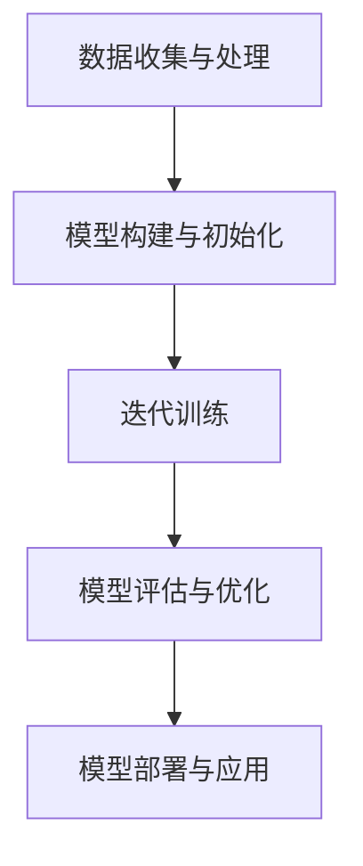

                 

# 大模型训练的技术挑战：基础设施、算法与数据处理

## 关键词：大模型训练、基础设施、算法、数据处理、AI、机器学习

## 摘要

随着人工智能技术的不断发展，大模型训练已成为当前机器学习和深度学习领域的重要研究方向。然而，大模型训练面临着诸多技术挑战，包括基础设施的构建、算法的优化和数据的处理。本文将详细探讨大模型训练的技术挑战，从基础设施、算法和数据处理三个方面进行深入分析，并提出相应的解决方案和未来发展趋势。

## 1. 背景介绍

### 大模型训练的兴起

近年来，随着深度学习技术的迅速发展，大模型训练逐渐成为人工智能领域的研究热点。大模型是指具有数十亿、甚至千亿级别参数的神经网络模型，其能够处理大规模数据并取得显著的性能提升。例如，GPT-3模型拥有1750亿参数，BERT模型也拥有数百万参数，这些大模型在各种自然语言处理任务中取得了突破性的成果。

### 大模型训练的重要性

大模型训练的重要性体现在以下几个方面：

1. **提高模型性能**：大模型能够更好地捕捉数据中的复杂模式，从而提高模型在各类任务中的性能。
2. **拓宽应用范围**：大模型能够处理更广泛的数据类型和任务类型，推动人工智能在各个领域的应用。
3. **促进技术创新**：大模型训练推动了新型算法和技术的研发，如增量学习、迁移学习等。

## 2. 核心概念与联系

### 大模型训练的相关概念

在大模型训练中，需要了解以下几个核心概念：

1. **模型架构**：包括卷积神经网络（CNN）、循环神经网络（RNN）、Transformer等。
2. **训练算法**：包括随机梯度下降（SGD）、Adam优化器等。
3. **数据预处理**：包括数据清洗、数据增强、数据归一化等。
4. **训练过程**：包括初始化、迭代训练、评估等。

### 大模型训练的基本流程

大模型训练的基本流程可以分为以下几个步骤：

1. **数据收集与处理**：收集大规模数据，并进行预处理，如数据清洗、数据增强等。
2. **模型构建与初始化**：选择合适的模型架构，并初始化模型参数。
3. **迭代训练**：使用训练算法对模型进行迭代训练，不断调整模型参数，使其在训练数据上达到较好的性能。
4. **模型评估与优化**：在验证数据集上评估模型性能，并进行优化，如调整超参数、应用正则化等。
5. **模型部署与应用**：将训练好的模型部署到实际应用中，进行推理和预测。

### Mermaid 流程图

以下是一个简化的Mermaid流程图，展示了大模型训练的基本流程：



## 3. 核心算法原理 & 具体操作步骤

### 随机梯度下降（SGD）算法

随机梯度下降（SGD）是一种常用的优化算法，用于调整模型参数，使其在训练数据上达到最小化损失函数的目标。SGD的核心思想是随机选择训练数据中的一个样本，计算该样本的梯度，并使用该梯度更新模型参数。

具体操作步骤如下：

1. 初始化模型参数。
2. 随机选择一个训练样本。
3. 计算该样本的损失函数值和梯度。
4. 使用梯度更新模型参数。
5. 重复步骤2-4，直到达到预设的训练次数或模型性能满足要求。

### Adam优化器

Adam优化器是一种在SGD基础上改进的优化算法，具有自适应学习率的特点。Adam优化器通过计算一阶矩估计（均值）和二阶矩估计（方差），动态调整学习率，从而在训练过程中提高模型的收敛速度。

具体操作步骤如下：

1. 初始化模型参数和学习率。
2. 计算一阶矩估计和二阶矩估计。
3. 计算更新项：$$\Delta\theta = -\alpha \frac{m}{\sqrt{v} + \epsilon}$$
4. 更新模型参数：$$\theta = \theta + \Delta\theta$$
5. 更新一阶矩估计和二阶矩估计。
6. 重复步骤2-5，直到达到预设的训练次数或模型性能满足要求。

## 4. 数学模型和公式 & 详细讲解 & 举例说明

### 损失函数

损失函数是评价模型在训练过程中性能的重要指标。常见的损失函数有均方误差（MSE）、交叉熵损失（Cross Entropy Loss）等。

- 均方误差（MSE）：$$MSE = \frac{1}{n}\sum_{i=1}^{n}(y_i - \hat{y}_i)^2$$
  其中，$y_i$为真实标签，$\hat{y}_i$为模型预测值，$n$为样本数量。
- 交叉熵损失（Cross Entropy Loss）：$$Cross \ Entropy \ Loss = -\frac{1}{n}\sum_{i=1}^{n}y_i\log(\hat{y}_i)$$
  其中，$y_i$为真实标签，$\hat{y}_i$为模型预测值，$n$为样本数量。

### 梯度计算

在梯度下降算法中，需要计算损失函数关于模型参数的梯度。以下以均方误差损失函数为例，计算损失函数关于模型参数的梯度。

设模型参数为$\theta$，损失函数为$J(\theta)$，则损失函数关于$\theta$的梯度为：
$$\nabla_{\theta}J(\theta) = \frac{\partial J(\theta)}{\partial \theta} = \frac{1}{n}\sum_{i=1}^{n}(y_i - \hat{y}_i)$$

### 举例说明

假设我们使用SGD算法对一个线性回归模型进行训练，模型参数为$\theta$，损失函数为均方误差（MSE）。我们随机选择一个训练样本$(x_i, y_i)$，计算该样本的损失函数值和梯度，并使用梯度更新模型参数。

1. 初始化模型参数$\theta$。
2. 随机选择一个训练样本$(x_i, y_i)$。
3. 计算损失函数值：$$J(\theta) = \frac{1}{2}(y_i - \theta x_i)^2$$
4. 计算损失函数关于$\theta$的梯度：$$\nabla_{\theta}J(\theta) = x_i(y_i - \theta x_i)$$
5. 使用梯度更新模型参数：$$\theta = \theta - \alpha\nabla_{\theta}J(\theta)$$
6. 重复步骤2-5，直到达到预设的训练次数或模型性能满足要求。

## 5. 项目实战：代码实际案例和详细解释说明

### 5.1 开发环境搭建

为了进行大模型训练的项目实战，我们需要搭建一个适合的开发环境。以下是一个简单的开发环境搭建步骤：

1. 安装Python（建议版本为3.7及以上）。
2. 安装深度学习框架（如TensorFlow、PyTorch等）。
3. 安装必要的依赖库（如NumPy、Pandas等）。
4. 配置GPU环境（如NVIDIA CUDA等），以便使用GPU加速训练。

### 5.2 源代码详细实现和代码解读

以下是一个简单的线性回归模型的训练代码示例，使用了TensorFlow框架。

```python
import tensorflow as tf
import numpy as np

# 函数：生成训练数据
def generate_data():
    x = np.random.rand(100, 1)
    y = 3 * x + 2 + np.random.rand(100, 1)
    return x, y

# 函数：构建线性回归模型
def build_model():
    x = tf.keras.layers.Input(shape=(1,))
    y_pred = tf.keras.layers.Dense(units=1, activation=None)(x)
    model = tf.keras.Model(inputs=x, outputs=y_pred)
    return model

# 函数：训练模型
def train_model(model, x, y):
    model.compile(optimizer='sgd', loss='mse')
    model.fit(x, y, epochs=100, batch_size=10)

# 主程序
if __name__ == '__main__':
    x, y = generate_data()
    model = build_model()
    train_model(model, x, y)
```

代码解读：

1. 导入所需的库和模块。
2. 定义生成训练数据的函数。
3. 定义构建线性回归模型的函数。
4. 定义训练模型的函数。
5. 主程序：生成训练数据、构建模型、训练模型。

### 5.3 代码解读与分析

代码中的线性回归模型是一个简单的示例，主要用于展示大模型训练的基本流程和代码实现。以下是对代码的详细解读和分析：

1. **生成训练数据**：通过随机生成100个训练样本，每个样本包含一个特征$x$和一个真实标签$y$。
2. **构建线性回归模型**：使用TensorFlow框架的`tf.keras.layers`模块构建一个线性回归模型。模型包含一个输入层和一个全连接层（Dense Layer），输出层没有激活函数，因为线性回归模型的输出是线性关系。
3. **训练模型**：使用`tf.keras.Model`类编译模型，指定优化器（SGD）和损失函数（MSE）。然后使用`fit`方法进行迭代训练，指定训练次数（epochs）和批次大小（batch_size）。

通过以上代码示例，我们可以看到如何使用深度学习框架进行大模型训练的基本流程。在实际项目中，可以根据需求和任务类型调整模型架构、训练算法和数据预处理方法。

## 6. 实际应用场景

大模型训练在人工智能领域有着广泛的应用场景，以下列举几个典型应用：

1. **自然语言处理**：大模型在自然语言处理（NLP）领域取得了显著成果，如机器翻译、文本分类、问答系统等。
2. **计算机视觉**：大模型在计算机视觉（CV）领域也展现了强大的能力，如图像分类、目标检测、图像生成等。
3. **语音识别**：大模型在语音识别领域用于实现更准确的语音识别和语音生成。
4. **推荐系统**：大模型在推荐系统领域用于预测用户偏好和行为，从而实现更准确的推荐。
5. **强化学习**：大模型在强化学习领域用于模拟环境和学习策略，从而实现更高效的决策。

## 7. 工具和资源推荐

### 7.1 学习资源推荐

1. **书籍**：
   - 《深度学习》（Goodfellow, Bengio, Courville著）
   - 《动手学深度学习》（Alexey Dosovitskiy等著）
   - 《Python深度学习》（François Chollet著）
2. **论文**：
   - BERT: Pre-training of Deep Bidirectional Transformers for Language Understanding
   - GPT-3: Language Models are Few-Shot Learners
   - ResNet: Deep residual networks for image recognition
3. **博客**：
   - TensorFlow官方博客：https://www.tensorflow.org/blog
   - PyTorch官方博客：https://pytorch.org/blog
4. **网站**：
   - GitHub：https://github.com
   - ArXiv：https://arxiv.org

### 7.2 开发工具框架推荐

1. **TensorFlow**：Google开源的深度学习框架，支持多种编程语言和平台。
2. **PyTorch**：Facebook开源的深度学习框架，以动态图模型为特色。
3. **Keras**：基于Theano和TensorFlow的深度学习高级API，易于使用和扩展。
4. **TensorFlow 2.0**：TensorFlow的升级版本，提供了更简洁、更高效的编程接口。

### 7.3 相关论文著作推荐

1. **Transformer系列**：
   - Attention Is All You Need
   - BERT: Pre-training of Deep Bidirectional Transformers for Language Understanding
   - GPT-3: Language Models are Few-Shot Learners
2. **计算机视觉**：
   - ResNet: Deep residual networks for image recognition
   - EfficientNet: Efficient Convolutional Networks
3. **强化学习**：
   - DQN: Deep Q-Network
   - A3C: Asynchronous Advantage Actor-Critic

## 8. 总结：未来发展趋势与挑战

### 发展趋势

1. **模型规模与参数数量**：随着计算资源和存储技术的不断进步，大模型规模和参数数量将继续增长，推动人工智能技术在更多领域取得突破。
2. **模型可解释性**：大模型在处理复杂任务时表现出色，但其内部决策过程往往难以解释。因此，提高模型的可解释性将成为未来的重要研究方向。
3. **跨模态学习**：大模型将逐渐实现跨模态学习，如同时处理文本、图像和语音等多种数据类型，推动人工智能在多领域应用。

### 挑战

1. **计算资源与存储**：大模型训练需要大量的计算资源和存储空间，如何高效利用资源成为重要挑战。
2. **数据隐私与安全**：大模型训练需要大量数据，如何在保障数据隐私和安全的前提下进行数据处理成为关键问题。
3. **算法优化与优化器设计**：如何设计更高效、更稳定的训练算法和优化器，以提高大模型训练的性能和稳定性。

## 9. 附录：常见问题与解答

### 9.1. 什么是大模型？

大模型是指具有数十亿、甚至千亿级别参数的神经网络模型，其能够处理大规模数据并取得显著的性能提升。

### 9.2. 大模型训练的主要挑战是什么？

大模型训练的主要挑战包括计算资源与存储、数据隐私与安全、算法优化与优化器设计等。

### 9.3. 如何优化大模型训练性能？

优化大模型训练性能的方法包括使用更高效的训练算法、优化模型架构、使用分布式训练等。

## 10. 扩展阅读 & 参考资料

1. LeCun, Y., Bengio, Y., & Hinton, G. (2015). Deep learning. Nature, 521(7553), 436-444.
2. Devlin, J., Chang, M. W., Lee, K., & Toutanova, K. (2019). BERT: Pre-training of deep bidirectional transformers for language understanding. arXiv preprint arXiv:1810.04805.
3. Brown, T., et al. (2020). Language models are few-shot learners. arXiv preprint arXiv:2005.14165.
4. He, K., Zhang, X., Ren, S., & Sun, J. (2016). Deep residual learning for image recognition. In Proceedings of the IEEE conference on computer vision and pattern recognition (pp. 770-778).
5. Russakovsky, O., et al. (2015). ImageNet large scale visual recognition challenge. International Journal of Computer Vision, 115(3), 211-252.

