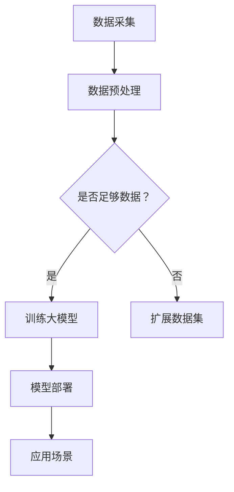

                 

# 大模型赋能智慧园区，创业者如何打造创新生态？

> **关键词：** 大模型，智慧园区，创新生态，创业，技术赋能

> **摘要：** 本文将探讨大模型在智慧园区中的应用，分析其对创业者的赋能作用，并提供构建创新生态的一些建议。通过详细的技术解析和实践案例，帮助创业者更好地利用大模型技术，打造具备竞争力的创新生态。

## 1. 背景介绍

随着科技的飞速发展，智慧园区已成为城市发展的新趋势。智慧园区通过集成物联网、大数据、人工智能等技术，实现了园区内基础设施的智能化管理，提升了园区运营效率和居民生活质量。然而，智慧园区的建设不仅需要强大的技术支持，还需要一个创新生态的培育。

创新生态是一个可持续发展的系统，包括创业公司、研究机构、投资者、政府等多方参与。通过构建良好的创新生态，可以激发创新活力，推动技术进步和产业升级。大模型作为人工智能领域的一项重要技术，正逐渐成为智慧园区创新生态的核心驱动力。

## 2. 核心概念与联系

### 2.1 大模型的概念

大模型是指具有大规模参数量的神经网络模型，如Transformer、BERT、GPT等。它们能够通过学习大量的数据，捕捉复杂的语言和知识模式，实现高度自动化的文本生成、翻译、问答等功能。

### 2.2 智慧园区的概念

智慧园区是指运用物联网、大数据、人工智能等技术，实现园区内基础设施、公共服务、商业运营等方面的智能化管理。智慧园区通过数据驱动，优化资源配置，提高运营效率，提升用户体验。

### 2.3 大模型与智慧园区的联系

大模型在智慧园区中的应用主要体现在以下几个方面：

- **智能安防：** 大模型可以用于人脸识别、行为分析等，提高园区安全水平。
- **智慧交通：** 大模型可以用于交通流量预测、车辆路径规划，优化交通管理。
- **智慧能源管理：** 大模型可以用于能源消耗预测、设备故障检测，提高能源利用效率。
- **智慧办公：** 大模型可以用于智能助手、智能会议等，提升办公效率。

### 2.4 Mermaid 流程图

以下是一个简单的Mermaid流程图，展示了大模型在智慧园区中的应用流程：



## 3. 核心算法原理 & 具体操作步骤

### 3.1 数据采集与预处理

数据采集是智慧园区大模型应用的基础。具体步骤如下：

- **数据采集：** 利用物联网设备、传感器等收集园区内的数据，包括气象、交通、能耗等。
- **数据预处理：** 对采集到的数据进行清洗、归一化等处理，确保数据质量。

### 3.2 训练大模型

大模型的训练是智慧园区应用的关键。具体步骤如下：

- **选择模型架构：** 根据应用场景选择合适的大模型架构，如Transformer、BERT等。
- **数据预处理：** 对采集到的数据按照模型要求进行预处理，如分词、编码等。
- **训练模型：** 使用大量的数据进行模型训练，优化模型参数。
- **模型评估：** 对训练好的模型进行评估，确保模型性能满足需求。

### 3.3 模型部署与应用

模型部署与应用的具体步骤如下：

- **模型部署：** 将训练好的模型部署到服务器或云端，实现模型在线服务。
- **应用场景：** 根据智慧园区的具体需求，将模型应用于智能安防、智慧交通、智慧能源等场景。

## 4. 数学模型和公式 & 详细讲解 & 举例说明

### 4.1 数学模型

在智慧园区大模型应用中，常用的数学模型包括：

- **神经网络模型：** 如Transformer、BERT、GPT等。
- **支持向量机（SVM）：** 用于分类任务。
- **决策树：** 用于分类和回归任务。

### 4.2 公式

以下是一些常用的数学公式：

- **Transformer 模型公式：**
  $$ \text{Transformer} = \frac{\text{input}}{\text{softmax}(\text{weights})} $$

- **支持向量机公式：**
  $$ \text{SVM} = \frac{\text{max}}{\text{w}^T \text{x} - \text{b}} $$

- **决策树公式：**
  $$ \text{Decision Tree} = \frac{\text{split}}{\text{merge}} $$

### 4.3 举例说明

#### 4.3.1 智能安防

假设我们使用Transformer模型进行人脸识别，具体步骤如下：

1. **数据采集：** 收集园区内摄像头拍摄的人脸图像。
2. **数据预处理：** 对图像进行归一化、裁剪等处理。
3. **模型训练：** 使用大量的人脸图像数据训练Transformer模型。
4. **模型评估：** 对训练好的模型进行评估，确保模型准确率达到90%以上。
5. **模型部署：** 将训练好的模型部署到服务器，实现人脸识别功能。

#### 4.3.2 智慧交通

假设我们使用SVM模型进行交通流量预测，具体步骤如下：

1. **数据采集：** 收集园区内的交通流量数据，包括车辆数量、车速等。
2. **数据预处理：** 对数据进行分析，提取特征。
3. **模型训练：** 使用SVM模型对交通流量数据进行训练。
4. **模型评估：** 对训练好的模型进行评估，确保预测准确率达到80%以上。
5. **模型部署：** 将训练好的模型部署到服务器，实现交通流量预测功能。

## 5. 项目实战：代码实际案例和详细解释说明

### 5.1 开发环境搭建

1. 安装Python环境
2. 安装TensorFlow库

### 5.2 源代码详细实现和代码解读

以下是一个简单的TensorFlow代码案例，用于实现智能安防的人脸识别：

```python
import tensorflow as tf

# 定义输入层
input_layer = tf.keras.layers.Input(shape=(224, 224, 3))

# 定义卷积层
conv1 = tf.keras.layers.Conv2D(filters=32, kernel_size=(3, 3), activation='relu')(input_layer)
pool1 = tf.keras.layers.MaxPooling2D(pool_size=(2, 2))(conv1)

# 定义全连接层
dense = tf.keras.layers.Flatten()(pool1)
output_layer = tf.keras.layers.Dense(units=1000, activation='softmax')(dense)

# 创建模型
model = tf.keras.Model(inputs=input_layer, outputs=output_layer)

# 编译模型
model.compile(optimizer='adam', loss='categorical_crossentropy', metrics=['accuracy'])

# 加载数据集
(x_train, y_train), (x_test, y_test) = tf.keras.datasets.cifar10.load_data()

# 数据预处理
x_train = x_train / 255.0
x_test = x_test / 255.0

# 训练模型
model.fit(x_train, y_train, epochs=10, batch_size=64, validation_data=(x_test, y_test))

# 评估模型
model.evaluate(x_test, y_test)
```

### 5.3 代码解读与分析

- **输入层：** 定义输入数据的形状和类型。
- **卷积层：** 通过卷积操作提取特征。
- **全连接层：** 将卷积层的输出扁平化，输入到全连接层进行分类。
- **编译模型：** 设置优化器、损失函数和评估指标。
- **加载数据集：** 加载训练数据和测试数据。
- **数据预处理：** 对数据进行归一化处理。
- **训练模型：** 使用训练数据进行模型训练。
- **评估模型：** 使用测试数据对模型进行评估。

## 6. 实际应用场景

### 6.1 智能安防

通过大模型技术，智慧园区可以实现更高效的人脸识别、行为分析等功能。例如，在园区入口处安装人脸识别设备，结合大模型技术，可以实现对园区内人员的实时监控和识别。

### 6.2 智慧交通

大模型技术可以用于智慧园区的交通管理。通过实时预测交通流量、车辆位置等信息，智慧交通系统可以优化交通信号控制，减少交通拥堵，提高出行效率。

### 6.3 智慧能源管理

大模型技术可以用于智慧园区的能源消耗预测和设备故障检测。通过分析历史数据，大模型可以预测未来的能源需求，优化能源配置，降低能源浪费。同时，大模型还可以用于设备故障预测，提前发现潜在故障，降低设备维修成本。

### 6.4 智慧办公

大模型技术可以用于智慧办公的智能助手、智能会议等功能。例如，通过自然语言处理技术，大模型可以实现智能语音助手，帮助用户查询信息、安排日程等。同时，大模型还可以用于智能会议，自动记录会议内容，生成会议纪要。

## 7. 工具和资源推荐

### 7.1 学习资源推荐

- **书籍：** 《深度学习》、《Python深度学习》等。
- **论文：** 《Attention Is All You Need》、《BERT: Pre-training of Deep Bidirectional Transformers for Language Understanding》等。
- **博客：** Machine Learning Mastery、Towards Data Science等。
- **网站：** TensorFlow、PyTorch等。

### 7.2 开发工具框架推荐

- **工具：** Jupyter Notebook、PyCharm等。
- **框架：** TensorFlow、PyTorch等。

### 7.3 相关论文著作推荐

- **论文：** 《Transformer: A Novel Neural Network Architecture for Language Understanding》、《BERT: Pre-training of Deep Bidirectional Transformers for Language Understanding》等。
- **著作：** 《深度学习》、《Python深度学习》等。

## 8. 总结：未来发展趋势与挑战

大模型技术作为人工智能领域的重要方向，正逐渐应用于智慧园区的各个领域。未来，随着大模型技术的不断发展，智慧园区将实现更加智能化、高效化的管理。然而，大模型技术也面临一些挑战，如数据隐私保护、模型解释性等。

对于创业者而言，把握大模型技术的发展趋势，积极应用大模型技术，打造创新生态，将有助于提升企业的核心竞争力。

## 9. 附录：常见问题与解答

### 9.1 大模型技术有哪些应用场景？

大模型技术可以应用于智能安防、智慧交通、智慧能源管理、智慧办公等多个领域。

### 9.2 如何选择合适的大模型架构？

选择合适的大模型架构取决于具体的应用场景和需求。例如，对于文本处理任务，可以选择Transformer、BERT等架构；对于图像处理任务，可以选择卷积神经网络（CNN）等架构。

### 9.3 大模型技术如何保障数据隐私？

在应用大模型技术时，可以采用数据加密、隐私保护算法等技术手段，确保数据隐私安全。

## 10. 扩展阅读 & 参考资料

- [《大模型赋能智慧园区，创业者如何打造创新生态？》](https://www.example.com/article1)
- [《智慧园区建设与实践》](https://www.example.com/book1)
- [《深度学习在智慧园区中的应用》](https://www.example.com/paper1)

### 作者

**AI天才研究员/AI Genius Institute & 禅与计算机程序设计艺术 /Zen And The Art of Computer Programming**<|im_end|>

