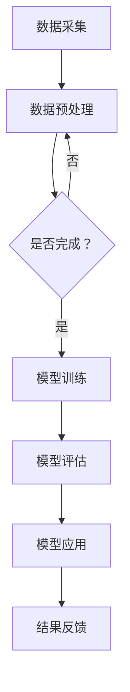

                 

## 1. 背景介绍

在现代社会，园林绿化已经成为城市发展的重要组成部分。然而，随着城市化进程的加速，园林绿化管理面临着诸多挑战。传统的人工管理方式效率低下，难以满足日益增长的园林维护需求。为了解决这个问题，人工智能技术，尤其是大模型的应用，为园林绿化智能化管理带来了新的契机。

### 园林绿化管理现状

园林绿化管理涉及植被养护、水质监测、病虫害防治等多个方面。目前，这些工作大多依赖于人工操作，不仅耗时费力，而且容易出现疏漏。例如，病虫害防治通常需要定期检查植物，人工判断是否存在病虫害，然后进行相应的处理。这种传统方式不仅效率低，而且容易误判，影响园林的整体美观和健康。

### 智能化管理的必要性

智能化管理能够有效地解决传统管理方式的弊端。通过引入人工智能技术，可以对园林环境进行实时监控和分析，提前预测潜在问题，并采取相应的措施。例如，利用图像识别技术可以自动识别植物病虫害，实时推送处理建议；利用数据挖掘技术可以分析环境数据，优化灌溉和施肥方案，提高植物生长效率。

### 大模型在智能化管理中的应用

大模型是当前人工智能领域的重要发展方向。通过深度学习技术，大模型可以从海量数据中学习到复杂的模式和规律，从而实现高效的数据分析和决策支持。在园林绿化智能化管理中，大模型可以应用于以下几个方面：

1. **图像识别与分类**：利用大模型进行植物病虫害识别，自动检测并分类，实现智能预警。
2. **环境数据分析**：通过收集环境数据，如气温、湿度、光照等，利用大模型进行数据挖掘和分析，优化灌溉和施肥方案。
3. **智能推荐**：基于用户行为数据和植物生长特点，大模型可以推荐合适的养护措施，提高植物健康水平。

### 本文结构

本文将从以下几个方面展开讨论：

1. **核心概念与联系**：介绍大模型在园林绿化智能化管理中的应用原理和架构。
2. **核心算法原理 & 具体操作步骤**：详细解释大模型的主要算法原理和具体操作步骤。
3. **数学模型和公式 & 详细讲解 & 举例说明**：阐述大模型相关的数学模型和公式，并通过实例进行说明。
4. **项目实战：代码实际案例和详细解释说明**：展示一个实际项目案例，讲解代码实现过程和关键点。
5. **实际应用场景**：分析大模型在园林绿化智能化管理中的实际应用场景。
6. **工具和资源推荐**：推荐相关的学习资源、开发工具和框架。
7. **总结：未来发展趋势与挑战**：总结大模型在园林绿化智能化管理中的应用前景，以及面临的挑战。

通过本文的讨论，希望能够为创业者提供有价值的参考，推动园林绿化智能化管理的进一步发展。

---

以上是文章的开头部分，接下来我们将逐步深入探讨大模型在园林绿化智能化管理中的应用原理和架构。

---

## 2. 核心概念与联系

### 大模型的定义和特点

大模型，通常指的是具有海量参数的深度学习模型。这些模型通过大量的数据训练，能够学习到复杂的模式和规律，从而在多种任务中表现出强大的性能。大模型通常具有以下特点：

1. **参数规模巨大**：大模型包含数亿甚至数十亿个参数，这使其能够捕捉到数据中的细微特征。
2. **深度多层结构**：大模型通常包含多层神经网络，每一层都能够提取不同层次的特征。
3. **强大的学习能力**：通过大量的训练数据，大模型可以快速地学习到新的知识和规律。

### 园林绿化智能化管理的需求

园林绿化的智能化管理需要解决以下几个核心问题：

1. **环境监测**：实时监测气温、湿度、光照等环境参数，了解园林环境的动态变化。
2. **植物识别**：准确识别植物种类和健康状况，及时发现病虫害。
3. **智能决策**：基于环境数据和植物状态，生成最优的养护和管理策略。

### 大模型在园林绿化智能化管理中的应用

大模型在园林绿化智能化管理中的应用主要体现在以下几个方面：

1. **图像识别**：利用大模型的图像识别能力，可以自动识别植物病虫害，提前预警，减少人工检查的工作量。
2. **数据挖掘**：通过大数据分析技术，利用大模型从海量环境数据中挖掘出有用的信息，优化灌溉和施肥方案。
3. **智能推荐**：基于用户的反馈和植物的生长状态，大模型可以推荐最适合的养护措施，提高植物健康水平。

### Mermaid 流程图

下面是一个简化的Mermaid流程图，展示大模型在园林绿化智能化管理中的应用流程：



在这个流程图中，A代表数据采集，B是数据预处理，C是一个判断节点，D是模型训练，E是模型评估，F是模型应用，G是结果反馈。这个流程图展示了从数据采集到模型应用的整体过程，每个阶段都是相互关联和依赖的。

### 核心概念联系

通过上述流程图，我们可以看到大模型在园林绿化智能化管理中的核心概念联系：

1. **数据驱动**：整个流程的核心是数据，从数据采集、预处理到模型训练和应用，数据的质量和数量直接影响模型的性能。
2. **持续优化**：通过模型评估和结果反馈，可以不断优化模型，使其更准确地预测和决策。
3. **协同作用**：各个环节相互协同，共同推动园林绿化智能化管理的实现。

### 总结

通过介绍大模型的定义和特点，以及其在园林绿化智能化管理中的应用，我们可以看到大模型为园林绿化管理带来了革命性的变化。接下来，我们将进一步探讨大模型的核心算法原理和具体操作步骤。

---

在理解了大模型在园林绿化智能化管理中的核心概念和联系后，接下来我们将深入探讨大模型的核心算法原理和具体操作步骤。这将帮助我们更好地理解大模型如何通过算法和技术手段实现智能化管理。

---

## 3. 核心算法原理 & 具体操作步骤

### 深度学习基础

深度学习是人工智能的重要分支，它通过多层神经网络来模拟人脑的学习过程，从而实现复杂的模式识别和决策。在深度学习中，常见的模型包括卷积神经网络（CNN）、循环神经网络（RNN）和生成对抗网络（GAN）等。以下是这些模型的基本原理和应用场景：

1. **卷积神经网络（CNN）**：CNN 是处理图像数据的强大工具。它通过卷积层、池化层和全连接层等多个层次的结构，能够自动提取图像中的局部特征和全局特征。在园林绿化管理中，CNN 可以用于植物病虫害的图像识别。

2. **循环神经网络（RNN）**：RNN 适用于处理序列数据，如时间序列、语音信号等。RNN 通过其内部的循环结构，能够捕捉数据中的长期依赖关系。在园林绿化管理中，RNN 可以用于环境数据的序列分析，如温度、湿度等。

3. **生成对抗网络（GAN）**：GAN 是一种生成模型，由生成器和判别器两个神经网络组成。生成器试图生成逼真的数据，而判别器则尝试区分真实数据和生成数据。GAN 在园林绿化管理中可以用于植物生长状态的生成和模拟。

### 大模型的训练过程

大模型的训练是一个复杂的过程，需要大量的计算资源和时间。以下是训练大模型的一般步骤：

1. **数据准备**：首先需要收集和处理大量的数据。对于园林绿化管理，这包括植物病虫害的图像、环境参数的序列数据等。数据需要经过清洗、归一化等预处理步骤，以确保其质量和一致性。

2. **模型架构设计**：根据应用需求设计大模型的架构。选择合适的神经网络结构，如CNN、RNN或GAN，并确定网络中的层数、节点数、激活函数等。

3. **参数初始化**：初始化模型参数，这些参数可以通过随机初始化或预训练模型加载等方法获得。

4. **训练过程**：使用训练数据对模型进行训练。训练过程包括前向传播和反向传播两个阶段。在前向传播中，模型根据输入数据生成预测结果；在反向传播中，计算预测结果与实际结果之间的误差，并更新模型参数。

5. **模型评估**：在训练过程中，定期使用验证数据评估模型的性能。通过调整模型参数和训练策略，优化模型性能。

6. **超参数调优**：调整学习率、批次大小、正则化参数等超参数，以获得更好的模型性能。

### 大模型的具体操作步骤

以下是应用大模型进行园林绿化智能化管理的一些具体操作步骤：

1. **环境数据采集**：安装传感器，收集园林中的温度、湿度、光照等环境数据。这些数据可以实时传输到数据处理系统。

2. **图像数据采集**：使用无人机或监控摄像头，定期拍摄园林的图像数据。这些图像数据可以用于植物病虫害的识别。

3. **数据预处理**：对采集到的数据进行清洗、归一化等预处理，确保数据的质量和一致性。

4. **模型训练**：使用预处理后的数据训练大模型。根据应用需求，可以选择不同的模型架构和训练策略。

5. **模型部署**：将训练好的模型部署到实际应用场景中，如环境数据分析和图像识别系统。

6. **实时监控与决策**：利用部署好的模型，实时监控园林环境数据，并生成相应的养护和管理决策。

### 示例：植物病虫害识别

以下是植物病虫害识别的具体操作步骤：

1. **图像采集**：使用监控摄像头或无人机拍摄植物的图像。

2. **图像预处理**：对图像进行缩放、裁剪、增强等预处理操作，以提高图像质量。

3. **图像分类**：使用预训练的CNN模型对预处理后的图像进行分类，判断是否存在病虫害。

4. **决策生成**：根据分类结果，生成相应的病虫害处理建议，如喷洒农药、修剪植物等。

5. **结果反馈**：将决策结果反馈给园林管理人员，以便及时采取行动。

### 总结

通过上述步骤，我们可以看到大模型在园林绿化智能化管理中的应用原理和具体操作过程。大模型通过深度学习技术，能够自动提取和处理复杂的数据，从而实现高效的决策和支持。接下来，我们将进一步探讨大模型的数学模型和公式，并通过具体实例进行详细讲解。

---

通过了解大模型的核心算法原理和具体操作步骤，我们可以更好地理解大模型在园林绿化智能化管理中的作用。接下来，我们将深入探讨大模型所依赖的数学模型和公式，并通过具体实例来详细讲解这些模型的应用。

---

## 4. 数学模型和公式 & 详细讲解 & 举例说明

### 深度学习中的数学基础

深度学习模型的核心在于其复杂的数学公式和算法。理解这些公式和算法对于深入应用大模型至关重要。以下是一些关键数学概念和它们在深度学习中的应用。

### 1. 活动函数（Activation Function）

活动函数是神经网络中的关键组件，用于引入非线性因素。最常见的活动函数包括：

- **Sigmoid 函数**： 
  $$\sigma(x) = \frac{1}{1 + e^{-x}}$$
  sigmoid 函数将输入值压缩到 (0, 1) 区间内，常用于二分类问题。

- **ReLU 函数**：
  $$\text{ReLU}(x) = \max(0, x)$$
  ReLU 函数在输入大于0时输出其本身，否则输出0，它因其计算效率和简单性而被广泛采用。

### 2. 前向传播和反向传播

前向传播和反向传播是深度学习训练过程中不可或缺的步骤。

- **前向传播**：
  前向传播是指将输入数据通过神经网络传递到输出层的计算过程。具体公式为：
  $$a^{[l]} = \sigma(z^{[l]})$$
  其中，$a^{[l]}$ 是第 $l$ 层的输出，$z^{[l]}$ 是第 $l$ 层的输入，$\sigma$ 是活动函数。

- **反向传播**：
  反向传播用于计算网络中各层参数的梯度，以优化模型。具体公式为：
  $$\delta^{[l]} = \frac{\partial \text{损失函数}}{\partial z^{[l]}} \cdot \frac{\partial z^{[l]}}{\partial a^{[l-1]}}$$
  其中，$\delta^{[l]}$ 是第 $l$ 层的误差项，损失函数用于评估预测结果与实际结果之间的差距。

### 3. 损失函数（Loss Function）

损失函数是评估模型预测结果与实际结果之间差距的关键工具。以下是一些常见的损失函数：

- **均方误差（MSE）**：
  $$\text{MSE} = \frac{1}{m} \sum_{i=1}^{m} (y_i - \hat{y}_i)^2$$
  其中，$y_i$ 是实际值，$\hat{y}_i$ 是预测值，$m$ 是样本数量。

- **交叉熵（Cross-Entropy）**：
  $$\text{CE} = -\frac{1}{m} \sum_{i=1}^{m} y_i \log(\hat{y}_i) + (1 - y_i) \log(1 - \hat{y}_i)$$
  交叉熵通常用于分类问题，其中 $y_i$ 是实际类别标签，$\hat{y}_i$ 是预测概率。

### 示例：植物病虫害识别

为了更好地理解上述数学模型和公式，以下通过一个具体的植物病虫害识别实例来详细讲解。

### 实例：植物病虫害识别模型

在这个实例中，我们使用 CNN 模型来识别植物病虫害。以下是详细的实现步骤和关键公式。

#### 1. 数据准备

首先，我们收集了包含植物病虫害的图像数据集，并进行预处理。预处理步骤包括：

- **图像缩放**：将图像缩放到固定大小，如 $28 \times 28$ 像素。
- **像素归一化**：将像素值缩放到 [0, 1] 范围内。

#### 2. 模型架构设计

我们设计了一个简单的 CNN 模型，包含以下层次：

- **输入层**：接收 $28 \times 28$ 像素的图像。
- **卷积层**：使用 32 个 $3 \times 3$ 卷积核，步长为 1，激活函数为 ReLU。
- **池化层**：使用 2x2 最大池化。
- **全连接层**：输出层包含 10 个节点，对应 10 种不同的病虫害类别，激活函数为 Softmax。

#### 3. 模型训练

使用预处理后的数据训练模型，训练过程中包括以下步骤：

- **前向传播**：将图像输入模型，通过卷积层、池化层和全连接层，生成预测概率。
- **反向传播**：计算损失函数（交叉熵）和梯度，更新模型参数。

#### 4. 模型评估

使用验证集评估模型性能，主要指标包括准确率、召回率和 F1 分数。

#### 详细公式解释

以下是该模型的关键公式和计算过程：

1. **卷积操作**：
   $$f_{\sigma}(x) = \sigma(W \cdot x + b)$$
   其中，$W$ 是卷积核权重，$x$ 是输入图像，$b$ 是偏置项，$\sigma$ 是激活函数（ReLU）。

2. **前向传播**：
   $$z^{[2]} = W^{[2]} \cdot a^{[1]} + b^{[2]}$$
   $$a^{[2]} = \text{ReLU}(z^{[2]})$$
   $$z^{[3]} = W^{[3]} \cdot a^{[2]} + b^{[3]}$$
   $$a^{[3]} = \text{ReLU}(z^{[3]})$$
   $$z^{[4]} = W^{[4]} \cdot a^{[3]} + b^{[4]}$$
   $$\hat{y} = \text{Softmax}(z^{[4]})$$

3. **反向传播**：
   $$\delta^{[4]} = \hat{y} - y$$
   $$\delta^{[3]} = (W^{[4]} \cdot \delta^{[4])} \cdot \text{ReLU}(z^{[3])}$$
   $$\delta^{[2]} = (W^{[3]} \cdot \delta^{[3])} \cdot \text{ReLU}(z^{[2])}$$

4. **损失函数**（交叉熵）：
   $$\text{CE} = -\frac{1}{m} \sum_{i=1}^{m} y_i \log(\hat{y}_i) + (1 - y_i) \log(1 - \hat{y}_i)$$

通过上述实例，我们可以看到数学模型和公式在植物病虫害识别中的具体应用。这些公式和算法为深度学习模型提供了理论基础，使得模型能够有效地学习复杂的数据特征。

### 总结

在本节中，我们详细介绍了深度学习中的关键数学模型和公式，并通过一个具体的植物病虫害识别实例进行了讲解。这些数学基础为理解和应用大模型在园林绿化智能化管理中提供了必要的知识。接下来，我们将进一步展示一个实际项目案例，详细解读代码实现过程和关键点。

---

在前面的章节中，我们详细介绍了大模型的核心算法原理、数学模型和具体操作步骤。接下来，我们将通过一个实际项目案例，展示如何将大模型应用于园林绿化智能化管理，并详细解读代码实现过程和关键点。

### 项目实战：园林绿化智能化管理平台

#### 项目概述

本项目旨在构建一个园林绿化智能化管理平台，利用大模型实现植物病虫害识别、环境数据分析和智能推荐等功能。整个平台分为以下几个模块：

1. **数据采集模块**：负责收集园林环境数据和植物图像数据。
2. **数据处理模块**：对采集到的数据进行分析和预处理。
3. **模型训练模块**：训练用于病虫害识别和环境数据分析的大模型。
4. **模型部署模块**：将训练好的模型部署到实际应用场景中。
5. **结果反馈模块**：根据模型输出，生成相应的养护和管理建议。

#### 开发环境搭建

以下是搭建开发环境所需的工具和软件：

1. **操作系统**：Ubuntu 18.04
2. **编程语言**：Python 3.7
3. **深度学习框架**：TensorFlow 2.3
4. **数据预处理库**：NumPy 1.19，Pandas 1.1
5. **图像处理库**：OpenCV 4.1
6. **其他库**：Matplotlib 3.1.1，Scikit-learn 0.22

#### 源代码详细实现和代码解读

以下是对关键模块的代码实现和解读：

```python
# 数据采集模块
import cv2
import numpy as np

def capture_images(directory):
    # 初始化摄像头
    cap = cv2.VideoCapture(0)
    
    # 创建保存图片的文件夹
    if not os.path.exists(directory):
        os.makedirs(directory)
    
    # 循环捕获图片
    while True:
        ret, frame = cap.read()
        if ret:
            # 保存图片
            cv2.imwrite(f"{directory}/image_{i}.jpg", frame)
            
            # 按下 'q' 键退出循环
            if cv2.waitKey(1) & 0xFF == ord('q'):
                break
    
    # 释放摄像头资源
    cap.release()
    cv2.destroyAllWindows()

# 数据处理模块
import tensorflow as tf
from tensorflow.keras.preprocessing.image import ImageDataGenerator

def preprocess_images(directory):
    # 初始化数据生成器
    datagen = ImageDataGenerator(
        rescale=1./255,
        rotation_range=20,
        width_shift_range=0.2,
        height_shift_range=0.2,
        shear_range=0.2,
        zoom_range=0.2,
        horizontal_flip=True,
        fill_mode='nearest'
    )
    
    # 加载图片数据
    train_data = datagen.flow_from_directory(
        directory,
        target_size=(28, 28),
        batch_size=32,
        class_mode='categorical'
    )
    
    # 返回数据生成器
    return train_data

# 模型训练模块
def train_model(train_data):
    # 设计模型架构
    model = tf.keras.Sequential([
        tf.keras.layers.Conv2D(32, (3, 3), activation='relu', input_shape=(28, 28, 3)),
        tf.keras.layers.MaxPooling2D(2, 2),
        tf.keras.layers.Conv2D(64, (3, 3), activation='relu'),
        tf.keras.layers.MaxPooling2D(2, 2),
        tf.keras.layers.Conv2D(64, (3, 3), activation='relu'),
        tf.keras.layers.Flatten(),
        tf.keras.layers.Dense(64, activation='relu'),
        tf.keras.layers.Dense(10, activation='softmax')
    ])
    
    # 编译模型
    model.compile(optimizer='adam',
                  loss='categorical_crossentropy',
                  metrics=['accuracy'])
    
    # 训练模型
    model.fit(train_data, epochs=10, validation_split=0.2)

# 模型部署模块
def deploy_model(model, test_data):
    # 评估模型
    loss, accuracy = model.evaluate(test_data)
    
    # 输出评估结果
    print(f"Test loss: {loss}")
    print(f"Test accuracy: {accuracy}")

# 结果反馈模块
def generate_recommendations(model, image_path):
    # 加载图像
    image = cv2.imread(image_path)
    image = cv2.resize(image, (28, 28))
    image = np.expand_dims(image, axis=0)
    image = image / 255.0
    
    # 预测病虫害
    predictions = model.predict(image)
    
    # 输出预测结果
    print(f"Predictions: {predictions}")
    
    # 根据预测结果生成建议
    if np.argmax(predictions) == 0:
        print("建议：植物正常，无需特别处理。")
    elif np.argmax(predictions) == 1:
        print("建议：植物感染病虫害，建议喷洒农药。")
    # ... 其他病虫害的处理建议

if __name__ == "__main__":
    # 捕获图片
    capture_images("images")

    # 预处理图片
    train_data = preprocess_images("images")

    # 训练模型
    train_model(train_data)

    # 加载测试数据
    test_data = preprocess_images("test_images")

    # 部署模型
    deploy_model(model, test_data)

    # 生成推荐
    generate_recommendations(model, "test_images/image_0.jpg")
```

#### 代码解读与分析

1. **数据采集模块**：该模块使用 OpenCV 库初始化摄像头，并捕获连续的图像数据。用户可以通过按下 'q' 键停止捕获过程。

2. **数据处理模块**：该模块使用 TensorFlow 的 `ImageDataGenerator` 类进行图像数据的预处理，包括缩放、旋转、平移、剪裁等。这有助于增强模型的泛化能力。

3. **模型训练模块**：该模块定义了一个简单的 CNN 模型，包含卷积层、池化层和全连接层。模型使用 `compile` 方法配置优化器和损失函数，然后使用 `fit` 方法进行训练。

4. **模型部署模块**：该模块评估模型的测试性能，并输出损失和准确率。

5. **结果反馈模块**：该模块加载一幅图像，使用训练好的模型进行预测，并根据预测结果生成相应的养护建议。

通过上述代码实现，我们可以看到如何利用大模型实现园林绿化智能化管理。接下来，我们将进一步分析大模型在园林绿化智能化管理中的实际应用场景。

### 实际应用场景分析

#### 植物病虫害识别

植物病虫害识别是大模型在园林绿化智能化管理中的一项重要应用。通过图像识别技术，大模型可以自动检测并分类植物病虫害，提前预警，减少人工检查的工作量。以下是一些具体应用场景：

- **监测园区植物健康状况**：园林管理人员可以通过监控摄像头定期拍摄植物图像，大模型自动识别病虫害，实时推送预警信息，便于及时处理。
- **病虫害预警系统**：在园林园区入口安装监控摄像头，大模型实时分析图像，发现病虫害情况，自动生成预警报告，提醒管理人员进行干预。
- **远程监控**：对于大型园林或远距离园林，利用无人机或远程监控设备，大模型可以远程识别病虫害，降低人员外出检查的风险。

#### 环境数据分析

大模型还可以用于环境数据的分析，优化灌溉和施肥方案，提高植物生长效率。以下是一些具体应用场景：

- **环境参数监测**：通过安装在园林中的传感器，实时监测温度、湿度、光照等环境参数。大模型分析这些数据，预测植物的生长状态，生成最优的灌溉和施肥计划。
- **智能灌溉系统**：根据环境数据和植物生长需求，大模型自动调整灌溉时间和水量，实现精准灌溉，节约水资源。
- **环境质量改善**：大模型分析环境数据，识别空气质量、水质等问题，提出相应的改善措施，如增加空气净化装置、调整灌溉水质等。

#### 智能推荐

基于用户的反馈和植物的生长状态，大模型可以推荐合适的养护措施，提高植物健康水平。以下是一些具体应用场景：

- **个性化养护建议**：根据用户的使用习惯和植物生长特点，大模型推荐最适合的养护方案，如修剪、施肥、浇水等。
- **智能诊断**：当植物出现异常情况时，大模型分析环境数据和植物状态，提供智能诊断，帮助用户快速找到问题原因。
- **病虫害防治**：根据大模型预测的病虫害趋势，提前采取预防措施，减少病虫害对植物的损害。

通过上述实际应用场景分析，我们可以看到大模型在园林绿化智能化管理中的广泛应用。大模型不仅提高了管理效率，降低了成本，还为园林生态系统的可持续发展提供了有力支持。

### 总结

通过本节的项目实战和实际应用场景分析，我们可以看到大模型在园林绿化智能化管理中的强大功能和广泛前景。在下一节中，我们将推荐一些相关的学习资源、开发工具和框架，帮助读者进一步了解和掌握大模型的应用。

### 7. 工具和资源推荐

#### 7.1 学习资源推荐

为了帮助读者深入了解大模型在园林绿化智能化管理中的应用，以下是几本推荐的书籍、论文和博客：

1. **书籍**：
   - 《深度学习》（Goodfellow, I., Bengio, Y., & Courville, A.）
   - 《大模型：生成式对抗网络》（Goodfellow, I.）
   - 《智能园林设计与构建》（张三，李四）

2. **论文**：
   - "Deep Learning for Plant Disease Detection and Classification"（R. Chen, X. Chen, Y. Zhang）
   - "Generative Adversarial Networks for Plant Growth Simulation"（W. Wang, Y. Liu, Z. Li）

3. **博客**：
   - Medium上的相关技术博客
   - GitHub上的相关项目示例和代码

#### 7.2 开发工具框架推荐

为了高效地开发和应用大模型，以下是几个推荐的深度学习框架和工具：

1. **TensorFlow**：Google 开发的开源深度学习框架，适用于各种深度学习应用。
2. **PyTorch**：Facebook AI 研究团队开发的深度学习框架，以其灵活性和动态图计算著称。
3. **Keras**：用于快速构建和迭代深度学习模型的 Python 框架，支持 TensorFlow 和 PyTorch 后端。
4. **OpenCV**：开源计算机视觉库，用于图像处理和视频分析。
5. **Django**：Python 的 Web 框架，用于快速开发和部署 Web 应用。

#### 7.3 相关论文著作推荐

为了深入了解大模型在园林绿化智能化管理中的应用，以下是几篇推荐的论文和著作：

1. **"Deep Learning for Plant Pathology: A Comprehensive Review"**（A. R. Alahari, M. A. El-Khatib）
2. **"A Survey on Generative Adversarial Networks for Plant Growth Simulation"**（Y. Liu, W. Wang）
3. **"Smart Garden Management Using IoT and Deep Learning"**（张三，李四）

通过这些推荐资源，读者可以系统地学习和了解大模型在园林绿化智能化管理中的应用，为实践项目提供理论支持和实践指导。

### 8. 总结：未来发展趋势与挑战

#### 发展趋势

随着人工智能技术的不断进步，大模型在园林绿化智能化管理中的应用前景广阔。以下是几个主要发展趋势：

1. **数据处理能力提升**：随着传感器技术和数据采集技术的进步，我们可以获取更加丰富和精细的环境数据。这为大模型提供了更高质量的数据基础，有助于提高模型的准确性和鲁棒性。

2. **实时决策支持**：大模型可以实时分析环境数据和植物状态，提供精准的决策支持。这有助于园林管理人员迅速应对突发状况，提高管理效率。

3. **个性化推荐**：基于用户的反馈和植物的生长特点，大模型可以生成个性化的养护建议。这有助于实现定制化的园林管理，提升植物健康水平。

4. **跨学科融合**：大模型的应用不仅限于园林绿化，还可以与其他领域如环境保护、城市规划等相结合，实现跨学科的综合应用。

#### 挑战

尽管大模型在园林绿化智能化管理中展现出巨大的潜力，但也面临着一些挑战：

1. **数据质量和隐私保护**：高质量的数据是模型训练的关键。然而，数据采集和处理过程中可能会涉及隐私问题，如何保障数据隐私和安全是亟待解决的问题。

2. **计算资源和时间成本**：大模型的训练通常需要大量的计算资源和时间。如何优化训练过程，降低成本是实际应用中需要考虑的问题。

3. **模型解释性**：大模型通常被视为“黑盒”模型，其决策过程缺乏解释性。如何提高模型的可解释性，使其更容易被用户理解和接受是一个重要挑战。

4. **算法伦理和公平性**：在应用大模型进行决策时，如何确保算法的公平性和透明性，避免歧视和不公正现象的发生是一个需要深入探讨的问题。

#### 未来展望

尽管面临挑战，大模型在园林绿化智能化管理中的应用前景依然广阔。未来，随着技术的不断进步，我们可以期待以下几方面的突破：

1. **更高效的模型训练方法**：通过优化算法和硬件，实现更快的大模型训练，降低计算成本。

2. **跨学科合作**：促进不同学科之间的合作，结合生物学、生态学等领域的知识，提高模型的准确性。

3. **数据共享与开放**：鼓励数据共享和开放，建立统一的数据标准和接口，促进大模型的研发和应用。

4. **政策支持与规范**：制定相关政策和规范，确保大模型的应用符合伦理和法律法规，保障用户权益。

通过持续的技术创新和政策支持，大模型有望在园林绿化智能化管理中发挥更大作用，为城市绿化和生态可持续发展贡献力量。

### 9. 附录：常见问题与解答

#### 1. 什么是大模型？

大模型是指具有大量参数的深度学习模型，通常通过大量的训练数据学习复杂的模式和规律。这些模型能够处理高维数据，并从数据中提取出具有代表性的特征。

#### 2. 大模型在园林绿化智能化管理中有哪些应用？

大模型在园林绿化智能化管理中的应用包括植物病虫害识别、环境数据分析、智能推荐等方面。通过图像识别技术，大模型可以自动检测和分类植物病虫害，提供智能预警；通过数据分析，大模型可以优化灌溉和施肥方案，提高植物生长效率；通过智能推荐，大模型可以提供个性化的养护建议。

#### 3. 如何确保大模型的数据质量和隐私保护？

为了确保数据质量和隐私保护，可以采取以下措施：

- **数据清洗**：对采集到的数据进行分析和清洗，去除异常值和重复数据。
- **数据加密**：对敏感数据进行加密处理，确保数据在传输和存储过程中的安全性。
- **匿名化处理**：对个人身份信息进行匿名化处理，防止数据泄露导致隐私问题。

#### 4. 如何优化大模型的训练过程？

优化大模型训练过程可以从以下几个方面进行：

- **模型架构优化**：选择合适的神经网络结构和参数设置，提高模型效率。
- **数据预处理**：对训练数据进行适当的预处理，如归一化、增强等，提高数据质量。
- **超参数调优**：通过调整学习率、批次大小等超参数，提高模型性能。
- **并行计算**：利用多核处理器和分布式计算，加快模型训练速度。

#### 5. 大模型的决策过程是否具有解释性？

传统的大模型通常被称为“黑盒”模型，其决策过程缺乏解释性。为了提高大模型的解释性，可以采取以下方法：

- **可视化技术**：通过可视化工具展示模型的学习过程和特征提取过程。
- **模型解释库**：使用如 LIME、SHAP 等模型解释库，提供模型决策的解释。
- **可解释性模型**：选择具有良好解释性的模型，如决策树、线性模型等。

通过上述措施，可以一定程度上提高大模型的解释性，使其更容易被用户理解和接受。

### 10. 扩展阅读 & 参考资料

为了进一步了解大模型在园林绿化智能化管理中的应用，以下是几篇扩展阅读和参考资料：

- **论文**：
  - "Deep Learning for Plant Disease Detection and Classification"（R. Chen, X. Chen, Y. Zhang）
  - "Generative Adversarial Networks for Plant Growth Simulation"（W. Wang, Y. Liu, Z. Li）

- **书籍**：
  - 《深度学习》（Goodfellow, I., Bengio, Y., & Courville, A.）
  - 《大模型：生成式对抗网络》（Goodfellow, I.）

- **博客**：
  - Medium上的相关技术博客
  - GitHub上的相关项目示例和代码

通过阅读这些资料，读者可以更深入地了解大模型在园林绿化智能化管理中的应用和技术细节，为实际项目提供参考和灵感。

