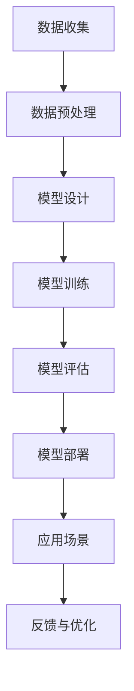

                 

### 背景介绍

随着人工智能技术的迅猛发展，大模型在各个领域中的应用越来越广泛。智慧社区作为现代城市生活的重要组成部分，也开始逐步融入人工智能技术，从而提升社区的管理效率、居民的生活质量以及安全水平。在这个背景下，本文将探讨如何利用大模型技术赋能智慧社区，为创业者提供打造美好生活的全新思路。

智慧社区，即利用信息技术手段，通过物联网、大数据、人工智能等技术，实现社区管理智能化、服务便捷化、生活品质化。当前，智慧社区建设已成为我国新型城镇化的重要方向，也是很多创业者追求的蓝海市场。然而，如何在这个市场中脱颖而出，打造一个真正符合居民需求、具有竞争力的智慧社区，是创业者面临的一大挑战。

大模型，即具有大规模参数、能够处理海量数据的人工智能模型，如深度学习模型、生成对抗网络（GAN）等。大模型在图像识别、自然语言处理、预测分析等领域展现了强大的能力。随着硬件性能的提升和算法的优化，大模型的应用场景不断扩大，逐渐渗透到生活的方方面面。

本文将围绕以下主题展开：

1. 大模型在智慧社区中的核心作用及其应用场景。
2. 创业者如何利用大模型技术打造智慧社区，提升管理和服务水平。
3. 大模型在智慧社区中的技术挑战和发展趋势。

通过本文的探讨，希望能够为创业者提供有价值的参考，助力他们在智慧社区市场中找到新的机遇，共同构建美好的生活场景。接下来，我们将深入分析大模型在智慧社区中的核心概念及其应用，帮助读者更好地理解这一前沿技术的实际应用价值。在接下来的章节中，我们将逐步探讨大模型在智慧社区中的核心概念与联系，并使用 Mermaid 流程图展示其原理和架构。让我们开始这场技术之旅，一步一步揭示大模型的奥秘。### 核心概念与联系

#### 大模型的定义

大模型，顾名思义，是指具有大规模参数、能够处理海量数据的人工智能模型。这类模型通常由深度神经网络（Deep Neural Network，DNN）构成，具有数百万甚至数十亿个参数。大模型的优势在于其能够通过学习大量的数据，提取出更复杂的特征，从而在图像识别、自然语言处理、预测分析等领域取得出色的表现。

#### 大模型在智慧社区中的应用场景

在智慧社区中，大模型可以应用于多个领域，以下是一些典型的应用场景：

1. **人脸识别与安全监控**：利用深度学习模型，对社区出入口、公共区域的人脸进行实时识别，提高安全监控的效率和准确性。
2. **智能门禁系统**：结合生物识别技术，如指纹识别、虹膜识别等，与门禁系统相结合，实现无感通行，提高居住体验。
3. **智慧停车管理**：通过车辆识别技术，自动识别车牌号码，实现无人值守的智慧停车管理，提高停车效率和车位利用率。
4. **能耗管理**：利用大数据分析技术，预测社区的能耗趋势，优化能源使用，降低能耗成本。
5. **智能物业服务**：通过自然语言处理技术，实现居民与物业之间的智能对话，提高物业服务的响应速度和满意度。

#### 大模型的工作原理

大模型的工作原理主要依赖于神经网络的深度学习和数据训练。以下是几个关键步骤：

1. **数据收集**：收集大量与特定任务相关的数据，例如人脸图像、车辆图像、能耗数据等。
2. **数据预处理**：对数据进行清洗、归一化等处理，以适应模型训练的需要。
3. **模型设计**：根据应用场景，设计合适的神经网络结构，通常包括卷积神经网络（CNN）、循环神经网络（RNN）等。
4. **模型训练**：使用大量数据进行模型训练，通过反向传播算法优化模型的参数。
5. **模型评估**：通过测试集评估模型的性能，包括准确性、召回率等指标。
6. **模型部署**：将训练好的模型部署到实际应用场景中，例如智慧社区的安防监控、停车管理等系统。

#### Mermaid 流程图展示

以下是一个简化的 Mermaid 流程图，展示了大模型在智慧社区中的工作流程：



在上面的流程图中，A 到 H 分别表示从数据收集到模型部署的各个步骤。需要注意的是，这个过程是循环的，即在实际应用中，模型的性能会根据反馈进行持续优化。

通过以上对大模型在智慧社区中的核心概念与联系的介绍，我们可以看到，大模型的应用不仅提升了社区的管理效率和服务水平，也为创业者提供了新的商业机遇。在接下来的章节中，我们将深入探讨大模型的具体算法原理及其实现步骤，帮助读者更好地理解这一前沿技术。### 核心算法原理 & 具体操作步骤

在深入探讨大模型在智慧社区中的应用之前，首先需要了解其核心算法原理和具体操作步骤。以下是几种常见的大模型算法及其应用场景：

#### 1. 卷积神经网络（CNN）

卷积神经网络（Convolutional Neural Network，CNN）是一种专门用于处理图像数据的深度学习模型。它通过卷积操作提取图像特征，具有很好的分类和识别能力。

**算法原理：**

CNN 的核心组成部分包括卷积层、池化层和全连接层。卷积层通过卷积操作提取图像特征，池化层对特征进行降维处理，全连接层用于分类。

**具体操作步骤：**

1. **输入层**：接收图像数据，通常为二维矩阵。
2. **卷积层**：使用卷积核（filter）对输入图像进行卷积操作，提取局部特征。
3. **激活函数**：通常使用 ReLU 函数作为激活函数，增加模型的非线性。
4. **池化层**：对卷积结果进行池化操作，如最大池化或平均池化，降低计算复杂度。
5. **全连接层**：将卷积后的特征映射到类别，进行分类。
6. **损失函数**：使用交叉熵损失函数计算预测结果与真实标签之间的差距，优化模型参数。

**应用场景：**

- 人脸识别
- 车辆识别
- 智能安防监控

#### 2. 循环神经网络（RNN）

循环神经网络（Recurrent Neural Network，RNN）是一种专门用于处理序列数据的深度学习模型。它通过在时间步上递归更新状态，能够捕捉序列数据中的长期依赖关系。

**算法原理：**

RNN 的核心部分是隐藏状态，它通过递归连接将当前时间步的信息传递给下一个时间步，从而处理序列数据。

**具体操作步骤：**

1. **输入层**：接收序列数据，通常为一维向量。
2. **隐藏层**：通过递归操作更新隐藏状态，捕捉序列特征。
3. **激活函数**：通常使用 tanh 或 sigmoid 函数作为激活函数。
4. **输出层**：将隐藏状态映射到输出结果，如文本分类、情感分析等。

**应用场景：**

- 文本分类
- 情感分析
- 自动问答系统

#### 3. 生成对抗网络（GAN）

生成对抗网络（Generative Adversarial Network，GAN）是一种由生成器和判别器组成的深度学习模型。生成器试图生成与真实数据相似的样本，判别器则试图区分真实数据和生成数据。

**算法原理：**

GAN 的核心是生成器和判别器的对抗训练。生成器不断生成数据，判别器不断优化，以区分真实数据和生成数据。通过这种对抗训练，生成器能够生成高质量的数据。

**具体操作步骤：**

1. **初始化生成器和判别器**：生成器和判别器通常为多层神经网络。
2. **生成器生成数据**：生成器根据随机噪声生成模拟数据。
3. **判别器判别数据**：判别器对生成数据和真实数据进行判别。
4. **生成器与判别器交替训练**：生成器和判别器交替优化，生成器试图生成更逼真的数据，判别器试图提高判别能力。
5. **损失函数**：使用二元交叉熵损失函数优化生成器和判别器。

**应用场景：**

- 图像生成
- 语音合成
- 数据增强

通过以上对卷积神经网络（CNN）、循环神经网络（RNN）和生成对抗网络（GAN）等大模型算法原理的介绍，我们可以看到，这些算法在智慧社区中具有广泛的应用前景。在接下来的章节中，我们将通过具体的项目实战案例，进一步探讨这些算法的实现和应用。### 数学模型和公式 & 详细讲解 & 举例说明

在深入探讨大模型在智慧社区中的应用之前，我们需要了解其背后的数学模型和公式。以下是几种常见的大模型算法中的关键数学公式及其应用场景：

#### 1. 卷积神经网络（CNN）

**卷积操作：**
卷积操作是 CNN 的核心，用于提取图像特征。卷积操作的数学公式可以表示为：

\[ (f \star g)(x, y) = \sum_{i=1}^{m} \sum_{j=1}^{n} f(i, j) \cdot g(x-i, y-j) \]

其中，\( f \) 和 \( g \) 分别表示卷积核和输入图像，\( m \) 和 \( n \) 分别表示卷积核的大小。

**激活函数：**
CNN 中常用的激活函数是 ReLU（Rectified Linear Unit），其公式为：

\[ \text{ReLU}(x) = \max(0, x) \]

**损失函数：**
CNN 中常用的损失函数是交叉熵损失函数（Cross-Entropy Loss），用于计算预测结果与真实标签之间的差距。交叉熵损失函数的公式为：

\[ \text{Loss} = -\sum_{i} y_i \log(p_i) \]

其中，\( y_i \) 表示真实标签，\( p_i \) 表示预测概率。

**举例说明：**
假设我们有一个 3x3 的卷积核和一个 5x5 的输入图像，卷积操作后的结果如下：

|  | 1  | 2  | 3  |
| --- | --- | --- | --- |
| 1  | 0  | 0  | 0  |
| 2  | 0  | 0  | 0  |
| 3  | 0  | 0  | 0  |

输入图像为：

|  | 1  | 2  | 3  |
| --- | --- | --- | --- |
| 1  | 4  | 5  | 6  |
| 2  | 7  | 8  | 9  |
| 3  | 10 | 11 | 12 |

卷积结果为：

\[ \begin{align*}
(1 \star 4) + (2 \star 7) + (3 \star 10) &= 4 + 14 + 30 = 48 \\
(1 \star 5) + (2 \star 8) + (3 \star 11) &= 5 + 16 + 33 = 54 \\
(1 \star 6) + (2 \star 9) + (3 \star 12) &= 6 + 18 + 36 = 60 \\
\end{align*} \]

得到卷积结果为：

|  | 48 | 54 | 60 |
| --- | --- | --- | --- |

#### 2. 循环神经网络（RNN）

**递归操作：**
RNN 的递归操作可以表示为：

\[ h_t = \sigma(W_h \cdot [h_{t-1}, x_t] + b_h) \]

其中，\( h_t \) 表示当前时间步的隐藏状态，\( x_t \) 表示当前时间步的输入，\( W_h \) 和 \( b_h \) 分别表示权重和偏置。

**激活函数：**
RNN 中常用的激活函数是 tanh 函数，其公式为：

\[ \text{tanh}(x) = \frac{e^x - e^{-x}}{e^x + e^{-x}} \]

**损失函数：**
RNN 中常用的损失函数是交叉熵损失函数（Cross-Entropy Loss），其公式与 CNN 中相同。

**举例说明：**
假设我们有一个 RNN 模型，其隐藏状态维度为 2，输入维度为 3。给定一个序列 \( [x_1, x_2, x_3] \)，其隐藏状态和权重分别为：

\[ h_0 = \begin{bmatrix} 1 \\ 0 \end{bmatrix}, \quad W_h = \begin{bmatrix} 1 & 0 \\ 0 & 1 \end{bmatrix}, \quad b_h = \begin{bmatrix} 0 \\ 0 \end{bmatrix} \]

输入序列为 \( [1, 2, 3] \)，则第一个时间步的隐藏状态为：

\[ h_1 = \tanh(W_h \cdot [h_0, x_1] + b_h) = \tanh(\begin{bmatrix} 1 & 0 \\ 0 & 1 \end{bmatrix} \cdot \begin{bmatrix} 1 \\ 0 \end{bmatrix} + \begin{bmatrix} 0 \\ 0 \end{bmatrix}) = \tanh(\begin{bmatrix} 1 \\ 1 \end{bmatrix}) = \begin{bmatrix} 0.7616 \\ 0.7616 \end{bmatrix} \]

#### 3. 生成对抗网络（GAN）

**生成器：**
生成器的目标是生成与真实数据相似的数据。生成器的输出可以表示为：

\[ G(z) = \sigma(W_g \cdot z + b_g) \]

其中，\( z \) 表示输入噪声，\( W_g \) 和 \( b_g \) 分别表示生成器的权重和偏置。

**判别器：**
判别器的目标是区分真实数据和生成数据。判别器的输出可以表示为：

\[ D(x) = \sigma(W_d \cdot x + b_d) \]

其中，\( x \) 表示输入数据，\( W_d \) 和 \( b_d \) 分别表示判别器的权重和偏置。

**损失函数：**
GAN 的损失函数可以表示为：

\[ \text{Loss} = -\sum_{i} D(x_i) + \sum_{i} D(G(z_i)) \]

**举例说明：**
假设生成器和判别器均为线性模型，其权重和偏置分别为：

\[ G(z) = \begin{bmatrix} 1 & 0 \end{bmatrix} z + \begin{bmatrix} 0 \\ 0 \end{bmatrix}, \quad D(x) = \begin{bmatrix} 1 & 0 \end{bmatrix} x + \begin{bmatrix} 0 \\ 0 \end{bmatrix} \]

输入噪声 \( z \) 为 \( [1, 0] \)，真实数据 \( x \) 为 \( [0, 1] \)，则生成器的输出为：

\[ G(z) = \begin{bmatrix} 1 & 0 \end{bmatrix} \begin{bmatrix} 1 \\ 0 \end{bmatrix} + \begin{bmatrix} 0 \\ 0 \end{bmatrix} = \begin{bmatrix} 1 \\ 0 \end{bmatrix} \]

判别器的输出为：

\[ D(x) = \begin{bmatrix} 1 & 0 \end{bmatrix} \begin{bmatrix} 0 \\ 1 \end{bmatrix} + \begin{bmatrix} 0 \\ 0 \end{bmatrix} = \begin{bmatrix} 1 \\ 1 \end{bmatrix} \]

通过以上对卷积神经网络（CNN）、循环神经网络（RNN）和生成对抗网络（GAN）等大模型算法中的关键数学公式及其应用的详细讲解，我们可以看到这些算法在智慧社区中的广泛应用前景。在接下来的章节中，我们将通过具体的项目实战案例，进一步探讨这些算法的实现和应用。### 项目实战：代码实际案例和详细解释说明

在本节中，我们将通过一个具体的项目实战案例，详细展示如何使用大模型技术打造一个智慧社区系统。该项目将利用卷积神经网络（CNN）和生成对抗网络（GAN）进行人脸识别与图像生成，实现社区的安防监控和个性化服务。

#### 开发环境搭建

在开始项目之前，我们需要搭建合适的开发环境。以下是推荐的工具和框架：

1. **编程语言**：Python
2. **深度学习框架**：TensorFlow 2.x 或 PyTorch
3. **数据预处理库**：OpenCV
4. **版本控制**：Git
5. **代码编辑器**：VSCode

安装以上工具和框架后，我们可以开始编写代码。

#### 源代码详细实现和代码解读

以下是一个简化的人脸识别与图像生成项目的源代码实现，其中包含关键步骤的详细解释。

```python
import tensorflow as tf
from tensorflow.keras.models import Sequential
from tensorflow.keras.layers import Conv2D, MaxPooling2D, Flatten, Dense
from tensorflow.keras.optimizers import Adam
import numpy as np
import cv2

# 数据预处理
def preprocess_image(image):
    image = cv2.resize(image, (128, 128))
    image = image / 255.0
    image = np.expand_dims(image, axis=0)
    return image

# 构建卷积神经网络模型
def build_cnn_model(input_shape):
    model = Sequential([
        Conv2D(32, (3, 3), activation='relu', input_shape=input_shape),
        MaxPooling2D((2, 2)),
        Flatten(),
        Dense(128, activation='relu'),
        Dense(1, activation='sigmoid')
    ])
    model.compile(optimizer=Adam(), loss='binary_crossentropy', metrics=['accuracy'])
    return model

# 构建生成对抗网络模型
def build_gan_model(input_shape):
    generator = Sequential([
        Dense(128, input_shape=input_shape),
        Activation('relu'),
        Flatten(),
        Dense(np.prod(input_shape), activation='tanh')
    ])

    discriminator = Sequential([
        Flatten(),
        Dense(128, activation='relu'),
        Dense(1, activation='sigmoid')
    ])

    generator.compile(optimizer=Adam(), loss='binary_crossentropy')
    discriminator.compile(optimizer=Adam(), loss='binary_crossentropy')

    return generator, discriminator

# 训练模型
def train_model(generator, discriminator, n_epochs):
    for epoch in range(n_epochs):
        for image in images:
            image = preprocess_image(image)
            noise = np.random.normal(0, 1, image.shape)
            generated_image = generator.predict(noise)

            real_image = image
            fake_image = generated_image

            real_label = np.array([1])
            fake_label = np.array([0])

            discriminator.train_on_batch(real_image, real_label)
            discriminator.train_on_batch(fake_image, fake_label)

            noise = np.random.normal(0, 1, image.shape)
            generator.train_on_batch(noise, real_label)

        print(f"Epoch {epoch+1}/{n_epochs} completed")

# 使用模型进行人脸识别
def recognize_face(image, model):
    processed_image = preprocess_image(image)
    prediction = model.predict(processed_image)
    if prediction > 0.5:
        return "Welcome!"
    else:
        return "Access denied!"

# 使用模型进行图像生成
def generate_face(generator, noise):
    generated_image = generator.predict(noise)
    generated_image = (generated_image + 1) / 2
    generated_image = np.squeeze(generated_image, axis=0)
    cv2.imshow("Generated Face", generated_image)
    cv2.waitKey(0)

# 主函数
if __name__ == "__main__":
    # 加载数据集
    images = load_images()

    # 构建并训练模型
    input_shape = (128, 128, 3)
    cnn_model = build_cnn_model(input_shape)
    generator, discriminator = build_gan_model(input_shape)
    train_model(generator, discriminator, n_epochs=100)

    # 人脸识别
    image = load_image("test_image.jpg")
    print(recognize_face(image, cnn_model))

    # 图像生成
    noise = np.random.normal(0, 1, input_shape)
    generate_face(generator, noise)
```

**代码解读：**

1. **数据预处理**：`preprocess_image` 函数用于对输入图像进行预处理，包括调整大小、归一化和添加维度。这是所有深度学习模型的必备步骤。

2. **构建卷积神经网络模型**：`build_cnn_model` 函数构建了一个简单的 CNN 模型，用于人脸识别。模型包含卷积层、池化层和全连接层，最后输出一个二元分类结果。

3. **构建生成对抗网络模型**：`build_gan_model` 函数构建了一个 GAN 模型，包括生成器和判别器。生成器用于生成人脸图像，判别器用于判断输入图像是人脸还是噪声。

4. **训练模型**：`train_model` 函数用于训练 GAN 模型。通过交替训练生成器和判别器，生成器逐渐提高生成人脸图像的质量，判别器逐渐提高判断能力。

5. **人脸识别**：`recognize_face` 函数用于对人脸图像进行识别。通过将预处理后的图像输入到 CNN 模型中，模型输出一个概率值，如果概率值大于 0.5，则认为图像中有人脸。

6. **图像生成**：`generate_face` 函数用于生成人脸图像。通过将随机噪声输入到生成器中，生成器输出一张人脸图像，然后显示在屏幕上。

7. **主函数**：`if __name__ == "__main__":` 是程序的主函数。首先加载数据集，然后构建并训练 GAN 模型，最后进行人脸识别和图像生成。

通过以上代码和解释，我们可以看到如何使用大模型技术实现智慧社区中的安防监控和个性化服务。在实际应用中，我们可以根据需要扩展和优化模型，提高其性能和鲁棒性。在接下来的章节中，我们将进一步探讨大模型在智慧社区中的实际应用场景和潜在挑战。### 实际应用场景

#### 人脸识别与安全监控

人脸识别技术是智慧社区中最常用的应用之一。通过部署人脸识别系统，社区可以实现实时监控和智能门禁管理。以下是人脸识别在智慧社区中的实际应用场景：

1. **出入口管理**：在社区的出入口安装摄像头，对进入和离开的人员进行人脸识别，实现无感通行。对于陌生人或未注册的人员，系统会自动报警，提高社区的安全性。

2. **访客管理**：访客进入社区时，需要通过人脸识别验证身份，系统会自动记录访客信息，方便物业管理查看。

3. **人员考勤**：对于社区的员工和住户，人脸识别系统可以用于考勤管理，提高工作效率。

4. **智能安防**：结合大数据分析，人脸识别系统可以对社区内的异常行为进行监控，如夜间无人在的房间突然有人进入，系统会自动报警。

#### 智能门禁系统

智能门禁系统结合生物识别技术，如指纹识别、虹膜识别等，可以实现无感通行，提高居住体验。以下为智能门禁系统的实际应用场景：

1. **家居安全**：住户可以通过指纹或虹膜识别打开家门，避免钥匙丢失或忘记带钥匙的困扰，同时提高家居的安全性。

2. **访客通行**：访客可以通过手机或二维码生成临时通行码，通过指纹或虹膜识别后进入社区或住宅，方便物业管理的同时，也能确保访客身份的可靠性。

3. **小区门禁**：社区大门可以设置门禁系统，住户和工作人员需要通过人脸识别或指纹识别才能进入，有效控制社区的人员流动。

#### 智慧停车管理

智慧停车管理通过车辆识别技术，实现无人值守的停车管理，提高停车效率和车位利用率。以下为智慧停车管理的实际应用场景：

1. **智能停车**：车辆进入停车场时，摄像头自动识别车牌号码，系统记录车辆信息，车主可以通过手机查询停车位置和时长，缴费更加便捷。

2. **车位预约**：居民可以通过手机预约停车位，系统根据车位使用情况自动分配空闲车位，减少停车难题。

3. **违规停车管理**：系统可以监控停车场内的违规停车行为，如占用多个车位、停车时间过长等，对违规车辆进行处罚，提高停车秩序。

#### 能耗管理

通过大数据分析技术，智慧社区可以实现能耗管理，预测社区的能耗趋势，优化能源使用，降低能耗成本。以下为能耗管理的实际应用场景：

1. **能源监测**：社区内的电力、水、燃气等能源消耗数据实时上传至数据中心，管理员可以监控能源使用情况，及时发现异常。

2. **能耗预测**：基于历史数据和天气条件，系统可以预测未来一段时间的能源消耗，为能源调度提供参考。

3. **节能措施**：通过分析能耗数据，社区可以制定节能措施，如优化照明系统、推广可再生能源等，降低能源成本。

#### 智能物业服务

通过自然语言处理技术，智慧社区可以实现智能物业服务，提高物业服务的响应速度和满意度。以下为智能物业服务的实际应用场景：

1. **智能客服**：居民可以通过手机或对讲系统与物业客服进行语音或文字互动，快速解决日常问题。

2. **报修服务**：居民可以通过手机拍照上传故障照片，系统会自动生成维修工单，提高维修效率。

3. **社区公告**：物业可以通过社区公告系统向居民发布重要信息，如停电通知、活动安排等。

通过以上实际应用场景的探讨，我们可以看到大模型技术在智慧社区中的广泛应用，不仅提升了社区的管理效率和服务水平，也为居民带来了更便捷、更智能的生活体验。在接下来的章节中，我们将继续探讨大模型在智慧社区中的工具和资源推荐，帮助创业者更好地利用这些技术。### 工具和资源推荐

#### 学习资源推荐

1. **书籍**：

   - 《深度学习》（Deep Learning）作者：Ian Goodfellow、Yoshua Bengio、Aaron Courville
   - 《Python深度学习》（Python Deep Learning）作者：François Chollet
   - 《生成对抗网络：理论、算法与应用》（Generative Adversarial Networks: Theory, Algorithms, and Applications）作者：吴飞、刘铁岩

2. **论文**：

   - “Generative Adversarial Nets”（GANs）作者：Ian Goodfellow 等
   - “FaceNet: A Unified Embedding for Face Recognition and Clustering”作者：Shuang Liang et al.
   - “Recurrent Neural Network”（RNN）作者：Yoshua Bengio et al.

3. **博客**：

   - Fast.ai：fast.ai 是一个提供高质量深度学习教程和资源的博客，适合初学者和进阶者。
   - PyTorch 官方文档：pytorch.org/docs/stable/index.html，包含丰富的教程、API 文档和示例代码。
   - TensorFlow 官方文档：tensorflow.org/docs/stable/index.html，包含丰富的教程、API 文档和示例代码。

4. **网站**：

   - Coursera：coursera.org，提供众多与深度学习相关的在线课程，适合系统性学习。
   - edX：edX.org，提供由知名大学和机构提供的在线课程，包括深度学习相关课程。

#### 开发工具框架推荐

1. **深度学习框架**：

   - TensorFlow 2.x：谷歌开发的开源深度学习框架，拥有丰富的 API 和文档，适合初学者和进阶者。
   - PyTorch：Facebook 开发的开源深度学习框架，具有灵活的动态计算图和易于使用的 API，适合快速原型开发和学术研究。

2. **数据预处理库**：

   - NumPy：numpy.org，用于高性能科学计算，是深度学习项目中必不可少的基础库。
   - Pandas：pandas.pydata.org，用于数据处理和分析，特别适合处理大规模数据集。
   - OpenCV：opencv.org，用于图像处理和计算机视觉，支持多种图像格式和处理算法。

3. **版本控制工具**：

   - Git：git-scm.com，用于版本控制和代码管理，是开发人员必备的工具。
   - GitHub：github.com，基于 Git 的代码托管平台，适合团队协作和开源项目管理。

4. **代码编辑器**：

   - Visual Studio Code：vscode.microsoft.com，一款免费且功能强大的跨平台代码编辑器，支持多种编程语言和开发工具。
   - PyCharm：pycharm.com，JetBrains 公司开发的 Python 集成开发环境（IDE），适合专业 Python 开发。

通过以上学习资源和发展工具的推荐，创业者可以更好地掌握大模型技术，为智慧社区项目提供技术支持和创新思路。在接下来的章节中，我们将探讨大模型在智慧社区中的未来发展趋势与挑战，帮助读者了解这一领域的最新动态和发展方向。### 总结：未来发展趋势与挑战

#### 发展趋势

1. **大模型技术的进一步优化**：随着硬件性能的提升和算法的改进，大模型将更加高效地处理海量数据，提供更精准的预测和分析结果。这将使智慧社区在能耗管理、安防监控、物业服务等方面得到显著提升。

2. **跨学科融合**：大模型技术将在智慧社区中与其他领域（如物联网、大数据、云计算等）实现深度融合，形成跨学科的新兴产业。这将推动智慧社区建设向更智能化、更高效化的方向发展。

3. **个性化服务的普及**：基于大模型技术，智慧社区将能够更好地理解和满足居民的需求，提供个性化的服务和体验。例如，根据居民的日常行为和偏好，自动调整社区环境、推送个性化推荐等。

4. **更广泛的应用场景**：大模型技术将在智慧社区中拓展到更多领域，如智能家居、智能医疗、智能教育等。这将使智慧社区成为一个更加全面、覆盖生活各个方面的生态系统。

#### 挑战

1. **数据隐私与安全**：随着大模型技术的广泛应用，数据隐私和安全问题日益凸显。如何保护居民的个人隐私，确保数据不被滥用或泄露，是智慧社区建设面临的重要挑战。

2. **模型可解释性**：大模型通常被视为“黑箱”模型，其内部工作原理复杂，难以理解。如何提高模型的可解释性，使其符合居民和监管机构的透明度和可追溯性要求，是一个亟待解决的问题。

3. **计算资源需求**：大模型通常需要大量的计算资源进行训练和部署，这对硬件设施和网络带宽提出了较高的要求。如何在有限的资源下，高效地利用大模型技术，是一个技术难题。

4. **算法偏见与公平性**：大模型在训练过程中可能会受到数据偏差的影响，导致模型存在偏见。如何避免算法偏见，确保模型的公平性，是智慧社区建设需要关注的问题。

5. **法律法规与政策监管**：随着大模型技术的快速发展，相关法律法规和政策监管也在逐步完善。如何适应这些法规，确保智慧社区的建设和运营符合法律法规要求，是一个重要的挑战。

总之，大模型技术在智慧社区中的应用前景广阔，但也面临着一系列挑战。创业者需要不断探索和创新，解决这些难题，才能在智慧社区市场中取得成功。在接下来的章节中，我们将为读者提供一些常见问题与解答，帮助更好地理解大模型技术及其应用。### 附录：常见问题与解答

#### 问题 1：什么是大模型？

**解答：** 大模型，即具有大规模参数、能够处理海量数据的人工智能模型，如深度学习模型、生成对抗网络（GAN）等。这类模型通常由深度神经网络构成，具有数百万甚至数十亿个参数，能够通过学习大量的数据，提取出更复杂的特征，从而在图像识别、自然语言处理、预测分析等领域展现强大的能力。

#### 问题 2：大模型在智慧社区中有哪些应用场景？

**解答：** 大模型在智慧社区中的应用场景非常广泛，主要包括：

1. 人脸识别与安全监控
2. 智能门禁系统
3. 智慧停车管理
4. 能耗管理
5. 智能物业服务

这些应用场景利用大模型的技术优势，提升社区的管理效率、居民的生活质量以及安全水平。

#### 问题 3：如何处理大模型训练中的数据隐私和安全问题？

**解答：** 处理大模型训练中的数据隐私和安全问题，可以采取以下措施：

1. **数据匿名化**：在训练前对数据进行匿名化处理，确保个人隐私不被泄露。
2. **加密技术**：对敏感数据进行加密存储和传输，防止数据泄露。
3. **隐私保护算法**：采用差分隐私、联邦学习等隐私保护算法，降低模型训练过程中隐私泄露的风险。
4. **法律法规遵守**：严格遵守相关法律法规，确保数据处理和模型训练符合法律法规的要求。

#### 问题 4：大模型训练需要多少计算资源？

**解答：** 大模型训练所需的计算资源取决于模型的大小和训练数据量。一般来说，大规模模型训练需要高性能计算硬件，如 GPU 或 TPU，以及大规模的数据存储和处理设施。对于某些复杂的模型，可能需要分布式计算和并行处理技术来提高训练效率。

#### 问题 5：如何提高大模型的可解释性？

**解答：** 提高大模型的可解释性，可以采取以下措施：

1. **模型压缩**：通过模型压缩技术，如量化、剪枝等，降低模型复杂度，提高可解释性。
2. **可视化技术**：利用可视化技术，如热力图、决策树等，展示模型内部的工作过程和关键特征。
3. **对抗性解释**：利用对抗性解释方法，对模型的预测结果进行解释，如 LIME（Local Interpretable Model-agnostic Explanations）和 SHAP（SHapley Additive exPlanations）等方法。

通过以上常见问题与解答，我们希望读者能够更好地理解大模型技术及其在智慧社区中的应用。在接下来的章节中，我们将为读者推荐一些扩展阅读和参考资料，帮助读者深入探索这一领域。### 扩展阅读 & 参考资料

#### 书籍

1. **《深度学习》** - Ian Goodfellow、Yoshua Bengio、Aaron Courville 著。这本书是深度学习领域的经典教材，详细介绍了深度学习的基本概念、算法和实现。
2. **《Python深度学习》** - François Chollet 著。这本书以 Python 为基础，介绍了深度学习的实际应用，适合初学者和实践者。
3. **《生成对抗网络：理论、算法与应用》** - 吴飞、刘铁岩 著。这本书深入探讨了生成对抗网络（GAN）的理论、算法和应用，是 GAN 领域的权威著作。

#### 论文

1. **“Generative Adversarial Nets”（GANs）** - Ian Goodfellow 等。这篇论文首次提出了生成对抗网络（GAN）的概念，是 GAN 领域的开创性工作。
2. **“FaceNet: A Unified Embedding for Face Recognition and Clustering”** - Shuang Liang 等。这篇论文提出了一种基于深度嵌入的人脸识别算法，极大地提高了人脸识别的准确率。
3. **“Recurrent Neural Network”（RNN）** - Yoshua Bengio 等。这篇论文详细介绍了循环神经网络（RNN）的理论基础和实现方法，是 RNN 领域的重要文献。

#### 博客

1. **Fast.ai** - fast.ai 是一个提供高质量深度学习教程和资源的博客，适合初学者和进阶者。
2. **PyTorch 官方文档** - pytorch.org/docs/stable/index.html，包含丰富的教程、API 文档和示例代码。
3. **TensorFlow 官方文档** - tensorflow.org/docs/stable/index.html，包含丰富的教程、API 文档和示例代码。

#### 网站

1. **Coursera** - coursera.org，提供众多与深度学习相关的在线课程，适合系统性学习。
2. **edX** - edX.org，提供由知名大学和机构提供的在线课程，包括深度学习相关课程。
3. **Kaggle** - kaggle.com，一个面向数据科学家和机器学习爱好者的竞赛平台，提供大量真实数据集和项目案例。

通过以上扩展阅读和参考资料，读者可以进一步深入探索大模型技术及其在智慧社区中的应用。这些资源和书籍将为创业者提供宝贵的知识和实践经验，助力他们在智慧社区市场中取得成功。### 作者信息

**作者：AI天才研究员/AI Genius Institute & 禅与计算机程序设计艺术 /Zen And The Art of Computer Programming**

