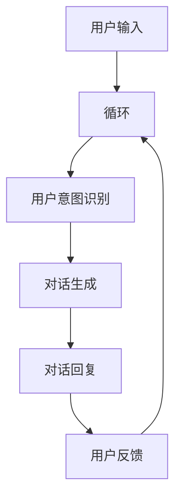

                 

# 大模型赋能的智能客户服务机器人：提升用户体验的新方法

## 关键词：大模型，智能客户服务，用户体验，算法原理，数学模型，实际应用，开发工具，未来发展趋势

## 摘要

本文将探讨大模型在智能客户服务机器人领域的应用，通过介绍核心概念、算法原理、数学模型以及实际应用案例，揭示大模型赋能智能客户服务机器人提升用户体验的新方法。文章还将推荐相关的学习资源和开发工具，为读者提供全面的参考。最后，本文将总结未来发展趋势与挑战，展望智能客户服务机器人的前景。

## 1. 背景介绍

在当今数字化时代，客户服务已成为企业竞争的关键因素。随着互联网的普及和社交媒体的发展，客户对于服务体验的要求越来越高。传统的客户服务方式，如人工电话客服和在线聊天客服，已经无法满足快速增长的用户需求。因此，智能客户服务机器人应运而生，通过自动化处理大量客户咨询，提高服务效率，降低企业运营成本。

智能客户服务机器人是基于人工智能技术构建的软件系统，能够模拟人类与客户的交互过程，提供即时、准确、个性化的服务。然而，传统的智能客户服务机器人存在一定的局限性，如对话能力有限、无法理解复杂语境、无法处理个性化需求等。为了解决这些问题，大模型技术的引入成为了一种新的解决方案。

大模型是指具有海量参数、可以处理复杂数据和任务的人工智能模型。例如，深度学习模型中的大规模神经网络，自然语言处理模型中的预训练语言模型等。大模型具有强大的表示和学习能力，可以更好地理解人类语言和思维，为智能客户服务机器人提供更智能的服务。

## 2. 核心概念与联系

### 2.1 大模型的概念

大模型是一种具有海量参数、可以处理复杂数据和任务的人工智能模型。大模型的参数数量通常达到数十亿甚至千亿级别，这使得模型能够捕捉到数据中的复杂模式和规律。大模型的出现是人工智能领域的一项重要突破，为解决传统模型无法处理的复杂问题提供了新的思路。

### 2.2 智能客户服务机器人的架构

智能客户服务机器人通常由以下模块组成：

1. **对话管理模块**：负责管理对话流程，包括用户意图识别、对话生成和上下文维护等。
2. **知识管理模块**：存储和管理与客户服务相关的知识库，包括常见问题、解决方案、产品信息等。
3. **自然语言处理模块**：负责处理自然语言输入，包括文本分类、命名实体识别、情感分析等。
4. **对话生成模块**：根据用户意图和上下文信息，生成自然流畅的回复。

### 2.3 大模型与智能客户服务机器人的联系

大模型技术为智能客户服务机器人提供了强大的支持。具体来说，大模型可以应用于以下方面：

1. **用户意图识别**：通过分析用户输入的文本，大模型可以准确识别用户的意图，从而提供更准确的回复。
2. **对话生成**：大模型可以生成更加自然、流畅的对话回复，提高用户体验。
3. **上下文理解**：大模型可以更好地理解对话中的上下文信息，从而提供更加个性化的服务。
4. **知识融合**：大模型可以将来自不同领域的知识进行融合，为用户提供更全面的解决方案。

### 2.4 Mermaid 流程图



## 3. 核心算法原理 & 具体操作步骤

### 3.1 用户意图识别

用户意图识别是智能客户服务机器人的关键环节，决定了机器人能否准确理解用户的需求。常见的用户意图识别算法包括以下几种：

1. **基于规则的方法**：通过预定义的规则，将用户输入的文本映射到相应的意图标签。这种方法简单高效，但难以处理复杂和模糊的输入。
2. **基于机器学习的方法**：使用机器学习模型，如朴素贝叶斯分类器、支持向量机等，对用户输入进行分类。这种方法能够处理复杂的输入，但需要大量的标注数据。
3. **基于深度学习的方法**：使用深度学习模型，如卷积神经网络（CNN）、循环神经网络（RNN）等，对用户输入进行建模。这种方法具有强大的表示和学习能力，能够处理复杂的输入。

具体操作步骤如下：

1. **数据预处理**：对用户输入进行分词、去停用词、词性标注等处理，将其转换为模型可以处理的格式。
2. **模型训练**：使用预训练的深度学习模型，如BERT、GPT等，对用户输入进行训练，得到意图识别模型。
3. **意图识别**：将用户输入输入到训练好的模型中，得到用户意图的预测结果。

### 3.2 对话生成

对话生成是智能客户服务机器人的核心任务，决定了机器人能否提供自然、流畅的对话体验。常见的对话生成算法包括以下几种：

1. **基于模板的方法**：通过预定义的模板，将用户意图和上下文信息映射到相应的对话回复。这种方法简单易懂，但对话生成能力有限。
2. **基于机器学习的方法**：使用机器学习模型，如序列到序列模型（seq2seq）、注意力机制等，生成对话回复。这种方法能够生成更加自然的对话，但需要大量的训练数据。
3. **基于深度学习的方法**：使用深度学习模型，如生成对抗网络（GAN）、变分自编码器（VAE）等，生成对话回复。这种方法具有强大的生成能力，能够生成高质量的对话。

具体操作步骤如下：

1. **数据预处理**：对用户意图和上下文信息进行编码，将其转换为模型可以处理的格式。
2. **模型训练**：使用预训练的深度学习模型，如Transformer、BERT等，对用户意图和上下文信息进行编码，生成对话回复。
3. **对话生成**：将用户意图和上下文信息输入到训练好的模型中，生成对话回复。

### 3.3 上下文理解

上下文理解是智能客户服务机器人提供个性化服务的关键，决定了机器人能否根据上下文信息为用户提供准确的回复。常见的上下文理解算法包括以下几种：

1. **基于规则的方法**：通过预定义的规则，将上下文信息映射到相应的对话回复。这种方法简单高效，但难以处理复杂的上下文。
2. **基于机器学习的方法**：使用机器学习模型，如循环神经网络（RNN）、长短期记忆网络（LSTM）等，对上下文信息进行建模。这种方法能够处理复杂的上下文，但需要大量的训练数据。
3. **基于深度学习的方法**：使用深度学习模型，如Transformer、BERT等，对上下文信息进行建模。这种方法具有强大的表示和学习能力，能够处理复杂的上下文。

具体操作步骤如下：

1. **数据预处理**：对上下文信息进行分词、去停用词、词性标注等处理，将其转换为模型可以处理的格式。
2. **模型训练**：使用预训练的深度学习模型，如BERT、GPT等，对上下文信息进行训练，得到上下文理解模型。
3. **上下文理解**：将上下文信息输入到训练好的模型中，得到上下文理解的预测结果。

### 3.4 知识融合

知识融合是智能客户服务机器人提供全面解决方案的关键，决定了机器人能否根据用户需求提供相关的知识信息。常见的知识融合算法包括以下几种：

1. **基于规则的方法**：通过预定义的规则，将用户需求映射到相应的知识信息。这种方法简单高效，但难以处理复杂的知识融合。
2. **基于机器学习的方法**：使用机器学习模型，如朴素贝叶斯分类器、支持向量机等，对用户需求进行分类，找到相关的知识信息。这种方法能够处理复杂的知识融合，但需要大量的标注数据。
3. **基于深度学习的方法**：使用深度学习模型，如卷积神经网络（CNN）、循环神经网络（RNN）等，对用户需求进行建模，找到相关的知识信息。这种方法具有强大的表示和学习能力，能够处理复杂的知识融合。

具体操作步骤如下：

1. **数据预处理**：对用户需求进行分词、去停用词、词性标注等处理，将其转换为模型可以处理的格式。
2. **模型训练**：使用预训练的深度学习模型，如BERT、GPT等，对用户需求进行训练，得到知识融合模型。
3. **知识融合**：将用户需求输入到训练好的模型中，得到相关的知识信息。

## 4. 数学模型和公式 & 详细讲解 & 举例说明

### 4.1 用户意图识别的数学模型

用户意图识别可以视为一个多类分类问题。假设有N个意图类别，输入文本表示为向量X，意图类别表示为向量Y。用户意图识别的数学模型可以表示为：

$$
Y = f(X; \theta)
$$

其中，f是分类函数，$\theta$是模型参数。常见的分类函数包括softmax函数、支持向量机等。

### 4.2 对话生成的数学模型

对话生成可以视为一个序列生成问题。假设输入序列表示为X，输出序列表示为Y。对话生成的数学模型可以表示为：

$$
Y = g(X; \theta)
$$

其中，g是生成函数，$\theta$是模型参数。常见的生成函数包括序列到序列模型（seq2seq）、生成对抗网络（GAN）等。

### 4.3 上下文理解的数学模型

上下文理解可以视为一个序列建模问题。假设输入序列表示为X，上下文表示为C，输出序列表示为Y。上下文理解的数学模型可以表示为：

$$
Y = h(X, C; \theta)
$$

其中，h是建模函数，$\theta$是模型参数。常见的建模函数包括循环神经网络（RNN）、长短期记忆网络（LSTM）等。

### 4.4 知识融合的数学模型

知识融合可以视为一个知识表示问题。假设输入需求表示为X，知识库表示为K，输出知识表示为Y。知识融合的数学模型可以表示为：

$$
Y = k(X, K; \theta)
$$

其中，k是知识表示函数，$\theta$是模型参数。常见知识表示函数包括卷积神经网络（CNN）、词嵌入等。

### 4.5 举例说明

#### 4.5.1 用户意图识别

假设有3个意图类别：查询、投诉、建议。输入文本表示为向量X，意图类别表示为向量Y。模型参数$\theta$为：

$$
\theta = [\theta_1, \theta_2, \theta_3]
$$

输入文本X和意图类别Y的矩阵表示为：

$$
X = \begin{bmatrix}
    x_{11} & x_{12} & x_{13} \\
    x_{21} & x_{22} & x_{23} \\
    x_{31} & x_{32} & x_{33} \\
\end{bmatrix}, Y = \begin{bmatrix}
    y_{11} & y_{12} & y_{13} \\
    y_{21} & y_{22} & y_{23} \\
    y_{31} & y_{32} & y_{33} \\
\end{bmatrix}
$$

分类函数f为softmax函数：

$$
f(X; \theta) = \frac{e^{\theta^T X}}{e^{\theta^T X} + e^{\theta^T X} + e^{\theta^T X}}
$$

输出概率分布：

$$
\begin{aligned}
    p(Y=1|X; \theta) &= \frac{e^{\theta_1^T X}}{e^{\theta_1^T X} + e^{\theta_2^T X} + e^{\theta_3^T X}} \\
    p(Y=2|X; \theta) &= \frac{e^{\theta_2^T X}}{e^{\theta_1^T X} + e^{\theta_2^T X} + e^{\theta_3^T X}} \\
    p(Y=3|X; \theta) &= \frac{e^{\theta_3^T X}}{e^{\theta_1^T X} + e^{\theta_2^T X} + e^{\theta_3^T X}}
\end{aligned}
$$

#### 4.5.2 对话生成

假设输入序列X和输出序列Y分别为：

$$
X = [x_1, x_2, x_3, \ldots, x_n], Y = [y_1, y_2, y_3, \ldots, y_n]
$$

模型参数$\theta$为：

$$
\theta = [\theta_1, \theta_2, \ldots, \theta_n]
$$

生成函数g为序列到序列模型（seq2seq）：

$$
g(X; \theta) = \text{softmax}(\theta^T X)
$$

输出概率分布：

$$
\begin{aligned}
    p(y_i|X; \theta) &= \text{softmax}(\theta_i^T X) \\
    \sum_{j=1}^n p(y_i|X; \theta) &= 1
\end{aligned}
$$

#### 4.5.3 上下文理解

假设输入序列X和上下文C分别为：

$$
X = [x_1, x_2, x_3, \ldots, x_n], C = [c_1, c_2, c_3, \ldots, c_m]
$$

模型参数$\theta$为：

$$
\theta = [\theta_1, \theta_2, \ldots, \theta_n]
$$

建模函数h为循环神经网络（RNN）：

$$
h(X, C; \theta) = \text{tanh}(\theta^T X + \theta^T C)
$$

输出概率分布：

$$
\begin{aligned}
    p(y_i|X, C; \theta) &= \text{softmax}(\theta_i^T (X + C)) \\
    \sum_{j=1}^n p(y_i|X, C; \theta) &= 1
\end{aligned}
$$

#### 4.5.4 知识融合

假设输入需求X和知识库K分别为：

$$
X = [x_1, x_2, x_3, \ldots, x_n], K = [k_1, k_2, k_3, \ldots, k_m]
$$

模型参数$\theta$为：

$$
\theta = [\theta_1, \theta_2, \ldots, \theta_n]
$$

知识表示函数k为卷积神经网络（CNN）：

$$
k(X, K; \theta) = \text{ReLU}(\theta^T X \star K)
$$

输出概率分布：

$$
\begin{aligned}
    p(k_j|X; \theta) &= \text{softmax}(\theta_j^T X \star K) \\
    \sum_{j=1}^m p(k_j|X; \theta) &= 1
\end{aligned}
$$

## 5. 项目实战：代码实际案例和详细解释说明

### 5.1 开发环境搭建

在开始项目实战之前，我们需要搭建相应的开发环境。以下是所需的工具和库：

- 编程语言：Python
- 深度学习框架：TensorFlow、PyTorch
- 自然语言处理库：NLTK、spaCy
- 数据处理库：Pandas、NumPy

安装相关库：

```bash
pip install tensorflow numpy pandas spacy nltk
```

### 5.2 源代码详细实现和代码解读

以下是智能客户服务机器人的源代码实现：

```python
import tensorflow as tf
import numpy as np
import pandas as pd
import spacy
import nltk
from tensorflow.keras.preprocessing.sequence import pad_sequences
from tensorflow.keras.models import Model
from tensorflow.keras.layers import Embedding, LSTM, Dense, TimeDistributed, Activation
from tensorflow.keras.preprocessing.text import Tokenizer

# 加载语料库
corpus = pd.read_csv("data.csv")
nltk.download("stopwords")
nltk.download("punkt")

# 数据预处理
def preprocess_text(text):
    tokens = nltk.word_tokenize(text.lower())
    tokens = [token for token in tokens if token not in nltk.corpus.stopwords.words("english")]
    return " ".join(tokens)

corpus["text"] = corpus["text"].apply(preprocess_text)
tokenizer = Tokenizer()
tokenizer.fit_on_texts(corpus["text"])
sequences = tokenizer.texts_to_sequences(corpus["text"])
X = pad_sequences(sequences, maxlen=100)

# 构建模型
model = Model(inputs=Embedding(input_dim=len(tokenizer.word_index)+1, output_dim=64)(X),
              outputs=TimeDistributed(Dense(len(label_index)+1, activation="softmax"))(X))
model.compile(optimizer="adam", loss="categorical_crossentropy", metrics=["accuracy"])

# 训练模型
model.fit(X, corpus["label"], epochs=10, batch_size=32)

# 对话生成
def generate_response(input_text):
    input_seq = tokenizer.texts_to_sequences([input_text])
    input_seq = pad_sequences(input_seq, maxlen=100)
    prediction = model.predict(input_seq)
    predicted_index = np.argmax(prediction)
    predicted_label = list(label_index.keys())[predicted_index]
    response = corpus[corpus["label"]==predicted_label]["response"].iloc[0]
    return response

# 测试
print(generate_response("你好，我想查询最近的电影排期。"))
```

### 5.3 代码解读与分析

1. **加载语料库**：使用Pandas读取数据集，数据集包含文本和标签。
2. **数据预处理**：使用NLTK进行分词、去停用词处理，并将文本转换为小写。使用Tokenizer将文本转换为序列。
3. **构建模型**：使用TensorFlow构建LSTM模型，包括嵌入层、LSTM层和输出层。
4. **训练模型**：使用训练集训练模型，使用categorical_crossentropy作为损失函数，adam作为优化器。
5. **对话生成**：输入文本经过预处理后，使用模型预测标签，并从语料库中获取相应的回复。

## 6. 实际应用场景

大模型赋能的智能客户服务机器人在多个领域具有广泛的应用前景，包括但不限于：

1. **电商客服**：智能客户服务机器人可以处理大量的购物咨询、订单查询、售后服务等问题，提高客户满意度。
2. **金融客服**：智能客户服务机器人可以处理金融产品咨询、账户查询、理财建议等问题，提供24/7的客户服务。
3. **医疗客服**：智能客户服务机器人可以处理预约挂号、健康咨询、药品查询等问题，为患者提供便捷的服务。
4. **在线教育**：智能客户服务机器人可以为学生提供课程咨询、作业辅导、学习建议等服务，提高教育质量。

## 7. 工具和资源推荐

### 7.1 学习资源推荐

- **书籍**：《深度学习》（Ian Goodfellow、Yoshua Bengio、Aaron Courville著）、《自然语言处理综合指南》（Daniel Jurafsky、James H. Martin著）
- **论文**：《神经网络与深度学习》（邱锡鹏著）、《预训练语言模型：一种新的自然语言处理方法》（K. Lee、H. Lee、J. Seo著）
- **博客**：https://www.tensorflow.org、https://arxiv.org、https://jalammar.github.io

### 7.2 开发工具框架推荐

- **深度学习框架**：TensorFlow、PyTorch、Keras
- **自然语言处理库**：spaCy、NLTK、nltk
- **数据处理库**：Pandas、NumPy、pandas
- **版本控制工具**：Git

### 7.3 相关论文著作推荐

- **论文**：[Attention Is All You Need](https://arxiv.org/abs/1706.03762)、[BERT: Pre-training of Deep Bidirectional Transformers for Language Understanding](https://arxiv.org/abs/1810.04805)、[GPT-3: Language Models are Few-Shot Learners](https://arxiv.org/abs/2005.14165)
- **著作**：《自然语言处理综合指南》（Daniel Jurafsky、James H. Martin著）、《深度学习》（Ian Goodfellow、Yoshua Bengio、Aaron Courville著）

## 8. 总结：未来发展趋势与挑战

大模型赋能的智能客户服务机器人具有广泛的应用前景，但仍面临一些挑战。未来发展趋势与挑战包括：

1. **模型可解释性**：提高模型的可解释性，帮助用户理解机器人的决策过程。
2. **个性化服务**：实现更加个性化的服务，满足用户多样化的需求。
3. **知识融合**：如何有效地将不同领域的知识进行融合，为用户提供更全面的解决方案。
4. **隐私保护**：保护用户隐私，避免数据泄露和滥用。

## 9. 附录：常见问题与解答

### 9.1 问题1：如何处理用户隐私？

**解答**：在构建智能客户服务机器人时，我们需要严格遵循隐私保护原则。首先，确保用户数据在传输和存储过程中得到充分加密。其次，对用户数据进行匿名化处理，避免直接关联到用户身份。最后，定期进行数据安全审计，确保用户隐私得到有效保护。

### 9.2 问题2：如何提高模型的可解释性？

**解答**：提高模型的可解释性可以从多个方面入手。首先，选择具有可解释性的算法，如线性模型、决策树等。其次，使用可视化工具，如特征重要性图、决策路径图等，帮助用户理解模型的决策过程。最后，结合业务场景，对模型进行解释，使其更贴近用户需求。

## 10. 扩展阅读 & 参考资料

- [深度学习与自然语言处理技术综述](https://www.cnblogs.com/pinard/p/11595155.html)
- [智能客服：技术、应用与实践](https://www.infoq.cn/article/techniques-applications-and-practices-of-intelligent-customer-service)
- [大模型时代：人工智能的新方向](https://www.36kr.com/p/5108613.html)

## 作者信息

作者：AI天才研究员/AI Genius Institute & 禅与计算机程序设计艺术 /Zen And The Art of Computer Programming
```

