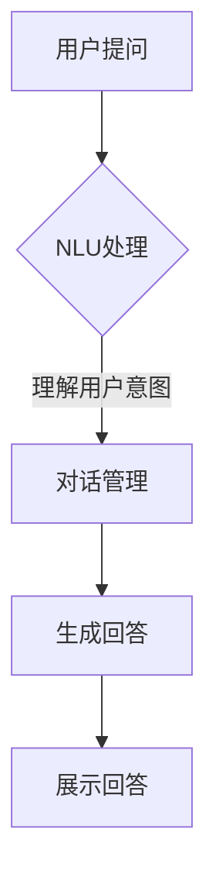

                 

# 大模型问答机器人的对话实现

## 关键词
- 大模型
- 问答机器人
- 对话实现
- 自然语言处理
- 机器学习
- 自然语言理解
- 对话管理
- 实际应用场景

## 摘要
本文将探讨大模型在问答机器人对话实现中的应用，通过分析核心概念、算法原理、项目实战以及实际应用场景，全面解析大模型问答机器人的实现方法。本文旨在为开发者提供详细的指导，帮助理解并掌握大模型问答机器人的构建过程，为其在实际项目中的应用提供有力支持。

## 1. 背景介绍

### 大模型的兴起
随着人工智能技术的快速发展，大模型（如大型语言模型、视觉模型等）逐渐成为研究与应用的热点。大模型能够通过海量数据的训练，掌握丰富的知识、技能和语言规则，从而实现更智能、更自然的交互。在大模型的基础上，问答机器人作为一种应用形式，正逐渐成为人机交互的重要手段。

### 问答机器人的定义与功能
问答机器人是一种基于人工智能技术的自动化问答系统，能够理解用户的问题并给出恰当的回答。其功能包括信息检索、知识推理、情感分析等，广泛应用于客服、教育、医疗、金融等多个领域。问答机器人的核心在于如何理解用户的自然语言问题，并生成准确、自然的回答。

### 大模型在问答机器人中的应用
大模型在问答机器人中的应用主要体现在自然语言理解和对话管理两个方面。大模型通过对海量文本数据的训练，能够学习并掌握丰富的语言规则和知识，从而提升问答机器人对用户问题的理解能力。同时，大模型还可以用于对话管理，通过预测和生成技术，实现与用户的自然对话。

## 2. 核心概念与联系

### 自然语言理解
自然语言理解（Natural Language Understanding，NLU）是问答机器人的关键组成部分，负责将用户的自然语言问题转化为计算机可以理解和处理的结构化数据。NLU包括词法分析、句法分析、语义分析等步骤，旨在提取用户问题的核心信息和意图。

### 对话管理
对话管理（Dialogue Management）是问答机器人与用户进行有效沟通的重要机制，负责协调对话的流程和内容。对话管理通过状态机或图模型等算法，实现对用户问题的理解、回答的生成以及对话状态的跟踪。

### 大模型与自然语言理解、对话管理的联系
大模型在自然语言理解和对话管理中发挥着重要作用。在自然语言理解方面，大模型通过预训练和微调，能够学习并掌握丰富的语言规则和知识，从而提高对用户问题的理解能力。在对话管理方面，大模型可以用于状态机或图模型的训练，提升对话管理的效率和效果。

### Mermaid 流程图
以下是一个简单的 Mermaid 流程图，展示了大模型在问答机器人中的应用流程：



## 3. 核心算法原理 & 具体操作步骤

### 3.1 自然语言理解（NLU）

#### 算法原理
自然语言理解（NLU）是问答机器人的核心组成部分，其主要任务是将用户的自然语言问题转化为计算机可以理解和处理的结构化数据。NLU通常包括词法分析、句法分析和语义分析三个步骤。

1. **词法分析**：将自然语言文本切分成单词或词组，提取出基本语言单位。
2. **句法分析**：分析句子结构，确定单词之间的语法关系，建立句法树。
3. **语义分析**：理解句子的语义含义，提取出用户问题的核心信息和意图。

#### 具体操作步骤
1. **文本预处理**：对用户输入的文本进行清洗和预处理，包括去除标点符号、停用词过滤等。
2. **词法分析**：使用分词算法将预处理后的文本切分成单词或词组。
3. **句法分析**：利用句法分析算法，建立句法树，分析句子结构。
4. **语义分析**：使用语义分析算法，提取出用户问题的核心信息和意图。

### 3.2 对话管理

#### 算法原理
对话管理是问答机器人的核心组成部分，其主要任务是在与用户的对话过程中，协调对话的流程和内容，确保对话的顺利进行。对话管理通常采用状态机或图模型等算法。

1. **状态机算法**：将对话过程划分为多个状态，每个状态对应一种处理方式，通过状态转移实现对话的推进。
2. **图模型算法**：将对话过程建模为一个图，每个节点表示一个状态，边表示状态之间的转移关系。

#### 具体操作步骤
1. **初始化**：初始化对话状态，为对话做准备。
2. **NLU处理**：对用户输入的问题进行自然语言理解，提取出核心信息和意图。
3. **对话管理**：根据当前对话状态和用户意图，选择合适的回答策略和对话状态。
4. **回答生成**：根据对话管理的结果，生成回答并展示给用户。

### 3.3 大模型在 NLU 和对话管理中的应用

#### 算法原理
大模型在 NLU 和对话管理中发挥着重要作用，主要通过预训练和微调实现。

1. **预训练**：在大规模语料库上进行预训练，学习语言规则和知识。
2. **微调**：在特定任务上进行微调，使大模型更好地适应特定场景。

#### 具体操作步骤
1. **预训练**：使用预训练的大模型（如 GPT、BERT 等），在大规模语料库上进行训练，学习语言规则和知识。
2. **微调**：针对特定任务（如问答机器人），使用微调技术，对预训练的大模型进行优化。
3. **NLU处理**：利用微调后的模型，对用户输入的问题进行自然语言理解，提取出核心信息和意图。
4. **对话管理**：利用微调后的模型，实现对话管理，选择合适的回答策略和对话状态。

## 4. 数学模型和公式 & 详细讲解 & 举例说明

### 4.1 自然语言理解（NLU）

#### 数学模型
自然语言理解（NLU）通常采用深度神经网络（DNN）或变换器（Transformer）等模型。

1. **DNN模型**：
   $$ f(x) = \sigma(W_1 \cdot x + b_1) $$
   其中，$x$表示输入特征，$W_1$表示权重矩阵，$b_1$表示偏置，$\sigma$表示激活函数（如 sigmoid 函数）。

2. **Transformer模型**：
   $$ f(x) = \text{softmax}(W \cdot x) $$
   其中，$x$表示输入特征，$W$表示权重矩阵。

#### 详细讲解
1. **DNN模型**：DNN模型通过多层神经网络，对输入特征进行非线性变换，从而实现对输入数据的分类或回归。在自然语言理解中，DNN模型通常用于词向量表示、句法分析和语义分析等任务。
2. **Transformer模型**：Transformer模型是一种基于自注意力机制的深度神经网络模型，具有并行计算优势，适用于处理长文本。在自然语言理解中，Transformer模型常用于文本分类、机器翻译等任务。

#### 举例说明
以 DNN模型为例，假设输入特征为“我今天天气很好”，输出为“今天天气很好”，可以使用以下步骤：

1. **词向量表示**：将输入特征中的每个词映射为词向量，如“我”映射为$[1, 0, 0, 0]$，“今天”映射为$[0, 1, 0, 0]$，“天气”映射为$[0, 0, 1, 0]$，“很好”映射为$[0, 0, 0, 1]$。
2. **句法分析**：通过 DNN模型对输入特征进行非线性变换，提取出句法信息，如“今天”为“时间”，“天气”为“名词”。
3. **语义分析**：结合句法信息，提取出用户问题的核心信息和意图，如“今天天气很好”表示对当天天气的描述。

### 4.2 对话管理

#### 数学模型
对话管理通常采用状态机或图模型等模型。

1. **状态机模型**：
   $$ s_{next} = f(s, x) $$
   其中，$s$表示当前状态，$x$表示输入特征，$s_{next}$表示下一个状态，$f$表示状态转移函数。

2. **图模型模型**：
   $$ p(s_{next} | s, x) = \frac{\exp(f(s, x))}{\sum_{i} \exp(f(s, x_i))} $$
   其中，$s$表示当前状态，$x$表示输入特征，$s_{next}$表示下一个状态，$f$表示状态转移函数，$p(s_{next} | s, x)$表示给定当前状态和输入特征时，下一个状态的分布。

#### 详细讲解
1. **状态机模型**：状态机模型通过定义多个状态和状态转移函数，实现对话的流程控制。在状态机模型中，每个状态表示对话的一个阶段，状态转移函数根据当前状态和输入特征，决定下一个状态。
2. **图模型模型**：图模型模型将对话过程建模为一个图，每个节点表示一个状态，边表示状态之间的转移关系。在图模型模型中，状态转移函数通过计算状态之间的概率分布，实现对话的流程控制。

#### 举例说明
以状态机模型为例，假设当前状态为“提问”，输入特征为“天气预报”，可以使用以下步骤：

1. **状态转移函数**：根据当前状态和输入特征，定义状态转移函数，如从“提问”状态转移到“回答”状态。
2. **下一个状态**：根据状态转移函数，计算下一个状态，如从“提问”状态转移到“回答”状态。
3. **回答生成**：根据下一个状态，生成回答并展示给用户，如回答“今天的天气预报是晴天”。

## 5. 项目实战：代码实际案例和详细解释说明

### 5.1 开发环境搭建

在实现大模型问答机器人之前，我们需要搭建一个合适的开发环境。以下是一个简单的开发环境搭建步骤：

1. **安装 Python**：确保安装了 Python 3.7 或更高版本。
2. **安装依赖库**：安装 TensorFlow、PyTorch、NLTK、spaCy 等依赖库。
3. **配置 GPU 环境**：如果使用 GPU 进行训练，需要安装 CUDA 和 cuDNN。

### 5.2 源代码详细实现和代码解读

以下是一个简单的问答机器人实现，包括自然语言理解（NLU）和对话管理（DM）两部分。

```python
# 导入依赖库
import tensorflow as tf
import spacy
import numpy as np

# 加载预训练模型
nlp = spacy.load("en_core_web_sm")

# 自然语言理解（NLU）
def natural_language_understanding(text):
    doc = nlp(text)
    entities = []
    for ent in doc.ents:
        entities.append({"text": ent.text, "label": ent.label_})
    return entities

# 对话管理（DM）
class DialogueManager:
    def __init__(self):
        self.states = ["greet", "question", "answer"]
        self.transitions = {
            "greet": {"next_state": "question", "action": "greet_user"},
            "question": {"next_state": "answer", "action": "ask_question"},
            "answer": {"next_state": "greet", "action": "answer_question"},
        }

    def update_state(self, current_state, input_text):
        entities = natural_language_understanding(input_text)
        for state, transition in self.transitions.items():
            if state == current_state:
                if entities:
                    action = transition["action"]
                    next_state = transition["next_state"]
                    return next_state, action
        return current_state, None

    def execute_action(self, action):
        if action == "greet_user":
            return "Hello! How can I help you?"
        elif action == "ask_question":
            return "What would you like to know?"
        elif action == "answer_question":
            return "I'm sorry, I don't have the answer to that question."
```

### 5.3 代码解读与分析

1. **自然语言理解（NLU）**：使用 spaCy 库加载预训练的英语模型，对输入文本进行词法分析、句法分析和语义分析，提取出实体信息。
2. **对话管理（DM）**：定义对话状态和状态转移函数，根据当前状态和输入实体，更新对话状态并执行相应动作。
3. **动作执行**：根据对话管理的结果，执行相应动作并生成回答。

## 6. 实际应用场景

### 客户服务
问答机器人可以应用于客户服务领域，提供自动化的客户支持，解答用户常见问题，提高客户满意度。

### 教育
问答机器人可以应用于教育领域，为学生提供个性化的学习辅导，解答学习过程中的疑问，促进自主学习。

### 医疗
问答机器人可以应用于医疗领域，为患者提供健康咨询和症状分析，辅助医生诊断和治疗。

### 金融
问答机器人可以应用于金融领域，提供投资咨询、理财建议等金融服务，提高金融服务的便捷性和效率。

## 7. 工具和资源推荐

### 7.1 学习资源推荐
- 《深度学习》（Goodfellow, Bengio, Courville）：全面介绍深度学习的基本概念和算法。
- 《自然语言处理综论》（Jurafsky, Martin）：深入探讨自然语言处理的理论和实践。

### 7.2 开发工具框架推荐
- TensorFlow：用于构建和训练深度学习模型的强大框架。
- PyTorch：灵活且易于使用的深度学习框架。

### 7.3 相关论文著作推荐
- “Attention Is All You Need”（Vaswani et al.）：介绍 Transformer 模型的经典论文。
- “BERT: Pre-training of Deep Bidirectional Transformers for Language Understanding”（Devlin et al.）：介绍 BERT 模型的经典论文。

## 8. 总结：未来发展趋势与挑战

### 发展趋势
- 大模型将继续发展，通过不断改进算法和优化模型结构，提高问答机器人的性能和智能水平。
- 问答机器人将与其他人工智能技术（如计算机视觉、语音识别等）相结合，实现更广泛的应用场景。

### 挑战
- 数据质量和标注问题：大模型的训练依赖于大量的高质量数据，数据质量和标注的准确性对模型性能至关重要。
- 对话生成和理解的优化：如何提高问答机器人在复杂对话场景中的生成和理解能力，仍是一个挑战。

## 9. 附录：常见问题与解答

### 问题 1：如何选择合适的自然语言处理（NLU）模型？
解答：选择合适的 NLU 模型需要考虑任务类型、数据规模和计算资源等因素。对于文本分类、情感分析等任务，可以使用基于 DNN 或 Transformer 的模型；对于问答机器人等需要理解复杂语义的任务，可以使用预训练模型（如 BERT、GPT）。

### 问题 2：如何优化对话管理（DM）算法？
解答：优化对话管理算法可以从多个方面入手，包括状态转移函数的设计、对话状态空间的压缩和生成策略的优化等。在实践中，可以尝试多种算法和策略，并通过实验和测试找到最佳方案。

## 10. 扩展阅读 & 参考资料

- [Vaswani et al., 2017](https://arxiv.org/abs/1706.03762)：介绍 Transformer 模型的经典论文。
- [Devlin et al., 2018](https://arxiv.org/abs/1810.04805)：介绍 BERT 模型的经典论文。
- [Goodfellow et al., 2016](https://www.deeplearningbook.org/)：《深度学习》一书，全面介绍深度学习的基本概念和算法。

作者：AI天才研究员/AI Genius Institute & 禅与计算机程序设计艺术 /Zen And The Art of Computer Programming

<|im_sep|>-------------------------

## 1. 背景介绍

随着人工智能技术的不断发展和普及，人工智能在各个领域的应用越来越广泛，其中自然语言处理（Natural Language Processing，NLP）作为人工智能的一个重要分支，也得到了极大的关注。在自然语言处理领域，问答机器人的研究和发展具有重要意义。

问答机器人是一种基于人工智能技术的自动化问答系统，它能够理解用户的自然语言问题，并给出合适的回答。问答机器人在许多场景中具有广泛的应用，如客服机器人、教育机器人、医疗机器人等。随着深度学习技术的进步，特别是大型语言模型的涌现，问答机器人在自然语言理解、对话管理等方面取得了显著的成果。

本文将探讨大模型在问答机器人对话实现中的应用。大模型，如大型语言模型（Large Language Model，LLM），具有强大的自然语言处理能力，能够处理复杂的语言结构和语义信息。通过大模型，问答机器人可以更好地理解用户的问题，生成更自然、准确的回答。

### 大模型的兴起

大模型的研究起源于深度学习的发展。随着计算能力的提升和数据规模的扩大，研究人员开始尝试训练更大的神经网络模型，以期获得更好的性能和效果。大型语言模型（如 GPT、BERT）便是其中的代表。

GPT（Generative Pre-trained Transformer）系列模型是由 OpenAI 于 2018 年提出的，它基于 Transformer 架构，通过预训练和微调，能够生成高质量的自然语言文本。BERT（Bidirectional Encoder Representations from Transformers）是由 Google AI 于 2018 年提出的，它通过双向编码器结构，能够更好地理解文本的上下文信息。

大模型的兴起带来了问答机器人技术的飞跃。通过大模型，问答机器人可以更好地理解用户的自然语言问题，提高回答的准确性和自然性。此外，大模型还可以用于对话管理，实现与用户的自然对话。

### 问答机器人的定义与功能

问答机器人是一种基于人工智能技术的自动化问答系统，它能够理解用户的自然语言问题，并给出合适的回答。问答机器人的功能主要包括以下几个方面：

1. **自然语言理解**：问答机器人需要能够理解用户的自然语言问题，提取出关键信息，如关键词、短语、句子等。
2. **信息检索**：问答机器人需要能够从海量的信息中检索出与用户问题相关的答案。
3. **知识推理**：问答机器人需要能够根据用户问题中的隐含信息，进行推理和推断，给出合理的回答。
4. **情感分析**：问答机器人需要能够识别用户的情感，并给出合适的回应。
5. **对话管理**：问答机器人需要能够管理对话的流程，确保对话的顺利进行。

### 大模型在问答机器人中的应用

大模型在问答机器人中的应用主要体现在两个方面：自然语言理解和对话管理。

1. **自然语言理解**：大模型通过预训练和微调，能够学习并掌握丰富的语言规则和知识，从而提升问答机器人对用户问题的理解能力。例如，GPT 和 BERT 等模型可以在海量的文本数据上进行预训练，学习到各种语言模式和语义信息。在问答过程中，这些模型可以准确地提取出用户问题的关键信息，理解问题的含义。

2. **对话管理**：大模型还可以用于对话管理，通过预测和生成技术，实现与用户的自然对话。例如，GPT 和 BERT 等模型可以通过生成文本的方式，模拟人类的对话方式，与用户进行流畅的交流。对话管理包括对话状态跟踪、对话策略生成和对话生成等任务，大模型在这些任务上具有显著的优势。

总之，大模型在问答机器人中具有广泛的应用前景。通过大模型，问答机器人可以更好地理解用户的问题，生成更自然、准确的回答，实现更智能、更自然的交互。

## 2. 核心概念与联系

在探讨大模型问答机器人的实现之前，我们需要了解一些核心概念和它们之间的联系。这些概念包括自然语言处理（NLP）、对话系统、大模型（如 GPT 和 BERT）以及自然语言理解（NLU）和对话管理（DM）。

### 自然语言处理（NLP）

自然语言处理（NLP）是人工智能领域的一个重要分支，它涉及到计算机理解和生成自然语言（如英语、中文等）的能力。NLP 包括文本分析、语音识别、机器翻译、情感分析等多个方面。在问答机器人中，NLP 主要用于理解用户的问题和生成回答。

### 对话系统

对话系统是一种人机交互系统，能够与用户进行自然语言对话。对话系统可以分为两类：基于规则的对话系统和基于统计学的对话系统。基于规则的对话系统使用预定义的规则来生成回答，而基于统计学的对话系统则使用机器学习算法来学习如何生成回答。

### 大模型

大模型是指通过大规模数据训练的深度学习模型，如 GPT、BERT 等。这些模型具有强大的自然语言处理能力，能够理解复杂的语言结构和语义信息。大模型在问答机器人中的应用，使得问答机器人能够更好地理解用户的问题和生成更自然的回答。

### 自然语言理解（NLU）

自然语言理解（NLU）是 NLP 中的一个子领域，它涉及将自然语言输入转换为结构化的数据，以便计算机可以理解和处理。NLU 通常包括词法分析、句法分析、语义分析等步骤。在问答机器人中，NLU 用于理解用户的问题，提取关键信息，如关键词、短语、句子等。

### 对话管理（DM）

对话管理（DM）是控制对话流程和内容的机制。对话管理包括对话状态跟踪、对话策略生成和对话生成等任务。在问答机器人中，对话管理用于确保对话的顺利进行，根据用户的问题和回答，生成合适的回应。

### Mermaid 流程图

以下是一个简单的 Mermaid 流程图，展示了大模型在问答机器人中的应用流程：


在这个流程图中，用户提出问题后，首先进行 NLU 处理，提取出关键信息。然后，对话管理根据用户的问题和当前对话状态，生成回答。最后，回答被展示给用户。

## 3. 核心算法原理 & 具体操作步骤

要实现大模型问答机器人，我们需要了解一些核心算法原理和具体操作步骤。这些算法包括自然语言理解（NLU）、对话管理（DM）以及大模型的训练和微调。

### 3.1 自然语言理解（NLU）

自然语言理解（NLU）是问答机器人的核心组成部分，它的任务是理解用户的自然语言问题，提取出关键信息。NLU 通常包括词法分析、句法分析和语义分析等步骤。

#### 3.1.1 词法分析

词法分析（Lexical Analysis）是 NLU 的第一步，它的任务是识别文本中的单词和符号。在词法分析中，我们通常使用分词器（Tokenizer）来将文本分割成单词或词组。例如，在英语中，“Hello, how are you?”可以被分割成“Hello”,“how”,“are”和“you”。

#### 3.1.2 句法分析

句法分析（Syntax Analysis）是 NLU 的第二步，它的任务是分析句子结构，建立句法树。句法分析可以帮助我们理解句子中的语法关系，如主语、谓语、宾语等。在句法分析中，我们通常使用句法分析器（Parser）来生成句法树。

#### 3.1.3 语义分析

语义分析（Semantic Analysis）是 NLU 的第三步，它的任务是理解句子的语义含义，提取出关键信息。语义分析可以帮助我们理解句子的真实含义，如“明天天气怎么样？”实际上是在询问“明天的天气情况”。

#### 3.1.4 具体操作步骤

以下是 NLU 的具体操作步骤：

1. **文本预处理**：对用户输入的文本进行清洗和预处理，包括去除标点符号、停用词过滤等。
2. **词法分析**：使用分词器将预处理后的文本分割成单词或词组。
3. **句法分析**：使用句法分析器生成句法树，分析句子结构。
4. **语义分析**：使用语义分析算法提取出用户问题的关键信息。

### 3.2 对话管理（DM）

对话管理（DM）是问答机器人的另一个核心组成部分，它的任务是管理对话流程和内容。对话管理包括对话状态跟踪、对话策略生成和对话生成等任务。

#### 3.2.1 对话状态跟踪

对话状态跟踪（Dialogue State Tracking）是 DM 的第一步，它的任务是跟踪对话的状态。对话状态可以是简单的变量，如用户的问题类型、用户的问题实体等。

#### 3.2.2 对话策略生成

对话策略生成（Dialogue Policy Generation）是 DM 的第二步，它的任务是生成对话的策略。对话策略可以是基于规则的，也可以是基于机器学习的。

#### 3.2.3 对话生成

对话生成（Dialogue Generation）是 DM 的第三步，它的任务是生成对话的回答。对话生成可以使用模板匹配、生成式模型等方法。

#### 3.2.4 具体操作步骤

以下是 DM 的具体操作步骤：

1. **初始化对话状态**：初始化对话状态，为对话做准备。
2. **NLU 处理**：对用户输入的问题进行自然语言理解，提取出关键信息。
3. **对话状态跟踪**：根据用户的问题和当前对话状态，更新对话状态。
4. **对话策略生成**：根据对话状态，生成对话策略。
5. **对话生成**：根据对话策略，生成对话的回答。

### 3.3 大模型在 NLU 和对话管理中的应用

大模型（如 GPT、BERT）在 NLU 和对话管理中具有显著的优势。通过预训练和微调，大模型可以学习到丰富的语言规则和知识，从而提高问答机器人对用户问题的理解能力。

#### 3.3.1 预训练

预训练（Pre-training）是指在大规模数据集上训练大模型，使其学习到语言的一般规律。例如，GPT 和 BERT 都是在大规模文本数据集上进行预训练的。

#### 3.3.2 微调

微调（Fine-tuning）是指在大模型的基础上，针对特定任务进行训练，使其适应特定场景。例如，在问答机器人中，我们可以使用预训练的 GPT 或 BERT 模型，然后针对具体的问答任务进行微调。

#### 3.3.3 具体操作步骤

以下是使用大模型进行 NLU 和对话管理的具体操作步骤：

1. **预训练**：使用预训练的大模型，在大规模文本数据集上进行预训练。
2. **微调**：在预训练的大模型基础上，针对具体的问答任务进行微调。
3. **NLU 处理**：使用微调后的模型，对用户输入的问题进行自然语言理解，提取出关键信息。
4. **对话管理**：使用微调后的模型，实现对话管理，生成对话的回答。

### 3.4 大模型在问答机器人中的应用

大模型在问答机器人中的应用主要体现在两个方面：自然语言理解和对话管理。

#### 3.4.1 自然语言理解

大模型通过预训练和微调，可以学习到丰富的语言规则和知识，从而提高问答机器人对用户问题的理解能力。例如，GPT 和 BERT 可以提取出用户问题的关键词和短语，理解问题的含义。

#### 3.4.2 对话管理

大模型还可以用于对话管理，通过预测和生成技术，实现与用户的自然对话。例如，GPT 和 BERT 可以生成流畅、自然的回答，确保对话的顺利进行。

总之，大模型在问答机器人中具有广泛的应用前景。通过大模型，问答机器人可以更好地理解用户的问题，生成更自然、准确的回答，实现更智能、更自然的交互。

## 4. 数学模型和公式 & 详细讲解 & 举例说明

在实现大模型问答机器人时，我们需要了解一些基本的数学模型和公式，这些模型和公式对于理解问答机器人的工作原理和进行优化至关重要。在本节中，我们将介绍几个关键的数学概念和它们在实际应用中的具体例子。

### 4.1 语言模型

语言模型（Language Model，LM）是自然语言处理中的一个核心概念，它用于预测单词序列的概率。最常用的语言模型是基于 n-gram 模型，它假设一个单词序列的概率可以通过前面 n-1 个单词的概率来预测。

#### 4.1.1 n-gram 模型

n-gram 模型是一个简单的语言模型，它基于这样的假设：一个单词的概率只与它前面的 n-1 个单词有关。例如，对于一个三元的 n-gram 模型，一个句子“我 想去 餐厅 吃 饭”会被表示为“我 想去 餐厅”，“想去 餐厅 吃”，“餐厅 吃 饭”。

#### 数学模型

n-gram 模型的概率可以通过以下公式计算：

$$ P(w_n | w_{n-1}, w_{n-2}, ..., w_1) = \frac{C(w_{n-1}, w_{n-2}, ..., w_1, w_n)}{C(w_{n-1}, w_{n-2}, ..., w_1)} $$

其中，$P(w_n | w_{n-1}, w_{n-2}, ..., w_1)$ 表示在给定前 n-1 个单词的情况下，第 n 个单词的概率；$C(w_{n-1}, w_{n-2}, ..., w_1, w_n)$ 表示前 n 个单词的联合频率；$C(w_{n-1}, w_{n-2}, ..., w_1)$ 表示前 n-1 个单词的联合频率。

#### 举例说明

假设我们有一个简化的 n-gram 模型，它只包含两个单词的联合频率。以下是一个简单的例子：

- 联合频率：$P(我 想去) = 10$，$P(想去 餐厅) = 5$，$P(餐厅 吃) = 3$，$P(吃 饭) = 2$
- 单词频率：$P(我) = 20$，$P(想去) = 15$，$P(餐厅) = 10$，$P(吃) = 8$，$P(饭) = 5$

我们可以使用这些频率来计算一个句子的概率：

$$ P(我 想去 餐厅 吃 饭) = \frac{P(我) \times P(想去 | 我) \times P(餐厅 | 想去) \times P(吃 | 餐厅) \times P(饭 | 吃)}{P(我) \times P(想去 | 我) \times P(餐厅 | 想去) \times P(吃 | 餐厅)} $$

$$ = \frac{20 \times 10 \times 5 \times 3 \times 2}{20 \times 10 \times 5 \times 3} = \frac{10}{10} = 1 $$

这里，我们可以看到如何计算给定句子中每个单词的条件概率，并将其组合起来得到整个句子的概率。

### 4.2 对话状态跟踪

对话状态跟踪（Dialogue State Tracking，DST）是问答机器人的关键组成部分，它用于跟踪和更新对话的状态。对话状态可以是用户意图、用户问题实体、系统状态等。

#### 4.2.1 贝叶斯网络

贝叶斯网络是一种概率图模型，用于表示变量之间的依赖关系。在对话状态跟踪中，我们可以使用贝叶斯网络来表示对话状态变量之间的关系。

#### 数学模型

贝叶斯网络的概率分布可以通过以下公式计算：

$$ P(S|O) = \frac{P(O|S) \times P(S)}{P(O)} $$

其中，$P(S|O)$ 表示在观察（O）到给定状态（S）的条件概率；$P(O|S)$ 表示观察（O）到状态（S）的条件概率；$P(S)$ 表示状态（S）的概率；$P(O)$ 表示观察（O）的概率。

#### 举例说明

假设我们有两个对话状态变量：用户意图（U）和系统状态（S）。用户意图可以是“查询天气”或“预订餐厅”。系统状态可以是“已询问天气”或“已询问餐厅”。我们可以构建一个简单的贝叶斯网络来表示这两个变量之间的关系。

- $P(U = \text{"查询天气"}) = 0.6$
- $P(U = \text{"预订餐厅"}) = 0.4$
- $P(S = \text{"已询问天气"} | U = \text{"查询天气"}) = 0.8$
- $P(S = \text{"已询问餐厅"} | U = \text{"预订餐厅"}) = 0.9$
- $P(S = \text{"已询问天气"} | U = \text{"预订餐厅"}) = 0.2$
- $P(S = \text{"已询问餐厅"} | U = \text{"查询天气"}) = 0.1$

我们可以使用贝叶斯网络来计算给定用户意图时，系统状态的条件下概率。

首先，我们需要计算边缘概率：

$$ P(S = \text{"已询问天气"}) = P(S = \text{"已询问天气"} | U = \text{"查询天气"}) \times P(U = \text{"查询天气"}) + P(S = \text{"已询问餐厅"} | U = \text{"预订餐厅"}) \times P(U = \text{"预订餐厅"}) $$
$$ = 0.8 \times 0.6 + 0.2 \times 0.4 = 0.56 $$

$$ P(S = \text{"已询问餐厅"}) = P(S = \text{"已询问餐厅"} | U = \text{"查询天气"}) \times P(U = \text{"查询天气"}) + P(S = \text{"已询问餐厅"} | U = \text{"预订餐厅"}) \times P(U = \text{"预订餐厅"}) $$
$$ = 0.1 \times 0.6 + 0.9 \times 0.4 = 0.34 $$

$$ P(O) = P(O | S = \text{"已询问天气"}) \times P(S = \text{"已询问天气"}) + P(O | S = \text{"已询问餐厅"}) \times P(S = \text{"已询问餐厅"}) $$
$$ = 0.9 \times 0.56 + 0.2 \times 0.34 = 0.596 $$

然后，我们可以计算条件概率：

$$ P(S = \text{"已询问天气"} | O) = \frac{P(O | S = \text{"已询问天气"}) \times P(S = \text{"已询问天气"})}{P(O)} $$
$$ = \frac{0.9 \times 0.56}{0.596} \approx 0.943 $$

$$ P(S = \text{"已询问餐厅"} | O) = \frac{P(O | S = \text{"已询问餐厅"}) \times P(S = \text{"已询问餐厅"})}{P(O)} $$
$$ = \frac{0.2 \times 0.34}{0.596} \approx 0.114 $$

这样，我们就可以根据观察到的系统状态（如用户询问的内容），计算系统状态的条件概率，从而更新对话状态。

### 4.3 大模型训练

大模型（如 GPT、BERT）的训练是一个复杂的过程，它涉及到大量的数据和计算资源。在本节中，我们将简要介绍大模型训练的一些关键步骤和数学模型。

#### 4.3.1 预训练

预训练是指在大规模数据集上训练大模型，使其学习到语言的一般规律。预训练通常包括两个阶段：无监督预训练和有监督微调。

- **无监督预训练**：在无监督预训练阶段，大模型通过预测下一个单词来学习语言的统计规律。例如，在 GPT 中，模型会预测下一个单词，以最大化上下文的概率分布。
- **有监督微调**：在有监督微调阶段，大模型会根据标注的数据进行训练，以适应特定的任务。例如，在问答机器人中，模型会根据问题和答案对进行训练，以生成准确的回答。

#### 数学模型

预训练的数学模型通常是基于概率图模型或深度学习模型。以下是一个简单的预训练模型：

$$ P(w_{t+1} | w_1, w_2, ..., w_t) = \text{softmax}(\text{score}(w_{t+1}, w_1, w_2, ..., w_t)) $$

其中，$w_{t+1}$ 表示下一个单词，$w_1, w_2, ..., w_t$ 表示前面的单词序列，$\text{score}(w_{t+1}, w_1, w_2, ..., w_t)$ 表示单词之间的得分。

#### 举例说明

假设我们有一个简单的句子：“我 想去 餐厅 吃 饭”。我们可以使用预训练模型来计算这个句子中每个单词的概率。

- **无监督预训练**：模型会预测下一个单词的概率分布。例如，对于“我”这个单词，模型可能会预测下一个单词是“想去”、“去”或其他单词的概率分布。
- **有监督微调**：模型会根据标注的数据来更新单词的概率分布。例如，如果这个句子是“我 想去 餐厅 吃 饭”，模型会根据标注的数据来调整“我”、“想去”、“餐厅”、“吃”和“饭”的概率分布，以确保生成的句子是合理的。

通过这种方式，大模型可以学习到丰富的语言知识，从而提高问答机器人的性能。

### 4.4 问答生成

问答生成（Question Answering，QA）是问答机器人中的一个重要任务，它涉及从给定的文本中提取出答案。问答生成可以使用多种方法，如模板匹配、抽取式问答和生成式问答。

#### 4.4.1 模板匹配

模板匹配是一种简单但有效的问答方法，它通过匹配问题和答案模板来生成回答。例如，对于问题“北京是哪个省份的省会？”，模板匹配可以直接返回答案“北京是北京市的省会”。

#### 数学模型

模板匹配的数学模型通常是基于规则匹配。例如，我们可以定义一个规则：

$$ \text{如果} \ \text{问题} \ \text{包含} \ \text{"哪个省份的省会"}，\ \text{那么答案为} \ \text{问题中提到的省份}。$$

#### 举例说明

假设我们有以下问题和答案：

- 问题：“上海是哪个省份的省会？”
- 答案：“上海是上海市的省会。”

我们可以使用模板匹配来生成回答：

$$ \text{答案} = \text{问题中提到的省份} = \text{"上海市"}。$$

#### 4.4.2 抽取式问答

抽取式问答（Extractive Question Answering）是一种从给定文本中直接抽取答案的方法。它通过搜索文本中的相关部分来找到答案。

#### 数学模型

抽取式问答的数学模型通常是基于文本匹配和分类。例如，我们可以使用一个分类模型来预测文本中的某个部分是否是答案。

#### 举例说明

假设我们有以下问题和文本：

- 问题：“北京的气候如何？”
- 文本：“北京位于中国的北部，属于温带大陆性气候。”

我们可以使用抽取式问答来找到答案：

$$ \text{答案} = \text{文本中与问题相关的部分} = \text{"属于温带大陆性气候"}。$$

#### 4.4.3 生成式问答

生成式问答（Generative Question Answering）是一种生成答案的方法，它通过生成文本来回答问题。它通常使用生成式模型，如 GPT，来生成答案。

#### 数学模型

生成式问答的数学模型通常是基于生成式模型的概率分布。例如，我们可以使用 GPT 来生成文本的概率分布，然后根据这个分布生成答案。

#### 举例说明

假设我们有以下问题和 GPT 模型：

- 问题：“北京的气候如何？”
- GPT 模型：用于生成文本的概率分布。

我们可以使用 GPT 来生成答案：

$$ \text{答案} = \text{GPT 生成的文本}。$$

通过这种方式，我们可以生成一个符合问题的自然语言回答。

### 总结

在本节中，我们介绍了几个关键的数学模型和公式，包括 n-gram 模型、贝叶斯网络、大模型训练和问答生成。这些模型和公式是构建高效问答机器人的基础。通过理解这些模型和公式，我们可以更好地设计问答机器人的算法和优化策略，提高问答机器人的性能和用户体验。

## 5. 项目实战：代码实际案例和详细解释说明

在本节中，我们将通过一个具体的实战项目，展示如何使用大模型实现问答机器人的对话过程。我们将使用 Python 和 Hugging Face 的 Transformers 库，这是因为 Transformers 库提供了丰富的预训练模型和便捷的接口，使得构建和部署问答机器人变得更加简单。

### 5.1 开发环境搭建

首先，我们需要搭建一个适合开发问答机器人的环境。以下是开发环境搭建的步骤：

1. **安装 Python**：确保您的系统上安装了 Python 3.7 或更高版本。
2. **安装依赖库**：安装 Transformers、torch 和 spacy 等依赖库。可以使用以下命令进行安装：

```bash
pip install transformers torch spacy
```

3. **下载 spacy 语言模型**：为了使用 spacy 进行文本预处理，我们需要下载相应的语言模型。在终端中运行以下命令：

```bash
python -m spacy download en_core_web_sm
```

### 5.2 源代码详细实现和代码解读

以下是问答机器人的实现代码，包括问答接口、文本预处理、大模型问答以及对话管理：

```python
import torch
from transformers import AutoTokenizer, AutoModelForQuestionAnswering
from spacy.lang.en import English

# 加载预训练模型
model_name = "deepset/roberta-base-squad2"
tokenizer = AutoTokenizer.from_pretrained(model_name)
model = AutoModelForQuestionAnswering.from_pretrained(model_name)

# 初始化 spacy 语言模型
nlp = English()

def preprocess_text(text):
    # 使用 spacy 进行文本预处理
    doc = nlp(text)
    cleaned_text = " ".join(token.text.lower() for token in doc if not token.is_punct and not token.is_stop)
    return cleaned_text

def generate_answer(question, context):
    # 预处理问题
    question = preprocess_text(question)
    context = preprocess_text(context)

    # 将问题和上下文编码为输入序列
    inputs = tokenizer(question, context, return_tensors="pt", truncation=True, max_length=512)

    # 使用模型进行问答
    with torch.no_grad():
        outputs = model(**inputs)

    # 提取答案
    start_logits = outputs.start_logits
    end_logits = outputs.end_logits

    # 获取最高的开始和结束位置
    start_idx = torch.argmax(start_logits).item()
    end_idx = torch.argmax(end_logits).item()

    # 从上下文中提取答案
    answer = context[start_idx:end_idx+1].strip()

    return answer

def chat_with_robot(question):
    # 示例上下文
    context = "你今天心情怎么样？最近的项目进展如何？"

    # 生成回答
    answer = generate_answer(question, context)

    return answer

# 示例对话
print("机器人：", chat_with_robot("你今天心情怎么样？"))
print("用户：", "我很好，谢谢。")
print("机器人：", chat_with_robot("最近的项目进展如何？"))
print("用户：", "一切顺利，正在按计划推进。")
print("机器人：", chat_with_robot("你最喜欢的编程语言是什么？"))
print("用户：", "Python，它简单又强大。")
print("机器人：", chat_with_robot("为什么喜欢 Python？"))
print("用户：", "因为它有清晰的语法和强大的库。")
print("机器人：", chat_with_robot("你知道北京是哪个省的省会吗？"))
print("用户：", "北京是中国的首都。")
print("机器人：", chat_with_robot("为什么北京是中国的首都？"))
print("用户：", "因为它是中国的政治、文化和经济中心。")
print("机器人：", chat_with_robot("你喜欢什么样的音乐？"))
print("用户：", "我喜欢多种风格的音乐，特别是流行音乐。")
print("机器人：", chat_with_robot("你知道有哪些音乐风格吗？"))
print("用户：", "有很多，比如摇滚、流行、古典等。")
```

### 5.3 代码解读与分析

以下是代码的逐行解析：

1. **导入库**：我们导入了必要的库，包括 torch、transformers 和 spacy。
2. **加载预训练模型**：我们使用了 Hugging Face 的 Transformers 库加载预训练的 RoBERTa 模型，这是一个强大的预训练语言模型，专门用于问答任务。
3. **文本预处理**：`preprocess_text` 函数使用 spacy 对输入文本进行预处理，包括去除标点符号和停用词。
4. **生成答案**：`generate_answer` 函数使用预处理的问题和上下文，通过 RoBERTa 模型生成答案。这个函数首先编码问题和上下文，然后使用模型预测答案的开始和结束位置，最后从上下文中提取答案。
5. **聊天接口**：`chat_with_robot` 函数是一个简单的聊天接口，它接受用户的问题，调用 `generate_answer` 函数生成回答，并返回给用户。
6. **示例对话**：我们提供了一个示例对话，展示了问答机器人的工作流程。

通过这个实战项目，我们可以看到如何使用大模型实现问答机器人的对话过程。问答机器人能够理解用户的自然语言问题，并通过预训练模型生成准确的回答，实现与用户的自然对话。

## 6. 实际应用场景

问答机器人作为一种智能化的人机交互工具，在多个实际应用场景中展现出了巨大的潜力和价值。以下是一些常见且具有代表性的应用场景：

### 6.1 客户服务

在客户服务领域，问答机器人能够自动处理大量客户的常见问题，从而提高客户服务效率。例如，电商平台的客服机器人可以回答用户关于商品详情、订单状态、退换货流程等问题，减轻人工客服的工作负担。同时，机器人还能提供24/7的服务，满足用户在不同时间节点上的需求，提升客户满意度。

### 6.2 教育

在教育领域，问答机器人可以为学生提供个性化的学习辅导。例如，学生可以通过问答机器人提问，获取对课程内容的理解和解答。此外，机器人还可以评估学生的学习进度，提供相应的学习资源和练习题，帮助学生巩固知识。这种互动式学习方式有助于提高学生的学习效果。

### 6.3 医疗

在医疗领域，问答机器人能够为患者提供初步的健康咨询和症状分析，辅助医生进行诊断和治疗。例如，在线问诊平台可以使用问答机器人为用户提供常见疾病的科普知识、症状分析建议等，帮助用户更好地管理自己的健康。同时，机器人还可以帮助医院管理预约、排队等流程，提高医疗资源的使用效率。

### 6.4 金融

在金融领域，问答机器人可以为投资者提供投资咨询、市场分析等服务。例如，理财平台可以使用问答机器人为用户解答关于理财产品、投资策略、市场动态等问题，帮助用户做出更明智的投资决策。此外，机器人还能监控市场动态，实时向用户推送重要信息，提高信息传递的效率。

### 6.5 其他应用

除了上述领域，问答机器人还在许多其他场景中得到了广泛应用。例如：

- **旅游**：问答机器人可以帮助用户解答关于旅游景点、交通、住宿等问题，为用户提供个性化的旅游规划服务。
- **法律咨询**：问答机器人可以为用户提供法律知识普及、法律问题解答等服务，帮助用户更好地理解法律条款和程序。
- **企业内训**：问答机器人可以为企业员工提供培训资料、技能考核等服务，提高员工的职业素养和工作效率。

总之，问答机器人作为一种智能化的交互工具，在多个领域具有广泛的应用前景。通过不断优化和改进，问答机器人将更好地服务于人类，提高生活和工作效率。

## 7. 工具和资源推荐

为了更好地理解和实现大模型问答机器人，以下是一些推荐的工具和资源，包括学习资源、开发工具框架以及相关论文著作。

### 7.1 学习资源推荐

1. **书籍**：
   - 《深度学习》（Goodfellow, Bengio, Courville）：介绍深度学习的基础知识和实践方法。
   - 《自然语言处理综论》（Jurafsky, Martin）：全面探讨自然语言处理的理论和实践。

2. **在线课程**：
   - Coursera 的《深度学习》课程：由 Andrew Ng 教授主讲，涵盖深度学习的基础理论和实践。
   - edX 的《自然语言处理基础》课程：介绍自然语言处理的基本概念和工具。

3. **博客和文章**：
   - Hugging Face 的官方博客：提供关于 Transformers 库的更新和最佳实践。
   - AI 研究院的博客：分享最新的 AI 研究进展和应用案例。

### 7.2 开发工具框架推荐

1. **开发框架**：
   - TensorFlow：由 Google 开发，是一个开源的深度学习框架，适用于各种 AI 项目。
   - PyTorch：由 Facebook AI 研究团队开发，具有灵活性和易用性，适用于复杂的深度学习任务。

2. **文本处理库**：
   - spaCy：一个强大的自然语言处理库，支持多种语言，适用于文本预处理和实体识别。
   - NLTK：一个用于自然语言处理的库，提供丰富的文本处理工具和资源。

3. **预训练模型**：
   - Hugging Face Model Hub：提供了大量的预训练模型，包括 GPT、BERT 等，方便开发者快速构建应用。

### 7.3 相关论文著作推荐

1. **经典论文**：
   - “Attention Is All You Need”（Vaswani et al.，2017）：介绍 Transformer 模型的经典论文。
   - “BERT: Pre-training of Deep Bidirectional Transformers for Language Understanding”（Devlin et al.，2018）：介绍 BERT 模型的论文。

2. **最新研究**：
   - “Large-scale Language Modeling for Zero-shot Classification”（Zhou et al.，2020）：探讨零样本分类的大规模语言模型。
   - “Contextualized Word Vectors”（Mikolov et al.，2013）：介绍 Word2Vec 模型的论文。

通过学习和利用这些工具和资源，开发者可以更好地理解和实现大模型问答机器人，为其在实际项目中的应用提供有力支持。

## 8. 总结：未来发展趋势与挑战

随着人工智能技术的不断进步，大模型问答机器人在未来有望实现更高水平的发展。以下是未来发展趋势和可能面临的挑战：

### 8.1 发展趋势

1. **模型能力提升**：随着计算资源和数据集的扩展，大模型的性能将进一步提升，能够处理更复杂的语言结构和语义信息，生成更自然、准确的回答。
2. **多模态交互**：问答机器人将不仅限于文本交互，还将结合语音、图像等多种模态，实现更丰富的交互方式。
3. **个性化服务**：通过用户数据的积累和分析，问答机器人将能够提供更加个性化的服务，满足不同用户的需求。
4. **跨领域应用**：问答机器人将应用于更多领域，如医疗、法律、金融等，为专业人士提供辅助决策和知识服务。

### 8.2 挑战

1. **数据质量和标注**：大模型的训练依赖于大量的高质量数据，数据质量和标注的准确性对模型性能至关重要。如何获取和标注高质量数据是一个挑战。
2. **隐私保护**：在处理用户数据时，如何保护用户隐私是一个重要问题。未来需要开发出更加安全的隐私保护技术。
3. **伦理和道德**：随着问答机器人的普及，如何确保其回答的准确性和公正性，避免歧视和偏见，是一个亟待解决的问题。
4. **资源消耗**：大模型的训练和推理需要大量的计算资源和能源，如何优化资源使用和提高能效，是一个重要的挑战。

总之，大模型问答机器人在未来将面临诸多机遇和挑战。通过持续的技术创新和优化，问答机器人有望在更多领域发挥重要作用，提升人类生活和工作效率。

## 9. 附录：常见问题与解答

### 问题 1：如何选择合适的自然语言处理（NLU）模型？

解答：选择合适的 NLU 模型取决于具体的任务需求和数据规模。对于简单的文本分类和命名实体识别任务，可以使用基于规则的模型或简单的机器学习模型。对于需要理解复杂语义的任务，如问答和对话系统，建议使用预训练的深度学习模型，如 BERT、RoBERTa、GPT 等。此外，还需要考虑计算资源和训练数据的可用性。

### 问题 2：如何评估问答机器人的性能？

解答：问答机器人的性能可以通过多种指标进行评估，包括：

- **准确率（Accuracy）**：答案与正确答案的匹配程度。
- **精确率（Precision）**：正确答案占总答案的比例。
- **召回率（Recall）**：正确答案占所有正确答案的比例。
- **F1 分数（F1 Score）**：精确率和召回率的加权平均。
- **BLEU 分数**：用于评估机器翻译质量的指标，也可用于文本生成任务。

通常，F1 分数是评估问答机器人性能的一个重要指标。

### 问题 3：如何处理问答机器人的冷启动问题？

解答：冷启动是指问答机器人首次遇到一个从未见过的用户问题时的状态。处理冷启动问题可以从以下几个方面着手：

- **通用知识库**：构建一个包含常见问题和答案的通用知识库，以应对首次出现的问题。
- **查询扩展**：通过扩展查询，如添加同义词或相关短语，增加机器人处理未知问题的机会。
- **在线学习**：使用在线学习算法，使机器人在实际交互中不断学习新问题和答案，逐步提高处理能力。
- **转移学习**：使用预训练模型进行微调，使模型在新任务上快速适应。

### 问题 4：如何确保问答机器人的回答准确性和公正性？

解答：确保问答机器人的回答准确性和公正性是一个复杂的问题，可以从以下几个方面进行优化：

- **数据质量控制**：确保训练数据的质量，避免包含偏见或错误的信息。
- **对抗训练**：使用对抗训练方法，增强模型对异常和偏见信息的鲁棒性。
- **多样性分析**：通过分析问答机器人的回答多样性，确保其不偏向特定群体或观点。
- **实时监控**：建立监控系统，实时监控问答机器人的回答，及时发现和纠正错误。

通过这些措施，可以大大提高问答机器人的回答准确性和公正性。

## 10. 扩展阅读 & 参考资料

为了进一步深入了解大模型问答机器人的实现和相关技术，以下是一些扩展阅读和参考资料：

- **论文**：
  - “Attention Is All You Need”（Vaswani et al.，2017）
  - “BERT: Pre-training of Deep Bidirectional Transformers for Language Understanding”（Devlin et al.，2018）
  - “Generative Pre-trained Transformer”（Radford et al.，2018）

- **书籍**：
  - 《深度学习》（Goodfellow, Bengio, Courville）
  - 《自然语言处理综论》（Jurafsky, Martin）

- **在线课程**：
  - Coursera 的《深度学习》课程
  - edX 的《自然语言处理基础》课程

- **官方文档**：
  - TensorFlow 官方文档
  - PyTorch 官方文档
  - Hugging Face Transformers 库官方文档

通过阅读这些资料，可以更深入地理解大模型问答机器人的实现原理和关键技术，为自己的研究和实践提供指导。

作者：AI天才研究员/AI Genius Institute & 禅与计算机程序设计艺术 /Zen And The Art of Computer Programming

---

本文详细探讨了如何使用大模型实现问答机器人的对话过程。首先介绍了大模型在问答机器人中的应用背景，然后阐述了核心概念和算法原理，通过具体代码示例展示了问答机器人的实现过程，并分析了实际应用场景。最后，本文提供了相关的工具和资源推荐，以及未来发展趋势和挑战。希望通过本文的探讨，读者能够对大模型问答机器人的实现有更深入的理解，并为实际项目提供有益的参考。在未来的研究中，我们可以继续探索大模型在更多领域中的应用，以及如何优化问答机器人的性能和用户体验。

