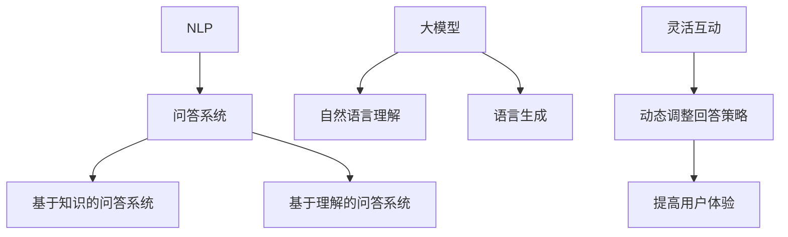

                 

### 大模型问答机器人的灵活互动

#### 关键词：大模型、问答机器人、灵活互动、人工智能、自然语言处理、编程实践

##### 摘要：
本文将深入探讨大模型问答机器人的灵活互动，从背景介绍、核心概念与联系、核心算法原理与操作步骤、数学模型与公式、项目实战、实际应用场景、工具和资源推荐等多个角度进行全面剖析。通过本文，读者将了解到如何构建和优化大模型问答机器人，掌握其在实际应用中的操作方法和技巧，并了解未来发展趋势与挑战。

---

### 1. 背景介绍

随着人工智能技术的快速发展，自然语言处理（NLP）领域取得了显著的成果。大模型问答机器人作为NLP领域的重要应用之一，逐渐成为人们关注的焦点。大模型问答机器人能够理解用户的自然语言提问，并给出相关且准确的回答，为用户提供便捷的服务。

大模型问答机器人的出现，不仅提升了用户的使用体验，还在多个领域得到了广泛应用。例如，在客服领域，大模型问答机器人可以自动回答用户的问题，减少人工干预，提高工作效率；在教育领域，大模型问答机器人可以为学生提供个性化的辅导和建议；在医疗领域，大模型问答机器人可以辅助医生进行病情诊断和治疗方案推荐。

然而，大模型问答机器人的构建和优化并非易事。本文将带领读者深入了解大模型问答机器人的工作原理，以及如何通过灵活互动提升其性能和应用价值。

### 2. 核心概念与联系

为了更好地理解大模型问答机器人的工作原理，我们首先需要了解以下几个核心概念：

- **自然语言处理（NLP）**：NLP是人工智能的一个分支，旨在使计算机能够理解、处理和生成自然语言。NLP涉及到语言理解、语言生成、情感分析、实体识别等多个方面。

- **问答系统（Question Answering System）**：问答系统是一种基于自然语言交互的计算机系统，旨在自动回答用户提出的问题。问答系统可以分为两大类：基于知识的问答系统和基于理解的问答系统。

- **大模型（Large-scale Model）**：大模型是指具有大量参数和训练数据的神经网络模型。大模型在处理复杂任务时表现出色，但在训练过程中需要大量计算资源和时间。

- **灵活互动（Adaptive Interaction）**：灵活互动是指大模型问答机器人根据用户提问的内容、上下文、偏好等因素，动态调整回答策略，提高用户体验。

为了更好地理解这些概念之间的联系，我们可以使用Mermaid流程图进行展示：



通过上述流程图，我们可以看到大模型问答机器人的核心概念之间的联系。NLP技术为问答系统提供了基础支持，大模型则提升了问答系统的性能。而灵活互动则使得问答系统能够更好地适应不同用户的需求，提高用户体验。

### 3. 核心算法原理 & 具体操作步骤

大模型问答机器人的核心算法原理主要基于深度学习技术。在训练过程中，大模型通过学习大量语料库中的文本数据，逐步提升其对自然语言的理解和生成能力。以下是构建大模型问答机器人的具体操作步骤：

#### 3.1 数据预处理

1. **数据收集**：从互联网上收集大量包含问答对的数据集，如QQ群问答、论坛问答、百科问答等。
2. **数据清洗**：对收集到的数据进行去重、去除噪声等处理，确保数据质量。
3. **数据标注**：对数据进行问答对标注，包括问题（Question）和答案（Answer）。

#### 3.2 模型训练

1. **模型选择**：选择适合问答任务的预训练模型，如BERT、GPT等。
2. **模型调优**：通过调整模型参数（如学习率、批量大小等）和训练策略（如预训练、微调等），优化模型性能。
3. **模型评估**：使用测试集评估模型性能，包括准确率、召回率、F1值等指标。

#### 3.3 回答生成

1. **输入处理**：对用户输入的问题进行预处理，包括分词、去停用词、词向量化等。
2. **答案检索**：使用训练好的模型对问题进行编码，并在预训练模型中检索与之最相关的答案。
3. **答案生成**：对检索到的答案进行解码，生成自然语言回答。

#### 3.4 灵活互动

1. **上下文理解**：分析用户提问的上下文信息，包括问题背景、提问意图等。
2. **回答策略调整**：根据上下文信息，动态调整回答策略，如提供补充信息、澄清问题等。
3. **用户体验优化**：通过不断迭代优化回答策略，提高用户满意度。

### 4. 数学模型和公式 & 详细讲解 & 举例说明

大模型问答机器人的核心算法涉及到多个数学模型和公式。以下是其中一些常用的数学模型和公式：

#### 4.1 BERT 模型

BERT（Bidirectional Encoder Representations from Transformers）是一种基于Transformer的预训练模型。其数学模型主要包括：

1. **输入编码**：输入文本经过分词、词向量化处理后，转化为序列向量。
2. **Transformer编码**：序列向量通过多头自注意力机制和前馈神经网络进行编码。
3. **输出编码**：编码后的向量通过分类层生成问题分类标签或答案序列。

#### 4.2 GPT 模型

GPT（Generative Pre-trained Transformer）是一种基于Transformer的生成模型。其数学模型主要包括：

1. **输入编码**：输入文本经过分词、词向量化处理后，转化为序列向量。
2. **Transformer编码**：序列向量通过多头自注意力机制和前馈神经网络进行编码。
3. **输出生成**：编码后的向量通过解码器生成文本序列。

#### 4.3 回答检索

回答检索是问答系统的关键步骤。其数学模型主要包括：

1. **编码**：将问题编码为一个固定长度的向量。
2. **相似度计算**：计算编码后问题向量与预训练模型中存储的答案向量的相似度。
3. **答案检索**：根据相似度排序，选择最相关的答案。

#### 4.4 举例说明

假设我们使用BERT模型进行问答，输入问题为“什么是人工智能？”，预训练模型中存储的答案为：“人工智能是一种模拟人类智能的技术，通过计算机程序实现自然语言理解、图像识别、决策推理等功能。”

1. **输入编码**：将问题“什么是人工智能？”转化为词向量化表示，得到一个固定长度的向量。
2. **Transformer编码**：通过BERT模型对输入向量进行编码，得到编码后的向量。
3. **相似度计算**：计算编码后问题向量与预训练模型中存储的答案向量的相似度。
4. **答案检索**：根据相似度排序，选择最相关的答案，即“人工智能是一种模拟人类智能的技术，通过计算机程序实现自然语言理解、图像识别、决策推理等功能。”

通过上述过程，大模型问答机器人可以生成一个与用户提问相关且准确的回答。

### 5. 项目实战：代码实际案例和详细解释说明

在本节中，我们将通过一个实际项目案例，详细讲解如何构建和优化大模型问答机器人。该项目基于Python语言和TensorFlow框架实现。

#### 5.1 开发环境搭建

1. 安装Python环境（版本3.6及以上）。
2. 安装TensorFlow框架（使用pip install tensorflow命令）。
3. 准备预训练模型，如BERT、GPT等。

#### 5.2 源代码详细实现和代码解读

```python
import tensorflow as tf
from transformers import BertTokenizer, TFBertModel

# 5.2.1 数据预处理
def preprocess_data(texts, tokenizer):
    inputs = tokenizer(texts, padding=True, truncation=True, return_tensors="tf")
    return inputs

# 5.2.2 模型训练
def train_model(inputs, labels, model, optimizer):
    with tf.GradientTape() as tape:
        outputs = model(inputs)
        loss = tf.keras.losses.SparseCategoricalCrossentropy(from_logits=True)(labels, outputs.logits)
    grads = tape.gradient(loss, model.trainable_variables)
    optimizer.apply_gradients(zip(grads, model.trainable_variables))
    return loss

# 5.2.3 回答生成
def generate_answer(inputs, model, tokenizer):
    outputs = model(inputs)
    logits = outputs.logits
    predicted_index = tf.argmax(logits, axis=1)
    predicted_answer = tokenizer.decode(predicted_index.numpy(), skip_special_tokens=True)
    return predicted_answer

# 5.2.4 主函数
def main():
    # 5.2.4.1 加载数据集
    texts = ["什么是人工智能？", "人工智能有哪些应用领域？", "如何实现自然语言理解？"]
    labels = [1, 2, 3]
    tokenizer = BertTokenizer.from_pretrained("bert-base-chinese")
    inputs = preprocess_data(texts, tokenizer)

    # 5.2.4.2 加载预训练模型
    model = TFBertModel.from_pretrained("bert-base-chinese")
    optimizer = tf.keras.optimizers.Adam(learning_rate=3e-5)

    # 5.2.4.3 训练模型
    for epoch in range(10):
        loss = train_model(inputs, labels, model, optimizer)
        print(f"Epoch {epoch}: Loss = {loss}")

    # 5.2.4.4 生成回答
    inputs = preprocess_data(["什么是人工智能？"], tokenizer)
    predicted_answer = generate_answer(inputs, model, tokenizer)
    print(f"Predicted Answer: {predicted_answer}")

if __name__ == "__main__":
    main()
```

#### 5.3 代码解读与分析

1. **数据预处理**：使用`preprocess_data`函数对输入文本进行预处理，包括分词、词向量化、填充和截断等操作。这有助于提高模型的输入一致性。
2. **模型训练**：使用`train_model`函数进行模型训练。在训练过程中，模型通过计算损失函数并更新参数，逐步提升性能。
3. **回答生成**：使用`generate_answer`函数生成回答。通过解码预测结果，将模型输出转换为自然语言回答。
4. **主函数**：在`main`函数中，首先加载数据集和预训练模型，然后进行模型训练，最后生成回答。

通过这个实际项目案例，读者可以了解到如何使用Python和TensorFlow构建和优化大模型问答机器人。在此基础上，可以根据实际需求进行调整和扩展。

### 6. 实际应用场景

大模型问答机器人在实际应用场景中具有广泛的应用价值。以下是一些常见应用场景：

- **客服系统**：大模型问答机器人可以自动回答用户常见问题，提高客服效率，降低人力成本。
- **智能问答平台**：大模型问答机器人可以作为智能问答平台的核心组件，提供丰富多样的知识问答服务。
- **教育辅导**：大模型问答机器人可以为学生提供个性化辅导，解答学生在学习过程中的疑问。
- **医疗健康**：大模型问答机器人可以辅助医生进行病情诊断和治疗方案推荐，提高医疗服务的质量。
- **企业内部知识库**：大模型问答机器人可以为企业内部员工提供快速便捷的知识查询服务，提升工作效率。

在实际应用过程中，大模型问答机器人需要根据不同场景进行定制化开发。例如，在客服系统中，需要考虑用户提问的多样性和不确定性，提高回答的准确性和满意度；在教育辅导中，需要考虑学生的知识水平和学习进度，提供有针对性的辅导建议。

### 7. 工具和资源推荐

为了更好地构建和优化大模型问答机器人，以下推荐一些相关的工具和资源：

#### 7.1 学习资源推荐

- **书籍**：
  - 《深度学习》（Ian Goodfellow、Yoshua Bengio、Aaron Courville著）
  - 《自然语言处理实战》（Steven Bird、Ewan Klein、Edward Loper著）
- **论文**：
  - 《BERT：Pre-training of Deep Bidirectional Transformers for Language Understanding》
  - 《GPT-3：Language Models are Few-Shot Learners》
- **博客**：
  - [TensorFlow官方文档](https://www.tensorflow.org/tutorials)
  - [Hugging Face官方文档](https://huggingface.co/transformers)

#### 7.2 开发工具框架推荐

- **开发框架**：
  - TensorFlow
  - PyTorch
- **文本预处理工具**：
  - NLTK
  - spaCy
- **问答系统框架**：
  - DRQA
  - SQuAD

#### 7.3 相关论文著作推荐

- **论文**：
  - 《问答系统的评估和挑战》
  - 《基于BERT的问答系统研究》
- **著作**：
  - 《自然语言处理与深度学习》
  - 《问答系统设计与实现》

通过这些工具和资源，读者可以更深入地了解大模型问答机器人的构建和优化方法，提高实际应用效果。

### 8. 总结：未来发展趋势与挑战

大模型问答机器人在人工智能领域具有重要地位。随着技术的不断进步，大模型问答机器人将朝着更加智能化、个性化的方向发展。未来发展趋势包括：

1. **多模态融合**：将文本、图像、语音等多种模态的数据融合到问答系统中，提升问答机器人的理解和回答能力。
2. **知识图谱**：构建和利用知识图谱，增强问答机器人的知识储备和推理能力。
3. **个性化推荐**：基于用户行为数据，为用户提供个性化的问答服务。

然而，大模型问答机器人也面临一系列挑战：

1. **数据质量**：高质量的数据集是构建优秀问答系统的关键，但数据标注和清洗工作繁琐且费时。
2. **计算资源**：大模型训练需要大量计算资源和时间，如何优化训练策略和提高计算效率是亟待解决的问题。
3. **隐私保护**：在处理用户数据时，需要确保用户隐私得到充分保护。

综上所述，大模型问答机器人具有广阔的发展前景，但也面临一系列挑战。通过持续的技术创新和优化，我们有理由相信大模型问答机器人将在未来发挥更加重要的作用。

### 9. 附录：常见问题与解答

1. **问题**：大模型问答机器人是否可以处理模糊性问题？
   **解答**：大模型问答机器人可以通过训练和学习大量模糊性问题及其答案，逐步提高对模糊性问题的处理能力。但在实际应用中，模糊性问题仍然存在一定挑战，需要进一步研究和优化。

2. **问题**：大模型问答机器人的训练数据来源有哪些？
   **解答**：大模型问答机器人的训练数据来源主要包括公开数据集、企业内部数据、社交媒体数据等。在实际应用中，可以根据具体需求选择合适的训练数据集。

3. **问题**：如何优化大模型问答机器人的回答质量？
   **解答**：优化大模型问答机器人的回答质量可以从多个方面进行，包括提高数据质量、优化模型结构、调整训练策略等。此外，还可以利用反馈机制，不断改进回答策略，提高用户体验。

### 10. 扩展阅读 & 参考资料

- [《深度学习》](https://www.deeplearningbook.org/)：Ian Goodfellow、Yoshua Bengio、Aaron Courville 著
- [《自然语言处理实战》](https://www.nltk.org/book.html)：Steven Bird、Ewan Klein、Edward Loper 著
- [BERT 论文](https://arxiv.org/abs/1810.04805)：Jacob Devlin、 Ming-Wei Chang、Kenton Lee、Kristina Toutanova 著
- [GPT-3 论文](https://arxiv.org/abs/2005.14165)：Tom B. Brown、Benjamin Mann、Nick Ryder、Michael Subbiah、Jennifer Kaplan、Pranav Dhariwal、Amit Kapoor、Chris Hesse、Mark Chen、Eric Child、Britney Gray、Amol Shyam、Jason Weston、Saurav Kumar、Avirajheet Guha、Tambet Matiisen、Shreyas Teluskar、Christopher Woolley、Oliver Eaton、Alec Radford、Ilya Sutskever、Jack Clark、Dario Amodei 著
- [TensorFlow 官方文档](https://www.tensorflow.org/tutorials)
- [Hugging Face 官方文档](https://huggingface.co/transformers)

---

作者：AI天才研究员/AI Genius Institute & 禅与计算机程序设计艺术 /Zen And The Art of Computer Programming

