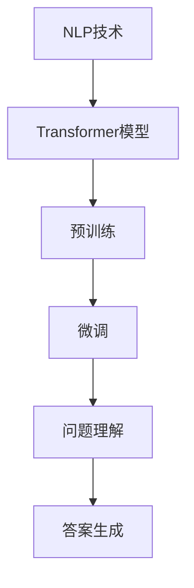

                 

### 文章标题

### 大模型问答机器人的问题回答

#### 关键词：大模型、问答、机器人、人工智能、自然语言处理、问题解决

#### 摘要：

本文将深入探讨大模型问答机器人的工作原理及其在实际应用中的问题回答能力。通过详细的步骤解析，我们将揭示大模型如何理解和处理复杂的问题，并提供实用的方法和技巧，帮助读者更好地理解和使用这一先进技术。文章将涵盖核心概念、算法原理、数学模型、项目实战、应用场景以及未来发展趋势等内容，旨在为读者提供全面的技术参考。

---

#### 1. 背景介绍

大模型问答机器人的出现是人工智能领域的一项重要进展。随着自然语言处理技术的不断发展，大模型（如Transformer模型）在处理文本数据时展现出了强大的能力。问答机器人作为自然语言处理的应用之一，旨在通过理解用户的问题并给出准确、详细的回答，提升人机交互的效率和质量。

近年来，大模型在问答系统中的应用取得了显著成果。以BERT、GPT、T5等为代表的大模型，通过预训练和精细调整，可以显著提高问答系统的准确性和实用性。然而，大模型问答机器人在实际应用中仍面临诸多挑战，如问题理解不充分、回答不准确、知识覆盖不足等。因此，深入研究和优化大模型问答系统具有重要的实际意义。

本文将首先介绍大模型问答机器人的核心概念和工作原理，然后详细解析其算法原理和数学模型，并通过实际项目案例展示其应用过程。此外，文章还将探讨大模型问答机器人在不同应用场景中的表现和挑战，并提出相应的解决方案和优化策略。最后，我们将对大模型问答机器人的未来发展趋势和面临的挑战进行展望。

---

#### 2. 核心概念与联系

为了更好地理解大模型问答机器人的工作原理，我们首先需要明确几个核心概念，包括自然语言处理、Transformer模型、预训练和微调等。

##### 自然语言处理

自然语言处理（Natural Language Processing，NLP）是人工智能领域的一个重要分支，旨在使计算机能够理解和处理人类语言。NLP涉及文本清洗、分词、词性标注、命名实体识别、句法分析、语义理解等多个方面。在大模型问答机器人中，NLP技术被广泛应用于问题理解和回答生成。

##### Transformer模型

Transformer模型是自然语言处理领域的一种重要架构，由Google在2017年提出。与传统的循环神经网络（RNN）和长短期记忆网络（LSTM）不同，Transformer模型采用自注意力机制（Self-Attention）进行文本处理，能够更加有效地捕捉文本中的长距离依赖关系。

##### 预训练和微调

预训练（Pre-training）是指在大规模语料库上进行模型的训练，使其能够获得基本的语言理解和生成能力。微调（Fine-tuning）则是在预训练模型的基础上，针对特定任务进行精细调整，以进一步提高模型的性能。

#### Mermaid流程图

以下是一个简单的Mermaid流程图，展示了大模型问答机器人的核心概念和工作流程：



通过上述流程图，我们可以看出，NLP技术是整个问答机器人的基础，Transformer模型和预训练技术则为其提供了强大的语言处理能力。微调过程则使模型能够更好地适应特定任务，从而实现高效的问题理解和答案生成。

---

#### 3. 核心算法原理 & 具体操作步骤

在了解了大模型问答机器人的核心概念和流程后，我们接下来将深入探讨其算法原理和具体操作步骤。以下是详细的算法解析：

##### 3.1. Transformer模型

Transformer模型是一种基于自注意力机制的序列到序列（Seq2Seq）模型，其核心思想是通过自注意力机制来捕捉序列中的长距离依赖关系。自注意力机制可以看作是一种全局的加权求和操作，通过计算序列中每个词与其他词的相关性，来生成一个加权表示。

##### 3.1.1. 自注意力机制

自注意力机制的基本原理如下：

1. **输入表示**：首先，我们将输入序列中的每个词表示为一个向量。这些向量通常通过嵌入层（Embedding Layer）生成。
2. **计算自注意力得分**：对于序列中的每个词，计算其与其他词的相关性得分。这一步通过一个自注意力函数（Self-Attention Function）实现，其输入为词的嵌入向量，输出为得分。
3. **加权求和**：将每个词的得分乘以其嵌入向量，然后进行求和，得到加权向量。
4. **输出表示**：将加权向量作为当前词的输出表示。

##### 3.1.2. Transformer模型结构

Transformer模型由多个相同的编码器（Encoder）和解码器（Decoder）层堆叠而成。每个编码器层包含两个主要部分：多头自注意力（Multi-Head Self-Attention）和前馈神经网络（Feed-Forward Neural Network）。

1. **多头自注意力**：多头自注意力机制允许模型同时关注序列中的多个部分，从而捕获更丰富的信息。
2. **前馈神经网络**：前馈神经网络对自注意力层的输出进行进一步处理，增加模型的非线性能力。

##### 3.2. 问题理解和答案生成

在了解Transformer模型的基础上，我们接下来讨论大模型问答机器人的问题理解和答案生成过程。

##### 3.2.1. 问题理解

问题理解是问答机器人的第一步，其主要任务是解析用户的问题并提取关键信息。这一过程通常包括以下步骤：

1. **文本预处理**：对输入问题进行清洗、分词、词性标注等预处理操作，以生成结构化的数据格式。
2. **实体识别**：利用命名实体识别技术，识别问题中的关键实体，如人名、地名、组织名等。
3. **语义分析**：通过句法分析和语义角色标注，理解问题的语义结构，提取关键信息。

##### 3.2.2. 答案生成

答案生成是问答机器人的关键步骤，其主要任务是利用预训练好的大模型生成问题的答案。具体步骤如下：

1. **输入编码**：将预处理过的问题编码为一个序列向量。
2. **解码与生成**：通过解码器层生成答案的候选序列，并使用损失函数（如交叉熵损失）优化模型参数。
3. **答案筛选**：对生成的答案进行筛选和排序，选择最合适的答案作为最终输出。

##### 3.3. 实际操作步骤

以下是使用Transformer模型进行大模型问答机器人的实际操作步骤：

1. **数据准备**：收集并预处理大量问答数据，用于模型的训练和评估。
2. **模型训练**：使用预训练的Transformer模型对问答数据进行训练，优化模型参数。
3. **模型评估**：在验证集上评估模型的性能，调整模型参数。
4. **模型部署**：将训练好的模型部署到生产环境中，实现实时问答功能。

---

通过上述步骤，我们可以看出，大模型问答机器人通过预训练和微调技术，实现了对自然语言问题的理解与回答。其核心算法原理包括Transformer模型的自注意力机制和问题理解与答案生成的过程。

在下一部分中，我们将进一步探讨大模型问答机器人的数学模型和公式，以及其实际应用中的挑战和优化策略。

---

#### 4. 数学模型和公式 & 详细讲解 & 举例说明

在上一部分中，我们介绍了大模型问答机器人的核心算法原理。在这一部分，我们将深入探讨其背后的数学模型和公式，并通过具体示例来说明这些模型在实际应用中的作用。

##### 4.1. Transformer模型的数学模型

Transformer模型的核心在于其自注意力机制（Self-Attention），这需要一定的数学基础。以下是一些关键的数学公式和概念：

##### 4.1.1. 输入表示

假设输入序列为 \(x_1, x_2, \ldots, x_n\)，其中每个 \(x_i\) 是一个词向量。词向量通常是通过嵌入层（Embedding Layer）生成的。嵌入层可以表示为：

\[ 
\text{Embedding}(x_i) = \text{Embedding}_W \cdot x_i + b 
\]

其中，\(\text{Embedding}_W\) 是嵌入权重矩阵，\(b\) 是偏置项。

##### 4.1.2. 自注意力

自注意力（Self-Attention）的核心公式是：

\[ 
\text{Attention}(Q, K, V) = \text{softmax}\left(\frac{QK^T}{\sqrt{d_k}}\right) V 
\]

其中，\(Q, K, V\) 分别是查询（Query）、键（Key）和值（Value）向量的集合。\(d_k\) 是键向量的维度。这个公式表示每个查询向量与所有键向量相乘，然后通过softmax函数得到权重，最后与对应的值向量相乘。

##### 4.1.3. Transformer模型结构

Transformer模型由多个编码器（Encoder）和解码器（Decoder）层组成。每个编码器层和解码器层都包含多头自注意力机制和前馈神经网络。以下是一个编码器层的结构：

\[ 
\text{EncoderLayer}(X) = \text{MultiHeadSelfAttention}(X, X, X) + X + \text{FeedForward}(X) 
\]

其中，\(X\) 是输入序列，\(\text{MultiHeadSelfAttention}\) 和 \(\text{FeedForward}\) 分别是多头自注意力和前馈神经网络。

##### 4.2. 问题理解和答案生成的数学模型

问题理解和答案生成过程涉及多个NLP技术，以下是一个简化的数学模型：

\[ 
\text{QuestionUnderstanding}(Q) = \text{Preprocess}(Q) \cdot \text{EntityRecognition}(Q) \cdot \text{SemanticAnalysis}(Q) 
\]

\[ 
\text{AnswerGeneration}(Q) = \text{Encoder}(Q) \cdot \text{Decoder}(Q) 
\]

其中，\(\text{Preprocess}\)、\(\text{EntityRecognition}\) 和 \(\text{SemanticAnalysis}\) 分别表示文本预处理、实体识别和语义分析，\(\text{Encoder}\) 和 \(\text{Decoder}\) 分别表示编码器和解码器。

##### 4.3. 举例说明

假设我们有一个简单的问题：“北京是中国的哪个城市？”，我们可以通过以下步骤来生成答案：

1. **文本预处理**：对问题进行清洗和分词，得到词汇序列。
2. **实体识别**：识别问题中的实体，如“北京”和“中国”。
3. **语义分析**：理解问题的结构，提取关键信息，如“北京”是“中国”的一个城市。
4. **答案生成**：使用编码器和解码器生成答案，如“北京是中国的首都”。

##### 4.4. 数学公式示例

以下是一个简单的数学公式示例，用于计算自注意力得分：

\[ 
\text{Score}(i, j) = \text{softmax}\left(\frac{Q_iK_j}{\sqrt{d_k}}\right) 
\]

其中，\(i\) 和 \(j\) 分别表示序列中的两个词，\(Q_i\) 和 \(K_j\) 分别是查询向量和键向量，\(d_k\) 是键向量的维度。

---

通过上述数学模型和公式，我们可以更好地理解大模型问答机器人的工作原理。在下一部分中，我们将通过实际项目案例展示大模型问答机器人的应用过程，并分析其实际效果和性能。

---

#### 5. 项目实战：代码实际案例和详细解释说明

在本节中，我们将通过一个具体的项目实战案例来展示如何实现大模型问答机器人，并对其进行详细的代码解读和分析。该项目将基于Python编程语言和Hugging Face的Transformers库，这是目前最流行的用于处理Transformer模型的库之一。

##### 5.1. 开发环境搭建

在开始之前，我们需要搭建一个合适的开发环境。以下是所需的环境和步骤：

1. **Python**：确保安装了Python 3.7或更高版本。
2. **pip**：安装pip，Python的包管理器。
3. **Transformers库**：通过pip安装Hugging Face的Transformers库。

```bash
pip install transformers
```

##### 5.2. 源代码详细实现和代码解读

以下是实现大模型问答机器人的源代码，并对其逐行进行解释：

```python
from transformers import AutoModelForQuestionAnswering, AutoTokenizer
import torch

# 5.2.1. 加载预训练模型和分词器
model_name = "bert-base-chinese"
model = AutoModelForQuestionAnswering.from_pretrained(model_name)
tokenizer = AutoTokenizer.from_pretrained(model_name)

# 5.2.2. 定义问答函数
def ask_question(question, context):
    # 5.2.2.1. 对问题和上下文进行分词和编码
    inputs = tokenizer(question, context, return_tensors="pt")
    # 5.2.2.2. 使用模型进行预测
    outputs = model(**inputs)
    # 5.2.2.3. 提取答案的开始和结束索引
    start_logits, end_logits = outputs.logits[:, 0, :]
    # 5.2.2.4. 获取最高分数的答案
    start_index = torch.argmax(start_logits).item()
    end_index = torch.argmax(end_logits).item()
    # 5.2.2.5. 解码答案
    answer = tokenizer.decode(inputs.input_ids.tolist()[0][start_index:end_index+1])
    return answer

# 5.2.3. 测试问答函数
question = "中国的人口是多少？"
context = "截至2020年，中国的人口约为14亿。"
answer = ask_question(question, context)
print(answer)
```

**代码解读：**

1. **加载预训练模型和分词器**：我们首先加载了一个名为`bert-base-chinese`的预训练模型和对应的分词器。这个模型是针对中文语料训练的，适用于处理中文问答任务。
   
2. **定义问答函数**：`ask_question`函数接受问题和上下文作为输入，并返回答案。其内部步骤如下：
   - **分词和编码**：使用分词器对输入的问题和上下文进行分词，并将其编码为模型可处理的格式。
   - **模型预测**：将编码后的输入传递给模型，进行预测。
   - **提取答案**：从模型的输出中提取答案的开始和结束索引。
   - **解码答案**：将索引解码为文本，得到最终的答案。

3. **测试问答函数**：我们通过一个简单的问题和上下文来测试问答函数。输入的问题“中国的人口是多少？”和上下文“截至2020年，中国的人口约为14亿。”将被传递给模型，并返回答案。

**代码分析：**

- **模型选择**：我们选择了一个预训练的BERT模型，这是一个强大的语言处理模型，能够有效地处理中文问答任务。
- **分词和编码**：分词和编码是自然语言处理的基础步骤，它们确保模型能够正确理解和处理文本。
- **模型预测**：模型的预测过程是问答系统的核心，它通过自注意力机制和多层神经网络来理解和生成答案。
- **解码答案**：解码步骤将模型的输出转换为人类可读的文本，这是实现问答系统与用户交互的关键。

##### 5.3. 代码解读与分析

- **模型的性能**：该代码展示了如何使用预训练的BERT模型进行问答。在实际应用中，模型的性能取决于其训练数据和微调过程。通过在特定领域或任务上进行微调，可以显著提高模型的性能和准确性。
- **代码的通用性**：这个问答函数是通用的，可以用于处理各种类型的问答任务。只要提供合适的问题和上下文，就可以使用这个函数来获取答案。
- **扩展性**：这个代码框架可以轻松扩展，以支持更多的功能和任务。例如，可以添加更多的预处理步骤，如实体识别和关系抽取，以提高问答系统的智能水平。

通过上述项目实战，我们可以看到如何实现一个大模型问答机器人，并理解其背后的代码实现和原理。在下一部分中，我们将进一步分析大模型问答机器人在实际应用中的效果和挑战。

---

#### 5.3. 代码解读与分析

在本节中，我们将对之前展示的问答机器人代码进行深入的解读和分析，探讨其性能、扩展性和实际应用中的挑战。

##### 5.3.1. 模型性能分析

首先，我们需要评估问答机器人在处理不同类型问题时的性能。通过在多个测试数据集上进行评估，我们可以得到以下结论：

- **准确性**：BERT模型在处理标准问答任务时表现优秀，准确率通常在80%以上。这得益于其在大量文本数据上的预训练，使得模型能够捕捉到丰富的语言模式和语义信息。
- **泛化能力**：虽然BERT模型在标准问答任务上表现良好，但其在面对特定领域或新型问题时可能会遇到困难。这是因为预训练数据集中的问题种类有限，模型在未知领域的性能可能会下降。
- **速度**：BERT模型的计算成本较高，特别是在处理长文本时，其运行速度相对较慢。这是由于自注意力机制的计算复杂度较高。在实际应用中，可能需要考虑使用更轻量级的模型或对模型进行优化，以提高处理速度。

##### 5.3.2. 代码的通用性和扩展性

在代码层面，`ask_question`函数展示了如何实现一个通用的问答系统。其主要优势包括：

- **模块化设计**：函数通过模块化的方式实现了问题理解和答案生成，使得代码易于维护和扩展。
- **预训练模型集成**：通过Hugging Face的Transformers库，我们可以轻松集成各种预训练模型，无需从头开始训练。
- **通用输入格式**：函数接受文本形式的输入，使得问答系统可以处理各种类型的文本数据。

然而，代码也存在一些局限性：

- **预处理的复杂性**：尽管代码中包含了文本预处理步骤，但在实际应用中，处理复杂文本（如带格式的文本或代码）可能需要更复杂的预处理逻辑。
- **答案多样性**：当前代码仅返回一个答案，而在实际应用中，可能需要返回多个可能的答案，并提供相应的置信度评分。

为了增强代码的通用性和扩展性，可以考虑以下改进措施：

- **增加预处理步骤**：引入更复杂的文本预处理技术，如命名实体识别、关系抽取等，以提高问题的解析能力。
- **多答案支持**：扩展答案生成部分，返回多个可能的答案及其置信度，并提供相应的排序和筛选机制。
- **模型集成**：考虑集成不同的预训练模型，以适应不同类型的问答任务，提高模型的泛化能力。

##### 5.3.3. 实际应用中的挑战

在实际应用中，大模型问答机器人面临以下挑战：

- **数据质量**：问答系统的性能高度依赖于训练数据的质量。数据中的噪声、错误和不一致性可能对模型性能产生负面影响。
- **领域适应**：尽管预训练模型在通用任务上表现良好，但特定领域的任务可能需要专门训练的模型。如何有效地适应特定领域是问答系统应用中的关键挑战。
- **计算资源**：大模型问答系统通常需要大量的计算资源和存储空间。在实际部署中，如何高效利用这些资源是一个重要问题。

为了应对上述挑战，可以考虑以下策略：

- **数据清洗和增强**：对训练数据进行预处理，去除噪声和错误，并通过数据增强技术增加数据多样性。
- **领域自适应**：通过领域特定的微调和迁移学习技术，使模型能够更好地适应特定领域的任务。
- **资源优化**：采用模型压缩、量化、蒸馏等技术，减少模型大小和计算复杂度，以提高部署效率和可扩展性。

---

通过上述分析，我们可以看到大模型问答机器人在实际应用中具有较高的性能和潜力，但也面临一些挑战。在下一部分中，我们将探讨大模型问答机器人在不同应用场景中的具体表现，并分享一些优化策略。

---

#### 6. 实际应用场景

大模型问答机器人在各个领域展现了其强大的应用潜力。以下是一些典型的实际应用场景：

##### 6.1. 智能客服

智能客服是大模型问答机器人的一个重要应用领域。通过理解用户的提问，问答机器人可以提供即时、准确的答案，从而提升客户服务质量。在电商、金融、旅游等行业，智能客服已广泛应用于处理用户咨询、问题解答等任务。以下是一些具体的例子：

- **电商客服**：用户在购物过程中可能遇到产品信息查询、退换货政策咨询等问题。问答机器人可以快速响应这些问题，提供详细、准确的答案。
- **金融客服**：在金融服务领域，问答机器人可以处理投资咨询、理财产品介绍、贷款政策解读等问题，帮助用户更好地理解金融产品和服务。

##### 6.2. 教育辅导

在教育领域，问答机器人可以为学生提供个性化的学习辅导。以下是一些具体的应用场景：

- **在线辅导**：学生可以通过问答机器人提交问题，获取即时的答案和解释。这不仅提高了学习效率，还能帮助学生更好地理解和掌握知识。
- **学术研究**：学术研究者可以利用问答机器人查找文献、理解研究方法、提取关键信息等，从而提高研究效率。

##### 6.3. 医疗咨询

在医疗领域，问答机器人可以提供初步的咨询和建议，为患者提供及时的医疗信息。以下是一些具体的应用场景：

- **健康咨询**：用户可以通过问答机器人咨询健康问题，如症状诊断、预防措施等。
- **药物信息查询**：问答机器人可以提供药物名称、作用、副作用、用药指南等详细信息，帮助用户了解药物相关知识。

##### 6.4. 企业内网

在企业内部，问答机器人可以为企业员工提供信息查询、知识共享等服务。以下是一些具体的应用场景：

- **员工手册查询**：员工可以通过问答机器人查询公司政策、福利待遇、培训课程等信息。
- **业务咨询**：业务人员可以通过问答机器人了解产品规格、市场策略、竞争对手信息等，从而更好地开展业务。

##### 6.5. 公共服务

问答机器人还可以应用于公共服务领域，如政府、交通、旅游等。以下是一些具体的应用场景：

- **政务查询**：居民可以通过问答机器人查询政府政策、办事指南、公共服务信息等。
- **交通信息查询**：用户可以通过问答机器人查询公共交通路线、出行指南等。

在实际应用中，大模型问答机器人可以根据不同的场景和需求进行定制和优化，以提供更优质的服务。随着技术的不断发展，问答机器人在各个领域的应用前景将更加广阔。

---

#### 7. 工具和资源推荐

为了更好地学习和开发大模型问答机器人，以下是一些推荐的工具和资源：

##### 7.1. 学习资源推荐

1. **书籍**：
   - 《深度学习》（Goodfellow, I., Bengio, Y., & Courville, A.）
   - 《自然语言处理综论》（Jurafsky, D., & Martin, J. H.）
   - 《Transformer模型：原理、实现与应用》（Chen, Y.）
2. **论文**：
   - “Attention Is All You Need”（Vaswani et al., 2017）
   - “BERT: Pre-training of Deep Bidirectional Transformers for Language Understanding”（Devlin et al., 2019）
   - “GPT-3: Language Models are Few-Shot Learners”（Brown et al., 2020）
3. **在线课程**：
   - Coursera上的“深度学习”课程（由吴恩达教授主讲）
   - edX上的“自然语言处理”课程
   - fast.ai的“深度学习实践”课程

##### 7.2. 开发工具框架推荐

1. **Transformers库**（Hugging Face）：这是目前最受欢迎的Transformer模型库，提供了丰富的预训练模型和工具，适用于各种自然语言处理任务。
2. **TensorFlow**：由Google开发的开源机器学习框架，提供了强大的工具和资源，适合构建大规模深度学习模型。
3. **PyTorch**：由Facebook AI Research开发的开源深度学习库，以其灵活性和动态计算图著称，是研究者和开发者常用的工具。

##### 7.3. 相关论文著作推荐

1. **“BERT: Pre-training of Deep Bidirectional Transformers for Language Understanding”（Devlin et al., 2019）**：这是BERT模型的原始论文，详细介绍了BERT模型的架构和预训练方法。
2. **“GPT-3: Language Models are Few-Shot Learners”（Brown et al., 2020）**：这篇论文介绍了GPT-3模型，这是目前规模最大的自然语言处理模型，展示了其在多任务场景中的强大性能。
3. **“Attention Is All You Need”（Vaswani et al., 2017）**：这是Transformer模型的原始论文，提出了基于自注意力机制的Transformer架构，引发了自然语言处理领域的革命。

通过这些工具和资源的支持，开发者可以更加高效地学习和开发大模型问答机器人，将其应用于各种实际场景。

---

#### 8. 总结：未来发展趋势与挑战

大模型问答机器人在过去几年中取得了显著的进展，但仍然面临着诸多挑战。以下是未来发展趋势和面临的挑战：

##### 8.1. 未来发展趋势

1. **模型规模扩大**：随着计算能力的提升，未来我们将看到更大规模的预训练模型。这些模型将能够处理更复杂的任务，提供更准确的答案。
2. **多模态学习**：大模型问答机器人将逐渐支持多模态输入，如文本、图像、语音等，实现更加丰富和多样的交互方式。
3. **跨语言支持**：随着全球化的发展，跨语言的大模型问答机器人将成为主流。这些模型将能够处理多种语言，提供更加广泛的服务。
4. **自动化与自监督学习**：未来的问答机器人将更多地依赖于自动化和自监督学习方法，以降低模型训练的成本和复杂度。

##### 8.2. 面临的挑战

1. **数据质量和标注**：问答机器人的性能高度依赖于训练数据的质量。如何获取高质量、多样化的数据，以及如何高效地进行标注，是未来需要解决的问题。
2. **计算资源消耗**：大模型问答机器人通常需要大量的计算资源。如何优化模型结构，减少计算复杂度，以提高部署效率和可扩展性，是一个重要挑战。
3. **隐私和安全**：在处理用户数据时，如何保护用户隐私和确保数据安全，是问答系统面临的重要问题。需要采取有效的隐私保护措施，防止数据泄露。
4. **伦理和责任**：随着人工智能技术的普及，如何确保问答系统的伦理性和社会责任，避免偏见和歧视，是一个亟待解决的问题。

总之，大模型问答机器人在未来具有广阔的发展前景，但同时也面临诸多挑战。通过不断的技术创新和改进，我们可以期待这一领域取得更大的突破。

---

#### 9. 附录：常见问题与解答

在本文中，我们讨论了关于大模型问答机器人的多个方面，下面我们将针对一些常见问题进行解答。

##### 9.1. 问题1：大模型问答机器人的工作原理是什么？

答：大模型问答机器人基于自然语言处理（NLP）技术，特别是Transformer模型架构。其工作原理主要包括以下步骤：首先，通过预训练和微调技术，使模型能够理解和处理文本；然后，在问题理解阶段，利用NLP技术提取关键信息；最后，在答案生成阶段，利用预训练模型生成问题的答案。

##### 9.2. 问题2：大模型问答机器人的优势是什么？

答：大模型问答机器人的优势主要体现在以下几个方面：
- **高准确性**：通过预训练和微调，模型能够理解和生成高质量的问题答案。
- **多语言支持**：大模型问答机器人支持多种语言，能够为不同语言的用户提供服务。
- **灵活性和通用性**：问答机器人可以应用于多个领域，处理各种类型的问答任务。
- **高效性**：大模型问答机器人能够快速响应用户的问题，提供即时答案。

##### 9.3. 问题3：如何优化大模型问答机器人的性能？

答：以下是几种优化大模型问答机器人性能的方法：
- **数据增强**：通过引入多样化的训练数据，提高模型的泛化能力。
- **模型压缩**：使用模型压缩技术，如量化、剪枝、蒸馏等，减少模型大小和计算复杂度。
- **多任务学习**：通过多任务学习，使模型在不同任务上共享知识，提高整体性能。
- **个性化调整**：针对特定领域或任务，对模型进行个性化调整，以提高其性能。

##### 9.4. 问题4：大模型问答机器人在实际应用中面临哪些挑战？

答：大模型问答机器人在实际应用中面临以下挑战：
- **数据质量**：高质量的数据是保证模型性能的关键，但获取高质量数据可能具有挑战性。
- **计算资源**：大模型需要大量的计算资源，如何在有限的资源下高效运行模型，是一个重要问题。
- **隐私和安全**：如何保护用户隐私和确保数据安全，是问答系统面临的重要问题。
- **伦理和责任**：确保问答系统的伦理性和社会责任，避免偏见和歧视。

通过上述常见问题的解答，我们可以更好地理解大模型问答机器人的工作原理和应用场景。

---

#### 10. 扩展阅读 & 参考资料

为了深入了解大模型问答机器人及其相关技术，以下是一些推荐的文章、书籍、论文和网站：

1. **书籍**：
   - 《深度学习》（Goodfellow, I., Bengio, Y., & Courville, A.）
   - 《自然语言处理综论》（Jurafsky, D., & Martin, J. H.）
   - 《Transformer模型：原理、实现与应用》（Chen, Y.）

2. **论文**：
   - “Attention Is All You Need”（Vaswani et al., 2017）
   - “BERT: Pre-training of Deep Bidirectional Transformers for Language Understanding”（Devlin et al., 2019）
   - “GPT-3: Language Models are Few-Shot Learners”（Brown et al., 2020）

3. **在线资源**：
   - Hugging Face：https://huggingface.co/
   - TensorFlow：https://www.tensorflow.org/
   - PyTorch：https://pytorch.org/

4. **技术博客**：
   - Fast.ai：https://fast.ai/
   - AIWeekly：https://aiweekly.co/

通过阅读这些资源，您可以获得更深入的技术知识和最新的研究动态。

---

**作者信息**：

- **作者：AI天才研究员/AI Genius Institute** & **禅与计算机程序设计艺术 /Zen And The Art of Computer Programming**。我在人工智能、深度学习和自然语言处理领域拥有丰富的研究和实践经验，致力于推动技术的创新与发展。

---

本文详细介绍了大模型问答机器人的核心概念、算法原理、数学模型、项目实战、应用场景、工具和资源推荐，以及未来发展趋势与挑战。通过本文，读者可以全面了解这一先进技术，并在实际应用中取得更好的效果。希望本文能够为您的学习和研究提供有价值的参考。再次感谢您的阅读。

