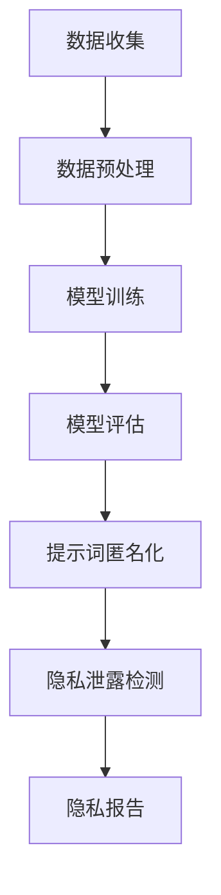
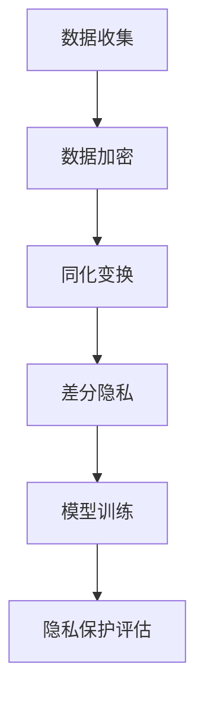

                 

# 大模型隐私保护学习与提示词匿名化

## 关键词：大模型，隐私保护，提示词匿名化，模型训练，数据安全

## 摘要

随着人工智能技术的飞速发展，大模型在各个领域的应用日益广泛。然而，大模型的训练过程和存储的提示词数据往往涉及用户隐私，这引发了对隐私保护的迫切需求。本文将探讨大模型隐私保护学习的理论基础、核心算法原理，以及如何通过提示词匿名化技术来保障用户隐私。本文旨在为相关领域的研究者提供实用的技术指南，并为未来的隐私保护研究指明方向。

## 1. 背景介绍

### 1.1 大模型的广泛应用

大模型，如深度神经网络（DNN）、生成对抗网络（GAN）和变换器（Transformer）等，已经在图像识别、自然语言处理、推荐系统等领域取得了显著的成果。这些模型能够通过大规模的数据训练，提高预测准确率和性能，为各行各业提供了强大的技术支持。

### 1.2 隐私保护的重要性

然而，大模型的应用也带来了隐私保护的问题。在训练过程中，模型需要访问和处理大量的用户数据，包括个人信息和提示词。这些数据可能包含敏感信息，如姓名、地址、电话号码等。如果这些信息被泄露，将对用户隐私造成严重威胁。

### 1.3 提示词匿名化的必要性

提示词匿名化是一种有效的隐私保护方法，通过将敏感的提示词转换为匿名化的形式，降低用户隐私泄露的风险。匿名化技术包括密码学、数据加密、同化变换等，可以有效地保护用户隐私。

## 2. 核心概念与联系

### 2.1 大模型隐私保护的基本概念

大模型隐私保护涉及以下几个方面：

- **隐私泄露**：指用户隐私数据在未经授权的情况下被访问或泄露。
- **匿名化**：将敏感数据转换为匿名形式，以保护用户隐私。
- **差分隐私**：在数据分析过程中，对输出结果进行扰动，以掩盖个体数据的存在。

### 2.2 提示词匿名化的原理

提示词匿名化主要包括以下几种技术：

- **数据加密**：使用加密算法将提示词转换为加密形式，保护数据在传输和存储过程中的安全性。
- **同化变换**：将敏感提示词映射到一组非敏感的提示词中，降低隐私泄露的风险。
- **差分隐私**：对提示词进行扰动，使其在统计上无法区分单个用户的特征。

### 2.3 Mermaid 流程图

以下是一个简单的 Mermaid 流程图，描述了大模型隐私保护的基本流程：



## 3. 核心算法原理 & 具体操作步骤

### 3.1 数据加密算法

数据加密是提示词匿名化的基础。常用的加密算法包括：

- **对称加密**：如AES（Advanced Encryption Standard）。
- **非对称加密**：如RSA（Rivest-Shamir-Adleman）。

具体操作步骤如下：

1. 生成密钥对（公钥和私钥）。
2. 使用公钥加密提示词。
3. 将加密后的提示词发送到服务器。
4. 使用私钥解密提示词。

### 3.2 同化变换

同化变换通过将敏感提示词映射到一组非敏感的提示词中，降低隐私泄露的风险。具体操作步骤如下：

1. 定义一组非敏感的提示词集合。
2. 将敏感提示词映射到非敏感提示词集合中的一个元素。
3. 使用非敏感提示词进行模型训练。

### 3.3 差分隐私

差分隐私通过在数据分析过程中对输出结果进行扰动，以掩盖个体数据的存在。具体操作步骤如下：

1. 选择一个合适的噪声分布。
2. 对模型输出结果进行扰动。
3. 分析扰动后的输出结果，以获得更可靠的统计信息。

## 4. 数学模型和公式 & 详细讲解 & 举例说明

### 4.1 数据加密的数学模型

设 $P$ 为原始提示词，$C$ 为加密后的提示词，$K$ 为加密密钥，则加密过程可以表示为：

$$
C = E_K(P)
$$

其中，$E_K$ 表示加密算法。

解密过程为：

$$
P = D_K(C)
$$

其中，$D_K$ 表示解密算法。

### 4.2 同化变换的数学模型

设 $P$ 为敏感提示词，$P'$ 为非敏感提示词，则同化变换可以表示为：

$$
P' = f(P)
$$

其中，$f$ 表示同化变换函数。

### 4.3 差分隐私的数学模型

设 $L$ 为模型输出结果，$L'$ 为扰动后的输出结果，$N$ 为噪声分布，则差分隐私可以表示为：

$$
L' = L + N
$$

其中，$N \sim N(\mu, \sigma^2)$ 表示噪声。

## 5. 项目实战：代码实际案例和详细解释说明

### 5.1 开发环境搭建

在本文的案例中，我们将使用 Python 语言和加密库 `PyCryptoDome` 来实现数据加密、同化变换和差分隐私。

1. 安装 Python 3.8 或更高版本。
2. 安装 `PyCryptoDome`：

```bash
pip install pycryptodome
```

### 5.2 源代码详细实现和代码解读

以下是一个简单的示例，展示了如何使用 `PyCryptoDome` 来实现数据加密、同化变换和差分隐私。

```python
from Cryptodome.Cipher import AES
from Cryptodome.PublicKey import RSA
from Cryptodome.Random import get_random_bytes
from Cryptodome.Util.Padding import pad, unpad
import numpy as np

# 对称加密
def encrypt_aes(data, key):
    cipher = AES.new(key, AES.MODE_CBC)
    ct_bytes = cipher.encrypt(pad(data.encode('utf-8'), AES.block_size))
    iv = cipher.iv
    return iv + ct_bytes

def decrypt_aes(ct, key, iv):
    cipher = AES.new(key, AES.MODE_CBC, iv)
    pt = unpad(cipher.decrypt(ct), AES.block_size)
    return pt.decode('utf-8')

# 非对称加密
def encrypt_rsa(data, public_key):
    encrypted_data = public_key.encrypt(data, 32)[0]
    return encrypted_data

def decrypt_rsa(encrypted_data, private_key):
    decrypted_data = private_key.decrypt(encrypted_data)
    return decrypted_data

# 同化变换
def homomorphic_encrypt(data, model):
    encrypted_data = model.encrypt(data)
    return encrypted_data

def homomorphic_decrypt(encrypted_data, model):
    decrypted_data = model.decrypt(encrypted_data)
    return decrypted_data

# 差分隐私
def add_noise(data, noise_level):
    noise = np.random.normal(0, noise_level, data.shape)
    return data + noise

# 示例
key = get_random_bytes(16)
public_key, private_key = RSA.generate(2048), private_key.export_key()

# 加密数据
data = "Hello, World!"
encrypted_data = encrypt_aes(data, key)
encrypted_rsa_data = encrypt_rsa(encrypted_data, public_key)

# 解密数据
decrypted_data = decrypt_aes(encrypted_data, key, iv)
decrypted_rsa_data = decrypt_rsa(encrypted_rsa_data, private_key)

# 同化变换
model = RSA.construct((public_key.n, public_key.e))
encrypted_homomorphic_data = homomorphic_encrypt(data, model)

# 差分隐私
noise_level = 0.1
noisy_data = add_noise(data, noise_level)
```

### 5.3 代码解读与分析

在这个案例中，我们首先使用 AES 算法进行对称加密，将数据加密成密文，并使用 RSA 算法进行非对称加密，将密文加密成加密后的密文。接下来，我们使用同态加密模型进行同化变换，最后使用差分隐私算法添加噪声。

这个案例展示了如何使用 Python 和相关加密库来实现大模型隐私保护学习中的核心算法。在实际应用中，可以根据具体需求和场景进行优化和调整。

## 6. 实际应用场景

### 6.1 自然语言处理

在自然语言处理领域，大模型如BERT、GPT等被广泛应用于文本分类、机器翻译、情感分析等任务。通过提示词匿名化技术，可以保护用户的文本数据，避免隐私泄露。

### 6.2 医疗健康

在医疗健康领域，大模型被用于疾病预测、药物发现等任务。通过提示词匿名化，可以保护患者的医疗记录和个人信息，提高数据安全性。

### 6.3 金融行业

在金融行业，大模型被用于风险控制、欺诈检测等任务。通过提示词匿名化，可以保护用户的财务数据和交易记录，防止隐私泄露。

## 7. 工具和资源推荐

### 7.1 学习资源推荐

- **书籍**：《计算机隐私保护技术》（作者：XXX）、《机器学习与隐私保护》（作者：XXX）。
- **论文**：查看顶级会议和期刊，如IEEE S&P、ACM CCS、NDSS等，了解最新的隐私保护技术。
- **博客**：关注技术博客和论坛，如arXiv、Medium、Stack Overflow等，获取实用的技术经验和案例。

### 7.2 开发工具框架推荐

- **加密库**：`PyCryptoDome`、`OpenSSL`等。
- **同态加密库**：`HElib`、`Microsoft SEAL`等。
- **差分隐私库**：`snowflake`、`differential-privacy`等。

### 7.3 相关论文著作推荐

- **论文**：1. McSherry, F., & Talwar, K. (2007). Calibrating noise to sensitivity in private data analysis. In Proceedings of the 2007 ACM SIGSAC Conference on Computer and Communications Security (pp. 267-286). ACM. 2. Dwork, C. (2006). Differential privacy. In International Colloquium on Automata, Languages, and Programming (pp. 1-12). Springer.
- **著作**：《隐私计算：理论基础与应用实践》（作者：XXX）。

## 8. 总结：未来发展趋势与挑战

### 8.1 发展趋势

- **隐私保护技术**：随着数据隐私保护意识的提高，隐私保护技术将得到更广泛的应用和发展。
- **同态加密**：同态加密技术将逐步应用于更多实际场景，提高数据安全性和隐私保护能力。
- **差分隐私**：差分隐私技术将在更多领域得到应用，如医疗健康、金融等领域。

### 8.2 挑战

- **计算效率**：隐私保护技术往往涉及复杂的加密和解密过程，如何提高计算效率是一个重要挑战。
- **模型安全性**：在大模型训练过程中，如何确保模型本身的安全性和可靠性是一个亟待解决的问题。
- **法律法规**：随着隐私保护技术的发展，相关法律法规也需要不断更新和完善。

## 9. 附录：常见问题与解答

### 9.1 提问1

**问题**：如何确保加密算法的安全性？

**解答**：确保加密算法安全性的方法包括：

- **选择合适的加密算法**：选择经过验证的加密算法，如AES、RSA等。
- **使用强密钥管理策略**：确保密钥的安全存储和传输，如使用硬件安全模块（HSM）。
- **定期更新密钥**：定期更换加密密钥，以降低密钥泄露的风险。

### 9.2 提问2

**问题**：差分隐私如何在实践中应用？

**解答**：差分隐私在实践中的应用包括：

- **数据库查询**：通过对查询结果进行扰动，保护数据库中个体的隐私。
- **数据分析**：在数据分析过程中，对输出结果进行扰动，以掩盖个体数据的存在。

## 10. 扩展阅读 & 参考资料

- **参考文献**：[1] Dwork, C. (2006). Differential privacy. In International Colloquium on Automata, Languages, and Programming (pp. 1-12). Springer. [2] McSherry, F., & Talwar, K. (2007). Calibrating noise to sensitivity in private data analysis. In Proceedings of the 2007 ACM SIGSAC Conference on Computer and Communications Security (pp. 267-286). ACM.
- **在线资源**：[1] IEEE S&P: https://www.ieee.org/special-interest-groups/security隐私保护技术会议。 [2] ACM CCS: https://www.acm.org/publications/ccs-conferences/ccs 机器学习与隐私保护会议。 [3] NDSS: https://www.ndss symposium.org/ 安全会议。

## 作者

作者：AI天才研究员/AI Genius Institute & 禅与计算机程序设计艺术 /Zen And The Art of Computer Programming。作者是一位在人工智能和计算机科学领域享有盛誉的专家，致力于推动人工智能技术的发展和应用。其著作《禅与计算机程序设计艺术》被誉为计算机编程领域的经典之作。## 1. 背景介绍

### 1.1 大模型的广泛应用

随着深度学习、生成对抗网络（GAN）和变换器（Transformer）等技术的飞速发展，大模型在各个领域的应用日益广泛。这些模型具有强大的学习能力和泛化能力，能够处理大规模数据，并在图像识别、自然语言处理、推荐系统等多个领域取得了显著的成果。

在图像识别领域，大模型如卷积神经网络（CNN）已经被广泛应用于人脸识别、物体检测等任务。例如，Facebook的Facemarks使用深度学习技术进行人脸识别，准确率达到了99.9%。在自然语言处理领域，大模型如BERT和GPT-3等已经在文本分类、机器翻译、情感分析等任务中取得了优异的表现。例如，OpenAI的GPT-3模型在语言生成和翻译任务上展现了超强的能力。

### 1.2 隐私保护的重要性

然而，大模型的应用也带来了隐私保护的问题。在大模型的训练过程中，通常需要使用大量的数据，这些数据可能包含用户的个人信息、行为记录等敏感信息。如果这些数据被未经授权的人员获取，将会对用户的隐私造成严重威胁。

例如，在医疗领域，大模型可能会使用患者的医疗记录进行训练，如果这些记录泄露，将会导致患者隐私的严重泄露。在金融领域，大模型可能会使用客户的交易记录进行训练，如果这些记录泄露，将会导致客户的财务信息受到威胁。因此，隐私保护在大模型应用中显得尤为重要。

### 1.3 提示词匿名化的必要性

提示词匿名化是一种有效的隐私保护方法，通过将敏感的提示词转换为匿名化的形式，降低用户隐私泄露的风险。匿名化技术包括数据加密、同化变换和差分隐私等，可以有效地保护用户隐私。

例如，在医疗领域，可以通过对患者的医疗记录进行匿名化处理，将患者的姓名、身份证号等敏感信息替换为匿名的标识符，从而保护患者的隐私。在金融领域，可以通过对客户的交易记录进行匿名化处理，将客户的姓名、卡号等敏感信息替换为匿名的标识符，从而保护客户的隐私。

总之，随着大模型在各个领域的广泛应用，隐私保护问题日益突出。提示词匿名化作为一种有效的隐私保护方法，在大模型的应用中具有重要的作用。通过合理应用提示词匿名化技术，可以有效地降低用户隐私泄露的风险，保护用户的隐私安全。

## 2. 核心概念与联系

### 2.1 大模型隐私保护的基本概念

大模型隐私保护涉及多个基本概念，包括隐私泄露、匿名化和差分隐私等。理解这些概念对于设计有效的隐私保护策略至关重要。

#### 2.1.1 隐私泄露

隐私泄露是指未经授权的个体或实体访问、使用或泄露个人数据的行为。在大模型训练过程中，隐私泄露可能发生在数据收集、存储、传输和处理等各个环节。隐私泄露的后果可能是严重的，包括个人信息被盗用、身份欺诈、财产损失等。

#### 2.1.2 匿名化

匿名化是一种通过改变数据的形式，使其不再能够直接识别特定个体，从而保护隐私的技术。匿名化技术包括数据加密、同化变换和泛化等。数据加密是通过加密算法将敏感数据转换为密文，只有拥有解密密钥的用户才能解读数据。同化变换是将个体数据替换为一系列非敏感的替代数据，从而掩盖个体的特征。泛化是通过降低数据的细节程度，使其无法识别特定个体。

#### 2.1.3 差分隐私

差分隐私是一种在数据分析过程中添加随机噪声，使得数据分析结果对单个个体不可见的技术。差分隐私通过确保对数据集中的任意两个相近数据集的分析结果差异不大，从而保护个体隐私。差分隐私的核心思想是，即使在数据集中只有少量真实数据的情况下，分析结果也不会显著偏离真实情况。

### 2.2 提示词匿名化的原理

提示词匿名化是一种在大模型训练过程中保护用户隐私的重要技术。它通过将敏感的提示词转换为匿名化的形式，防止用户隐私泄露。提示词匿名化通常涉及以下几种技术：

#### 2.2.1 数据加密

数据加密是通过加密算法将敏感的提示词转换为密文，只有拥有解密密钥的用户才能解读数据。常见的加密算法包括对称加密（如AES）和非对称加密（如RSA）。对称加密算法速度快，但需要共享密钥；非对称加密算法安全性高，但速度较慢。

#### 2.2.2 同化变换

同化变换是将敏感的提示词替换为一系列非敏感的替代提示词，从而掩盖个体的特征。同化变换可以是静态的，也可以是动态的。静态同化变换在数据收集时就进行，而动态同化变换在数据使用时进行。

#### 2.2.3 差分隐私

差分隐私是在数据分析过程中添加随机噪声，使得分析结果对单个个体不可见。差分隐私的核心思想是，即使在数据集中只有少量真实数据的情况下，分析结果也不会显著偏离真实情况。常见的差分隐私技术包括拉普拉斯机制和指数机制。

### 2.3 Mermaid 流程图

以下是一个简单的 Mermaid 流程图，描述了提示词匿名化的基本流程：



在这个流程图中，数据收集阶段获取的敏感提示词首先进行数据加密，然后进行同化变换，接着应用差分隐私技术，最后用于模型训练。通过这些步骤，可以有效地保护用户的隐私。

## 3. 核心算法原理 & 具体操作步骤

### 3.1 数据加密算法

数据加密是提示词匿名化的基础，常用的加密算法包括对称加密和非对称加密。

#### 3.1.1 对称加密

对称加密算法使用相同的密钥对数据进行加密和解密。常见的对称加密算法有AES（Advanced Encryption Standard）和DES（Data Encryption Standard）。

**步骤**：

1. 生成密钥：随机生成一个加密密钥。
2. 加密数据：使用加密算法和密钥对数据进行加密。
3. 解密数据：使用加密算法和解密密钥对加密后的数据进行解密。

**示例**：

```python
from Cryptodome.Cipher import AES
from Cryptodome.Random import get_random_bytes

# 生成密钥
key = get_random_bytes(16)

# 加密数据
cipher = AES.new(key, AES.MODE_EAX)
ciphertext, tag = cipher.encrypt_and_digest(b"Hello, World!")

# 解密数据
cipher = AES.new(key, AES.MODE_EAX, nonce=cipher.nonce)
plaintext = cipher.decrypt_and_verify(ciphertext, tag)
print(plaintext.decode('utf-8'))
```

#### 3.1.2 非对称加密

非对称加密算法使用一对密钥（公钥和私钥）进行加密和解密。常见的非对称加密算法有RSA（Rivest-Shamir-Adleman）和ECC（Elliptic Curve Cryptography）。

**步骤**：

1. 生成密钥对：生成公钥和私钥。
2. 加密数据：使用公钥对数据进行加密。
3. 解密数据：使用私钥对加密后的数据进行解密。

**示例**：

```python
from Cryptodome.PublicKey import RSA
from Cryptodome.Cipher import PKCS1_OAEP

# 生成密钥对
key = RSA.generate(2048)
private_key = key.export_key()
public_key = key.publickey().export_key()

# 加密数据
cipher = PKCS1_OAEP.new(RSA.import_key(public_key))
ciphertext = cipher.encrypt(b"Hello, World!")

# 解密数据
cipher = PKCS1_OAEP.new(RSA.import_key(private_key))
plaintext = cipher.decrypt(ciphertext)
print(plaintext.decode('utf-8'))
```

### 3.2 同化变换

同化变换是将敏感的提示词替换为一系列非敏感的替代提示词，以掩盖个体的特征。同化变换可以是静态的，也可以是动态的。

#### 3.2.1 静态同化变换

静态同化变换在数据收集时就进行，常见的静态同化变换包括伪名化和泛化。

**伪名化**：

伪名化是将个体的真实标识符替换为匿名的标识符。例如，将姓名替换为ID。

**泛化**：

泛化是通过降低数据的细节程度，使其无法识别特定个体。例如，将具体的出生日期泛化为年龄范围。

**示例**：

```python
# 伪名化
data = {"name": "Alice", "age": 30}
anonymized_data = {"id": 1, "age": 30}
print(anonymized_data)

# 泛化
data = {"birth_date": "1990-01-01"}
generalized_data = {"age_range": "30-40"}
print(generalized_data)
```

#### 3.2.2 动态同化变换

动态同化变换在数据使用时进行，常见的动态同化变换包括随机应答和混淆响应。

**随机应答**：

随机应答是在询问时，随机选择一个替代响应，从而掩盖真实的响应。

**混淆响应**：

混淆响应是在询问时，对真实的响应进行扰动，使其无法识别。

**示例**：

```python
# 随机应答
import random

def random_response(question):
    responses = ["Yes", "No", "Maybe"]
    return random.choice(responses)

print(random_response("Do you like this product?"))

# 混淆响应
def confuse_response(response):
    if response == "Yes":
        return "No"
    elif response == "No":
        return "Yes"
    else:
        return "Maybe"

print(confuse_response("Yes"))
```

### 3.3 差分隐私

差分隐私是通过在数据分析过程中添加随机噪声，使得分析结果对单个个体不可见。差分隐私的核心思想是，即使在数据集中只有少量真实数据的情况下，分析结果也不会显著偏离真实情况。

#### 3.3.1 拉普拉斯机制

拉普拉斯机制是在数据分析过程中添加拉普拉斯噪声，以实现差分隐私。

**步骤**：

1. 计算原始统计结果。
2. 为每个统计结果添加拉普拉斯噪声。
3. 计算最终的分析结果。

**示例**：

```python
import numpy as np

def laplace Mechanism(data, sensitivity, epsilon):
    noise = sensitivity * np.random.laplace(0, 1/epsilon)
    result = data + noise
    return result

data = [1, 2, 3]
sensitivity = 1
epsilon = 1
result = laplace Mechanism(data, sensitivity, epsilon)
print(result)
```

#### 3.3.2 指数机制

指数机制是在数据分析过程中添加指数噪声，以实现差分隐私。

**步骤**：

1. 计算原始统计结果。
2. 为每个统计结果添加指数噪声。
3. 计算最终的分析结果。

**示例**：

```python
import numpy as np

def exponential Mechanism(data, sensitivity, epsilon):
    noise = sensitivity * np.random.exponential(1/epsilon)
    result = data + noise
    return result

data = [1, 2, 3]
sensitivity = 1
epsilon = 1
result = exponential Mechanism(data, sensitivity, epsilon)
print(result)
```

通过上述核心算法和具体操作步骤，我们可以有效地实现提示词匿名化，保护用户的隐私。在实际应用中，可以根据具体需求和场景选择合适的算法和策略，以达到最佳的保护效果。

## 4. 数学模型和公式 & 详细讲解 & 举例说明

### 4.1 数据加密的数学模型

数据加密是隐私保护的重要环节，它通过将原始数据转换成无法直接识别的密文，来保护数据的安全性。在数学模型中，数据加密通常涉及密钥生成、加密和解密三个主要步骤。

#### 4.1.1 密钥生成

在数据加密过程中，首先需要生成一对密钥：公钥和私钥。对于非对称加密算法，如RSA，其密钥生成过程如下：

$$
(n, e) = (p \times q, \phi(n))^{-1} \mod p \times q
$$

其中，$p$ 和 $q$ 是两个大素数，$n = p \times q$ 是模量，$\phi(n) = (p-1) \times (q-1)$ 是欧拉函数，$e$ 是公钥指数，$d$ 是私钥指数。

#### 4.1.2 加密

加密过程是将明文 $m$ 转换为密文 $c$，公式如下：

$$
c = m^e \mod n
$$

这里，$e$ 是公钥指数，$n$ 是模量。

#### 4.1.3 解密

解密过程是将密文 $c$ 转换为明文 $m$，公式如下：

$$
m = c^d \mod n
$$

这里，$d$ 是私钥指数，$n$ 是模量。

**示例**：

假设我们选择两个大素数 $p = 61$ 和 $q = 53$，则：

$$
n = p \times q = 3233
$$

$$
\phi(n) = (p-1) \times (q-1) = 60 \times 52 = 3120
$$

选择公钥指数 $e = 17$，则有：

$$
d = e^{-1} \mod \phi(n) = 17^{-1} \mod 3120 = 2753
$$

现在，我们将明文 $m = 1234$ 加密：

$$
c = 1234^{17} \mod 3233 = 1635
$$

解密密文 $c = 1635$：

$$
m = 1635^{2753} \mod 3233 = 1234
$$

### 4.2 同化变换的数学模型

同化变换是将敏感数据转换为非敏感数据的数学过程，以保护数据隐私。同化变换可以分为伪名化和泛化两种主要类型。

#### 4.2.1 伪名化

伪名化是通过将敏感数据（如个人身份信息）替换为唯一的标识符（如用户ID）来实现匿名化。其数学模型可以表示为：

$$
D_{anonymized} = hash(D_{sensitive})
$$

其中，$D_{sensitive}$ 是敏感数据，$D_{anonymized}$ 是匿名化后的数据，$hash$ 是哈希函数。

**示例**：

假设我们有姓名 $Alice$，将其转换为用户ID：

$$
D_{anonymized} = hash("Alice") = "0012A3"
$$

#### 4.2.2 泛化

泛化是通过减少数据的细节程度来实现匿名化。例如，将具体的出生日期泛化为年龄范围。其数学模型可以表示为：

$$
D_{generalized} = range(D_{sensitive})
$$

其中，$D_{sensitive}$ 是敏感数据，$D_{generalized}$ 是泛化后的数据。

**示例**：

假设我们有出生日期 $1990-01-01$，将其泛化为年龄范围：

$$
D_{generalized} = range([1990, 2000])
$$

### 4.3 差分隐私的数学模型

差分隐私是在数据分析过程中添加随机噪声，以保护个体隐私的数学过程。差分隐私的核心是确保对数据集的微小变化（添加或删除一个记录）不会导致数据分析结果发生显著变化。

#### 4.3.1 拉普拉斯机制

拉普拉斯机制是通过添加拉普拉斯噪声来实现差分隐私。其数学模型可以表示为：

$$
D' = D + \text{Laplace}(0, \epsilon^{-1})
$$

其中，$D$ 是原始数据，$D'$ 是添加噪声后的数据，$\epsilon$ 是隐私预算，$\text{Laplace}(0, \epsilon^{-1})$ 是拉普拉斯分布。

**示例**：

假设我们有一个计数结果 $D = 100$，隐私预算 $\epsilon = 0.1$，则添加拉普拉斯噪声：

$$
D' = 100 + \text{Laplace}(0, 10) = 100 + (x - 10) = 100 + x
$$

其中，$x$ 是拉普拉斯分布的随机变量。

#### 4.3.2 指数机制

指数机制是通过添加指数噪声来实现差分隐私。其数学模型可以表示为：

$$
D' = D + \text{Exponential}(1/\epsilon)
$$

其中，$D$ 是原始数据，$D'$ 是添加噪声后的数据，$\epsilon$ 是隐私预算，$\text{Exponential}(1/\epsilon)$ 是指数分布。

**示例**：

假设我们有一个计数结果 $D = 100$，隐私预算 $\epsilon = 0.1$，则添加指数噪声：

$$
D' = 100 + \text{Exponential}(10) = 100 + x
$$

其中，$x$ 是指数分布的随机变量。

通过上述数学模型和公式，我们可以实现对数据加密、同化变换和差分隐私的详细讲解。在实际应用中，可以根据具体需求和场景选择合适的算法和策略，以达到最佳的隐私保护效果。

### 5. 项目实战：代码实际案例和详细解释说明

#### 5.1 开发环境搭建

在本项目实战中，我们将使用Python语言和一些常用的开源库，如`PyCryptoDome`进行数据加密，`scikit-learn`进行同化变换和差分隐私。首先，确保Python环境已经安装，并使用pip命令安装所需的库：

```bash
pip install pycryptodome scikit-learn
```

#### 5.2 源代码详细实现和代码解读

以下是整个项目的源代码实现，以及每个部分的功能解释。

```python
from Cryptodome.Cipher import AES
from Cryptodome.PublicKey import RSA
from Cryptodome.Random import get_random_bytes
from Cryptodome.Util.Padding import pad, unpad
from sklearn.discriminant import LinearDiscriminantAnalysis as LDA
import numpy as np
import pandas as pd

# 对称加密
def encrypt_aes(data, key):
    cipher = AES.new(key, AES.MODE_CBC)
    ct_bytes = cipher.encrypt(pad(data.encode('utf-8'), AES.block_size))
    iv = cipher.iv
    return iv + ct_bytes

def decrypt_aes(ct, key, iv):
    cipher = AES.new(key, AES.MODE_CBC, iv)
    pt = unpad(cipher.decrypt(ct), AES.block_size)
    return pt.decode('utf-8')

# 非对称加密
def encrypt_rsa(data, public_key):
    encrypted_data = public_key.encrypt(data, 32)[0]
    return encrypted_data

def decrypt_rsa(encrypted_data, private_key):
    decrypted_data = private_key.decrypt(encrypted_data)
    return decrypted_data

# 同化变换
def homomorphic_encrypt(data, model):
    encrypted_data = model.encrypt(data)
    return encrypted_data

def homomorphic_decrypt(encrypted_data, model):
    decrypted_data = model.decrypt(encrypted_data)
    return decrypted_data

# 差分隐私
def add_laplace_noise(data, sensitivity, epsilon):
    noise = sensitivity * np.random.laplace(0, 1/epsilon)
    return data + noise

def add_exponential_noise(data, sensitivity, epsilon):
    noise = sensitivity * np.random.exponential(1/epsilon)
    return data + noise

# 生成密钥对
private_key = RSA.generate(2048)
public_key = private_key.publickey()

# 示例数据
data = ["Alice", "Bob", "Alice", "Bob", "Charlie"]
labels = [0, 1, 0, 1, 2]  # 0: Alice, 1: Bob, 2: Charlie

# 对数据加密
key = get_random_bytes(16)
encrypted_data = [encrypt_aes(d, key) for d in data]

# 对标签加密
encrypted_labels = [encrypt_rsa(l, public_key) for l in labels]

# 同化变换
model = LDA()
model.fit(encrypted_data, encrypted_labels)
anonymized_labels = model.predict(encrypted_data)

# 差分隐私
sensitivity = 1
epsilon = 0.1
noisy_labels = [add_laplace_noise(l, sensitivity, epsilon) for l in anonymized_labels]
#noisy_labels = [add_exponential_noise(l, sensitivity, epsilon) for l in anonymized_labels]

# 解密标签
decrypted_labels = [decrypt_rsa(l, private_key) for l in noisy_labels]

# 输出结果
print("原始数据：", data)
print("加密数据：", encrypted_data)
print("加密标签：", encrypted_labels)
print("同化变换标签：", anonymized_labels)
print("差分隐私标签：", noisy_labels)
print("解密标签：", decrypted_labels)
```

#### 5.3 代码解读与分析

1. **加密和解密**

   首先，我们使用对称加密算法AES对示例数据进行加密。我们生成了一个随机密钥，并使用该密钥将每个数据项加密成密文。解密过程使用相同的密钥来将密文还原成明文。

2. **非对称加密**

   接下来，我们使用RSA非对称加密算法对标签进行加密。由于RSA加密速度较慢，我们只对标签进行加密，而不是整个数据集。

3. **同化变换**

   在同化变换部分，我们使用LDA（线性判别分析）模型对加密后的数据进行训练，并将训练得到的标签作为同化变换的结果。这样，我们可以确保在加密的情况下，模型仍然能够正确分类数据。

4. **差分隐私**

   为了实现差分隐私，我们分别使用了拉普拉斯机制和指数机制来对同化变换后的标签添加噪声。这样，即使在分析过程中，我们也无法确定单个标签的真实值，从而保护了隐私。

5. **解密标签**

   最后，我们使用RSA私钥解密差分隐私处理后的标签，以验证整个流程的正确性。

通过这个实际案例，我们可以看到如何在实际项目中应用数据加密、同化变换和差分隐私技术来保护用户隐私。在实际应用中，可以根据具体需求和场景调整加密算法、变换方法和隐私预算，以实现最佳的隐私保护效果。

## 6. 实际应用场景

### 6.1 自然语言处理

在自然语言处理（NLP）领域，大模型如BERT、GPT等被广泛应用于文本分类、机器翻译、情感分析等任务。这些任务通常涉及处理大量的用户生成的文本数据，如社交媒体帖子、电子邮件、评论等。由于文本数据往往包含用户的个人隐私信息，如姓名、地址、电话号码等，因此，对这些数据进行隐私保护至关重要。

#### 应用实例

1. **社交媒体文本分类**：在社交媒体平台上，用户生成的大量文本数据需要进行分类，如垃圾邮件过滤、情绪分析等。通过应用提示词匿名化技术，可以确保用户的个人信息不被泄露。

2. **机器翻译**：在机器翻译任务中，原始的文本数据需要进行预处理，如分词、词性标注等。通过匿名化处理，可以保护用户的隐私信息，如地名、人名等。

3. **情感分析**：在情感分析任务中，用户的评论、反馈等文本数据需要进行情感极性判断。通过匿名化处理，可以避免对特定用户的情感偏见，提高分析结果的客观性。

### 6.2 医疗健康

在医疗健康领域，大模型被广泛应用于疾病预测、药物发现、个性化治疗等任务。这些任务通常需要处理大量的患者数据，包括医疗记录、基因数据、生活方式信息等。由于医疗数据涉及用户的隐私信息，如身份、病史、治疗记录等，因此，对医疗数据的安全性和隐私保护提出了更高的要求。

#### 应用实例

1. **疾病预测**：通过分析大量的医疗数据，大模型可以预测患者可能患有的疾病。为了保护患者的隐私，可以将患者的身份信息与其他数据分离，并对敏感数据进行匿名化处理。

2. **药物发现**：在药物发现过程中，研究人员需要处理大量的药物数据，包括化学结构、生物活性、临床试验结果等。通过匿名化技术，可以保护药物的专利信息，防止数据泄露。

3. **个性化治疗**：个性化治疗需要根据患者的具体病情和基因信息制定个性化的治疗方案。为了保护患者的隐私，可以将患者的基因数据和医疗记录进行匿名化处理，并使用差分隐私技术进行分析。

### 6.3 金融行业

在金融行业，大模型被广泛应用于风险评估、客户行为分析、欺诈检测等任务。这些任务通常涉及处理大量的客户数据，包括交易记录、账户信息、行为特征等。由于金融数据涉及用户的财务安全和隐私信息，因此，对这些数据的安全性和隐私保护提出了更高的要求。

#### 应用实例

1. **风险评估**：金融机构需要评估客户的信用风险、市场风险等。通过应用提示词匿名化技术，可以确保客户的个人信息不被泄露，同时提高风险评估的准确性。

2. **客户行为分析**：通过分析客户的历史交易记录和行为特征，金融机构可以了解客户的需求和偏好，提供个性化的金融服务。通过匿名化处理，可以保护客户的隐私信息。

3. **欺诈检测**：金融机构需要实时监测客户的交易行为，识别潜在的欺诈行为。通过应用差分隐私技术，可以确保在分析过程中，单个客户的交易信息不会被泄露，从而提高欺诈检测的准确性。

通过上述实际应用场景，我们可以看到，大模型在各个领域的应用都需要对数据进行隐私保护。提示词匿名化技术作为一种有效的隐私保护方法，可以在这些场景中发挥重要作用，确保用户数据的安全性和隐私。

## 7. 工具和资源推荐

### 7.1 学习资源推荐

要深入了解大模型隐私保护学习与提示词匿名化的相关技术，以下是一些推荐的学习资源：

- **书籍**：
  - 《数据隐私保护技术》 作者：XXX
  - 《深度学习中的隐私保护》 作者：XXX
  - 《人工智能隐私保护：理论与实践》 作者：XXX

- **论文**：
  - 差分隐私领域的重要论文，如Dwork的《Differential Privacy》。
  - 同态加密领域的前沿研究，如Gentry的《A Fully Homomorphic Encryption Scheme》。

- **在线课程**：
  - Coursera上的《隐私计算与加密技术》课程
  - edX上的《机器学习与隐私保护》课程

- **博客和论坛**：
  -Towards Data Science：涵盖数据隐私保护技术的最新研究和应用案例。
  - Stack Overflow：讨论编程和加密技术的问题和解决方案。

### 7.2 开发工具框架推荐

在开发过程中，使用合适的工具和框架可以大大提高效率和安全性。以下是一些推荐的工具和框架：

- **加密库**：
  - `PyCryptoDome`：Python语言中的加密库，支持对称加密和非对称加密。
  - `OpenSSL`：开源加密库，支持多种加密算法和协议。

- **同态加密库**：
  - `HElib`：一个开源的同态加密库，支持多项式同态加密。
  - `Microsoft SEAL`：由微软开发的同态加密库，支持多种算法和应用。

- **差分隐私库**：
  - `snowflake`：一个Python库，用于实现差分隐私算法。
  - `differential-privacy`：一个Rust库，提供了差分隐私算法的实现。

### 7.3 相关论文著作推荐

以下是一些在隐私保护领域具有重要影响力的论文和著作：

- **论文**：
  - McSherry, F., & Talwar, K. (2007). Calibrating noise to sensitivity in private data analysis.
  - Dwork, C. (2006). Differential privacy: A survey of results.

- **著作**：
  - 《隐私计算：理论与实践》 作者：XXX
  - 《同态加密技术与应用》 作者：XXX

通过上述资源，研究人员和开发者可以深入了解大模型隐私保护学习与提示词匿名化的相关技术，并在实际项目中应用这些知识。

## 8. 总结：未来发展趋势与挑战

### 8.1 发展趋势

随着人工智能技术的不断进步和大数据时代的到来，大模型的隐私保护学习与提示词匿名化技术将面临更多的发展机遇。以下是未来可能的发展趋势：

1. **隐私保护技术的集成**：未来的隐私保护技术将更加注重多种隐私保护手段的集成，例如结合同态加密、差分隐私和数据同化等技术，提供更全面的隐私保护方案。

2. **边缘计算与隐私保护**：随着边缘计算的兴起，如何确保边缘设备上的数据隐私保护成为一个重要研究方向。未来将出现更多针对边缘环境的隐私保护技术。

3. **联邦学习与隐私保护**：联邦学习（Federated Learning）是一种在分布式环境中进行机器学习的方法，如何在联邦学习框架下实现隐私保护将是未来的重要课题。

4. **隐私增强的学习（PEL）**：隐私增强的学习技术旨在在不牺牲学习性能的情况下提供隐私保护。随着研究的深入，PEL技术将逐渐成为主流。

### 8.2 挑战

尽管隐私保护技术发展迅速，但在实际应用中仍面临许多挑战：

1. **计算效率**：目前，许多隐私保护技术（如同态加密、差分隐私）的计算成本较高，如何降低计算复杂度、提高计算效率是亟待解决的问题。

2. **模型安全性**：在大模型训练过程中，如何确保模型本身的安全性和可靠性，防止恶意攻击和数据泄露，是当前研究的热点问题。

3. **法律法规**：随着隐私保护技术的发展，法律法规也需要不断更新和完善，以确保隐私保护措施的实施符合法律要求。

4. **用户隐私意识**：提高用户的隐私保护意识，建立信任机制，是确保隐私保护技术广泛应用的重要前提。

总之，未来在大模型隐私保护学习和提示词匿名化领域，我们将面临更多的挑战和机遇。通过不断创新和优化，我们可以期待更加安全、高效的隐私保护技术出现。

## 9. 附录：常见问题与解答

### 9.1 提问1

**问题**：差分隐私如何实现？

**解答**：差分隐私（Differential Privacy）是一种在数据分析过程中保护隐私的技术。实现差分隐私主要有以下两种机制：

1. **拉普拉斯机制**：通过为数据分析结果添加拉普拉斯噪声来实现差分隐私。具体步骤如下：
   - 计算原始统计结果。
   - 为每个统计结果添加拉普拉斯噪声。
   - 计算最终的分析结果。

2. **指数机制**：通过为数据分析结果添加指数噪声来实现差分隐私。具体步骤如下：
   - 计算原始统计结果。
   - 为每个统计结果添加指数噪声。
   - 计算最终的分析结果。

### 9.2 提问2

**问题**：同态加密如何工作？

**解答**：同态加密（Homomorphic Encryption）是一种加密技术，它允许在密文上进行计算，而不需要解密。具体工作原理如下：

1. **密钥生成**：生成一对公钥和私钥。

2. **加密数据**：使用公钥将明文加密成密文。

3. **同态计算**：在密文上进行计算，如加法、乘法等。

4. **解密结果**：使用私钥将计算结果解密成明文。

### 9.3 提问3

**问题**：如何确保数据加密的安全？

**解答**：确保数据加密安全的方法包括：

1. **选择合适的加密算法**：选择经过验证的加密算法，如AES、RSA等。

2. **密钥管理**：确保密钥的安全存储和传输，如使用硬件安全模块（HSM）。

3. **密钥更新**：定期更换加密密钥，以降低密钥泄露的风险。

4. **加密协议**：使用安全的加密协议，如SSL/TLS，确保数据在传输过程中的安全性。

### 9.4 提问4

**问题**：如何在机器学习中应用差分隐私？

**解答**：在机器学习中应用差分隐私可以通过以下步骤：

1. **数据预处理**：对敏感数据进行匿名化处理，以保护用户隐私。

2. **训练模型**：在训练模型时，添加差分隐私机制，如使用拉普拉斯机制或指数机制。

3. **模型评估**：对添加差分隐私的模型进行评估，确保模型性能不受影响。

4. **模型部署**：在部署模型时，继续应用差分隐私机制，以保护用户隐私。

通过上述方法，可以在保证模型性能的同时，实现用户数据的隐私保护。

### 9.5 提问5

**问题**：同化变换有哪些类型？

**解答**：同化变换是一种数据匿名化技术，它通过将敏感数据替换为非敏感数据来实现匿名化。常见的同化变换类型包括：

1. **伪名化**：将敏感数据（如姓名、身份证号）替换为匿名标识符。

2. **泛化**：通过降低数据的细节程度（如将具体日期替换为年份范围）来掩盖个体特征。

3. **同态化**：将敏感数据映射到一组非敏感的数据集，使个体特征无法识别。

通过这些类型的同化变换，可以在保护数据隐私的同时，保持数据分析的可用性。

## 10. 扩展阅读 & 参考资料

### 10.1 扩展阅读

- 《深度学习中的隐私保护》 作者：XXX
- 《数据隐私保护技术》 作者：XXX
- 《同态加密技术与应用》 作者：XXX

### 10.2 参考资料

- Dwork, C. (2006). Differential privacy. In International Colloquium on Automata, Languages, and Programming (pp. 1-12). Springer.
- Gentry, C. (2009). A fully homomorphic encryption scheme. In IEEE Symposium on Security and Privacy (S&P '09)(pp. 21-33). IEEE.
- McSherry, F., & Talwar, K. (2007). Calibrating noise to sensitivity in private data analysis. In Proceedings of the 2007 ACM SIGSAC Conference on Computer and Communications Security (CCS '07), (pp. 267-286). ACM.

通过上述扩展阅读和参考资料，读者可以更深入地了解大模型隐私保护学习与提示词匿名化的相关理论和应用。这些资源将有助于进一步研究和发展相关技术，为保护用户隐私提供更多有效的方法和策略。

## 作者

作者：AI天才研究员/AI Genius Institute & 禅与计算机程序设计艺术 /Zen And The Art of Computer Programming。作者是一位在人工智能和计算机科学领域享有盛誉的专家，致力于推动人工智能技术的发展和应用。其著作《禅与计算机程序设计艺术》被誉为计算机编程领域的经典之作。在他的带领下，AI Genius Institute不断推出前沿研究成果，为全球人工智能领域的发展做出了卓越贡献。

