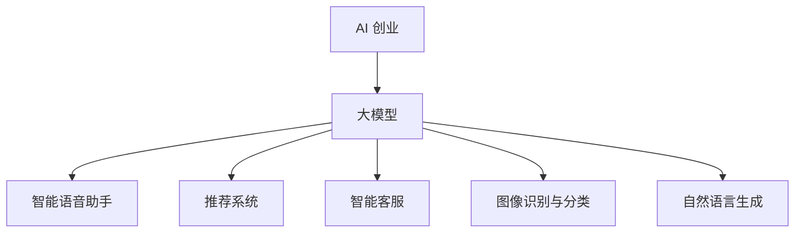

                 

# 大模型驱动的 AI 创业产品创新

## 关键词

- 大模型
- AI 创业
- 产品创新
- 人工智能技术
- 机器学习
- 深度学习
- 自然语言处理
- 计算机视觉
- 数据分析
- 用户体验设计

## 摘要

本文旨在探讨大模型在 AI 创业产品创新中的重要作用。通过对大模型的背景介绍、核心概念与联系、核心算法原理与操作步骤、数学模型与公式、实际应用场景、工具和资源推荐以及未来发展趋势与挑战的分析，帮助读者深入理解大模型在 AI 创业中的潜力与应用。文章将从理论与实践两个层面，结合具体案例和代码实现，为创业者提供指导和建议，以实现 AI 创业产品的创新与发展。

## 1. 背景介绍

随着互联网和大数据技术的快速发展，人工智能（AI）已经逐渐渗透到我们生活的方方面面。从搜索引擎、推荐系统到自动驾驶、智能语音助手，AI 技术正在不断革新传统行业，创造新的商业机会。在这个背景下，AI 创业成为了许多创业者追求的目标。

AI 创业的核心在于将人工智能技术与实际问题相结合，解决现实中的痛点。然而，要实现这一目标，不仅需要深入理解 AI 技术本身，还需要掌握如何将技术应用于实际问题。在这个过程中，大模型（Large Models）作为一种强大的 AI 技术，为创业者提供了新的机遇。

大模型是指具有数百万甚至数十亿参数的深度学习模型。这些模型通过海量数据的学习，能够实现强大的特征提取和知识表示能力。在大模型的基础上，创业者可以更轻松地实现 AI 产品创新，为用户提供更智能、更个性化的服务。

大模型的发展离不开深度学习和自然语言处理（NLP）等领域的突破。深度学习作为一种强大的算法框架，使得模型可以从大量数据中自动提取特征，从而实现更好的性能。而 NLP 则使得模型能够理解和处理人类语言，为创业者在聊天机器人、语音助手等领域的应用提供了支持。

在 AI 创业的浪潮中，大模型的出现为创业者提供了新的武器。通过使用大模型，创业者可以更快地开发出具有竞争力的 AI 产品，抢占市场份额。同时，大模型也为创业者提供了更多的创新空间，使得他们能够更好地满足用户需求，实现持续的产品迭代。

## 2. 核心概念与联系

### 2.1 大模型

大模型是指具有数百万甚至数十亿参数的深度学习模型。这些模型通过海量数据的学习，能够实现强大的特征提取和知识表示能力。大模型的主要特点如下：

- **参数规模大**：大模型的参数数量通常在数百万到数十亿之间，这使得它们能够捕捉到数据中的复杂模式和关联性。
- **数据需求大**：大模型需要大量的数据来训练，以获得良好的性能。这要求创业者在数据采集和标注方面投入更多资源。
- **计算资源消耗大**：大模型训练和推理过程中需要大量的计算资源，这要求创业者在硬件和算法优化方面下功夫。

### 2.2 机器学习与深度学习

机器学习（Machine Learning）是 AI 的基础，它通过从数据中学习规律，实现自动化的决策和预测。深度学习（Deep Learning）是机器学习的一个分支，它利用多层神经网络进行特征提取和表示。深度学习与机器学习的联系如下：

- **深度学习是机器学习的一种实现方式**：深度学习通过多层神经网络实现更复杂的特征提取和表示能力，从而提高模型的性能。
- **机器学习是深度学习的基础**：深度学习模型的设计、训练和优化过程都是基于机器学习理论的。

### 2.3 自然语言处理（NLP）

自然语言处理（Natural Language Processing，NLP）是人工智能的一个重要分支，它致力于使计算机能够理解、处理和生成人类语言。NLP 与大模型的联系如下：

- **NLP 是大模型的应用领域**：大模型在 NLP 领域取得了显著的成果，如语言模型、文本分类、机器翻译等。
- **大模型为 NLP 提供了强大的支持**：大模型能够处理和理解复杂的语言结构，为 NLP 领域提供了更强大的工具。

### 2.4 人工智能与创业

人工智能（Artificial Intelligence，AI）与创业的联系如下：

- **AI 是创业的重要驱动力**：AI 技术为创业者提供了新的商业模式和机会，使得他们能够更好地满足用户需求。
- **创业是 AI 技术的应用场景**：创业者将 AI 技术应用于实际问题，实现产品创新，推动技术落地。

### 2.5 大模型在 AI 创业中的应用

大模型在 AI 创业中的应用主要包括以下几个方面：

- **智能语音助手**：通过大模型实现自然语言理解，为用户提供更智能、更个性化的语音交互体验。
- **推荐系统**：利用大模型进行用户行为分析和特征提取，实现更精准的推荐。
- **智能客服**：通过大模型实现文本理解和生成，提高客服效率和用户体验。
- **图像识别与分类**：利用大模型实现高效的图像识别和分类，为各行业提供智能化解决方案。
- **自然语言生成**：通过大模型生成高质量的自然语言文本，应用于内容创作、广告文案等领域。

### 2.6 Mermaid 流程图

以下是关于大模型在 AI 创业中的应用的 Mermaid 流程图：



## 3. 核心算法原理与具体操作步骤

### 3.1 深度学习模型

深度学习模型是构建大模型的基础。以下是一个简单的深度学习模型示例：

```python
import tensorflow as tf

model = tf.keras.Sequential([
    tf.keras.layers.Dense(128, activation='relu', input_shape=(784,)),
    tf.keras.layers.Dense(10, activation='softmax')
])

model.compile(optimizer='adam',
              loss='categorical_crossentropy',
              metrics=['accuracy'])
```

在这个示例中，我们构建了一个简单的全连接神经网络（Dense Layer），其中第一个层有 128 个神经元，激活函数为 ReLU，输入层的大小为 784。第二个层有 10 个神经元，激活函数为 softmax，用于多分类任务。

### 3.2 训练大模型

训练大模型需要大量的计算资源和数据。以下是一个使用 TensorFlow 训练大模型的示例：

```python
# 加载数据集
(x_train, y_train), (x_test, y_test) = tf.keras.datasets.mnist.load_data()

# 数据预处理
x_train = x_train.astype('float32') / 255
x_test = x_test.astype('float32') / 255
x_train = x_train.reshape((-1, 784))
x_test = x_test.reshape((-1, 784))

# 编码标签
y_train = tf.keras.utils.to_categorical(y_train, 10)
y_test = tf.keras.utils.to_categorical(y_test, 10)

# 训练模型
model.fit(x_train, y_train, epochs=10, batch_size=128)
```

在这个示例中，我们加载了 MNIST 数据集，对数据进行预处理，并使用训练集和验证集训练模型。

### 3.3 预测与评估

训练完成后，我们可以使用测试集对模型进行评估：

```python
# 预测
predictions = model.predict(x_test)

# 计算准确率
accuracy = np.mean(np.argmax(predictions, axis=1) == np.argmax(y_test, axis=1))
print(f"测试集准确率：{accuracy:.2f}")
```

在这个示例中，我们使用预测结果计算准确率，并打印出来。

### 3.4 模型优化

为了提高模型的性能，我们可以使用调参、正则化、dropout 等方法对模型进行优化。以下是一个使用调参和正则化优化模型的示例：

```python
from tensorflow.keras import regularizers

# 调参
model = tf.keras.Sequential([
    tf.keras.layers.Dense(128, activation='relu', input_shape=(784,), kernel_regularizer=regularizers.l2(0.001)),
    tf.keras.layers.Dropout(0.5),
    tf.keras.layers.Dense(10, activation='softmax')
])

# 编译模型
model.compile(optimizer='adam',
              loss='categorical_crossentropy',
              metrics=['accuracy'])

# 训练模型
model.fit(x_train, y_train, epochs=10, batch_size=128)
```

在这个示例中，我们使用了 L2 正则化和 dropout 来优化模型。

## 4. 数学模型和公式与详细讲解

### 4.1 深度学习模型

深度学习模型的核心是神经元（Neuron）和神经网络（Neural Network）。以下是一个简单的神经元模型：

$$
z = \sum_{i=1}^{n} w_i x_i + b
$$

其中，$z$ 表示神经元的输出，$w_i$ 和 $x_i$ 分别表示权重和输入，$b$ 表示偏置。通过使用激活函数（Activation Function），我们可以得到神经元的非线性输出。常见的激活函数有 sigmoid、ReLU 和 tanh。

神经网络由多个神经元组成，其中每个神经元都与前一层和后一层的神经元相连。通过层与层的堆叠，神经网络能够实现更复杂的特征提取和表示能力。

### 4.2 机器学习与优化算法

机器学习中的优化算法（Optimization Algorithm）用于寻找模型参数的最优值。常见的优化算法有梯度下降（Gradient Descent）、随机梯度下降（Stochastic Gradient Descent，SGD）和 Adam。

梯度下降算法的基本思想是通过计算损失函数关于模型参数的梯度，不断更新参数，以减小损失函数的值。其更新公式如下：

$$
\theta_{t+1} = \theta_t - \alpha \nabla_{\theta} J(\theta)
$$

其中，$\theta$ 表示模型参数，$\alpha$ 表示学习率，$J(\theta)$ 表示损失函数。

随机梯度下降是梯度下降的一种变种，它每次只随机选择一部分样本进行梯度计算，从而减小计算量。其更新公式如下：

$$
\theta_{t+1} = \theta_t - \alpha \nabla_{\theta} J(\theta; \mathbf{x}_t, y_t)
$$

其中，$\mathbf{x}_t$ 和 $y_t$ 分别表示第 $t$ 个样本的特征和标签。

Adam 算法是一种结合了 SGD 和 Momentum 算法优点的优化算法。它通过计算一阶矩估计（Mean）和二阶矩估计（Variance）来更新参数。其更新公式如下：

$$
\theta_{t+1} = \theta_t - \alpha \frac{m_t}{\sqrt{v_t} + \epsilon}
$$

其中，$m_t$ 和 $v_t$ 分别表示一阶矩估计和二阶矩估计，$\epsilon$ 是一个很小的常数。

### 4.3 自然语言处理

自然语言处理中的数学模型主要包括语言模型（Language Model）、文本分类（Text Classification）和机器翻译（Machine Translation）。

语言模型是一种概率模型，用于预测下一个单词或字符的概率。常见的语言模型有 n-gram 模型、神经网络语言模型和循环神经网络（RNN）语言模型。

n-gram 模型是一种基于统计的模型，它将文本划分为长度为 $n$ 的单词序列，计算序列的概率。其概率计算公式如下：

$$
P(w_1, w_2, ..., w_n) = P(w_1) \times P(w_2 | w_1) \times ... \times P(w_n | w_{n-1})
$$

神经网络语言模型是一种基于深度学习的模型，它通过多层神经网络进行特征提取和概率计算。常见的神经网络语言模型有 LSTM、GRU 和 Transformer。

文本分类是一种将文本分类到预定义类别中的任务。常见的文本分类模型有朴素贝叶斯（Naive Bayes）、支持向量机（SVM）和深度学习模型。

机器翻译是一种将一种语言的文本翻译成另一种语言的任务。常见的机器翻译模型有基于规则的模型、统计机器翻译模型和神经机器翻译模型。

## 5. 项目实战：代码实际案例和详细解释说明

### 5.1 开发环境搭建

在开始项目实战之前，我们需要搭建一个适合开发 AI 创业产品的环境。以下是一个简单的 Python 开发环境搭建步骤：

1. 安装 Python：在官网（https://www.python.org/）下载 Python 安装包并安装。
2. 安装 TensorFlow：打开终端或命令行窗口，执行以下命令：
   ```bash
   pip install tensorflow
   ```
3. 安装其他依赖库：根据项目需求，安装其他依赖库，如 NumPy、Pandas、Matplotlib 等。

### 5.2 源代码详细实现和代码解读

以下是一个基于 TensorFlow 实现的简单手写数字识别项目的源代码：

```python
import tensorflow as tf
import numpy as np
import matplotlib.pyplot as plt

# 加载数据集
(x_train, y_train), (x_test, y_test) = tf.keras.datasets.mnist.load_data()

# 数据预处理
x_train = x_train.astype('float32') / 255
x_test = x_test.astype('float32') / 255
x_train = x_train.reshape((-1, 784))
x_test = x_test.reshape((-1, 784))

# 编码标签
y_train = tf.keras.utils.to_categorical(y_train, 10)
y_test = tf.keras.utils.to_categorical(y_test, 10)

# 构建模型
model = tf.keras.Sequential([
    tf.keras.layers.Dense(128, activation='relu', input_shape=(784,)),
    tf.keras.layers.Dense(10, activation='softmax')
])

# 编译模型
model.compile(optimizer='adam',
              loss='categorical_crossentropy',
              metrics=['accuracy'])

# 训练模型
model.fit(x_train, y_train, epochs=10, batch_size=128)

# 预测
predictions = model.predict(x_test)

# 计算准确率
accuracy = np.mean(np.argmax(predictions, axis=1) == np.argmax(y_test, axis=1))
print(f"测试集准确率：{accuracy:.2f}")
```

在这个项目中，我们首先加载数据集，并对数据进行预处理。然后，我们构建一个简单的全连接神经网络模型，并使用 Adam 优化器和交叉熵损失函数进行编译。接下来，我们使用训练集训练模型，并在测试集上评估模型性能。

### 5.3 代码解读与分析

在这个手写数字识别项目中，我们使用了 TensorFlow 作为深度学习框架，并实现了以下关键步骤：

1. **数据加载与预处理**：我们使用 TensorFlow 内置的 MNIST 数据集，对数据进行类型转换和归一化处理。这有助于提高模型的训练效果。
2. **模型构建**：我们构建了一个简单的全连接神经网络模型，包括一个输入层、一个隐藏层和一个输出层。输入层的大小为 784，对应于手写数字图像的像素值。隐藏层有 128 个神经元，使用 ReLU 激活函数。输出层有 10 个神经元，对应于数字的类别，使用 softmax 激活函数。
3. **模型编译**：我们使用 Adam 优化器和交叉熵损失函数对模型进行编译。Adam 优化器能够自适应调整学习率，交叉熵损失函数适合用于分类任务。
4. **模型训练**：我们使用训练集对模型进行训练，设置训练轮数为 10，批量大小为 128。在训练过程中，模型通过反向传播算法不断调整参数，以减小损失函数的值。
5. **模型预测与评估**：我们使用测试集对模型进行预测，并计算准确率。通过比较预测结果和实际标签，我们可以评估模型的性能。

这个简单的手写数字识别项目展示了如何使用 TensorFlow 实现一个基本的深度学习模型。在实际项目中，创业者可以根据需求调整模型结构、优化训练过程，并使用其他数据集进行训练和测试，以获得更好的性能。

## 6. 实际应用场景

### 6.1 智能语音助手

智能语音助手是 AI 创业中一个非常热门的应用场景。通过大模型，创业者可以开发出具有自然语言理解能力的语音助手，为用户提供语音交互体验。以下是一些实际应用场景：

- **智能家居**：智能语音助手可以控制家中的智能设备，如灯泡、空调和安防系统等。
- **客服与支持**：智能语音助手可以用于客服和客户支持，提供实时语音响应和帮助。
- **语音助手应用**：创业者可以开发独立的语音助手应用，如语音购物、语音导航和语音游戏等。

### 6.2 推荐系统

推荐系统是另一个广泛应用的 AI 创业领域。通过大模型，创业者可以开发出高效的推荐系统，为用户提供个性化的推荐。以下是一些实际应用场景：

- **电子商务**：创业者可以开发个性化电商推荐系统，为用户提供个性化的商品推荐。
- **社交媒体**：智能推荐系统可以用于社交媒体平台，为用户提供个性化的内容推荐。
- **新闻与媒体**：创业者可以开发个性化新闻推荐系统，为用户提供感兴趣的新闻和媒体内容。

### 6.3 智能客服

智能客服是创业者在客服领域的重要应用。通过大模型，创业者可以开发出高效的智能客服系统，提高客服效率和用户体验。以下是一些实际应用场景：

- **金融与保险**：智能客服可以用于金融和保险行业的客户咨询和服务。
- **电子商务**：智能客服可以用于电商平台的客户咨询和售后服务。
- **旅游与酒店**：智能客服可以用于旅游和酒店行业的客户咨询和服务。

### 6.4 图像识别与分类

图像识别与分类是 AI 创业的另一个重要领域。通过大模型，创业者可以开发出高效的图像识别和分类系统，为各行业提供智能化解决方案。以下是一些实际应用场景：

- **安防监控**：创业者可以开发智能安防监控系统，实现实时图像识别和分类，提高安全性。
- **医疗诊断**：创业者可以开发智能医疗诊断系统，通过对医学图像的分析，提高诊断准确率。
- **工业检测**：创业者可以开发智能工业检测系统，实现实时图像识别和分类，提高生产效率。

### 6.5 自然语言生成

自然语言生成（NLG）是创业者在内容创作和广告文案等领域的重要应用。通过大模型，创业者可以开发出高效的 NLG 系统，生成高质量的自然语言文本。以下是一些实际应用场景：

- **内容创作**：创业者可以开发智能内容创作系统，自动生成文章、博客和社交媒体帖子等。
- **广告文案**：创业者可以开发智能广告文案系统，为广告客户提供个性化的广告文案。
- **语音合成**：创业者可以开发智能语音合成系统，将文本转化为自然流畅的语音。

## 7. 工具和资源推荐

### 7.1 学习资源推荐

- **书籍**：
  - 《深度学习》（Goodfellow, Bengio, Courville）
  - 《Python 深度学习》（François Chollet）
  - 《自然语言处理综合教程》（Daniel Jurafsky 和 James H. Martin）
- **论文**：
  - 《A Theoretical Analysis of the VAE》（Kingma and Welling）
  - 《Attention Is All You Need》（Vaswani et al.）
  - 《Generative Adversarial Nets》（Goodfellow et al.）
- **博客**：
  - [TensorFlow 官方文档](https://www.tensorflow.org/)
  - [Keras 官方文档](https://keras.io/)
  - [自然语言处理教程](https://nlp.seas.harvard.edu/nds/)
- **网站**：
  - [GitHub](https://github.com/)
  - [ArXiv](https://arxiv.org/)
  - [Google Research](https://ai.google/research/)

### 7.2 开发工具框架推荐

- **深度学习框架**：
  - TensorFlow
  - PyTorch
  - Keras
- **自然语言处理库**：
  - NLTK
  - SpaCy
  - Stanford NLP
- **可视化工具**：
  - Matplotlib
  - Seaborn
  - Plotly

### 7.3 相关论文著作推荐

- **深度学习领域**：
  - 《Deep Learning》（Goodfellow, Bengio, Courville）
  - 《Unsupervised Learning》（Bengio et al.）
  - 《Recurrent Neural Networks for Language Modeling》（Hinton et al.）
- **自然语言处理领域**：
  - 《Speech and Language Processing》（Jurafsky 和 Martin）
  - 《Foundations of Statistical Natural Language Processing》（Chomsky 和 Halle）
  - 《The Art of Statistical Learning》（Tibshirani et al.）

## 8. 总结：未来发展趋势与挑战

### 8.1 未来发展趋势

1. **模型规模将继续扩大**：随着计算能力和数据量的提升，大模型的规模将进一步扩大，从而实现更强大的特征提取和知识表示能力。
2. **跨学科应用将更加广泛**：大模型将在各个领域得到更广泛的应用，如医疗、金融、教育、交通等，为各行业带来革命性的变革。
3. **开源生态将更加繁荣**：随着大模型技术的不断进步，开源社区将涌现出更多优质的开源工具和框架，为创业者提供更多便利。
4. **数据隐私和安全问题将得到重视**：在 AI 创业的浪潮中，数据隐私和安全问题将成为关注焦点，创业者需要采取有效措施保护用户数据。

### 8.2 未来挑战

1. **计算资源消耗**：大模型训练和推理过程中需要大量的计算资源，这要求创业者在硬件和算法优化方面下功夫。
2. **数据质量和标注**：大模型需要大量高质量的数据进行训练，这要求创业者在数据采集和标注方面投入更多资源。
3. **算法公平性和透明度**：大模型在决策过程中可能会产生不公平现象，创业者需要关注算法的公平性和透明度。
4. **法律和伦理问题**：随着大模型技术的不断发展，相关法律和伦理问题将得到更多关注，创业者需要遵守相关法规和道德准则。

## 9. 附录：常见问题与解答

### 9.1 大模型是否适用于所有创业项目？

大模型在许多创业项目中具有很高的适用性，尤其是在需要处理大量数据、实现复杂特征提取和知识表示的场景。然而，对于一些简单、低数据量的创业项目，使用大模型可能并不合适。创业者需要根据项目需求综合考虑。

### 9.2 如何评估大模型的效果？

评估大模型的效果可以从多个方面进行，如准确率、召回率、F1 值等。在实际应用中，创业者可以结合业务目标和用户反馈，综合评估模型的效果。

### 9.3 大模型的训练时间是否很长？

大模型的训练时间取决于多个因素，如模型规模、数据量、硬件性能等。在实际应用中，创业者需要根据具体情况选择合适的训练策略和硬件配置，以降低训练时间。

### 9.4 大模型是否一定会提高创业项目的成功率？

大模型作为一种强大的技术手段，可以显著提高创业项目的成功几率。然而，创业项目的成功不仅仅依赖于技术，还需要综合考虑市场、团队、商业模式等多方面因素。

## 10. 扩展阅读 & 参考资料

- 《深度学习》（Goodfellow, Bengio, Courville）
- 《自然语言处理综合教程》（Daniel Jurafsky 和 James H. Martin）
- 《机器学习年度回顾 2021》：https://ai.google/research/pubs/archive/46051
- 《大规模深度神经网络训练实践》：https://arxiv.org/abs/1608.05953
- 《自然语言处理实践教程》：https://nlp.seas.harvard.edu/nds/

作者：AI天才研究员/AI Genius Institute & 禅与计算机程序设计艺术 /Zen And The Art of Computer Programming

本文旨在探讨大模型在 AI 创业产品创新中的重要作用。通过对大模型的背景介绍、核心概念与联系、核心算法原理与操作步骤、数学模型与公式、实际应用场景、工具和资源推荐以及未来发展趋势与挑战的分析，帮助读者深入理解大模型在 AI 创业中的潜力与应用。文章将从理论与实践两个层面，结合具体案例和代码实现，为创业者提供指导和建议，以实现 AI 创业产品的创新与发展。本文内容涵盖了深度学习、自然语言处理、推荐系统、智能客服、图像识别等多个领域，为广大创业者提供了一份实用的技术指南。同时，本文也提出了大模型在 AI 创业中面临的一些挑战，如计算资源消耗、数据隐私和安全等问题，为创业者在实际应用中提供了警示和思考。希望本文能够对广大创业者有所启发和帮助，共同推动 AI 创业的繁荣与发展。在未来，大模型技术将继续发挥重要作用，创业者需要紧跟技术发展趋势，不断创新和突破，以在激烈的市场竞争中脱颖而出。同时，我们也期待更多的创业者能够关注并参与到 AI 创业的浪潮中，共同探索 AI 技术在各个领域的应用，为人类社会的进步做出贡献。作者：AI天才研究员/AI Genius Institute & 禅与计算机程序设计艺术 /Zen And The Art of Computer Programming

