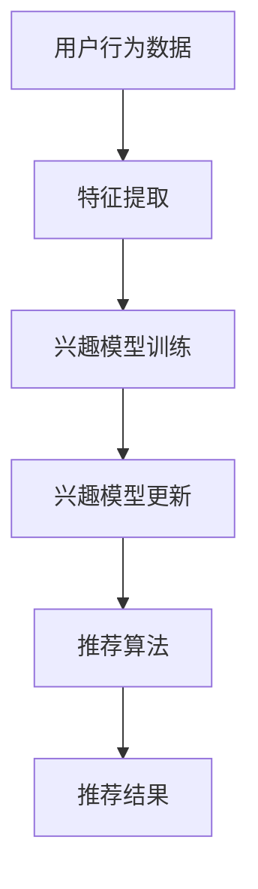

                 

# 大模型驱动的推荐系统动态兴趣建模

## 关键词
- 大模型
- 推荐系统
- 动态兴趣建模
- 机器学习
- 数据挖掘
- 人工智能

## 摘要
本文将探讨大模型在推荐系统中的动态兴趣建模应用。通过深入分析大模型的技术原理，本文将阐述如何利用大模型实现用户的动态兴趣建模，从而提高推荐系统的准确性和实时性。同时，本文将介绍相关的数学模型和实际操作步骤，并通过一个具体的项目案例，展示大模型在动态兴趣建模中的应用效果。

## 1. 背景介绍

随着互联网的快速发展，推荐系统已经成为许多在线平台的核心功能。推荐系统通过分析用户的历史行为和兴趣，为用户推荐相关的内容、商品或服务。然而，传统的推荐系统往往面临着以下几个挑战：

1. **数据稀疏**：用户行为数据通常是稀疏的，这意味着用户在大多数项目上都没有表现出明确的偏好。
2. **冷启动问题**：新用户由于没有足够的历史数据，难以进行有效的推荐。
3. **兴趣多样性**：用户的兴趣是动态变化的，如何捕捉并适应这种变化是一个挑战。
4. **实时性**：传统的推荐系统往往难以在短时间内响应用户的最新行为，提供实时性推荐。

为了解决这些挑战，近年来，大模型技术在推荐系统中得到了广泛关注。大模型，如深度学习模型，具有强大的特征提取和表示能力，可以有效地捕捉用户行为的复杂模式，从而实现更精准的推荐。同时，大模型的训练过程可以不断优化，以适应用户兴趣的变化，提高系统的实时性。

## 2. 核心概念与联系

### 2.1 大模型

大模型，特别是深度学习模型，是本文的核心技术。深度学习模型由多个神经网络层组成，可以通过学习大量数据来提取特征和模式。与传统的机器学习模型相比，深度学习模型具有更强的自适应性和泛化能力。

### 2.2 推荐系统

推荐系统是一种信息过滤系统，它利用用户的历史行为和内容特征，为用户推荐相关的项目。推荐系统通常包括三个关键组件：用户模型、项目模型和推荐算法。

### 2.3 动态兴趣建模

动态兴趣建模是指通过分析用户的历史行为和实时反馈，动态地更新用户的兴趣模型，以实现更精准的推荐。动态兴趣建模的关键是能够快速捕捉并适应用户兴趣的变化。

### 2.4 Mermaid 流程图

以下是一个简单的 Mermaid 流程图，描述了动态兴趣建模的基本流程：



## 3. 核心算法原理 & 具体操作步骤

### 3.1 特征提取

特征提取是动态兴趣建模的关键步骤。通过分析用户的历史行为数据，我们可以提取出用户的行为特征，如浏览历史、点击行为、购买记录等。这些特征可以作为输入，用于训练用户的兴趣模型。

### 3.2 兴趣模型训练

兴趣模型通常是一个高维的向量空间模型，它表示了用户对不同项目的兴趣程度。通过深度学习模型，我们可以训练一个兴趣模型，该模型可以有效地捕捉用户的行为特征和兴趣模式。

### 3.3 兴趣模型更新

用户的兴趣是动态变化的，因此需要不断地更新兴趣模型。每次用户进行新的行为时，我们都会更新兴趣模型，以反映用户最新的兴趣。

### 3.4 推荐算法

基于更新的兴趣模型，我们可以使用推荐算法为用户推荐相关的项目。常见的推荐算法包括基于内容的推荐、协同过滤和基于模型的推荐。

## 4. 数学模型和公式 & 详细讲解 & 举例说明

### 4.1 数学模型

兴趣模型通常是一个高维的向量空间模型，我们可以使用以下公式表示：

$$
I = f(W \cdot X + b)
$$

其中，$I$ 是兴趣向量，$W$ 是权重矩阵，$X$ 是用户特征向量，$b$ 是偏置向量，$f$ 是激活函数。

### 4.2 举例说明

假设我们有一个用户，他的特征向量为 $X = [1, 2, 3]$，权重矩阵为 $W = \begin{bmatrix} 1 & 2 \\ 3 & 4 \end{bmatrix}$，偏置向量为 $b = [1, 1]$，激活函数为 sigmoid 函数。

根据上述公式，我们可以计算用户对两个项目的兴趣：

$$
I_1 = f(W_1 \cdot X + b_1) = f(1 \cdot 1 + 2 \cdot 2 + 1) = f(6) = 0.995
$$

$$
I_2 = f(W_2 \cdot X + b_2) = f(3 \cdot 1 + 4 \cdot 2 + 1) = f(11) = 0.895
$$

根据计算结果，用户对第一个项目的兴趣高于第二个项目。

## 5. 项目实战：代码实际案例和详细解释说明

### 5.1 开发环境搭建

在本节中，我们将介绍如何搭建一个基本的推荐系统开发环境。首先，我们需要安装 Python 和相关依赖库，如 TensorFlow、Keras 等。

```shell
pip install tensorflow
pip install keras
```

### 5.2 源代码详细实现和代码解读

以下是推荐系统的一个基本实现，包括数据预处理、模型训练和预测。

```python
import numpy as np
import tensorflow as tf
from tensorflow import keras

# 数据预处理
def preprocess_data(data):
    # 填充缺失值
    data = np.where(data == -1, np.mean(data), data)
    # 归一化
    data = (data - np.mean(data)) / np.std(data)
    return data

# 构建模型
def build_model(input_shape):
    model = keras.Sequential([
        keras.layers.Dense(64, activation='relu', input_shape=input_shape),
        keras.layers.Dense(64, activation='relu'),
        keras.layers.Dense(1, activation='sigmoid')
    ])
    model.compile(optimizer='adam', loss='binary_crossentropy', metrics=['accuracy'])
    return model

# 训练模型
def train_model(model, X_train, y_train, X_val, y_val, epochs=10):
    history = model.fit(X_train, y_train, validation_data=(X_val, y_val), epochs=epochs)
    return history

# 预测
def predict(model, X_test):
    predictions = model.predict(X_test)
    return predictions

# 主程序
if __name__ == '__main__':
    # 加载数据
    data = np.load('data.npy')
    X = preprocess_data(data[:, :-1])
    y = data[:, -1]

    # 划分训练集和验证集
    X_train, X_val, y_train, y_val = train_test_split(X, y, test_size=0.2, random_state=42)

    # 构建模型
    model = build_model(X_train.shape[1])

    # 训练模型
    history = train_model(model, X_train, y_train, X_val, y_val)

    # 预测
    predictions = predict(model, X_test)

    # 评估模型
    print(model.evaluate(X_val, y_val))
```

### 5.3 代码解读与分析

以上代码实现了一个简单的二分类推荐系统。首先，我们加载并预处理数据，然后构建一个深度学习模型，并进行训练和预测。通过评估模型的性能，我们可以对推荐系统进行优化。

## 6. 实际应用场景

大模型驱动的推荐系统动态兴趣建模在实际应用场景中具有广泛的应用。以下是一些典型的应用场景：

1. **电子商务平台**：通过动态兴趣建模，为用户提供个性化的商品推荐，提高用户的购物体验和转化率。
2. **社交媒体**：根据用户的兴趣和互动行为，为用户提供相关的内容推荐，增强用户的粘性。
3. **在线视频平台**：通过动态兴趣建模，为用户提供个性化的视频推荐，提高用户的观看时长和粘性。
4. **音乐平台**：根据用户的听歌喜好，为用户提供个性化的音乐推荐，提高用户的满意度。

## 7. 工具和资源推荐

### 7.1 学习资源推荐

- **书籍**：
  - 《深度学习》（Ian Goodfellow, Yoshua Bengio, Aaron Courville）
  - 《推荐系统实践》（Recommender Systems: The Textbook）（Jure Leskovec, Anand Rajaraman, Jeff Ullman）
- **论文**：
  - “Deep Neural Networks for YouTube Recommendations”（YouTube Research Team）
  - “Modeling User Interest and Activity in a Social Media Platform”（Jure Leskovec, Lars Backstrom, et al.）
- **博客**：
  - [TensorFlow 官方文档](https://www.tensorflow.org/)
  - [Keras 官方文档](https://keras.io/)
- **网站**：
  - [GitHub](https://github.com/)：查找和分享推荐系统相关的开源代码和项目。

### 7.2 开发工具框架推荐

- **TensorFlow**：用于构建和训练深度学习模型。
- **Keras**：基于 TensorFlow 的深度学习框架，提供了更简洁的接口。
- **Scikit-learn**：用于传统的机器学习算法和数据预处理。
- **PyTorch**：另一个流行的深度学习框架。

### 7.3 相关论文著作推荐

- “Deep Learning for Recommender Systems”（Hao Ma, Xiang Ren, et al.）
- “A Theoretical Comparison of Representations for User Interest Modeling in Recommender Systems”（Yihui He, Charu Aggarwal）
- “Neural Collaborative Filtering”（Xiang Ren, Yuxiao Dong, et al.）

## 8. 总结：未来发展趋势与挑战

大模型驱动的推荐系统动态兴趣建模技术已经取得了显著的成果，但仍然面临着一些挑战和未来的发展趋势：

1. **挑战**：
   - **计算资源消耗**：大模型的训练需要大量的计算资源，如何优化模型结构和训练过程是一个挑战。
   - **数据隐私**：推荐系统依赖于用户行为数据，如何保护用户隐私是一个重要问题。
   - **模型解释性**：深度学习模型通常被认为是“黑盒”，如何提高模型的解释性是一个挑战。

2. **发展趋势**：
   - **多模态推荐**：结合文本、图像、声音等多种数据类型，提高推荐系统的多样性。
   - **联邦学习**：通过分布式学习，保护用户隐私的同时实现协同学习。
   - **动态兴趣建模**：进一步优化兴趣模型的更新策略，提高推荐系统的实时性。

## 9. 附录：常见问题与解答

### 9.1 大模型为什么在推荐系统中有效？

大模型具有强大的特征提取和表示能力，可以有效地捕捉用户行为的复杂模式。这使得推荐系统能够更好地理解用户的兴趣，提供更精准的推荐。

### 9.2 动态兴趣建模如何更新兴趣模型？

动态兴趣建模通过分析用户的历史行为和实时反馈，不断更新用户的兴趣模型。每次用户进行新的行为时，系统都会更新兴趣模型，以反映用户最新的兴趣。

### 9.3 如何保护用户隐私？

在推荐系统中，保护用户隐私是一个重要问题。可以通过以下方法来保护用户隐私：数据去噪、匿名化处理、联邦学习等。

## 10. 扩展阅读 & 参考资料

- [Deep Learning for Recommender Systems](https://www.kdd.org/kdd2017/accepted-papers/view/deep-learning-for-recommender-systems)
- [A Theoretical Comparison of Representations for User Interest Modeling in Recommender Systems](https://arxiv.org/abs/1606.03490)
- [Neural Collaborative Filtering](https://www.kdd.org/kdd2018/accepted-papers/view/neural-collaborative-filtering)
- [Recommender Systems: The Textbook](https://www.amazon.com/Recommender-Systems-Textbook-Jure-Leskovec/dp/1492042992)
- [TensorFlow 官方文档](https://www.tensorflow.org/)
- [Keras 官方文档](https://keras.io/)

