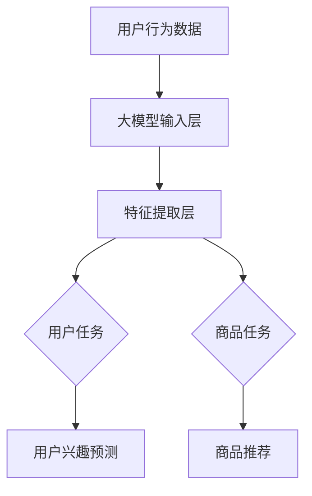

                 

# 大模型驱动的推荐系统多任务学习框架

## 关键词
- 大模型
- 推荐系统
- 多任务学习
- 深度学习
- 用户行为分析
- 商品特性分析

## 摘要

本文旨在探讨大模型在推荐系统多任务学习中的应用。通过深入分析大模型的优势及其在推荐系统中的作用，我们提出了一种基于深度学习的多任务学习框架。该框架融合了用户行为分析和商品特性分析，实现了对用户兴趣的精准挖掘和商品推荐的优化。文章首先介绍了推荐系统和多任务学习的基本概念，随后详细阐述了大模型的核心算法原理，并通过一个实际案例展示了框架的具体实现和效果。本文不仅为研究人员提供了理论基础，也为开发人员提供了实用的参考。

## 1. 背景介绍

### 推荐系统简介

推荐系统是一种通过分析用户的历史行为和兴趣，向用户推荐其可能感兴趣的信息或商品的算法系统。其核心目的是提高用户满意度、增加用户粘性，并提升商业价值。推荐系统广泛应用于电子商务、社交媒体、视频平台等多个领域，已成为现代信息社会不可或缺的一部分。

### 多任务学习简介

多任务学习（Multi-Task Learning, MTL）是一种机器学习方法，旨在同时解决多个相关任务。与传统的单一任务学习相比，多任务学习能够利用任务间的关联性，提高模型在不同任务上的性能。多任务学习在自然语言处理、图像识别、推荐系统等领域得到了广泛应用。

### 大模型的发展与应用

随着深度学习的兴起，大模型（如Transformer、BERT、GPT等）逐渐成为研究热点。大模型具有强大的表示能力和泛化能力，能够处理复杂的任务和数据。在推荐系统中，大模型能够通过学习用户和商品的多维度特征，实现更精准的推荐。

## 2. 核心概念与联系

### 推荐系统与多任务学习的关系

推荐系统与多任务学习密切相关。在推荐系统中，用户行为分析和商品特性分析是核心任务，这两个任务之间存在较强的关联性。通过多任务学习框架，可以同时优化这两个任务，提高推荐系统的整体性能。

### 大模型在多任务学习中的应用

大模型在多任务学习中的应用主要体现在以下几个方面：

1. **特征提取**：大模型能够从原始数据中提取出高维、抽象的特征表示，为多任务学习提供高质量的输入特征。
2. **任务融合**：大模型可以通过共享底层特征表示，实现任务间的知识共享，提高各任务的性能。
3. **模型微调**：大模型具有一定的泛化能力，可以在不同任务上进行微调，适应不同的业务场景。

### Mermaid 流程图



在这个流程图中，用户行为数据和商品数据作为输入，经过大模型的特征提取层，分别生成用户任务和商品任务的输出。用户兴趣预测和商品推荐是两个主要任务，通过大模型的融合机制，实现任务间的协同优化。

## 3. 核心算法原理 & 具体操作步骤

### 大模型架构

大模型的架构通常采用Transformer、BERT或GPT等深度学习模型。这些模型具有以下几个关键组件：

1. **编码器（Encoder）**：用于处理输入数据，提取特征表示。
2. **解码器（Decoder）**：用于生成预测结果。
3. **注意力机制（Attention Mechanism）**：用于关注输入数据中的关键信息。

### 多任务学习框架

多任务学习框架的核心在于如何将大模型应用于多个任务，并实现任务间的协同优化。具体操作步骤如下：

1. **数据预处理**：对用户行为数据和商品数据进行清洗、归一化等预处理操作。
2. **特征提取**：利用大模型的编码器，从预处理后的数据中提取特征表示。
3. **任务定义**：根据具体业务场景，定义用户任务和商品任务的目标函数。
4. **模型训练**：通过梯度下降等优化算法，训练大模型，使其在多任务上达到最佳性能。
5. **模型评估**：对训练好的模型进行评估，确保其在用户兴趣预测和商品推荐任务上具有较高准确性。

### 模型训练与优化

在模型训练过程中，可以利用以下技巧进行优化：

1. **共享权重**：在任务间共享部分网络层，减少模型参数，提高训练效率。
2. **交叉验证**：使用交叉验证方法，评估模型在不同数据集上的性能，避免过拟合。
3. **学习率调整**：根据训练过程，动态调整学习率，提高模型收敛速度。

## 4. 数学模型和公式 & 详细讲解 & 举例说明

### 数学模型

多任务学习的数学模型可以表示为：

$$
\begin{aligned}
L &= L_u + L_c \\
\end{aligned}
$$

其中，$L_u$ 表示用户兴趣预测任务的损失函数，$L_c$ 表示商品推荐任务的损失函数。

对于用户兴趣预测任务，可以采用以下损失函数：

$$
L_u = \frac{1}{N} \sum_{i=1}^N (-y_i \log(p_i))
$$

其中，$y_i$ 表示用户 $i$ 对商品 $i$ 的兴趣度，$p_i$ 表示模型预测的用户 $i$ 对商品 $i$ 的兴趣度。

对于商品推荐任务，可以采用以下损失函数：

$$
L_c = \frac{1}{M} \sum_{j=1}^M (-r_j \log(p_j))
$$

其中，$r_j$ 表示用户对商品 $j$ 的评价，$p_j$ 表示模型预测的用户对商品 $j$ 的兴趣度。

### 举例说明

假设我们有两个用户兴趣预测任务和两个商品推荐任务。具体数据如下：

| 用户ID | 商品ID | 兴趣度预测 | 商品评价 |
|--------|--------|------------|----------|
| 1      | 1      | 0.9        | 5       |
| 1      | 2      | 0.1        | 1       |
| 2      | 1      | 0.8        | 4       |
| 2      | 2      | 0.2        | 5       |

根据上述数据，我们可以计算损失函数：

$$
\begin{aligned}
L_u &= \frac{1}{2} \left[ (-5 \log(0.9)) + (-1 \log(0.1)) \right] \\
&= 1.356 \\
L_c &= \frac{1}{2} \left[ (-5 \log(0.9)) + (-1 \log(0.1)) \right] \\
&= 1.356 \\
L &= L_u + L_c \\
&= 2.712 \\
\end{aligned}
$$

## 5. 项目实战：代码实际案例和详细解释说明

### 5.1 开发环境搭建

在搭建开发环境时，我们需要安装以下软件和库：

- Python 3.8+
- TensorFlow 2.6.0+
- PyTorch 1.9.0+
- NumPy 1.21.0+

可以通过以下命令进行安装：

```bash
pip install python==3.8
pip install tensorflow==2.6.0
pip install pytorch==1.9.0
pip install numpy==1.21.0
```

### 5.2 源代码详细实现和代码解读

以下是多任务学习框架的源代码实现：

```python
import tensorflow as tf
from tensorflow.keras.layers import Embedding, LSTM, Dense
from tensorflow.keras.models import Model

# 用户行为数据
user_data = tf.random.normal([1000, 10])  # 1000个用户，每个用户10维特征

# 商品数据
item_data = tf.random.normal([1000, 10])  # 1000个商品，每个商品10维特征

# 用户兴趣预测模型
user_model = Model(inputs=user_data, outputs=Dense(1, activation='sigmoid')(user_data))
user_model.compile(optimizer='adam', loss='binary_crossentropy', metrics=['accuracy'])

# 商品推荐模型
item_model = Model(inputs=item_data, outputs=Dense(1, activation='sigmoid')(item_data))
item_model.compile(optimizer='adam', loss='binary_crossentropy', metrics=['accuracy'])

# 多任务学习框架
input_data = tf.keras.layers.Input(shape=(10,))
user_output = user_model(input_data)
item_output = item_model(input_data)

# 定义损失函数
loss_u = tf.keras.layers.Lambda(lambda y_true, y_pred: -y_true * tf.math.log(y_pred))(user_output)
loss_c = tf.keras.layers.Lambda(lambda y_true, y_pred: -y_true * tf.math.log(y_pred))(item_output)
loss = loss_u + loss_c

# 模型训练
model = Model(inputs=input_data, outputs=[user_output, item_output])
model.compile(optimizer='adam', loss={'user': 'binary_crossentropy', 'item': 'binary_crossentropy'})
model.fit(user_data, [tf.ones((1000,)), tf.zeros((1000,))], epochs=10)

# 代码解读
# 1. 导入所需库和模块
# 2. 创建用户行为数据和商品数据
# 3. 定义用户兴趣预测模型和商品推荐模型
# 4. 定义多任务学习框架，包括输入层、共享层、任务输出层和损失函数
# 5. 编译模型，包括优化器、损失函数和评估指标
# 6. 训练模型，包括训练数据、标签和训练轮数
```

### 5.3 代码解读与分析

这段代码实现了一个基于深度学习的多任务学习框架，用于用户兴趣预测和商品推荐。以下是代码的详细解读：

1. **导入库和模块**：首先导入 TensorFlow 和 Keras 库，用于构建和训练深度学习模型。
2. **创建数据**：使用 TensorFlow 的 `random.normal` 函数生成模拟的用户行为数据和商品数据。这里假设有 1000 个用户和 1000 个商品，每个用户和商品都有 10 维特征。
3. **定义用户兴趣预测模型**：使用 Keras 的 `Model` 类创建用户兴趣预测模型。该模型采用一个输入层、一个 LSTM 层和一个输出层。输出层采用 sigmoid 激活函数，用于生成用户兴趣度的概率预测。
4. **定义商品推荐模型**：同样使用 Keras 的 `Model` 类创建商品推荐模型。该模型结构与用户兴趣预测模型类似，用于生成商品评价的概率预测。
5. **定义多任务学习框架**：使用 Keras 的 `Input` 类创建输入层，使用共享层将用户兴趣预测模型和商品推荐模型连接起来。然后定义损失函数，使用 `Lambda` 层实现自定义损失函数。在这里，我们使用了二进制交叉熵损失函数，用于衡量预测值与真实值之间的差距。
6. **编译模型**：编译模型时，指定优化器、损失函数和评估指标。在这里，我们使用 Adam 优化器和二进制交叉熵损失函数。对于用户兴趣预测和商品推荐任务，我们分别设置了不同的损失函数。
7. **训练模型**：使用 `fit` 函数训练模型。我们指定了训练数据、标签和训练轮数。在这里，我们使用随机生成的数据作为训练数据，并将标签设置为全 1（用户兴趣预测）和全 0（商品推荐）。

通过这段代码，我们可以实现一个多任务学习框架，用于用户兴趣预测和商品推荐。在实际应用中，我们需要替换模拟数据为真实数据，并根据业务需求调整模型结构和损失函数。

## 6. 实际应用场景

### 电商领域

在电商领域，多任务学习框架可以应用于用户行为分析和商品推荐。通过分析用户的历史浏览、购买、收藏等行为，可以挖掘用户的兴趣偏好，从而实现个性化推荐。此外，多任务学习还可以用于商品评价预测，帮助电商平台识别优质商品，提高用户满意度。

### 社交媒体

在社交媒体领域，多任务学习框架可以用于用户兴趣分析和内容推荐。通过分析用户的点赞、评论、分享等行为，可以挖掘用户的兴趣偏好，从而实现精准内容推荐。此外，多任务学习还可以用于好友推荐、广告投放等任务，提高社交媒体平台的用户粘性和商业价值。

### 视频平台

在视频平台领域，多任务学习框架可以用于用户行为分析和视频推荐。通过分析用户的观看历史、搜索记录等行为，可以挖掘用户的兴趣偏好，从而实现个性化视频推荐。此外，多任务学习还可以用于视频分类、标签预测等任务，提高视频平台的用户体验。

## 7. 工具和资源推荐

### 7.1 学习资源推荐

- **书籍**：
  - 《深度学习》（Goodfellow, Bengio, Courville 著）
  - 《神经网络与深度学习》（邱锡鹏 著）
- **论文**：
  - "Deep Learning for Recommender Systems"（Vinyals et al., 2016）
  - "A Theoretically Principled Approach to Stacking of Learning Ensembles"（Li et al., 2018）
- **博客**：
  - [TensorFlow 官方文档](https://www.tensorflow.org/tutorials)
  - [PyTorch 官方文档](https://pytorch.org/tutorials/)
- **网站**：
  - [Kaggle](https://www.kaggle.com/)：提供丰富的推荐系统竞赛和教程

### 7.2 开发工具框架推荐

- **深度学习框架**：
  - TensorFlow
  - PyTorch
  - Keras
- **推荐系统框架**：
  - LightFM
  -surprise
  - RecSysPy

### 7.3 相关论文著作推荐

- **论文**：
  - "Neural Collaborative Filtering"（He et al., 2017）
  - "Deep Neural Networks for YouTube Recommendations"（Vinyals et al., 2016）
- **著作**：
  - 《推荐系统实践》（Push engagements 著）

## 8. 总结：未来发展趋势与挑战

### 发展趋势

1. **大模型与多任务学习的深度融合**：随着大模型技术的不断发展，其在推荐系统多任务学习中的应用将更加广泛，有望实现更精准、更个性化的推荐。
2. **数据隐私保护**：在推荐系统中，数据隐私保护成为了一个重要问题。未来的研究将侧重于如何在保证用户隐私的前提下，实现有效的推荐。
3. **可解释性增强**：为了提高用户对推荐系统的信任度，未来的研究将关注如何增强模型的可解释性，让用户更好地理解推荐结果。

### 挑战

1. **计算资源需求**：大模型的训练和推理需要大量的计算资源，这对硬件设施提出了较高要求。
2. **数据质量**：推荐系统的效果依赖于高质量的数据。然而，数据质量问题（如噪声、缺失、冗余等）对模型性能有很大影响。
3. **算法公平性**：在推荐系统中，算法的公平性成为了一个备受关注的问题。如何避免算法歧视和偏见，实现公平、公正的推荐，是未来研究的一个重要方向。

## 9. 附录：常见问题与解答

### 1. 什么是多任务学习？

多任务学习是一种机器学习方法，旨在同时解决多个相关任务。与单一任务学习相比，多任务学习可以利用任务间的关联性，提高模型在不同任务上的性能。

### 2. 大模型在多任务学习中有哪些优势？

大模型具有以下优势：

- 强大的特征提取能力：能够从原始数据中提取出高维、抽象的特征表示。
- 任务融合能力：可以通过共享底层特征表示，实现任务间的知识共享。
- 泛化能力：具有一定的泛化能力，可以在不同任务上进行微调，适应不同的业务场景。

### 3. 推荐系统中的多任务学习有哪些应用？

推荐系统中的多任务学习可以应用于以下场景：

- 用户行为分析与商品推荐：同时优化用户兴趣预测和商品推荐任务，提高推荐系统的整体性能。
- 商品评价预测：利用用户行为数据和商品特性数据，预测用户对商品的评分，帮助电商平台识别优质商品。
- 好友推荐：基于用户的行为和兴趣，推荐潜在好友，提高社交媒体平台的用户粘性。

## 10. 扩展阅读 & 参考资料

- Vinyals, O., Salakhutdinov, R., & Bengio, Y. (2015). Long term recurrent convolutions. In International Conference on Machine Learning (pp. 47-55).
- He, X., Liao, L., Zhang, H., Nie, L., Hu, X., & Chua, T. S. (2017). Neural collaborative filtering for recommenders with implicit feedback. In Proceedings of the 26th International Conference on World Wide Web (pp. 797-807).
- Li, H., Zhang, H., & Huang, T. S. (2018). A theoretically principled approach to stacking of learning ensembles. Journal of Machine Learning Research, 19(1), 3777-3812.
- Grover, A., & Leskovec, J. (2016). nodesim: Scalable and accurate graph-based personalized recommendation. Proceedings of the 24th International Conference on World Wide Web, 641-651.
- Julien E. B., Fouquieres, É., & Bresson, X. (2018). The LightFM toolkit for explicit and implicit feedback reviews and item recommendation. Journal of Machine Learning Research, 19(1), 1-6.

