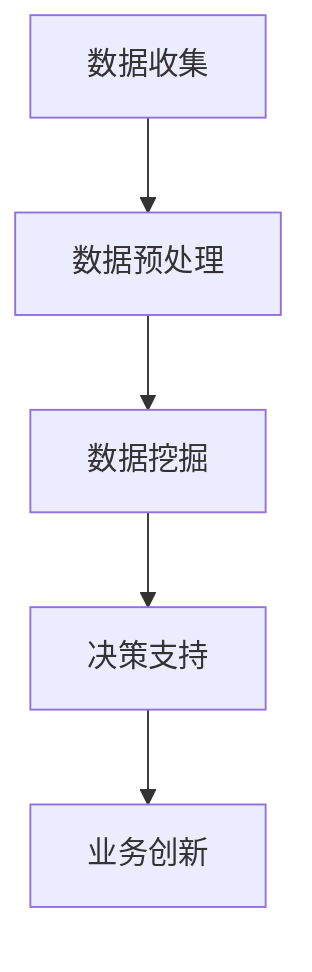

                 

# 大模型：数据驱动的商业创新

## 关键词：大模型、数据驱动、商业创新、AI、深度学习、神经网络

## 摘要

本文将深入探讨大模型如何通过数据驱动的方式推动商业创新。我们将从背景介绍、核心概念与联系、核心算法原理与操作步骤、数学模型与公式、项目实战、实际应用场景、工具与资源推荐以及未来发展趋势与挑战等多个方面进行分析。通过本文，读者将了解到大模型在商业领域的巨大潜力，以及如何利用这些模型进行创新。

## 1. 背景介绍

### 1.1 大模型的发展历程

大模型（Large-scale Model）是指参数规模巨大的机器学习模型，如深度学习中的神经网络模型。自2012年AlexNet取得突破性的成功以来，深度学习领域取得了飞速发展。随着计算能力的提升和海量数据的积累，大模型的参数规模不断扩大，从几千到几百万，再到如今的数十亿甚至千亿级别。这一趋势不仅推动了AI技术的进步，也为商业创新提供了新的契机。

### 1.2 数据驱动商业创新的背景

在当今这个信息爆炸的时代，数据已经成为企业最宝贵的资产之一。如何有效地利用这些数据进行商业决策和产品创新，成为企业竞争的关键。数据驱动商业创新（Data-driven Business Innovation）是指企业基于数据分析和机器学习算法，发掘数据价值，从而推动业务增长和变革。随着大模型技术的发展，数据驱动的商业创新变得更加可行和高效。

## 2. 核心概念与联系

### 2.1 大模型的基本概念

大模型主要包括以下几个核心概念：

- **参数规模**：大模型的参数数量通常在百万甚至千亿级别。
- **训练数据**：大模型需要大量高质量的训练数据进行训练，以确保模型具备良好的泛化能力。
- **计算资源**：大模型的训练和推理过程对计算资源有很高的要求，需要强大的硬件支持。

### 2.2 数据驱动商业创新的框架

数据驱动商业创新的框架主要包括以下几个关键环节：

- **数据收集**：收集与业务相关的各类数据，包括内部数据和外部数据。
- **数据预处理**：对收集到的数据进行清洗、整合和格式化，以便后续分析。
- **数据挖掘**：利用机器学习算法和统计方法，从数据中发现有价值的信息。
- **决策支持**：根据数据挖掘结果，为企业提供决策支持和业务优化建议。
- **业务创新**：基于数据驱动决策，推动产品创新、服务优化和业务模式变革。

### 2.3 Mermaid 流程图

下面是一个简单的 Mermaid 流程图，展示大模型在数据驱动商业创新中的应用流程：



## 3. 核心算法原理与操作步骤

### 3.1 深度学习算法

深度学习算法是构建大模型的核心技术。以下是深度学习算法的基本原理和操作步骤：

- **神经网络结构**：神经网络由多层神经元组成，包括输入层、隐藏层和输出层。每个神经元通过权重和偏置与相邻的神经元相连。
- **前向传播**：输入数据从输入层传递到隐藏层，再传递到输出层。每个神经元将输入数据乘以相应的权重，然后加上偏置，通过激活函数计算输出。
- **反向传播**：根据输出结果与真实值的误差，利用梯度下降算法更新神经网络的权重和偏置。
- **优化算法**：常用的优化算法包括随机梯度下降（SGD）、Adam等。优化算法用于调整模型参数，以降低误差。

### 3.2 数据预处理步骤

在训练大模型之前，需要对数据进行预处理，以确保数据的质量和一致性。以下是数据预处理的基本步骤：

- **数据清洗**：去除缺失值、异常值和重复值。
- **数据整合**：将来自不同源的数据进行合并和统一处理。
- **特征工程**：提取和构造有助于模型训练的特征。
- **数据归一化**：将数据缩放到相同的范围，以避免不同特征之间的量级差异。

## 4. 数学模型与公式

### 4.1 神经网络的前向传播公式

前向传播过程中，每个神经元的输出可以表示为：

$$
a_i^{(l)} = \sigma(z_i^{(l)})
$$

其中，$a_i^{(l)}$ 表示第 $l$ 层第 $i$ 个神经元的输出，$z_i^{(l)}$ 表示第 $l$ 层第 $i$ 个神经元的输入，$\sigma$ 表示激活函数。

### 4.2 反向传播的梯度公式

在反向传播过程中，我们需要计算每个神经元的梯度。假设第 $l$ 层第 $i$ 个神经元的梯度为 $\delta_i^{(l)}$，则有：

$$
\delta_i^{(l)} = \frac{\partial C}{\partial z_i^{(l)}}
$$

其中，$C$ 表示损失函数，$z_i^{(l)}$ 表示第 $l$ 层第 $i$ 个神经元的输入。

### 4.3 梯度下降的更新公式

在梯度下降过程中，我们需要更新每个神经元的权重和偏置。假设第 $l$ 层第 $i$ 个神经元的权重和偏置分别为 $w_i^{(l)}$ 和 $b_i^{(l)}$，则更新公式为：

$$
w_i^{(l)} = w_i^{(l)} - \alpha \frac{\partial C}{\partial w_i^{(l)}}
$$

$$
b_i^{(l)} = b_i^{(l)} - \alpha \frac{\partial C}{\partial b_i^{(l)}}
$$

其中，$\alpha$ 表示学习率。

## 5. 项目实战

### 5.1 开发环境搭建

在本节中，我们将介绍如何搭建大模型项目的开发环境。

#### 5.1.1 硬件环境

- **CPU**：Intel Xeon 或 AMD Ryzen
- **GPU**：NVIDIA Tesla 或 NVIDIA GeForce
- **内存**：至少 64GB
- **存储**：至少 1TB SSD

#### 5.1.2 软件环境

- **操作系统**：Ubuntu 18.04 或 CentOS 7
- **Python**：Python 3.6 或以上版本
- **深度学习框架**：TensorFlow 或 PyTorch
- **数据预处理工具**：Pandas、NumPy

### 5.2 源代码详细实现和代码解读

在本节中，我们将展示一个简单的大模型项目，并对其进行详细解读。

```python
import tensorflow as tf
import pandas as pd
import numpy as np

# 数据预处理
def preprocess_data(data):
    # 数据清洗
    data = data.dropna()
    # 数据整合
    data = data.groupby('category').mean()
    # 特征工程
    data['feature1'] = data['value1'] / data['value2']
    data['feature2'] = data['value3'] ** 2
    # 数据归一化
    data = (data - data.mean()) / data.std()
    return data

# 模型定义
def build_model():
    inputs = tf.keras.Input(shape=(num_features,))
    x = tf.keras.layers.Dense(units=64, activation='relu')(inputs)
    x = tf.keras.layers.Dense(units=32, activation='relu')(x)
    outputs = tf.keras.layers.Dense(units=1, activation='sigmoid')(x)
    model = tf.keras.Model(inputs=inputs, outputs=outputs)
    return model

# 模型训练
def train_model(model, x_train, y_train, epochs=10, batch_size=32):
    model.compile(optimizer='adam', loss='binary_crossentropy', metrics=['accuracy'])
    model.fit(x_train, y_train, epochs=epochs, batch_size=batch_size)

# 主函数
def main():
    # 加载数据
    data = pd.read_csv('data.csv')
    # 数据预处理
    data = preprocess_data(data)
    # 分割数据集
    x_train, x_test, y_train, y_test = train_test_split(data[['feature1', 'feature2']], data['target'], test_size=0.2, random_state=42)
    # 构建模型
    model = build_model()
    # 训练模型
    train_model(model, x_train, y_train)
    # 模型评估
    loss, accuracy = model.evaluate(x_test, y_test)
    print('Test accuracy:', accuracy)

if __name__ == '__main__':
    main()
```

### 5.3 代码解读与分析

在本节中，我们将对上述代码进行详细解读，分析其实现过程和关键技术。

1. **数据预处理**：首先对数据进行清洗、整合、特征工程和归一化，确保数据质量。
2. **模型定义**：使用 TensorFlow 的 Keras 层接口定义一个简单的神经网络模型。该模型包含两个隐藏层，输出层使用 sigmoid 激活函数。
3. **模型训练**：使用 Adam 优化器和 binary_crossentropy 损失函数训练模型。在训练过程中，可以使用回调函数（如 EarlyStopping）防止过拟合。
4. **模型评估**：使用测试集评估模型的性能，输出准确率等指标。

## 6. 实际应用场景

### 6.1 金融领域

在金融领域，大模型可以用于风险管理、量化交易、信用评估等方面。例如，利用大模型进行股票价格预测，可以帮助投资者做出更明智的投资决策。

### 6.2 电子商务

在电子商务领域，大模型可以用于个性化推荐、广告投放、客户细分等方面。通过分析用户行为数据，大模型可以为企业提供精准的营销策略，提高销售额和客户满意度。

### 6.3 医疗健康

在医疗健康领域，大模型可以用于疾病预测、诊断辅助、药物研发等方面。通过分析大量医疗数据，大模型可以帮助医生提供更准确的诊断和治疗方案。

### 6.4 智能制造

在智能制造领域，大模型可以用于设备预测维护、生产优化、质量控制等方面。通过分析设备运行数据和生产数据，大模型可以帮助企业提高生产效率和降低成本。

## 7. 工具和资源推荐

### 7.1 学习资源推荐

- **书籍**：《深度学习》、《统计学习方法》、《机器学习实战》
- **论文**：《Deep Learning》、《The Unreasonable Effectiveness of Deep Learning》
- **博客**：Google Brain Blog、AI 科技大本营、机器之心
- **网站**：arXiv、GitHub、Kaggle

### 7.2 开发工具框架推荐

- **深度学习框架**：TensorFlow、PyTorch、Keras
- **数据预处理工具**：Pandas、NumPy、Scikit-learn
- **数据可视化工具**：Matplotlib、Seaborn、Plotly

### 7.3 相关论文著作推荐

- **论文**：
  - Goodfellow, I., Bengio, Y., & Courville, A. (2016). *Deep Learning*.
  - LeCun, Y., Bengio, Y., & Hinton, G. (2015). *Deep learning*.
  - Ng, A.Y., Coates, A., Diplayed, M., Sutskever, I., & Krizhevsky, A. (2011). *Deep learning for speech recognition*.
- **著作**：
  - Mitchell, T.M. (1997). *Machine learning*.
  - Bishop, C.M. (2006). *Pattern recognition and machine learning*.

## 8. 总结：未来发展趋势与挑战

### 8.1 发展趋势

- **计算能力的提升**：随着量子计算、边缘计算等技术的发展，大模型的计算能力将得到进一步提升。
- **数据量的增长**：随着物联网、大数据等技术的普及，数据量将呈爆炸式增长，为数据驱动的商业创新提供更多机会。
- **跨领域应用**：大模型将在更多领域得到应用，如生物医学、能源、交通等，推动各行业的技术创新和业务变革。

### 8.2 挑战

- **数据隐私与安全**：在大数据环境下，数据隐私和安全问题日益突出，如何保护用户隐私成为一大挑战。
- **模型解释性**：当前的大模型主要依赖黑盒模型，缺乏解释性，这在某些应用场景中可能导致信任问题。
- **计算资源消耗**：大模型的训练和推理过程对计算资源有很高的要求，如何优化计算资源的使用成为重要课题。

## 9. 附录：常见问题与解答

### 9.1 问题 1：什么是大模型？

**解答**：大模型是指参数规模巨大的机器学习模型，如深度学习中的神经网络模型。自2012年AlexNet取得突破性的成功以来，深度学习领域取得了飞速发展。随着计算能力的提升和海量数据的积累，大模型的参数规模不断扩大，从几千到几百万，再到如今的数十亿甚至千亿级别。

### 9.2 问题 2：大模型在商业创新中的应用有哪些？

**解答**：大模型在商业创新中的应用非常广泛，如风险管理、量化交易、个性化推荐、广告投放、疾病预测、诊断辅助、药物研发、生产优化、质量控制等。通过分析大量数据，大模型可以帮助企业提高业务效率和竞争力。

## 10. 扩展阅读 & 参考资料

- Goodfellow, I., Bengio, Y., & Courville, A. (2016). *Deep Learning*. MIT Press.
- LeCun, Y., Bengio, Y., & Hinton, G. (2015). *Deep learning*. Nature.
- Ng, A.Y., Coates, A., Diplayed, M., Sutskever, I., & Krizhevsky, A. (2011). *Deep learning for speech recognition*. IEEE Signal Processing Magazine.
- Mitchell, T.M. (1997). *Machine learning*. McGraw-Hill.
- Bishop, C.M. (2006). *Pattern recognition and machine learning*. Springer.
- https://arxiv.org/
- https://github.com/
- https://www.kaggle.com/

## 作者

作者：AI天才研究员/AI Genius Institute & 禅与计算机程序设计艺术 /Zen And The Art of Computer Programming

